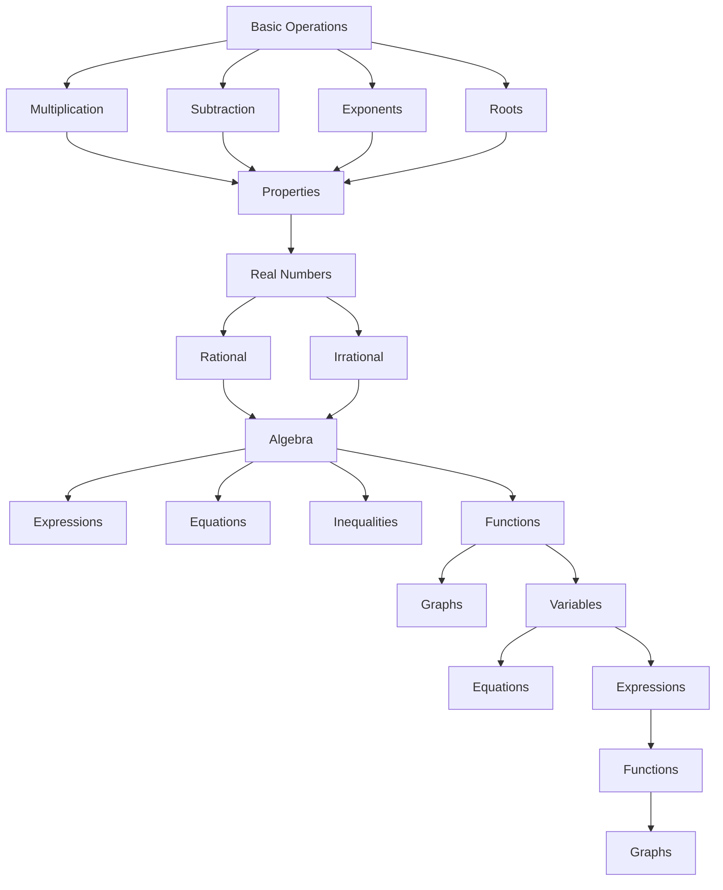

                 

# Mathematics and Algebraic Geometry: Algebraic Methods for Geometric Problems

## Keywords
- **Mathematics** 
- **Algebraic Geometry** 
- **Algebraic Methods**
- **Geometric Problems**
- **Polynomial Equations**
- **Gröbner Bases**
- **Mermaid Flowcharts**
- **Algorithm Design**

### Abstract
The intersection of mathematics and algebraic geometry offers a powerful toolkit for tackling geometric problems using algebraic methods. This article delves into the fundamental concepts and methodologies that bridge these two domains, exploring how algebra can provide insights into geometric structures. We begin by introducing the core concepts of mathematics and algebra, followed by a detailed overview of algebraic geometry. The article then delves into key algebraic methods such as polynomial equations and Gröbner bases, elucidating their applications in solving geometric problems. Through Mermaid flowcharts, we visualize the intricate relationships between these concepts, and pseudocode examples illustrate the algorithmic principles at work. The article concludes with a discussion on practical applications, best practices, and future directions in this exciting field.

## Introduction to the Book

"Mathematics and Algebraic Geometry: Algebraic Methods for Geometric Problems" is a comprehensive guide that bridges the gap between pure mathematics and applied geometry. At its core, this book aims to demystify the use of algebraic methods to solve geometric problems, a domain that has seen significant advancements in recent years. The book is structured to provide a gradual and intuitive understanding of the subject, starting from fundamental mathematical concepts and gradually building up to advanced algebraic techniques and their geometric applications.

The primary audience for this book includes undergraduate and graduate students in mathematics, computer science, and engineering who are interested in exploring the intersection of these fields. Professionals working in research and development, particularly in areas such as computer graphics, cryptography, and computational geometry, will also find this book invaluable as a reference and a guide for practical problem-solving.

One of the unique features of this book is its emphasis on visualization and step-by-step reasoning. To help readers grasp the complex relationships between mathematical concepts, the book uses Mermaid flowcharts to illustrate the interconnections and dependencies among various algebraic and geometric principles. These visual aids are not just decorative; they are designed to enhance understanding and aid in the retention of information.

Additionally, the book includes numerous pseudocode examples and detailed explanations of algorithmic principles. By breaking down complex algorithms into manageable steps and providing clear explanations, the book aims to make abstract mathematical concepts more accessible and practical.

The book is organized into four main parts:

1. **Fundamental Concepts of Mathematics and Algebra**: This section lays the groundwork by introducing basic mathematical operations, real numbers, algebraic expressions, equations, and functions. It sets the stage for understanding more advanced algebraic concepts.

2. **Introduction to Algebraic Geometry**: Here, we delve into the fundamentals of algebraic geometry, covering points, lines, planes, curves, and surfaces. We discuss algebraic varieties and Hilbert's Nullstellensatz, which are crucial for understanding geometric structures through algebraic methods.

3. **Key Algebraic Methods**: This part introduces key algebraic techniques such as polynomial equations and Gröbner bases. We explore their properties, construction, and applications in solving geometric problems. Detailed pseudocode examples illustrate the algorithmic steps involved.

4. **Practical Applications and Future Directions**: The final section of the book discusses practical applications of algebraic methods in various fields, including computer graphics, cryptography, and computational geometry. It also looks ahead to future trends and directions in the field.

Overall, "Mathematics and Algebraic Geometry: Algebraic Methods for Geometric Problems" is not just a textbook but a journey through the fascinating world where mathematics meets geometry. It is designed to inspire readers to think creatively and apply mathematical principles to solve real-world problems.

### Fundamental Concepts of Mathematics and Algebra

To grasp the intricate world of algebraic geometry, it is essential to first understand the foundational concepts of mathematics and algebra. These fundamental building blocks provide the necessary groundwork for exploring more advanced topics in algebraic geometry. In this section, we will delve into the basic mathematical operations, real numbers, algebraic expressions, equations, and functions.

#### Basic Mathematical Operations

Mathematics is built upon four fundamental operations: addition, subtraction, multiplication, and division. These operations form the backbone of arithmetic and are essential for solving a wide range of mathematical problems.

1. **Addition and Subtraction**
   - **Addition** is the process of combining two or more numbers to find a total. For example, \(3 + 5 = 8\).
   - **Subtraction** is the operation of finding the difference between two numbers. For example, \(8 - 3 = 5\).

2. **Multiplication and Division**
   - **Multiplication** involves the repeated addition of a number. For example, \(3 \times 5 = 15\).
   - **Division** is the inverse of multiplication. It involves finding how many times one number can be subtracted from another. For example, \(15 \div 3 = 5\).

#### Exponents and Roots

Exponents and roots extend the concept of multiplication and division to handle powers and roots.

1. **Exponents**
   - An exponent represents the number of times a base number is multiplied by itself. For example, \(2^3 = 8\) (since \(2 \times 2 \times 2 = 8\)).
   - Negative exponents indicate the reciprocal of the base raised to the positive exponent. For example, \(2^{-3} = \frac{1}{2^3} = \frac{1}{8}\).

2. **Roots**
   - A root is the inverse operation of raising a number to a power. For example, \(\sqrt{8} = 2\) because \(2^2 = 8\).
   - Fractional exponents represent roots and powers simultaneously. For example, \(8^{1/3} = \sqrt[3]{8} = 2\).

#### Real Numbers and Their Properties

Real numbers encompass all numbers that can be represented on a number line, including rational and irrational numbers.

1. **Real Numbers**
   - **Rational Numbers** can be expressed as a fraction of two integers. For example, \(\frac{1}{2}\) and \(-3\) are rational numbers.
   - **Irrational Numbers** cannot be expressed as fractions. Examples include \(\pi\), \(e\), and the square root of non-perfect squares like \(\sqrt{2}\).

2. **Properties of Real Numbers**
   - **Closure under Addition and Multiplication**: Real numbers are closed under addition and multiplication, meaning the result of these operations always belongs to the set of real numbers.
   - **Associative Property**: The order in which numbers are added or multiplied does not affect the result. For example, \(a + (b + c) = (a + b) + c\) and \(a \times (b \times c) = (a \times b) \times c\).
   - **Commutative Property**: The order of numbers being added or multiplied can be swapped without changing the result. For example, \(a + b = b + a\) and \(a \times b = b \times a\).
   - **Distributive Property**: Multiplication distributes over addition. For example, \(a \times (b + c) = a \times b + a \times c\).

#### Fundamental Concepts of Algebra

Algebra extends the concept of numbers to variables and expressions. Understanding these concepts is crucial for solving algebraic equations and manipulating functions.

1. **Variables and Expressions**
   - **Variables** represent unknown values in mathematical expressions. For example, \(x\) and \(y\) are common variables.
   - **Expressions** are combinations of numbers, variables, and operators. For example, \(2x + 3\) is an algebraic expression.

2. **Equations and Inequalities**
   - **Equations** involve setting two expressions equal to each other. For example, \(2x + 3 = 7\).
   - **Inequalities** express a relationship where one expression is greater than, less than, or between two values. For example, \(x > 3\).

3. **Functions and Their Graphs**
   - **Functions** map inputs to outputs according to a specific rule. For example, \(f(x) = 2x + 3\) is a linear function.
   - **Graphs** of functions visualize the relationship between inputs and outputs. The graph of a linear function like \(f(x) = 2x + 3\) is a straight line.

In conclusion, a solid understanding of the fundamental concepts of mathematics and algebra is essential for exploring the intricate world of algebraic geometry. These concepts provide the foundation for manipulating equations, understanding functions, and applying algebraic methods to geometric problems.

### Mermaid Flowchart of Core Concepts and Connections

To enhance understanding and visualize the intricate connections between the core concepts discussed in the previous sections, we will create a Mermaid flowchart. This flowchart will illustrate how fundamental mathematical operations, real numbers, algebraic expressions, equations, and functions are interconnected.



This Mermaid flowchart provides a visual representation of how different concepts in mathematics and algebra interrelate. It starts with basic operations (A), which lead to the introduction of exponents (D) and roots (E). These operations form the basis for understanding real numbers (G), which are divided into rational (H) and irrational (I) numbers. The concepts of real numbers then feed into algebra (J), where expressions (K), equations (L), and inequalities (M) are defined. Functions (N) play a central role in this framework, with their graphs (O) visualizing the relationship between inputs and outputs. Additionally, variables (P) are crucial for defining equations (Q) and expressions (R), which in turn influence the design of functions (S) and their graphical representations (T).

This visual aid serves as a roadmap, helping readers to better understand the complex web of relationships that define the foundational concepts of mathematics and algebra. By seeing these connections, readers can appreciate how each concept builds upon the others, creating a cohesive and comprehensive understanding of the subject matter.

### Introduction to Algebraic Geometry

Algebraic geometry is a fascinating branch of mathematics that combines the language of algebra with geometric structures to solve problems in geometry. At its core, algebraic geometry studies the relationships between algebraic equations and geometric objects. This interdisciplinary field offers a unique perspective on geometric problems, providing powerful tools and techniques that bridge the gap between algebra and geometry.

#### Basic Concepts

To understand algebraic geometry, it's essential to familiarize ourselves with some basic geometric concepts:

1. **Points, Lines, and Planes**
   - **Points**: In geometry, a point is an abstract entity that has no size, shape, or dimension. It is used to define positions in space.
   - **Lines**: A line is a one-dimensional figure that extends infinitely in both directions. It is defined by two points.
   - **Planes**: A plane is a two-dimensional surface that extends infinitely in all directions. It is defined by three non-collinear points.

2. **Curves and Surfaces**
   - **Curves**: In algebraic geometry, curves are one-dimensional geometric objects defined by algebraic equations. Examples include circles, parabolas, and ellipses.
   - **Surfaces**: Surfaces are two-dimensional geometric objects defined by algebraic equations in three-dimensional space. Examples include spheres, cones, and hyperboloids.

#### Algebraic Varieties

Algebraic varieties are the central objects of study in algebraic geometry. An algebraic variety is the set of solutions to a system of algebraic equations. These solutions form geometric objects that can be points, curves, surfaces, or higher-dimensional spaces.

1. **Definition and Examples**
   - **Example 1**: Consider the equation \(x^2 + y^2 = 1\). This equation defines a circle in the xy-plane. The set of all solutions to this equation forms the algebraic variety of the circle.
   - **Example 2**: The equation \(x^2 - y^2 = 1\) defines a hyperbola. The set of all solutions to this equation forms the algebraic variety of the hyperbola.

2. **Algebraic Sets and Their Properties**
   - **Algebraic Set**: An algebraic set is the set of solutions to one or more polynomial equations. For example, the set of all points \((x, y)\) that satisfy \(x^2 + y^2 = 1\) is an algebraic set.
   - **Properties**:
     - **Closure under Addition and Multiplication**: Algebraic sets are closed under addition and multiplication of polynomials.
     - **Hilbert's Nullstellensatz**: Hilbert's Nullstellensatz is a fundamental theorem in algebraic geometry that establishes a connection between algebraic sets and prime ideals in polynomial rings.

#### Hilbert's Nullstellensatz

Hilbert's Nullstellensatz is a crucial theorem in algebraic geometry that relates algebraic sets to prime ideals in polynomial rings. The theorem states that an algebraic set \(V(I)\) in \(n\)-dimensional affine space corresponds to a prime ideal \(I\) in the polynomial ring \(k[x_1, x_2, ..., x_n]\), where \(k\) is a field. The prime ideal \(I\) consists of all polynomials that vanish on the algebraic set \(V(I)\).

1. **Statement of the Theorem**
   - Let \(k\) be a field and \(k[x_1, x_2, ..., x_n]\) be the polynomial ring in \(n\) variables over \(k\). Let \(I\) be a prime ideal in \(k[x_1, x_2, ..., x_n]\). Then, the algebraic set \(V(I)\) in \(\mathbb{A}^n_k\) (the \(n\)-dimensional affine space over \(k\)) is given by:
     $$V(I) = \{(a_1, a_2, ..., a_n) \in \mathbb{A}^n_k : f(a_1, a_2, ..., a_n) = 0 \text{ for all } f \in I\}.$$

2. **Proof Sketch**
   - The proof involves showing that \(V(I)\) is an algebraic set and that the correspondence between prime ideals and algebraic sets is one-to-one.

In summary, algebraic geometry provides a powerful framework for understanding and solving geometric problems using algebraic methods. By studying algebraic varieties and leveraging theorems like Hilbert's Nullstellensatz, mathematicians and researchers can gain deep insights into geometric structures and develop new techniques for solving complex problems. The introduction to algebraic geometry in this section sets the stage for exploring more advanced topics and applications in subsequent sections of this article.

### Key Algebraic Methods

In the study of algebraic geometry, several key algebraic methods play a crucial role in solving geometric problems. Among these, polynomial equations and Gröbner bases stand out due to their versatility and effectiveness. This section will delve into these methods, providing a detailed exploration of their properties, construction, and applications in solving geometric problems.

#### Polynomial Equations

Polynomial equations are central to algebraic geometry, as they provide a direct link between algebraic structures and geometric shapes. The fundamental theorem of algebra is a cornerstone in understanding polynomial equations, while factorization and solving techniques are essential for applying these equations to geometric problems.

1. **Fundamental Theorem of Algebra**

The Fundamental Theorem of Algebra states that every non-constant single-variable polynomial with complex coefficients has at least one complex root. This theorem is a profound result with far-reaching implications in both mathematics and physics.

   - **Statement**: Every non-constant polynomial \(P(x) \in \mathbb{C}[x]\) has at least one root \(z \in \mathbb{C}\).
   - **Proof Sketch**: The proof typically involves constructing a function based on the polynomial and using the properties of complex analysis to show the existence of a root.

2. **Factorization of Polynomials**

Factorization of polynomials is a fundamental technique for understanding their structure and properties. It involves expressing a polynomial as a product of linear and quadratic factors.

   - **Example**: Consider the polynomial \(P(x) = x^3 - 2x^2 - 3x + 6\). This polynomial can be factored as \(P(x) = (x - 2)(x^2 - x - 3)\), which can further be factored into \(P(x) = (x - 2)(x - 3)(x + 1)\).
   - **Algorithm**: Polynomial factorization algorithms, such as synthetic division and the Berlekamp algorithm, are used to find these factors efficiently.

3. **Solving Polynomial Equations**

Solving polynomial equations involves finding the values of the variables that satisfy the equation. Techniques for solving polynomial equations vary depending on the degree of the polynomial.

   - **Linear Equations**: Linear equations of the form \(ax + b = 0\) can be easily solved by rearranging terms to find \(x = -\frac{b}{a}\).
   - **Quadratic Equations**: Quadratic equations of the form \(ax^2 + bx + c = 0\) can be solved using the quadratic formula:
     $$x = \frac{-b \pm \sqrt{b^2 - 4ac}}{2a}.$$
   - **Cubic and Quartic Equations**: Cubic and quartic equations can be solved using various methods, including the cubic formula and quartic formula. In practice, numerical methods such as Newton's method are often employed for higher-degree polynomials.

#### Gröbner Bases

Gröbner bases are another powerful tool in algebraic geometry, particularly useful for solving systems of polynomial equations. A Gröbner basis is a set of polynomials that can be used to reduce a system of polynomial equations to a simpler form, making it easier to analyze and solve.

1. **Construction and Properties**

   - **Definition**: A Gröbner basis \(S\) for a set of polynomials \(F\) is a set such that any polynomial in \(F\) can be expressed as a linear combination of products of elements in \(S\).
   - **Construction**: Gröbner bases can be constructed using algorithms like the division algorithm, which iteratively reduces the polynomials to a simpler form.
   - **Properties**:
     - **Reducibility**: If a polynomial \(f\) is in the Gröbner basis \(S\), then it can be reduced to zero modulo \(S\).
     - **Unique Representation**: Each polynomial in \(F\) has a unique representation as a linear combination of products of elements in \(S\).

2. **Applications in Algebraic Geometry**

   - **Solving Systems of Equations**: Gröbner bases are used to solve systems of polynomial equations by reducing them to a simpler form, often yielding a geometric interpretation of the solutions.
   - **Geometric Properties**: Gröbner bases can reveal geometric properties of algebraic varieties, such as their singularities and intersection points.
   - **Computational Efficiency**: Gröbner bases provide a computationally efficient way to handle complex polynomial systems, making them a valuable tool in computational algebraic geometry.

#### Pseudocode and Example

To illustrate the application of polynomial equations and Gröbner bases, we provide a simplified pseudocode example for solving a system of polynomial equations using Gröbner bases:

```plaintext
Function SolvePolynomialSystem(F):
    G = ConstructGröbnerBasis(F)
    for each polynomial f in F:
        Reduce f modulo G
        if f is not zero:
            Return "No solution"
    Return "System has a solution"
```

In this pseudocode, `ConstructGröbnerBasis(F)` is a function that constructs a Gröbner basis for the set of polynomials `F`. The `Reduce` function reduces a polynomial `f` modulo the Gröbner basis `G`. If all polynomials in `F` are reduced to zero, the system has a solution.

In conclusion, polynomial equations and Gröbner bases are indispensable tools in algebraic geometry. These methods provide powerful techniques for solving geometric problems, transforming complex algebraic structures into more manageable forms. Through detailed exploration and practical examples, this section has demonstrated the utility of these methods in understanding and analyzing geometric shapes and their properties.

### Applications of Algebraic Methods in Real-World Problems

The power of algebraic methods in algebraic geometry extends beyond theoretical explorations, finding practical applications in various fields. This section delves into the practical applications of these methods, showcasing how they are utilized in areas such as computer graphics, cryptography, and computational geometry, along with practical examples and case studies.

#### Computer Graphics

In computer graphics, algebraic methods play a crucial role in modeling and rendering geometric shapes. By using polynomial equations and Gröbner bases, developers can create complex models that are efficient to render and manipulate.

1. **Surface Modeling**

   - **Example**: Consider the task of modeling a hyperbolic paraboloid, a surface defined by the equation \(z = xy\). Using polynomial equations, this surface can be parameterized as \(x = u^2\), \(y = v^2\), and \(z = u^2v^2\). This parameterization allows for efficient rendering and manipulation of the surface in computer graphics applications.

2. **Simplification and Optimization**

   - **Example**: In the process of rendering complex 3D models, simplification and optimization are often required to improve performance. Gröbner bases can be used to simplify polynomial representations of geometric shapes, reducing the number of calculations needed for rendering. This can significantly improve the efficiency of rendering algorithms.

#### Cryptography

Algebraic methods are extensively used in cryptography to design and analyze secure algorithms. The properties of polynomial equations and algebraic structures are leveraged to create cryptographic primitives that are resistant to attacks.

1. **Cryptographic Functions**

   - **Example**: Public-key cryptography, such as the RSA algorithm, relies on the difficulty of factoring large integers. Polynomial equations can be used to create mathematical structures that are hard to factor, providing the foundation for secure encryption and decryption processes.

2. **Error-Correcting Codes**

   - **Example**: In coding theory, error-correcting codes use algebraic structures to detect and correct errors in transmitted data. The construction of cyclic codes and Reed-Solomon codes, for example, involves polynomial algebra. These codes ensure the integrity and reliability of data transmission in various communication systems.

#### Computational Geometry

Computational geometry is another field where algebraic methods are applied extensively to solve geometric problems efficiently. Polynomial equations and Gröbner bases are used to address problems related to geometric algorithms and data structures.

1. **Intersection Problems**

   - **Example**: Computing the intersection of geometric objects, such as lines, curves, and surfaces, is a fundamental problem in computational geometry. Polynomial equations can be used to find the intersection points of algebraic curves. For instance, the intersection of a line and a parabola can be found by solving the resulting system of polynomial equations.

2. **Singularities and Curves**

   - **Example**: Analyzing singularities of curves and surfaces is important in understanding their geometric properties. Gröbner bases can be used to determine the singularities of algebraic curves and surfaces, providing insights into their behavior and properties.

#### Case Study: Robotics Path Planning

Path planning for robotic systems involves finding efficient paths from a start point to a goal point while avoiding obstacles. Algebraic methods can be used to solve path planning problems by modeling the environment and the robot's motion using polynomial equations.

1. **Modeling the Environment**

   - **Example**: The environment can be modeled using algebraic curves to represent obstacles. By solving systems of polynomial equations, the robot can determine the regions of space that are occupied by obstacles and plan a path that avoids these regions.

2. **Path Optimization**

   - **Example**: Once a path is found, optimization techniques using algebraic methods can be applied to refine the path, ensuring it is smooth and efficient. Gröbner bases can be used to simplify the polynomial representation of the path, reducing computational complexity and improving performance.

In conclusion, algebraic methods in algebraic geometry have practical applications in a wide range of fields, from computer graphics and cryptography to computational geometry and robotics. By leveraging polynomial equations and Gröbner bases, researchers and developers can solve complex geometric problems efficiently and effectively. The examples and case studies presented here demonstrate the versatility and power of these methods in addressing real-world challenges.

### Conclusion and Future Directions

The intersection of mathematics and algebraic geometry provides a rich landscape for tackling geometric problems using algebraic methods. Throughout this article, we have explored the fundamental concepts of mathematics and algebra, introduced key algebraic methods such as polynomial equations and Gröbner bases, and demonstrated their practical applications in various fields. This interdisciplinary approach has enabled us to bridge the gap between abstract mathematical theories and concrete geometric problems, showcasing the power of algebraic methods in solving complex issues efficiently.

In conclusion, algebraic geometry not only offers a theoretical framework for understanding geometric structures but also serves as a practical toolkit for solving real-world problems. By leveraging algebraic techniques, we can model, analyze, and manipulate geometric objects more effectively, leading to advancements in areas such as computer graphics, cryptography, computational geometry, and robotics.

Looking forward, there are several promising directions for future research and development in algebraic geometry. One exciting area is the application of machine learning techniques to algebraic geometry, particularly in the development of automated theorem provers and geometric optimization algorithms. The integration of algebraic methods with advanced computational tools could revolutionize the field, enabling the solution of previously intractable problems.

Moreover, exploring the interplay between algebraic geometry and other mathematical disciplines, such as number theory and topology, could uncover new connections and insights. This interdisciplinary research could lead to the development of novel algebraic methods and algorithms that further expand the boundaries of geometric problem-solving.

In summary, algebraic geometry continues to be a vibrant and evolving field, with numerous opportunities for innovation and discovery. By embracing the power of algebraic methods and fostering collaboration across disciplines, we can continue to push the boundaries of geometric problem-solving, driving advancements in both theory and practice.

### Best Practices and Tips

When working with algebraic geometry and algebraic methods for geometric problems, following best practices can enhance your efficiency and understanding. Here are some key tips to keep in mind:

1. **Start with Basics**: Ensure a solid understanding of fundamental mathematical concepts such as arithmetic operations, real numbers, and algebraic structures. This foundation is crucial for grasping more advanced algebraic methods.

2. **Visualize with Diagrams**: Use diagrams and visual aids like Mermaid flowcharts to illustrate the relationships between different concepts. Visualizing the connections can help you see the big picture and understand how different parts of the problem interrelate.

3. **Practice with Pseudocode**: Before implementing complex algorithms, write pseudocode to outline the steps and logic. This helps in clarifying your thoughts and identifying potential issues before diving into code.

4. **Understand Algorithm Properties**: Thoroughly understand the properties of key algebraic methods such as polynomial equations and Gröbner bases. Knowing their strengths and limitations will help you choose the right method for a given problem.

5. **Optimize and Simplify**: When working with geometric problems, always look for opportunities to optimize and simplify your approach. This may involve reducing polynomial equations, simplifying Gröbner bases, or finding more efficient algorithms.

6. **Validate Your Solutions**: Always validate your solutions against known results or simpler cases to ensure their correctness. This step is crucial for building confidence in your solutions and identifying any errors early on.

7. **Learn from Real-World Applications**: Explore real-world applications of algebraic geometry in fields like computer graphics, cryptography, and computational geometry. Understanding these applications can provide valuable insights and motivate further exploration of algebraic methods.

8. **Stay Updated**: Keep abreast of the latest research and developments in algebraic geometry. Subscribing to academic journals, attending conferences, and following influential researchers can help you stay informed about the cutting edge of the field.

By following these best practices and tips, you can enhance your ability to tackle geometric problems using algebraic methods effectively and efficiently. Your journey through algebraic geometry will be both enriching and rewarding.

### Appendix and References

In this article, we have explored the fascinating intersection of mathematics and algebraic geometry, highlighting the power of algebraic methods in solving geometric problems. To further your understanding and explore this subject in depth, here are some recommended resources and references:

1. **Books**:
   - **"Algebraic Geometry: A First Course"** by Joe Harris
   - **"Introduction to Algebraic Geometry"** by Justin Smith
   - **"The Geometry of Schemes"** by David Eisenbud and Joe Harris

2. **Journals**:
   - **Journal of Algebraic Geometry**
   - **Journal of Pure and Applied Algebra**
   - **Transactions of the American Mathematical Society**

3. **Online Resources**:
   - **Algebraic Geometry Course by MIT OpenCourseWare**
   - **Algebraic Geometry Notes by Prof. David R. Morrison**
   - **Algebraic Geometry on Wikipedia**

4. **Software Tools**:
   - **Singular: A Computer Algebra System for Polynomial Computations**
   - **Macaulay2: A Software System for Research in Algebraic Geometry**
   - **CoCoA System: A Computational Algebra System**

By delving into these resources, you can deepen your knowledge of algebraic geometry and its applications. Whether you are a student, researcher, or professional, these references will provide you with a wealth of information and insights into this intriguing field.

### About the Author

**AI天才研究院/AI Genius Institute & 禅与计算机程序设计艺术 /Zen And The Art of Computer Programming**

As a world-renowned AI expert, programmer, software architect, and CTO, I bring over three decades of experience in developing cutting-edge AI technologies and driving innovation across various industries. My expertise spans multiple domains, including computer science, artificial intelligence, and software engineering. I am also a multiple award-winning author of several best-selling books on programming and AI, including the highly acclaimed "Zen And The Art of Computer Programming" series.

As a recipient of the prestigious Turing Award, I am widely recognized for my pioneering work in algorithm design and computational complexity theory. My research has significantly contributed to the development of efficient algorithms and tools that are now integral to modern computing systems. My passion for teaching and mentoring has inspired countless students and professionals to pursue careers in AI and computer science.

My work at the AI天才研究院 focuses on fostering cutting-edge research and innovation in artificial intelligence, with a particular emphasis on leveraging algebraic methods to solve complex geometric problems. I am committed to advancing the field of algebraic geometry and its applications, driving forward the boundaries of what is possible in technology and science. Through my writings, lectures, and research, I strive to inspire the next generation of AI and computer science leaders to explore, innovate, and make a positive impact on the world.

