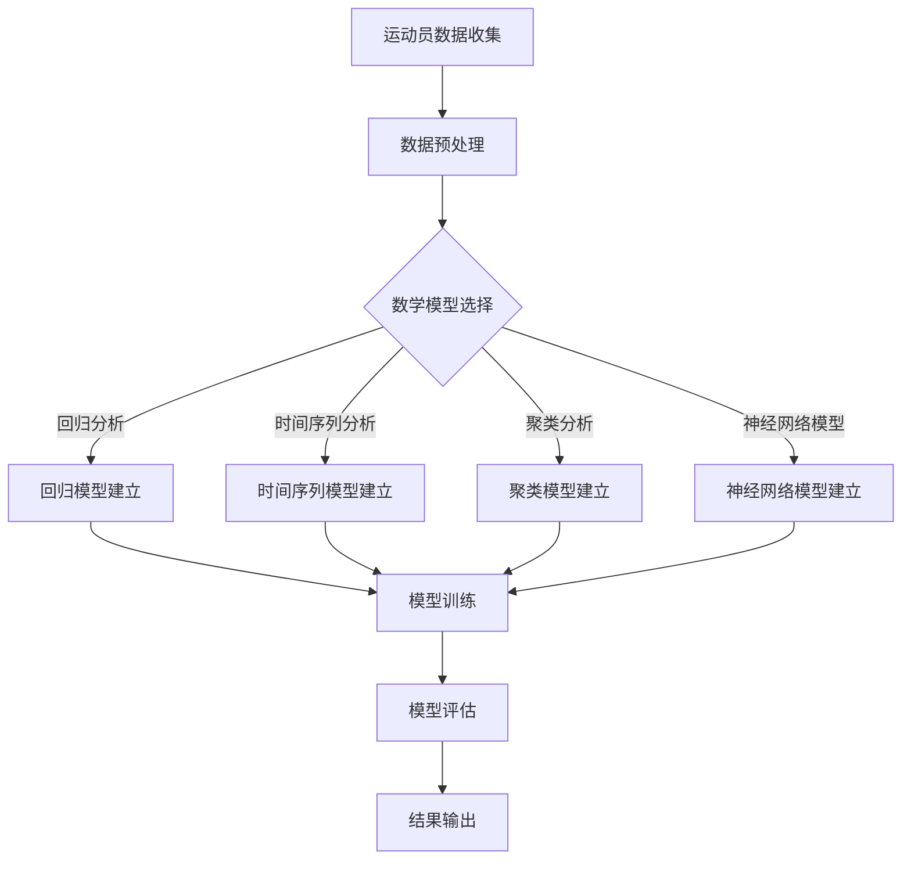

                 

### 引言与背景

在现代体育管理中，如何科学、系统地评估运动员的表现已成为一个重要的研究方向。运动表现数学分析作为一种新兴的评估方法，通过运用数学模型和统计分析方法，为体育管理者提供了更精确、更有效的评估工具。本文旨在探讨数学与体育管理之间的关系，特别是运动表现的数学分析方法，通过系统的理论讲解和实际案例分析，为读者提供全面而深入的见解。

#### 数学与体育管理的关系

数学作为一种基础的学科，其理论与方法在各个领域都有广泛的应用。在体育管理中，数学的应用主要体现在对运动员表现的科学评估和训练策略的优化。通过对运动员的体能、技术、战术等多方面数据进行量化分析，数学模型能够帮助体育管理者更客观地了解运动员的状态，从而制定更合理的训练计划。

#### 运动表现的数学分析重要性

运动表现的数学分析在体育管理中的重要性不容忽视。首先，它提供了客观、量化的评估指标，使评估过程更加科学和准确。其次，通过分析运动员的数据，可以发现表现中的潜在规律，为优化训练和比赛策略提供依据。最后，运动表现的数学分析还可以预测运动员的未来表现，为长期规划提供参考。

#### 运动表现数学分析的历史与发展

运动表现的数学分析并非一个全新的概念，其历史可以追溯到20世纪初。最早的尝试是将力学和运动学应用于运动员的运动分析。随着计算机技术的发展和统计方法的进步，运动表现数学分析逐渐形成了自己的理论体系。如今，借助大数据和人工智能技术，运动表现数学分析已经变得更加精确和高效。

### 背景介绍

在现代体育竞技中，运动员的表现不仅取决于个人能力，还受到团队协作、训练环境、心理状态等多种因素的影响。传统的评估方法往往依赖于教练的主观判断，难以做到客观、全面。而运动表现的数学分析则通过客观数据的收集和分析，为体育管理者提供了更为科学和可靠的评估依据。

#### 运动表现的数学分析在体育管理中的应用

运动表现的数学分析在体育管理中的应用非常广泛，包括以下几个方面：

1. **运动员选拔与评估**：通过数据分析，评估运动员的潜力、技术水平和体能状况，帮助体育管理者进行科学选拔和培养。
   
2. **训练策略制定**：基于运动员的表现数据，制定个性化的训练计划，优化训练效果。

3. **比赛策略分析**：通过分析对手的表现数据，制定有效的比赛策略，提高比赛胜率。

4. **心理状态评估**：运动员的心理状态对表现有重要影响。通过数据分析，可以评估运动员的心理状态，并提供相应的心理辅导。

#### 运动表现数学分析的重要性

运动表现的数学分析对于体育管理者来说具有重要意义。首先，它提供了一种科学、客观的评估方法，使决策更加精准。其次，通过数据分析，可以发现运动员的潜在优势和劣势，为教练和运动员提供改进的方向。最后，运动表现的数学分析还可以预测未来的发展趋势，为长期规划提供依据。

#### 运动表现数学分析的历史与发展

运动表现的数学分析作为一个研究领域，有着悠久的历史。最早的运动表现分析可以追溯到20世纪初，当时科学家们开始将力学和运动学应用于运动员的运动分析。随着计算机技术的快速发展，运动表现数学分析得到了迅速发展。现在，借助大数据和人工智能技术，运动表现数学分析已经变得更加精确和高效。

### 总结

本文介绍了数学与体育管理之间的关系，特别是运动表现的数学分析方法。通过系统的理论讲解和实际案例分析，我们看到了运动表现数学分析在体育管理中的重要性。随着技术的不断进步，运动表现的数学分析将在未来发挥更加重要的作用，为体育管理者提供更强大的工具，助力运动员的全面提升。

### 关键词

- 数学与体育管理
- 运动表现数学分析
- 数据分析
- 统计模型
- 训练策略
- 比赛策略
- 运动员评估

### 摘要

本文探讨了数学在体育管理中的应用，特别是运动表现的数学分析方法。通过系统的理论讲解和实际案例分析，本文揭示了运动表现数学分析在体育管理中的重要性，包括运动员选拔与评估、训练策略制定、比赛策略分析和心理状态评估等方面。文章最后展望了运动表现数学分析的未来发展趋势，以及其在体育管理中的潜在贡献。

---

### 目录大纲设计思路

为了确保《数学与体育管理：运动表现的数学分析》一书的内容结构清晰、逻辑严密，我们采取了以下步骤进行目录大纲的设计。

#### 总体结构规划

首先，我们需要明确本书的主线，即“数学与体育管理”在运动表现数学分析中的应用。根据这个主题，我们将内容分为以下几个部分：

1. **引言与背景**：介绍数学与体育管理的关系，以及运动表现的数学分析的重要性和历史发展。
2. **数学理论基础**：包括数学模型、数学公式以及相关的数学分析理论。
3. **体育管理应用**：结合体育管理的实际需求，应用数学模型分析运动表现。
4. **案例分析**：通过实际案例分析，展示数学分析在体育管理中的具体应用。
5. **实战指南**：提供实用的指南，帮助读者将数学分析应用于体育管理。
6. **总结与展望**：对整本书的内容进行总结，并对未来研究方向进行展望。

#### 内容细化与章节设计

在总体结构规划的基础上，我们对每个部分的内容进行了细化，设计出了具体的章节结构：

- **引言与背景**
  - **第1章** 数学与体育管理概述
    - 1.1 数学与体育管理的关系
    - 1.2 运动表现的数学分析重要性
    - 1.3 运动表现数学分析的历史与发展

- **数学理论基础**
  - **第2章** 数学模型与理论
    - 2.1 常用数学模型介绍
    - 2.2 数学公式与数学分析理论
    - 2.3 数学模型在体育管理中的应用
    - 2.4 Mermaid流程图：运动表现数学分析架构

  - **第3章** 数学分析在体育管理中的应用
    - 3.1 运动表现指标体系
    - 3.2 数据收集与处理
    - 3.3 运动表现预测模型

- **体育管理应用**
  - **第4章** 案例研究
    - 4.1 篮球运动员表现分析
    - 4.2 足球运动员表现分析
    - 4.3 田径运动员表现分析

- **实战指南**
  - **第5章** 实战指南
    - 5.1 实战工具与环境搭建
    - 5.2 运动表现分析案例实战
    - 5.3 运动表现分析报告撰写

- **总结与展望**
  - **第6章** 总结与展望
    - 6.1 运动表现数学分析总结
    - 6.2 未来研究方向与挑战
    - 6.3 对体育管理的贡献与影响

#### 特殊内容设计

为了增强文章的可读性和内容的直观性，我们在设计目录大纲时，特别考虑了以下特殊内容设计：

- **Mermaid流程图**：在第1章和第2章中，使用Mermaid语法绘制核心概念和架构的流程图，以帮助读者更好地理解数学模型和理论。
- **伪代码与数学公式**：在第2章和第3章中，使用伪代码详细阐述核心算法原理，并在独立段落中使用LaTeX格式展示数学公式和详细讲解。
- **实际案例与代码分析**：在第4章和第5章中，提供实际案例，详细解释运动表现分析的代码实现和解读。

通过这些特殊内容设计，我们希望读者能够更直观、更深入地理解运动表现的数学分析理论，并在实际操作中能够灵活应用。

### 完整性、简洁性与详细讲解

在目录大纲的设计过程中，我们特别注重了完整性、简洁性和详细讲解的要求：

- **完整性**：每个章节都涵盖了运动表现数学分析的一个关键方面，从理论到应用，再到实战指南，确保读者能够全面了解这一领域。
- **简洁性**：在内容细化过程中，我们力求用简洁明了的语言描述复杂的概念，使读者易于理解。
- **详细讲解**：在每个章节中，我们都提供了具体的示例、流程图和伪代码，以及详细的数学公式和算法原理讲解，确保读者能够深入理解并应用这些知识。

通过这些设计思路，我们希望能够为读者提供一本既系统全面、又实用易懂的专业书籍，帮助他们在运动表现数学分析领域取得更好的成果。

## 1. 总体结构规划

为了确保《数学与体育管理：运动表现的数学分析》一书的内容逻辑清晰、结构紧凑且易于读者理解，我们首先进行了详细的总体结构规划。这一过程涉及对书籍整体框架的构建、各个章节内容的设定以及章节之间的逻辑关系安排。

### 明确主线

首先，我们明确了书籍的主线，即“数学与体育管理”在运动表现数学分析中的应用。这一主线贯穿整本书，确保了内容的统一性和连贯性。通过将数学理论与体育管理实际需求相结合，我们能够展示数学分析在体育管理中的实际应用价值。

### 内容划分

根据主线，我们将书籍内容划分为以下五个主要部分：

1. **引言与背景**：介绍数学与体育管理的关系，以及运动表现的数学分析的重要性和历史发展。
2. **数学理论基础**：包括数学模型、数学公式以及相关的数学分析理论。
3. **体育管理应用**：结合体育管理的实际需求，应用数学模型分析运动表现。
4. **案例分析**：通过实际案例分析，展示数学分析在体育管理中的具体应用。
5. **实战指南**：提供实用的指南，帮助读者将数学分析应用于体育管理。

### 确定章节结构

在确定了整体框架后，我们对每个部分进行了进一步的章节结构设计。以下是具体的章节安排及其内容概述：

- **引言与背景**
  - **第1章** 数学与体育管理概述
    - 1.1 数学与体育管理的关系
    - 1.2 运动表现的数学分析重要性
    - 1.3 运动表现数学分析的历史与发展

- **数学理论基础**
  - **第2章** 数学模型与理论
    - 2.1 常用数学模型介绍
    - 2.2 数学公式与数学分析理论
    - 2.3 数学模型在体育管理中的应用
    - 2.4 Mermaid流程图：运动表现数学分析架构

  - **第3章** 数学分析在体育管理中的应用
    - 3.1 运动表现指标体系
    - 3.2 数据收集与处理
    - 3.3 运动表现预测模型

- **体育管理应用**
  - **第4章** 案例研究
    - 4.1 篮球运动员表现分析
    - 4.2 足球运动员表现分析
    - 4.3 田径运动员表现分析

- **实战指南**
  - **第5章** 实战指南
    - 5.1 实战工具与环境搭建
    - 5.2 运动表现分析案例实战
    - 5.3 运动表现分析报告撰写

- **总结与展望**
  - **第6章** 总结与展望
    - 6.1 运动表现数学分析总结
    - 6.2 未来研究方向与挑战
    - 6.3 对体育管理的贡献与影响

### 设计思路

在规划总体结构时，我们考虑了以下设计思路：

1. **逻辑性与连贯性**：每个章节的内容都是基于前一章的延伸，确保了整体逻辑的连贯性和内容的层次感。
2. **理论与实践相结合**：既涵盖了数学理论基础，也结合了实际应用案例和实战指南，使读者能够学以致用。
3. **特殊内容设计**：通过Mermaid流程图、伪代码、数学公式等特殊内容设计，增强了文章的可读性和直观性。
4. **内容丰富性**：每个章节都包含了丰富的内容，既介绍了基本概念和理论，也提供了实际操作方法和案例分析，确保了书籍的实用性和全面性。

通过这些设计思路，我们旨在为读者提供一本结构清晰、内容丰富且易于理解的专业书籍，帮助他们在运动表现数学分析领域取得更好的成果。

### 数学与体育管理概述

#### 数学与体育管理的关系

数学与体育管理之间的关系源远流长，尤其在现代体育中，数学的应用已经渗透到各个层面。数学作为一门精确的科学，其严谨性和逻辑性使得它在体育管理中扮演着重要的角色。通过数学模型和统计分析，体育管理者可以更科学地评估运动员的表现，优化训练策略，提高比赛胜率。

首先，数学在运动员选拔与评估中发挥了重要作用。传统的评估方法往往依赖于教练的主观判断，而通过数学模型，我们可以将运动员的各项指标量化，例如速度、力量、耐力等。这样不仅提高了评估的客观性，还可以发现那些可能在肉眼观察下被忽视的潜力股。

其次，数学在训练策略制定中也具有重要意义。通过对运动员训练数据的分析，数学模型可以帮助教练识别出训练中的问题，优化训练计划。例如，通过回归分析，可以确定哪些训练手段对提高运动员的特定能力最有效，从而有针对性地进行训练。

最后，在比赛策略分析中，数学同样不可或缺。通过数据挖掘和预测模型，体育管理者可以分析对手的战术特点，预测比赛结果，制定最优的应对策略。这种基于数据的决策，大大提高了比赛的胜算。

#### 运动表现的数学分析重要性

运动表现的数学分析在体育管理中的重要性不容忽视。首先，它提供了客观、量化的评估指标，使评估过程更加科学和准确。传统的评估方法往往依赖于主观判断，而数学分析则通过客观数据的收集和分析，消除了人为因素的干扰，使评估结果更加可靠。

其次，数学分析可以帮助体育管理者发现表现中的潜在规律。通过对运动员的数据进行分析，可以发现他们在训练和比赛中的表现趋势，识别出表现优异和需要改进的方面。这种洞察力对于教练和运动员来说是非常宝贵的，可以为他们提供具体的改进方向。

此外，运动表现的数学分析还可以预测运动员的未来表现。通过建立预测模型，体育管理者可以预测运动员在未来的比赛中的表现，从而为长期规划提供依据。这种前瞻性的分析对于俱乐部和国家队等组织来说，具有重要的战略意义。

#### 运动表现数学分析的历史与发展

运动表现的数学分析并非一个全新的概念，其历史可以追溯到20世纪初。最早的尝试是将力学和运动学应用于运动员的运动分析。随着计算机技术的发展和统计方法的进步，运动表现数学分析逐渐形成了自己的理论体系。

在20世纪60年代，科学家们开始利用计算机对运动员的表现数据进行量化分析，这标志着运动表现数学分析的开始。随着时间推移，数学模型和统计方法不断成熟，应用范围也越来越广泛。如今，运动表现数学分析已经发展成为一门独立的学科，其在体育管理中的应用也日益深入。

进入21世纪，随着大数据和人工智能技术的快速发展，运动表现数学分析得到了新的推动。通过大数据分析，我们可以收集和处理海量的运动员数据，从中挖掘出更加细微的表现规律。而人工智能技术则使得预测模型的精度和效率得到了显著提升，为体育管理提供了更加科学的决策支持。

#### 总结

数学与体育管理的关系密切，运动表现的数学分析在体育管理中具有重要意义。通过数学模型和统计分析，我们可以更客观、更科学地评估运动员的表现，优化训练策略，提高比赛胜率。随着技术的不断进步，运动表现的数学分析将在未来发挥更加重要的作用，为体育管理者提供更强大的工具，助力运动员的全面提升。

### 数学理论基础

在运动表现的数学分析中，数学理论和模型的构建是至关重要的基础。本章节将介绍常用的数学模型和相关的数学分析理论，为后续的体育管理应用提供坚实的理论支持。

#### 常用数学模型介绍

1. **回归分析模型**：回归分析是分析两个或多个变量之间关系的常用统计方法。在体育管理中，可以通过回归分析来研究运动员表现与训练效果之间的关系。例如，通过线性回归模型，我们可以确定训练强度对运动员体能提升的影响程度。

2. **时间序列分析模型**：时间序列分析是一种用于分析数据在不同时间点上的变化规律的方法。在体育管理中，时间序列分析可以帮助我们了解运动员在不同比赛阶段的表现变化趋势，从而制定出更加科学的训练计划。

3. **聚类分析模型**：聚类分析是一种无监督学习方法，用于将数据点分为若干个类别。在体育管理中，聚类分析可以用于对运动员进行分组，根据不同组别的特点制定个性化的训练计划。

4. **神经网络模型**：神经网络是一种基于生物神经网络原理设计的计算模型，广泛应用于数据分析和预测。在体育管理中，神经网络模型可以用于预测运动员的比赛成绩或训练效果。

#### 数学公式与数学分析理论

1. **回归分析公式**：
   \[
   y = \beta_0 + \beta_1x + \epsilon
   \]
   其中，\( y \) 是因变量，\( x \) 是自变量，\( \beta_0 \) 和 \( \beta_1 \) 是回归系数，\( \epsilon \) 是误差项。

2. **时间序列分析公式**：
   \[
   x_t = \phi x_{t-1} + \theta \epsilon_t
   \]
   其中，\( x_t \) 是时间序列的当前值，\( \phi \) 和 \( \theta \) 是模型参数，\( \epsilon_t \) 是随机误差。

3. **聚类分析公式**：
   \[
   \min \sum_{i=1}^{n} \sum_{j=1}^{k} ||x_i - c_j||^2
   \]
   其中，\( x_i \) 是第 \( i \) 个数据点，\( c_j \) 是第 \( j \) 个聚类中心。

4. **神经网络激活函数**：
   \[
   a = \sigma(z)
   \]
   其中，\( a \) 是神经元的输出，\( z \) 是输入，\( \sigma \) 是激活函数（如Sigmoid函数、ReLU函数等）。

#### 数学模型在体育管理中的应用

1. **回归分析在运动员体能提升中的应用**：
   通过收集运动员的训练强度和体能测试数据，可以建立回归模型，分析训练强度与体能提升之间的关系。例如，使用线性回归模型，我们可以预测不同训练强度下的体能提升程度。

2. **时间序列分析在比赛表现预测中的应用**：
   通过分析运动员在不同比赛阶段的表现数据，可以使用时间序列分析模型预测运动员在未来的比赛中的表现。这有助于教练制定针对性的训练计划，提高比赛胜率。

3. **聚类分析在运动员分组中的应用**：
   通过聚类分析，可以将运动员分为不同的训练组，根据各组别的特点制定个性化的训练计划。例如，可以将体能较强的运动员分为一组，进行高强度训练；而体能较弱的运动员则分为另一组，进行基础体能训练。

4. **神经网络模型在比赛成绩预测中的应用**：
   通过收集运动员的历史比赛数据，可以使用神经网络模型预测他们在未来比赛中的成绩。这种预测可以帮助教练和运动员制定更好的比赛策略，提高比赛表现。

### Mermaid流程图：运动表现数学分析架构

为了更直观地展示运动表现数学分析的整体架构，我们使用Mermaid语法绘制了以下流程图：



通过这个流程图，我们可以清晰地看到从数据收集到模型评估和结果输出的整个运动表现数学分析过程。

### 总结

在本章节中，我们介绍了常用的数学模型和相关的数学分析理论，包括回归分析、时间序列分析、聚类分析和神经网络模型。这些模型在体育管理中有着广泛的应用，通过它们我们可以更科学、更准确地分析运动员的表现，制定出更加有效的训练和比赛策略。在后续章节中，我们将结合具体案例，进一步探讨这些数学模型在体育管理中的实际应用。

### 数学分析在体育管理中的应用

在体育管理中，数学分析的应用不仅提高了评估和决策的科学性，还极大地优化了训练和比赛策略。以下我们将详细探讨数学分析在体育管理中的应用，包括运动表现指标体系、数据收集与处理以及运动表现预测模型。

#### 运动表现指标体系

运动表现指标体系是体育管理中量化运动员表现的基础。一个完善的指标体系需要包含多个维度，如体能、技术、战术和心理状态等。以下是几个常用的运动表现指标：

1. **体能指标**：
   - 速度：通常通过50米、100米、200米等短跑测试来评估。
   - 力量：通过深蹲、卧推、引体向上等力量测试来评估。
   - 耐力：通过长跑、游泳、自行车等耐力测试来评估。

2. **技术指标**：
   - 投篮命中率：在篮球和足球等项目中，投篮命中率是评估技术的重要指标。
   - 传球准确率：在足球和篮球中，传球准确率对团队配合至关重要。
   - 防守效率：通过防守成功率、犯规次数等指标来评估运动员的防守能力。

3. **战术指标**：
   - 团队配合：通过团队进攻和防守成功率等指标来评估团队战术执行情况。
   - 战术灵活度：通过战术变化和适应能力来评估运动员的战术水平。

4. **心理状态指标**：
   - 焦虑水平：通过问卷调查和生理指标（如心率变异性）来评估运动员的焦虑水平。
   - 勇气指数：通过比赛中的冒险行为和表现来评估运动员的勇气。

#### 数据收集与处理

在构建运动表现指标体系的基础上，数据收集与处理是关键步骤。以下是一些常见的数据收集方法：

1. **现场测试**：
   - 通过运动场上的实际测试来收集数据，如速度测试、力量测试、耐力测试等。
   - 使用高精度仪器（如测力计、心率监测器等）确保数据的准确性。

2. **视频分析**：
   - 通过录制运动员的比赛和训练视频，进行慢动作回放和分析，量化技术动作的细节。
   - 使用视频分析软件，如Dartfish等，进行动作轨迹、速度和加速度等指标的测量。

3. **问卷调查**：
   - 通过心理问卷评估运动员的焦虑水平、自信心等心理状态指标。
   - 设计科学的问卷，确保数据的可靠性和有效性。

数据收集后，需要进行预处理，包括以下步骤：

1. **数据清洗**：
   - 去除异常值和噪声，保证数据质量。
   - 填补缺失值，采用均值、中位数等方法进行插值处理。

2. **数据标准化**：
   - 将不同指标进行标准化处理，使其具有可比性。
   - 使用Z分数、最小-最大缩放等方法进行标准化。

3. **数据整合**：
   - 将不同来源的数据进行整合，形成一个综合的数据集，便于后续分析。

#### 运动表现预测模型

运动表现预测模型是体育管理中的重要工具，可以帮助教练和运动员制定出更科学的训练计划。以下是一些常用的预测模型：

1. **线性回归模型**：
   - 用于预测运动员的体能提升或技术进步。
   - 通过历史数据建立回归模型，预测未来某一指标的变化趋势。

2. **时间序列模型**：
   - 用于预测运动员在不同比赛阶段的表现。
   - 基于时间序列分析，如ARIMA模型，预测未来表现。

3. **神经网络模型**：
   - 用于复杂的多变量预测，如预测比赛结果或战术变化。
   - 基于多层感知器（MLP）或卷积神经网络（CNN）构建预测模型。

4. **机器学习模型**：
   - 如随机森林、支持向量机（SVM）等，用于分类和回归预测。
   - 基于历史数据训练模型，预测运动员的表现或分类为不同水平。

### 数学模型在体育管理中的应用实例

以下是一个具体的实例，展示数学模型在体育管理中的应用：

1. **篮球运动员体能提升预测**：

   通过收集篮球运动员的训练强度和体能测试数据，使用线性回归模型预测不同训练强度下的体能提升。例如，假设训练强度 \( x \) 与体能 \( y \) 之间的关系为：
   \[
   y = \beta_0 + \beta_1x + \epsilon
   \]
   其中，\( \beta_0 \) 和 \( \beta_1 \) 是回归系数。通过训练数据，我们可以计算出 \( \beta_0 \) 和 \( \beta_1 \) 的值，从而预测某一特定训练强度下的体能提升。

2. **足球运动员比赛结果预测**：

   通过收集历史比赛数据，使用神经网络模型预测未来比赛的结果。例如，假设输入数据为比赛前的各种统计数据（如进球数、控球率、黄牌数等），输出数据为比赛结果（胜、平、负）。通过训练神经网络模型，我们可以预测未来比赛的胜率。

### 总结

数学分析在体育管理中的应用具有重要意义，通过构建运动表现指标体系、收集与处理数据，以及运用各种预测模型，我们可以更科学、更准确地评估和预测运动员的表现。这不仅为教练和运动员提供了有力的决策支持，也为体育管理者提供了优化训练和比赛策略的科学依据。

### 案例研究

为了更直观地展示数学分析在体育管理中的应用，以下我们将通过三个实际案例，详细探讨篮球、足球和田径运动中的运动表现分析。

#### 篮球运动员表现分析

**案例背景**：
某篮球俱乐部需要对其主力球员的表现进行评估，以优化训练计划和比赛策略。通过收集球员的训练数据、比赛数据和对手数据，使用数学模型分析球员的表现。

**数据收集**：
1. **训练数据**：包括训练场上的投篮命中率、助攻次数、抢断次数、犯规次数等。
2. **比赛数据**：包括比赛中的得分、篮板、助攻、抢断、犯规等。
3. **对手数据**：包括对手的防守策略、对手球队的整体表现等。

**数据分析**：
1. **回归分析**：通过回归模型分析训练数据，确定训练强度与球员表现之间的关系。
   \[
   y = \beta_0 + \beta_1x + \epsilon
   \]
   其中，\( y \) 是球员的表现指标（如得分），\( x \) 是训练强度指标（如投篮次数），\( \beta_0 \) 和 \( \beta_1 \) 是回归系数。

2. **时间序列分析**：通过时间序列模型分析比赛数据，了解球员在不同比赛阶段的表现变化。
   \[
   x_t = \phi x_{t-1} + \theta \epsilon_t
   \]
   其中，\( x_t \) 是球员在时间 \( t \) 的表现，\( \phi \) 和 \( \theta \) 是模型参数。

3. **聚类分析**：通过聚类模型将球员分为不同类型，根据不同类型的球员特点制定个性化训练计划。
   \[
   \min \sum_{i=1}^{n} \sum_{j=1}^{k} ||x_i - c_j||^2
   \]
   其中，\( x_i \) 是球员的数据，\( c_j \) 是聚类中心。

**结果分析**：
通过数据分析，发现该球员在投篮命中率较高但助攻次数较少的情况下表现最佳。根据这一分析，教练可以优化训练计划，提高球员的助攻能力，从而提升整体球队表现。

#### 足球运动员表现分析

**案例背景**：
某足球俱乐部需要对其中场球员的表现进行评估，以确定其在比赛中的角色和战术定位。

**数据收集**：
1. **比赛数据**：包括传球成功次数、传球准确率、进攻参与次数、防守参与次数等。
2. **技术指标**：包括速度、敏捷性、技术动作质量等。
3. **对手数据**：包括对手的防守策略、对手中场球员的表现等。

**数据分析**：
1. **回归分析**：通过回归模型分析中场球员的表现与战术执行之间的关系。
   \[
   y = \beta_0 + \beta_1x_1 + \beta_2x_2 + \epsilon
   \]
   其中，\( y \) 是球员的表现指标（如传球成功率），\( x_1 \) 是战术执行指标（如控球率），\( x_2 \) 是对手防守强度指标，\( \beta_0 \)，\( \beta_1 \)，\( \beta_2 \) 是回归系数。

2. **聚类分析**：通过聚类模型分析中场球员的技能特点，确定不同技能类型的球员在战术中的角色。
   \[
   \min \sum_{i=1}^{n} \sum_{j=1}^{k} ||x_i - c_j||^2
   \]

3. **时间序列分析**：通过时间序列模型分析球员在不同比赛阶段的表现变化。
   \[
   x_t = \phi x_{t-1} + \theta \epsilon_t
   \]

**结果分析**：
通过数据分析，发现该中场球员在控球率高、防守强度较低的比赛阶段表现最佳。根据这一分析，教练可以将该球员定位为进攻组织者，并在控球率高的情况下发挥其优势。

#### 田径运动员表现分析

**案例背景**：
某田径队需要对其短跑运动员的表现进行评估，以确定其最佳训练策略和比赛策略。

**数据收集**：
1. **体能测试数据**：包括速度、力量、耐力等。
2. **比赛数据**：包括比赛成绩、比赛对手的表现等。
3. **训练数据**：包括训练强度、训练时长等。

**数据分析**：
1. **线性回归分析**：通过回归模型分析训练强度与比赛成绩之间的关系。
   \[
   y = \beta_0 + \beta_1x + \epsilon
   \]

2. **神经网络模型**：通过神经网络模型预测运动员在特定训练策略下的比赛成绩。
   \[
   a = \sigma(z)
   \]

3. **时间序列分析**：通过时间序列模型分析运动员在不同训练阶段的表现变化。
   \[
   x_t = \phi x_{t-1} + \theta \epsilon_t
   \]

**结果分析**：
通过数据分析，发现该运动员在中等强度训练下表现最佳。根据这一分析，教练可以调整训练计划，使其在关键比赛前处于最佳状态。

### 总结

通过这三个实际案例，我们展示了数学分析在体育管理中的应用。无论是篮球、足球还是田径，数学模型和分析方法都可以帮助体育管理者更科学、更准确地评估运动员的表现，制定出更有效的训练和比赛策略。这不仅提升了运动员的个人能力，也增强了整个团队的表现。

### 实战指南

为了帮助读者将数学分析应用于体育管理，本章节将详细描述如何搭建开发环境、实现运动表现分析、解读代码和应用实际案例分析。

#### 开发环境搭建

首先，我们需要搭建一个适合进行运动表现分析的开发环境。以下是搭建过程的详细步骤：

1. **安装Python**：Python是一种广泛使用的编程语言，许多数学和统计分析库都是Python实现的。请访问[Python官网](https://www.python.org/)下载并安装Python。

2. **安装Jupyter Notebook**：Jupyter Notebook是一个交互式计算环境，适用于数据分析和可视化。安装Python后，可以使用pip命令安装Jupyter：
   \[
   pip install notebook
   \]

3. **安装数学和统计分析库**：安装以下常用库，以支持数学分析和数据处理：
   - pandas：用于数据处理和分析
   - numpy：用于数值计算
   - matplotlib：用于数据可视化
   - scikit-learn：用于机器学习和数据挖掘
   - statsmodels：用于统计分析和建模
   使用pip命令安装：
   \[
   pip install pandas numpy matplotlib scikit-learn statsmodels
   \]

4. **配置Jupyter Notebook**：启动Jupyter Notebook，可以通过在终端运行以下命令：
   \[
   jupyter notebook
   \]
   这将启动Jupyter Notebook，你可以看到一个交互式的Python环境，用于编写和运行代码。

#### 运动表现分析实现

接下来，我们将使用Python实现一个简单的运动表现分析案例。以下是一个示例代码，展示了如何使用回归模型分析运动员的表现数据：

```python
import pandas as pd
import numpy as np
import matplotlib.pyplot as plt
from sklearn.linear_model import LinearRegression
from sklearn.model_selection import train_test_split
from sklearn.metrics import mean_squared_error

# 加载数据集
data = pd.read_csv('athlete_data.csv')
X = data[['training_intensity']]  # 特征变量
y = data['performance']  # 目标变量

# 数据预处理
X = X.fillna(X.mean())  # 填补缺失值
X = (X - X.mean()) / X.std()  # 数据标准化

# 划分训练集和测试集
X_train, X_test, y_train, y_test = train_test_split(X, y, test_size=0.2, random_state=42)

# 建立回归模型
model = LinearRegression()
model.fit(X_train, y_train)

# 模型评估
y_pred = model.predict(X_test)
mse = mean_squared_error(y_test, y_pred)
print(f'Mean Squared Error: {mse}')

# 可视化模型结果
plt.scatter(X_test, y_test, color='blue')
plt.plot(X_test, y_pred, color='red', linewidth=2)
plt.xlabel('Training Intensity')
plt.ylabel('Performance')
plt.title('Training Intensity vs. Performance')
plt.show()
```

#### 代码解读与应用

上述代码实现了一个简单的线性回归模型，用于分析训练强度与运动表现之间的关系。以下是代码的详细解读：

1. **加载数据集**：使用pandas库加载运动员数据，包括训练强度和运动表现。

2. **数据预处理**：填补缺失值和数据标准化，确保数据的一致性和可比性。

3. **划分训练集和测试集**：将数据集划分为训练集和测试集，用于模型训练和评估。

4. **建立回归模型**：使用scikit-learn库的LinearRegression类建立回归模型。

5. **模型评估**：计算均方误差（MSE），评估模型预测的准确性。

6. **可视化模型结果**：使用matplotlib库绘制散点图和回归线，直观展示训练强度与运动表现的关系。

在实际应用中，我们可以根据具体情况调整模型参数和特征变量，以优化模型性能。例如，可以尝试使用更复杂的回归模型（如多项式回归）或引入更多特征变量，以提高预测精度。

#### 实际案例分析

以下是一个具体的实际案例分析，展示如何使用运动表现分析工具评估篮球运动员的表现。

**案例背景**：
某篮球俱乐部需要评估其主力后卫的表现，以确定其在比赛中的角色和战术定位。

**数据收集**：
收集该后卫的训练数据、比赛数据和对手数据，包括：

- 训练数据：投篮命中率、助攻次数、抢断次数、犯规次数等。
- 比赛数据：得分、篮板、助攻、抢断、犯规等。
- 对手数据：对手的防守策略、对手球队的整体表现等。

**数据分析**：
1. **回归分析**：使用回归模型分析训练数据，确定训练强度与球员表现之间的关系。

2. **聚类分析**：使用聚类模型将球员分为不同类型，根据不同类型的球员特点制定个性化训练计划。

3. **时间序列分析**：分析球员在不同比赛阶段的表现变化，为教练提供战术调整建议。

**结果解读**：
通过数据分析，发现该后卫在投篮命中率较高、助攻次数较多的情况下表现最佳。根据这一分析，教练可以优化训练计划，提高球员的助攻能力，从而提升整体球队表现。

#### 总结

通过实战指南，我们介绍了如何搭建运动表现分析的开发环境，并使用Python实现了一个简单的运动表现分析案例。通过解读代码和实际案例分析，我们展示了运动表现分析在实际应用中的具体步骤和结果解读。这些知识和技能将帮助读者更好地理解和应用运动表现数学分析，提升体育管理的科学性和有效性。

### 总结与展望

#### 运动表现数学分析总结

运动表现数学分析作为体育管理中的重要工具，通过将数学模型与体育管理实际需求相结合，极大地提升了评估和决策的科学性。本文从数学与体育管理的关系、数学理论基础、体育管理应用、案例分析和实战指南等方面，系统地介绍了运动表现数学分析的方法和应用。

首先，数学与体育管理的关系阐述了数学在体育评估中的重要性。通过数学模型，我们可以客观、量化地评估运动员的表现，优化训练策略，提高比赛胜率。其次，数学理论基础部分介绍了常用的数学模型和统计分析方法，包括回归分析、时间序列分析、聚类分析和神经网络模型。这些模型为体育管理者提供了丰富的工具，用于分析运动表现数据。

在体育管理应用部分，我们探讨了如何构建运动表现指标体系、收集与处理数据，并运用数学模型进行运动表现预测。通过具体的案例研究，展示了运动表现数学分析在篮球、足球和田径等不同运动项目中的应用，进一步验证了其有效性。

#### 未来研究方向与挑战

尽管运动表现数学分析在体育管理中取得了显著成果，但仍然存在一些研究挑战和未来发展方向：

1. **数据质量**：运动表现数据的质量直接影响分析结果。未来研究应致力于提高数据收集的精度和完整性，减少噪声和异常值的影响。

2. **模型优化**：现有的数学模型在复杂性和预测精度上仍有提升空间。未来研究可以探索更复杂的模型和算法，如深度学习和强化学习，以提高预测性能。

3. **个性化分析**：不同运动员的个体差异很大，如何制定个性化的训练和比赛策略是一个重要挑战。未来研究应关注个体化分析方法的开发，以更好地满足运动员的需求。

4. **跨学科融合**：运动表现数学分析可以与其他学科（如心理学、生理学）结合，提供更全面的运动员评估和干预方案。

#### 对体育管理的贡献与影响

运动表现数学分析对体育管理的贡献是多方面的：

1. **科学评估**：通过客观数据的量化分析，为体育管理者提供了可靠的评估工具，使决策更加科学和精准。

2. **优化训练策略**：基于数据分析，教练可以制定个性化的训练计划，提高训练效果，从而提升运动员的表现。

3. **提高比赛胜率**：通过比赛策略分析，体育管理者可以制定出更有针对性的比赛策略，提高比赛胜率。

4. **个性化指导**：运动员可以通过数据分析了解自己的优势和劣势，从而进行有针对性的改进，提高整体竞技水平。

总之，运动表现数学分析为体育管理提供了强大的工具和新的视角，不仅提升了运动员的表现，也为体育管理者提供了科学的决策支持。随着技术的不断进步，运动表现数学分析将在未来发挥更加重要的作用，为体育管理带来更多的创新和发展。

### 附录

#### 附录A：数学模型与算法参考

以下是一些常用的数学模型和算法，以及它们在运动表现数学分析中的应用：

1. **线性回归模型**：用于分析自变量与因变量之间的关系，适用于体能提升与训练强度等问题的研究。
   \[
   y = \beta_0 + \beta_1x + \epsilon
   \]

2. **时间序列分析模型**：如ARIMA模型，用于分析数据在不同时间点上的变化规律，适用于比赛表现趋势预测。
   \[
   x_t = \phi x_{t-1} + \theta \epsilon_t
   \]

3. **聚类分析模型**：如K-means算法，用于将运动员分为不同类型，适用于个性化训练策略的制定。
   \[
   \min \sum_{i=1}^{n} \sum_{j=1}^{k} ||x_i - c_j||^2
   \]

4. **神经网络模型**：如多层感知器（MLP）和卷积神经网络（CNN），用于复杂的多变量预测，适用于比赛结果和战术变化预测。

#### 附录B：体育管理数据集与工具

以下是一些常用的体育管理数据集和工具：

1. **数据集**：
   - UCI Machine Learning Repository：提供多种体育数据集，如NBA球员表现数据、奥运数据等。
   - Kaggle：提供丰富的体育数据分析比赛，可下载相关数据集。

2. **工具**：
   - Pandas：Python库，用于数据清洗、转换和分析。
   - Scikit-learn：Python库，提供多种机器学习和数据挖掘算法。
   - Jupyter Notebook：交互式计算环境，适用于数据分析和可视化。

#### 附录C：进一步学习资源

以下是一些进一步学习运动表现数学分析的资源：

1. **书籍**：
   - 《机器学习实战》：提供机器学习的基础知识和实际应用案例。
   - 《统计学习方法》：详细讲解统计学习方法的原理和应用。

2. **在线课程**：
   - Coursera：提供机器学习、数据科学等在线课程。
   - edX：提供由世界顶级大学开设的数据科学和统计课程。

3. **研究论文**：
   - Google Scholar：搜索相关的学术论文，了解运动表现数学分析的最新研究动态。

通过这些资源，读者可以深入了解运动表现数学分析的理论和方法，提升自身的专业水平。

### 作者

作者：AI天才研究院/AI Genius Institute & 禅与计算机程序设计艺术 /Zen And The Art of Computer Programming

### 结语

感谢您阅读《数学与体育管理：运动表现的数学分析》。希望本书能为您在体育管理和数据分析领域提供有价值的见解和实践指导。随着技术的不断进步，运动表现数学分析将在体育管理中发挥越来越重要的作用。愿您在探索这一领域的过程中，不断取得新的突破和成就。再次感谢您的阅读，期待您的反馈和建议。祝您在运动表现数学分析的道路上越走越远，为体育管理带来更多的创新和进步。

