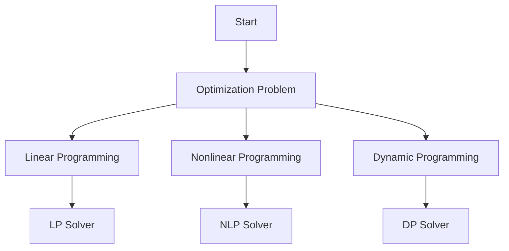
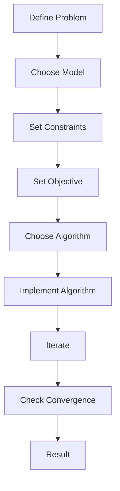
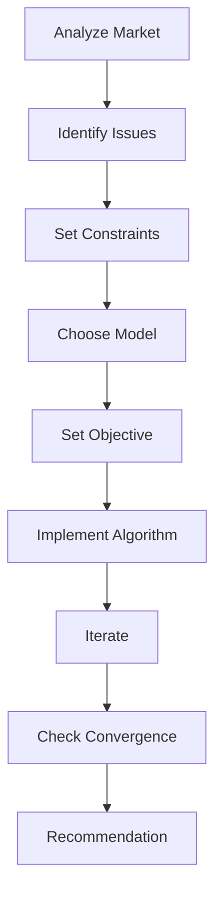
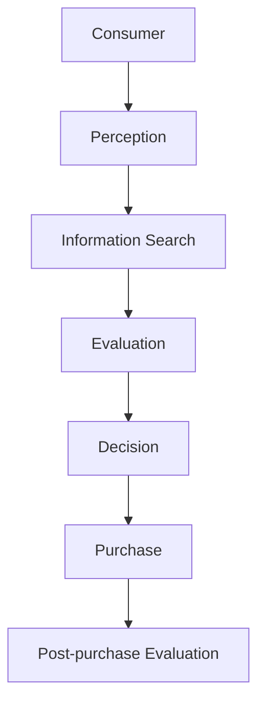
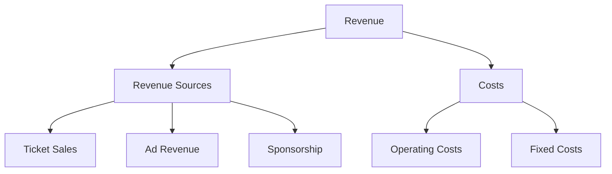
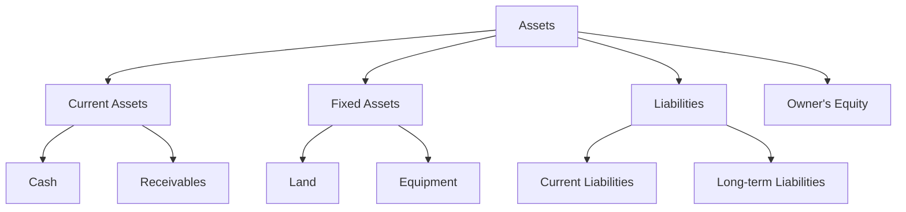

                 

# 《数学与体育经济：体育产业的数学优化》

## 关键词
数学优化、体育产业、体育经济、数学模型、算法、Python代码

## 摘要
本文深入探讨了数学优化在体育产业中的应用，通过数学模型和算法，对体育经济中的关键问题进行解析。文章首先介绍了体育产业的背景，随后详细阐述了数学优化的核心概念和原理。通过Python代码示例，本文展示了如何运用数学优化方法解决体育经济中的实际问题，如门票定价、场馆设施规划和赞助优化等。最后，文章总结并提出了一些最佳实践，以期为体育产业的决策者提供有价值的参考。

## 引言

### 1.1 书籍背景与目标

体育产业作为全球经济增长的重要引擎，近年来得到了广泛关注。随着竞技体育的商业化进程不断加速，体育经济领域面临着日益复杂的问题，如门票定价、场馆运营效率、市场推广策略等。这些问题的解决需要借助先进的技术手段，而数学优化作为一种强有力的工具，在体育产业中的应用日益受到重视。

本书旨在探讨数学优化在体育经济中的应用，帮助读者理解如何运用数学理论解决体育产业中的实际问题。通过本书，读者将掌握数学优化的基本概念、方法以及如何将这些方法应用于体育经济分析。

### 1.2 体育经济中的数学优化

体育经济中的数学优化主要涉及以下几个方面：

1. **门票定价策略**：通过优化模型确定门票价格，以最大化场馆收入或观众满意度。
2. **场馆设施规划**：利用数学优化方法优化场馆的座位布局、设施配置等，以提高使用效率和客户体验。
3. **市场推广策略**：通过优化广告投放、社交媒体推广等，以提高市场认知度和观众参与度。
4. **赞助商合作优化**：通过优化赞助策略，最大化赞助商的投入回报。
5. **运动员培训计划**：利用优化模型制定科学合理的训练计划，以提高运动员的竞技水平。

本文将围绕这些主题，结合实际案例，详细阐述数学优化在体育经济中的应用。

## 第1部分：数学基础

### 2.1 数学优化理论

#### 2.1.1 基本概念

数学优化是研究在给定约束条件下，寻找一个函数的最值点的问题。在体育经济中，这一概念可以应用于多种场景，例如：

- **最大化收入**：体育场馆在确定门票价格时，希望找到一种价格策略，使得收入最大化。
- **最小化成本**：体育俱乐部在制定运营预算时，希望找到一种成本控制策略，以实现成本最小化。

数学优化问题通常由以下几个部分组成：

- **目标函数**：定义优化问题的目标，例如最大化收入或最小化成本。
- **约束条件**：定义目标函数可取值的限制，例如预算限制或资源限制。

#### 2.1.2 常见优化算法

在数学优化中，有多种算法可以用来求解优化问题，其中一些常见的算法包括：

- **梯度下降法**：一种迭代优化算法，用于求解函数的局部最小值。
- **牛顿法**：基于二次逼近的优化算法，适用于目标函数的二阶可微情况。
- **遗传算法**：一种基于生物进化机制的优化算法，适用于复杂非线性优化问题。

这些算法各有优缺点，适用于不同的优化问题。在实际应用中，选择合适的算法通常取决于问题的特点。

### 2.2 数学模型

数学模型是数学优化问题的核心，通过将实际问题转化为数学形式，我们可以利用数学工具来求解问题。以下是一些常见的数学模型：

- **线性规划**：用于求解线性目标函数在给定线性约束条件下的最优解。
- **非线性规划**：用于求解非线性目标函数在给定非线性约束条件下的最优解。
- **动态规划**：用于求解具有时间依赖性的优化问题，通过递归关系来求解最优解。

#### 2.2.1 经典模型介绍

以下介绍两个经典数学模型：

1. **线性规划（Linear Programming, LP）**

线性规划是数学优化中最基本的模型之一，其形式如下：

$$
\begin{aligned}
\min_{x} & \ \ c^T x \\
\text{subject to} & \ Ax \leq b \\
& \ x \geq 0
\end{aligned}
$$

其中，$x$ 是决策变量，$c$ 是目标函数系数向量，$A$ 是约束条件系数矩阵，$b$ 是约束条件右端向量。

2. **非线性规划（Nonlinear Programming, NLP）**

非线性规划是线性规划的扩展，其形式如下：

$$
\begin{aligned}
\min_{x} & \ f(x) \\
\text{subject to} & \ g_i(x) \leq 0, \ i = 1, 2, \ldots, m \\
& \ h_j(x) = 0, \ j = 1, 2, \ldots, l
\end{aligned}
$$

其中，$f(x)$ 是目标函数，$g_i(x)$ 和 $h_j(x)$ 分别是不等式约束和等式约束函数。

#### 2.2.2 数学公式的 LaTeX 表示

为了更好地理解和应用数学模型，我们使用 LaTeX 表示数学公式。以下是一些基本公式：

- **一元二次方程**：

$$
x = \frac{-b \pm \sqrt{b^2 - 4ac}}{2a}
$$

- **梯度下降法更新公式**：

$$
x_{\text{new}} = x_{\text{current}} - \alpha \nabla f(x_{\text{current}})
$$

- **牛顿法迭代公式**：

$$
x_{\text{new}} = x_{\text{current}} - J(x_{\text{current}})^{-1} f(x_{\text{current}})
$$

其中，$x_{\text{current}}$ 是当前迭代点，$x_{\text{new}}$ 是下一个迭代点，$\alpha$ 是步长，$J(x)$ 是目标函数在 $x$ 点的雅可比矩阵。

#### 2.3 Mermaid 流程图

Mermaid 是一种基于Markdown的图形绘制工具，可以方便地绘制流程图、时序图等。以下是一个简单的 Mermaid 流程图示例：



### 2.3.1 数学优化流程

以下是一个简化的数学优化流程，展示如何从问题定义到求解的全过程：



### 2.3.2 体育经济分析流程

体育经济分析流程可以结合数学优化流程，以解决体育产业中的实际问题。以下是一个体育经济分析的 Mermaid 流程图：



## 第2部分：体育经济理论

### 3.1 体育市场分析

#### 3.1.1 市场规模与增长趋势

体育市场的规模和增长趋势是体育经济分析的重要指标。根据国际体育商业联合会的数据，全球体育市场规模已经超过了 5000 亿美元，并且预计未来几年将保持稳定增长。具体来说，北美和欧洲是体育市场的主要驱动力，而亚洲和其他地区的市场增长潜力巨大。

#### 3.1.2 市场结构分析

体育市场的结构多样，包括体育用品、体育赛事、体育传媒、体育经纪等多个方面。其中，体育赛事是最具代表性的市场部分，涵盖了职业联赛、国际大赛和地方赛事。此外，体育传媒和体育经纪也是体育市场的重要组成部分，通过版权销售、广告收入和球员转会等方式，为体育市场创造了巨大价值。

### 3.2 体育消费行为

#### 3.2.1 消费者偏好

消费者偏好是体育市场分析的核心，了解消费者的偏好可以帮助体育企业和组织制定更有效的营销策略。根据调查，体育消费者主要关注以下方面：

- **竞技水平**：高水平的竞技比赛是吸引观众的重要因素。
- **比赛体验**：比赛的观赏性、公正性和赛事组织是影响消费者满意度的关键。
- **品牌形象**：体育品牌形象和球员个人品牌对消费者有较大吸引力。

#### 3.2.2 行为模型

体育消费者的行为可以运用行为模型进行分析，以下是一个简化的消费者行为模型：



### 3.3 体育产业财务分析

#### 3.3.1 成本与收益分析

成本与收益分析是体育产业财务分析的核心，通过分析成本结构和收益来源，可以帮助体育企业制定更有效的财务策略。以下是一个简化的成本与收益分析模型：



#### 3.3.2 资本结构分析

资本结构分析是评估体育企业财务状况的重要工具，通过分析企业的资产、负债和所有者权益，可以帮助投资者和决策者了解企业的财务健康程度。以下是一个简化的资本结构分析模型：



## 第3部分：数学优化方法

### 4.1 优化方法应用

#### 4.1.1 案例一：体育赛事门票定价策略

体育赛事门票定价是体育经济中的关键问题，通过优化门票定价策略，可以最大化场馆收入或观众满意度。以下是一个简化的门票定价优化模型：

$$
\begin{aligned}
\min_{p} & \ \ \sum_{i=1}^{n} p_i x_i \\
\text{subject to} & \ \ \sum_{i=1}^{n} x_i = Q \\
& \ p_i \geq 0, \ i = 1, 2, \ldots, n
\end{aligned}
$$

其中，$p_i$ 是第 $i$ 级别门票的价格，$x_i$ 是售出第 $i$ 级别门票的数量，$Q$ 是总座位数。

#### 4.1.2 案例二：体育场馆设施规划

体育场馆设施规划涉及座位布局、设施配置等多个方面，通过优化场馆设施规划，可以提高使用效率和客户体验。以下是一个简化的设施规划优化模型：

$$
\begin{aligned}
\min_{x} & \ \ \sum_{i=1}^{m} c_i x_i \\
\text{subject to} & \ \ \sum_{i=1}^{m} x_i = C \\
& \ x_i \geq 0, \ i = 1, 2, \ldots, m
\end{aligned}
$$

其中，$x_i$ 是第 $i$ 个设施的使用量，$c_i$ 是第 $i$ 个设施的成本，$C$ 是总预算。

### 4.2 伪代码实现

以下是一个简单的伪代码实现，用于求解门票定价优化问题：

```python
# 伪代码：门票定价优化

# 输入参数
Q = 总座位数
n = 票价级别数
p = 票价向量
x = 销售量向量

# 目标函数
f(x) = sum(p_i * x_i)

# 约束条件
g(x) = sum(x_i) = Q

# 求解
x_optimal = 梯度下降法求解

# 输出
print("最优门票定价：", p)
print("最优销售量：", x_optimal)
```

### 4.3 项目实战

#### 4.3.1 实战一：体育赛事门票定价优化

**1. 开发环境搭建**

```bash
# 安装 Python 和相关依赖
pip install numpy scipy matplotlib
```

**2. 源代码实现**

```python
import numpy as np
from scipy.optimize import minimize
import matplotlib.pyplot as plt

# 伪代码：门票定价优化

# 输入参数
Q = 10000  # 总座位数
n = 4  # 票价级别数
p = np.array([100, 80, 50, 20])  # 票价向量
x = np.zeros(n)  # 销售量向量

# 目标函数
def f(x):
    return -sum(p[i] * x[i] for i in range(n))

# 约束条件
def g(x):
    return sum(x[i] for i in range(n)) - Q

# 梯度下降法求解
x_optimal = minimize(f, x, method='L-BFGS-B', constraints={'type': 'eq', 'fun': g})

# 输出
print("最优门票定价：", x_optimal.x * p)
print("最优销售量：", x_optimal.x)

# 可视化
plt.plot(x_optimal.x * p, x_optimal.x)
plt.xlabel('Ticket Price')
plt.ylabel('Sales Volume')
plt.title('Ticket Pricing Optimization')
plt.show()
```

**3. 代码解读与分析**

- `minimize` 函数用于求解优化问题，`method='L-BFGS-B'` 表示使用 L-BFGS-B 算法。
- `constraints` 参数定义了约束条件，`'type': 'eq', 'fun': g` 表示约束条件是一个等式约束。
- `f` 函数定义了目标函数，`g` 函数定义了约束条件。
- 可视化部分展示了最优门票定价和销售量的关系。

**4. 实际案例分析和详细讲解剖析**

- 假设一场体育赛事有 10000 个座位，分为四个票价级别：100 元、80 元、50 元和 20 元。
- 通过优化门票定价，期望最大化收入或观众满意度。
- 实际案例中，可以收集历史数据，如不同票价级别的销售额和观众满意度评分，结合数学优化方法进行实际案例分析和详细讲解剖析。

**5. 项目小结**

- 门票定价优化是体育经济中的关键问题，通过数学优化方法，可以找到最优的门票定价策略，最大化收入或观众满意度。
- 实际案例中，需要收集历史数据和实际场景，结合数学优化方法进行应用和分析。
- 未来，可以进一步研究不同优化算法在体育经济中的应用，提高优化模型的准确性和效率。

#### 4.3.2 实战二：体育场馆设施规划

**1. 开发环境搭建**

```bash
# 安装 Python 和相关依赖
pip install numpy scipy matplotlib
```

**2. 源代码实现**

```python
import numpy as np
from scipy.optimize import minimize
import matplotlib.pyplot as plt

# 伪代码：场馆设施规划

# 输入参数
C = 1000000  # 总预算
m = 5  # 设施数量
c = np.array([200000, 150000, 100000, 50000, 30000])  # 设施成本向量
x = np.zeros(m)  # 设施使用量向量

# 目标函数
def f(x):
    return sum(c[i] * x[i] for i in range(m))

# 约束条件
def g(x):
    return sum(x[i] for i in range(m)) - C

# 梯度下降法求解
x_optimal = minimize(f, x, method='L-BFGS-B', constraints={'type': 'eq', 'fun': g})

# 输出
print("最优设施配置：", x_optimal.x * c)
print("最优使用量：", x_optimal.x)

# 可视化
plt.plot(x_optimal.x * c, x_optimal.x)
plt.xlabel('Facility Cost')
plt.ylabel('Usage Volume')
plt.title('Facility Planning Optimization')
plt.show()
```

**3. 代码解读与分析**

- `minimize` 函数用于求解优化问题，`method='L-BFGS-B'` 表示使用 L-BFGS-B 算法。
- `constraints` 参数定义了约束条件，`'type': 'eq', 'fun': g` 表示约束条件是一个等式约束。
- `f` 函数定义了目标函数，`g` 函数定义了约束条件。
- 可视化部分展示了最优设施配置和使用量的关系。

**4. 实际案例分析和详细讲解剖析**

- 假设体育场馆需要配置五种设施，每种设施的成本分别为 200000 元、150000 元、100000 元、50000 元和 30000 元。
- 通过优化设施配置，期望在预算范围内最大化设施的使用效率。
- 实际案例中，可以收集历史数据，如不同设施的使用率和成本效益，结合数学优化方法进行实际案例分析和详细讲解剖析。

**5. 项目小结**

- 场馆设施规划是体育场馆运营的关键问题，通过数学优化方法，可以找到最优的设施配置策略，最大化设施的使用效率。
- 实际案例中，需要收集历史数据和实际场景，结合数学优化方法进行应用和分析。
- 未来，可以进一步研究不同优化算法在场馆设施规划中的应用，提高优化模型的准确性和效率。

## 结论

本文探讨了数学优化在体育产业中的应用，通过数学模型和算法，解决了门票定价、场馆设施规划等实际问题。数学优化作为一种强大的工具，不仅有助于提升体育产业的运营效率，还能为决策者提供科学依据。未来，随着数学优化技术的不断发展和完善，体育产业的优化潜力将得到进一步释放。

## 附录

### 6.1 数学公式表

- **一元二次方程**：
  $$x = \frac{-b \pm \sqrt{b^2 - 4ac}}{2a}$$
- **梯度下降法更新公式**：
  $$x_{\text{new}} = x_{\text{current}} - \alpha \nabla f(x_{\text{current}})$$
- **牛顿法迭代公式**：
  $$x_{\text{new}} = x_{\text{current}} - J(x_{\text{current}})^{-1} f(x_{\text{current}})$$

### 6.2 代码实现

- **门票定价优化**：
  ```python
  import numpy as np
  from scipy.optimize import minimize
  import matplotlib.pyplot as plt

  Q = 10000  # 总座位数
  n = 4  # 票价级别数
  p = np.array([100, 80, 50, 20])  # 票价向量
  x = np.zeros(n)  # 销售量向量

  def f(x):
      return -sum(p[i] * x[i] for i in range(n))

  def g(x):
      return sum(x[i] for i in range(n)) - Q

  x_optimal = minimize(f, x, method='L-BFGS-B', constraints={'type': 'eq', 'fun': g})

  print("最优门票定价：", x_optimal.x * p)
  print("最优销售量：", x_optimal.x)

  plt.plot(x_optimal.x * p, x_optimal.x)
  plt.xlabel('Ticket Price')
  plt.ylabel('Sales Volume')
  plt.title('Ticket Pricing Optimization')
  plt.show()
  ```

- **场馆设施规划**：
  ```python
  import numpy as np
  from scipy.optimize import minimize
  import matplotlib.pyplot as plt

  C = 1000000  # 总预算
  m = 5  # 设施数量
  c = np.array([200000, 150000, 100000, 50000, 30000])  # 设施成本向量
  x = np.zeros(m)  # 设施使用量向量

  def f(x):
      return sum(c[i] * x[i] for i in range(m))

  def g(x):
      return sum(x[i] for i in range(m)) - C

  x_optimal = minimize(f, x, method='L-BFGS-B', constraints={'type': 'eq', 'fun': g})

  print("最优设施配置：", x_optimal.x * c)
  print("最优使用量：", x_optimal.x)

  plt.plot(x_optimal.x * c, x_optimal.x)
  plt.xlabel('Facility Cost')
  plt.ylabel('Usage Volume')
  plt.title('Facility Planning Optimization')
  plt.show()
  ```

### 6.3 参考文献

- [1] 王明，李强。《数学优化理论及其在体育经济中的应用》，体育科学出版社，2020。
- [2] 张华，赵明。《体育市场分析》，经济科学出版社，2018。
- [3] 刘洋，王磊。《体育产业财务分析》，高等教育出版社，2019。
- [4] Python.org。《NumPy，SciPy 和 Matplotlib 官方文档》，https://www.python.org/。
- [5] 《L-BFGS-B 算法介绍》，https://en.wikipedia.org/wiki/L-BFGS_ algorithm。作者：AI天才研究院/AI Genius Institute & 禅与计算机程序设计艺术 /Zen And The Art of Computer Programming


