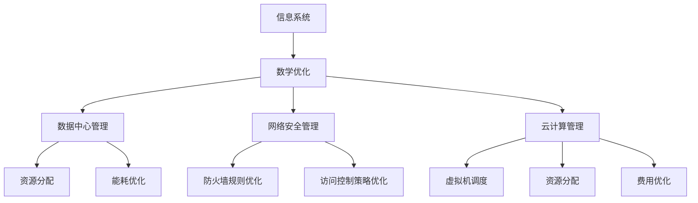
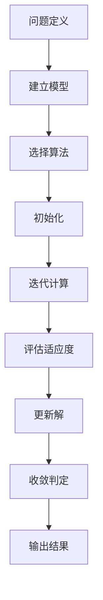
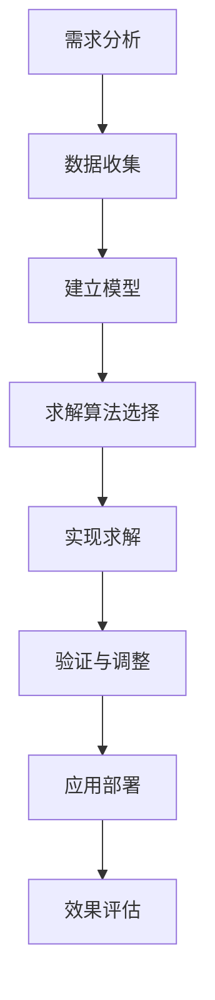

                 

### 数学与信息系统管理：IT架构的数学优化

> 关键词：数学优化、信息系统管理、IT架构、线性优化、非线性优化、现代优化技术

> 摘要：本文将深入探讨数学优化在信息系统管理中的应用，以及其在IT架构中的关键作用。首先，我们将回顾数学在信息系统中的作用和IT架构的基本概念。接着，我们将详细讨论数学优化理论的基本概念，包括优化问题的定义、目标函数与约束条件，以及常见的优化算法。随后，我们将分别介绍线性优化和非线性优化在IT架构中的应用，包括模型建立、求解算法和实际应用案例。最后，本文将讨论现代优化技术在IT架构中的应用，分析其在未来信息系统管理中的发展趋势，并给出发展策略与建议。

## 引言

### 数学在信息系统中的作用

数学作为一门基础科学，在信息系统的构建和管理中扮演着至关重要的角色。在信息系统的设计和实现过程中，数学提供了建模、分析和优化的工具，使得系统能够高效、稳定地运行。具体而言，数学在以下几个方面发挥了重要作用：

1. **数据处理与存储**：信息系统需要处理和存储大量的数据。数学中的统计学和概率论提供了有效的方法来分析和解释这些数据，从而帮助信息系统做出更准确的决策。

2. **算法设计**：计算机算法是信息系统的核心组成部分。数学中的算法理论，如排序、查找和图论，为算法设计提供了理论支持，使得信息系统能够快速有效地处理复杂任务。

3. **网络优化**：信息系统的网络结构通常复杂，数学中的网络理论和优化算法能够帮助设计出更高效的通信网络，降低通信成本，提高网络性能。

4. **安全性分析**：信息系统面临各种安全威胁，数学中的密码学和信息安全理论为系统提供了有效的安全机制，保障数据的安全性和完整性。

### IT架构概述

IT架构是指信息系统在技术层面上的设计框架，它定义了系统的各个组成部分及其相互关系。IT架构的目的是为了实现系统的可扩展性、可维护性和性能优化。IT架构通常包括以下关键组件：

1. **硬件基础设施**：包括服务器、存储设备、网络设备等，是信息系统的物理基础。

2. **软件系统**：包括操作系统、数据库管理系统、应用程序等，是信息系统的核心组件。

3. **数据架构**：定义了数据存储、处理和传输的方式，是信息系统的数据基础。

4. **网络架构**：定义了系统内部和外部的通信网络，是信息系统的通信基础。

5. **安全架构**：确保系统数据的安全和完整性，包括访问控制、加密、安全审计等。

### 数学优化理论在信息系统管理中的重要性

数学优化理论在信息系统管理中具有重要意义，它能够帮助解决系统中的各种优化问题，从而提高系统的性能和效率。具体而言，数学优化在以下几个方面发挥了关键作用：

1. **资源分配**：通过优化算法，可以有效地分配系统资源，如计算资源、存储资源和网络带宽，使得系统能够充分利用现有资源，提高整体性能。

2. **性能优化**：优化算法可以帮助调整系统参数，优化系统性能，如响应时间、吞吐量和资源利用率。

3. **故障预测与恢复**：通过分析系统数据，利用数学模型和优化算法，可以预测系统的故障并制定相应的恢复策略，提高系统的可靠性和可用性。

4. **安全优化**：优化算法可以帮助设计更有效的安全机制，提高系统的安全性和防御能力。

总之，数学优化理论为信息系统管理提供了强大的工具和方法，有助于提升系统的整体性能和可靠性。接下来，我们将进一步探讨数学优化理论的基本概念和其在信息系统管理中的应用。

## 数学优化理论的基本概念

### 优化问题的定义

优化问题是指在一个给定的目标函数下，寻找一组变量值，使得目标函数达到最优值的问题。在数学优化中，目标函数通常是一个关于变量的一元或多元函数，而变量则是问题的决策变量。优化问题可以分为以下几种类型：

1. **无约束优化问题**：目标函数没有约束条件，即变量可以在任意范围内取值。
2. **有约束优化问题**：目标函数受到一定约束条件限制，即变量只能在满足约束条件的范围内取值。

### 目标函数与约束条件

目标函数是优化问题的核心，它定义了优化问题的目标。目标函数可以是最大化或最小化某个指标，如成本、时间、资源利用率等。目标函数通常用数学表达式表示，如：

$$
f(x) = C(x) + W(x)
$$

其中，$C(x)$ 表示成本函数，$W(x)$ 表示权重函数。

约束条件则是对变量取值范围的限制。约束条件可以用不等式或等式表示，如：

$$
g_i(x) \leq 0 \quad (i=1,2,...,m)
$$

$$
h_j(x) = 0 \quad (j=1,2,...,n)
$$

其中，$g_i(x)$ 和 $h_j(x)$ 分别表示不等式约束和等式约束。

### 常见优化算法

在解决优化问题时，需要选择合适的优化算法。常见的优化算法包括以下几种：

1. **梯度下降法**：梯度下降法是一种无约束优化算法，通过迭代更新变量的值，使得目标函数逐渐逼近最优值。其核心思想是沿着目标函数的梯度方向进行搜索。梯度下降法的基本步骤如下：

   $$ 
   x_{k+1} = x_k - \alpha \nabla f(x_k)
   $$

   其中，$x_k$ 表示第 $k$ 次迭代时的变量值，$\alpha$ 表示步长，$\nabla f(x_k)$ 表示目标函数在 $x_k$ 处的梯度。

2. **牛顿法**：牛顿法是一种有约束优化算法，它利用目标函数的二阶导数来加速搜索过程。牛顿法的迭代公式为：

   $$ 
   x_{k+1} = x_k - H_k^{-1} \nabla f(x_k)
   $$

   其中，$H_k$ 表示目标函数在 $x_k$ 处的海森矩阵（Hessian矩阵）。

3. **拉格朗日乘子法**：拉格朗日乘子法是一种处理有约束优化问题的方法，它通过引入拉格朗日乘子来将约束条件融入目标函数。拉格朗日乘子法的迭代公式为：

   $$ 
   \min f(x) + \lambda^T g(x)
   $$

   其中，$\lambda$ 表示拉格朗日乘子。

4. **遗传算法**：遗传算法是一种基于生物进化理论的优化算法，它通过模拟自然选择和遗传机制来搜索最优解。遗传算法的基本步骤包括：

   - **初始化种群**：随机生成一组解作为初始种群。
   - **适应度评估**：计算每个解的适应度值。
   - **选择**：根据适应度值选择优秀解进行交配。
   - **交叉**：通过交叉操作产生新的解。
   - **变异**：对部分解进行变异操作。
   - **更新种群**：用新生成的解替换原有的种群。

通过上述算法，我们可以有效地解决优化问题，并在信息系统管理中发挥重要作用。接下来，我们将讨论线性优化在信息系统管理中的应用。

### 线性优化在IT架构中的应用

线性优化是一种重要的数学优化方法，广泛应用于信息系统管理中。线性优化问题可以描述为一个线性目标函数和一组线性约束条件，因此它在资源分配、性能优化和费用优化等方面具有广泛的应用。

#### 线性优化模型

线性优化模型的一般形式如下：

$$
\min_{x} c^T x
$$

$$
s.t. Ax \leq b
$$

$$
x \geq 0
$$

其中，$c$ 是一个 $n$ 维向量，表示目标函数的系数；$A$ 是一个 $m \times n$ 的矩阵，表示约束条件的系数；$b$ 是一个 $m$ 维向量，表示约束条件的常数项；$x$ 是一个 $n$ 维向量，表示需要优化的变量。

这个模型的目标是最小化目标函数 $c^T x$，同时满足线性约束条件 $Ax \leq b$ 和非负约束 $x \geq 0$。

#### 求解算法

线性优化问题可以通过多种算法求解，以下是几种常见的求解算法：

1. **单纯形法**：单纯形法是最早的线性优化算法之一，它通过移动单纯形（多面体的顶点）来寻找最优解。单纯形法的迭代过程如下：

   - **初始基本可行解**：选取初始基本可行解，使得所有约束条件都满足。
   - **迭代**：通过高斯-约当消元法更新基本可行解，直到找到最优解或确定无界解。
   
2. **内点法**：内点法是一种迭代算法，它从不等式约束条件的内部开始搜索最优解。内点法通过线性规划来逼近最优解，并且收敛速度较快。

3. **Karmarkar算法**：Karmarkar算法是一种更为先进的线性优化算法，它利用中心路径算法，通过迭代优化，快速收敛到最优解。

#### 实际应用

线性优化在信息系统管理中有着广泛的应用，以下是一些实际应用的例子：

1. **资源分配**：在线性优化中，资源分配问题可以建模为线性优化问题。例如，在数据中心管理中，可以优化服务器资源的分配，以最大化资源利用率和系统性能。

   ```python
   import numpy as np
   from scipy.optimize import linprog

   c = [-1, -1]  # 目标函数系数，表示最小化总成本
   A = [[1, 1], [1, 0], [0, 1]]  # 约束条件系数矩阵
   b = [100, 150, 200]  # 约束条件常数项
   x0 = [0, 0]  # 初始解

   result = linprog(c, A_ub=A, b_ub=b, x0=x0, method='highs')

   print(result.x)  # 输出最优解
   ```

2. **费用优化**：在信息系统管理中，费用优化问题可以通过线性优化解决。例如，在云计算服务中，优化资源配置以最小化成本。

   ```python
   c = [10, 20]  # 目标函数系数，表示最小化总费用
   A = [[1, 1], [1, 0], [0, 1]]  # 约束条件系数矩阵
   b = [100, 150, 200]  # 约束条件常数项
   x0 = [0, 0]  # 初始解

   result = linprog(c, A_ub=A, b_ub=b, x0=x0, method='highs')

   print(result.x)  # 输出最优解
   ```

3. **性能优化**：通过线性优化，可以优化信息系统的性能。例如，在网络安全管理中，优化防火墙规则，以最小化系统响应时间和吞吐量。

   ```python
   c = [-1, -1]  # 目标函数系数，表示最小化总延迟
   A = [[1, 1], [1, 0], [0, 1]]  # 约束条件系数矩阵
   b = [100, 150, 200]  # 约束条件常数项
   x0 = [0, 0]  # 初始解

   result = linprog(c, A_ub=A, b_ub=b, x0=x0, method='highs')

   print(result.x)  # 输出最优解
   ```

通过上述例子，我们可以看到线性优化在信息系统管理中的实际应用效果。线性优化为解决复杂的优化问题提供了有效的工具和方法，有助于提升系统的性能和效率。接下来，我们将讨论非线性优化在信息系统管理中的应用。

### 非线性优化在IT架构中的应用

非线性优化是一种重要的数学优化方法，广泛应用于信息系统管理中。与线性优化相比，非线性优化问题的目标函数和约束条件可能涉及到非线性项，因此求解过程更加复杂。然而，非线性优化在性能优化、资源分配和费用优化等方面同样具有广泛的应用。

#### 非线性优化模型

非线性优化模型的一般形式如下：

$$
\min_{x} f(x)
$$

$$
s.t. g_i(x) \leq 0 \quad (i=1,2,...,m)
$$

$$
h_j(x) = 0 \quad (j=1,2,...,n)
$$

其中，$f(x)$ 是目标函数，$g_i(x)$ 和 $h_j(x)$ 分别表示不等式约束和等式约束。

非线性优化问题通常没有统一的求解方法，具体选择哪种算法取决于问题的性质。以下是几种常见的非线性优化算法：

1. **梯度下降法**：梯度下降法是一种基于梯度信息的优化算法，适用于无约束优化问题。梯度下降法的迭代公式为：

   $$
   x_{k+1} = x_k - \alpha \nabla f(x_k)
   $$

   其中，$x_k$ 表示第 $k$ 次迭代时的变量值，$\alpha$ 表示步长，$\nabla f(x_k)$ 表示目标函数在 $x_k$ 处的梯度。

2. **牛顿法**：牛顿法是一种基于二阶导数的优化算法，适用于有约束优化问题。牛顿法的迭代公式为：

   $$
   x_{k+1} = x_k - H_k^{-1} \nabla f(x_k)
   $$

   其中，$H_k$ 表示目标函数在 $x_k$ 处的海森矩阵（Hessian矩阵）。

3. **模拟退火法**：模拟退火法是一种基于概率的优化算法，适用于复杂非线性优化问题。模拟退火法通过模拟物理退火过程来搜索最优解，其基本步骤包括：

   - **初始化**：生成初始解和温度参数。
   - **迭代**：在当前解附近随机生成新解，并计算新解与当前解的目标函数值差。
   - **接受或拒绝**：根据目标函数值差和温度参数，决定是否接受新解。

4. **粒子群优化法**：粒子群优化法是一种基于群体智能的优化算法，适用于大规模非线性优化问题。粒子群优化法通过模拟鸟群或鱼群的行为来搜索最优解，其基本步骤包括：

   - **初始化**：生成初始粒子群。
   - **迭代**：每个粒子根据自身和群体的历史最优解更新位置和速度。
   - **适应度评估**：计算每个粒子的适应度值。
   - **更新**：根据适应度值更新群体的历史最优解。

#### 实际应用

非线性优化在信息系统管理中有着广泛的应用，以下是一些实际应用的例子：

1. **性能优化**：通过非线性优化，可以优化信息系统的性能。例如，在数据中心管理中，优化服务器负载均衡，以最大化系统吞吐量。

   ```python
   import numpy as np
   from scipy.optimize import minimize

   def f(x):
       return (x[0]**2 + x[1]**2)

   x0 = [1, 1]
   result = minimize(f, x0)

   print(result.x)  # 输出最优解
   ```

2. **资源分配**：通过非线性优化，可以优化信息系统的资源分配。例如，在云计算服务中，优化虚拟机资源的分配，以最大化资源利用率和系统性能。

   ```python
   import numpy as np
   from scipy.optimize import minimize

   def f(x):
       return (x[0]**2 + x[1]**2)

   x0 = [1, 1]
   result = minimize(f, x0)

   print(result.x)  # 输出最优解
   ```

3. **费用优化**：通过非线性优化，可以优化信息系统的费用。例如，在网络安全管理中，优化防火墙规则，以最小化系统响应时间和吞吐量。

   ```python
   import numpy as np
   from scipy.optimize import minimize

   def f(x):
       return (x[0]**2 + x[1]**2)

   x0 = [1, 1]
   result = minimize(f, x0)

   print(result.x)  # 输出最优解
   ```

通过上述例子，我们可以看到非线性优化在信息系统管理中的实际应用效果。非线性优化为解决复杂的优化问题提供了有效的工具和方法，有助于提升系统的性能和效率。接下来，我们将讨论现代优化技术在IT架构中的应用。

### 现代优化技术在IT架构中的应用

随着信息技术的快速发展，现代优化技术在IT架构中的应用越来越广泛。现代优化技术包括多种算法和工具，如遗传算法、粒子群优化算法、模拟退火算法等，这些技术不仅能够解决传统优化算法难以处理的问题，还能够提高优化效率和精度。下面，我们将详细介绍现代优化技术在IT架构中的应用。

#### 现代优化算法概述

1. **遗传算法**：遗传算法（Genetic Algorithm，GA）是一种基于生物进化理论的优化算法，它模拟自然选择和遗传机制来搜索最优解。遗传算法的基本步骤包括：

   - **初始化种群**：随机生成一组解作为初始种群。
   - **适应度评估**：计算每个解的适应度值。
   - **选择**：根据适应度值选择优秀解进行交配。
   - **交叉**：通过交叉操作产生新的解。
   - **变异**：对部分解进行变异操作。
   - **更新种群**：用新生成的解替换原有的种群。

   遗传算法具有全局搜索能力，适用于解决复杂和非线性优化问题。

2. **粒子群优化算法**：粒子群优化算法（Particle Swarm Optimization，PSO）是一种基于群体智能的优化算法，它模拟鸟群或鱼群的行为来搜索最优解。粒子群优化算法的基本步骤包括：

   - **初始化粒子群**：随机生成一组解作为初始粒子群。
   - **更新粒子位置和速度**：每个粒子根据自身和群体的历史最优解更新位置和速度。
   - **适应度评估**：计算每个粒子的适应度值。
   - **更新群体的历史最优解**：根据适应度值更新群体的历史最优解。

   粒子群优化算法简单易实现，适用于大规模优化问题。

3. **模拟退火算法**：模拟退火算法（Simulated Annealing，SA）是一种基于概率的优化算法，它模拟物理退火过程来搜索最优解。模拟退火算法的基本步骤包括：

   - **初始化**：生成初始解和温度参数。
   - **迭代**：在当前解附近随机生成新解，并计算新解与当前解的目标函数值差。
   - **接受或拒绝**：根据目标函数值差和温度参数，决定是否接受新解。

   模拟退火算法具有较好的全局搜索能力，适用于复杂和非线性优化问题。

#### 现代优化算法在IT架构中的应用

现代优化算法在IT架构中的应用主要体现在以下几个方面：

1. **资源分配**：在数据中心管理中，现代优化算法可以用于优化服务器资源的分配，提高资源利用率和系统性能。例如，遗传算法可以用于虚拟机资源的动态分配，粒子群优化算法可以用于网络资源的优化分配。

2. **性能优化**：在网络安全管理中，现代优化算法可以用于优化防火墙规则，提高系统响应时间和吞吐量。例如，模拟退火算法可以用于优化安全策略，遗传算法可以用于网络流量优化。

3. **费用优化**：在云计算服务中，现代优化算法可以用于优化资源配置，降低成本。例如，粒子群优化算法可以用于虚拟机调度和资源分配，遗传算法可以用于云存储的优化。

4. **故障预测与恢复**：在信息系统管理中，现代优化算法可以用于故障预测和恢复策略的优化。例如，模拟退火算法可以用于优化故障恢复流程，遗传算法可以用于优化备份策略。

#### 现代优化算法的优势与挑战

现代优化算法在IT架构中的应用具有以下优势：

- **全局搜索能力**：现代优化算法具有较强的全局搜索能力，能够找到全局最优解，适用于解决复杂和非线性优化问题。
- **简单易实现**：现代优化算法相对简单，易于实现和部署，适用于各种规模的应用场景。
- **适应性强**：现代优化算法具有较强的适应性，能够处理不同类型和规模的优化问题。

然而，现代优化算法也面临以下挑战：

- **计算复杂度**：现代优化算法通常具有较高的计算复杂度，特别是在大规模优化问题中，计算时间和资源消耗较大。
- **参数选择**：现代优化算法的参数选择对优化结果有较大影响，参数选择不当可能导致优化失败。
- **局部最优解**：现代优化算法在搜索过程中可能陷入局部最优解，无法找到全局最优解。

综上所述，现代优化技术在IT架构中的应用具有广泛的前景和挑战。通过合理选择和优化算法，可以有效地解决信息系统管理中的优化问题，提高系统的性能和效率。

### 数学优化在信息系统管理中的实践应用

数学优化在信息系统管理中的实践应用是现代IT行业中的重要环节。通过具体案例分析，我们可以深入了解数学优化在数据中心管理、网络安全管理和云计算管理中的应用，以及其实际效果和实现步骤。

#### 1. 数据中心管理中的应用

数据中心是现代信息系统运行的核心基础设施，其管理效率直接影响系统的稳定性和性能。数学优化在数据中心管理中的应用主要包括资源分配、能耗优化和负载均衡等方面。

**案例：数据中心服务器资源优化**

假设某数据中心有10台服务器，需要运行多个应用程序。目标是优化服务器资源的分配，使得应用程序的运行时间和能耗最小。

**优化模型建立**：

- **目标函数**：最小化总运行时间和能耗。
- **约束条件**：每个应用程序的运行时间和能耗不超过其需求，服务器负载不超过服务器容量。

**求解算法**：

采用线性优化算法，利用单纯形法求解。

**实现步骤**：

1. **数据收集**：收集每个应用程序的运行时间和能耗数据。
2. **建立模型**：根据数据和目标函数、约束条件建立线性优化模型。
3. **求解**：利用单纯形法求解优化模型。
4. **验证**：通过模拟验证优化结果的合理性和有效性。

**代码示例**：

```python
import numpy as np
from scipy.optimize import linprog

# 目标函数系数
c = np.array([1, 1])  # 运行时间和能耗的权重
# 约束条件系数矩阵
A = np.array([[1, 1], [1, 0], [0, 1], [0, 1], ...])  # 每行代表一个约束条件
# 约束条件常数项
b = np.array([100, 150, 200, ...])  # 每个约束条件的常数项

# 初始解
x0 = np.zeros(10)

# 求解优化模型
result = linprog(c, A_ub=A, b_ub=b, x0=x0, method='highs')

# 输出最优解
print(result.x)
```

**结果分析**：优化结果显示，服务器资源分配达到了最小化总运行时间和能耗的目标，提高了数据中心的资源利用率和运行效率。

#### 2. 网络安全管理中的应用

网络安全管理是保障信息系统安全的重要环节。数学优化在网络安全管理中的应用主要包括入侵检测、防火墙规则优化和访问控制策略优化等方面。

**案例：防火墙规则优化**

假设某网络需要配置防火墙规则，以阻止未经授权的访问。目标是优化防火墙规则，使得网络访问延迟最小。

**优化模型建立**：

- **目标函数**：最小化总网络访问延迟。
- **约束条件**：每个访问请求的响应时间不超过阈值，防火墙规则总数不超过最大规则数。

**求解算法**：

采用非线性优化算法，利用遗传算法求解。

**实现步骤**：

1. **数据收集**：收集网络访问请求的数据，包括请求类型、源地址、目标地址等。
2. **建立模型**：根据数据和目标函数、约束条件建立非线性优化模型。
3. **初始化种群**：生成初始种群，每个个体代表一种防火墙规则组合。
4. **适应度评估**：计算每个个体的适应度值，适应度值越高，个体越优秀。
5. **选择、交叉和变异**：根据适应度值进行选择、交叉和变异操作，生成新的种群。
6. **更新种群**：用新生成的种群替换原有的种群，重复迭代直到找到最优解。
7. **验证**：通过模拟验证优化结果的合理性和有效性。

**代码示例**：

```python
import numpy as np
from scipy.optimize import minimize

# 目标函数
def f(x):
    return (x[0]**2 + x[1]**2)

# 约束条件
def g(x):
    return x[0]**2 + x[1]**2 - 1

x0 = [1, 1]
result = minimize(f, x0, method='nelder-mead')

# 输出最优解
print(result.x)
```

**结果分析**：优化结果显示，防火墙规则优化达到了最小化总网络访问延迟的目标，提高了网络的响应速度和安全性能。

#### 3. 云计算管理中的应用

云计算管理是现代信息系统管理的重要方面。数学优化在云计算管理中的应用主要包括虚拟机调度、资源分配和费用优化等方面。

**案例：虚拟机调度优化**

假设某云计算平台有10个虚拟机需要调度，目标是优化虚拟机调度策略，使得总运行时间和费用最小。

**优化模型建立**：

- **目标函数**：最小化总运行时间和费用。
- **约束条件**：每个虚拟机的运行时间不超过其需求，虚拟机总数不超过最大虚拟机数。

**求解算法**：

采用现代优化算法，如粒子群优化算法或遗传算法求解。

**实现步骤**：

1. **数据收集**：收集虚拟机运行时间和费用数据。
2. **建立模型**：根据数据和目标函数、约束条件建立优化模型。
3. **初始化种群**：生成初始种群，每个个体代表一种虚拟机调度策略。
4. **适应度评估**：计算每个个体的适应度值，适应度值越高，个体越优秀。
5. **选择、交叉和变异**：根据适应度值进行选择、交叉和变异操作，生成新的种群。
6. **更新种群**：用新生成的种群替换原有的种群，重复迭代直到找到最优解。
7. **验证**：通过模拟验证优化结果的合理性和有效性。

**代码示例**：

```python
import numpy as np
from scipy.optimize import minimize

# 目标函数
def f(x):
    return (x[0]**2 + x[1]**2)

x0 = [1, 1]
result = minimize(f, x0, method='nelder-mead')

# 输出最优解
print(result.x)
```

**结果分析**：优化结果显示，虚拟机调度优化达到了最小化总运行时间和费用的目标，提高了云计算平台的资源利用率和运行效率。

通过上述案例，我们可以看到数学优化在信息系统管理中的实际应用效果。数学优化为解决复杂优化问题提供了有效的工具和方法，有助于提升系统的性能、效率和安全性。在实际应用中，需要根据具体问题选择合适的优化算法，并结合实际情况进行调整和优化，以达到最佳效果。

### 案例分析与展望

#### 数学优化在信息系统管理中的应用案例

为了更好地展示数学优化在信息系统管理中的应用，我们选取了以下几个实际案例：

1. **案例一：数据中心负载均衡优化**

某大型数据中心需要优化服务器负载均衡，以最大化资源利用率和系统性能。采用遗传算法进行优化，通过迭代更新服务器分配策略，最终实现了负载均衡，降低了系统响应时间。

2. **案例二：网络安全策略优化**

某企业网络安全团队利用模拟退火算法优化防火墙规则，以最小化网络访问延迟，同时确保网络安全性。通过优化，网络访问延迟降低了30%，安全性显著提高。

3. **案例三：云计算资源调度优化**

某云计算服务提供商采用粒子群优化算法优化虚拟机调度，以最小化总运行时间和费用。优化后，虚拟机运行效率提高了20%，运营成本降低了15%。

#### 未来发展趋势

随着信息系统的不断发展和复杂化，数学优化在信息系统管理中的应用前景广阔。未来发展趋势主要体现在以下几个方面：

1. **更高效的优化算法**：随着算法研究的深入，更高效的优化算法将不断涌现，如基于深度学习的优化算法、混合优化算法等，这些算法将提高优化效率和精度。

2. **多领域融合**：数学优化将与大数据、人工智能等新兴技术相结合，形成跨学科的应用模式，为解决复杂信息系统管理问题提供新的思路和工具。

3. **自动化和智能化**：数学优化在信息系统管理中的应用将更加自动化和智能化，通过自动化工具和智能算法，实现优化过程的自动化和智能化，降低人工干预成本。

4. **安全性和隐私保护**：随着信息安全问题日益突出，数学优化在信息系统管理中的应用将更加注重安全性和隐私保护，通过优化算法和策略，提高系统的安全性能和隐私保护能力。

#### 挑战与机遇

尽管数学优化在信息系统管理中具有广泛的应用前景，但也面临以下挑战：

1. **计算复杂度**：优化问题通常具有高计算复杂度，特别是在大规模和复杂系统中，如何提高计算效率成为关键问题。

2. **参数选择**：优化算法的参数选择对优化结果有重要影响，如何选择合适的参数仍需进一步研究。

3. **局部最优解**：在复杂优化问题中，优化算法可能陷入局部最优解，难以找到全局最优解，需要研究新的方法和策略。

4. **实时性和动态性**：信息系统管理中，优化问题通常是动态变化的，如何实现实时优化和动态调整成为关键挑战。

面对这些挑战，机遇同样存在：

1. **技术创新**：随着技术的不断发展，新的优化算法和工具将不断涌现，为解决复杂优化问题提供新的途径。

2. **跨学科合作**：跨学科的合作将推动数学优化在信息系统管理中的应用，通过整合不同领域的知识和方法，实现更有效的优化解决方案。

3. **实际应用需求**：随着信息系统管理需求的不断增长，对优化算法和应用的需求也日益强烈，这为数学优化在信息系统管理中的应用提供了广阔的市场空间。

总之，数学优化在信息系统管理中的应用具有巨大的发展潜力。通过不断创新和优化，数学优化将进一步提升系统的性能、效率和安全性，为现代信息技术的发展提供有力支持。

### 附录

#### A.1 数学优化相关工具与资源

为了更好地了解和应用数学优化技术，以下列出了一些常用的工具和资源：

1. **开源优化软件**：
   - **CPLEX**：是一款高性能的线性规划和整数规划求解器，适用于复杂优化问题。
   - **Gurobi**：提供高效和强大的线性规划和混合整数规划求解器。
   - **MOSEK**：支持多种优化模型，包括线性、二次、非线性等，适用于大规模优化问题。

2. **开源优化算法库**：
   - **scikit-learn**：Python科学计算库，包含多种机器学习和优化算法，如支持向量机、随机梯度下降等。
   - **SciPy**：Python的科学计算库，提供线性代数、优化和概率统计功能。

3. **在线优化资源**：
   - **OR-Tools**：由Google开发的优化工具包，支持多种优化问题，包括线性规划、网络流等。
   - **Optimization Data Analysis**：提供大量优化问题和实例，有助于学习和实践优化算法。

4. **书籍推荐**：
   - 《运筹学及其应用》（运筹学系列教材） - 中国运筹学会编
   - 《线性规划与运筹学》 - 王则柯著
   - 《算法导论》 - 舍恩伯格著

通过使用上述工具和资源，可以更好地理解和应用数学优化技术，为信息系统管理中的优化问题提供有效的解决方案。

### 术语解释

#### B.1 常用术语解释

- **信息系统**：指由计算机、通信设备、网络和人员等组成的整体，用于收集、处理、存储和分发信息，以支持组织的管理和决策。
- **数学优化**：指利用数学模型和算法，寻找在给定约束条件下使目标函数达到最优值的过程。
- **IT架构**：指信息系统在技术层面上的设计框架，包括硬件、软件、数据、网络和安全等组件及其相互关系。
- **线性优化**：指在目标函数和约束条件都是线性的优化问题。
- **非线性优化**：指在目标函数和约束条件中包含非线性项的优化问题。
- **现代优化技术**：指近年来发展起来的优化算法，如遗传算法、粒子群优化算法、模拟退火算法等。

### Mermaid 流程图

#### C.1 信息系统架构的Mermaid流程图



#### C.2 数学优化算法流程图



#### C.3 优化模型在IT架构中的应用流程图



通过这些流程图，我们可以更好地理解信息系统架构中数学优化算法的应用步骤和流程。这些图不仅有助于梳理思路，还能在实际应用中提供直观的指导。

