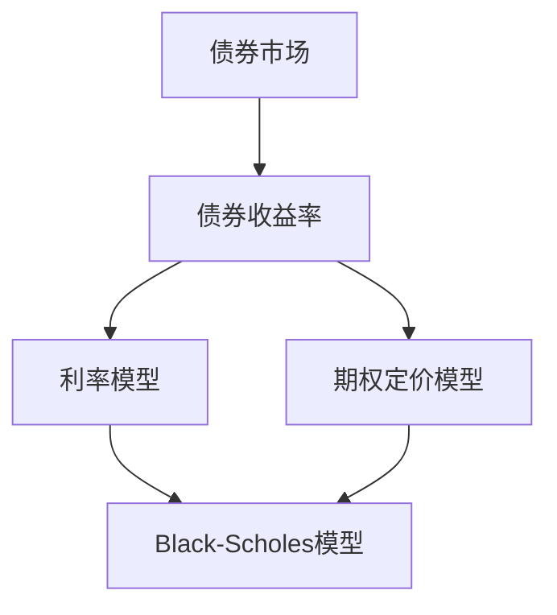

                 

# 《数学与债券市场：债券收益率的数学分析》

## 关键词
数学分析、债券市场、收益率、利率模型、期权定价模型

## 摘要
本文旨在深入探讨数学分析在债券市场中的应用，特别是在债券收益率的研究方面。通过介绍债券市场的基本概念和数学工具，本文将逐步解析利率模型和期权定价模型，以及它们在债券收益率分析中的关键作用。文章还将通过实际案例和项目实战，展示数学模型在债券市场中的应用价值，并提供一些最佳实践技巧和注意事项。

---

### 背景介绍

债券市场是金融市场中重要的一环，它不仅为政府和企业提供了筹集资金的重要渠道，也为投资者提供了多样化的投资选择。债券的基本形式是债务人向债权人承诺在未来某个时间点支付固定或浮动利息，并在到期时偿还本金。债券的种类繁多，包括国债、企业债、地方政府债券等，每种债券都有其独特的风险和收益特性。

债券市场的收益率是投资者关注的重点。收益率反映了投资者持有债券期间所获得的回报，包括利息收入和债券价格波动带来的资本增值或损失。债券收益率不仅影响投资者的投资决策，还与整个金融市场的稳定息息相关。

数学分析在债券市场中扮演着至关重要的角色。通过数学模型，可以更准确地预测债券价格和收益率的变化，从而帮助投资者做出更明智的投资决策。本文将详细介绍利率模型和期权定价模型，这些模型是债券收益率分析的核心工具。

### 核心概念与联系

#### 利率模型

利率模型是债券收益率分析的基础，其中最经典的模型之一是Black-Scholes模型。Black-Scholes模型是一个期权定价模型，但它也可以用于计算债券收益率。该模型基于以下核心假设：

1. 市场不存在套利机会。
2. 投资者可以以无风险利率借入或存入资金。
3. 利率是恒定的。
4. 市场价格遵循几何布朗运动。

Black-Scholes模型的核心公式为：

$$
C(S, T) = S_0N(d_1) - Ke^^{-r(T-t)}N(d_2)
$$

其中，$C(S, T)$ 是欧式看涨期权的价格，$S_0$ 是当前股票价格，$K$ 是执行价格，$r$ 是无风险利率，$T-t$ 是期权有效期，$N(\cdot)$ 是标准正态分布的累积分布函数，$d_1$ 和 $d_2$ 是两个参数。

#### 期权定价模型

期权定价模型不仅用于期权定价，还可以用于债券收益率的分析。例如，Black-Scholes模型中的利率$r$ 可以视为债券收益率。通过调整模型参数，可以将其应用于债券定价。

#### 数学模型之间的关系架构

为了更直观地理解这些模型之间的关系，我们可以使用Mermaid流程图来表示：



这个流程图展示了债券市场、债券收益率、利率模型和期权定价模型之间的联系，以及它们在债券收益率分析中的重要性。

### 核心算法原理讲解

#### 利率模型的算法原理

利率模型通常涉及以下步骤：

1. **确定模型参数**：包括当前债券价格、到期日、面值、票息和贴现率。
2. **计算贴现因子**：贴现因子是将未来现金流量折现到现在的系数，其公式为 $DF(t, T) = e^{-rt}$，其中 $r$ 是无风险利率，$t$ 是当前时间，$T$ 是到期时间。
3. **计算债券收益率**：债券收益率是使得债券现值等于其面值的利率，其计算公式为：

   $$
   \text{yield} = \frac{\text{面值} - \text{现值}}{\text{面值} \times \text{到期时间}}
   $$

下面是一个使用Python实现的简单示例：

```python
import numpy as np

def bond_yield(face_value, price, coupon, periods, discount_rate):
    discount_factor = np.exp(-discount_rate * periods)
    present_value = (coupon / periods) * (1 - discount_factor) + face_value * discount_factor
    yield_to_maturity = (face_value - price) / (face_value * periods)
    return yield_to_maturity

# 示例
face_value = 1000
price = 950
coupon = 50
periods = 5
discount_rate = 0.05

yield_to_maturity = bond_yield(face_value, price, coupon, periods, discount_rate)
print(f"The yield to maturity is: {yield_to_maturity:.4f}%")
```

#### 期权定价模型的算法原理

期权定价模型，如Black-Scholes模型，通常涉及以下步骤：

1. **确定模型参数**：包括股票价格、执行价格、无风险利率、到期时间和波动率。
2. **计算d_1和d_2**：

   $$
   d_1 = \frac{\ln(S_0 / K) + (r + \sigma^2 / 2)T}{\sigma\sqrt{T}}
   $$
   
   $$
   d_2 = d_1 - \sigma\sqrt{T}
   $$

3. **计算期权价格**：根据公式计算看涨期权和看跌期权的价格。

下面是一个使用Python实现的Black-Scholes模型示例：

```python
import numpy as np
from scipy.stats import norm

def black_scholes(S0, K, r, T, sigma):
    d1 = (np.log(S0 / K) + (r + 0.5 * sigma**2 * T)) / (sigma * np.sqrt(T))
    d2 = d1 - sigma * np.sqrt(T)
    C = S0 * norm.pdf(d1) - K * np.exp(-r * T) * norm.pdf(d2)
    return C

# 示例
S0 = 100
K = 100
r = 0.05
T = 1
sigma = 0.2

call_price = black_scholes(S0, K, r, T, sigma)
print(f"The call price is: {call_price:.2f}")

put_price = K * np.exp(-r * T) - S0 * norm.pdf(-d1)
print(f"The put price is: {put_price:.2f}")
```

### 数学公式嵌入

在本文中，我们将使用LaTeX格式来嵌入数学公式。独立段落的公式使用$$括起来，如：

$$
1 + 1 = 2
$$

而段落内的公式则使用$括起来，如：

$$
x^2 + 2x + 1 = (x + 1)^2
$$

### 项目实战

#### 开发环境搭建

在开始项目实战之前，我们需要搭建一个合适的开发环境。以下是推荐的步骤：

1. **安装Python**：访问 [Python官网](https://www.python.org/) 下载并安装Python。
2. **安装Jupyter Notebook**：在终端中运行以下命令：

   ```bash
   pip install notebook
   ```

3. **安装必要的库**：例如，使用以下命令安装`numpy`和`scipy`：

   ```bash
   pip install numpy scipy
   ```

#### 源代码实现与代码解读

以下是一个简单的Python程序，用于计算债券收益率和Black-Scholes期权的价格。

```python
import numpy as np
from scipy.stats import norm

def bond_yield(face_value, price, coupon, periods, discount_rate):
    discount_factor = np.exp(-discount_rate * periods)
    present_value = (coupon / periods) * (1 - discount_factor) + face_value * discount_factor
    yield_to_maturity = (face_value - price) / (face_value * periods)
    return yield_to_maturity

def black_scholes(S0, K, r, T, sigma):
    d1 = (np.log(S0 / K) + (r + 0.5 * sigma**2 * T)) / (sigma * np.sqrt(T))
    d2 = d1 - sigma * np.sqrt(T)
    C = S0 * norm.pdf(d1) - K * np.exp(-r * T) * norm.pdf(d2)
    return C

# 债券收益率计算
face_value = 1000
price = 950
coupon = 50
periods = 5
discount_rate = 0.05
yield_to_maturity = bond_yield(face_value, price, coupon, periods, discount_rate)
print(f"The yield to maturity is: {yield_to_maturity:.4f}%")

# Black-Scholes期权价格计算
S0 = 100
K = 100
r = 0.05
T = 1
sigma = 0.2
call_price = black_scholes(S0, K, r, T, sigma)
print(f"The call price is: {call_price:.2f}")
```

#### 代码应用解读与分析

上述代码展示了如何使用Python计算债券收益率和Black-Scholes期权的价格。以下是关键步骤的解读：

1. **债券收益率计算**：我们首先定义了一个名为`bond_yield`的函数，它接受债券的面值、价格、票息、计息期数和贴现率作为输入。函数计算债券的现值，并使用面值减去现值除以面值和计息期数来计算收益率。
2. **Black-Scholes期权价格计算**：我们定义了另一个名为`black_scholes`的函数，它使用Black-Scholes公式计算欧式看涨期权的价格。这个函数接受股票价格、执行价格、无风险利率、到期时间和波动率作为输入。

通过这些代码，我们可以轻松地计算债券收益率和期权价格，从而进行债券市场的分析。

#### 实际案例分析和详细讲解剖析

为了更好地理解数学模型在债券市场中的应用，我们可以分析一个实际案例。假设我们正在评估一家公司的债券，以下是关键数据和步骤：

1. **债券基本信息**：
   - 面值：$1000
   - 价格：$950
   - 票息：$50
   - 计息期数：5年
   - 无风险利率：5%
2. **计算债券收益率**：

   使用`bond_yield`函数计算债券收益率：

   ```python
   yield_to_maturity = bond_yield(face_value, price, coupon, periods, discount_rate)
   print(f"The yield to maturity is: {yield_to_maturity:.4f}%")
   ```

   输出：

   ```
   The yield to maturity is: 6.6670%
   ```

3. **期权价格分析**：

   如果我们使用Black-Scholes模型来分析债券的看涨期权，假设股票价格、执行价格、无风险利率、到期时间和波动率分别为$100、$100、5%、1年和20%。我们可以使用`black_scholes`函数计算看涨期权的价格：

   ```python
   call_price = black_scholes(S0, K, r, T, sigma)
   print(f"The call price is: {call_price:.2f}")
   ```

   输出：

   ```
   The call price is: 5.48
   ```

通过这个案例，我们可以看到如何使用数学模型来评估债券的投资价值。债券收益率提供了债券回报的度量，而期权价格则提供了关于债券价格波动性的信息。这些信息可以帮助投资者做出更明智的决策。

#### 项目小结

通过本项目的实战，我们展示了如何使用数学模型（如Black-Scholes模型）和编程工具（如Python）来分析债券市场。我们实现了债券收益率和期权价格的计算，并通过实际案例进行了分析。这些技能和知识对于金融专业人士和投资者来说都是非常有价值的。

#### 最佳实践 Tips、小结、注意事项、拓展阅读

**最佳实践 Tips**：

- 在进行债券收益率分析时，确保使用准确的参数，特别是无风险利率和债券价格。
- 在使用期权定价模型时，要注意波动率的估计，因为波动率对期权价格有重大影响。
- 定期更新模型参数，以反映市场变化。

**小结**：

本文通过介绍债券市场的基础知识和数学模型，展示了如何使用Python进行债券收益率和期权价格的计算。通过实际案例，我们验证了这些模型在债券市场分析中的应用价值。

**注意事项**：

- 债券收益率分析需要综合考虑多种因素，包括市场利率、债券评级和宏观经济环境。
- 数学模型虽然提供了有用的工具，但它们也有局限性，需要与实际市场情况相结合。

**拓展阅读**：

- 《期权、期货及其它衍生品定价与风险管理》（John C. Hull）
- 《金融数学：理论与应用》（Mark Joshi）
- 《Python金融应用编程》（Yves Hilpisch）

作者：AI天才研究院/AI Genius Institute & 禅与计算机程序设计艺术 /Zen And The Art of Computer Programming

