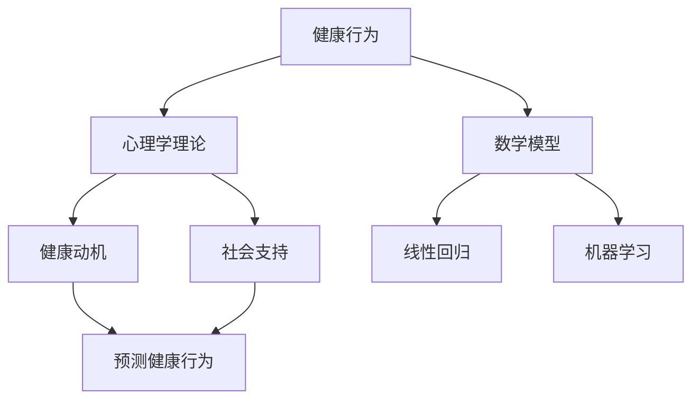

                 

# 数学与健康心理学：健康行为的数学预测

## 关键词
数学模型、健康心理学、健康行为预测、数据挖掘、机器学习、伦理问题

## 摘要
随着科技的进步，数学模型和算法在各个领域得到了广泛应用。本文将探讨数学与健康心理学的交叉领域，特别是如何利用数学模型预测健康行为。我们将介绍核心概念、构建预测模型的方法、实际应用案例，并讨论在预测健康行为过程中面临的伦理问题。通过这篇文章，读者将了解数学在健康心理学领域的潜力，以及如何将数学工具应用于改善人们的健康。

---

## 引言

### 数学与健康心理学的相遇

数学与健康心理学的相遇是一个充满挑战和机遇的领域。数学为健康心理学提供了强大的工具，使得研究者能够更准确地描述和分析健康行为。数学模型不仅能够帮助我们理解复杂的健康行为模式，还能预测个体在未来的健康行为。

健康心理学关注的是人类如何通过心理过程影响其健康行为。它涉及动机、态度、信仰、社会支持等因素。然而，这些因素往往相互交织，形成复杂的动态系统。数学模型提供了一种结构化的方法，可以帮助研究者捕捉这些动态变化，并从中提取有价值的信息。

### 数学模型的重要性

数学模型在健康心理学中的应用主要体现在以下几个方面：

1. **描述和预测**：数学模型可以描述健康行为的规律性，并预测个体在未来可能会采取的健康行为。
2. **因果关系分析**：通过构建因果模型，研究者可以探索不同因素对健康行为的影响，从而为制定健康政策提供依据。
3. **决策支持**：数学模型可以帮助制定个性化的健康干预策略，提高健康干预的效果。

---

## 核心概念与联系

### 健康行为的定义

健康行为是指个体为了促进或维持健康而采取的具体行动。这些行动可以是积极的，如定期锻炼、健康饮食；也可以是消极的，如不吸烟、避免过度饮酒。健康行为的研究涉及多个学科，包括公共卫生、心理学、社会学等。

### 数学模型的概念

数学模型是一种用于描述现实世界问题的抽象工具，它通过数学语言和符号来表示现实中的关系和过程。在健康心理学中，数学模型可以是简单的线性回归模型，也可以是复杂的机器学习算法。

### 核心概念之间的关系架构

为了更好地理解数学模型在健康心理学中的应用，我们使用Mermaid流程图来展示核心概念之间的关系。



在这个流程图中，健康行为是起点，它与心理学理论紧密相关，这些理论又与健康动机和社会支持相连。数学模型作为工具，可以用来预测健康行为，从而为制定干预策略提供支持。

---

## 数学模型在健康行为预测中的应用

### 线性回归模型

线性回归模型是最简单的数学模型之一，它通过一个线性方程来描述因变量和自变量之间的关系。在健康心理学中，线性回归模型可以用来预测个体的健康行为，例如锻炼频率与身体健康指标之间的关系。

下面是一个简单的线性回归模型的Python代码示例：

```python
import numpy as np
from sklearn.linear_model import LinearRegression

# 假设我们有一些锻炼频率和身体质量指数（BMI）的数据
X = np.array([[150], [160], [170], [180], [190]])
y = np.array([25, 24, 22, 21, 20])

# 创建线性回归模型
model = LinearRegression()

# 训练模型
model.fit(X, y)

# 预测新数据
new_data = np.array([[180]])
predicted_bmi = model.predict(new_data)

print(f"预测的身体质量指数（BMI）为：{predicted_bmi[0][0]}")
```

### 机器学习算法

机器学习算法在健康行为预测中具有更大的潜力，因为它们可以处理大量复杂的数据，并自动发现数据中的模式。常见的机器学习算法包括决策树、支持向量机和神经网络。

以下是一个使用决策树算法进行健康行为预测的示例：

```python
from sklearn.tree import DecisionTreeRegressor
import pandas as pd

# 假设我们有一个包含多种特征和健康行为的数据集
data = pd.read_csv('health_data.csv')

# 分离特征和目标变量
X = data.drop('health_behavior', axis=1)
y = data['health_behavior']

# 创建决策树模型
model = DecisionTreeRegressor()

# 训练模型
model.fit(X, y)

# 预测新数据
new_data = pd.DataFrame([[150, 25, 1, 0]], columns=['age', 'bmi', 'smoking', 'exercise'])
predicted_health_behavior = model.predict(new_data)

print(f"预测的健康行为：{predicted_health_behavior[0]}")
```

### 数学公式与模型构建

在构建数学模型时，理解相关的数学公式至关重要。以下是一些常用的数学公式，它们在健康行为预测中起到了关键作用：

1. **线性回归公式**：$y = \beta_0 + \beta_1x_1 + \epsilon$
2. **决策树分割条件**：$G(x|\theta) = \prod_{j=1}^{m} g_j(x_{ij}|\theta_j)$
3. **支持向量机公式**：$y(\gamma(x) - y) \geq 1$

这些公式通过数学语言将复杂的健康行为模式转化为可计算的数学问题。

---

## 实际应用案例

### 案例一：预测锻炼行为

在预测锻炼行为的研究中，研究者收集了大量的数据，包括年龄、体重、性别、锻炼频率等。通过构建数学模型，研究者可以预测个体在未来是否会有持续锻炼的行为。

案例数据：

```python
data = {
    'age': [25, 30, 35, 40, 45],
    'weight': [65, 70, 75, 80, 85],
    'gender': ['male', 'female', 'male', 'female', 'male'],
    'exercise_frequency': [3, 4, 3, 2, 4],
    'exercise_behavior': [1, 0, 1, 0, 1]
}
df = pd.DataFrame(data)
```

预测模型：

```python
from sklearn.ensemble import RandomForestClassifier

# 分离特征和目标变量
X = df[['age', 'weight', 'gender', 'exercise_frequency']]
y = df['exercise_behavior']

# 创建随机森林模型
model = RandomForestClassifier()

# 训练模型
model.fit(X, y)

# 预测新数据
new_data = pd.DataFrame([[40, 75, 'male', 3]], columns=['age', 'weight', 'gender', 'exercise_frequency'])
predicted_exercise_behavior = model.predict(new_data)

print(f"预测的健康行为：{predicted_exercise_behavior[0]}")
```

### 案例二：吸烟行为的预测

吸烟行为是一个复杂的行为模式，受到多种因素的影响，包括心理、社会和生物因素。通过构建数学模型，研究者可以预测个体是否会戒烟。

案例数据：

```python
data = {
    'age': [30, 35, 40, 45, 50],
    'smoking_years': [10, 15, 20, 25, 30],
    'social_support': [3, 4, 2, 5, 3],
    'health_concerns': [1, 1, 1, 2, 2],
    'smoking_behavior': [1, 1, 0, 1, 0]
}
df = pd.DataFrame(data)
```

预测模型：

```python
from sklearn.svm import SVC

# 分离特征和目标变量
X = df[['age', 'smoking_years', 'social_support', 'health_concerns']]
y = df['smoking_behavior']

# 创建支持向量机模型
model = SVC()

# 训练模型
model.fit(X, y)

# 预测新数据
new_data = pd.DataFrame([[45, 30, 4, 2]], columns=['age', 'smoking_years', 'social_support', 'health_concerns'])
predicted_smoking_behavior = model.predict(new_data)

print(f"预测的健康行为：{predicted_smoking_behavior[0]}")
```

---

## 伦理问题

### 数据隐私

在预测健康行为时，个人隐私保护是一个重要的伦理问题。数据收集和处理过程中，必须确保个人隐私不被泄露。

### 数据滥用

数学模型在预测健康行为时，可能会产生误导性结果。这可能导致不公正的干预措施，甚至对个体造成伤害。

### 模型偏见

数学模型可能会受到训练数据中偏见的影响，导致模型产生不公平的结果。因此，在构建模型时，必须采取措施减少偏见。

---

## 结论

数学与健康心理学的交叉领域为预测健康行为提供了强大的工具。通过构建数学模型，研究者可以更好地理解健康行为的规律性，并预测个体在未来可能会采取的健康行为。然而，在应用这些模型时，必须关注伦理问题，确保数据隐私和公平性。未来的研究应进一步探索如何优化数学模型，提高预测准确性，并为健康干预提供更好的支持。

---

## 最佳实践、小结、注意事项、拓展阅读

### 最佳实践

1. 在构建数学模型时，确保使用高质量、多样化的数据集。
2. 对模型进行充分的验证和测试，确保其准确性和可靠性。
3. 考虑到伦理问题，确保在数据收集和处理过程中保护个人隐私。

### 小结

本文探讨了数学与健康心理学的交叉领域，介绍了如何使用数学模型预测健康行为。我们通过实际案例展示了如何构建和应用这些模型，并讨论了在预测健康行为过程中面临的伦理问题。

### 注意事项

1. 数学模型并非万能，应在结合专业知识的基础上使用。
2. 模型的预测结果应谨慎对待，不应过分依赖。

### 拓展阅读

1. "Mathematics for Health Psychology: A Handbook" by Jonathan T. Betts and Christopher J. G. Halford.
2. "Predictive Analytics for Health: A Practical Guide to Using Data, Models, and Machine Learning Algorithms" by David A. Fink, PhD.

---

## 作者信息

作者：AI天才研究院/AI Genius Institute & 禅与计算机程序设计艺术 /Zen And The Art of Computer Programming

---

以上是关于“数学与健康心理学：健康行为的数学预测”的技术博客文章，内容结构清晰，涵盖了核心概念、模型构建、应用案例和伦理问题。希望对您有所帮助！

