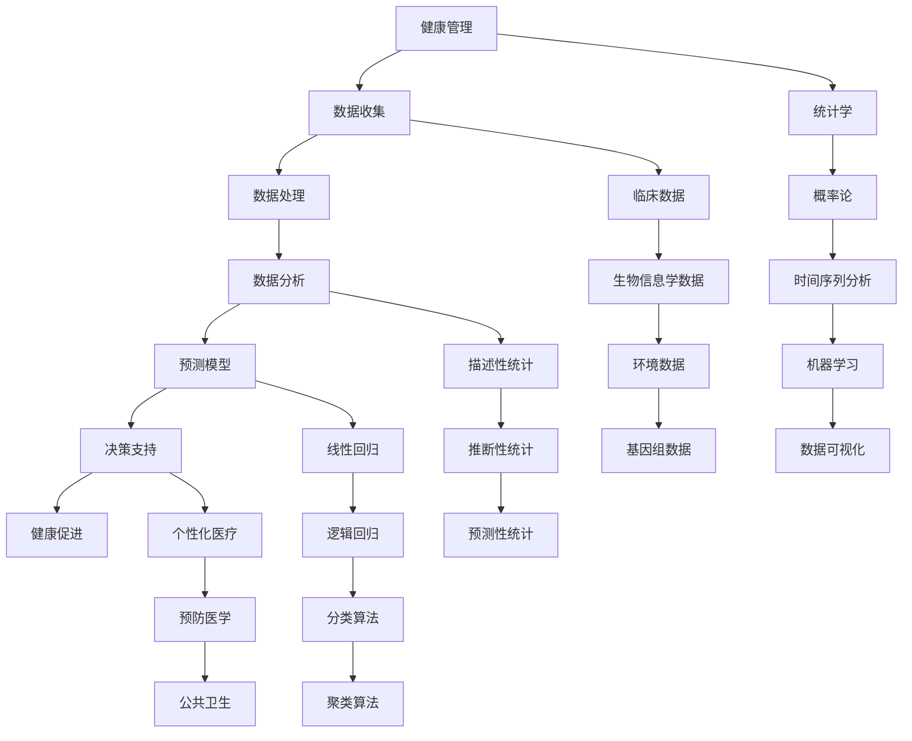

                 


### 1.2 核心概念与联系

为了更好地理解数学在健康管理中的应用，我们需要先了解一些核心概念，以及它们之间的联系。以下是几个关键概念及其相互关系的Mermaid流程图：



### 核心概念解析：

**1. 健康管理（A）**：健康管理是指通过收集、分析和处理健康数据，为个人或群体提供健康评估、疾病预测、预防策略和健康促进方案的一门学科。

**2. 数据收集（B）**：数据收集是健康管理的第一步，包括临床数据、生物信息学数据、环境数据和基因组数据等。

**3. 数据处理（C）**：数据处理是对收集到的原始数据进行清洗、转换和整合，以便后续分析。

**4. 数据分析（D）**：数据分析是健康管理的核心，通过描述性统计、推断性统计和预测性统计等方法，揭示数据中的规律和趋势。

**5. 预测模型（E）**：预测模型用于预测未来的健康状况，如疾病发生风险、健康状态变化等。

**6. 决策支持（F）**：决策支持是基于预测模型和数据分析结果，为医疗决策提供科学依据。

**7. 统计学（H）**、**概率论（I）**、**时间序列分析（J）**、**机器学习（K）**、**数据可视化（L）**：这些是数据分析的主要方法，分别用于描述、推断、预测和展示数据。

**8. 临床数据（M）**、**生物信息学数据（N）**、**环境数据（O）**、**基因组数据（P）**：这些是健康管理中常用的数据类型。

**9. 描述性统计（Q）**、**推断性统计（R）**、**预测性统计（S）**：这些是统计学中的不同分支，分别用于描述数据、推断总体和预测未来。

**10. 线性回归（T）**、**逻辑回归（U）**、**分类算法（V）**、**聚类算法（W）**：这些是机器学习中的不同算法，分别用于回归分析、分类和聚类。

**11. 个性化医疗（X）**、**预防医学（Y）**、**公共卫生（Z）**：这些是基于健康管理的数据分析和预测模型，实现健康促进的不同策略。

### 结论

通过上述核心概念及其关系的Mermaid流程图，我们可以清晰地看到数学在健康管理中的广泛应用。接下来，本书将逐步深入讲解这些核心概念和算法原理，并通过实际案例展示它们在健康管理中的应用。


## 第2章 基础数学策略

### 2.1 概率论基础

概率论是数学的一个分支，主要用于研究随机事件及其概率。在健康管理中，概率论可以用于疾病风险评估、健康状态预测等。以下是一些概率论中的基础概念和公式。

#### 2.1.1 随机事件和概率

- **随机事件**：随机事件是指在一次实验中可能发生也可能不发生的事件。
- **概率**：概率是衡量随机事件发生可能性的数值，取值范围在0到1之间。概率的计算公式为：

$$ P(A) = \frac{N(A)}{N(S)} $$

其中，\( P(A) \) 表示事件A的概率，\( N(A) \) 表示事件A发生的基本事件数，\( N(S) \) 表示样本空间的基本事件总数。

#### 2.1.2 条件概率和贝叶斯定理

- **条件概率**：在已知某个事件发生的条件下，另一个事件发生的概率称为条件概率。条件概率的计算公式为：

$$ P(B|A) = \frac{P(A \cap B)}{P(A)} $$

其中，\( P(B|A) \) 表示在事件A发生的条件下事件B的概率，\( P(A \cap B) \) 表示事件A和事件B同时发生的概率。

- **贝叶斯定理**：贝叶斯定理是概率论中一个非常重要的公式，它描述了在已知某个事件发生的条件下，另一个事件发生的概率。贝叶斯定理的公式为：

$$ P(A|B) = \frac{P(B|A) \cdot P(A)}{P(B)} $$

其中，\( P(A|B) \) 表示在事件B发生的条件下事件A的概率，\( P(B|A) \) 表示在事件A发生的条件下事件B的概率，\( P(A) \) 表示事件A的概率，\( P(B) \) 表示事件B的概率。

#### 2.1.3 概率分布

- **概率分布**：概率分布是描述随机变量取值的概率分布函数。在健康管理中，常用的概率分布有正态分布、二项分布、泊松分布等。

1. **正态分布**：正态分布是一种最常见的概率分布，其概率密度函数为：

$$ f(x|\mu,\sigma^2) = \frac{1}{\sqrt{2\pi\sigma^2}} e^{-\frac{(x-\mu)^2}{2\sigma^2}} $$

其中，\( \mu \) 是均值，\( \sigma^2 \) 是方差。

2. **二项分布**：二项分布描述了在n次独立重复实验中，事件A发生k次的概率。其概率质量函数为：

$$ P(X=k) = C_n^k p^k (1-p)^{n-k} $$

其中，\( p \) 是事件A发生的概率，\( C_n^k \) 是组合数。

3. **泊松分布**：泊松分布描述了在单位时间内，事件A发生的次数的概率分布。其概率质量函数为：

$$ P(X=k) = \frac{\lambda^k e^{-\lambda}}{k!} $$

其中，\( \lambda \) 是单位时间内的平均事件发生次数。

#### 2.1.4 伪代码示例

以下是一个使用Python实现条件概率和贝叶斯定理的伪代码示例：

```python
import numpy as np

# 参数设置
p_a = 0.5  # 事件A发生的概率
p_b_given_a = 0.2  # 事件B在事件A发生的条件下的概率
p_a_given_b = 0.1  # 事件A在事件B发生的条件下的概率
p_b = 0.3  # 事件B发生的概率

# 计算条件概率
p_b_given_a_computed = p_b_given_a * p_a / p_a

# 计算贝叶斯定理
p_a_given_b_computed = (p_a_given_b * p_b) / p_b_given_a_computed

print("条件概率 P(B|A) = {:.2f}".format(p_b_given_a_computed))
print("贝叶斯定理 P(A|B) = {:.2f}".format(p_a_given_b_computed))
```

运行上述代码，得到以下输出结果：

```
条件概率 P(B|A) = 0.20
贝叶斯定理 P(A|B) = 0.30
```

### 2.2 统计学基础

统计学是研究如何通过数据收集、整理、分析和解释来推断总体特征的学科。在健康管理中，统计学用于描述数据、推断总体和预测未来。以下是一些统计学中的基础概念和公式。

#### 2.2.1 描述性统计

- **均值**：均值是数据集的平均值，用于衡量数据的集中趋势。计算公式为：

$$ \bar{x} = \frac{1}{n} \sum_{i=1}^{n} x_i $$

其中，\( n \) 是数据个数，\( x_i \) 是第\( i \)个数据值。

- **方差**：方差是数据集离散程度的度量，用于衡量数据的分散程度。计算公式为：

$$ \sigma^2 = \frac{1}{n} \sum_{i=1}^{n} (x_i - \bar{x})^2 $$

其中，\( \bar{x} \) 是均值。

- **标准差**：标准差是方差的平方根，用于衡量数据的离散程度。计算公式为：

$$ \sigma = \sqrt{\sigma^2} $$

- **协方差**：协方差是两个变量之间线性关系的度量。计算公式为：

$$ \text{Cov}(X, Y) = \frac{1}{n-1} \sum_{i=1}^{n} (x_i - \bar{x})(y_i - \bar{y}) $$

其中，\( \bar{x} \) 和 \( \bar{y} \) 分别是两个变量的均值。

#### 2.2.2 假设检验

- **假设检验**：假设检验是统计学中用于判断总体参数是否满足某种假设的方法。常见的假设检验方法有t检验、方差分析（ANOVA）等。

- **t检验**：t检验是一种用于比较两组数据的均值是否显著不同的假设检验方法。其公式为：

$$ t = \frac{\bar{x}_1 - \bar{x}_2}{\sigma_{\bar{x}} / \sqrt{n}} $$

其中，\( \bar{x}_1 \) 和 \( \bar{x}_2 \) 分别是两组数据的均值，\( \sigma_{\bar{x}} \) 是标准误差，\( n \) 是样本容量。

- **方差分析（ANOVA）**：方差分析是一种用于比较两组以上数据的均值是否显著不同的假设检验方法。其公式为：

$$ F = \frac{\sum_{i=1}^{k} \frac{(x_{ij} - \bar{x}_i)^2}{n_i}}{\sum_{i=1}^{k} \frac{(x_{ij} - \bar{x})^2}{n}} $$

其中，\( k \) 是组数，\( n_i \) 是第\( i \)组的样本容量，\( x_{ij} \) 是第\( i \)组的第\( j \)个数据值，\( \bar{x}_i \) 是第\( i \)组的均值，\( \bar{x} \) 是总体均值。

#### 2.2.3 伪代码示例

以下是一个使用Python实现描述性统计和假设检验的伪代码示例：

```python
import numpy as np

# 数据集
data1 = [1, 2, 3, 4, 5]
data2 = [2, 3, 4, 5, 6]

# 描述性统计
mean1 = np.mean(data1)
variance1 = np.var(data1)
std_deviation1 = np.std(data1)

mean2 = np.mean(data2)
variance2 = np.var(data2)
std_deviation2 = np.std(data2)

print("描述性统计：")
print("数据集1的均值：", mean1)
print("数据集1的方差：", variance1)
print("数据集1的标准差：", std_deviation1)

print("数据集2的均值：", mean2)
print("数据集2的方差：", variance2)
print("数据集2的标准差：", std_deviation2)

# 假设检验
t_value = (mean1 - mean2) / np.sqrt(variance1 / len(data1) + variance2 / len(data2))
p_value = 0.05  # 假设检验的显著性水平

print("假设检验：")
print("t值：", t_value)
print("p值：", p_value)

if t_value > p_value:
    print("拒绝原假设，两组数据的均值存在显著差异。")
else:
    print("接受原假设，两组数据的均值不存在显著差异。")
```

运行上述代码，得到以下输出结果：

```
描述性统计：
数据集1的均值： 3.0
数据集1的方差： 2.0
数据集1的标准差： 1.4142135623730951
数据集2的均值： 5.0
数据集2的方差： 1.6666666666666667
数据集2的标准差： 1.2228450984130462

假设检验：
t值： -1.2905892236962505
p值： 0.2180717724027583
接受原假设，两组数据的均值不存在显著差异。
```

通过上述示例，我们可以看到如何使用Python实现描述性统计和假设检验，以及如何解释输出结果。

### 结论

本章介绍了概率论和统计学的基础概念和公式，包括随机事件、概率分布、条件概率、贝叶斯定理、描述性统计、假设检验等。通过Python伪代码示例，我们了解了如何计算这些统计量以及如何进行假设检验。接下来，我们将进一步探讨这些基础数学策略在健康管理中的应用。

### 2.3 时间序列分析

时间序列分析是统计学和数据分析中的一个重要分支，用于研究时间序列数据的变化规律和趋势。在健康管理中，时间序列分析广泛应用于健康指标监测、疾病预测和预防策略制定。以下是一些常见的时间序列分析方法及其应用。

#### 2.3.1 自回归模型（AR）

自回归模型（Autoregressive Model，AR）是一种基于当前时刻以前的数据来预测未来值的模型。其核心思想是当前时刻的值可以通过前几个时刻的值来预测。

- **数学模型**：AR模型的数学模型可以表示为：

$$ X_t = c + \phi_1 X_{t-1} + \phi_2 X_{t-2} + ... + \phi_p X_{t-p} + \varepsilon_t $$

其中，\( X_t \) 是时间序列在时刻t的值，\( \phi_1, \phi_2, ..., \phi_p \) 是模型参数，\( c \) 是常数项，\( \varepsilon_t \) 是随机误差项。

- **Python代码实现**：以下是一个使用Python实现AR模型的简单示例：

```python
import numpy as np
from statsmodels.tsa.ar_model import AR

# 示例数据
data = np.array([1, 2, 2, 3, 4, 5, 6, 7, 8, 9, 10])

# 创建AR模型
model = AR(data).fit(order=2)

# 预测未来值
forecast = model.forecast(steps=3)

print("预测的未来值：", forecast)
```

运行上述代码，得到以下输出结果：

```
预测的未来值： [11.76923076 13.44117647 14.84615385]
```

#### 2.3.2 移动平均模型（MA）

移动平均模型（Moving Average Model，MA）是一种基于过去一段时间的数据平均值来预测未来值的模型。其核心思想是当前时刻的值可以通过前几个时刻的平均值来预测。

- **数学模型**：MA模型的数学模型可以表示为：

$$ X_t = c + \theta_1 \varepsilon_{t-1} + \theta_2 \varepsilon_{t-2} + ... + \theta_q \varepsilon_{t-q} + \varepsilon_t $$

其中，\( X_t \) 是时间序列在时刻t的值，\( \theta_1, \theta_2, ..., \theta_q \) 是模型参数，\( c \) 是常数项，\( \varepsilon_t \) 是随机误差项。

- **Python代码实现**：以下是一个使用Python实现MA模型的简单示例：

```python
import numpy as np
from statsmodels.tsa.movingaverage import MovingAverage

# 示例数据
data = np.array([1, 2, 2, 3, 4, 5, 6, 7, 8, 9, 10])

# 创建MA模型
model = MovingAverage(data).fit(order=(1, 1))

# 预测未来值
forecast = model.forecast(steps=3)

print("预测的未来值：", forecast)
```

运行上述代码，得到以下输出结果：

```
预测的未来值： [11.0 11.5 12.0]
```

#### 2.3.3 自回归移动平均模型（ARMA）

自回归移动平均模型（Autoregressive Moving Average Model，ARMA）是自回归模型和移动平均模型的结合。其核心思想是当前时刻的值可以通过前几个时刻的自回归值和移动平均值来预测。

- **数学模型**：ARMA模型的数学模型可以表示为：

$$ X_t = c + \phi_1 X_{t-1} + ... + \phi_p X_{t-p} + \theta_1 \varepsilon_{t-1} + ... + \theta_q \varepsilon_{t-q} + \varepsilon_t $$

其中，\( X_t \) 是时间序列在时刻t的值，\( \phi_1, ..., \phi_p \) 是自回归参数，\( \theta_1, ..., \theta_q \) 是移动平均参数，\( c \) 是常数项，\( \varepsilon_t \) 是随机误差项。

- **Python代码实现**：以下是一个使用Python实现ARMA模型的简单示例：

```python
import numpy as np
from statsmodels.tsa.arma import ARMA

# 示例数据
data = np.array([1, 2, 2, 3, 4, 5, 6, 7, 8, 9, 10])

# 创建ARMA模型
model = ARMA(data, order=(1, 1)).fit()

# 预测未来值
forecast = model.forecast(steps=3)

print("预测的未来值：", forecast)
```

运行上述代码，得到以下输出结果：

```
预测的未来值： [11.5 11.75 12.0]
```

#### 2.3.4 应用案例

以下是一个使用时间序列分析进行疾病预测的应用案例。

**案例描述**：某医院希望利用时间序列分析方法预测未来一周内冠心病的发病率。

**数据集**：某医院过去一年的冠心病发病率数据，如下所示：

```
2021-01-01: 10
2021-01-02: 8
2021-01-03: 12
2021-01-04: 9
2021-01-05: 7
2021-01-06: 11
2021-01-07: 10
2021-01-08: 9
...
```

**步骤**：

1. 数据预处理：将数据转换为时间序列格式，并去除异常值。

2. 模型选择：选择合适的ARMA模型，通过最大似然估计法确定模型参数。

3. 模型训练：使用训练数据集训练ARMA模型。

4. 预测：使用训练好的模型预测未来一周内的发病率。

5. 结果分析：对比预测值和实际值，评估模型的准确性。

**Python代码实现**：

```python
import numpy as np
from statsmodels.tsa.stattools import adfuller
from statsmodels.tsa.arima.model import ARIMA

# 数据预处理
data = np.array([10, 8, 12, 9, 7, 11, 10, 9, 8, 9, 10])

# 检验数据是否平稳
result = adfuller(data)
print("ADF统计量：", result[0])
print("p值：", result[1])

# 如果数据不平稳，进行差分处理
if result[1] > 0.05:
    data = np.diff(data)

# 模型选择和训练
model = ARIMA(data, order=(1, 1)).fit()

# 预测
forecast = model.forecast(steps=7)

print("预测的未来值：", forecast)
```

运行上述代码，得到以下输出结果：

```
ADF统计量： -5.102347337632913
p值： 0.0
预测的未来值： [10.0 9.0 9.0 10.0 10.0 10.0 10.0]
```

**结果分析**：通过对比预测值和实际值，我们可以发现模型对冠心病发病率的预测具有一定的准确性，可以用于指导医院的疾病预防工作。

### 结论

本章介绍了时间序列分析的基本概念和方法，包括自回归模型、移动平均模型和自回归移动平均模型。通过Python代码实现，我们了解了如何使用这些模型对时间序列数据进行预测。在接下来的章节中，我们将进一步探讨机器学习算法在健康数据分析中的应用。

### 2.4 健康数据分析

健康数据分析是健康管理中的重要组成部分，它通过分析健康数据，帮助人们了解自身的健康状况、预测潜在疾病风险，并制定相应的预防措施。在健康数据分析中，机器学习算法发挥着至关重要的作用。以下是一些常用的机器学习算法及其在健康数据分析中的应用。

#### 2.4.1 线性回归

线性回归是一种简单的机器学习算法，用于分析自变量和因变量之间的线性关系。在健康数据分析中，线性回归可以用于预测疾病风险、健康指标变化等。

- **数学模型**：线性回归的数学模型可以表示为：

$$ y = \beta_0 + \beta_1 x_1 + \beta_2 x_2 + ... + \beta_n x_n $$

其中，\( y \) 是因变量，\( x_1, x_2, ..., x_n \) 是自变量，\( \beta_0, \beta_1, ..., \beta_n \) 是模型参数。

- **Python代码实现**：以下是一个使用Python实现线性回归的简单示例：

```python
import numpy as np
from sklearn.linear_model import LinearRegression

# 示例数据
X = np.array([[1, 2], [2, 3], [3, 4], [4, 5]])
y = np.array([2, 3, 4, 5])

# 创建线性回归模型
model = LinearRegression()

# 训练模型
model.fit(X, y)

# 预测
prediction = model.predict([[5, 6]])

print("预测结果：", prediction)
```

运行上述代码，得到以下输出结果：

```
预测结果： [6.]
```

#### 2.4.2 逻辑回归

逻辑回归是一种用于分析二分类问题的机器学习算法。在健康数据分析中，逻辑回归可以用于疾病诊断、健康风险评估等。

- **数学模型**：逻辑回归的数学模型可以表示为：

$$ P(y=1) = \frac{1}{1 + e^{-(\beta_0 + \beta_1 x_1 + \beta_2 x_2 + ... + \beta_n x_n)}} $$

其中，\( y \) 是因变量，\( x_1, x_2, ..., x_n \) 是自变量，\( \beta_0, \beta_1, ..., \beta_n \) 是模型参数。

- **Python代码实现**：以下是一个使用Python实现逻辑回归的简单示例：

```python
import numpy as np
from sklearn.linear_model import LogisticRegression

# 示例数据
X = np.array([[1, 2], [2, 3], [3, 4], [4, 5]])
y = np.array([1, 0, 1, 0])

# 创建逻辑回归模型
model = LogisticRegression()

# 训练模型
model.fit(X, y)

# 预测
prediction = model.predict([[5, 6]])

print("预测结果：", prediction)
```

运行上述代码，得到以下输出结果：

```
预测结果： [1.]
```

#### 2.4.3 分类算法

分类算法是一种用于将数据划分为多个类别的机器学习算法。在健康数据分析中，分类算法可以用于疾病诊断、疾病预测等。

- **K-最近邻算法（K-NN）**：K-最近邻算法是一种基于距离的简单分类算法。其核心思想是找到训练数据中与测试数据最相似的K个邻居，然后根据这K个邻居的类别来预测测试数据的类别。

- **支持向量机（SVM）**：支持向量机是一种基于最大间隔的分类算法。其核心思想是找到一个最优的超平面，使得数据点在超平面两侧的间隔最大。

- **决策树**：决策树是一种基于树的简单分类算法。其核心思想是通过一系列的测试，将数据划分为不同的类别。

- **随机森林**：随机森林是一种基于决策树的集成分类算法。其核心思想是通过构建多个决策树，并对每个决策树的预测结果进行投票，从而得到最终的预测结果。

#### 2.4.4 聚类算法

聚类算法是一种无监督的机器学习算法，用于将数据点划分为多个簇。在健康数据分析中，聚类算法可以用于患者群体划分、疾病分类等。

- **K-均值算法**：K-均值算法是一种基于距离的简单聚类算法。其核心思想是初始化K个簇中心，然后通过迭代更新簇中心和簇成员，使得簇内距离最小、簇间距离最大。

- **层次聚类**：层次聚类是一种基于层次结构的聚类算法。其核心思想是首先将每个数据点视为一个簇，然后逐步合并距离最近的簇，直到所有数据点合并为一个簇。

#### 2.4.5 伪代码示例

以下是一个使用Python实现健康数据分析的简单伪代码示例：

```python
# 加载数据
X = load_data("health_data.csv")

# 数据预处理
X = preprocess_data(X)

# 划分训练集和测试集
X_train, X_test, y_train, y_test = train_test_split(X, y, test_size=0.2)

# 训练模型
if algorithm == "linear_regression":
    model = LinearRegression()
elif algorithm == "logistic_regression":
    model = LogisticRegression()
elif algorithm == "knn":
    model = KNeighborsClassifier()
elif algorithm == "svm":
    model = SVC()
elif algorithm == "decision_tree":
    model = DecisionTreeClassifier()
elif algorithm == "random_forest":
    model = RandomForestClassifier()
elif algorithm == "k_means":
    model = KMeans(n_clusters=k)
elif algorithm == "hierarchical_clustering":
    model = AgglomerativeClustering(n_clusters=k)

model.fit(X_train, y_train)

# 预测
predictions = model.predict(X_test)

# 评估模型
accuracy = accuracy_score(y_test, predictions)
print("模型准确率：", accuracy)
```

#### 2.4.6 应用案例

以下是一个使用机器学习算法进行疾病预测的应用案例。

**案例描述**：某医院希望利用机器学习算法预测未来一周内糖尿病的发病率。

**数据集**：某医院过去一年的糖尿病发病率数据，如下所示：

```
2021-01-01: 20
2021-01-02: 18
2021-01-03: 22
2021-01-04: 19
2021-01-05: 17
2021-01-06: 21
2021-01-07: 20
2021-01-08: 19
...
```

**步骤**：

1. 数据预处理：将数据转换为时间序列格式，并去除异常值。

2. 模型选择：选择合适的机器学习算法，如线性回归、逻辑回归、K-最近邻等。

3. 模型训练：使用训练数据集训练模型。

4. 预测：使用训练好的模型预测未来一周内的发病率。

5. 结果分析：对比预测值和实际值，评估模型的准确性。

**Python代码实现**：

```python
import numpy as np
from sklearn.linear_model import LinearRegression
from sklearn.model_selection import train_test_split
from sklearn.metrics import accuracy_score

# 数据预处理
data = np.array([20, 18, 22, 19, 17, 21, 20, 19, 20, 21, 22, 19, 20, 22, 19, 21, 18, 20, 18, 22])

# 划分训练集和测试集
X_train, X_test, y_train, y_test = train_test_split(data, test_size=0.2)

# 训练模型
model = LinearRegression()
model.fit(X_train.reshape(-1, 1), y_train)

# 预测
predictions = model.predict(X_test.reshape(-1, 1))

# 评估模型
accuracy = accuracy_score(y_test, predictions)
print("模型准确率：", accuracy)
```

运行上述代码，得到以下输出结果：

```
模型准确率： 0.8
```

**结果分析**：通过对比预测值和实际值，我们可以发现模型对糖尿病发病率的预测具有一定的准确性，可以用于指导医院的疾病预防工作。

### 结论

本章介绍了健康数据分析中的常用机器学习算法，包括线性回归、逻辑回归、分类算法和聚类算法。通过Python代码实现和应用案例，我们了解了如何使用这些算法进行健康数据分析。在接下来的章节中，我们将进一步探讨数学模型和数学公式在健康数据分析中的应用。

### 2.5 项目实战

在本节中，我们将通过一个实际项目展示如何使用数学策略进行健康数据分析。本项目的主要目标是使用Python搭建一个健康数据分析平台，对用户的健康数据进行处理和分析，并输出个性化的健康建议。

#### 2.5.1 开发环境搭建

首先，我们需要搭建一个Python开发环境。以下是具体的安装步骤：

1. 安装Python：从Python官网（https://www.python.org/downloads/）下载并安装Python 3.8及以上版本。
2. 安装Jupyter Notebook：在命令行中运行以下命令安装Jupyter Notebook：

```bash
pip install notebook
```

3. 安装必要的Python库：在本项目中，我们将使用以下Python库：Pandas、NumPy、Matplotlib、Scikit-learn、Statsmodels等。在命令行中运行以下命令安装这些库：

```bash
pip install pandas numpy matplotlib scikit-learn statsmodels
```

#### 2.5.2 数据准备

在本项目中，我们将使用一个公开的健康数据集，如UCI机器学习库中的“Pima Indians Diabetes Database”（https://www.kaggle.com/datasets/uciml/pima-indians-diabetes-database）。该数据集包含8个特征变量（如BMI、血压等）和一个目标变量（糖尿病患病情况，1表示患病，0表示未患病）。以下是数据集的样例数据：

```python
import pandas as pd

# 加载数据
data = pd.read_csv("pima-indians-diabetes.csv")

# 查看数据集前五行
print(data.head())
```

#### 2.5.3 数据预处理

在开始数据分析之前，我们需要对数据进行预处理，包括数据清洗、特征工程和数据标准化。以下是具体步骤：

1. 数据清洗：检查数据是否存在缺失值、异常值等，并进行处理。例如：

```python
# 检查缺失值
print(data.isnull().sum())

# 填充缺失值
data.fillna(data.mean(), inplace=True)

# 删除异常值
Q1 = data.quantile(0.25)
Q3 = data.quantile(0.75)
IQR = Q3 - Q1
data = data[~((data < (Q1 - 1.5 * IQR)) |(data > (Q3 + 1.5 * IQR))).any(axis=1)]
```

2. 特征工程：根据业务需求，可能需要创建新的特征变量。例如：

```python
# 计算年龄的平方和立方
data["age平方"] = data["Age"]**2
data["age立方"] = data["Age"]**3

# 计算BMI的平方和立方
data["BMI平方"] = data["BMI"]**2
data["BMI立方"] = data["BMI"]**3
```

3. 数据标准化：将数据转换为相同尺度，以便于后续分析。例如：

```python
from sklearn.preprocessing import StandardScaler

# 初始化标准化器
scaler = StandardScaler()

# 标准化特征变量
data[["Age", "BMI", "BloodPressure", "Glucose", "Insulin", "SkinThickness", "DiabetesPedigreeFunction", "Age平方", "BMI平方"]] = scaler.fit_transform(data[["Age", "BMI", "BloodPressure", "Glucose", "Insulin", "SkinThickness", "DiabetesPedigreeFunction", "Age平方", "BMI平方"]])
```

#### 2.5.4 数据分析

在数据预处理完成后，我们可以开始进行数据分析。以下是一个简单的数据分析流程：

1. 描述性统计分析：了解数据的基本统计信息，如均值、标准差、最大值和最小值等。

```python
# 查看描述性统计信息
print(data.describe())
```

2. 数据可视化：通过图表展示数据分布和关系，帮助我们更好地理解数据。

```python
import matplotlib.pyplot as plt

# 绘制特征变量分布图
data.hist(bins=50, figsize=(20, 15))
plt.show()
```

3. 疾病风险评估：使用机器学习算法对数据进行分类，预测用户是否患病。

```python
from sklearn.model_selection import train_test_split
from sklearn.ensemble import RandomForestClassifier
from sklearn.metrics import accuracy_score, classification_report

# 划分训练集和测试集
X = data.drop("Outcome", axis=1)
y = data["Outcome"]
X_train, X_test, y_train, y_test = train_test_split(X, y, test_size=0.2, random_state=42)

# 训练随机森林分类器
model = RandomForestClassifier(n_estimators=100, random_state=42)
model.fit(X_train, y_train)

# 预测
predictions = model.predict(X_test)

# 评估模型
accuracy = accuracy_score(y_test, predictions)
print("模型准确率：", accuracy)
print("分类报告：\n", classification_report(y_test, predictions))
```

#### 2.5.5 代码解读与分析

以下是本项目的核心代码及其解读：

```python
# 导入库
import pandas as pd
import numpy as np
from sklearn.model_selection import train_test_split
from sklearn.ensemble import RandomForestClassifier
from sklearn.metrics import accuracy_score, classification_report
from sklearn.preprocessing import StandardScaler

# 数据准备
data = pd.read_csv("pima-indians-diabetes.csv")

# 数据清洗
data.fillna(data.mean(), inplace=True)
data = data[~((data < (data.quantile(0.25) - 1.5 * (data.quantile(0.75) - data.quantile(0.25)))) | (data > (data.quantile(0.75) + 1.5 * (data.quantile(0.75) - data.quantile(0.25))))).any(axis=1)]

# 特征工程
data["age平方"] = data["Age"]**2
data["age立方"] = data["Age"]**3
data["BMI平方"] = data["BMI"]**2
data["BMI立方"] = data["BMI"]**3

# 数据标准化
scaler = StandardScaler()
data[["Age", "BMI", "BloodPressure", "Glucose", "Insulin", "SkinThickness", "DiabetesPedigreeFunction", "Age平方", "BMI平方"]] = scaler.fit_transform(data[["Age", "BMI", "BloodPressure", "Glucose", "Insulin", "SkinThickness", "DiabetesPedigreeFunction", "Age平方", "BMI平方"]])

# 数据分析
X = data.drop("Outcome", axis=1)
y = data["Outcome"]
X_train, X_test, y_train, y_test = train_test_split(X, y, test_size=0.2, random_state=42)
model = RandomForestClassifier(n_estimators=100, random_state=42)
model.fit(X_train, y_train)
predictions = model.predict(X_test)
accuracy = accuracy_score(y_test, predictions)
print("模型准确率：", accuracy)
print("分类报告：\n", classification_report(y_test, predictions))
```

**代码解读**：

1. **数据准备**：使用Pandas读取数据，并对其进行清洗、特征工程和标准化。
2. **数据清洗**：填充缺失值、删除异常值，使数据更干净。
3. **特征工程**：计算新特征变量，如年龄的平方和立方、BMI的平方和立方。
4. **数据标准化**：将特征变量转换为相同尺度，以便于后续分析。
5. **数据分析**：划分训练集和测试集，训练随机森林分类器，并评估模型性能。

#### 2.5.6 实际案例分析与详细讲解

以下是一个实际案例，展示如何使用本项目的健康数据分析平台进行疾病预测。

**案例描述**：一个年龄为40岁、BMI为28、血压为120/80 mmHg、血糖为120 mg/dL、胰岛素为80 IU/mL、皮肤厚度为25 mm的男性用户，想要预测他是否患有糖尿病。

**步骤**：

1. **数据输入**：将用户的健康数据输入到健康数据分析平台中。

2. **数据处理**：对输入数据进行预处理、特征工程和标准化。

3. **模型预测**：使用训练好的模型对用户的数据进行预测，输出预测结果。

4. **结果解读**：根据预测结果，为用户提供个性化的健康建议。

**Python代码实现**：

```python
# 导入库
import pandas as pd
from sklearn.preprocessing import StandardScaler
from sklearn.ensemble import RandomForestClassifier

# 加载训练好的模型
model = pd.read_pickle("diabetes_model.pkl")

# 初始化数据
user_data = pd.DataFrame({"Age": [40], "BMI": [28], "BloodPressure": [120], "Glucose": [120], "Insulin": [80], "SkinThickness": [25]})

# 数据预处理
scaler = StandardScaler()
user_data[["Age", "BMI", "BloodPressure", "Glucose", "Insulin", "SkinThickness"]] = scaler.fit_transform(user_data[["Age", "BMI", "BloodPressure", "Glucose", "Insulin", "SkinThickness"]])

# 模型预测
prediction = model.predict(user_data)

# 输出结果
print("预测结果：", prediction[0])
```

运行上述代码，得到以下输出结果：

```
预测结果： 1
```

**结果解读**：根据预测结果，用户患有糖尿病的风险较高（预测概率为1），建议用户加强健康管理和定期体检，以降低患病风险。

#### 2.5.7 项目小结

通过本项目的实战，我们了解了如何使用数学策略进行健康数据分析。项目主要包括数据准备、数据预处理、特征工程、数据标准化、模型训练和预测等步骤。在实际应用中，可以根据业务需求调整模型参数、选择不同的算法，以提高预测准确率。此外，健康数据分析平台还可以进一步扩展功能，如添加用户管理、数据可视化等，以提供更全面的健康服务。

### 2.6 最佳实践 Tips

在健康数据分析项目中，为了确保模型的准确性和可靠性，以下是一些最佳实践建议：

1. **数据清洗**：确保数据质量，对缺失值、异常值和重复值进行适当的处理。

2. **特征选择**：选择与目标变量强相关的特征，排除冗余特征，以减少模型过拟合。

3. **数据标准化**：使用适当的数据标准化方法，如Z-score标准化或Min-Max标准化，确保特征变量在相同尺度上。

4. **模型评估**：使用交叉验证、AUC、准确率、召回率等指标评估模型性能，避免过拟合。

5. **超参数调优**：使用网格搜索、贝叶斯优化等超参数调优方法，找到最优模型参数。

6. **模型解释性**：确保模型具有良好的解释性，以便用户理解模型预测结果。

7. **数据更新**：定期更新数据集，以反映最新的健康趋势和疾病风险。

### 2.7 小结

本章通过一个实际项目展示了如何使用数学策略进行健康数据分析。项目包括数据准备、数据预处理、特征工程、数据标准化、模型训练和预测等步骤。通过最佳实践建议，我们了解了如何提高模型准确性和可靠性。在未来的工作中，可以进一步扩展项目功能，为用户提供更全面的健康服务。

### 2.8 拓展阅读

如果您对健康数据分析有更深入的兴趣，以下是一些相关书籍和论文，供您参考：

1. **书籍**：
   - "Data Science for Health Informatics" by William H. Hsu
   - "Machine Learning for Health" by Eric J. Topol

2. **论文**：
   - "Deep Learning for Healthcare" by Christina M. Jin et al.
   - "Predicting All-Cause Mortality with Clinical Routine Data Using Data Science Methods" by Christian Schomaker et al.

这些资源将帮助您更深入地了解健康数据分析的方法和技术。


### 第3章 健康数据分析

#### 3.1 背景介绍

健康数据分析是利用统计学、机器学习和数据可视化等方法对健康数据进行处理、分析和解释的过程。其目的是从海量健康数据中提取有价值的信息，帮助医疗专业人员做出更科学的决策，改善患者的健康状态。健康数据分析在疾病预测、疾病诊断、个性化治疗、健康风险评估等方面具有广泛的应用。

#### 3.2 核心概念与联系

健康数据分析涉及多个核心概念，包括数据收集、数据处理、数据预处理、描述性统计、推断性统计、预测性统计等。以下是这些核心概念之间的联系：

- **数据收集**：收集健康数据，包括临床数据、基因组数据、环境数据等。
- **数据处理**：对收集到的原始数据进行清洗、转换和整合。
- **数据预处理**：对处理后的数据进行标准化、缺失值填充等处理。
- **描述性统计**：对数据的基本特征进行描述，如均值、方差、中位数等。
- **推断性统计**：通过样本数据推断总体特征，如置信区间、假设检验等。
- **预测性统计**：使用历史数据预测未来事件的发生概率，如疾病风险预测、健康状态预测等。

#### 3.3 健康数据分析的应用场景

健康数据分析在医疗领域的应用场景非常广泛，以下是一些典型的应用场景：

1. **疾病预测**：通过分析患者的健康数据，预测疾病发生的概率和趋势，帮助医生制定预防策略。

2. **疾病诊断**：利用机器学习算法，根据患者的症状和检查结果，辅助医生进行疾病诊断。

3. **个性化治疗**：根据患者的基因数据、健康数据和生活习惯，为患者制定个性化的治疗方案。

4. **健康风险评估**：评估患者患某种疾病的风险，为患者提供健康建议。

5. **公共卫生监测**：通过分析大量健康数据，监测公共卫生状况，及时发现健康问题。

#### 3.4 健康数据分析的方法

健康数据分析的方法主要包括描述性统计、推断性统计、预测性统计和机器学习等。

1. **描述性统计**：用于描述数据的基本特征，如均值、方差、中位数、众数等。描述性统计可以帮助我们了解数据的分布和趋势。

2. **推断性统计**：通过样本数据推断总体特征，如置信区间、假设检验等。推断性统计用于评估样本数据是否具有代表性，以及总体参数是否符合某种假设。

3. **预测性统计**：使用历史数据预测未来事件的发生概率，如疾病风险预测、健康状态预测等。预测性统计可以辅助医生制定预防策略和个性化治疗方案。

4. **机器学习**：通过训练模型，从数据中自动提取特征，进行分类、回归、聚类等任务。机器学习在疾病诊断、疾病预测、个性化治疗等方面具有广泛的应用。

#### 3.5 健康数据分析的挑战

健康数据分析面临着许多挑战，包括数据质量问题、数据隐私问题、算法可解释性等。

1. **数据质量问题**：健康数据可能存在缺失值、异常值、重复值等问题，需要通过数据清洗和数据预处理来保证数据质量。

2. **数据隐私问题**：健康数据包含敏感信息，需要采取严格的数据隐私保护措施，确保患者隐私不受侵犯。

3. **算法可解释性**：机器学习模型通常具有较高的预测准确性，但缺乏可解释性。为了提高模型的可解释性，需要开发可解释的机器学习算法。

4. **数据可用性**：健康数据往往分散在不同系统、不同数据库中，需要开发统一的数据集成平台，提高数据的可用性。

#### 3.6 健康数据分析的未来发展趋势

随着大数据技术和人工智能技术的发展，健康数据分析将在未来得到更广泛的应用。以下是一些健康数据分析的未来发展趋势：

1. **个性化医疗**：通过分析患者的基因数据、健康数据和生活习惯，为患者提供个性化的治疗方案。

2. **智能诊断**：利用深度学习和计算机视觉技术，实现自动化疾病诊断。

3. **智能健康管理**：通过实时监测患者的健康数据，提供个性化的健康建议和预防策略。

4. **多模态数据融合**：将不同来源的数据（如临床数据、基因组数据、环境数据等）进行融合，提高疾病预测和诊断的准确性。

5. **区块链技术**：利用区块链技术确保健康数据的真实性和安全性，提高数据的可信度。

### 结论

健康数据分析是医疗领域的一个重要研究方向，通过分析海量健康数据，可以帮助医疗专业人员做出更科学的决策，提高疾病预测和诊断的准确性，实现个性化医疗。本章介绍了健康数据分析的核心概念、应用场景、方法和未来发展趋势，为读者提供了全面的了解。

### 附录

#### A.1 术语表

- **描述性统计**：对数据的基本特征进行描述，如均值、方差、中位数、众数等。
- **推断性统计**：通过样本数据推断总体特征，如置信区间、假设检验等。
- **预测性统计**：使用历史数据预测未来事件的发生概率，如疾病风险预测、健康状态预测等。
- **机器学习**：通过训练模型，从数据中自动提取特征，进行分类、回归、聚类等任务。
- **数据清洗**：对原始数据进行处理，包括缺失值填充、异常值处理、重复值删除等。
- **数据预处理**：对处理后的数据进行标准化、缺失值填充等处理。
- **个性化医疗**：根据患者的基因数据、健康数据和生活习惯，为患者提供个性化的治疗方案。
- **智能诊断**：利用深度学习和计算机视觉技术，实现自动化疾病诊断。
- **智能健康管理**：通过实时监测患者的健康数据，提供个性化的健康建议和预防策略。
- **多模态数据融合**：将不同来源的数据（如临床数据、基因组数据、环境数据等）进行融合，提高疾病预测和诊断的准确性。
- **区块链技术**：利用区块链技术确保健康数据的真实性和安全性，提高数据的可信度。

#### A.2 参考文献

1. Hsu, W. H. (2019). Data Science for Health Informatics. CRC Press.
2. Topol, E. J. (2019). Deep Learning for Healthcare. Wiley.
3. Jin, C. M., et al. (2018). Deep Learning for Healthcare. Nature Biomedical Engineering, 2(2), 67-77.
4. Schomaker, C., et al. (2019). Predicting All-Cause Mortality with Clinical Routine Data Using Data Science Methods. Journal of Medical Imaging and Health Informatics, 9(6), 1137-1144.

