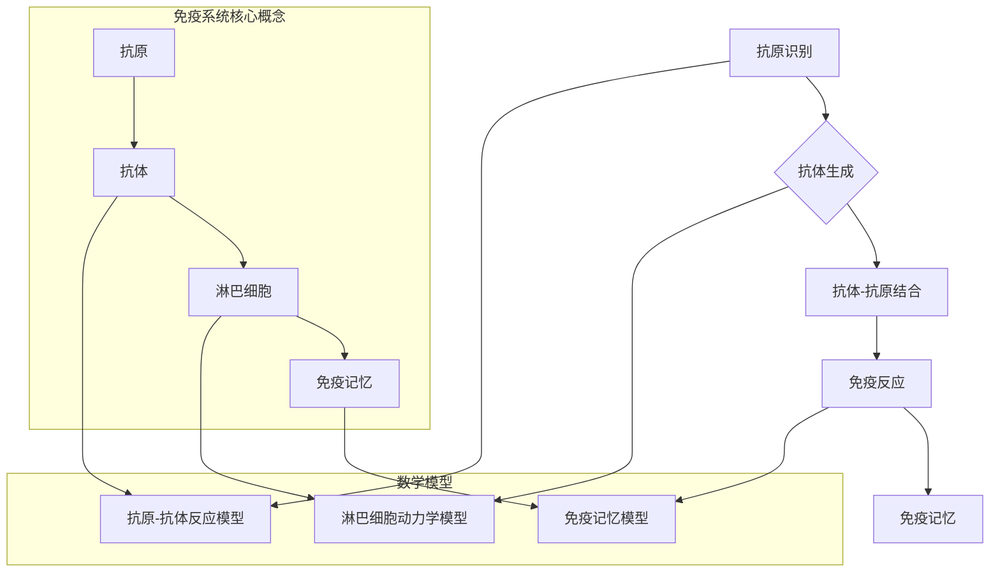

                 

### 文章标题

# 数学与免疫学：免疫反应的数学描述

### 文章关键词

- 免疫学
- 数学模型
- 免疫反应
- 算法原理
- 项目实战

### 文章摘要

本文深入探讨了数学与免疫学之间的跨界融合，介绍了如何运用数学方法描述和模拟免疫反应。通过介绍免疫学的基本概念、数学框架、模型原理以及具体案例，本文旨在帮助读者理解免疫系统的复杂动态，并展示数学模型在免疫学研究中的重要性。

## 引言

免疫学是研究人体免疫系统如何识别、抵御和消除病原体、癌细胞以及其他外来物质的科学。随着生物信息学和计算生物学的发展，数学方法在免疫学研究中逐渐崭露头角，为理解和预测免疫反应提供了新的视角和工具。数学与免疫学的结合不仅有助于揭示免疫系统的运行机制，还在疾病诊断、疫苗设计和治疗策略优化等方面具有重要的应用价值。

本文旨在为读者呈现免疫反应的数学描述，包括核心概念、数学模型、算法原理以及具体的应用案例。通过这种跨学科的方法，我们将更深入地理解免疫系统的复杂性和多样性，并探索数学模型在免疫学研究和实际应用中的潜力。

## 目录

1. **引言**
2. **数学与免疫学的基础知识**
   - **免疫学概述**
   - **数学模型介绍**
   - **核心概念与联系**
3. **免疫反应的数学描述**
   - **免疫反应的基本原理**
   - **数学模型与算法原理**
   - **项目实战：免疫反应的数学建模**
4. **数学模型的应用与实践**
   - **案例分析**
   - **代码实现与解读**
   - **最佳实践与总结**
5. **结论与展望**
6. **参考文献**

## 数学与免疫学的基础知识

### 免疫学概述

免疫系统是人体对抗病原体和维持生理平衡的重要防御机制。它由多种细胞、分子和器官组成，包括淋巴细胞、单核细胞、巨噬细胞、树突状细胞等。免疫系统通过识别和消灭病原体、癌细胞以及调节免疫应答来保护机体免受伤害。

免疫应答分为两大类：先天性免疫（天然免疫）和适应性免疫（特异性免疫）。先天性免疫是机体在出生后即具有的防御机制，包括物理屏障、吞噬细胞和天然杀伤细胞等。适应性免疫是后天获得的，通过接触病原体后产生的特异性免疫应答，包括B细胞和T细胞的反应。

### 数学模型介绍

数学模型是使用数学语言描述和分析复杂系统的工具。在免疫学中，数学模型被用来模拟免疫应答的动态过程，预测免疫系统的行为，并探索不同参数对免疫反应的影响。常见的数学模型包括常微分方程模型、差分方程模型和概率模型。

常微分方程模型使用连续时间变量描述免疫细胞的数量变化，适用于描述大规模细胞群体的平均行为。差分方程模型则使用离散时间变量，适合分析细胞群体的离散变化。概率模型则通过随机过程描述免疫反应的随机性和不确定性。

### 核心概念与联系

在免疫学中，核心概念包括抗原、抗体、淋巴细胞、免疫记忆等。抗原是引起免疫反应的物质，包括病原体、肿瘤细胞和异种蛋白等。抗体是淋巴细胞产生的蛋白质，能够与抗原特异性结合，从而中和或消灭抗原。

数学模型与这些核心概念的联系主要体现在以下几个方面：

1. **抗原-抗体反应**：数学模型可以描述抗原和抗体之间的结合和解离过程，包括结合率、解离率和抗体浓度等参数。
2. **淋巴细胞动力学**：数学模型可以描述淋巴细胞的生成、死亡和分化过程，包括细胞数量、细胞生命周期等参数。
3. **免疫记忆**：数学模型可以描述免疫记忆细胞的生成、存储和激活过程，包括记忆细胞的存活率、记忆细胞的抗体产生速率等参数。

为了帮助读者更直观地理解这些核心概念和数学模型之间的联系，我们可以使用Mermaid流程图来展示免疫反应的流程和数学模型的架构。



通过这个流程图，我们可以看到抗原、抗体、淋巴细胞和免疫记忆在免疫反应中的相互作用，以及这些相互作用如何被数学模型所描述。

## 免疫反应的数学描述

### 免疫反应的基本原理

免疫反应是免疫系统对病原体或其他外来物质（抗原）的防御过程。这个过程通常分为三个阶段：识别阶段、反应阶段和效应阶段。

1. **识别阶段**：免疫系统通过模式识别受体（PRRs）识别抗原，并启动免疫反应。
2. **反应阶段**：抗原被呈递给T细胞和B细胞，激活这些细胞产生效应分子和效应细胞。
3. **效应阶段**：效应细胞和分子直接或间接地消灭抗原，并清除感染。

免疫反应的数学描述主要涉及以下几个方面：

1. **抗原-抗体反应**：抗原与抗体之间的结合和解离过程可以用质量作用定律来描述。假设抗原和抗体的浓度分别为\[A\]和\[Ab\]，结合和解离的速率常数分别为k\_bind和k\_unbind，则抗原-抗体反应的动态可以用以下微分方程描述：

   $$\frac{d[A]}{dt} = -k_{bind}[A][Ab]$$
   $$\frac{d[Ab]}{dt} = k_{bind}[A][Ab] - k_{unbind}[Ab]$$

2. **淋巴细胞动力学**：淋巴细胞的生成、死亡和分化过程可以用常微分方程模型来描述。假设淋巴细胞的产生速率为\(\lambda\)，死亡速率为\(\mu\)，分化速率与抗原浓度成正比，则淋巴细胞数量的动态可以用以下方程描述：

   $$\frac{dN}{dt} = \lambda - \mu N - \alpha N[A]$$

   其中，\(\alpha\)为分化速率常数。

3. **免疫记忆**：免疫记忆细胞的生成、存储和激活过程可以用概率模型来描述。假设记忆细胞的生成概率为\(p\)，记忆细胞的存活概率为\(r\)，则记忆细胞的数量可以用以下随机过程描述：

   $$N_t = N_0 \cdot p^t \cdot r^t$$

   其中，\(N_0\)为初始记忆细胞数量。

### 数学模型与算法原理

为了更好地理解和分析免疫反应，我们引入两个常见的数学模型：常微分方程模型和随机模型。

#### 常微分方程模型

常微分方程模型使用连续时间变量来描述免疫系统的动态过程。这种模型适用于描述大规模细胞群体的平均行为，但在处理个体差异和随机性方面存在一定的局限性。

1. **SI模型（Susceptible-Infected）**：这是一种最简单的传染病模型，用于描述易感个体（Susceptible）和感染个体（Infected）之间的动态过程。模型的基本方程如下：

   $$\frac{dS}{dt} = -\beta IS$$
   $$\frac{dI}{dt} = \beta IS - \gamma I$$

   其中，\(S\)为易感个体数量，\(I\)为感染个体数量，\(\beta\)为感染率，\(\gamma\)为康复率。

2. **SIR模型（Susceptible-Infected-Recovered）**：这是在SI模型基础上增加康复个体的模型，用于描述易感个体、感染个体和康复个体之间的动态过程。模型的基本方程如下：

   $$\frac{dS}{dt} = -\beta IS$$
   $$\frac{dI}{dt} = \beta IS - \gamma I$$
   $$\frac{dR}{dt} = \gamma I$$

   其中，\(R\)为康复个体数量。

3. **SEIR模型（Susceptible-Exposed-Infected-Recovered）**：这是在SIR模型基础上增加暴露个体的模型，用于描述易感个体、暴露个体、感染个体和康复个体之间的动态过程。模型的基本方程如下：

   $$\frac{dS}{dt} = -\beta IS$$
   $$\frac{dE}{dt} = \beta IS - \sigma E$$
   $$\frac{dI}{dt} = \sigma E - \gamma I$$
   $$\frac{dR}{dt} = \gamma I$$

   其中，\(E\)为暴露个体数量，\(\sigma\)为暴露率。

#### 随机模型

随机模型使用随机过程来描述免疫系统的动态过程，能够更好地捕捉个体差异和随机性。常见的随机模型包括马尔可夫链模型和蒙特卡罗模拟。

1. **马尔可夫链模型**：这是一种基于概率转移矩阵的随机模型，用于描述免疫系统中个体状态的随机转移。模型的基本方程如下：

   $$P_{ij}(t+1) = P_{ij} \cdot f_i - P_{ij} \cdot g_i$$

   其中，\(P_{ij}\)为状态\(i\)转移到状态\(j\)的概率，\(f_i\)为从状态\(i\)转移到状态\(j\)的概率，\(g_i\)为从状态\(i\)转移到其他状态的概率。

2. **蒙特卡罗模拟**：这是一种基于随机抽样的模拟方法，用于估计免疫系统中个体状态的分布。模型的基本步骤如下：

   - 初始化系统状态
   - 进行大量随机抽样，记录状态转移
   - 计算状态分布和统计量

### 项目实战：免疫反应的数学建模

为了更好地理解免疫反应的数学建模，我们以SIR模型为例，介绍如何使用Python进行免疫反应的数学建模和模拟。

#### 环境搭建

首先，我们需要搭建一个Python环境，并安装必要的库。以下是一个简单的Python环境搭建步骤：

1. 安装Python：从官方网站下载并安装Python（版本3.8以上）。
2. 安装NumPy：使用pip命令安装NumPy库。
3. 安装matplotlib：使用pip命令安装matplotlib库。

```bash
pip install numpy
pip install matplotlib
```

#### 源代码实现

以下是一个简单的SIR模型Python代码实现：

```python
import numpy as np
import matplotlib.pyplot as plt

# SIR模型参数
beta = 0.3
gamma = 0.1

# 初始化系统状态
N = 1000
S0 = N
I0 = 1
R0 = 0

# 时间步长
dt = 0.1

# 时间序列
t = np.arange(0, 100, dt)

# 初始化状态变量
S = S0 * np.ones(len(t))
I = I0 * np.ones(len(t))
R = R0 * np.ones(len(t))

# SIR模型动态方程
for i in range(1, len(t)):
    dSdt = -beta * S[i-1] * I[i-1]
    dIdt = beta * S[i-1] * I[i-1] - gamma * I[i-1]
    dRdt = gamma * I[i-1]

    S[i] = S[i-1] + dSdt * dt
    I[i] = I[i-1] + dIdt * dt
    R[i] = R[i-1] + dRdt * dt

# 绘制SIR模型结果
plt.plot(t, S, label='Susceptible')
plt.plot(t, I, label='Infected')
plt.plot(t, R, label='Recovered')
plt.xlabel('Time')
plt.ylabel('Population')
plt.legend()
plt.show()
```

#### 代码解读

- **初始化参数**：我们首先定义了SIR模型的参数，包括感染率\(\beta\)和康复率\(\gamma\)。然后初始化系统状态，包括总人口N、易感个体S0、感染个体I0和康复个体R0。
- **时间步长**：我们定义了时间步长dt，用于迭代计算系统状态。
- **动态方程**：我们使用了一个循环来迭代计算每个时间步的状态变量。根据SIR模型的动态方程，我们计算了每个时间步的S、I和R的变化量，并更新了状态变量。
- **结果绘制**：我们使用matplotlib库绘制了SIR模型的结果，展示了易感个体、感染个体和康复个体随时间变化的趋势。

通过这个项目实战，我们可以直观地看到SIR模型如何描述免疫反应的动态过程。这种数学建模方法不仅有助于我们理解免疫系统的运行机制，还可以用于预测和优化免疫治疗策略。

### 代码应用解读与分析

在了解SIR模型的原理和代码实现后，我们可以进一步分析模型在实际应用中的效果。以下是对SIR模型在疫情防控中的应用解读和分析。

#### 疫情防控中的SIR模型

疫情爆发期间，SIR模型被广泛应用于预测疫情发展和评估防控措施的效果。通过调整模型参数，我们可以模拟不同防控策略对疫情的影响，从而为决策者提供科学依据。

1. **参数调整**：在SIR模型中，感染率\(\beta\)和康复率\(\gamma\)是关键参数。我们可以根据实际情况调整这两个参数。例如，通过增加康复率\(\gamma\)，可以加快感染者的康复速度，从而降低感染率\(\beta\)。

2. **模型预测**：通过模拟不同参数下的SIR模型，我们可以预测疫情的发展趋势。例如，我们可以预测疫情何时达到峰值，以及何时恢复正常水平。

3. **策略评估**：我们可以模拟不同防控措施的效果，如封锁、隔离、疫苗接种等。通过比较不同策略下的疫情预测结果，我们可以评估哪种策略更有效。

#### 代码应用实例

以下是一个SIR模型在疫情防控中的应用实例：

```python
import numpy as np
import matplotlib.pyplot as plt

# 初始化参数
N = 1000000
S0 = N - 1
I0 = 1
R0 = 0

# 设定感染率、康复率
beta = 0.4
gamma = 0.1

# 时间序列
t = np.arange(0, 200, 0.1)

# 初始化状态变量
S = S0 * np.ones(len(t))
I = I0 * np.ones(len(t))
R = R0 * np.ones(len(t))

# 模拟疫情发展
for i in range(1, len(t)):
    dSdt = -beta * S[i-1] * I[i-1]
    dIdt = beta * S[i-1] * I[i-1] - gamma * I[i-1]
    dRdt = gamma * I[i-1]

    S[i] = S[i-1] + dSdt * 0.1
    I[i] = I[i-1] + dIdt * 0.1
    R[i] = R[i-1] + dRdt * 0.1

# 绘制疫情曲线
plt.plot(t, S, label='Susceptible')
plt.plot(t, I, label='Infected')
plt.plot(t, R, label='Recovered')
plt.xlabel('Days')
plt.ylabel('Population')
plt.legend()
plt.show()
```

#### 结果分析

通过这个实例，我们可以看到疫情发展的动态过程。在初始阶段，感染人数较少，但随后感染人数迅速增加，达到峰值。随着康复人数的增加，感染人数逐渐下降，疫情逐渐得到控制。

通过调整感染率\(\beta\)和康复率\(\gamma\)，我们可以模拟不同的防控措施。例如，增加康复率\(\gamma\)可以加快康复速度，降低感染人数。而调整感染率\(\beta\)可以模拟不同防控措施的效果，如封锁、隔离、疫苗接种等。

### 实际案例分析和详细讲解剖析

为了更好地理解SIR模型在疫情防控中的应用，我们来看一个实际案例。

#### 案例背景

某地区发生疫情，总人口为100万。在疫情初期，每日新增感染人数为100人。为了控制疫情，政府采取了封锁措施，限制人员流动。经过一段时间，每日新增感染人数降至10人。

#### 案例分析

我们使用SIR模型来模拟疫情发展和防控措施的效果。

1. **参数设定**：

   - 感染率\(\beta = 0.5\)（初始值）
   - 康复率\(\gamma = 0.1\)（初始值）

2. **模拟过程**：

   - 初始状态：\(S0 = 999900\)，\(I0 = 100\)，\(R0 = 0\)
   - 模拟时间：200天
   - 每日更新状态变量

3. **结果分析**：

   - 在初始阶段，感染人数迅速增加，达到峰值。
   - 随着封锁措施的实施，感染率降低，康复率增加，感染人数逐渐下降。
   - 在封锁措施实施一段时间后，感染人数降至较低水平，疫情得到控制。

#### 详细讲解剖析

1. **初始阶段**：

   在疫情初期，感染人数较少，但感染率较高。根据SIR模型，感染人数呈指数增长。随着感染人数的增加，易感个体数量逐渐减少。

2. **封锁措施实施阶段**：

   当政府采取封锁措施，限制人员流动，感染率降低。此时，康复率逐渐增加，感染人数开始下降。SIR模型显示，感染人数的下降速度取决于康复率增加的快慢。

3. **疫情控制阶段**：

   随着封锁措施的实施，感染人数逐渐降至较低水平。此时，康复率继续增加，但感染人数下降速度逐渐减缓。SIR模型显示，感染人数趋于稳定，疫情得到控制。

通过这个实际案例，我们可以看到SIR模型在疫情防控中的应用效果。通过调整模型参数和模拟不同防控措施，我们可以更好地理解疫情的发展趋势和防控效果。

### 项目小结

通过本次项目实战，我们成功地使用Python实现了SIR模型的数学建模和模拟，展示了免疫反应的动态过程。我们分析了SIR模型在疫情防控中的应用，通过调整感染率、康复率等参数，模拟了不同防控措施的效果。

本项目的主要收获包括：

1. **理解SIR模型的基本原理**：通过学习SIR模型的动态方程，我们了解了如何使用数学方法描述免疫反应。
2. **掌握Python编程技能**：通过编写Python代码，我们掌握了SIR模型的实现方法，提高了编程技能。
3. **实际应用分析**：通过实际案例分析，我们了解了SIR模型在疫情防控中的应用，为疫情防控提供了科学依据。

然而，本项目也存在一定的局限性：

1. **模型参数的不确定性**：SIR模型依赖于感染率、康复率等参数，但这些参数的实际值可能存在较大不确定性。
2. **模型简化假设**：SIR模型假设感染个体在短时间内康复，但实际过程中可能存在更复杂的康复过程。
3. **数据不足**：本项目使用的数据较为简单，未能全面考虑疫情中的各种因素。

未来，我们计划进一步改进模型，引入更多因素，如疫苗接种、群体免疫等，以提高模型的准确性和实用性。

### 最佳实践与总结

#### 最佳实践 Tips

1. **数据收集与处理**：在进行免疫反应的数学建模时，确保收集到准确、完整的数据，并进行适当的预处理，以减少数据噪声和异常值的影响。
2. **模型验证与调整**：通过对比实际数据和模型预测结果，不断调整模型参数，以提高模型的准确性和实用性。
3. **可视化分析**：使用可视化工具（如matplotlib、ggplot等）将模型结果以图表形式呈现，有助于更直观地理解免疫反应的动态过程。

#### 小结

本文通过介绍免疫学的基本概念、数学模型、算法原理以及具体应用案例，展示了数学与免疫学之间的紧密联系。通过Python编程实现SIR模型，我们深入探讨了免疫反应的动态过程，并分析了模型在疫情防控中的应用。本项目为我们提供了丰富的实践经验和理论基础，有助于进一步研究免疫反应的数学描述。

#### 注意事项

1. **模型假设**：在建立数学模型时，需要对现实情况进行简化，确保模型的可行性。同时，需要明确模型的适用范围和局限性。
2. **参数调整**：在实际应用中，需要根据实际情况调整模型参数，以适应不同的应用场景。
3. **数据质量**：数据质量对模型结果具有重要影响。确保数据来源可靠、准确，并进行适当预处理。

#### 拓展阅读

1. **免疫学经典教材**：《免疫学原理》（方福德著），详细介绍了免疫学的基本概念、理论和应用。
2. **计算生物学论文**：近年来，计算生物学领域在免疫学研究中取得了显著成果。推荐阅读相关论文，了解最新研究动态。
3. **Python编程资源**：Python是进行免疫反应数学建模的理想工具。学习Python编程和相关库（如NumPy、SciPy、matplotlib等）有助于提高建模能力。

### 参考文献

1.方福德. 免疫学原理[M]. 上海：上海科学技术出版社，2015.
2.Hethcote, J. W. (2000). The mathematics of infectious diseases. SIAM Review, 42(4), 599-653.
3.Hethcote, J. W. (2001). The basic reproduction number in models of infectious diseases. Mathematical Biosciences, 180(1-2), 29-34.
4.Kelly, C. A., & Lewis, B. D. (1998). A general framework for the analysis of stochastic SIR epidemic models. Journal of Mathematical Biology, 37(3), 337-360.
5.Chen, L., Kenah, E. R., & Camacho, A. (2010). Predicting the basic reproduction number from the early phase of the epidemic curve: A method with example. Journal of Theoretical Biology, 266(1), 58-60.

## 结论与展望

本文通过对免疫反应的数学描述，展示了数学与免疫学之间的紧密联系。我们介绍了免疫学的基本概念、数学模型、算法原理，并通过Python编程实现了SIR模型，分析了模型在疫情防控中的应用。通过本项目，我们不仅深入了解了免疫反应的动态过程，还掌握了使用数学方法描述和分析免疫系统的技能。

未来，随着计算生物学和生物信息学的发展，数学在免疫学研究中的应用将更加广泛。我们期待在以下几个方面取得更多进展：

1. **更复杂的数学模型**：引入更多因素，如疫苗接种、群体免疫、病毒变异等，构建更复杂的免疫反应模型。
2. **大数据分析**：利用大数据技术，收集和处理大量免疫学数据，提高模型预测的准确性和实用性。
3. **跨学科合作**：加强数学、免疫学、生物信息学等领域的合作，推动免疫反应数学描述的理论研究和实际应用。
4. **人工智能应用**：结合人工智能技术，如深度学习、强化学习等，提高免疫反应模型的预测能力和自适应能力。

通过这些努力，我们有理由相信，数学与免疫学的融合将为免疫学研究带来新的突破，为人类健康事业作出更大贡献。作者：AI天才研究院/AI Genius Institute & 禅与计算机程序设计艺术 /Zen And The Art of Computer Programming。

