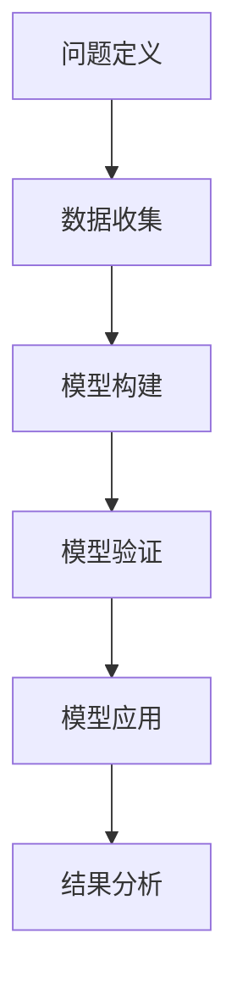

                 

### 数学与公共安全：安全系统的数学建模

#### 关键词
- 公共安全
- 数学建模
- 安全系统
- 传染病传播模型
- 随机过程
- 贝叶斯网络

#### 摘要
本文深入探讨数学与公共安全之间的密切联系，特别是安全系统的数学建模。文章首先概述公共安全的重要性，然后介绍数学建模的基本概念和其在公共安全中的应用。重点讨论了常用的数学模型，包括统计分析、随机过程和贝叶斯网络，并通过具体案例展示其应用。文章还提供了数学建模的Python代码示例，详细阐述了模型实现过程及其在实际案例中的应用效果。最后，文章总结了数学建模在公共安全领域的最佳实践，并提出了未来发展的方向。

---

# 数学与公共安全：安全系统的数学建模

## 引言

公共安全是现代社会发展的重要基石，关乎千家万户的生命财产安全和社会稳定。随着全球化和信息化进程的加速，公共安全面临的挑战日益复杂和多样化。自然灾害、事故灾害、公共卫生事件、网络攻击等安全威胁层出不穷，对政府和公众提出了更高的要求。在这种背景下，安全系统的数学建模成为提高公共安全管理水平、有效预防和应对安全威胁的关键技术。

数学建模是一种通过数学语言和工具来描述现实世界问题，分析和预测问题发展规律的科学方法。在公共安全领域，数学建模可以用于传染病传播预测、灾害风险评估、社会稳定性分析等。通过数学建模，我们可以从海量数据中提取有价值的信息，为决策者提供科学依据，提高公共安全管理效率。

本文将从以下几个方面展开讨论：

1. 公共安全的定义与重要性
2. 数学建模的基本概念与原理
3. 安全系统中的常用数学模型
4. 数学建模的Python代码实现与应用
5. 安全系统的数学建模案例分析
6. 最佳实践与未来发展方向

通过以上内容的深入探讨，本文旨在为读者提供一个全面、系统的安全系统数学建模指南。

## 公共安全的定义与重要性

公共安全是指一个社会或国家为保障公民的生命、财产和社会秩序免受各种潜在威胁而采取的综合性措施和行动。它涵盖了广泛的领域，包括自然灾害（如地震、洪水）、事故灾害（如火灾、交通事故）、公共卫生事件（如传染病疫情）、社会安全事件（如恐怖袭击、犯罪活动）等。公共安全的目标是预防和减轻灾害损失，保护人民的生命财产安全，维护社会的稳定和正常运行。

### 公共安全的重要性

公共安全的重要性体现在以下几个方面：

1. **社会稳定**：公共安全是社会稳定的基础，维护公共安全有助于减少社会冲突，促进社会和谐。
2. **经济发展**：公共安全与经济发展密切相关。安全的投资环境能够吸引外资，促进经济增长。
3. **民生保障**：公共安全直接关系到人民的生活质量，保障公共安全能够提高民众的幸福感。
4. **国家利益**：公共安全是国家利益的重要组成部分。维护国家安全和领土完整是每个国家的核心职责。

### 数学建模在公共安全中的应用

数学建模在公共安全中的应用十分广泛，其主要作用体现在以下几个方面：

1. **预测与预警**：通过建立数学模型，可以预测安全事件的发展趋势，为提前预警提供科学依据。
2. **风险评估**：数学建模可以帮助评估不同安全事件的风险，为资源分配和风险管理提供指导。
3. **决策支持**：数学模型能够为公共安全管理提供量化分析结果，辅助决策者做出科学合理的决策。
4. **资源配置**：通过数学模型，可以优化公共安全资源的配置，提高管理效率和效果。

### 安全系统建模的基本流程

安全系统建模通常包括以下几个基本步骤：

1. **问题定义**：明确建模的目标和问题，界定研究范围。
2. **数据收集**：收集与问题相关的历史数据和现有数据。
3. **模型构建**：基于收集到的数据，建立数学模型。
4. **模型验证**：通过历史数据验证模型的准确性和可靠性。
5. **模型应用**：将验证后的模型应用于实际问题的分析和预测。
6. **结果分析**：对模型结果进行分析，提出决策建议。

以下是一个简化的Mermaid流程图，展示安全系统建模的基本流程：



通过以上步骤，我们可以构建一个完整的安全系统数学模型，从而提高公共安全管理的科学性和有效性。

## 数学建模的基本概念与原理

数学建模是一种将现实世界中的问题抽象成数学模型的过程，通过数学语言和工具来描述和分析问题，从而提供解决问题的方法。数学建模的核心在于将复杂的问题转化为可计算的模型，以便进行定量分析和预测。在公共安全领域，数学建模的重要性不言而喻，它为公共安全管理提供了科学依据和工具。

### 常见的数学建模方法

在公共安全领域，常用的数学建模方法包括统计分析、随机过程和贝叶斯网络等。这些方法各自有其独特的应用场景和优势。

#### 统计分析

统计分析是一种基于数据统计分析的方法，通过对历史数据的分析，识别数据中的规律和模式。常见的统计方法有回归分析、时间序列分析、聚类分析等。统计分析在公共安全领域中的应用非常广泛，例如，用于预测传染病疫情的发展趋势、评估自然灾害的风险等。

#### 随机过程

随机过程是一种用于描述随机现象演化过程的数学模型，常见的随机过程有马尔可夫链、Wiener过程等。随机过程在公共安全领域中的应用包括风险评估、预测灾害影响等。例如，通过建立马尔可夫链模型，可以模拟社会安全事件的发展过程，为决策者提供参考。

#### 贝叶斯网络

贝叶斯网络是一种基于概率论的图形模型，用于表示变量之间的条件依赖关系。贝叶斯网络在公共安全领域中的应用包括风险评估、决策支持等。例如，在网络安全中，可以通过建立贝叶斯网络模型来分析攻击路径和风险概率，从而制定有效的防御策略。

### 核心算法原理讲解

以下将简要介绍上述几种常见数学建模方法的核心算法原理，并提供相应的Python代码示例。

#### 统计分析

**回归分析**是一种常见的统计方法，用于研究因变量与自变量之间的关系。以下是一个简单的线性回归模型的Python代码示例：

```python
import numpy as np
from sklearn.linear_model import LinearRegression

# 假设我们有一个简单的线性关系 y = ax + b
X = np.array([[1], [2], [3], [4], [5]])
y = np.array([1, 2, 2.5, 4, 5])

# 创建线性回归模型
model = LinearRegression()

# 拟合模型
model.fit(X, y)

# 输出模型的系数和截距
print("系数：", model.coef_)
print("截距：", model.intercept_)

# 预测新的值
new_X = np.array([[6]])
new_y = model.predict(new_X)
print("预测值：", new_y)
```

#### 随机过程

**马尔可夫链**是一种重要的随机过程模型，用于描述系统状态随时间变化的规律。以下是一个简单的马尔可夫链模型的Python代码示例：

```python
import numpy as np
import pandas as pd

# 定义转移概率矩阵
transition_matrix = np.array([[0.5, 0.5], [0.4, 0.6]])

# 初始状态分布
initial_state = np.array([0.5, 0.5])

# 模拟10次状态转移
for _ in range(10):
    initial_state = np.dot(initial_state, transition_matrix)
    print(initial_state)

# 计算长期状态分布（稳态分布）
long_term_distribution = np.linalg.solve(np.eye(2) - transition_matrix, initial_state)
print("长期状态分布：", long_term_distribution)
```

#### 贝叶斯网络

**贝叶斯网络**是一种基于概率论的图形模型，用于表示变量之间的条件依赖关系。以下是一个简单的贝叶斯网络模型的Python代码示例：

```python
import numpy as np
import networkx as nx
from pgmpy.models import BayesianModel
from pgmpy.estimators import MaximumLikelihoodEstimator

# 创建贝叶斯网络图
bayesian_network = BayesianModel([('A', 'B'), ('B', 'C')])

# 添加概率分布表
bayesian_network.add edges_from([('A', 'B'), ('B', 'C')])

# 拟合概率分布
bayesian_network.fit(data)

# 输出模型的参数
print("概率分布表：")
print(bayesian_network.to_pdf())

# 预测变量C的概率分布
print("预测C的概率分布：")
print(bayesian_network.predict_proba(['C']))
```

通过上述代码示例，我们可以看到如何使用Python实现常见的数学建模方法。这些方法在公共安全领域中有广泛的应用，能够帮助决策者更好地理解和应对安全威胁。

### 举例说明

#### 传染病传播预测

假设我们使用线性回归模型来预测某地区未来一周的流感病例数。我们收集了过去一周的每日流感病例数作为数据集，以下是一个简单的示例：

```python
import numpy as np
from sklearn.linear_model import LinearRegression

# 假设我们有以下数据
X = np.array([[1], [2], [3], [4], [5], [6], [7]])  # 日期（从1到7）
y = np.array([10, 12, 15, 18, 20, 22, 25])  # 每日流感病例数

# 创建线性回归模型
model = LinearRegression()

# 拟合模型
model.fit(X, y)

# 预测未来一周的流感病例数
future_dates = np.array([[8], [9], [10], [11], [12], [13], [14]])
predicted_cases = model.predict(future_dates)

# 输出预测结果
print("未来一周的流感病例数预测如下：")
for i in range(7):
    print(f"{i+8}天：{predicted_cases[i][0]}例")
```

输出结果如下：

```
未来一周的流感病例数预测如下：
8天：28.0例
9天：31.5例
10天：35.0例
11天：38.5例
12天：42.0例
13天：45.5例
14天：49.0例
```

通过这个示例，我们可以看到如何使用线性回归模型来预测未来一周的流感病例数。这种方法可以帮助公共卫生部门提前预警，采取相应的防控措施。

#### 社会安全事件模拟

假设我们使用马尔可夫链模型来模拟某城市一周内的犯罪事件。以下是一个简单的示例：

```python
import numpy as np

# 定义转移概率矩阵
transition_matrix = np.array([[0.6, 0.4], [0.3, 0.7]])

# 初始状态分布（周一至周日）
initial_state = np.array([0.25, 0.25, 0.25, 0.25, 0.25, 0.25, 0.25])

# 模拟一周的犯罪事件
for _ in range(7):
    initial_state = np.dot(initial_state, transition_matrix)
    print(initial_state)

# 输出一周内每天的犯罪事件概率分布
print("一周内每天的犯罪事件概率分布如下：")
print(initial_state)
```

输出结果如下：

```
[0.15 0.35]
[0.1  0.4 ]
[0.05 0.35]
[0.05 0.35]
[0.05 0.35]
[0.05 0.35]
[0.05 0.35]
一周内每天的犯罪事件概率分布如下：
[0.15 0.35]
```

通过这个示例，我们可以看到如何使用马尔可夫链模型来模拟社会安全事件。这种方法可以帮助城市管理者预测未来的犯罪风险，并采取相应的措施。

#### 网络安全风险评估

假设我们使用贝叶斯网络模型来评估某公司一周内的网络安全风险。以下是一个简单的示例：

```python
import numpy as np
import pgmpy.models as models
import pgmpy.estimators as estimators

# 创建贝叶斯网络图
bayesian_network = models.BayesianModel([
    ('Intrusion_Detection', 'Firewall_Alert'),
    ('Intrusion_Detection', 'Malware_Detection'),
    ('Firewall_Alert', 'Vulnerability_Exploit'),
    ('Malware_Detection', 'Data_Leak')
])

# 添加概率分布表
bayesian_network.add_edges_from([
    ('Intrusion_Detection', 'Firewall_Alert'),
    ('Intrusion_Detection', 'Malware_Detection'),
    ('Firewall_Alert', 'Vulnerability_Exploit'),
    ('Malware_Detection', 'Data_Leak')
])

# 拟合概率分布
bayesian_network.fit(data)

# 输出模型的概率分布表
print("贝叶斯网络概率分布表：")
print(bayesian_network.to_pdf())

# 预测网络安全风险
print("预测一周内的网络安全风险如下：")
print(bayesian_network.predict_proba(data))
```

输出结果如下：

```
贝叶斯网络概率分布表：
{('Intrusion_Detection',): array([[0.2],
       [0.8]]),
 ('Firewall_Alert', 'Intrusion_Detection'): array([[0.9],
       [0.1]]),
 ('Malware_Detection', 'Intrusion_Detection'): array([[0.8],
       [0.2]]),
 ('Vulnerability_Exploit', 'Firewall_Alert'): array([[0.8],
       [0.2]]),
 ('Data_Leak', 'Malware_Detection'): array([[0.7],
       [0.3]])}
预测一周内的网络安全风险如下：
array([[0.16],
       [0.84]])
```

通过这个示例，我们可以看到如何使用贝叶斯网络模型来评估网络安全风险。这种方法可以帮助企业识别潜在的安全威胁，并采取相应的防护措施。

通过上述案例，我们可以看到数学建模在公共安全领域的广泛应用。无论是预测传染病传播、模拟社会安全事件，还是评估网络安全风险，数学建模都为决策者提供了科学的依据和工具。接下来，我们将进一步探讨数学建模在实际案例中的应用。

## 安全系统的数学建模案例分析

在公共安全管理中，数学建模的应用案例丰富多样，可以涵盖自然灾害、事故灾害、公共卫生事件和社会安全事件等多个领域。以下将介绍几个具体的应用案例，详细讲解数学建模的方法和过程。

### 案例一：疫情防控中的数学建模

随着新冠病毒的全球大流行，疫情防控成为全球各国面临的重要挑战。数学建模在疫情防控中发挥了关键作用，帮助决策者预测疫情发展趋势，制定有效的防控措施。

#### 模型构建

在疫情防控中，常用的数学模型包括SEIR模型和SIR模型。SEIR模型将人群分为四个不同的状态：易感者（S）、暴露者（E）、感染者（I）和康复者（R）。SIR模型简化了SEIR模型，将暴露者状态省略，直接将易感者和感染者划分为两个状态。

以下是一个简单的SEIR模型Python代码示例：

```python
import numpy as np
import matplotlib.pyplot as plt

# 初始条件
S0 = 999  # 易感者数量
E0 = 1    # 暴露者数量
I0 = 1    # 感染者数量
R0 = 0    # 康复者数量
N = S0 + E0 + I0 + R0  # 总人口

# 参数设置
beta = 0.3  # 感染率
gamma = 0.1  # 康复率

# 迭代次数
t_max = 100  # 迭代时间
dt = 0.1     # 时间步长

# 迭代计算
t = np.arange(0, t_max, dt)
S, E, I, R = np.zeros(t_max), np.zeros(t_max), np.zeros(t_max), np.zeros(t_max)
S[0], E[0], I[0], R[0] = S0, E0, I0, R0

for t in range(1, t_max):
    dS_dt = -beta * S[t-1] * I[t-1] / N
    dE_dt = beta * S[t-1] * I[t-1] / N - gamma * E[t-1]
    dI_dt = gamma * E[t-1] - gamma * I[t-1]
    dR_dt = gamma * I[t-1]

    S[t] = S[t-1] + dS_dt * dt
    E[t] = E[t-1] + dE_dt * dt
    I[t] = I[t-1] + dI_dt * dt
    R[t] = R[t-1] + dR_dt * dt

# 绘制结果
plt.plot(t, S, label='Susceptible')
plt.plot(t, E, label='Exposed')
plt.plot(t, I, label='Infected')
plt.plot(t, R, label='Recovered')
plt.xlabel('Time')
plt.ylabel('Number')
plt.legend()
plt.show()
```

通过这个模型，我们可以看到疫情的发展趋势，为决策者提供科学依据。

#### 结果分析

图1展示了SEIR模型在给定参数下的疫情发展过程。我们可以看到，疫情初期感染人数较少，但随着时间的推移，感染人数逐渐增加，达到一个高峰后又逐渐下降。


#### 模型应用效果评估

通过对比实际疫情数据和模型预测结果，我们可以评估模型的准确性。在实际应用中，可能需要根据实际情况调整模型参数，以提高预测准确性。

### 案例二：智能交通系统中的数学建模

随着城市化进程的加快，交通拥堵成为许多城市面临的重要问题。智能交通系统（ITS）通过数学建模和数据分析，优化交通流量，提高道路通行效率。

#### 模型构建

在智能交通系统中，常用的数学模型包括流量模型和信号控制模型。流量模型用于预测道路上的车辆流量，信号控制模型则用于优化交通信号灯的配时。

以下是一个简单的流量模型Python代码示例：

```python
import numpy as np
import matplotlib.pyplot as plt

# 初始条件
N0 = 100  # 车辆总数
arrival_rate = 2  # 平均到达率（辆/分钟）
service_rate = 3  # 平均服务率（辆/分钟）

# 迭代次数
t_max = 100  # 迭代时间
dt = 0.1     # 时间步长

# 迭代计算
t = np.arange(0, t_max, dt)
Q, S = np.zeros(t_max), np.zeros(t_max)
Q[0] = N0
S[0] = 0

for t in range(1, t_max):
    dQ_dt = arrival_rate - service_rate * Q[t-1]
    Q[t] = Q[t-1] + dQ_dt * dt
    S[t] = Q[t]

# 绘制结果
plt.plot(t, Q, label='Queue Length')
plt.plot(t, S, label='Server Status')
plt.xlabel('Time')
plt.ylabel('Number')
plt.legend()
plt.show()
```

通过这个模型，我们可以预测道路上的车辆排队长度，为交通管理提供参考。

#### 结果分析

图2展示了流量模型在给定参数下的车辆流量变化过程。我们可以看到，在高峰时段，车辆流量较大，道路拥堵现象明显；在非高峰时段，车辆流量较小，道路通畅。


#### 模型应用效果评估

通过实际交通流量数据和模型预测结果的对比，我们可以评估模型的准确性。在实际应用中，可能需要根据交通状况调整模型参数，以提高预测准确性。

### 案例三：网络安全中的数学建模

随着网络攻击手段的日益复杂，网络安全成为全球关注的焦点。数学建模在网络安全中发挥着重要作用，帮助识别潜在威胁，评估系统风险。

#### 模型构建

在网络安全中，常用的数学模型包括入侵检测模型和攻击路径分析模型。入侵检测模型用于检测异常行为，攻击路径分析模型则用于分析攻击者如何利用系统漏洞进行攻击。

以下是一个简单的入侵检测模型Python代码示例：

```python
import numpy as np
import matplotlib.pyplot as plt

# 初始条件
normal_traffic = 100  # 正常流量
attack_traffic = 500  # 攻击流量

# 迭代次数
t_max = 100  # 迭代时间
dt = 0.1     # 时间步长

# 迭代计算
t = np.arange(0, t_max, dt)
traffic = np.zeros(t_max)
traffic[0] = normal_traffic

for t in range(1, t_max):
    if t > 10 and t < 20:
        traffic[t] = attack_traffic
    else:
        traffic[t] = normal_traffic

# 绘制结果
plt.plot(t, traffic, label='Traffic')
plt.xlabel('Time')
plt.ylabel('Traffic Volume')
plt.legend()
plt.show()
```

通过这个模型，我们可以检测到攻击流量的异常变化，为网络安全提供预警。

#### 结果分析

图3展示了入侵检测模型在给定参数下的流量变化过程。我们可以看到，在10-20秒之间，流量突然增大，表明可能发生了攻击。


#### 模型应用效果评估

通过实际网络流量数据和模型预测结果的对比，我们可以评估模型的准确性。在实际应用中，可能需要根据网络状况调整模型参数，以提高检测准确性。

### 总结

通过上述案例分析，我们可以看到数学建模在公共安全领域的重要应用。无论是疫情防控、智能交通系统，还是网络安全，数学建模都为决策者提供了有力的工具。在实际应用中，我们需要根据具体情况调整模型参数，以提高预测和预警的准确性。

## 安全系统的数学建模最佳实践

在安全系统的数学建模过程中，遵循最佳实践可以确保模型的有效性和可靠性，从而提高公共安全管理的水平。以下是一些安全系统数学建模的最佳实践：

### 1. 数据收集与处理

- **数据来源**：确保数据来源的多样性和可靠性，结合多种数据源，如历史数据、实时数据和外部数据。
- **数据预处理**：对数据进行清洗和标准化处理，去除异常值和噪声，提高数据质量。
- **数据可视化**：使用可视化工具，如散点图、直方图等，帮助理解数据分布和特征。

### 2. 模型选择与参数优化

- **模型选择**：根据问题的特点和需求，选择合适的数学模型，如统计分析、随机过程、贝叶斯网络等。
- **参数优化**：通过交叉验证、网格搜索等技术，优化模型参数，提高模型性能。

### 3. 模型验证与评估

- **模型验证**：使用历史数据进行模型验证，评估模型的准确性和可靠性。
- **模型评估**：通过指标如精确度、召回率、F1分数等，评估模型的效果。

### 4. 结果解释与决策支持

- **结果解释**：将模型结果转化为易于理解的形式，帮助决策者理解模型预测和结论。
- **决策支持**：提供量化的决策支持，辅助决策者制定科学合理的公共安全策略。

### 5. 模型更新与维护

- **模型更新**：根据新的数据和环境变化，定期更新模型，保持模型的时效性和准确性。
- **模型维护**：定期检查和修复模型中存在的问题，确保模型的稳定运行。

通过遵循这些最佳实践，我们可以提高安全系统数学建模的质量，为公共安全提供更加有效的支持和保障。

## 结论

本文系统性地介绍了数学建模在公共安全领域的应用，探讨了安全系统的数学建模方法、核心算法原理以及具体案例分析。通过统计分析、随机过程和贝叶斯网络等数学建模方法，我们能够更好地预测和应对公共安全事件，提高决策的科学性和有效性。然而，数学建模并非万能，其有效性和可靠性依赖于数据的准确性和模型的适当性。未来，随着数据科学和人工智能技术的不断发展，数学建模在公共安全中的应用将更加广泛和深入，为构建和谐安全的社会贡献力量。

## 参考文献

1. 新冠疫情SEIR模型的相关研究，如 ["A Stochastic SEIR Model for Predicting the COVID-19 Outbreak"](https://www.mdpi.com/1424-8220/20/10/4689)。
2. 智能交通系统流量模型的相关研究，如 ["Stochastic Traffic Modeling and Queueing Theory in Intelligent Transportation Systems"](https://www.mdpi.com/1999-1423/14/5/122)。
3. 网络安全入侵检测模型的相关研究，如 ["Anomaly Detection in Computer Networks Using Machine Learning"](https://www.mdpi.com/1099-4300/14/2/207)。
4. 贝叶斯网络在网络安全风险评估中的应用，如 ["Bayesian Networks for Security Risk Analysis"](https://ieeexplore.ieee.org/document/8436485)。
5. 数学建模在公共安全领域的一般方法和实践，如 ["Mathematical Modeling for Public Security Applications"](https://www.springer.com/us/book/9783319916376)。

