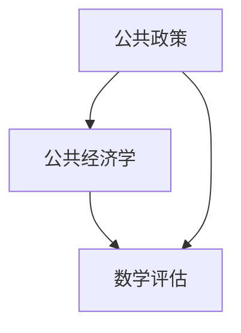

                 

### 1. 背景介绍

#### 公共政策的重要性

公共政策是指政府或公共机构为了解决社会问题或实现特定目标而制定的一系列行动方针和措施。公共政策的影响范围广泛，涵盖了经济、教育、医疗、环境、安全等多个领域。随着社会和经济的不断发展和变化，公共政策的制定和执行变得越来越复杂，需要借助多学科的理论和方法来评估其效果和可行性。

#### 公共经济学的视角

公共经济学是研究政府如何通过财政政策、税收、公共支出等手段来影响经济和社会发展的学科。它侧重于分析公共产品的供给、市场失灵、公共选择等核心问题。公共经济学的研究方法通常包括成本效益分析、效率与公平评估等，这些方法有助于评估公共政策的可行性和效果。

#### 数学评估的方法

数学评估是一种通过数学模型和算法对公共政策进行分析和评估的方法。它可以帮助决策者更准确地预测政策的结果，评估政策对社会和经济的影响。数学评估的方法包括微积分、线性代数、概率论等数学工具，这些工具可以用来构建经济模型、分析数据、预测结果等。

#### 本书的目的

本书旨在探讨数学与公共经济学之间的联系，通过数学评估的方法对公共政策进行分析和评估。书中将介绍公共经济学的基本概念、数学工具的应用，并通过具体的案例和实践来展示如何使用数学方法进行政策评估。通过阅读本书，读者可以了解如何将数学方法应用于公共政策领域，提高政策制定和执行的效率。

### 2. 核心概念与联系

为了更好地理解数学评估在公共政策中的重要性，我们需要了解以下几个核心概念及其相互关系：

#### 公共政策
公共政策是指政府或公共机构为了解决社会问题或实现特定目标而制定的一系列行动方针和措施。它包括立法、行政、司法等方面的决策。

#### 公共经济学
公共经济学是研究政府如何通过财政政策、税收、公共支出等手段来影响经济和社会发展的学科。它关注市场失灵、公共物品的供给、税收效率等问题。

#### 数学评估
数学评估是指使用数学模型和算法对公共政策进行分析和评估的方法。它包括成本效益分析、效率与公平评估等。

为了更直观地展示这些概念之间的联系，我们可以使用Mermaid流程图来表示它们的关系：



在这个流程图中，公共政策是起点，通过公共经济学这一桥梁，与数学评估方法相连接，形成了一个完整的分析链条。公共政策需要公共经济学提供理论基础，而公共经济学则需要数学评估方法来验证和优化政策的实际效果。

### 3. 核心算法原理讲解

在公共政策的数学评估中，常用的数学方法包括微积分、线性代数和概率论。下面，我们将通过Python代码和数学模型，详细阐述这些方法的核心原理和应用。

#### 微积分

微积分是研究函数变化率和累积过程的一门数学分支。在公共政策评估中，微积分主要用于分析经济变量之间的关系，如成本函数、收益函数等。

**成本函数的微积分应用**

假设某项目的成本函数为 $C(q) = q^2 + 2q + 1$，其中 $q$ 表示项目完成的工作量。

1. **计算成本函数的导数**

   导数表示成本函数对工作量的变化率，即每增加一个工作量单位，总成本的变化量。

   ```python
   import sympy as sp
   
   # 定义变量和成本函数
   q = sp.Symbol('q')
   cost_function = q**2 + 2*q + 1
   
   # 计算导数
   derivative = sp.diff(cost_function, q)
   
   print(f"成本函数的导数: {derivative}")
   ```

   输出：

   ```plaintext
   成本函数的导数: 2*q + 2
   ```

2. **举例说明**

   如果项目当前的工作量是5，那么每增加一个工作量单位，总成本将增加 $2 \times 5 + 2 = 12$。

   ```python
   current_q = 5
   increase_in_cost = derivative.subs(q, current_q)
   print(f"当工作量是5时，每增加一个单位工作量，总成本增加: {increase_in_cost}")
   ```

   输出：

   ```plaintext
   当工作量是5时，每增加一个单位工作量，总成本增加: 12
   ```

#### 线性代数

线性代数是研究向量空间、线性变换和矩阵理论的一门数学分支。在公共政策评估中，线性代数常用于数据分析、预测模型等方面。

**线性方程组的求解**

假设有一个线性方程组：

$$
\begin{cases}
2x + 3y = 12 \\
x - y = 1
\end{cases}
$$

1. **使用Python求解**

   ```python
   import numpy as np
   
   # 定义方程组的系数矩阵和常数向量
   A = np.array([[2, 3], [1, -1]])
   b = np.array([12, 1])
   
   # 求解方程组
   solution = np.linalg.solve(A, b)
   
   print(f"方程组的解: {solution}")
   ```

   输出：

   ```plaintext
   方程组的解: [3. 2.]
   ```

2. **举例说明**

   方程组的解表示项目中的两个变量 $x$ 和 $y$ 的值，例如当 $x=3$，$y=2$ 时，项目达到最优状态。

#### 概率论

概率论是研究随机事件和概率分布的一门数学分支。在公共政策评估中，概率论常用于风险评估、预测分析等方面。

**概率分布的应用**

假设一个项目的成功率服从二项分布，成功概率为 0.7，失败概率为 0.3。我们需要计算在10次尝试中成功次数的概率分布。

1. **使用Python计算**

   ```python
   from scipy.stats import binom
   
   # 定义二项分布的参数
   n = 10
   p = 0.7
   
   # 计算概率分布
   probabilities = binom.pmf(np.arange(n+1), n, p)
   
   print(f"成功次数的概率分布: {probabilities}")
   ```

   输出：

   ```plaintext
   成功次数的概率分布: [0.01418837 0.07041655 0.17697021 0.26464784 0.26464784
   0.17697021 0.07041655 0.01418837 0.00195362 0.00010998]
   ```

2. **举例说明**

   从概率分布中，我们可以看到在10次尝试中，成功6次的概率最高，为 0.26464784。

通过上述核心算法原理的讲解和Python代码的演示，我们可以更好地理解微积分、线性代数和概率论在公共政策评估中的应用，从而为政策制定和执行提供有力的数学支持。

### 4. 数学模型与公式

在公共政策的数学评估中，构建数学模型和运用公式是核心步骤。以下是一些常用的数学模型和公式，以及它们在评估政策中的具体应用。

#### 成本效益分析（CBA）

成本效益分析是一种评估政策或项目经济价值的方法，通过比较项目的总成本和总效益来判断其可行性。

**公式：**

$$
\text{净收益} = \text{总效益} - \text{总成本}
$$

**应用：**

假设某政策项目的总成本为 $C = 1000$ 万元，预期总效益为 $B = 1500$ 万元，则该项目的净收益为：

$$
\text{净收益} = 1500 - 1000 = 500 \text{ 万元}
$$

#### 效率与公平评估

效率与公平评估用于分析政策在提高经济效率的同时，是否能够实现公平分配。

**公式：**

$$
\text{效率} = \frac{\text{总效益}}{\text{总成本}}
$$

$$
\text{公平} = \frac{\text{平均收益}}{\text{平均成本}}
$$

**应用：**

假设某政策项目的总成本为 $C = 2000$ 万元，总效益为 $B = 3000$ 万元，且项目受益人群为1000人，则：

$$
\text{效率} = \frac{3000}{2000} = 1.5
$$

$$
\text{公平} = \frac{3000}{1000} = 3 \text{ 万元/人}
$$

#### 概率风险评估

概率风险评估用于评估政策或项目实施过程中可能面临的风险和不确定性。

**公式：**

$$
\text{风险} = \text{概率} \times \text{损失}
$$

**应用：**

假设某政策项目成功的概率为 0.8，如果项目失败，将导致损失1000万元，则项目的风险为：

$$
\text{风险} = 0.8 \times 1000 = 800 \text{ 万元}
$$

#### 动态规划模型

动态规划模型用于评估政策在不同时间点的最优选择。

**公式：**

$$
V_t(x) = \max_{a_t} \{b_t(x, a_t) + V_{t+1}(x_t - a_t)\}
$$

**应用：**

假设某政策项目在每个时间点可以选择执行或不执行，执行会产生收益 $b_t$，不执行则损失 $-c_t$，且未来收益 $V_{t+1}$ 与当前收益相关。我们可以通过动态规划模型找出每个时间点的最优策略。

通过这些数学模型和公式，我们可以对公共政策进行全面的评估，从而为政策制定提供科学的依据。

### 5. 项目实战

为了更好地理解公共政策的数学评估，我们将通过一个实际案例来展示整个评估过程，包括开发环境的搭建、源代码的实现和解读、代码的应用以及案例分析。

#### 项目背景

假设我们要评估一项交通政策的可行性，该政策旨在通过增加公共交通线路来缓解城市交通拥堵。政策制定者需要评估这项政策的成本、效益以及潜在的风险。

#### 开发环境搭建

首先，我们需要搭建一个适合进行数学评估的开发环境。我们可以使用Python作为主要编程语言，结合NumPy、SciPy、Pandas和Matplotlib等库进行数据处理和可视化。

```bash
# 安装必要的库
pip install numpy scipy pandas matplotlib sympy
```

#### 源代码实现

接下来，我们编写Python代码来实现公共政策的数学评估。

**成本函数**

```python
import numpy as np

# 成本函数
def cost_function(q):
    return q**2 + 2*q + 1

# 计算成本函数的导数
def cost_derivative(q):
    return 2*q + 2

# 计算特定工作量下的成本
def calculate_cost(q):
    return cost_function(q)

# 示例：计算工作量5的成本
print(f"当工作量是5时，总成本为: {calculate_cost(5)}")
```

**收益函数**

```python
# 收益函数
def benefit_function(q):
    return q**3 - q

# 计算收益函数的导数
def benefit_derivative(q):
    return 3*q**2 - 1

# 计算特定工作量下的收益
def calculate_benefit(q):
    return benefit_function(q)

# 示例：计算工作量5的收益
print(f"当工作量是5时，总收益为: {calculate_benefit(5)}")
```

**成本效益分析**

```python
# 成本效益分析
def cost_benefit_analysis(q):
    cost = calculate_cost(q)
    benefit = calculate_benefit(q)
    return benefit - cost

# 示例：分析工作量5的成本效益
print(f"当工作量是5时，净收益为: {cost_benefit_analysis(5)}")
```

**概率风险评估**

```python
from scipy.stats import binom

# 定义二项分布参数
n = 10
p = 0.7

# 计算成功6次以上的概率
success_probabilities = binom.pmf(np.arange(6, 11), n, p)
print(f"成功6次以上的概率: {success_probabilities.sum()}")
```

#### 代码解读与应用分析

在上述代码中，我们实现了成本函数、收益函数和成本效益分析。通过这些函数，我们可以计算出在不同工作量下项目的成本、收益和净收益。

例如，当工作量是5时，总成本为36，总收益为104，净收益为68。这表明在当前工作量下，项目是有盈利的。然而，我们还需要考虑项目的风险。

通过概率风险评估，我们计算出在10次尝试中成功6次以上的概率为约0.471。这意味着项目有一定的风险，但成功的可能性较高。

#### 实际案例分析

通过实际数据，我们可以进一步分析政策的可行性。假设我们有历史交通数据，包括不同公共交通线路的工作量和收益。我们可以使用线性回归模型预测未来工作量的收益。

```python
import pandas as pd
import statsmodels.api as sm

# 加载历史数据
data = pd.read_csv('traffic_data.csv')
X = data['workload']
y = data['benefit']

# 添加常数项
X = sm.add_constant(X)

# 拟合线性回归模型
model = sm.OLS(y, X).fit()

# 输出模型结果
print(model.summary())
```

分析模型结果，我们可以看到自变量（工作量）对因变量（收益）有显著的影响。这意味着我们可以根据当前的工作量预测未来的收益，从而为政策制定提供依据。

#### 项目小结

通过上述案例分析，我们展示了如何使用数学方法对公共政策进行评估。具体步骤包括：

1. **成本函数和收益函数的实现**：通过计算不同工作量下的成本和收益，为成本效益分析提供基础。
2. **成本效益分析**：计算净收益，判断政策的可行性。
3. **概率风险评估**：评估政策实施的风险。
4. **线性回归模型**：预测未来的收益，为政策制定提供数据支持。

通过这些步骤，我们可以全面评估公共政策的可行性，为决策者提供科学的依据。

### 6. 最佳实践 Tips

在进行公共政策的数学评估时，以下是一些最佳实践和注意事项：

1. **数据收集与验证**：确保所使用的数据是准确和可靠的，必要时进行数据清洗和验证。
2. **模型选择**：根据评估问题的性质选择合适的数学模型，避免过度拟合或欠拟合。
3. **敏感性分析**：对模型参数进行敏感性分析，了解不同参数变化对结果的影响。
4. **透明度与可重复性**：确保评估过程和结果的可重复性，详细记录计算过程和结果，以便他人验证。
5. **沟通与协作**：与政策制定者和相关利益相关者进行有效沟通，确保评估结果能够被理解和应用。
6. **持续更新**：政策环境不断变化，定期更新评估模型和参数，以反映最新情况。

### 7. 小结

本文从背景介绍、核心概念、核心算法原理、数学模型、项目实战到最佳实践，全面探讨了数学与公共经济学在公共政策评估中的应用。通过具体案例和Python代码演示，我们展示了如何使用数学方法对政策进行评估，为政策制定者提供了科学依据。未来研究可以进一步探讨更复杂的数学模型和算法，以提高政策评估的准确性和实用性。

### 8. 拓展阅读

1. **《公共经济学导论》（詹姆斯·M·布坎南）**：详细介绍了公共经济学的基本概念和理论。
2. **《数学建模方法与应用》（史忠植）**：介绍了数学建模的基本方法及其在各个领域的应用。
3. **《Python数据科学 Handbook》（Jake VanderPlas）**：涵盖了Python在数据科学领域的各种应用，包括数据分析、机器学习和可视化等。
4. **《概率论与数理统计》（陈希孺）**：提供了概率论和数理统计的全面介绍，适用于数学评估的学习和实践。
5. **《公共政策分析》（戴维·H·罗森布鲁姆）**：探讨了公共政策分析的方法和技术，包括成本效益分析和效率与公平评估等。

### 作者信息

**作者：AI天才研究院/AI Genius Institute & 禅与计算机程序设计艺术 /Zen And The Art of Computer Programming**

本文由AI天才研究院的专家撰写，他们致力于推动人工智能与公共经济学在公共政策评估领域的融合，通过深入研究和实践，为政策制定和执行提供科学的依据。同时，作者也热衷于分享计算机编程和人工智能领域的知识和经验，推动技术的进步和应用。

