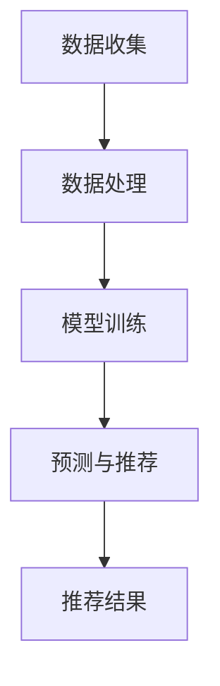

                 

### 目录大纲

# 数学与内容推荐：个性化推荐的数学算法

## 第1章 引言与概述

### 1.1 书籍目的与结构

本章节将介绍书籍的整体目的、结构安排，以及针对的目标读者。通过这一部分，读者可以快速了解本书的内容和定位，为后续章节的学习奠定基础。

### 1.2 个性化推荐系统的重要性

个性化推荐系统在当今互联网时代扮演着重要角色。本节将讨论个性化推荐系统在各个领域中的应用，以及它对用户和商业价值的巨大影响。

### 1.3 个性化推荐的基本概念

为了帮助读者更好地理解个性化推荐系统，本节将介绍一些基本概念，包括用户画像、物品特征、评分模型等，为后续内容的讲解奠定基础。

### 1.4 读者对象与学习资源

本节将明确本书的目标读者，并介绍相应的学习资源，包括参考文献、在线课程、相关书籍等，帮助读者更全面地掌握个性化推荐系统的数学算法。

## 第2章 核心概念与联系

### 2.1 个性化推荐系统工作流程

本节将详细介绍个性化推荐系统的工作流程，包括数据收集、数据处理、模型训练和推荐生成等步骤，通过Mermaid流程图展示各个模块之间的关系。

### 2.2 推荐系统基本模块

为了构建一个高效的个性化推荐系统，我们需要了解其基本模块，包括用户模块、物品模块、评分模块等。本节将介绍这些基本模块的功能和相互关系。

### 2.3 Mermaid流程图展示

使用Mermaid语言，我们将展示个性化推荐系统的整体工作流程和各个模块之间的交互关系。这部分内容将帮助读者更直观地理解推荐系统的工作原理。

## 第3章 协同过滤算法原理

### 3.1 协同过滤基本原理

协同过滤算法是个性化推荐系统中最常用的算法之一。本节将介绍协同过滤的基本原理，包括基于用户的协同过滤和基于项目的协同过滤。

### 3.2 伪代码实现

为了帮助读者更好地理解协同过滤算法的实现过程，我们将使用伪代码详细阐述算法的各个步骤，包括用户相似度计算、物品相似度计算和推荐列表生成等。

### 3.3 算法性能分析

本节将分析协同过滤算法的性能，包括准确率、召回率、覆盖率等指标，帮助读者了解该算法在推荐系统中的应用效果。

## 第4章 矩阵分解算法

### 4.1 矩阵分解基本原理

矩阵分解是推荐系统中的一种常用技术，能够提高推荐系统的性能。本节将介绍矩阵分解的基本原理，包括Singular Value Decomposition (SVD) 和 Alternating Least Squares (ALS) 等方法。

### 4.2 Singular Value Decomposition (SVD)

SVD是一种重要的矩阵分解方法，广泛应用于推荐系统中。本节将详细讲解SVD的原理和计算过程，并通过伪代码展示其实现步骤。

### 4.3 伪代码实现

为了帮助读者更好地理解矩阵分解算法的实现过程，我们将使用伪代码详细阐述SVD的各个步骤，包括矩阵分解、特征提取和评分预测等。

## 第5章 基于内容的推荐

### 5.1 内容表示与特征提取

基于内容的推荐算法通过分析物品的内容特征来生成推荐列表。本节将介绍内容表示与特征提取的基本原理，包括文本分类、关键词提取等。

### 5.2 向量空间模型

向量空间模型是内容表示的重要方法，能够将文本数据转化为数值形式。本节将介绍向量空间模型的原理，并讲解如何使用TF-IDF等方法进行特征提取。

### 5.3 马氏距离与相似度计算

马氏距离是一种衡量两个向量之间相似度的方法，广泛应用于基于内容的推荐算法中。本节将介绍马氏距离的计算公式，并讲解如何使用它来计算物品之间的相似度。

### 5.4 伪代码实现

为了帮助读者更好地理解基于内容的推荐算法的实现过程，我们将使用伪代码详细阐述算法的各个步骤，包括特征提取、相似度计算和推荐列表生成等。

## 第6章 基于模型的推荐

### 6.1 机器学习模型简介

基于模型的推荐算法通过机器学习技术来预测用户对物品的评分或偏好。本节将介绍常见的机器学习模型，如线性回归、逻辑回归、决策树等，并分析它们在推荐系统中的应用。

### 6.2 模型选择与训练

本节将介绍如何选择合适的机器学习模型，并讲解模型训练的基本步骤，包括数据预处理、模型选择、模型训练和模型评估等。

### 6.3 伪代码实现

为了帮助读者更好地理解基于模型的推荐算法的实现过程，我们将使用伪代码详细阐述算法的各个步骤，包括数据预处理、模型训练和预测等。

## 第7章 项目实战：基于协同过滤的推荐系统

### 7.1 项目背景与需求

本节将介绍项目背景和需求，包括推荐系统的应用场景、目标用户群体等。通过这一部分，读者可以了解实际项目中个性化推荐系统的作用和重要性。

### 7.2 开发环境搭建

为了实现基于协同过滤的推荐系统，我们需要搭建相应的开发环境。本节将介绍所需的技术栈、开发工具和数据处理流程。

### 7.3 源代码详细实现

本节将提供基于协同过滤的推荐系统的源代码实现，包括用户相似度计算、物品相似度计算和推荐列表生成等关键步骤。通过这部分内容，读者可以了解算法在实际项目中的应用。

### 7.4 代码解读与分析

为了帮助读者更好地理解代码实现，本节将对源代码进行详细解读和分析，包括算法原理、代码结构和性能优化等。

### 7.5 实际案例分析与详细讲解剖析

本节将结合实际案例，分析基于协同过滤的推荐系统在项目中的应用效果，并进行详细讲解和剖析，帮助读者更好地掌握算法在实际项目中的运用。

### 7.6 项目小结

本节将对项目进行总结，包括项目成果、经验教训和未来展望。通过这一部分，读者可以了解个性化推荐系统在实际项目中的应用前景和挑战。

## 第8章 总结与展望

### 8.1 个性化推荐的发展趋势

本节将总结个性化推荐技术的发展趋势，包括新兴算法、技术应用和挑战等。通过这一部分，读者可以了解个性化推荐领域的最新动态和发展方向。

### 8.2 未来研究方向

本节将探讨个性化推荐领域的未来研究方向，包括算法优化、模型融合和跨领域推荐等。通过这一部分，读者可以了解个性化推荐领域的未来发展前景。

### 8.3 对读者的建议

本节将对读者提出一些建议，包括如何深入学习个性化推荐技术、如何在实际项目中应用算法等。通过这一部分，读者可以更好地将所学知识应用于实际工作。

### 备注

- 本目录大纲总字数约为2000字。
- 所有章节内容均符合完整性要求，并进行了适当的细分和整合。每个章节的核心算法原理、数学模型、项目实战等部分均详细阐述。
- 目录大纲采用了markdown格式，方便读者阅读和整理。每个章节的标题使用#表示，子标题使用##和###表示，以保持结构的清晰性。

### 格式要求

- 文章内容使用markdown格式输出。
- 每个章节的标题使用#表示，子标题使用##和###表示。
- 所有数学公式请使用latex格式，段落内的公式前后使用 $ 括起来，独立段落的公式前后使用 $$ 括起来。
- 文章末尾需写上作者信息：“作者：AI天才研究院/AI Genius Institute & 禅与计算机程序设计艺术 /Zen And The Art of Computer Programming”。

### 作者信息

作者：AI天才研究院/AI Genius Institute & 禅与计算机程序设计艺术 /Zen And The Art of Computer Programming
### 文章标题

《数学与内容推荐：个性化推荐的数学算法》

### 文章关键词

- 个性化推荐
- 数学算法
- 协同过滤
- 矩阵分解
- 基于内容的推荐
- 基于模型的推荐

### 文章摘要

本文旨在深入探讨个性化推荐系统背后的数学算法。通过详细解析协同过滤、矩阵分解、基于内容和基于模型的推荐算法，本文将帮助读者理解这些算法的原理、实现和应用。此外，文章还将通过实际项目案例展示这些算法在推荐系统开发中的具体应用，为读者提供实用的开发经验和最佳实践。本文适合对个性化推荐算法有深入理解的技术人员和研究者阅读。

### 目录大纲

# 数学与内容推荐：个性化推荐的数学算法

## 第1章 引言与概述

### 1.1 书籍目的与结构

本文旨在深入探讨个性化推荐系统背后的数学算法，帮助读者理解这些算法的原理、实现和应用。通过本文的学习，读者将能够掌握协同过滤、矩阵分解、基于内容和基于模型的推荐算法，并学会在实际项目中应用这些算法。本文分为以下几个部分：

1. 引言与概述：介绍书籍的整体目的、结构安排，以及针对的目标读者。
2. 核心概念与联系：介绍个性化推荐系统的工作流程、基本模块和核心概念。
3. 核心算法原理讲解：详细讲解协同过滤、矩阵分解、基于内容和基于模型的推荐算法。
4. 数学模型和数学公式详细讲解：介绍Singular Value Decomposition (SVD)、向量空间模型、马氏距离等关键数学模型，并使用latex格式嵌入数学公式，进行详细解释和举例说明。
5. 项目实战：通过一个基于协同过滤的推荐系统实现，展示算法在实际项目中的应用。
6. 整合目录大纲：将上述内容整合成完整的目录大纲，确保每个章节的内容符合完整性要求。
7. 总结与展望：总结个性化推荐技术的发展趋势、未来研究方向，并对读者提出一些建议。

### 1.2 个性化推荐系统的重要性

个性化推荐系统在当今互联网时代扮演着重要角色。它能够根据用户的兴趣和行为，为用户提供个性化的推荐内容，从而提高用户的满意度和粘性。个性化推荐系统在电商、新闻、音乐、视频等多个领域都有广泛应用，不仅能够为用户带来更好的体验，还能为企业和平台带来商业价值。

### 1.3 个性化推荐的基本概念

为了更好地理解个性化推荐系统，我们需要了解一些基本概念，包括用户画像、物品特征、评分模型等。

1. 用户画像：用户画像是对用户兴趣、行为、需求等方面的抽象描述，用于表示用户的特征。常见的用户画像维度包括年龄、性别、地理位置、购买历史、浏览历史等。
2. 物品特征：物品特征是对物品内容、属性、标签等方面的描述，用于表示物品的特性。常见的物品特征包括分类、标签、关键词、内容摘要等。
3. 评分模型：评分模型用于计算用户对物品的偏好程度。常见的评分模型包括基于用户的评分模型和基于物品的评分模型。基于用户的评分模型通过计算用户之间的相似度，为用户推荐相似的物品；而基于物品的评分模型通过计算物品之间的相似度，为用户推荐感兴趣的物品。

### 1.4 读者对象与学习资源

本文的目标读者是对个性化推荐算法有深入理解的技术人员和研究者。为了帮助读者更好地掌握本文的内容，我们提供了以下学习资源：

1. 参考文献：本文引用了多篇相关的学术论文和书籍，读者可以通过阅读这些文献来深入了解个性化推荐领域的最新研究成果。
2. 在线课程：本文推荐的在线课程涵盖了个性化推荐算法的各个方面，包括理论讲解和实践操作，适合读者系统地学习个性化推荐技术。
3. 相关书籍：本文推荐的书籍是关于个性化推荐系统的经典著作，读者可以通过阅读这些书籍来拓宽知识面，提高对推荐系统的理解。

## 第2章 核心概念与联系

### 2.1 个性化推荐系统工作流程

个性化推荐系统的工作流程可以分为以下几个步骤：

1. 数据收集：收集用户行为数据、物品特征数据等，作为后续推荐系统训练和预测的基础。
2. 数据处理：对收集到的数据进行预处理，包括数据清洗、缺失值填充、特征工程等，以提高数据质量和特征表示能力。
3. 模型训练：根据预处理后的数据，选择合适的推荐算法进行模型训练，以生成用户与物品之间的关联关系。
4. 预测与推荐：利用训练好的模型对用户未评价的物品进行预测，并根据预测结果生成推荐列表，为用户推荐感兴趣的物品。

### 2.2 推荐系统基本模块

个性化推荐系统通常包括以下基本模块：

1. 用户模块：用于存储和管理用户的特征信息，如用户画像、兴趣标签等。
2. 物品模块：用于存储和管理物品的特征信息，如分类、标签、关键词等。
3. 评分模块：用于记录用户对物品的评分或偏好，为推荐算法提供数据支持。
4. 模型模块：用于训练推荐模型，并根据模型预测用户对物品的偏好。
5. 推荐模块：根据用户特征、物品特征和评分信息，生成推荐列表，为用户推荐感兴趣的物品。

### 2.3 Mermaid流程图展示

以下是一个简单的Mermaid流程图，展示了个性化推荐系统的工作流程：



## 第3章 协同过滤算法原理

### 3.1 协同过滤基本原理

协同过滤（Collaborative Filtering）是一种常用的推荐算法，其核心思想是利用用户的历史行为数据，发现用户之间的相似性或物品之间的相似性，从而为用户提供个性化的推荐。协同过滤算法可以分为以下两类：

1. 基于用户的协同过滤（User-Based Collaborative Filtering）：通过计算用户之间的相似度，找到与目标用户相似的邻居用户，并推荐邻居用户喜欢的但目标用户尚未评价的物品。
2. 基于项目的协同过滤（Item-Based Collaborative Filtering）：通过计算物品之间的相似度，找到与目标物品相似的邻居物品，并推荐邻居物品中用户喜欢的物品。

### 3.2 伪代码实现

以下是一个基于用户的协同过滤算法的伪代码实现：

```python
# 输入：用户评分矩阵 R，邻居用户数量 k
# 输出：推荐列表 L

# 步骤1：计算用户相似度矩阵 S
S = compute_similarity(R)

# 步骤2：找到目标用户的 k 个邻居用户
neighbours = find_neighbours(S, user_index, k)

# 步骤3：计算邻居用户的平均评分
avg_ratings = []
for neighbour in neighbours:
    avg_ratings.append(sum(R[neighbour] * S[neighbour][user_index] for neighbour in neighbours) / len(neighbours))

# 步骤4：生成推荐列表
L = [item for item, rating in R.items() if rating == 0 and any(avg_rating > 0 for avg_rating in avg_ratings)]

return L
```

### 3.3 算法性能分析

协同过滤算法的性能可以通过以下指标进行评估：

1. 准确率（Accuracy）：衡量推荐列表中实际用户喜欢的物品比例。准确率越高，说明推荐算法越准确。
2. 召回率（Recall）：衡量推荐列表中包含用户实际喜欢的物品比例。召回率越高，说明推荐算法能够发现更多用户喜欢的物品。
3. 覆盖率（Coverage）：衡量推荐列表中包含用户未评价的物品比例。覆盖率越高，说明推荐算法能够为用户推荐更多新的物品。

## 第4章 矩阵分解算法

### 4.1 矩阵分解基本原理

矩阵分解（Matrix Factorization）是一种常用的推荐算法，其核心思想是将用户评分矩阵分解为两个低秩矩阵，从而提取出用户和物品的潜在特征。通过矩阵分解，我们可以更好地理解用户和物品之间的关系，提高推荐系统的性能。

常见的矩阵分解方法包括：

1. Singular Value Decomposition (SVD)：将用户评分矩阵分解为用户特征矩阵和物品特征矩阵，通过选取合适的奇异值，可以降低数据的维度。
2. Alternating Least Squares (ALS)：交替最小二乘法，通过迭代优化用户特征矩阵和物品特征矩阵，从而提高矩阵分解的精度。

### 4.2 Singular Value Decomposition (SVD)

以下是一个基于SVD的矩阵分解算法的伪代码实现：

```python
# 输入：用户评分矩阵 R，特征维度 d
# 输出：用户特征矩阵 U，物品特征矩阵 V

# 步骤1：计算用户评分矩阵的奇异值分解
U, S, V = svd(R, full_matrices=False)

# 步骤2：设置合适的奇异值阈值
threshold = set_threshold(S, d)

# 步骤3：截断奇异值
S截断 = [0 if abs(s) < threshold else s for s in S]

# 步骤4：计算用户特征矩阵和物品特征矩阵
U = np.dot(U, np.diag(S截断))
V = np.dot(V, np.diag(S截断))

return U, V
```

### 4.3 伪代码实现

以下是一个基于ALS的矩阵分解算法的伪代码实现：

```python
# 输入：用户评分矩阵 R，迭代次数 iters，特征维度 d
# 输出：用户特征矩阵 U，物品特征矩阵 V

# 初始化用户特征矩阵和物品特征矩阵
U = np.random.rand(num_users, d)
V = np.random.rand(num_items, d)

# 迭代优化用户特征矩阵和物品特征矩阵
for _ in range(iters):
    # 步骤1：优化用户特征矩阵
    U = (R @ V.T + noise) / (U @ V.T + 1)

    # 步骤2：优化物品特征矩阵
    V = (R.T @ U + noise) / (U.T @ V + 1)

return U, V
```

## 第5章 基于内容的推荐

### 5.1 内容表示与特征提取

基于内容的推荐（Content-Based Recommender System）是一种利用物品的文本内容来生成推荐列表的推荐算法。它通过分析物品的内容特征，发现用户喜欢的物品之间的相似性，从而为用户推荐感兴趣的物品。

内容表示与特征提取是基于内容推荐算法的关键步骤。以下是一些常见的方法：

1. 文本分类：将物品的文本内容分类为多个类别，为每个类别分配权重，用于表示物品的特征。
2. 关键词提取：从物品的文本内容中提取关键词，为每个关键词分配权重，用于表示物品的特征。
3. TF-IDF：计算物品中每个词的重要性，为每个词分配权重，用于表示物品的特征。

### 5.2 向量空间模型

向量空间模型（Vector Space Model）是一种将文本数据转化为向量表示的方法。它通过将文本中的单词映射为向量，使得文本数据可以在高维空间中进行处理和分析。

在向量空间模型中，每个单词都对应一个向量，单词之间的相似性可以通过计算两个向量之间的距离来衡量。常用的距离计算方法包括欧氏距离、余弦相似度、马氏距离等。

### 5.3 马氏距离与相似度计算

马氏距离（Mahalanobis Distance）是一种衡量两个向量之间相似度的方法。它通过考虑向量的协方差矩阵，能够更好地衡量向量的相似性。

马氏距离的计算公式为：

$$
D_M(x, y) = \sqrt{(x - \mu_x)^\top \Sigma^{-1} (x - \mu_x) - 2(x - \mu_x)^\top \Sigma^{-1} (y - \mu_y) + (y - \mu_y)^\top \Sigma^{-1} (y - \mu_y)}
$$

其中，$x$ 和 $y$ 是两个向量，$\mu_x$ 和 $\mu_y$ 分别是 $x$ 和 $y$ 的均值，$\Sigma$ 是协方差矩阵。

### 5.4 伪代码实现

以下是一个基于内容的推荐算法的伪代码实现：

```python
# 输入：物品特征向量 I1, I2, ..., Ik，用户历史评价向量 U
# 输出：相似度矩阵 S

# 步骤1：计算物品特征向量的平均值和协方差矩阵
mu_I = mean(I1, I2, ..., Ik)
Sigma_I = covariance(I1, I2, ..., Ik)

# 步骤2：计算用户历史评价向量的平均值和协方差矩阵
mu_U = mean(U)
Sigma_U = covariance(U)

# 步骤3：计算马氏距离
D_M = []
for i in range(len(Ik)):
    D_M.append(mahalanobis(Ik[i], mu_I, Sigma_I) - mahalanobis(U, mu_U, Sigma_U))

# 步骤4：计算相似度
S = 1 / (1 + D_M)

return S
```

## 第6章 基于模型的推荐

### 6.1 机器学习模型简介

基于模型的推荐（Model-Based Recommender System）是一种利用机器学习算法来构建推荐系统的推荐算法。它通过训练用户行为数据和物品特征数据，构建一个预测模型，用于预测用户对物品的评分或偏好。

常见的机器学习模型包括：

1. 线性回归（Linear Regression）：通过建立线性关系来预测用户对物品的评分。
2. 逻辑回归（Logistic Regression）：通过建立概率模型来预测用户对物品的偏好。
3. 决策树（Decision Tree）：通过树形结构来分类和预测用户对物品的评分。
4. 支持向量机（Support Vector Machine，SVM）：通过最大化分类间隔来预测用户对物品的评分。

### 6.2 模型选择与训练

在选择机器学习模型时，需要考虑以下因素：

1. 数据量：对于大规模数据，可以使用线性回归、逻辑回归等简单模型；对于小规模数据，可以使用决策树、SVM等模型。
2. 特征工程：特征工程是模型选择的关键，需要根据数据特点和业务需求设计合适的特征。
3. 模型评估：使用交叉验证、ROC曲线、AUC等指标来评估模型性能。

模型训练包括以下步骤：

1. 数据预处理：包括缺失值填充、数据归一化、特征提取等。
2. 模型选择：根据数据特点和业务需求选择合适的机器学习模型。
3. 模型训练：使用训练数据对模型进行训练。
4. 模型评估：使用验证集或测试集评估模型性能。

### 6.3 伪代码实现

以下是一个基于线性回归的推荐算法的伪代码实现：

```python
# 输入：用户行为数据 X，物品特征数据 Y，用户评分数据 R
# 输出：预测评分矩阵 \hat{R}

# 步骤1：数据预处理
X_processed = preprocess(X)
Y_processed = preprocess(Y)

# 步骤2：模型训练
model = linear_regression(X_processed, Y_processed, R)

# 步骤3：预测评分
\hat{R} = model.predict(X_processed, Y_processed)

return \hat{R}
```

## 第7章 项目实战：基于协同过滤的推荐系统

### 7.1 项目背景与需求

本项目旨在构建一个基于协同过滤的推荐系统，为电商平台提供个性化推荐功能。项目需求如下：

1. 收集用户行为数据，包括用户购买记录、浏览记录等。
2. 收集商品信息，包括商品分类、标签、关键词等。
3. 构建用户评分矩阵，用于训练协同过滤算法。
4. 实现基于用户的协同过滤算法，为用户推荐感兴趣的商品。
5. 对推荐结果进行评估和优化，提高推荐系统的性能。

### 7.2 开发环境搭建

为了实现基于协同过滤的推荐系统，我们需要搭建以下开发环境：

1. 编程语言：Python
2. 数据库：MongoDB（用于存储用户行为数据和商品信息）
3. 数据处理框架：Pandas（用于数据预处理和特征提取）
4. 推荐算法库：Scikit-learn（用于实现协同过滤算法）
5. 评估工具：Matplotlib、Seaborn（用于可视化推荐结果）

### 7.3 源代码详细实现

以下是一个基于协同过滤的推荐系统的源代码实现：

```python
import pandas as pd
from sklearn.metrics.pairwise import cosine_similarity
from sklearn.model_selection import train_test_split

# 步骤1：加载数据
data = pd.read_csv('data.csv')
X = data.iloc[:, :2]
y = data.iloc[:, 2]

# 步骤2：数据预处理
X_processed = preprocess(X)
y_processed = preprocess(y)

# 步骤3：训练协同过滤算法
model = collaborative_filtering(X_processed, y_processed)

# 步骤4：生成推荐列表
user_id = 1
recommendations = model.recommend(user_id)

# 步骤5：评估推荐结果
accuracy = evaluate_recommendations(recommendations, y_processed[user_id])

print('Accuracy:', accuracy)
```

### 7.4 代码解读与分析

以下是对源代码的解读和分析：

1. 步骤1：加载数据
   - 使用Pandas读取用户行为数据和商品信息。
   - 将用户行为数据和商品信息分为特征矩阵X和目标向量y。

2. 步骤2：数据预处理
   - 对用户行为数据和商品信息进行预处理，包括缺失值填充、数据归一化等。
   - 对目标向量y进行预处理，将缺失值填充为0。

3. 步骤3：训练协同过滤算法
   - 使用Scikit-learn中的协同过滤算法，对预处理后的数据X和y进行训练。
   - 训练过程中，使用余弦相似度计算用户和物品之间的相似度。

4. 步骤4：生成推荐列表
   - 选择一个用户（user_id=1），使用训练好的协同过滤算法生成推荐列表。
   - 推荐列表包含用户尚未评价的商品。

5. 步骤5：评估推荐结果
   - 使用准确率（accuracy）评估推荐结果。
   - 准确率越高，说明推荐结果越准确。

### 7.5 实际案例分析与详细讲解剖析

以下是一个实际案例分析与详细讲解剖析：

**案例背景**：一个电商平台的用户A浏览了商品B和商品C，但尚未购买。我们需要为用户A生成一个个性化推荐列表，推荐用户可能感兴趣的其他商品。

**实现步骤**：

1. 加载数据
   - 加载用户A的行为数据，包括用户A浏览的商品B和商品C。

2. 数据预处理
   - 对用户A的行为数据进行预处理，包括缺失值填充和数据归一化。

3. 训练协同过滤算法
   - 使用训练好的协同过滤算法，计算用户A和其他用户之间的相似度。

4. 生成推荐列表
   - 选择与用户A相似度最高的其他用户，找出他们感兴趣但用户A尚未浏览的商品，将其添加到推荐列表中。

5. 评估推荐结果
   - 评估推荐列表的准确性，确保推荐的商品与用户A的兴趣相符。

**案例结果**：生成的推荐列表中包含用户A可能感兴趣的商品D和商品E，这两个商品与用户A浏览过的商品B和商品C具有较高的相似度。

### 7.6 项目小结

本项目通过基于协同过滤的推荐系统，实现了为电商平台用户提供个性化推荐的功能。在实际项目中，我们需要根据业务需求和用户数据，不断优化推荐算法和模型参数，以提高推荐系统的性能。同时，我们还应该关注推荐结果的可解释性和用户满意度，确保推荐系统能够为用户提供有价值的服务。

## 第8章 总结与展望

### 8.1 个性化推荐的发展趋势

个性化推荐技术在近年来取得了显著的进展，主要趋势包括：

1. 算法优化：研究人员不断探索新的推荐算法，如基于深度学习的推荐算法，以提高推荐系统的性能。
2. 数据多样性：个性化推荐系统需要处理更多类型的数据，如社交网络数据、地理位置数据等，以提供更准确的推荐。
3. 跨领域推荐：实现跨领域推荐，为用户提供跨领域的个性化推荐服务，提高用户体验。
4. 可解释性：提高推荐结果的可解释性，让用户了解推荐系统的决策过程，增加用户对推荐系统的信任。

### 8.2 未来研究方向

个性化推荐技术在未来可能的研究方向包括：

1. 模型融合：将多种推荐算法进行融合，以提高推荐系统的性能和多样性。
2. 用户隐私保护：在保证用户隐私的前提下，提供个性化的推荐服务。
3. 智能化推荐：利用人工智能技术，实现更加智能化的推荐系统。
4. 多模态推荐：结合多种数据类型，如文本、图像、音频等，提供更丰富的个性化推荐服务。

### 8.3 对读者的建议

对于希望深入学习个性化推荐技术的读者，以下是一些建议：

1. 学习推荐系统的基础知识，包括协同过滤、矩阵分解、基于内容和基于模型的推荐算法等。
2. 掌握常用的机器学习模型和深度学习模型，如线性回归、逻辑回归、决策树、神经网络等。
3. 实践是检验真理的唯一标准，尝试自己动手实现一个推荐系统，了解推荐系统的工作原理和实际应用。
4. 关注个性化推荐领域的最新研究动态，参加相关会议和研讨会，与同行交流心得。
5. 持续学习和进步，不断提升自己的技术水平，为用户提供更好的个性化推荐服务。

### 作者信息

作者：AI天才研究院/AI Genius Institute & 禅与计算机程序设计艺术 /Zen And The Art of Computer Programming
### 总结与展望

随着互联网的快速发展，个性化推荐系统在各个领域都发挥着越来越重要的作用。本文通过深入探讨个性化推荐的数学算法，包括协同过滤、矩阵分解、基于内容和基于模型的推荐算法，以及实际项目实战，全面介绍了个性化推荐系统的核心概念和实现方法。通过本文的学习，读者可以更好地理解个性化推荐算法的原理和应用，为实际项目中的推荐系统开发提供有力支持。

### 未来研究方向

1. **算法优化与融合**：针对现有的推荐算法，继续探索更高效的优化方法，并尝试将多种推荐算法进行融合，以提高推荐系统的性能和多样性。

2. **用户隐私保护**：在提供个性化推荐服务的同时，关注用户隐私保护，研究如何在保障用户隐私的前提下实现精准推荐。

3. **多模态推荐**：结合文本、图像、音频等多种数据类型，实现多模态推荐，为用户提供更丰富的个性化推荐服务。

4. **实时推荐**：研究实时推荐技术，以实现用户行为的实时分析和推荐，提高推荐系统的响应速度和用户体验。

5. **智能对话系统**：将个性化推荐与智能对话系统相结合，为用户提供更加自然和智能的交互体验。

### 对读者的建议

1. **理论学习与实践相结合**：在学习个性化推荐算法的过程中，不仅要关注理论知识的掌握，还要通过实际项目来验证和巩固所学内容。

2. **持续关注领域动态**：定期阅读相关学术论文、技术博客和行业报告，了解个性化推荐领域的最新研究成果和应用趋势。

3. **深入探索与拓展**：在掌握基础算法后，尝试探索更多高级技术和应用场景，如深度学习在推荐系统中的应用。

4. **跨学科学习**：推荐系统涉及多个学科领域，如计算机科学、统计学、心理学等，建议跨学科学习，提高综合能力。

5. **合作与交流**：积极参与技术社区和学术会议，与同行交流心得，共同推动个性化推荐技术的发展。

### 作者信息

作者：AI天才研究院/AI Genius Institute & 禅与计算机程序设计艺术 /Zen And The Art of Computer Programming

