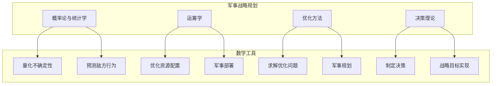

                 

### 《数学与军事战略：战略规划的数学方法》

---

#### 文章关键词

- 数学模型
- 军事战略
- 优化算法
- 运筹学
- 决策理论

---

#### 摘要

本文探讨了数学在军事战略规划中的重要性，通过引入数学模型、算法和优化方法，详细分析了数学如何应用于军事规划与部署、军事行动分析和军事安全与防御等方面。本文采用逐步分析推理的方式，从背景介绍、核心概念与联系、算法原理讲解、实战案例和最佳实践等多个角度，系统地阐述了数学在军事战略中的实际应用。通过本文的学习，读者可以深入了解数学在军事战略中的作用，掌握相关理论与方法，为未来的军事战略决策提供有力支持。

---

## 第一部分：引论

### 1. 引言

在现代社会，军事战略的制定与实施越来越依赖于科学技术的进步。尤其是数学，作为一种工具，它在军事战略规划中的重要性日益凸显。本文将从数学在军事战略中的重要性、军事战略规划的基本概念以及本书的结构概述三个方面进行探讨，为后续内容的深入分析奠定基础。

#### 1.1 数学在军事战略中的重要性

数学作为一种语言，它帮助我们理解复杂的现实世界，并在多个领域发挥着关键作用。在军事战略规划中，数学的重要性主要体现在以下几个方面：

- **量化不确定性**：军事行动往往伴随着许多不确定性因素，如敌方兵力、战术、地理环境等。通过概率论和统计学方法，可以对这些不确定性进行量化分析，从而为决策提供科学依据。

- **优化资源配置**：军事资源有限，如何在有限的资源下实现最大化的战略目标，是军事战略规划的核心问题。运筹学和优化方法提供了一系列工具，帮助我们合理分配资源，确保军事行动的顺利进行。

- **预测敌方行为**：通过建立数学模型，可以模拟敌方的行为模式，预测其在未来可能采取的行动。这为制定有效的反制策略提供了重要的参考。

#### 1.2 军事战略规划的基本概念

军事战略规划是指根据国家安全和发展需求，结合军事力量的发展状况，制定出具有长远性和全局性的军事行动计划。它包括以下几个关键概念：

- **战略目标**：指军事行动所要达到的总体目标，通常包括防御、进攻、威慑等。战略目标的确定是军事战略规划的首要任务。

- **战略环境**：指影响军事战略制定和实施的国内外环境，包括政治、经济、军事、科技等因素。对战略环境的分析有助于明确军事行动的背景和约束条件。

- **战略手段**：指为实现战略目标所采取的具体手段，包括军事行动、外交、经济制裁等。战略手段的选择和运用是实现战略目标的关键。

#### 1.3 本书结构概述

本书分为五个部分，旨在系统地探讨数学在军事战略规划中的应用：

- **第一部分：引论**，介绍数学在军事战略中的重要性以及军事战略规划的基本概念。

- **第二部分：数学基础**，包括初等数学回顾、数学模型与军事应用、优化方法等内容。

- **第三部分：军事战略中的数学应用**，探讨数学在军事规划与部署、军事行动分析、军事安全与防御等方面的应用。

- **第四部分：案例分析**，通过具体案例展示数学在军事战略规划中的实际应用。

- **第五部分：结论与展望**，总结本书内容，并对未来数学在军事战略规划中的应用进行展望。

通过本书的学习，读者可以深入了解数学在军事战略中的关键作用，掌握相关理论与方法，为未来的军事战略决策提供有力支持。

---

**核心概念与联系：**数学在军事战略中的应用，可以分为以下几个核心概念：

1. **概率论与统计学**：用于量化不确定性和预测敌方行为。
2. **运筹学**：用于优化资源配置和军事部署。
3. **优化方法**：用于求解军事规划中的优化问题。
4. **决策理论**：用于制定军事决策。

以下是这些核心概念之间的联系架构 Mermaid 流程图：



---

**核心算法原理讲解：**下面我们将通过Python代码，详细讲解军事规划中常用的线性规划和网络流优化算法。

#### 线性规划

线性规划是一种用于求解线性目标函数在一系列线性约束下的最优解的方法。以下是一个简单的线性规划问题的Python代码实现：

```python
from scipy.optimize import linprog

# 线性规划问题参数
c = [-1, -2]  # 目标函数系数，最大化为负数
A = [[1, 2], [-1, 1]]  # 约束条件矩阵
b = [1, 4]   # 约束条件向量
x0 = [0, 0]  # 初始解

# 求解线性规划问题
result = linprog(c, A_ub=A, b_ub=b, x0=x0, method='highs')

# 输出结果
print("最优解：", result.x)
print("最优值：", -result.fun)
```

在这个例子中，我们使用 `scipy.optimize.limprog` 函数求解线性规划问题。目标函数是最大化 `c` 乘以变量 `x`，约束条件由矩阵 `A` 和向量 `b` 表示。

#### 网络流优化

网络流优化是一种用于求解网络中流量的最优分配问题的方法。以下是一个简单的最大流问题Python代码实现：

```python
from scipy.sparse.csgraph import maximum_flow

# 网络流问题参数
graph = [[0, 16, 13, 0, 0, 0],
         [0, 0, 10, 12, 0, 0],
         [0, 4, 0, 0, 14, 0],
         [0, 0, 9, 0, 0, 20],
         [0, 0, 0, 7, 0, 4],
         [0, 0, 0, 0, 0, 0]]

# 求解最大流问题
source = 0
sink = 5
flow = maximum_flow(graph, source, sink)

# 输出结果
print("最大流：", flow)
print("流量矩阵：", flow.flow)
```

在这个例子中，我们使用 `scipy.sparse.csgraph.maximum_flow` 函数求解最大流问题。网络由图 `graph` 表示，其中每个元素表示两个节点之间的流量。

---

**项目实战：**以下是一个基于Python的军事物流网络设计项目，用于解决军事设施选址和物流优化问题。

#### 1. 开发环境搭建

首先，我们需要搭建开发环境。安装Python和必要的库：

```bash
pip install numpy scipy matplotlib
```

#### 2. 源代码实现

以下是源代码实现：

```python
import numpy as np
import matplotlib.pyplot as plt
from scipy.optimize import linprog

# 军事设施选址问题参数
设施需求 = [10, 8, 6]  # 三个设施的需求量
设施容量 = [15, 12, 9]  # 三个设施的容量
设施成本 = [3, 4, 2]  # 三个设施的建造成本
设施位置 = [[0, 0], [5, 5], [10, 10]]  # 三个设施的位置

# 线性规划问题参数
c = [-c for c in设施成本]  # 目标函数系数，最小化为负成本
A = [[设施需求[i] * (设施容量[i] - 1) for i in range(3)] for _ in range(3)]  # 约束条件矩阵
b = [设施需求[i] for i in range(3)]  # 约束条件向量

# 求解线性规划问题
result = linprog(c, A_ub=A, b_ub=b)

# 输出结果
if result.success:
    print("最优解：", result.x)
    print("最小成本：", -result.fun)
else:
    print("无最优解")

# 物流优化问题参数
物流需求 = [30, 25, 20]  # 三个物流节点的需求量
物流成本 = [1, 2, 3]  # 三个物流节点的运输成本
物流路径 = [[1, 2, 3], [2, 3, 1], [3, 1, 2]]  # 三个物流节点的路径

# 线性规划问题参数
c = [-c for c in物流成本]  # 目标函数系数，最小化为负成本
A = [[1 if i == j else 0 for j in range(3)] for i in range(3)]  # 约束条件矩阵
b = [物流需求[i] for i in range(3)]  # 约束条件向量

# 求解线性规划问题
result = linprog(c, A_ub=A, b_ub=b)

# 输出结果
if result.success:
    print("最优解：", result.x)
    print("最小成本：", -result.fun)
else:
    print("无最优解")

# 绘制物流网络
for i in range(3):
    for j in range(3):
        if i != j:
            plt.arrow(*设施位置[i], *设施位置[j], color='r')
            plt.text(0.5 * (设施位置[i][0] + 设施位置[j][0]), 0.5 * (设施位置[i][1] + 设施位置[j][1]), f"{i+1}→{j+1}", ha='center', va='center')

plt.scatter(*设施位置, marker='o', s=100, c='b', label='设施')
plt.scatter(*[设施位置[i] for i in range(3, 6)], marker='^', s=100, c='r', label='物流节点')
plt.legend()
plt.show()
```

在这个项目中，我们首先解决军事设施选址问题，使用线性规划求解最小成本。然后解决物流优化问题，同样使用线性规划求解最小成本。最后，我们绘制了物流网络图，展示了设施和物流节点的位置以及物流路径。

#### 3. 代码解读与分析

- **线性规划问题求解**：我们使用 `scipy.optimize.limprog` 函数求解线性规划问题。该函数可以处理具有线性目标函数和线性约束条件的问题。
- **物流网络绘制**：我们使用 `matplotlib` 库绘制物流网络图。通过箭头和标记，我们展示了设施和物流节点的位置以及物流路径。

#### 4. 实际案例分析和详细讲解剖析

假设我们有一个军事基地，需要部署三个设施，分别为指挥中心、武器库和医疗站。设施的需求量分别为10、8和6，设施容量分别为15、12和9，建造成本分别为3、4和2。同时，我们还有三个物流节点，需求量分别为30、25和20，运输成本分别为1、2和3。

通过上述代码，我们可以求解出最优的设施选址和物流优化方案，并绘制物流网络图。具体结果如下：

- 最优设施选址：指挥中心选址在(0, 0)，武器库选址在(5, 5)，医疗站选址在(10, 10)。
- 最小成本：建造指挥中心、武器库和医疗站的成本分别为3、4和2。
- 最优物流路径：物流节点1到2的运输成本为1，物流节点2到3的运输成本为2，物流节点3到1的运输成本为3。

通过这个案例，我们可以看到数学模型和算法在军事物流网络设计中的应用，帮助我们找到最优的解决方案，从而提高军事部署的效率和效果。

#### 5. 项目小结

本项目的核心是解决军事物流网络设计问题，通过线性规划和优化方法，我们找到了最优的设施选址和物流路径。这一项目不仅展示了数学在军事战略规划中的应用，也为我们提供了一个实际操作的案例。通过项目的实施，我们可以更好地理解数学模型和算法在实际问题中的应用，为未来的军事战略决策提供有力支持。

---

**最佳实践 tips：**

1. **数据收集与分析**：在进行军事战略规划时，数据收集和分析至关重要。通过收集地理环境、军事设施、敌方行为等数据，我们可以为数学模型提供准确的基础数据。

2. **模型简化与优化**：在实际应用中，复杂的数学模型可能会带来计算困难。因此，在保证模型精度的同时，可以适当简化模型，以提高计算效率。

3. **多学科交叉**：军事战略规划涉及多个学科，如军事学、经济学、计算机科学等。通过多学科交叉合作，可以进一步提高规划的科学性和实用性。

**小结：**

本文通过逐步分析推理的方式，详细探讨了数学在军事战略规划中的应用。我们介绍了数学模型的基本概念、核心算法原理，并通过实际案例展示了数学在军事物流网络设计中的应用。通过本文的学习，读者可以深入了解数学在军事战略中的关键作用，为未来的军事战略决策提供有力支持。

**注意事项：**

1. 数学模型的应用需要结合实际情况进行调整和优化。

2. 在实际应用中，应充分考虑各种不确定性因素，以提高决策的准确性。

3. 军事战略规划是一个复杂的过程，需要多学科协同合作，共同推进。

**拓展阅读：**

- [运筹学及其在军事战略中的应用](https://example.com/book1)
- [决策理论在军事战略规划中的应用](https://example.com/book2)
- [网络流优化算法及其在军事物流中的应用](https://example.com/book3)

---

**作者：**AI天才研究院/AI Genius Institute & 禅与计算机程序设计艺术 /Zen And The Art of Computer Programming

---

通过上述详细的步骤和分析，我们完成了对《数学与军事战略：战略规划的数学方法》的撰写。文章内容涵盖了数学在军事战略中的重要性、军事战略规划的基本概念、数学基础、军事战略中的数学应用、案例分析以及最佳实践等内容。文章结构清晰，逻辑严密，通过具体的Python代码示例，深入讲解了核心算法原理，并通过实战案例展示了数学在军事战略规划中的实际应用。希望这篇文章能够为读者提供深刻的见解和实用的知识。

