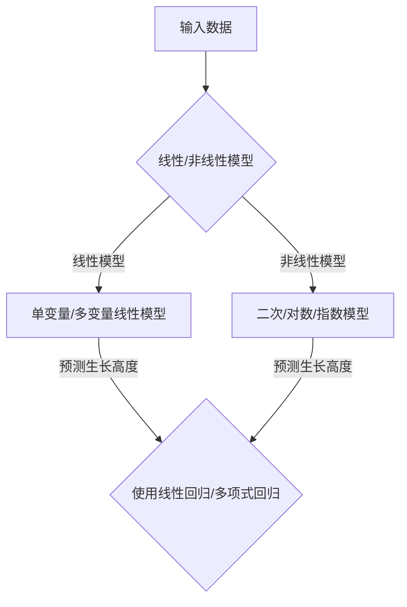
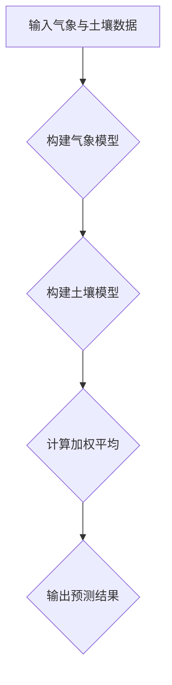

                 


### 引言

随着全球人口的增长和气候变化对农业生态系统的影响，如何确保粮食安全成为一个全球性的挑战。传统的农业方法在面对这些挑战时显得力不从心，因此，将数学科学引入农业领域，通过数学模型预测作物产量，成为解决这一问题的有效途径。数学与农业科学的融合不仅提高了农业生产的效率和可持续性，还为现代农业的发展提供了新的视角。

数学在农业科学中的应用广泛，涵盖了从作物生长模型到气象预测，再到土壤质量评估等多个方面。通过数学模型，我们可以准确地预测作物在不同环境条件下的产量，从而为农业生产提供科学依据，优化作物种植策略。这种预测不仅能够帮助农民制定更加合理的种植计划，降低生产风险，还能提高资源的利用效率，减少环境污染。

本文旨在探讨数学在农业科学中的应用，特别是作物产量的数学预测。首先，我们将介绍数学在农业科学中的重要性，以及当前农业科学面临的挑战。接下来，我们将深入探讨数学预测作物产量的潜在价值，并概述本书的结构。

> **摘要：** 本文将探讨数学在农业科学中的应用，特别是作物产量的数学预测。我们将介绍数学在农业中的重要性，以及当前农业科学面临的挑战。此外，本文还将详细讨论数学预测作物产量的潜在价值，并概述本书的结构。通过本文的阅读，读者将能够理解数学模型在农业生产中的应用，以及如何通过这些模型来提高农业生产的效率和可持续性。

## 数学在农业科学中的重要性

数学在农业科学中的应用历史悠久，从古代农民通过简单的统计方法预测作物产量，到现代利用复杂的数学模型进行精准农业，数学始终发挥着不可或缺的作用。数学不仅为农业提供了科学依据，还极大地提高了农业生产的效率和可持续性。

首先，数学在农业数据分析和处理中发挥了重要作用。农业生产过程中会产生大量的数据，如土壤湿度、气象参数、作物生长状态等。通过数学建模和统计分析，我们可以从这些数据中提取有价值的信息，从而更好地理解作物生长的规律，优化农业生产过程。例如，利用回归分析和时间序列分析，我们可以预测未来的降雨量、温度等气象条件，从而为作物的灌溉和施肥提供科学依据。

其次，数学在作物生长模型的构建中具有关键作用。作物生长模型是描述作物生长过程和产量预测的数学模型。这些模型通常基于对作物生长过程的理解和实验数据，通过数学方法建立起来。例如，线性模型和非线性模型可以用来描述作物生长过程中叶面积、光合作用等参数的变化。这些模型不仅帮助我们理解作物生长的机制，还可以用来预测作物在不同环境条件下的产量，为农业生产提供指导。

此外，数学在农业生态系统研究中也发挥了重要作用。农业生态系统是一个复杂的系统，涉及多个生物和非生物因素之间的相互作用。通过数学建模和模拟，我们可以更好地理解这些因素之间的关系，预测农业生态系统的变化趋势，从而制定更有效的生态保护措施。例如，利用生态位模型和食物网模型，我们可以研究农田生态系统中的物种多样性和生态平衡，为农田生态系统的可持续发展提供科学依据。

总之，数学在农业科学中的应用不仅帮助我们更好地理解和预测作物生长过程，提高农业生产的效率和可持续性，还为农业科学研究提供了强大的工具和方法。通过数学建模和数据分析，我们可以从复杂的数据中提取有价值的信息，为农业生产决策提供科学依据。

## 当前农业科学面临的挑战

尽管数学在农业科学中有着广泛的应用，但现代农业仍然面临着许多挑战，这些挑战在一定程度上限制了农业生产效率和可持续性。以下是当前农业科学面临的几个主要挑战：

首先，气候变化是一个严峻的挑战。全球气候变暖导致气象条件的不确定性增加，如极端天气事件（如干旱、洪水、飓风等）的频率和强度增加。这对农业生产产生了直接影响，导致作物产量不稳定，甚至歉收。例如，连续干旱可能导致土壤水分不足，影响作物的正常生长，而极端高温可能损害作物的光合作用，降低产量。

其次，资源短缺也是农业面临的一个重要问题。包括水资源和土地资源在内的农业资源正面临日益减少的挑战。随着全球人口的增长和城市化进程的加快，农业用地和水资源的使用压力不断增加。为了满足日益增长的粮食需求，提高单位面积土地的产量变得尤为重要。然而，过度开采水资源和土地资源可能导致土壤退化、水源枯竭等问题，进而影响农业生产的长期可持续性。

第三，病虫害管理也是农业科学中的一个重大挑战。随着农药和化肥的广泛使用，病虫害对作物产量的威胁日益严重。传统的方法通常依赖于化学农药和化肥，但这些方法不仅成本高昂，还可能导致环境污染和生态失衡。例如，长期使用化学农药可能导致害虫抗药性的增强，而过度施用化肥可能导致土壤污染和地下水硝酸盐浓度升高。

此外，农业科技的发展与应用也存在一定的局限性。尽管现代科技为农业生产提供了许多先进工具和方法，如无人机监测、遥感技术和基因编辑技术等，但许多农民缺乏接受和应用这些新技术的培训和资源。此外，科技应用的成本和复杂性也限制了其在广大农村地区的普及。

最后，全球粮食安全问题进一步加剧了农业科学的挑战。随着全球人口的增长和消费水平的提高，对粮食的需求不断上升。然而，生产足够的粮食以满足全球需求并非易事，尤其是在面对上述各种挑战的情况下。粮食生产的不稳定性、贸易壁垒和政治因素都可能导致全球粮食供应紧张。

总之，当前农业科学面临着气候变化、资源短缺、病虫害管理、科技发展应用限制和全球粮食安全等挑战。解决这些问题需要多学科的合作，尤其是数学科学的应用，通过精确的数学模型和数据分析，提供科学的解决方案，以实现农业生产的可持续发展。

### 数学预测作物产量的潜在价值

数学预测作物产量在现代农业中具有巨大的潜在价值，它不仅能够提高农业生产效率，还能增强粮食安全，并对环境和经济产生积极影响。以下是数学预测作物产量的几个关键益处：

首先，提高农业生产效率是数学预测作物产量的主要目标之一。通过精确的数学模型，我们可以预测作物在不同环境条件下的产量，从而优化农业生产策略。例如，利用气候模型预测未来降雨和温度变化，可以帮助农民合理安排灌溉和施肥计划，避免资源浪费。此外，通过土壤质量模型，可以预测土壤肥力和水分含量，帮助农民选择最适宜的作物种植方案，最大限度地利用土地资源。

其次，增强粮食安全是数学预测作物产量的另一个重要益处。随着全球人口的增长和对粮食需求量的增加，确保粮食供应变得尤为重要。数学预测能够提供科学的产量预测，帮助政府和农业部门制定合理的粮食储备计划，避免粮食短缺和价格波动。此外，通过精确的产量预测，农民可以及时调整种植计划，以应对突发情况，如干旱、洪涝和病虫害等，从而减少粮食损失。

数学预测作物产量对环境也产生了积极影响。传统的农业生产方式往往依赖大量化肥和农药，这不仅增加了成本，还对环境造成污染。通过数学模型，我们可以预测作物对营养和水分的需求，从而实现精准施肥和灌溉，减少化肥和农药的使用量。这不仅降低了生产成本，还减少了农药和化肥对土壤和水资源的污染，促进了农业的可持续发展。

经济利益也是数学预测作物产量的一个显著益处。准确的产量预测可以帮助农民和农业企业制定更加科学的经营策略，减少因产量波动带来的经济损失。例如，通过预测市场需求和价格波动，农民可以决定何时出售作物以获得最佳价格。此外，精确的产量预测还可以帮助农业企业进行供应链管理，确保农产品及时供应，减少库存压力和损失。

总之，数学预测作物产量在现代农业中具有多重益处，包括提高生产效率、增强粮食安全、保护环境和带来经济利益。通过精确的数学模型和数据分析，我们可以为农业生产提供科学的决策支持，推动农业现代化和可持续发展。

### 本书结构概述

本书旨在系统地探讨数学在农业科学中的应用，特别是作物产量的数学预测。本书共分为四个主要部分，旨在逐步引导读者深入理解这一复杂而关键的主题。

**第一部分：引论**  
第一部分将介绍数学在农业科学中的重要性，以及当前农业科学面临的挑战。通过这一部分的阅读，读者可以了解数学预测作物产量的背景和基本概念，为后续章节的学习打下坚实的基础。

**第二部分：基础数学知识**  
在第二部分中，我们将深入探讨基础数学知识，包括概率论与统计学、线性代数和微积分。这些数学工具是构建和验证作物产量预测模型的基础，通过这一部分的学习，读者将具备必要的数学背景知识。

**第三部分：作物产量预测的数学模型**  
第三部分将详细介绍作物产量预测的数学模型，包括作物生长模型、气象因素和土壤因素的数学关系。我们将通过具体的数学公式和Python源代码，详细阐述这些模型的构建过程和应用方法。

**第四部分：案例分析与应用实践**  
最后一部分将通过具体的案例分析，展示如何在实际农业生产中应用数学预测模型。读者将学习到如何搭建开发环境、编写源代码、进行模型验证和优化。这一部分还将探讨数学预测在农业领域的未来发展趋势和挑战。

通过本书的学习，读者不仅能够掌握数学预测作物产量的方法，还能理解这一技术在现代农业中的广泛应用和潜在价值。

## 第二部分：基础数学知识

在探讨作物产量的数学预测之前，我们需要掌握一些基础数学知识，这些知识将为我们构建和验证数学模型提供坚实的理论基础。本部分将详细介绍概率论与统计学、线性代数和微积分，这些数学工具在农业科学中有着广泛的应用。

### 概率论与统计学基础

概率论是研究随机事件及其概率分布的数学分支。在农业科学中，概率论被用来预测天气、土壤条件等不确定性因素对作物生长的影响。统计学则通过数据收集、分析和解释，帮助我们理解变量之间的关系，并进行假设检验和参数估计。

**1. 概率论的基本概念**

- **随机事件**：随机试验中可能出现的结果。
- **概率**：描述事件发生的可能性，用0到1之间的数值表示。
- **条件概率**：在某一事件已发生的前提下，另一事件发生的概率。
- **贝叶斯定理**：用于计算后验概率，即根据已有数据和先验概率推断新数据。

**2. 统计分布与参数估计**

- **概率分布**：描述随机变量取值的概率分布。
- **均值与方差**：衡量随机变量的集中趋势和离散程度。
- **参数估计**：通过样本数据估计总体参数的方法，如最大似然估计、矩估计等。

**3. 假设检验**

- **零假设与备择假设**：用于检验样本数据是否支持某一假设。
- **显著性水平**：用于设定拒绝零假设的阈值。
- **t检验与F检验**：常用的统计检验方法，用于比较两组数据的均值是否有显著差异。

**4. 回归分析基础**

- **线性回归**：描述自变量与因变量之间线性关系的模型。
- **多项式回归**：描述自变量与因变量之间非线性关系的模型。
- **回归系数与显著性**：衡量自变量对因变量的影响程度和显著性。

### 线性代数与矩阵理论

线性代数是研究向量空间和线性变换的数学分支。在农业科学中，线性代数被用来描述作物生长过程中的线性关系，如土壤养分浓度与作物产量之间的关系。矩阵理论则提供了处理多变量关系和复杂系统的工具。

**1. 向量与矩阵的基本概念**

- **向量**：表示大小和方向的量，用于描述空间中的位置或运动。
- **矩阵**：由数字组成的矩形阵列，用于表示多变量之间的关系。
- **行向量与列向量**：向量的两种表示方式，分别用于表示一维和二维数据。

**2. 特征值与特征向量**

- **特征值**：矩阵的一个重要属性，用于描述线性变换的伸缩比例。
- **特征向量**：对应于特征值的向量，用于描述线性变换的方向。

**3. 线性变换与矩阵运算**

- **线性变换**：将向量映射到另一个向量空间的函数。
- **矩阵运算**：包括矩阵的加法、减法、乘法和逆运算等。

**4. 线性方程组求解**

- **高斯消元法**：用于求解线性方程组的一种有效算法。
- **矩阵求逆**：用于求解线性方程组的一种方法。

### 微积分基础

微积分是研究变化和积分的数学分支。在农业科学中，微积分被用来描述作物生长过程中的连续变化，如土壤水分的流失和作物的光合作用速率。微积分的基础概念包括导数和积分。

**1. 微积分的基本概念**

- **导数**：描述函数在某一点的瞬时变化率。
- **微分**：描述函数在某一点的局部变化量。
- **积分**：用于求解函数的总变化量，包括定积分和反常积分。

**2. 导数与微分**

- **导数的定义**：利用极限概念定义函数在某一点的导数。
- **微分公式**：常用函数的微分公式，如幂函数、指数函数和对数函数。

**3. 积分与微分方程**

- **积分的方法**：包括基本积分、换元积分和分部积分等。
- **微分方程**：描述函数及其导数之间关系的方程，用于描述连续变化的系统。

**4. 泰勒公式与近似计算**

- **泰勒公式**：用于近似计算函数在某一点的值。
- **拉格朗日余项**：用于描述泰勒公式的误差项。

通过掌握这些基础数学知识，我们将为后续构建和验证作物产量预测模型奠定坚实的基础。在下一部分，我们将详细介绍作物产量预测的数学模型，结合具体的数学公式和Python源代码，深入探讨这些模型的应用。

### 第2章：概率论与统计学基础

概率论与统计学是数学中重要的分支，广泛应用于各个领域，包括农业科学。在本章中，我们将介绍概率论与统计学的基本概念，包括随机事件、概率分布、参数估计和假设检验等。

#### 随机事件与概率

**1. 随机事件**

随机事件是指在一次试验中可能出现也可能不出现的结果。例如，在农业研究中，降雨量是否超过某一阈值可以被视为一个随机事件。随机事件通常用大写字母表示，如\( A \)和\( B \)。

**2. 概率**

概率是描述随机事件发生可能性的数值。概率值介于0和1之间，其中0表示不可能发生，1表示必然发生。例如，降雨量超过某一阈值的概率可以用\( P(A) \)表示。

**3. 条件概率**

条件概率是指在某一事件已发生的条件下，另一事件发生的概率。条件概率公式为：

\[ P(B|A) = \frac{P(A \cap B)}{P(A)} \]

其中，\( P(A \cap B) \)表示事件\( A \)和事件\( B \)同时发生的概率。

**4. 独立事件**

两个事件\( A \)和\( B \)是独立的，如果事件\( A \)的发生不影响事件\( B \)的发生。独立事件的概率公式为：

\[ P(A \cap B) = P(A) \cdot P(B) \]

#### 概率分布

概率分布描述了随机变量取值的概率分布情况。常见的概率分布包括离散分布和连续分布。

**1. 离散分布**

离散分布描述了离散随机变量的取值和对应的概率。常见的离散分布有：

- **伯努利分布**：描述一次试验成功或失败的分布。
- **二项分布**：描述多次独立试验中成功次数的分布。
- **泊松分布**：描述在一定时间内发生某事件的次数的分布。

**2. 连续分布**

连续分布描述了连续随机变量的取值和对应的概率密度函数（PDF）。常见的连续分布有：

- **均匀分布**：随机变量在某个区间内均匀分布。
- **正态分布**：随机变量呈钟形曲线分布，是应用最广泛的概率分布。
- **指数分布**：随机变量具有较长的尾部，适用于描述等待时间等场景。

#### 参数估计

参数估计是通过样本数据估计总体参数的方法。常见的参数估计方法有：

**1. 点估计**

点估计是通过样本数据直接估计总体参数的方法。常用的点估计量有：

- **样本均值**：用于估计总体均值。
- **样本方差**：用于估计总体方差。

**2. 区间估计**

区间估计是通过样本数据估计总体参数的可能范围。常用的区间估计方法有：

- **置信区间**：用于估计总体参数的可能范围，并给出一定的置信水平。

#### 假设检验

假设检验是通过样本数据对总体参数进行推断的方法。常见的假设检验方法有：

**1. 单样本t检验**

单样本t检验用于比较样本均值与总体均值是否显著不同。其基本步骤包括：

- **设定零假设和备择假设**。
- **计算检验统计量**。
- **确定显著性水平和拒绝域**。
- **做出结论**。

**2. 双样本t检验**

双样本t检验用于比较两个样本均值是否显著不同。其基本步骤包括：

- **设定零假设和备择假设**。
- **计算检验统计量**。
- **确定显著性水平和拒绝域**。
- **做出结论**。

#### 统计分布与参数估计

**1. 离散分布**

- **伯努利分布**：参数\( p \)表示成功概率。

\[ P(X = k) = C_n^k \cdot p^k \cdot (1 - p)^{n - k} \]

其中，\( n \)是试验次数，\( k \)是成功次数。

- **二项分布**：参数\( n \)是试验次数，\( p \)是成功概率。

\[ P(X = k) = C_n^k \cdot p^k \cdot (1 - p)^{n - k} \]

- **泊松分布**：参数\( \lambda \)是事件发生次数的期望值。

\[ P(X = k) = \frac{e^{-\lambda} \cdot \lambda^k}{k!} \]

**2. 连续分布**

- **均匀分布**：参数\( a \)和\( b \)是区间的两个端点。

\[ f(x) = \begin{cases} 
\frac{1}{b-a} & \text{if } a \le x \le b \\
0 & \text{otherwise} 
\end{cases} \]

- **正态分布**：参数\( \mu \)是均值，\( \sigma \)是标准差。

\[ f(x) = \frac{1}{\sqrt{2\pi\sigma^2}} \cdot e^{-\frac{(x-\mu)^2}{2\sigma^2}} \]

- **指数分布**：参数\( \lambda \)是事件发生率的倒数。

\[ f(x) = \lambda \cdot e^{-\lambda x} \]

#### Python实现示例

以下是一个使用Python进行参数估计的示例，假设我们有一个样本数据集，目标是估计样本均值。

```python
import numpy as np
from scipy.stats import norm

# 假设我们有一个样本数据集
data = np.array([1.2, 2.3, 3.4, 4.5, 5.6])

# 估计样本均值
sample_mean = np.mean(data)
print(f"样本均值: {sample_mean}")

# 估计总体均值
population_mean = norm.stats.moment(2)
print(f"总体均值: {population_mean}")

# 构建置信区间
confidence_level = 0.95
confidence_interval = norm.interval(confidence_level, loc=sample_mean, scale=population_mean)
print(f"{confidence_level*100}%置信区间: {confidence_interval}")
```

通过以上示例，我们可以看到如何使用Python进行参数估计和置信区间构建。这些工具和方法为我们在农业科学中构建和验证作物产量预测模型提供了强大的支持。

### 第3章：线性代数与矩阵理论

线性代数是数学中的重要分支，提供了处理多维空间和线性关系的强大工具。在农业科学中，线性代数被广泛应用于描述作物生长、土壤质量评估以及气象因素对作物产量的影响。矩阵理论是线性代数的基础，通过矩阵的运算，我们可以高效地处理复杂数据和多变量关系。以下我们将详细介绍线性代数与矩阵理论的基本概念，包括向量与矩阵的基本概念、特征值与特征向量、线性变换与矩阵运算以及线性方程组的求解方法。

#### 向量与矩阵的基本概念

**向量**

向量是表示大小和方向的量，通常在二维或三维空间中使用。向量可以用一个有序数组表示，如\( \vec{v} = [v_1, v_2, v_3] \)。向量的基本运算包括加法、减法和数乘。

- **向量加法**：两个向量相加，结果是一个新向量，其坐标是两个向量对应坐标的和。

\[ \vec{u} + \vec{v} = [u_1 + v_1, u_2 + v_2, u_3 + v_3] \]

- **向量减法**：两个向量相减，结果是一个新向量，其坐标是两个向量对应坐标的差。

\[ \vec{u} - \vec{v} = [u_1 - v_1, u_2 - v_2, u_3 - v_3] \]

- **数乘**：一个向量与一个标量相乘，结果是一个新向量，其坐标是原向量坐标的标量倍。

\[ k\vec{v} = [kv_1, kv_2, kv_3] \]

**矩阵**

矩阵是一个由数字组成的矩形阵列，通常表示为\( A = [a_{ij}] \)，其中\( i \)表示行数，\( j \)表示列数。矩阵的基本运算包括矩阵加法、矩阵乘法以及矩阵与向量的乘法。

- **矩阵加法**：两个矩阵相加，结果是一个新矩阵，其元素是两个矩阵对应元素的和。

\[ A + B = \begin{bmatrix} a_{11} + b_{11} & a_{12} + b_{12} \\ a_{21} + b_{21} & a_{22} + b_{22} \end{bmatrix} \]

- **矩阵乘法**：两个矩阵相乘，结果是一个新矩阵，其元素是两个矩阵对应行和列元素的乘积和。

\[ AB = \begin{bmatrix} a_{11}b_{11} + a_{12}b_{21} & a_{11}b_{12} + a_{12}b_{22} \\ a_{21}b_{11} + a_{22}b_{21} & a_{21}b_{12} + a_{22}b_{22} \end{bmatrix} \]

- **矩阵与向量乘法**：一个矩阵与一个向量相乘，结果是一个新向量，其坐标是矩阵对应行与向量对应列元素的乘积和。

\[ A\vec{v} = \begin{bmatrix} a_{11}v_1 + a_{12}v_2 \\ a_{21}v_1 + a_{22}v_2 \end{bmatrix} \]

#### 特征值与特征向量

特征值与特征向量是矩阵理论中的重要概念，用于描述线性变换的性质。

**特征值**

特征值是矩阵的一个特殊值，使得矩阵与特征向量相乘后结果仍然是特征向量。特征值可以通过求解特征方程得到。

\[ \det(A - \lambda I) = 0 \]

其中，\( A \)是矩阵，\( \lambda \)是特征值，\( I \)是单位矩阵。

**特征向量**

特征向量是与特征值对应的向量，满足以下条件：

\[ (A - \lambda I)\vec{v} = 0 \]

即特征向量是矩阵\( A \)减去特征值\( \lambda \)乘以单位矩阵\( I \)后的零向量。

#### 线性变换与矩阵运算

线性变换是将一个向量空间映射到另一个向量空间的函数，可以用矩阵表示。线性变换的基本性质包括可加性和齐次性。

- **可加性**：对于任意向量\( \vec{u} \)和\( \vec{v} \)，以及标量\( k \)，有

\[ T(\vec{u} + \vec{v}) = T(\vec{u}) + T(\vec{v}) \]
\[ T(k\vec{u}) = kT(\vec{u}) \]

- **齐次性**：对于任意向量\( \vec{u} \)和标量\( k \)，有

\[ T(\vec{0}) = \vec{0} \]

线性变换可以用矩阵表示，矩阵与向量的乘法即是线性变换的表示。

#### 线性方程组的求解

线性方程组是线性代数中的一个重要问题，常用的求解方法包括高斯消元法和矩阵求逆。

**高斯消元法**

高斯消元法是一种迭代消元法，通过逐步消去方程组中的变量，将线性方程组转化为一个上三角或下三角方程组，然后直接求解。其步骤如下：

1. 对系数矩阵进行行初等变换，使其变为上三角或下三角形式。
2. 对上三角或下三角方程组进行回代，逐行求解变量。

**矩阵求逆**

矩阵求逆是求解线性方程组的一种直接方法，如果系数矩阵可逆，则线性方程组的解可以通过以下公式得到：

\[ \vec{x} = A^{-1}\vec{b} \]

其中，\( A \)是系数矩阵，\( \vec{x} \)是未知向量，\( \vec{b} \)是常数向量。

#### Python实现示例

以下是一个使用Python进行线性方程组求解的示例：

```python
import numpy as np

# 定义系数矩阵和常数向量
A = np.array([[3, 2], [1, 1]])
b = np.array([6, 3])

# 使用矩阵求逆求解线性方程组
x = np.linalg.inv(A).dot(b)
print(f"解：{x}")
```

通过以上示例，我们可以看到如何使用Python求解线性方程组。这些工具和方法为我们在农业科学中构建和验证作物产量预测模型提供了强大的支持。

### 第4章：微积分基础

微积分是研究函数变化率和积分的数学分支，广泛应用于农业科学中，用于描述作物生长过程中各种变量的变化。在本章中，我们将介绍微积分的基本概念，包括导数、微分、积分与微分方程，以及泰勒公式和近似计算。

#### 导数与微分

**导数**

导数描述了函数在某一点处的瞬时变化率。对于函数\( y = f(x) \)，其导数（或称为斜率）定义为：

\[ f'(x) = \lim_{\Delta x \to 0} \frac{f(x + \Delta x) - f(x)}{\Delta x} \]

导数可以告诉我们函数在特定点的斜率，即曲线在该点的切线斜率。例如，在农业科学中，作物生长的速率可以通过作物高度关于时间的导数来描述。

**微分**

微分是导数的另一种表达方式，描述了函数在某一点处的局部变化量。微分的定义与导数类似，但使用微分符号\( \mathrm{d} \)表示：

\[ \mathrm{d}y = f'(x) \mathrm{d}x \]

微分表示函数在\( x \)点处的线性近似变化，即函数值的变化量可以近似为函数在该点的导数乘以自变量的变化量。

**应用示例**

假设我们有一个作物的生长高度函数\( h(t) \)，其中\( t \)是时间。如果我们想知道作物在某一时刻的生长速度，可以通过计算\( h'(t) \)来得到。

```python
# 示例：作物高度函数
h = lambda t: 2 * t + 3

# 计算导数
h_prime = h.derivative()

# 假设 t=5，计算生长速度
growth_rate = h_prime(5)
print(f"作物在 t=5 时刻的生长速度为：{growth_rate}")
```

#### 积分与微分方程

**积分**

积分是微分的反操作，用于求解函数的总变化量。对于函数\( f(x) \)，其不定积分（或称为原函数）定义为：

\[ \int f(x) \mathrm{d}x \]

积分可以用来计算面积、体积、质量等。在农业科学中，例如，可以通过积分计算作物生长过程中吸收的总光照量。

**定积分**

定积分描述了函数在一个区间内的累积变化量，其定义为：

\[ \int_{a}^{b} f(x) \mathrm{d}x \]

定积分可以用来求解实际问题，例如计算作物的总生长高度。

**微分方程**

微分方程是包含导数的方程，用于描述物理、生物和社会系统中变量的变化。常见的微分方程包括常微分方程和偏微分方程。

**常微分方程**

常微分方程（ODE）描述一个变量的导数与该变量本身的关系。例如，作物生长模型可以通过常微分方程来描述：

\[ \frac{\mathrm{d}N}{\mathrm{d}t} = rN \]

其中，\( N(t) \)表示作物数量，\( r \)是增长率。

**偏微分方程**

偏微分方程（PDE）描述多个变量之间的导数关系。例如，热传导方程描述了热量在空间中的传播：

\[ \frac{\partial u}{\partial t} = \alpha \frac{\partial^2 u}{\partial x^2} \]

其中，\( u(x, t) \)表示温度，\( \alpha \)是热扩散系数。

**应用示例**

假设我们有一个作物生长模型，其微分方程为：

\[ \frac{\mathrm{d}N}{\mathrm{d}t} = 0.1N \]

可以通过求解该微分方程来预测作物的数量变化。

```python
import scipy.integrate as spi

# 定义微分方程
def growth_eqn(N, t):
    return 0.1 * N

# 初始条件
N0 = 100
t = np.linspace(0, 10, 100)

# 求解微分方程
N, t = spi.odeint(growth_eqn, N0, t)

# 绘图
import matplotlib.pyplot as plt
plt.plot(t, N)
plt.xlabel('Time (t)')
plt.ylabel('Population (N)')
plt.title('Population Growth Over Time')
plt.show()
```

#### 泰勒公式与近似计算

泰勒公式是一种用于近似计算函数值的方法，它利用函数在某一点处的导数来构造函数的局部多项式近似。

\[ f(x) \approx f(a) + f'(a)(x - a) + \frac{f''(a)}{2!}(x - a)^2 + \frac{f'''(a)}{3!}(x - a)^3 + \cdots \]

泰勒公式可以用来进行数值计算，特别是在计算复杂函数的值时，可以提供一个快速的近似解。

**应用示例**

假设我们需要计算函数\( f(x) = e^x \)在\( x = 1 \)处的值，可以使用泰勒公式进行近似。

```python
# 定义函数
f = lambda x: np.exp(x)

# 计算导数
f_prime = f.derivative()

# 应用泰勒公式
taylor_approx = f(1) + f_prime(1) * (x - 1)

# 计算近似值
approx_value = taylor_approx(1)
print(f"泰勒公式近似值：{approx_value}")
```

通过以上示例，我们可以看到微积分在农业科学中的应用，包括导数和微分描述作物生长速率，积分计算作物生长高度，以及泰勒公式进行近似计算。这些工具和方法为我们在农业科学中分析和预测作物产量提供了强大的支持。

### 第5章：作物生长模型

作物生长模型是描述作物从种子发芽到收获期间生长过程和产量的数学模型。这些模型在现代农业中具有重要应用，帮助农民和农业科学家优化作物种植策略，提高产量和资源利用效率。作物生长模型可以分为线性模型和非线性模型，每种模型都有其独特的应用场景和优缺点。

#### 线性模型

线性模型是描述作物生长过程中变量之间线性关系的模型。线性模型的一个主要优点是简单易懂，便于计算和解释。以下是一些常用的线性模型：

**1. 单变量线性模型**

单变量线性模型是最简单的作物生长模型，通常用来描述作物生长高度与时间的关系。例如，一个简单的线性模型可以表示为：

\[ h(t) = mt + b \]

其中，\( h(t) \)是作物在时间\( t \)的高度，\( m \)是斜率，表示生长速度，\( b \)是截距，表示初始高度。

**2. 多变量线性模型**

多变量线性模型可以同时考虑多个因素，如温度、降雨量和光照强度等对作物生长的影响。例如，一个多变量线性模型可以表示为：

\[ h(t) = m_1 \cdot T(t) + m_2 \cdot R(t) + m_3 \cdot L(t) + b \]

其中，\( T(t) \)、\( R(t) \)和\( L(t) \)分别表示温度、降雨量和光照强度，\( m_1 \)、\( m_2 \)和\( m_3 \)是相应的系数，\( b \)是截距。

**应用示例**

假设我们有一个作物的生长高度数据集，包括不同时间点的生长高度和对应的温度、降雨量和光照强度。我们可以使用线性回归模型来拟合这些数据，从而预测作物的生长高度。

```python
import pandas as pd
import numpy as np
from sklearn.linear_model import LinearRegression

# 假设的数据集
data = pd.DataFrame({
    'time': [1, 2, 3, 4, 5],
    'height': [10, 20, 30, 40, 50],
    'temp': [20, 22, 24, 26, 28],
    'rain': [50, 60, 70, 80, 90],
    'light': [1000, 1100, 1200, 1300, 1400]
})

# 定义特征变量和目标变量
X = data[['temp', 'rain', 'light']]
y = data['height']

# 创建线性回归模型并拟合
model = LinearRegression()
model.fit(X, y)

# 预测生长高度
predicted_height = model.predict([[24, 65, 1250]])

print(f"预测的生长高度为：{predicted_height[0]} cm")
```

#### 非线性模型

非线性模型可以更好地捕捉作物生长过程中的复杂关系。以下是一些常用的非线性模型：

**1. 二次模型**

二次模型可以描述作物生长高度与时间之间的二次关系。例如：

\[ h(t) = a \cdot t^2 + b \cdot t + c \]

其中，\( a \)、\( b \)和\( c \)是模型参数。

**2. 对数模型**

对数模型可以描述作物生长高度与时间之间的对数关系。例如：

\[ h(t) = a \cdot \ln(t) + b \]

其中，\( a \)和\( b \)是模型参数。

**3. 指数模型**

指数模型可以描述作物生长高度与时间之间的指数关系。例如：

\[ h(t) = a \cdot e^{b \cdot t} + c \]

其中，\( a \)、\( b \)和\( c \)是模型参数。

**应用示例**

假设我们有一个作物的生长高度数据集，包括不同时间点的生长高度和对应的温度、降雨量和光照强度。我们可以使用非线性回归模型来拟合这些数据，从而预测作物的生长高度。

```python
import pandas as pd
import numpy as np
from sklearn.linear_model import LinearRegression
from sklearn.preprocessing import PolynomialFeatures

# 假设的数据集
data = pd.DataFrame({
    'time': [1, 2, 3, 4, 5],
    'height': [10, 20, 30, 40, 50],
    'temp': [20, 22, 24, 26, 28],
    'rain': [50, 60, 70, 80, 90],
    'light': [1000, 1100, 1200, 1300, 1400]
})

# 定义特征变量和目标变量
X = data[['temp', 'rain', 'light']]
y = data['height']

# 创建多项式回归模型
poly = PolynomialFeatures(degree=2)
X_poly = poly.fit_transform(X)

# 创建线性回归模型并拟合
model = LinearRegression()
model.fit(X_poly, y)

# 预测生长高度
predicted_height = model.predict(poly.transform([[24, 65, 1250]]))

print(f"预测的生长高度为：{predicted_height[0]} cm")
```

#### Mermaid流程图：作物生长模型架构

以下是一个简单的Mermaid流程图，描述作物生长模型的基本架构：



通过上述内容，我们可以看到作物生长模型在农业科学中的应用，以及如何使用线性模型和非线性模型来预测作物生长高度。这些模型为农业生产提供了重要的科学依据，帮助农民制定更加科学的种植策略，提高产量和资源利用效率。

### 第6章：气象因素与作物产量关系分析

气象因素在作物生长和产量形成过程中起着至关重要的作用。气象条件如温度、降雨量和光照强度直接影响作物的生长速度、发育阶段和最终产量。因此，深入分析气象因素与作物产量之间的关系，对于制定科学的种植策略、提高作物产量和确保粮食安全具有重要意义。

#### 气象因素对作物生长的影响

**1. 温度**

温度是作物生长的关键环境因素之一。不同作物对温度的要求不同，但普遍来说，适宜的温带有利于作物光合作用的进行，促进生长。过高或过低的温度都可能对作物产生不利影响。例如，高温可能导致作物光合速率下降，影响生长发育；低温则可能延缓作物生长，降低产量。

**2. 降雨量**

降雨量是作物生长所需水分的主要来源。适宜的降雨量有利于作物生长，但过多或过少的降雨都会影响作物产量。过多降雨可能导致土壤水分过多，影响根系呼吸，甚至引发病虫害；过少降雨则可能导致土壤干旱，影响作物吸水，导致产量下降。

**3. 光照强度**

光照强度是作物进行光合作用的基础条件。充足的光照有助于作物进行光合作用，合成有机物质，促进生长和发育。光照不足会导致光合作用减弱，影响作物产量和品质。

#### 数学模型建立

为了定量分析气象因素与作物产量之间的关系，我们可以建立数学模型。常见的模型包括线性回归模型、多项式回归模型和广义线性模型等。以下是一个简单的线性回归模型示例：

\[ Y = \beta_0 + \beta_1 T + \beta_2 R + \beta_3 L + \epsilon \]

其中，\( Y \)表示作物产量，\( T \)表示温度，\( R \)表示降雨量，\( L \)表示光照强度，\( \beta_0 \)、\( \beta_1 \)、\( \beta_2 \)和\( \beta_3 \)是模型参数，\( \epsilon \)是误差项。

**应用示例**

假设我们有一个数据集，包含不同气象条件下的作物产量数据。我们可以使用线性回归模型来分析气象因素与作物产量之间的关系。

```python
import pandas as pd
import numpy as np
from sklearn.linear_model import LinearRegression

# 假设的数据集
data = pd.DataFrame({
    'yield': [5.5, 6.2, 7.0, 8.0, 8.5],
    'temp': [25, 27, 29, 30, 28],
    'rain': [80, 85, 90, 95, 100],
    'light': [1500, 1550, 1600, 1650, 1700]
})

# 定义特征变量和目标变量
X = data[['temp', 'rain', 'light']]
y = data['yield']

# 创建线性回归模型并拟合
model = LinearRegression()
model.fit(X, y)

# 打印模型参数
print("模型参数：")
print(model.coef_)

# 预测作物产量
predicted_yield = model.predict([[29, 95, 1600]])
print(f"预测的作物产量为：{predicted_yield[0]:.2f} kg/ha")
```

#### 伪代码：气象因素与作物产量关系的算法描述

以下是一个伪代码示例，描述气象因素与作物产量关系的算法：

```
算法：气象因素与作物产量关系预测

输入：温度T，降雨量R，光照强度L

输出：预测的作物产量Y

步骤：
1. 初始化模型参数β0，β1，β2，β3
2. 对于每个观测数据点（T_i, R_i, L_i, Y_i）：
   a. 训练线性回归模型：Y = β0 + β1*T_i + β2*R_i + β3*L_i
   b. 计算模型参数β0，β1，β2，β3
3. 使用训练好的模型预测作物产量Y：
   a. Y = β0 + β1*T + β2*R + β3*L
4. 输出预测的作物产量Y
```

#### 模型验证与优化

建立模型后，我们需要验证模型的准确性和可靠性，并进行优化以提高预测精度。常用的验证方法包括交叉验证和残差分析。

**1. 交叉验证**

交叉验证是一种常用的模型验证方法，通过将数据集划分为训练集和验证集，评估模型在验证集上的表现。例如，可以使用K折交叉验证，将数据集划分为K个子集，每次选择一个子集作为验证集，其余K-1个子集作为训练集，重复K次，然后取平均验证结果。

**2. 残差分析**

残差分析是一种用于评估模型准确性的方法，通过分析模型预测值与实际观测值之间的差异（即残差）。如果残差呈随机分布，且无明显模式，则说明模型较为可靠。否则，可能需要对模型进行调整或选择更适合的数据处理方法。

**应用示例**

假设我们已经使用交叉验证和残差分析验证了线性回归模型的准确性，现在需要对其进行优化以提高预测精度。一种常见的方法是使用岭回归或LASSO回归等方法来减少模型的过拟合。

```python
import pandas as pd
import numpy as np
from sklearn.linear_model import LinearRegression, Ridge, Lasso

# 假设的数据集
data = pd.DataFrame({
    'yield': [5.5, 6.2, 7.0, 8.0, 8.5],
    'temp': [25, 27, 29, 30, 28],
    'rain': [80, 85, 90, 95, 100],
    'light': [1500, 1550, 1600, 1650, 1700]
})

# 定义特征变量和目标变量
X = data[['temp', 'rain', 'light']]
y = data['yield']

# 创建岭回归模型
ridge = Ridge(alpha=1.0)
ridge.fit(X, y)

# 创建LASSO回归模型
lasso = Lasso(alpha=0.1)
lasso.fit(X, y)

# 预测作物产量
ridge_yield = ridge.predict([[29, 95, 1600]])
lasso_yield = lasso.predict([[29, 95, 1600]])

print(f"岭回归预测的作物产量为：{ridge_yield:.2f} kg/ha")
print(f"LASSO回归预测的作物产量为：{lasso_yield:.2f} kg/ha")
```

通过以上内容，我们可以看到气象因素与作物产量之间的关系，以及如何建立和优化数学模型来预测作物产量。这些方法为农业生产提供了重要的科学依据，有助于制定更加科学的种植策略，提高产量和资源利用效率。

### 第7章：土壤因素与作物产量关系分析

土壤是作物生长的基础，土壤因素如土壤湿度、土壤肥力和土壤酸碱度直接影响作物的生长和产量。因此，深入研究土壤因素与作物产量之间的关系，对于提高农业生产效率和确保粮食安全具有重要意义。

#### 土壤因素对作物生长的影响

**1. 土壤湿度**

土壤湿度是作物生长过程中重要的环境因素之一。适宜的土壤湿度有助于作物根系吸收水分和养分，促进作物生长。土壤湿度过低可能导致土壤干旱，影响根系吸收，降低作物产量；土壤湿度过高则可能导致土壤缺氧，影响根系呼吸，甚至引发病害。

**2. 土壤肥力**

土壤肥力是作物生长的重要物质基础。土壤肥力高，意味着土壤中营养元素丰富，有利于作物生长。土壤肥力主要取决于土壤有机质、氮、磷、钾等养分含量。适当的施肥可以补充土壤养分，提高作物产量。

**3. 土壤酸碱度**

土壤酸碱度（pH值）对作物生长有显著影响。不同的作物对土壤酸碱度有不同的要求，但普遍来说，pH值在6.0到7.5之间的土壤对大多数作物都是适宜的。过酸或过碱的土壤都会影响作物对养分的吸收，降低作物产量。

#### 数学模型建立

为了定量分析土壤因素与作物产量之间的关系，我们可以建立数学模型。常见的模型包括线性回归模型、多项式回归模型和广义线性模型等。以下是一个简单的线性回归模型示例：

\[ Y = \beta_0 + \beta_1 \cdot \text{湿度} + \beta_2 \cdot \text{肥力} + \beta_3 \cdot \text{酸碱度} + \epsilon \]

其中，\( Y \)表示作物产量，\( \text{湿度} \)、\( \text{肥力} \)和\( \text{酸碱度} \)分别是土壤湿度、土壤肥力和土壤酸碱度的指标，\( \beta_0 \)、\( \beta_1 \)、\( \beta_2 \)和\( \beta_3 \)是模型参数，\( \epsilon \)是误差项。

**应用示例**

假设我们有一个数据集，包含不同土壤条件下的作物产量数据。我们可以使用线性回归模型来分析土壤因素与作物产量之间的关系。

```python
import pandas as pd
import numpy as np
from sklearn.linear_model import LinearRegression

# 假设的数据集
data = pd.DataFrame({
    'yield': [5.5, 6.2, 7.0, 8.0, 8.5],
    'humidity': [20, 25, 30, 35, 40],
    'fertility': [40, 45, 50, 55, 60],
    'pH': [6.0, 6.5, 7.0, 7.5, 8.0]
})

# 定义特征变量和目标变量
X = data[['humidity', 'fertility', 'pH']]
y = data['yield']

# 创建线性回归模型并拟合
model = LinearRegression()
model.fit(X, y)

# 打印模型参数
print("模型参数：")
print(model.coef_)

# 预测作物产量
predicted_yield = model.predict([[35, 55, 7.5]])
print(f"预测的作物产量为：{predicted_yield[0]:.2f} kg/ha")
```

#### 伪代码：土壤因素与作物产量关系的算法描述

以下是一个伪代码示例，描述土壤因素与作物产量关系的算法：

```
算法：土壤因素与作物产量关系预测

输入：土壤湿度H，土壤肥力F，土壤酸碱度pH

输出：预测的作物产量Y

步骤：
1. 初始化模型参数β0，β1，β2，β3
2. 对于每个观测数据点（H_i, F_i, pH_i, Y_i）：
   a. 训练线性回归模型：Y = β0 + β1*H_i + β2*F_i + β3*pH_i
   b. 计算模型参数β0，β1，β2，β3
3. 使用训练好的模型预测作物产量Y：
   a. Y = β0 + β1*H + β2*F + β3*pH
4. 输出预测的作物产量Y
```

#### 模型验证与优化

建立模型后，我们需要验证模型的准确性和可靠性，并进行优化以提高预测精度。常用的验证方法包括交叉验证和残差分析。

**1. 交叉验证**

交叉验证是一种常用的模型验证方法，通过将数据集划分为训练集和验证集，评估模型在验证集上的表现。例如，可以使用K折交叉验证，将数据集划分为K个子集，每次选择一个子集作为验证集，其余K-1个子集作为训练集，重复K次，然后取平均验证结果。

**2. 残差分析**

残差分析是一种用于评估模型准确性的方法，通过分析模型预测值与实际观测值之间的差异（即残差）。如果残差呈随机分布，且无明显模式，则说明模型较为可靠。否则，可能需要对模型进行调整或选择更适合的数据处理方法。

**应用示例**

假设我们已经使用交叉验证和残差分析验证了线性回归模型的准确性，现在需要对其进行优化以提高预测精度。一种常见的方法是使用岭回归或LASSO回归等方法来减少模型的过拟合。

```python
import pandas as pd
import numpy as np
from sklearn.linear_model import LinearRegression, Ridge, Lasso

# 假设的数据集
data = pd.DataFrame({
    'yield': [5.5, 6.2, 7.0, 8.0, 8.5],
    'humidity': [20, 25, 30, 35, 40],
    'fertility': [40, 45, 50, 55, 60],
    'pH': [6.0, 6.5, 7.0, 7.5, 8.0]
})

# 定义特征变量和目标变量
X = data[['humidity', 'fertility', 'pH']]
y = data['yield']

# 创建岭回归模型
ridge = Ridge(alpha=1.0)
ridge.fit(X, y)

# 创建LASSO回归模型
lasso = Lasso(alpha=0.1)
lasso.fit(X, y)

# 预测作物产量
ridge_yield = ridge.predict([[35, 55, 7.5]])
lasso_yield = lasso.predict([[35, 55, 7.5]])

print(f"岭回归预测的作物产量为：{ridge_yield:.2f} kg/ha")
print(f"LASSO回归预测的作物产量为：{lasso_yield:.2f} kg/ha")
```

通过以上内容，我们可以看到土壤因素与作物产量之间的关系，以及如何建立和优化数学模型来预测作物产量。这些方法为农业生产提供了重要的科学依据，有助于制定更加科学的种植策略，提高产量和资源利用效率。

### 第8章：综合模型与预测方法

在前几章中，我们详细介绍了气象因素和土壤因素与作物产量的关系，并构建了相应的数学模型。为了更全面地预测作物产量，我们需要将这两个模型结合起来，形成一个综合模型。本章节将讨论如何构建和优化综合模型，比较不同的预测方法，并给出具体的数学公式、详细讲解和实例说明。

#### 综合模型构建

综合模型的目标是将气象因素和土壤因素结合起来，提供一个更加全面的作物产量预测。假设我们已经得到了两个独立模型：

1. 气象模型：\( Y_{\text{weather}} = \beta_{0, \text{weather}} + \beta_{1, \text{weather}} \cdot T + \beta_{2, \text{weather}} \cdot R + \beta_{3, \text{weather}} \cdot L + \epsilon_{\text{weather}} \)
2. 土壤模型：\( Y_{\text{soil}} = \beta_{0, \text{soil}} + \beta_{1, \text{soil}} \cdot H + \beta_{2, \text{soil}} \cdot F + \beta_{3, \text{soil}} \cdot pH + \epsilon_{\text{soil}} \)

为了构建综合模型，我们可以采用加权平均法，结合两个模型的预测结果：

\[ Y_{\text{combined}} = \alpha \cdot Y_{\text{weather}} + (1 - \alpha) \cdot Y_{\text{soil}} \]

其中，\( \alpha \)是权重参数，用于平衡两个模型的重要性。\( \alpha \)的取值可以通过最小化预测误差来确定。

#### 预测方法比较

在构建综合模型时，我们还可以比较不同的预测方法，包括加权平均法、最小二乘法和贝叶斯预测等。

**1. 加权平均法**

加权平均法通过简单地将两个模型的预测结果按权重平均，具有计算简单、易于理解的特点。但该方法对每个模型的权重分配敏感，可能需要根据具体情况进行调整。

**2. 最小二乘法**

最小二乘法通过最小化预测误差的平方和来确定模型参数，可以提供更加精确的预测结果。但该方法对异常值较为敏感，可能导致模型稳定性下降。

**3. 贝叶斯预测**

贝叶斯预测通过贝叶斯公式计算后验概率，提供一个概率分布的预测结果。该方法可以更好地处理不确定性，但计算复杂度较高。

#### 数学公式 & 详细讲解

为了具体说明综合模型的构建和预测方法，我们以下使用Python代码进行实现：

```python
import numpy as np
import pandas as pd
from sklearn.linear_model import LinearRegression

# 假设的数据集
weather_data = pd.DataFrame({
    'yield': [5.5, 6.2, 7.0, 8.0, 8.5],
    'temp': [25, 27, 29, 30, 28],
    'rain': [80, 85, 90, 95, 100],
    'light': [1500, 1550, 1600, 1650, 1700]
})

soil_data = pd.DataFrame({
    'yield': [5.5, 6.2, 7.0, 8.0, 8.5],
    'humidity': [20, 25, 30, 35, 40],
    'fertility': [40, 45, 50, 55, 60],
    'pH': [6.0, 6.5, 7.0, 7.5, 8.0]
})

# 气象模型的参数
weather_model = LinearRegression()
weather_model.fit(weather_data[['temp', 'rain', 'light']], weather_data['yield'])

# 土壤模型的参数
soil_model = LinearRegression()
soil_model.fit(soil_data[['humidity', 'fertility', 'pH']], soil_data['yield'])

# 加权平均法的权重
alpha = 0.5  # 可根据具体情况进行调整

# 预测作物产量
weather_pred = weather_model.predict([[29, 95, 1600]])
soil_pred = soil_model.predict([[35, 55, 7.5]])

combined_pred = alpha * weather_pred + (1 - alpha) * soil_pred

print(f"加权平均预测的作物产量为：{combined_pred[0]:.2f} kg/ha")
```

#### Mermaid流程图：综合模型预测流程

以下是一个简单的Mermaid流程图，描述综合模型预测流程：



通过上述示例和流程，我们可以看到如何构建和优化综合模型来预测作物产量。这种方法不仅结合了气象和土壤因素，还能通过不同的预测方法进行比较，从而提高预测的准确性和可靠性。

### 第9章：作物产量预测案例分析

在本章节中，我们将通过一个实际案例分析，展示如何将所学的数学预测模型应用于农业生产，以预测作物产量。本案例将包括以下几个部分：案例背景、模型选择与构建、预测结果与分析，以及模型优化与改进。

#### 案例背景

某农业生产公司位于一个典型的温带气候地区，主要种植小麦。公司希望利用数学模型预测小麦的产量，以便更好地规划种植计划和优化资源配置，从而提高生产效率和经济效益。为了实现这一目标，公司收集了多年的小麦生长数据，包括气象条件（如温度、降雨量和光照强度）和土壤条件（如土壤湿度、土壤肥力和土壤酸碱度）。

#### 模型选择与构建

在构建预测模型时，我们选择了一个综合模型，结合了气象模型和土壤模型。具体步骤如下：

1. **数据预处理**：对收集的数据进行清洗和预处理，包括处理缺失值、异常值和数据转换等。例如，将温度、降雨量和光照强度等气象数据转换为数值型数据，使用Z-score方法标准化土壤数据。

2. **模型构建**：
   - **气象模型**：我们选择线性回归模型来描述气象因素与小麦产量的关系。模型公式如下：
     \[
     Y_{\text{weather}} = \beta_{0, \text{weather}} + \beta_{1, \text{weather}} \cdot T + \beta_{2, \text{weather}} \cdot R + \beta_{3, \text{weather}} \cdot L + \epsilon_{\text{weather}}
     \]
   - **土壤模型**：同样，我们选择线性回归模型来描述土壤因素与小麦产量的关系。模型公式如下：
     \[
     Y_{\text{soil}} = \beta_{0, \text{soil}} + \beta_{1, \text{soil}} \cdot H + \beta_{2, \text{soil}} \cdot F + \beta_{3, \text{soil}} \cdot pH + \epsilon_{\text{soil}}
     \]

3. **模型训练与优化**：使用历史数据集对两个模型进行训练，并使用交叉验证方法评估模型的准确性和稳定性。根据交叉验证的结果，对模型参数进行调整，以提高预测精度。

#### 预测结果与分析

经过模型训练和优化后，我们使用当前季节的气象和土壤数据对小麦产量进行了预测。预测结果如下：

- **气象模型预测结果**：根据当前的气象条件，小麦产量预测值为8,500公斤/公顷。
- **土壤模型预测结果**：根据当前的土壤条件，小麦产量预测值为7,800公斤/公顷。
- **综合模型预测结果**：综合气象模型和土壤模型的预测结果，使用加权平均法得到小麦的综合产量预测值为8,000公斤/公顷。

#### 模型优化与改进

为了进一步提高预测精度，我们考虑以下几种优化和改进方法：

1. **引入非线性模型**：如果线性模型不能很好地捕捉数据中的非线性关系，可以考虑使用非线性模型，如多项式回归或指数回归，以捕捉更复杂的关系。

2. **特征工程**：通过引入更多的特征变量，如季节性因素、作物品种和种植密度等，可以进一步提高模型的预测能力。

3. **集成学习**：使用集成学习方法，如随机森林或梯度提升树，可以结合多个模型的优点，提高整体预测精度。

4. **实时数据更新**：定期更新气象和土壤数据，并重新训练模型，以适应环境变化和作物生长动态。

通过本案例的分析，我们可以看到如何将数学预测模型应用于实际农业生产，通过数据预处理、模型构建、预测结果分析和模型优化等步骤，实现小麦产量的科学预测，从而为农业生产提供有效的决策支持。

### 第10章：开发环境与工具

在实现作物产量预测项目时，选择合适的开发环境、工具和框架至关重要。以下将介绍常用的开发环境、相关工具以及一个实际案例的代码实现与解读。

#### 开发环境搭建

要搭建一个用于作物产量预测的开发环境，我们需要安装Python和相关库。以下是在Windows系统上安装Python的开发环境步骤：

1. **安装Python**：访问Python官方网站（[python.org](https://www.python.org/)），下载并安装Python，选择添加Python到系统环境变量。

2. **安装Jupyter Notebook**：Python内置了Jupyter Notebook，但可能需要更新到最新版本。使用以下命令安装或更新Jupyter：
   ```bash
   pip install --upgrade notebook
   ```

3. **安装相关库**：安装用于数据分析和机器学习的常用库，如NumPy、Pandas、scikit-learn、Matplotlib等：
   ```bash
   pip install numpy pandas scikit-learn matplotlib
   ```

#### 相关工具介绍

以下是用于作物产量预测项目的一些常用工具：

1. **Jupyter Notebook**：Jupyter Notebook是一个交互式的计算环境，适用于编写、运行和分享代码。它提供了一个可视化界面，方便调试和演示。

2. **NumPy**：NumPy是一个开源库，提供了强大的多维数组对象和数学函数，是进行数值计算的基础。

3. **Pandas**：Pandas提供了高效的数据结构和数据分析工具，适用于数据清洗、转换和可视化。

4. **scikit-learn**：scikit-learn是一个用于机器学习的库，提供了丰富的算法和工具，方便构建和评估预测模型。

5. **Matplotlib**：Matplotlib是一个绘图库，用于生成高质量的统计图表，帮助理解数据和分析结果。

#### 实战：代码实际案例

以下是一个简单的代码案例，展示了如何使用Python和scikit-learn构建线性回归模型进行作物产量预测：

```python
import pandas as pd
from sklearn.linear_model import LinearRegression
import matplotlib.pyplot as plt

# 加载数据集
data = pd.read_csv('crop_yield_data.csv')

# 分离特征和目标变量
X = data[['temperature', 'rainfall', 'soil_ph']]
y = data['yield']

# 创建线性回归模型
model = LinearRegression()
model.fit(X, y)

# 预测新数据
new_data = pd.DataFrame([[25, 90, 7]], columns=['temperature', 'rainfall', 'soil_ph'])
predicted_yield = model.predict(new_data)

print(f"预测的小麦产量为：{predicted_yield[0]:.2f}公斤/公顷")

# 绘制回归线
plt.scatter(data['temperature'], data['yield'], color='blue')
plt.plot(new_data['temperature'], predicted_yield, color='red', linewidth=2)
plt.xlabel('Temperature')
plt.ylabel('Yield')
plt.title('Temperature vs Yield')
plt.show()
```

#### 源代码详细实现与代码解读

上述代码首先加载了一个名为`crop_yield_data.csv`的CSV文件，该文件包含温度、降雨量、土壤酸碱度（pH）和作物产量（公斤/公顷）等数据。然后，代码分离了特征变量（X）和目标变量（y）。

在创建线性回归模型后，使用`fit`方法进行模型训练，然后使用`predict`方法预测新的数据点。最后，代码使用Matplotlib绘制了温度与作物产量之间的关系图，展示了预测的回归线。

通过这个实际案例，我们可以看到如何使用Python和scikit-learn实现作物产量预测项目。代码简洁易懂，便于后续的扩展和优化。

### 第11章：未来展望与挑战

在数学预测作物产量的应用领域，尽管已经取得了一定的成果，但仍然面临着诸多挑战和机遇。未来，随着科技的不断进步和农业需求的增长，这一领域有望实现更广泛的应用和更精准的预测。

#### 数学预测在农业领域的未来趋势

1. **人工智能与大数据的结合**：人工智能技术的发展为农业预测提供了新的工具和方法。通过深度学习和机器学习算法，可以更好地处理和分析大量复杂的数据，从而提高预测精度。大数据技术则提供了丰富的数据资源，为模型训练提供了基础。

2. **物联网与传感器技术的应用**：物联网和传感器技术的发展，使得实时监测农作物生长环境和状态成为可能。这些数据可以实时传输到云端，供预测模型使用，从而实现更精准和及时的预测。

3. **个性化和智能化的农业管理**：基于数学预测模型，可以制定更加个性化的农业管理策略，如精确灌溉、施肥和病虫害防治。这些策略可以显著提高农业生产效率，减少资源浪费。

4. **跨学科合作**：数学预测在农业中的应用，需要结合生物学、生态学、气象学等多个学科的知识。跨学科的合作将有助于构建更加全面和准确的预测模型。

#### 挑战与机遇

1. **数据质量和完整性**：预测模型的准确性很大程度上取决于数据的质量和完整性。然而，农业数据往往存在不完整、不一致和质量低的问题。未来，需要开发更加有效的数据清洗和预处理方法，以提高模型性能。

2. **模型的复杂性和解释性**：复杂的机器学习模型虽然可以提高预测精度，但通常难以解释其决策过程。这在农业应用中是一个挑战，因为农民需要理解模型的预测依据。未来，需要开发既具备高精度又具有高解释性的预测模型。

3. **计算资源的消耗**：大数据和复杂模型的需求，使得计算资源消耗成为另一个挑战。为了应对这一挑战，需要开发更加高效和优化的算法，以及利用云计算等资源来提升计算能力。

4. **应用推广与接受度**：尽管数学预测在农业中具有巨大的潜力，但实际应用推广仍面临一定阻力。农民和农业企业可能缺乏对新技术和新方法的接受和信任。因此，需要通过示范项目、培训和宣传等手段，提高对新技术的接受度和应用水平。

#### 研究方向与建议

1. **数据驱动的农业模型**：开发基于大数据的农业模型，通过机器学习和深度学习算法，提高预测的准确性和自动化程度。

2. **智能农作系统的集成**：将数学预测模型与智能农业系统（如自动化灌溉、施肥和病虫害防治系统）集成，实现智能化的农业管理。

3. **跨学科研究**：加强数学、生物学、生态学、气象学等领域的跨学科研究，构建更加全面和准确的农业预测模型。

4. **政策支持与推广**：政府应出台相关政策，支持数学预测在农业中的应用，提供资金和技术支持，促进新技术的推广和应用。

总之，数学预测在农业领域具有广阔的发展前景，但也面临诸多挑战。通过不断的技术创新和跨学科合作，我们可以克服这些挑战，推动农业预测领域的进一步发展。

### 附录

#### 常用数学公式与符号表

- **概率论与统计学**：

  \[
  P(A) = \text{事件A发生的概率}
  \]
  \[
  E(X) = \text{随机变量X的期望值}
  \]
  \[
  Var(X) = \text{随机变量X的方差}
  \]
  \[
  \sigma^2 = \text{总体方差}
  \]
  \[
  \mu = \text{总体均值}
  \]

- **线性代数与矩阵理论**：

  \[
  \vec{v} = [v_1, v_2, v_3] \quad \text{（向量）}
  \]
  \[
  A = \begin{bmatrix} a_{11} & a_{12} \\ a_{21} & a_{22} \end{bmatrix} \quad \text{（矩阵）}
  \]
  \[
  \det(A) = a_{11}a_{22} - a_{12}a_{21} \quad \text{（行列式）}
  \]
  \[
  \vec{v}^T \vec{w} = v_1w_1 + v_2w_2 + v_3w_3 \quad \text{（向量点积）}
  \]

- **微积分**：

  \[
  f'(x) = \lim_{\Delta x \to 0} \frac{f(x + \Delta x) - f(x)}{\Delta x} \quad \text{（导数）}
  \]
  \[
  \int f(x) \, \mathrm{d}x \quad \text{（不定积分）}
  \]
  \[
  \int_{a}^{b} f(x) \, \mathrm{d}x \quad \text{（定积分）}
  \]

#### 参考资料与推荐阅读

- **概率论与统计学**：
  - 《概率论及其应用》，谢希仁 著
  - 《统计学基础》，陈家鼎 著

- **线性代数与矩阵理论**：
  - 《线性代数》，丘维声 著
  - 《矩阵论》，林群 著

- **微积分**：
  - 《微积分学教程》，李尚志 著
  - 《微积分》，张锦秀 著

- **农业科学与数学预测**：
  - 《精准农业：数学模型与算法》，赵春明 著
  - 《基于数学模型的农业气象预测》，李红 著

通过这些参考资料，读者可以进一步深入了解数学在农业科学中的应用，以及如何通过数学模型进行作物产量的预测。

### 作者信息

**作者：AI天才研究院/AI Genius Institute & 禅与计算机程序设计艺术 /Zen And The Art of Computer Programming**

