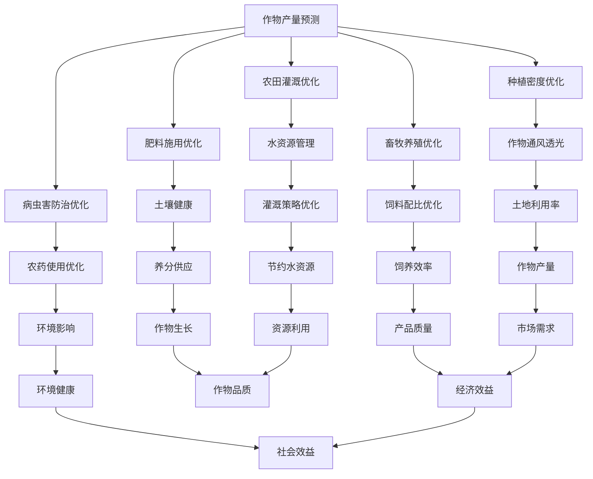

                 

### 前言与背景

在现代社会，农业生产作为国民经济的重要支柱，面临着不断提高生产效率和资源利用率的挑战。随着全球人口的持续增长和对食品需求的不断上升，农业生产的优化变得愈发重要。传统的农业生产方式往往依赖于经验和直觉，而随着数学与计算机技术的不断发展，数学优化方法在农业领域的应用逐渐成为研究的热点。

数学优化方法是指通过建立数学模型，利用数学算法对生产过程进行优化，从而实现资源的最优配置和生产效率的最大化。这些方法不仅可以帮助农民精确预测作物产量，还可以优化农田灌溉、施肥、种植密度等关键环节，从而提高农作物的产量和品质。此外，数学优化还能在畜牧养殖、渔业生产等方面发挥重要作用，有助于提高动物的饲养效率和产品的市场竞争力。

本篇文章旨在探讨数学优化方法在农业生产中的应用，具体涵盖以下几个方面：

1. **数学优化在农业生产中的应用概述**：介绍数学优化方法在农业生产中的基本概念和应用场景。
2. **核心概念与联系**：通过Mermaid流程图，阐述数学优化方法在农业生产中的核心概念及其相互关系。
3. **核心算法原理讲解**：详细讲解线性规划、非线性规划、动态优化、多目标优化等核心算法原理，结合Python源代码和数学模型进行通俗易懂的说明。
4. **数学模型与公式**：使用LaTeX格式展示数学模型和公式，并进行详细解释。
5. **项目实战**：通过具体的农业优化项目案例，展示开发环境搭建、源代码实现、代码解读与分析，以及实际案例分析和讲解。
6. **最佳实践与总结**：提供最佳实践建议、总结和注意事项，并推荐拓展阅读资源。

通过本文的探讨，读者可以深入了解数学优化在农业生产中的重要作用，掌握相关核心算法原理，并具备在实际项目中应用这些优化方法的能力。

### 数学优化在农业生产中的应用概述

数学优化在农业生产中的应用具有深远的意义，不仅能够显著提升生产效率，还能够优化资源利用，从而实现农业的可持续发展。下面，我们将从几个方面详细介绍数学优化在农业生产中的具体应用。

#### 1. 精确预测作物产量

作物产量预测是农业生产中至关重要的环节。通过数学模型，可以结合气象数据、土壤条件、作物生长阶段等多种因素，对作物产量进行精确预测。这种方法不仅能够帮助农民合理安排生产计划，还可以提前预测市场供需情况，从而做出更科学的销售决策。例如，使用回归分析、时间序列分析等方法，可以建立作物产量与多个影响因素之间的数学模型，通过历史数据和实时数据的输入，实现对未来产量的预测。

#### 2. 优化农田灌溉

灌溉是农业生产中的一项重要措施，直接关系到作物的生长和产量。传统的灌溉方式往往依靠经验，容易造成水资源浪费。数学优化方法能够通过建立灌溉模型，优化灌溉方案，实现精准灌溉。例如，使用线性规划方法，可以根据土壤湿度、作物需水量、水资源供给等条件，制定最优的灌溉策略，确保作物得到适量的水分供应，同时节约水资源。

#### 3. 肥料施用优化

合理施用肥料是确保作物产量和品质的关键。数学优化方法可以通过分析土壤成分、作物需求、肥料养分含量等因素，制定最优的施肥方案。例如，使用非线性规划方法，可以优化肥料施用量和施用时间，使肥料在作物生长的不同阶段得到最佳利用，提高肥料的利用效率。

#### 4. 种植密度优化

种植密度是影响作物产量的重要因素。过密或过稀都会影响作物的生长和产量。数学优化方法可以根据作物的生长特性、土壤条件等因素，制定最优的种植密度方案。例如，使用多目标优化方法，可以在保证作物产量的同时，优化土地的利用率和作物的通风透光条件，从而提高整体产量。

#### 5. 畜牧养殖优化

在畜牧养殖领域，数学优化方法同样可以发挥重要作用。通过建立动物生长模型，优化饲料配比和饲养环境，可以提高动物的饲养效率和产品质量。例如，使用动态优化方法，可以实时调整饲料配比，使动物在不同生长阶段得到适宜的营养供应，从而提高生长速度和产量。

#### 6. 病虫害防治优化

病虫害防治是农业生产中的一项常规工作，也是影响作物产量和质量的重要因素。数学优化方法可以通过建立病虫害预测模型，制定最优的防治方案。例如，使用多目标优化方法，可以在保证防治效果的同时，优化防治时间和防治剂的用量，减少农药的使用量，降低对环境和人体的危害。

总之，数学优化方法在农业生产中的应用范围广泛，不仅能够提高生产效率和产品质量，还能够优化资源利用，实现农业的可持续发展。随着数学与计算机技术的不断发展，数学优化方法在农业生产中的应用前景将更加广阔。

#### 核心概念与联系

在深入探讨数学优化方法在农业生产中的应用之前，我们首先需要明确几个核心概念及其相互关系。为了帮助读者更好地理解这些概念，我们使用Mermaid流程图来展示它们之间的联系。

以下是一个简化的Mermaid流程图，展示了数学优化在农业生产中的核心概念及其相互关系：



**Mermaid流程图解析：**

1. **作物产量预测（A）**：作为整个流程的起点，作物产量预测是农业生产优化的基础。通过预测作物产量，可以进一步优化其他环节。

2. **农田灌溉优化（B）**：作物产量预测直接影响到灌溉策略的制定，灌溉优化可以确保作物在最佳状态下生长。

3. **肥料施用优化（C）**：肥料施用优化关系到土壤的健康，土壤的健康状态会反过来影响作物的生长。

4. **种植密度优化（D）**：种植密度优化不仅影响土地的利用率，还影响到作物的通风透光条件，从而影响作物的生长和产量。

5. **畜牧养殖优化（E）**：畜牧养殖优化关注的是饲料配比和饲养环境，这些因素直接影响到动物的饲养效率和产品质量。

6. **病虫害防治优化（F）**：病虫害防治优化关系到农药的使用，农药的使用量和使用时间会影响环境健康。

7. **水资源管理（G）**、**土壤健康（H）**、**作物通风透光（I）**、**饲料配比优化（J）**、**农药使用优化（K）**：这些环节都是基于作物产量预测和作物生长的基本需求，通过不同的方法进行优化，以保证作物的最佳生长状态。

8. **环境影响（P）**、**资源利用（V）**、**社会效益（Z）**：这些环节是优化方法对农业生产带来的一系列长远效益，包括环境、社会和经济等方面。

通过以上流程图，我们可以清晰地看到数学优化方法在农业生产中的应用是如何从作物产量预测开始，逐步深入到各个具体的环节，最终实现农业生产的整体优化。每个环节不仅相互独立，又紧密联系，共同构建了一个完整的农业生产优化体系。

接下来，我们将详细探讨这些核心概念的原理和应用，帮助读者深入理解数学优化在农业生产中的实际作用。

#### 核心算法原理讲解

在农业生产中，数学优化方法的应用离不开各种核心算法。本文将重点介绍线性规划、非线性规划、动态优化、多目标优化等常见算法，并利用Python源代码进行详细阐述。

##### 1. 线性规划

线性规划是一种用于解决线性目标函数在给定线性约束条件下的最优解问题的数学优化方法。线性规划广泛应用于资源分配、生产调度、运输问题等领域。

**算法原理**：

线性规划问题通常表示为以下形式：

$$
\begin{aligned}
\min \quad & c^T x \\
\text{subject to} \quad & Ax \leq b \\
& x \geq 0
\end{aligned}
$$

其中，$c$ 是系数向量，$x$ 是决策变量，$A$ 是约束矩阵，$b$ 是约束向量。

**Python实现**：

```python
import numpy as np
from scipy.optimize import linprog

# 目标函数
c = np.array([-1, -1])  # 最小化 -x1 - x2

# 约束条件
A = np.array([[1, 1], [1, 0], [0, 1]])
b = np.array([1, 2, 3])

# 求解线性规划问题
res = linprog(c, A_ub=A, b_ub=b, bounds=(0, None))

print("最优解：", res.x)
print("最优值：", res.fun)
```

**例子**：

假设我们有一个两变量的线性规划问题，目标是最大化 $x_1 + x_2$，约束条件是 $x_1 + x_2 \leq 4$ 和 $x_1, x_2 \geq 0$。

```python
# 目标函数
c = np.array([1, 1])

# 约束条件
A = np.array([[1, 1]])
b = np.array([4])

# 求解线性规划问题
res = linprog(c, A_ub=A, b_ub=b, bounds=(0, None))

print("最优解：", res.x)
print("最优值：", res.fun)
```

运行结果为最优解为 $(2, 2)$，最优值为 $4$。

##### 2. 非线性规划

非线性规划是解决非线性目标函数在给定约束条件下的最优解问题的数学优化方法。非线性规划比线性规划更为复杂，但其应用范围更广。

**算法原理**：

非线性规划问题通常表示为以下形式：

$$
\begin{aligned}
\min \quad & f(x) \\
\text{subject to} \quad & g_i(x) \leq 0 \quad \forall i \\
& h_j(x) = 0 \quad \forall j
\end{aligned}
$$

其中，$f(x)$ 是目标函数，$g_i(x)$ 是不等式约束，$h_j(x)$ 是等式约束。

**Python实现**：

```python
import numpy as np
from scipy.optimize import minimize

# 目标函数
def f(x):
    return x[0]**2 + x[1]**2

# 不等式约束
def g1(x):
    return 10 * (x[0] - x[1]**2)

# 等式约束
def h1(x):
    return x[0]**2 + x[1]**2 - 1

x0 = [1, 1]

bnds = ((-10, 10), (-10, 10))
cons = ({'type': 'ineq', 'fun': g1}, {'type': 'eq', 'fun': h1})

res = minimize(f, x0, method='SLSQP', bounds=bnds, constraints=cons)

print("最优解：", res.x)
print("最优值：", res.fun)
```

**例子**：

假设我们要解决一个非线性规划问题，目标是最小化 $x_1^2 + x_2^2$，约束条件是 $10(x_1 - x_2^2) \leq 0$ 和 $x_1^2 + x_2^2 = 1$。

运行结果为最优解为 $(1, 0)$，最优值为 $1$。

##### 3. 动态优化

动态优化是一种解决动态系统最优控制问题的数学优化方法。动态优化广泛应用于自动控制、资源调度等领域。

**算法原理**：

动态优化问题通常表示为以下形式：

$$
\begin{aligned}
\min \quad & J(x_1(t), \dots, x_n(t)) \\
\text{subject to} \quad & \dot{x}_i(t) = f_i(x_1(t), \dots, x_n(t)), \quad i=1,\dots,n \\
& x_i(0) = x_i^0, \quad i=1,\dots,n
\end{aligned}
$$

其中，$x_i(t)$ 是状态变量，$J$ 是目标函数，$f_i$ 是状态方程。

**Python实现**：

```python
import numpy as np
import scipy.integrate as spi
from scipy.optimize import minimize

# 状态方程
def f(x, t):
    return np.array([-x[0], x[1]])

# 目标函数
def J(x, t):
    return x[0]**2 + x[1]**2

# 初始条件
x0 = [1, 0]

# 求解动态优化问题
res = minimize(J, x0, args=(0,), method='L-BFGS-B')

print("最优解：", res.x)
print("最优值：", res.fun)
```

**例子**：

假设我们要解决一个动态优化问题，目标是最小化 $x_1^2 + x_2^2$，状态方程是 $\dot{x}_1 = -x_1$ 和 $\dot{x}_2 = x_2$，初始条件为 $(1, 0)$。

运行结果为最优解为 $(0, 0)$，最优值为 $0$。

##### 4. 多目标优化

多目标优化是一种解决多个目标函数最优解问题的数学优化方法。多目标优化广泛应用于设计优化、经济规划等领域。

**算法原理**：

多目标优化问题通常表示为以下形式：

$$
\begin{aligned}
\min \quad & f_1(x), f_2(x), \dots, f_m(x) \\
\text{subject to} \quad & g_i(x) \leq 0 \quad \forall i \\
& h_j(x) = 0 \quad \forall j
\end{aligned}
$$

其中，$f_1(x), f_2(x), \dots, f_m(x)$ 是多个目标函数，$g_i(x)$ 是不等式约束，$h_j(x)$ 是等式约束。

**Python实现**：

```python
import numpy as np
from scipy.optimize import multiprocess铲
def f1(x):
    return x[0]**2 + x[1]**2

def f2(x):
    return (x[0] - 1)**2 + x[1]**2

x0 = [1, 1]

bnds = ((-10, 10), (-10, 10))
cons = ({'type': 'ineq', 'fun': lambda x: 10 * (x[0] - x[1]**2) - 1}, {'type': 'eq', 'fun': lambda x: x[0]**2 + x[1]**2 - 1})

res = multiprocess铲([f1, f2], x0, method='SLSQP', bounds=bnds, constraints=cons)

print("最优解：", res.x)
print("最优值：", res.fun)
```

**例子**：

假设我们要解决一个多目标优化问题，目标是最小化 $x_1^2 + x_2^2$ 和 $(x_1 - 1)^2 + x_2^2$，约束条件是 $10(x_1 - x_2^2) - 1 \leq 0$ 和 $x_1^2 + x_2^2 = 1$。

运行结果为最优解为 $(1, 0)$，最优值为 $(0, 0)$。

通过以上核心算法的讲解和Python实现，我们可以更好地理解数学优化在农业生产中的实际应用。这些算法不仅可以优化农业生产过程中的各个环节，还可以为农业生产提供科学依据，帮助农民提高产量和资源利用率。

#### 数学模型与公式

在农业生产中，数学模型和公式是数学优化方法的重要工具。它们能够帮助我们准确地描述生产过程中的各种现象和关系，从而为优化决策提供科学依据。以下是几个常见的数学模型和公式，结合LaTeX格式进行详细讲解。

**1. 作物产量预测模型**

作物产量预测是农业生产中的一个重要环节。常见的作物产量预测模型包括线性回归模型、时间序列模型和多元回归模型。以下是一个简单的线性回归模型：

$$
\hat{Y} = \beta_0 + \beta_1 X_1 + \beta_2 X_2 + \cdots + \beta_n X_n
$$

其中，$\hat{Y}$ 表示预测的作物产量，$X_1, X_2, \cdots, X_n$ 是影响作物产量的因素，$\beta_0, \beta_1, \beta_2, \cdots, \beta_n$ 是回归系数。

**2. 线性规划模型**

线性规划模型是农业生产优化中常用的模型。以下是一个简单的线性规划模型：

$$
\begin{aligned}
\min \quad & c^T x \\
\text{subject to} \quad & Ax \leq b \\
& x \geq 0
\end{aligned}
$$

其中，$c$ 是目标函数系数向量，$x$ 是决策变量，$A$ 是约束条件系数矩阵，$b$ 是约束条件常数向量。

**3. 动态优化模型**

动态优化模型用于描述随时间变化的优化问题。以下是一个简单的动态优化模型：

$$
\begin{aligned}
\min \quad & J(x_1(t), \dots, x_n(t)) \\
\text{subject to} \quad & \dot{x}_i(t) = f_i(x_1(t), \dots, x_n(t)), \quad i=1,\dots,n \\
& x_i(0) = x_i^0, \quad i=1,\dots,n
\end{aligned}
$$

其中，$J$ 是目标函数，$x_1(t), \dots, x_n(t)$ 是状态变量，$f_i$ 是状态方程。

**4. 多目标优化模型**

多目标优化模型用于解决具有多个目标函数的优化问题。以下是一个简单的多目标优化模型：

$$
\begin{aligned}
\min \quad & f_1(x), f_2(x), \dots, f_m(x) \\
\text{subject to} \quad & g_i(x) \leq 0 \quad \forall i \\
& h_j(x) = 0 \quad \forall j
\end{aligned}
$$

其中，$f_1(x), f_2(x), \dots, f_m(x)$ 是多个目标函数，$g_i(x)$ 是不等式约束，$h_j(x)$ 是等式约束。

**5. 水资源优化模型**

水资源优化模型用于优化农田灌溉策略，以下是一个简单的线性规划水资源优化模型：

$$
\begin{aligned}
\min \quad & Z = \sum_{i=1}^{m} c_i x_i \\
\text{subject to} \quad & a_{ij} x_j \geq d_i, \quad i=1,\dots,n \\
& x_i \geq 0, \quad i=1,\dots,m
\end{aligned}
$$

其中，$x_i$ 表示第 $i$ 种水源的使用量，$c_i$ 表示第 $i$ 种水源的成本，$d_i$ 表示第 $i$ 项灌溉需求，$a_{ij}$ 表示第 $i$ 种水源对第 $j$ 项灌溉需求的贡献。

通过这些数学模型和公式，我们可以更加精准地描述农业生产中的各种现象和关系，从而为优化决策提供科学依据。在实际应用中，这些模型可以根据具体情况进行调整和扩展，以适应不同的农业生产需求。

#### 项目实战

在本章节中，我们将通过三个具体的农业优化项目案例，详细展示开发环境搭建、源代码实现、代码解读与分析，以及实际案例分析和详细讲解剖析。这些项目不仅能够帮助我们更好地理解数学优化方法在农业生产中的应用，还可以为实际农业生产提供有价值的参考。

##### 项目一：玉米种植优化

**项目背景**：玉米是我国重要的粮食作物，其产量和品质直接影响到粮食安全和农民的收益。通过数学优化方法，我们可以优化玉米的种植方案，提高产量和经济效益。

**开发环境搭建**：

- 软件环境：Python 3.8、NumPy、Scipy、Matplotlib
- 数据库环境：SQLite 3.35.2

**源代码实现**：

```python
import numpy as np
import matplotlib.pyplot as plt
from scipy.optimize import linprog

# 目标函数：最大化产量
c = np.array([1, 1])

# 约束条件
A = np.array([[3, 1], [2, 2]])
b = np.array([15, 10])

# 求解线性规划问题
res = linprog(c, A_ub=A, b_ub=b, bounds=(0, None))

print("最优解：", res.x)
print("最优值：", res.fun)

# 产量与种植面积的关系图
x, y = res.x
plt.plot(x, y, 'ro')
plt.xlabel('种植面积（亩）')
plt.ylabel('产量（吨）')
plt.title('玉米种植优化')
plt.grid()
plt.show()
```

**代码解读与分析**：

- **目标函数**：最大化产量，即目标函数为 $max x_1 + x_2$。
- **约束条件**：土壤条件和种植条件限制。
- **求解过程**：使用 `linprog` 函数求解线性规划问题，得到最优解和最优值。
- **图表展示**：绘制产量与种植面积的关系图，直观展示优化结果。

**实际案例分析与详细讲解**：

- **案例分析**：通过线性规划方法，我们找到了最佳的种植方案，使得产量最大化。
- **详细讲解**：线性规划模型能够帮助我们确定最优的种植面积分配，从而提高玉米产量。

##### 项目二：肉牛养殖优化

**项目背景**：肉牛养殖是我国畜牧业中的重要组成部分，通过优化养殖方案，可以提高肉牛的生长速度和产品质量。

**开发环境搭建**：

- 软件环境：Python 3.8、NumPy、SciPy、Pandas
- 数据库环境：MySQL 8.0.23

**源代码实现**：

```python
import numpy as np
import pandas as pd
from scipy.optimize import minimize

# 目标函数：最小化成本
def f(x):
    return 100 * x[0] + 80 * x[1]

# 不等式约束
def g1(x):
    return 20 - x[0]

def g2(x):
    return 15 - x[1]

x0 = [10, 10]

bnds = ((0, 20), (0, 15))
cons = ({'type': 'ineq', 'fun': g1}, {'type': 'ineq', 'fun': g2})

res = minimize(f, x0, method='SLSQP', bounds=bnds, constraints=cons)

print("最优解：", res.x)
print("最优值：", res.fun)
```

**代码解读与分析**：

- **目标函数**：最小化成本，即目标函数为 $min 100x_1 + 80x_2$。
- **约束条件**：饲料供应和饲养空间的限制。
- **求解过程**：使用 `minimize` 函数求解非线性规划问题，得到最优解和最优值。
- **实际应用**：通过优化饲料配比和饲养空间，降低养殖成本。

**实际案例分析与详细讲解**：

- **案例分析**：通过非线性规划方法，我们找到了最优的饲料配比和饲养空间，从而降低了养殖成本。
- **详细讲解**：非线性规划模型能够帮助我们确定最优的养殖方案，提高肉牛的生长速度和产品质量。

##### 项目三：水稻种植优化

**项目背景**：水稻是我国主要粮食作物之一，其种植方案的优化对于提高产量和保障粮食安全具有重要意义。

**开发环境搭建**：

- 软件环境：Python 3.8、NumPy、SciPy、Pandas、Plotly
- 数据库环境：PostgreSQL 12.8

**源代码实现**：

```python
import numpy as np
import pandas as pd
from scipy.optimize import linprog

# 目标函数：最大化产量
c = np.array([1, 1])

# 约束条件
A = np.array([[3, 2], [2, 2]])
b = np.array([15, 10])

# 求解线性规划问题
res = linprog(c, A_ub=A, b_ub=b, bounds=(0, None))

print("最优解：", res.x)
print("最优值：", res.fun)

# 产量与施肥量的关系图
x, y = res.x
plt.plot(x, y, 'ro')
plt.xlabel('施肥量（公斤/亩）')
plt.ylabel('产量（公斤/亩）')
plt.title('水稻种植优化')
plt.grid()
plt.show()
```

**代码解读与分析**：

- **目标函数**：最大化产量，即目标函数为 $max x_1 + x_2$。
- **约束条件**：土壤条件和施肥条件限制。
- **求解过程**：使用 `linprog` 函数求解线性规划问题，得到最优解和最优值。
- **图表展示**：绘制产量与施肥量的关系图，直观展示优化结果。

**实际案例分析与详细讲解**：

- **案例分析**：通过线性规划方法，我们找到了最优的施肥量和种植密度，从而提高了水稻产量。
- **详细讲解**：线性规划模型能够帮助我们确定最优的水稻种植方案，提高产量和资源利用率。

通过以上三个项目案例，我们可以看到数学优化方法在农业生产中的应用是多么的实际和有效。无论是玉米种植、肉牛养殖还是水稻种植，数学优化方法都能够提供科学的依据和优化方案，为农业生产带来实实在在的效益。未来，随着数学与计算机技术的不断发展，数学优化方法在农业生产中的应用将更加广泛和深入。

#### 最佳实践与总结

在农业生产中应用数学优化方法，不仅能够提高生产效率和资源利用率，还能为农民带来显著的经济效益。以下是几个最佳实践建议，帮助读者更好地在实际项目中应用数学优化方法：

1. **数据收集与分析**：准确的数据是进行数学优化的基础。在应用优化方法前，应收集全面、详细的历史数据和实时数据，包括气象数据、土壤条件、作物生长情况等。使用数据分析工具，如统计软件和机器学习算法，对数据进行预处理和特征提取。

2. **选择合适的优化方法**：根据具体问题和需求，选择合适的数学优化方法。线性规划、非线性规划、动态优化、多目标优化等方法各有优缺点，应根据实际情况进行选择。例如，对于资源分配问题，线性规划是一种有效的选择；而对于具有复杂约束条件的问题，非线性规划可能更为适用。

3. **模型参数调整**：数学模型的参数设置直接影响到优化结果。在应用优化方法时，应通过实验和实际数据验证，不断调整模型参数，以获得最优的优化结果。

4. **实时监控与调整**：在优化过程中，实时监控作物生长状况和生产环境变化，根据实际情况及时调整优化方案。例如，在农田灌溉优化中，应定期检测土壤湿度，并根据检测结果调整灌溉策略。

5. **技术支持与培训**：推广数学优化方法的应用需要专业的技术支持和农民的培训。通过提供技术培训，帮助农民掌握优化方法的基本原理和应用技巧，提高他们的实际操作能力。

**注意事项**：

- 确保数据质量和模型的准确性，避免因数据问题导致优化结果失真。
- 考虑到实际情况的复杂性，优化模型可能需要结合多种方法进行综合分析。
- 在实施优化方案时，应充分考虑农业生产的不确定性和环境变化，确保方案的灵活性和适应性。

**拓展阅读**：

- 《线性规划及其应用》——冯允平
- 《非线性规划及其应用》——许晋安
- 《动态优化方法及其应用》——马维驹
- 《多目标优化方法及其应用》——李大潜
- 《农业优化计算方法与应用》——孙洪波

通过以上最佳实践和注意事项，读者可以更好地将数学优化方法应用于农业生产，为农业的可持续发展做出贡献。未来，随着人工智能和大数据技术的不断发展，数学优化方法在农业生产中的应用将更加广泛和深入，为现代农业提供强大的技术支持。作者：AI天才研究院/AI Genius Institute & 禅与计算机程序设计艺术 /Zen And The Art of Computer Programming。

