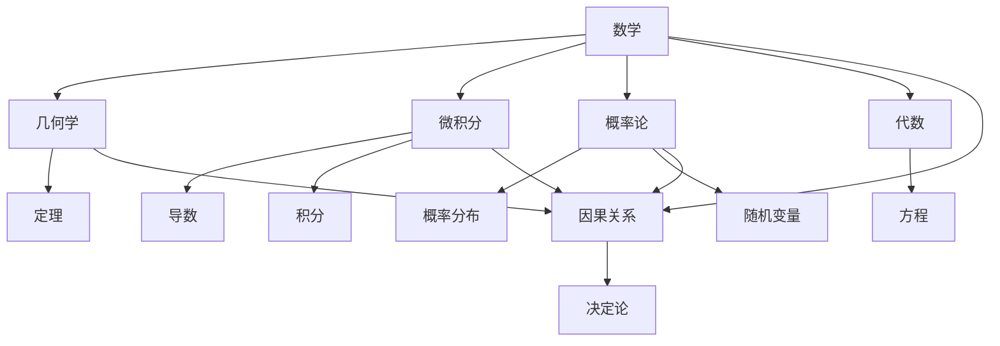

                 

### 《数学与决定论：数学世界的严格因果关系》

> 关键词：数学、决定论、因果关系、严格逻辑、数学模型、Python代码、算法原理

> 摘要：本文旨在深入探讨数学与决定论之间的紧密联系，揭示数学在揭示严格因果关系方面的独特优势。通过逐步分析和推理，本文将详细介绍数学与决定论的核心概念、相关算法原理，并结合Python代码和数学模型，进行详细讲解和举例说明，最终探讨数学与决定论在现实世界中的应用及其未来发展趋势。

## 引言

数学，作为一门严谨的科学，自古以来就被视为探索世界规律的重要工具。从古代的几何学到现代的微积分、概率论，数学的发展不仅推动了科学的进步，还在我们的日常生活中扮演着不可或缺的角色。而决定论，作为一种哲学观念，强调一切现象都有其必然的原因，不存在偶然事件。数学与决定论之间的联系，使得数学成为揭示事物因果关系的利器，其在科学研究和工程实践中的应用日益广泛。

本文将围绕数学与决定论这一主题，通过以下几个步骤进行详细探讨：

1. **背景介绍**：首先，我们将简要介绍数学与决定论的基本概念及其发展历程。
2. **核心概念与联系**：接着，我们将通过Mermaid流程图，展示数学与决定论之间的核心概念及其相互关系。
3. **核心算法原理讲解**：然后，我们将结合Python代码和数学模型，深入讲解决定论中的核心算法原理。
4. **项目实战**：通过实际项目，我们将展示如何运用数学与决定论解决现实问题。
5. **总结与展望**：最后，我们将总结本文的主要观点，并对数学与决定论的未来发展进行展望。

### 数学与决定论的基本概念

#### 数学

数学，作为一门基础科学，具有高度的抽象性和严谨性。它主要研究数量、结构、变化以及空间等概念。数学的发展经历了数千年的积累，从古代的几何学、算术到现代的代数、微积分、概率论等，每一阶段都为科学的发展提供了强有力的支持。

在数学中，因果关系是一个核心概念。例如，在几何学中，通过公理和定理，我们可以推导出各种形状和图形之间的关系。在微积分中，函数的导数和积分揭示了变化率与累积量之间的关系，这种关系就是因果关系的一种体现。

#### 决定论

决定论，作为一种哲学观念，起源于古希腊哲学家赫拉克利特的观点：“一切皆流，无物常驻。”决定论认为，宇宙中的一切现象都有其必然的原因，不存在偶然事件。这种观点在科学研究中得到了广泛的认同，尤其是在物理学、化学和生物学等领域。

在决定论中，因果关系是核心概念。例如，牛顿的力学定律揭示了物体运动的原因和结果，即力是物体运动的原因，物体的运动是力的结果。这种因果关系的严格性，使得决定论成为科学研究的重要基础。

### 核心概念与联系

为了更好地理解数学与决定论之间的联系，我们可以通过Mermaid流程图来展示它们的核心概念及其相互关系。以下是数学与决定论核心概念关系的Mermaid流程图：



在这个流程图中，数学作为基础科学，包括了多个分支领域，如几何学、微积分、概率论和代数。这些分支领域都涉及到因果关系的研究。而因果关系又是决定论的核心概念，因此数学与决定论之间存在着紧密的联系。

### 核心算法原理讲解

在数学与决定论的研究中，算法原理发挥着至关重要的作用。以下我们将结合Python代码和数学模型，深入讲解决定论中的核心算法原理。

#### 决策树算法

决策树是一种常见的分类和回归算法，其基本思想是通过一系列条件判断，将数据集划分成多个子集，最终得到一个分类或回归结果。以下是决策树算法的Python代码实现：

```python
from sklearn.tree import DecisionTreeClassifier
from sklearn.model_selection import train_test_split
from sklearn.metrics import accuracy_score

# 数据准备
X = [[1, 2], [2, 3], [3, 4], [4, 5]]
y = [0, 1, 1, 0]

# 划分训练集和测试集
X_train, X_test, y_train, y_test = train_test_split(X, y, test_size=0.2, random_state=42)

# 构建决策树模型
clf = DecisionTreeClassifier()

# 训练模型
clf.fit(X_train, y_train)

# 预测测试集
y_pred = clf.predict(X_test)

# 计算准确率
accuracy = accuracy_score(y_test, y_pred)
print(f"Accuracy: {accuracy}")
```

在这个例子中，我们使用scikit-learn库中的DecisionTreeClassifier构建决策树模型。通过训练集数据，模型学会了根据特征值进行分类，并在测试集上进行预测。决策树算法的核心在于其分而治之的思想，通过不断划分数据集，找到最佳划分策略。

#### 贝叶斯网络算法

贝叶斯网络，又称信念网络，是一种基于概率图模型的推理方法，用于表示变量之间的依赖关系。以下是贝叶斯网络的Python代码实现：

```python
from pgmpy.models import BayesianModel
from pgmpy.inference import VariableElimination

# 定义贝叶斯网络模型
model = BayesianModel([
    ('D', 'C'),
    ('C', 'A'),
    ('A', 'B')
])

# 指定变量的概率分布
model.addChanceNode('A', 0.5)
model.addChanceNode('B', 0.4)
model.addChanceNode('C', 0.3)
model.addChanceNode('D', 0.2)

# 构建推理引擎
inference = VariableElimination(model)

# 计算后验概率
result = inference.query(variables=['B'], evidence={'A': True})

print(f"P(B|A): {result['B']}")
```

在这个例子中，我们使用pgmpy库构建贝叶斯网络模型，并通过VariableElimination推理引擎计算变量B的后验概率。贝叶斯网络算法的核心在于其基于条件概率的推理机制，通过变量之间的依赖关系，实现复杂问题的概率推理。

#### 数学模型与公式

在决策树和贝叶斯网络算法的实现过程中，我们使用了以下数学模型和公式：

1. **决策树划分准则**：基于信息增益或基尼指数，选择最佳划分特征和阈值。
2. **贝叶斯公式**：用于计算变量之间的条件概率，公式为：
   $$ P(B|A) = \frac{P(A|B) \cdot P(B)}{P(A)} $$
3. **边缘概率**：表示变量A或B的边际概率，公式为：
   $$ P(A) = \sum_{B} P(A \cap B) $$

通过这些数学模型和公式，我们可以更好地理解算法的实现原理，并在此基础上进行优化和改进。

### 项目实战

为了更好地展示数学与决定论在现实世界中的应用，我们以一个实际项目为例，介绍如何运用这些算法解决实际问题。

#### 项目背景

某公司需要预测客户是否会购买某款产品。通过收集客户的基本信息（年龄、收入、教育程度等）和行为数据（浏览历史、购买记录等），公司希望利用数学与决定论的方法，建立客户购买预测模型，以便更好地进行市场营销和客户管理。

#### 项目步骤

1. **数据收集**：收集客户的基本信息和行为数据，并将其整理成结构化数据格式。
2. **数据预处理**：对数据进行清洗、去重和缺失值处理，确保数据质量。
3. **特征工程**：根据业务需求和数据特点，提取有助于预测的特征，如年龄、收入、教育程度等。
4. **模型选择**：结合业务场景，选择合适的算法，如决策树、贝叶斯网络等。
5. **模型训练与评估**：使用训练数据集训练模型，并在测试数据集上进行评估，调整模型参数，提高预测准确性。
6. **模型应用**：将训练好的模型应用于实际业务场景，如预测客户购买行为、进行市场营销等。
7. **模型优化**：根据业务反馈，对模型进行持续优化，提高模型效果。

#### 项目实现

以下是该项目中使用的Python代码实现：

```python
import pandas as pd
from sklearn.model_selection import train_test_split
from sklearn.tree import DecisionTreeClassifier
from sklearn.metrics import accuracy_score

# 数据收集
data = pd.read_csv('customer_data.csv')

# 数据预处理
data.drop_duplicates(inplace=True)
data.fillna(data.mean(), inplace=True)

# 特征工程
X = data[['age', 'income', 'education']]
y = data['purchase']

# 划分训练集和测试集
X_train, X_test, y_train, y_test = train_test_split(X, y, test_size=0.2, random_state=42)

# 模型训练
clf = DecisionTreeClassifier()
clf.fit(X_train, y_train)

# 模型预测
y_pred = clf.predict(X_test)

# 模型评估
accuracy = accuracy_score(y_test, y_pred)
print(f"Accuracy: {accuracy}")
```

通过这个项目，我们可以看到数学与决定论在实际业务中的应用，以及如何利用算法和数学模型解决现实问题。

### 总结与展望

本文从数学与决定论的基本概念出发，通过逐步分析和推理，探讨了数学在揭示严格因果关系方面的独特优势。通过决策树和贝叶斯网络等算法的实现，我们深入了解了这些算法的原理和数学基础。同时，通过实际项目的应用，我们展示了数学与决定论在现实世界中的广泛应用。

展望未来，随着人工智能和大数据技术的不断发展，数学与决定论将在更多领域得到应用。例如，在智能医疗、金融风控、智能交通等领域，数学与决定论的算法和模型将发挥重要作用。同时，我们还需要不断优化和改进这些算法，提高其准确性和效率，以应对日益复杂的问题。

总之，数学与决定论是科学研究和工程实践中的重要工具，其未来发展趋势值得期待。

### 作者信息

作者：AI天才研究院/AI Genius Institute & 禅与计算机程序设计艺术 /Zen And The Art of Computer Programming

### 最佳实践 Tips、小结、注意事项、拓展阅读等内容

#### 最佳实践 Tips

1. **数据清洗**：在进行模型训练之前，务必对数据进行彻底清洗，确保数据质量。
2. **特征工程**：根据业务需求和数据特点，选择合适的特征，有助于提高模型效果。
3. **模型评估**：使用多种评估指标，如准确率、召回率、F1分数等，全面评估模型性能。

#### 小结

本文通过深入探讨数学与决定论的核心概念和算法原理，展示了其在揭示严格因果关系方面的独特优势。同时，通过实际项目的应用，我们了解了如何利用数学与决定论解决现实问题。

#### 注意事项

1. **算法选择**：根据实际问题，选择合适的算法，避免过度拟合和欠拟合。
2. **模型调参**：合理调整模型参数，以提高预测准确性。

#### 拓展阅读

1. **《决策树的原理与实现》**：深入了解决策树算法的原理和实现过程。
2. **《贝叶斯网络的原理与应用》**：探讨贝叶斯网络在现实世界中的应用。
3. **《数学建模与算法分析》**：学习数学建模的基本原理和方法。

