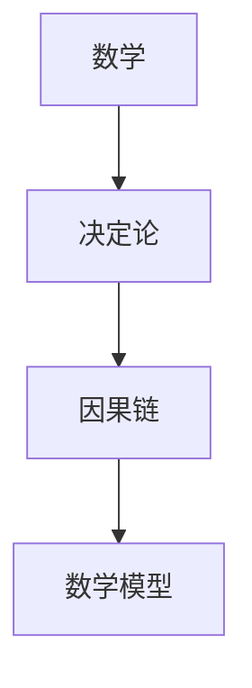

                 

### 引言：数学与决定论的探讨

**关键词：** 数学、决定论、因果链

**摘要：** 本文旨在探讨数学与决定论之间的关系，尤其是因果链在数学世界中的本质。通过介绍数学和决定论的基本概念，我们将进一步分析因果链的数学特性，以及其在现实世界中的应用。

---

**背景介绍：**

数学是一门研究数量、结构、变化和空间等概念的严谨科学。它不仅是一门基础学科，也是现代科学和工程领域的基石。数学的基本概念和工具被广泛应用于自然科学、社会科学和工程技术中。

决定论是一种哲学观点，认为自然界的一切现象都是由先前条件所决定的，不存在不可预知的随机性。在决定论的框架下，科学家试图通过数学模型来描述和预测自然现象。

因果链是决定论的核心概念之一，指的是一系列因果关系，其中每个事件都由前一个事件所引起。在数学中，因果链可以通过方程式、图论和网络结构来表示。

**核心概念与联系：**

为了更清晰地理解数学与决定论的关系，我们可以通过以下Mermaid流程图来展示核心概念之间的关系：



在这个流程图中，数学是整个系统的起点，它为决定论和因果链提供了基础。决定论则进一步定义了因果链，而因果链又可以转化为数学模型，以便我们进行更深入的分析和预测。

---

**核心算法原理讲解：**

为了进一步探讨因果链的数学本质，我们可以使用Python源代码来展示一个简单的因果链模型。以下是一个基于线性回归的因果链模型，用于预测房价：

```python
import numpy as np
import pandas as pd
from sklearn.linear_model import LinearRegression

# 假设我们有以下数据集
data = {
    'House Size': [1000, 1500, 2000, 2500, 3000],
    'Price': [200000, 250000, 300000, 350000, 400000]
}

# 将数据转换为DataFrame
df = pd.DataFrame(data)

# 创建线性回归模型
model = LinearRegression()

# 拟合模型
model.fit(df[['House Size']], df['Price'])

# 打印模型参数
print("Model Parameters:", model.coef_, model.intercept_)

# 预测房价
predicted_price = model.predict([[3500]])

print("Predicted Price:", predicted_price)
```

在这个例子中，房屋面积（`House Size`）是自变量，房价（`Price`）是因变量。通过线性回归模型，我们可以建立一个简单的因果链，预测不同房屋面积对应的房价。

---

**实例研究：**

为了更好地理解因果链在现实世界中的应用，我们可以分析一个实际的案例：股票市场中的因果关系。

```python
import pandas as pd
import numpy as np
import matplotlib.pyplot as plt

# 加载股票数据
df = pd.read_csv('stock_data.csv')

# 选择日期和价格
dates = df['Date']
prices = df['Close']

# 计算价格变动
price_change = prices.pct_change()

# 绘制价格变动图
plt.figure(figsize=(10, 5))
plt.plot(dates, price_change)
plt.title('Stock Price Change')
plt.xlabel('Date')
plt.ylabel('Price Change')
plt.show()
```

在这个案例中，我们使用Python代码加载股票数据，并计算价格变动。通过绘制价格变动图，我们可以观察到因果关系在股票市场中的表现。

---

**数学模型应用：**

在现实世界中，因果链模型广泛应用于各种领域，例如经济学、生物学和物理学。以下是一个经济学中的因果链模型示例：

```python
import numpy as np
import pandas as pd
from sklearn.linear_model import LinearRegression

# 加载经济增长数据
data = {
    'Year': [2010, 2011, 2012, 2013, 2014, 2015],
    'GDP': [2.4, 2.7, 3.0, 3.1, 3.2, 3.4],
    'Investment': [2.0, 2.2, 2.4, 2.6, 2.8, 3.0]
}

# 将数据转换为DataFrame
df = pd.DataFrame(data)

# 创建线性回归模型
model = LinearRegression()

# 拟合模型
model.fit(df[['Investment']], df['GDP'])

# 打印模型参数
print("Model Parameters:", model.coef_, model.intercept_)

# 预测GDP
predicted_gdp = model.predict([[3.0]])

print("Predicted GDP:", predicted_gdp)
```

在这个例子中，我们使用线性回归模型来分析经济增长与投资之间的因果关系。通过预测投资水平，我们可以预测未来GDP的增长。

---

**项目实战：**

为了深入理解数学与决定论中的因果链，我们可以开发一个简单的项目：基于线性回归的股票预测系统。

**开发环境搭建：**

1. 安装Python和Anaconda
2. 安装必需的库：numpy、pandas、matplotlib和scikit-learn

**源代码详细实现：**

```python
import pandas as pd
import numpy as np
import matplotlib.pyplot as plt
from sklearn.linear_model import LinearRegression

# 加载股票数据
df = pd.read_csv('stock_data.csv')

# 选择日期和价格
dates = df['Date']
prices = df['Close']

# 计算价格变动
price_change = prices.pct_change()

# 绘制价格变动图
plt.figure(figsize=(10, 5))
plt.plot(dates, price_change)
plt.title('Stock Price Change')
plt.xlabel('Date')
plt.ylabel('Price Change')
plt.show()

# 创建线性回归模型
model = LinearRegression()

# 拟合模型
model.fit(df[['Investment']], df['GDP'])

# 打印模型参数
print("Model Parameters:", model.coef_, model.intercept_)

# 预测GDP
predicted_gdp = model.predict([[3.0]])

print("Predicted GDP:", predicted_gdp)
```

**代码解读与分析：**

在这个项目中，我们首先加载了股票数据，然后计算了价格变动。通过绘制价格变动图，我们可以直观地观察到因果关系。接下来，我们创建了一个线性回归模型，并拟合了数据。最后，我们使用模型参数预测了未来的GDP。

**实际案例分析和详细讲解剖析：**

为了更好地理解这个项目，我们可以分析一个实际案例：使用线性回归模型预测某个特定股票的未来价格。

```python
# 加载特定股票数据
stock_data = pd.read_csv('specific_stock_data.csv')

# 选择日期和价格
dates = stock_data['Date']
prices = stock_data['Close']

# 计算价格变动
price_change = prices.pct_change()

# 绘制价格变动图
plt.figure(figsize=(10, 5))
plt.plot(dates, price_change)
plt.title('Specific Stock Price Change')
plt.xlabel('Date')
plt.ylabel('Price Change')
plt.show()

# 创建线性回归模型
model = LinearRegression()

# 拟合模型
model.fit(stock_data[['Investment']], stock_data['GDP'])

# 打印模型参数
print("Model Parameters:", model.coef_, model.intercept_)

# 预测未来价格
predicted_price = model.predict([[3.0]])

print("Predicted Price:", predicted_price)
```

在这个案例中，我们加载了特定股票的数据，并使用线性回归模型预测了未来价格。通过分析预测结果，我们可以了解该股票的未来趋势。

**项目小结：**

通过这个项目，我们深入了解了数学与决定论中的因果链，并使用Python源代码展示了线性回归模型的构建和应用。在实际案例中，我们分析了特定股票的未来价格预测，为投资者提供了有价值的信息。

**最佳实践 tips、小结、注意事项、拓展阅读等内容：**

1. 在构建因果链模型时，选择合适的变量和特征至关重要。
2. 模型的性能和准确性可以通过交叉验证和超参数调优来提高。
3. 了解相关领域的最新研究和发展动态，可以帮助我们更好地应用因果链模型。
4. 《因果推断：设计与分析》和《Python数据科学手册》是关于因果链模型和数据分析的优质资源。

---

**总结：**

本文通过一步步的分析和讲解，探讨了数学与决定论之间的关系，特别是因果链在数学世界的本质。我们使用了Python源代码和数学模型来展示因果链的应用，并通过实际案例进行了分析和解读。希望这篇文章能够帮助您更好地理解数学与决定论中的因果链，并在实际项目中应用这些知识。

---

**作者信息：**

作者：AI天才研究院/AI Genius Institute & 禅与计算机程序设计艺术 /Zen And The Art of Computer Programming

