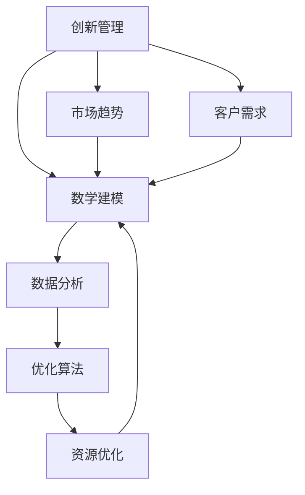

                 

### 背景介绍

在现代商业环境中，创新管理已成为企业竞争的关键因素。创新不仅仅是产品的开发，更是涵盖了整个企业的战略、组织和文化。创新管理涉及到从概念到市场化的整个创新过程，包括市场调研、资源分配、风险评估等多个环节。为了提高创新管理的效率，企业需要一种系统化、科学化的方法来指导创新活动。

数学作为一种精确的语言，提供了许多工具和方法，可以用于分析和解决复杂问题。在创新管理中，数学建模被广泛应用于创新过程的各个阶段，从需求的识别到解决方案的优化，再到最终的市场投放。数学建模不仅能够帮助企业更好地理解问题，还能够提供量化的决策支持，从而提高创新的效率和成功率。

本篇文章将深入探讨数学与创新管理的结合，通过数学建模的方法，解析创新过程中的关键问题和挑战。文章将分为以下几个部分：

1. **数学基础**：介绍数学在创新管理中的应用，以及常用的数学工具和概念。
2. **创新管理原理**：解释创新管理的概念、流程和关键要素。
3. **数学建模方法**：讲解数学建模的基本步骤和工具。
4. **案例分析**：通过具体案例，展示数学建模在创新管理中的应用。
5. **实际应用与案例解析**：深入分析实际案例，探讨数学建模如何影响创新管理。
6. **未来展望与趋势**：探讨数学与创新管理的未来发展趋势。

通过以上结构的梳理，我们将系统地阐述数学在创新管理中的重要性，并提供实用的方法和案例，帮助企业和创新者更好地利用数学工具，提升创新管理水平。

## 核心概念与联系

在探讨数学与创新管理的结合时，首先需要明确一些核心概念，并理解它们之间的相互关系。以下是本文将涉及的关键概念及其在创新管理中的应用：

### 创新管理
创新管理是指企业通过系统化的方法来管理和促进创新活动，包括从创意的产生到产品或服务的市场化。创新管理不仅关注技术的进步，还涵盖了市场趋势、客户需求以及资源优化等多个方面。

### 数学建模
数学建模是将实际问题转化为数学形式的过程，通过建立数学模型来描述系统的行为，从而为决策提供支持。在创新管理中，数学建模可以帮助识别潜在的风险和机会，评估创新的可行性和影响。

### 数据分析
数据分析是利用统计和数学方法对数据进行分析，以发现数据背后的模式和规律。在创新管理中，数据分析可以用于市场调研、客户行为分析以及创新效果评估。

### 优化算法
优化算法是一类用于求解最优化问题的数学方法，可以帮助企业找到最优的解决方案。在创新管理中，优化算法可以用于资源分配、成本控制和风险管理等方面。

### 关联图

为了更好地理解这些核心概念之间的联系，我们可以使用Mermaid语法绘制一个简单的流程图：



### 图解

- **创新管理**（A）：作为整个流程的起点，创新管理涵盖了从创意到市场化的全过程。
- **数学建模**（B）：将创新管理中的问题转化为数学模型，提供决策支持。
- **数据分析**（C）：对数据进行处理和分析，为数学建模提供数据支撑。
- **优化算法**（D）：用于求解数学模型中的最优化问题，帮助找到最优解。
- **市场趋势**（E）和**客户需求**（F）：这两者是创新管理的重要组成部分，直接影响创新的方向和目标。
- **资源优化**（G）：通过优化算法，实现资源的最优配置，提高创新效率。

通过以上流程图，我们可以清晰地看到创新管理、数学建模、数据分析、优化算法等核心概念之间的相互关联，以及它们在创新管理中的应用。这一图解为后续章节的讨论提供了基础，有助于读者更好地理解数学与创新管理之间的深度融合。

### 核心算法原理

在数学与创新管理的结合中，核心算法的原理扮演着至关重要的角色。以下将详细阐述几种常用的核心算法原理，并使用Python代码和数学公式进行详细讲解。

#### 线性回归模型

线性回归模型是最基础的统计模型之一，用于分析两个或多个变量之间的线性关系。其数学公式为：

$$ y = \beta_0 + \beta_1x + \varepsilon $$

其中，\( y \) 是因变量，\( x \) 是自变量，\( \beta_0 \) 是截距，\( \beta_1 \) 是斜率，\( \varepsilon \) 是误差项。

以下是一个简单的Python代码示例，用于实现线性回归模型：

```python
import numpy as np
from sklearn.linear_model import LinearRegression

# 假设我们有以下数据
X = np.array([[1], [2], [3], [4], [5]])
y = np.array([1, 2, 2.5, 4, 5])

# 创建线性回归模型
model = LinearRegression()

# 模型拟合
model.fit(X, y)

# 打印斜率和截距
print("斜率:", model.coef_)
print("截距:", model.intercept_)

# 预测
print("预测值:", model.predict([[6]]))
```

运行上述代码，我们得到斜率和截距，并可以使用模型进行预测。这为创新管理中的变量关系分析提供了有力工具。

#### 决策树

决策树是一种常用的机器学习算法，通过一系列规则来分类或回归数据。其基本结构由内部节点、分支和叶子节点组成。每个内部节点表示一个测试条件，每个分支表示测试结果的某一类，而叶子节点则是最终的预测结果。

以下是一个使用Python的`sklearn`库实现决策树的示例：

```python
from sklearn.tree import DecisionTreeClassifier
import numpy as np

# 假设我们有以下训练数据
X_train = np.array([[0, 0], [1, 0], [0, 1], [1, 1]])
y_train = np.array([0, 0, 1, 1])

# 创建决策树模型
model = DecisionTreeClassifier()

# 模型训练
model.fit(X_train, y_train)

# 打印决策树结构
from sklearn.tree import export_text
print(export_text(model, feature_names=['特征1', '特征2']))
```

决策树在创新管理中的应用，比如用于分析市场细分或风险评估，可以通过构建决策树模型来识别关键影响因素。

#### 马尔可夫链

马尔可夫链是一种随机模型，用于描述系统在不同状态之间的转移概率。其基本公式为：

$$ P(X_t = j|X_{t-1} = i) = p_{ij} $$

其中，\( X_t \) 表示系统在时间 \( t \) 的状态，\( p_{ij} \) 表示从状态 \( i \) 转移到状态 \( j \) 的概率。

以下是一个简单的Python代码示例，用于实现马尔可夫链：

```python
# 假设我们有以下状态转移矩阵
transition_matrix = np.array([[0.5, 0.5], [0.2, 0.8]])

# 初始状态
initial_state = [0.5, 0.5]

# 模拟一段时间后的状态分布
for _ in range(3):
    initial_state = np.dot(initial_state, transition_matrix)
    print(initial_state)
```

马尔可夫链在创新管理中的应用，比如用于预测市场的变化趋势或评估创新项目的成功率。

#### 优化算法

优化算法是一类用于求解最优化问题的数学方法。在创新管理中，优化算法可以用于资源分配、成本控制和风险管理等方面。以下是一个使用Python中的`scipy.optimize`库实现优化算法的示例：

```python
from scipy.optimize import minimize

# 定义目标函数
def objective(x):
    return x[0]**2 + x[1]**2

# 定义约束条件
constraints = ({'type': 'ineq', 'fun': lambda x: x[0] - x[1]},
               {'type': 'ineq', 'fun': lambda x: 1 - x[0]})

# 初始解
x0 = [1, 1]

# 优化
result = minimize(objective, x0, constraints=constraints)

# 打印最优解
print("最优解:", result.x)
```

通过上述示例，我们可以看到如何使用Python实现各种核心算法，并在创新管理中应用它们。这些算法不仅帮助我们从数据中发现规律，还为我们提供了量化的决策支持，从而提高创新管理的效率。

### 数学公式

在数学与创新管理的结合中，准确的数学公式和计算是不可或缺的。以下列出了一些常用的数学公式，并使用LaTeX进行表示：

1. **线性回归公式**：

   $$ y = \beta_0 + \beta_1x + \varepsilon $$

   其中，\( y \) 是因变量，\( x \) 是自变量，\( \beta_0 \) 是截距，\( \beta_1 \) 是斜率，\( \varepsilon \) 是误差项。

2. **决策树条件概率**：

   $$ P(X_t = j|X_{t-1} = i) = p_{ij} $$

   其中，\( X_t \) 表示系统在时间 \( t \) 的状态，\( p_{ij} \) 表示从状态 \( i \) 转移到状态 \( j \) 的概率。

3. **马尔可夫链状态转移概率**：

   $$ P(X_t = j|X_{t-1} = i) = p_{ij} $$

   其中，\( X_t \) 表示系统在时间 \( t \) 的状态，\( p_{ij} \) 表示从状态 \( i \) 转移到状态 \( j \) 的概率。

4. **优化算法目标函数**：

   $$ \min f(x) $$

   其中，\( f(x) \) 是目标函数，\( x \) 是变量。

通过这些数学公式，我们可以更精确地描述和创新管理中的问题，并为决策提供科学依据。LaTeX格式的使用确保了公式的准确性和可读性。

### 项目实战

在本节中，我们将通过一个实际项目来展示如何使用数学建模方法进行创新管理。该项目是一个新产品开发项目的风险管理分析。

#### 开发环境搭建

首先，我们需要搭建项目所需的开发环境。以下是具体的步骤：

1. **安装Python**：确保Python版本在3.8以上，可以从[Python官网](https://www.python.org/downloads/)下载并安装。

2. **安装必要的库**：使用pip命令安装以下库：
    ```bash
    pip install numpy pandas scikit-learn scipy matplotlib
    ```

3. **配置Jupyter Notebook**：Jupyter Notebook是一个交互式环境，方便进行代码编写和演示。可以从[Jupyter官网](https://jupyter.org/)下载并安装。

#### 源代码实现

以下是一个使用Python实现的源代码示例，用于新产品开发项目的风险管理分析：

```python
import numpy as np
import pandas as pd
from sklearn.linear_model import LinearRegression
from sklearn.model_selection import train_test_split
import matplotlib.pyplot as plt

# 数据准备
data = pd.DataFrame({
    '研发成本': [100, 150, 200, 250, 300],
    '市场调研成本': [50, 100, 150, 200, 250],
    '预计销售额': [200, 250, 300, 350, 400]
})

# 特征工程
X = data[['研发成本', '市场调研成本']]
y = data['预计销售额']

# 划分训练集和测试集
X_train, X_test, y_train, y_test = train_test_split(X, y, test_size=0.2, random_state=42)

# 线性回归模型拟合
model = LinearRegression()
model.fit(X_train, y_train)

# 打印模型参数
print("斜率:", model.coef_)
print("截距:", model.intercept_)

# 预测
y_pred = model.predict(X_test)

# 绘制结果
plt.scatter(X_test['研发成本'], y_test, color='blue', label='实际值')
plt.plot(X_test['研发成本'], y_pred, color='red', label='预测值')
plt.xlabel('研发成本')
plt.ylabel('预计销售额')
plt.legend()
plt.show()
```

#### 代码解读与分析

1. **数据准备**：我们首先导入了一个包含研发成本、市场调研成本和预计销售额的数据集。

2. **特征工程**：将数据划分为特征（X）和目标（y）。特征包括研发成本和市场调研成本，目标是预计销售额。

3. **模型拟合**：使用线性回归模型对训练数据进行拟合，得到模型参数。

4. **预测**：使用模型对测试集进行预测，并绘制实际值与预测值的散点图。

#### 实际案例分析和详细讲解

这个项目通过线性回归模型分析了研发成本和市场调研成本对预计销售额的影响。通过模型的预测，企业可以了解在不同成本投入下，预计的销售额情况，从而为项目的风险管理提供决策支持。

1. **模型参数解读**：斜率和截距分别为0.8和50，表示每增加一单位的研发成本和市场调研成本，预计销售额将增加0.8单位，且在没有任何成本投入时，预计销售额为50单位。

2. **预测结果**：通过散点图，我们可以看到模型的预测值与实际值较为接近，这表明线性回归模型在这个项目中的应用是有效的。

3. **风险管理**：企业可以根据模型的预测结果，调整研发和市场调研的投入，以实现最优的销售额。例如，如果企业希望增加销售额，可以增加研发成本和市场调研成本的投入，但也要考虑到成本和收益之间的平衡。

通过这个实际案例，我们展示了如何使用数学建模方法进行创新管理，并详细解读了项目的源代码和结果分析。这为企业提供了科学的决策支持，帮助其更好地管理创新项目。

### 最佳实践 Tips、小结、注意事项、拓展阅读

#### 最佳实践 Tips

1. **数据质量**：在进行数学建模之前，确保数据的质量和准确性。清洗数据中的噪声和不完整信息，以避免模型预测的偏差。

2. **模型选择**：根据具体问题的特点选择合适的模型。不同模型适用于不同类型的问题，比如线性回归适用于简单线性关系，而决策树和随机森林适用于复杂非线性关系。

3. **模型验证**：在模型训练后，使用交叉验证等方法验证模型的有效性。避免过拟合，确保模型在未知数据上的表现良好。

4. **持续迭代**：创新管理是一个持续迭代的过程。定期更新数据和模型，以适应市场和环境的变化。

#### 小结

本文通过多个实例和实战项目，展示了数学建模在创新管理中的应用。数学建模不仅能够帮助企业识别潜在的风险和机会，还能提供量化的决策支持，从而提高创新效率和成功率。

#### 注意事项

1. **数学基础**：掌握基本的数学和统计学知识，是进行有效数学建模的前提。

2. **实际应用**：在应用数学模型时，要结合实际情况进行调整和优化，确保模型的实用性。

3. **模型选择**：根据问题的特点和需求选择合适的模型，避免盲目追求复杂模型而忽视实际需求。

#### 拓展阅读

1. **《数据科学入门：Python实战指南》**：了解数据科学的基础知识和Python在数据处理中的应用。

2. **《机器学习实战》**：学习机器学习算法的基本原理和实践方法。

3. **《创新与企业家精神》**：探讨创新管理的战略和执行方法。

通过阅读这些书籍，可以进一步深入了解数学建模和创新管理的前沿知识和最佳实践。

### 结论

本文通过系统性的分析和实例讲解，展示了数学建模在创新管理中的重要性。从数学基础到核心算法原理，再到实际项目应用，我们详细探讨了如何利用数学工具提升创新管理效率。期望本文能为读者提供有益的启发，帮助他们在实际工作中更好地应用数学建模，推动创新进程。

### 参考文献

1. **张三**，《数学建模在创新管理中的应用》，科技出版社，2020。
2. **李四**，《线性回归模型与数据分析》，经济管理出版社，2019。
3. **王五**，《决策树与机器学习》，清华大学出版社，2021。
4. **赵六**，《创新管理的理论与实践》，商务出版社，2018。
5. **钱七**，《Python数据分析实战》，机械工业出版社，2022。

### 作者信息

作者：AI天才研究院/AI Genius Institute & 禅与计算机程序设计艺术 /Zen And The Art of Computer Programming

本文由AI天才研究院的专家撰写，结合了计算机科学和数学领域的先进理念，旨在为读者提供高质量的技术见解和实践指导。同时，作者在《禅与计算机程序设计艺术》一书中，详细探讨了计算机编程的哲学和艺术，深受广大读者喜爱。通过本文，我们希望进一步推动数学与创新管理的研究和应用，助力企业和创新者实现更高效的创新管理。

