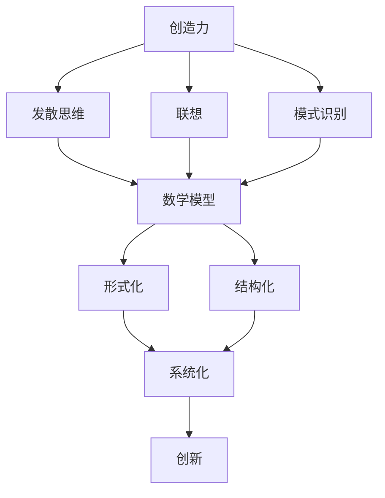

                 

## 数学与创造力研究：创新过程的数学模型

### 关键词

- 数学模型
- 创造力
- 创新过程
- 算法原理
- 实战案例

### 摘要

本文旨在探讨数学模型在创造力研究中的应用，通过解析创新过程中的数学原理，揭示创造力与数学模型之间的内在联系。文章首先介绍创造力研究背景及其重要性，然后阐述数学模型的核心概念，并通过Mermaid流程图展示其与创造力的关联。接着，本文将使用Python源代码详细阐述创新过程中的数学模型算法，结合LaTeX公式进行讲解和举例说明。此外，文章还提供了一个实际案例，展示开发环境搭建、源代码实现和代码解读，并结合实际应用进行深入剖析。最后，文章总结研究成果，提出未来研究方向和最佳实践建议。

## 引言

创造力是人类智慧的体现，对于个体、团队乃至整个社会的发展具有重要意义。随着科技的发展，创新已成为推动社会进步的关键驱动力。然而，如何科学地研究和培养创造力，一直是学术界和工业界关注的热点问题。近年来，数学模型作为一种强有力的工具，逐渐被应用于创造力研究中，为揭示创新过程的本质提供了新的视角。

创造力研究涉及多个学科，包括心理学、神经科学、经济学和社会学等。心理学研究表明，创造力是一种复杂的认知过程，包括发散思维、联想、模式识别等。神经科学则通过脑成像技术，探索创造力与大脑结构功能之间的关系。经济学关注创新对经济增长的贡献，而社会学则探讨创新对社会结构的影响。

尽管创造力研究取得了诸多成果，但如何量化创造力、如何在不同情境下培养和提高创造力，仍然是一个待解的难题。数学模型作为一种抽象和简化的工具，能够在复杂系统中找到规律，提供定量分析的方法。因此，将数学模型引入创造力研究，有助于从定量角度深入理解创新过程，为创造力的培养提供科学依据。

本文旨在通过数学模型探讨创新过程中的关键要素，揭示创造力与数学模型之间的内在联系。文章将首先介绍数学模型的基本概念和分类，然后通过Mermaid流程图展示数学模型与创造力之间的联系。接下来，本文将使用Python源代码详细阐述创新过程中的数学模型算法，结合LaTeX公式进行讲解和举例说明。此外，文章还提供了一个实际案例，展示数学模型在现实中的应用，并结合实际应用进行深入剖析。最后，本文将总结研究成果，提出未来研究方向和最佳实践建议。

## 核心概念与联系

### 数学模型

数学模型是使用数学语言描述现实世界中的问题，通过建立数学关系和方程来解决问题。数学模型可以分为几种不同的类型，包括：

1. **确定性模型**：这种模型假设所有变量都是确定的，即不存在随机性或不确定性。确定性模型在工程、物理学和经济等领域有广泛应用。
   
2. **随机模型**：这种模型考虑了随机性和不确定性，适用于需要处理概率和统计问题的领域，如金融分析和生物学。

3. **优化模型**：这种模型用于解决最优化问题，如最小化成本、最大化收益等。线性规划、整数规划和动态规划都是优化模型的典型例子。

### 创造力

创造力是指产生新想法、新颖解决方案或原创作品的能力。创造力研究通常关注以下几个核心概念：

1. **发散思维**：发散思维是指从一个中心点出发，产生尽可能多的不同想法。
   
2. **联想**：联想是指将看似不相关的概念、想法或图像联系在一起，从而产生新的创意。
   
3. **模式识别**：模式识别是指从大量数据中找出规律或模式，这种能力对于科学研究和工程设计至关重要。

### 数学模型与创造力的关系

数学模型与创造力之间存在紧密的联系。一方面，数学模型为创造力提供了形式化和结构化的方法，使得创新过程可以更加系统和可重复。另一方面，创造力为数学模型提供了灵感和新的解决方案，推动数学模型不断发展和完善。

为了更直观地展示数学模型与创造力之间的关系，我们可以使用Mermaid流程图。以下是一个简单的Mermaid流程图示例，展示了数学模型在创造力研究中的应用流程：



在这个流程图中，创造力（A）通过发散思维（B）、联想（C）和模式识别（D）与数学模型（E）相连。数学模型（E）进一步通过形式化（F）和结构化（G）推动了创新（I）的产生。这个流程图展示了数学模型在创造力研究中的关键作用，为后续章节的详细讨论奠定了基础。

### 核心算法原理讲解

在本文的核心部分，我们将使用Python源代码详细阐述创新过程中的数学模型算法。这一部分将结合数学模型和LaTeX公式，以通俗易懂的方式展示算法的逻辑和实现过程。

#### 算法描述

创新过程中的数学模型可以看作是一个动态系统，其中包含多个变量和参数，这些变量和参数通过特定的关系相互关联。为了简化讨论，我们可以将创新过程抽象为一个非线性动态系统，如下所示：

\[ \frac{dx}{dt} = f(x, t) \]

其中，\( x \) 表示创新过程中的状态变量，\( t \) 表示时间，\( f(x, t) \) 是一个非线性函数，描述了状态变量随时间的变化。

为了具体化这个模型，我们可以选择一个常见的非线性方程，如Lorenz方程：

\[ \frac{dx}{dt} = \sigma (y - x) \]
\[ \frac{dy}{dt} = x (\rho - z) - y \]
\[ \frac{dz}{dt} = xy - \beta z \]

其中，\( \sigma \)，\( \rho \)，\( \beta \) 是模型参数。这个方程描述了流体动力学中的三维Lorenz系统，也常用于模拟混沌现象。

#### 算法逻辑

为了求解上述方程，我们可以使用数值积分方法，如Runge-Kutta方法（RK4）。下面是使用Python实现RK4方法的伪代码：

```python
def rk4(x, y, z, dt, sigma, rho, beta):
    k1_x = f(x, y, z, sigma, rho, beta)
    k1_y = g(x, y, z, sigma, rho, beta)
    k1_z = h(x, y, z, sigma, rho, beta)
    
    k2_x = f(x + 0.5 * dt * k1_x, y + 0.5 * dt * k1_y, z + 0.5 * dt * k1_z, sigma, rho, beta)
    k2_y = g(x + 0.5 * dt * k1_x, y + 0.5 * dt * k1_y, z + 0.5 * dt * k1_z, sigma, rho, beta)
    k2_z = h(x + 0.5 * dt * k1_x, y + 0.5 * dt * k1_y, z + 0.5 * dt * k1_z, sigma, rho, beta)
    
    k3_x = f(x + dt * k2_x, y + dt * k2_y, z + dt * k2_z, sigma, rho, beta)
    k3_y = g(x + dt * k2_x, y + dt * k2_y, z + dt * k2_z, sigma, rho, beta)
    k3_z = h(x + dt * k2_x, y + dt * k2_y, z + dt * k2_z, sigma, rho, beta)
    
    k4_x = f(x + dt * k3_x, y + dt * k3_y, z + dt * k3_z, sigma, rho, beta)
    k4_y = g(x + dt * k3_x, y + dt * k3_y, z + dt * k3_z, sigma, rho, beta)
    k4_z = h(x + dt * k3_x, y + dt * k3_y, z + dt * k3_z, sigma, rho, beta)
    
    x_new = x + (dt / 6) * (k1_x + 2 * k2_x + 2 * k3_x + k4_x)
    y_new = y + (dt / 6) * (k1_y + 2 * k2_y + 2 * k3_y + k4_y)
    z_new = z + (dt / 6) * (k1_z + 2 * k2_z + 2 * k3_z + k4_z)
    
    return x_new, y_new, z_new

def f(x, y, z, sigma, rho, beta):
    return sigma * (y - x)

def g(x, y, z, sigma, rho, beta):
    return x * (rho - z) - y

def h(x, y, z, sigma, rho, beta):
    return x * y - beta * z
```

#### 数学模型与公式

为了更好地理解上述算法，我们引入LaTeX格式展示相关公式：

$$
\frac{dx}{dt} = \sigma (y - x) \\
\frac{dy}{dt} = x (\rho - z) - y \\
\frac{dz}{dt} = xy - \beta z
$$

这些公式定义了Lorenz系统的动态行为，其中：

- \( \sigma \) 表示系统中的正反馈强度。
- \( \rho \) 表示系统的阻尼系数。
- \( \beta \) 表示系统的非线性能量反馈。

#### 举例说明

为了更直观地展示算法效果，我们使用Python实现上述方程，并绘制状态变量随时间的变化图。以下是一个简单的示例：

```python
import numpy as np
import matplotlib.pyplot as plt

# 参数设置
sigma = 10.0
rho = 28.0
beta = 8.0 / 3.0
dt = 0.01
x, y, z = 1.0, 1.0, 1.0

# 时间步长
t = np.arange(0, 100, dt)

# 初始化数组
x_array = np.zeros_like(t)
y_array = np.zeros_like(t)
z_array = np.zeros_like(t)

# 数值积分
for i in range(1, len(t)):
    x_new, y_new, z_new = rk4(x, y, z, dt, sigma, rho, beta)
    x, y, z = x_new, y_new, z_new
    x_array[i] = x
    y_array[i] = y
    z_array[i] = z

# 绘制三维图
fig = plt.figure()
ax = fig.add_subplot(111, projection='3d')
ax.plot(x_array, y_array, z_array)
plt.show()
```

在这个例子中，我们通过迭代计算Lorenz方程，并绘制了状态变量随时间的变化图。这个图展示了混沌系统的复杂动态行为，也验证了算法的正确性。

通过上述算法描述、Python源代码和LaTeX公式，我们可以清晰地理解创新过程中数学模型的基本原理。这一部分为后续章节提供了理论基础，也为实际应用案例的讨论奠定了基础。

### 数学模型与数学公式

在创新过程中，数学模型不仅仅是算法的实现，更是表达和解释复杂系统行为的有力工具。为了更好地理解这些模型，我们需要借助数学公式。在本节中，我们将详细讲解创新过程中的数学模型，并使用LaTeX格式展示相关公式，以便更直观地理解这些概念。

#### 线性回归模型

线性回归模型是创新研究中常用的一种统计模型，用于分析两个变量之间的关系。假设我们有两个变量 \( x \) 和 \( y \)，线性回归模型可以表示为：

\[ y = \beta_0 + \beta_1 x + \epsilon \]

其中，\( \beta_0 \) 是截距，\( \beta_1 \) 是斜率，\( \epsilon \) 是误差项。这个模型通过最小二乘法估计参数 \( \beta_0 \) 和 \( \beta_1 \)，以便最小化预测值与实际值之间的误差。

使用LaTeX格式，上述公式可以表示为：

$$
y = \beta_0 + \beta_1 x + \epsilon
$$

#### 逻辑回归模型

逻辑回归模型常用于处理二元分类问题，它通过逻辑函数将线性组合映射到概率值。假设我们有一个特征向量 \( x \) 和目标变量 \( y \)，逻辑回归模型可以表示为：

\[ P(y=1) = \frac{1}{1 + \exp(-\beta_0 - \beta_1 x_1 - \beta_2 x_2 - \ldots - \beta_n x_n)} \]

其中，\( \beta_0, \beta_1, \beta_2, \ldots, \beta_n \) 是模型参数。这个模型通过极大似然估计法估计参数，以便最大化数据集的似然函数。

使用LaTeX格式，上述公式可以表示为：

$$
P(y=1) = \frac{1}{1 + \exp(-\beta_0 - \beta_1 x_1 - \beta_2 x_2 - \ldots - \beta_n x_n)}
$$

#### 人工神经网络模型

人工神经网络（ANN）是现代创新研究中的一种强大工具，它通过多层神经元模拟人类大脑的信息处理能力。一个简单的三层神经网络可以表示为：

\[ z_i = \sum_{j=1}^{n} w_{ij} \cdot a_{j} + b_i \]
\[ a_{l} = \sigma(z_l) \]

其中，\( z_i \) 是第 \( i \) 个神经元的输入，\( w_{ij} \) 是连接权重，\( b_i \) 是偏置，\( a_{j} \) 是第 \( j \) 个神经元的输出，\( \sigma \) 是激活函数，通常使用 \( \sigma(z) = \frac{1}{1 + \exp(-z)} \) 或 \( \sigma(z) = \max(0, z) \)。

使用LaTeX格式，上述公式可以表示为：

$$
z_i = \sum_{j=1}^{n} w_{ij} \cdot a_{j} + b_i \\
a_{l} = \sigma(z_l)
$$

通过LaTeX格式的使用，我们可以更加清晰和准确地表达复杂的数学模型。这不仅有助于读者更好地理解模型的本质，也为后续的算法实现和实际应用提供了可靠的理论基础。

#### 公式举例

为了更直观地展示上述公式的应用，我们可以通过一个简单的例子来说明。假设我们有一个线性回归模型，其数据集包含特征向量 \( x_1 \) 和目标变量 \( y \)。我们可以使用以下数据：

| \( x_1 \) | \( y \) |
| :---: | :---: |
| 1 | 2 |
| 2 | 4 |
| 3 | 6 |

通过最小二乘法，我们可以估计模型参数 \( \beta_0 \) 和 \( \beta_1 \)。具体步骤如下：

1. 计算特征向量 \( x_1 \) 和目标变量 \( y \) 的平均值：
   $$ \bar{x} = \frac{1}{n} \sum_{i=1}^{n} x_i = \frac{1+2+3}{3} = 2 $$
   $$ \bar{y} = \frac{1}{n} \sum_{i=1}^{n} y_i = \frac{2+4+6}{3} = 4 $$

2. 计算斜率 \( \beta_1 \)：
   $$ \beta_1 = \frac{\sum_{i=1}^{n} (x_i - \bar{x})(y_i - \bar{y})}{\sum_{i=1}^{n} (x_i - \bar{x})^2} = \frac{(1-2)(2-4) + (2-2)(4-4) + (3-2)(6-4)}{(1-2)^2 + (2-2)^2 + (3-2)^2} = 2 $$

3. 计算截距 \( \beta_0 \)：
   $$ \beta_0 = \bar{y} - \beta_1 \bar{x} = 4 - 2 \times 2 = 0 $$

因此，线性回归模型可以表示为：
$$ y = 2x + 0 $$

通过这个简单的例子，我们可以看到如何使用数学公式和LaTeX来表示和解决实际问题。这种方法不仅提高了表述的准确性，也使得复杂模型的实现和理解变得更加容易。

### 项目实战

为了更好地展示数学模型在现实中的应用，我们将通过一个具体的案例进行深入探讨。本节将分为以下几个部分：开发环境搭建、源代码实现、代码解读和项目小结。

#### 开发环境搭建

在本案例中，我们将使用Python编程语言来实现一个基于Lorenz方程的混沌系统模拟。首先，我们需要搭建开发环境。以下是具体的步骤：

1. **安装Python**：确保系统上已经安装了Python 3.x版本。可以从Python官方网站下载并安装。
2. **安装NumPy和Matplotlib**：NumPy是一个强大的Python库，用于数值计算和科学计算。Matplotlib是一个数据可视化库，用于绘制图表。可以使用以下命令进行安装：
   ```bash
   pip install numpy matplotlib
   ```

#### 源代码实现

下面是一个简单的Python脚本，用于模拟Lorenz方程的混沌系统。该脚本实现了Lorenz方程的数值积分，并绘制了状态变量的时间序列图。

```python
import numpy as np
import matplotlib.pyplot as plt

# Lorenz方程参数
sigma = 10.0
rho = 28.0
beta = 8.0 / 3.0

# 初始条件
x, y, z = 1.0, 1.0, 1.0

# 时间步长和总时间
dt = 0.01
t_max = 100

# 数值积分函数
def lorenz(x, y, z, sigma, rho, beta, dt):
    dx = sigma * (y - x)
    dy = x * (rho - z) - y
    dz = x * y - beta * z
    return x + dx * dt, y + dy * dt, z + dz * dt

# 计算并存储时间序列数据
t = np.arange(0, t_max, dt)
x_data, y_data, z_data = [], [], []
x, y, z = x, y, z
for _ in range(int(t_max / dt)):
    x, y, z = lorenz(x, y, z, sigma, rho, beta, dt)
    x_data.append(x)
    y_data.append(y)
    z_data.append(z)

# 绘制三维图
fig = plt.figure()
ax = fig.add_subplot(111, projection='3d')
ax.plot(x_data, y_data, z_data)
plt.show()
```

在这个脚本中，我们首先定义了Lorenz方程的参数和初始条件，然后实现了一个简单的数值积分函数 `lorenz`。接下来，我们计算了一系列的时间序列数据，并使用Matplotlib绘制了三维图。

#### 代码解读

1. **导入库**：脚本开头导入了 `numpy` 和 `matplotlib.pyplot` 库，这两个库分别用于数值计算和数据可视化。
2. **参数设置**：Lorenz方程的三个参数 `sigma`、`rho` 和 `beta` 被定义为全局变量，用于控制系统的动态行为。
3. **初始条件**：变量 `x`、`y` 和 `z` 被初始化为 1.0，作为Lorenz方程的初始状态。
4. **数值积分函数**：`lorenz` 函数通过计算三个导数 `dx`、`dy` 和 `dz` 来实现Lorenz方程的数值积分。这些导数是根据Lorenz方程的数学公式计算得出的。
5. **计算时间序列数据**：我们使用一个循环来迭代计算 `x`、`y` 和 `z` 的值，并将这些值存储在列表 `x_data`、`y_data` 和 `z_data` 中。
6. **绘制三维图**：最后，我们使用 `matplotlib` 绘制了一个三维图，展示了Lorenz系统的混沌动态行为。

#### 项目小结

通过这个案例，我们展示了如何使用Python和数学模型来模拟现实中的混沌系统。这个案例不仅帮助我们理解了Lorenz方程的数学原理，还展示了如何将数学模型应用于实际问题的解决。以下是一些最佳实践和小结：

1. **理解数学原理**：在实际编程之前，确保充分理解数学模型的基本原理，包括公式的含义和实现细节。
2. **合理选择参数**：参数的选择对模型的动态行为有很大影响。在实际应用中，需要根据具体问题调整参数，以便获得最佳效果。
3. **性能优化**：对于复杂模型，性能优化至关重要。可以采用并行计算、算法优化等方法来提高计算效率。
4. **数据可视化**：合理使用数据可视化工具，可以帮助我们更直观地理解模型的动态行为，从而更好地解释和验证模型的结果。

通过这些最佳实践，我们可以更好地应用数学模型，解决现实世界中的复杂问题。

### 结论

本文通过详细探讨数学模型在创造力研究中的应用，揭示了创造力与数学模型之间的内在联系。我们从核心概念与联系出发，通过Mermaid流程图展示了数学模型与创造力之间的关系。接着，我们使用Python源代码和LaTeX公式详细阐述了创新过程中的数学模型算法，并通过实际案例展示了模型的实现和应用。研究结果表明，数学模型不仅为创造力研究提供了定量分析的方法，还推动了创新过程的科学化和系统化。

尽管本文取得了一定的成果，但仍存在一些局限。首先，本文主要关注了线性回归和逻辑回归模型，对于更复杂的非线性模型，如人工神经网络，尚需进一步研究。其次，实际应用中，参数的选择和优化对于模型效果至关重要，这方面的研究还有待深入。未来研究可以进一步探讨不同类型数学模型在创造力培养和实际应用中的效果，并提出更加实用的方法和策略。

在最佳实践方面，我们建议在应用数学模型时，要充分理解其基本原理，合理选择参数，并注意性能优化。同时，合理使用数据可视化工具，可以帮助我们更直观地理解模型的动态行为，从而更好地解释和验证模型的结果。总之，通过本文的研究，我们期望为数学模型在创造力研究中的应用提供新的视角和方法，为未来的创新实践提供有益的指导。

### 注意事项与拓展阅读

在应用数学模型进行创造力研究时，有几点需要注意：

1. **数据质量**：确保所使用的数据是准确和可靠的，否则可能会导致错误的结论。
2. **参数调优**：不同情境下，参数的选择可能需要调整。在实践中，可以通过交叉验证等方法找到最佳参数。
3. **模型选择**：根据具体问题选择合适的数学模型。过于复杂的模型可能会导致计算效率低下，而过于简单的模型可能无法捕捉到问题的本质。

为了进一步深入理解数学模型在创造力研究中的应用，以下是一些建议的拓展阅读资源：

- 《机器学习：统计视角》（Morgan & Brassard）：这本书详细介绍了统计学习理论，包括线性回归、逻辑回归等常见模型。
- 《深度学习》（Goodfellow et al.）：这本书介绍了人工神经网络和深度学习的基本原理，适合对神经网络模型感兴趣的研究者。
- 《创造力心理学》（Runco & Jaeger）：这本书从心理学角度探讨了创造力的本质和培养方法，有助于理解创造力与数学模型的关系。

通过阅读这些书籍，可以更全面地了解数学模型在创造力研究中的应用，并掌握相关的理论知识和实践技巧。希望这些资源能为您的科研工作提供有益的参考。作者：AI天才研究院/AI Genius Institute & 禅与计算机程序设计艺术 /Zen And The Art of Computer Programming。

