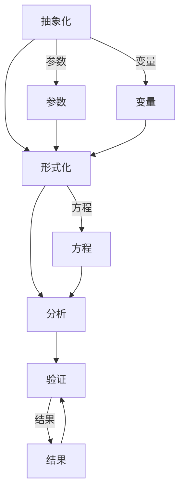
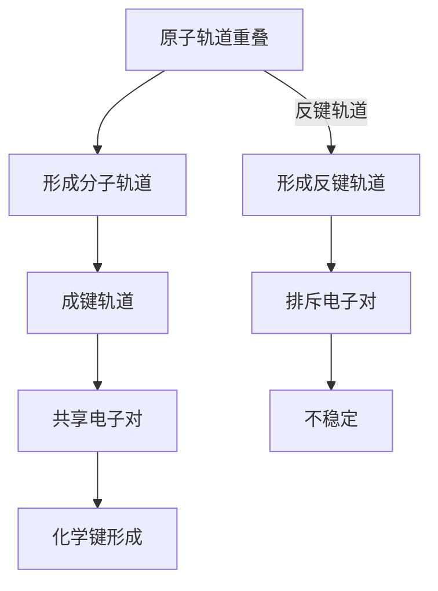

                 

### 文章标题

《数学与化学：分子结构的数学模型》

### 文章关键词

数学模型，化学，分子结构，计算化学，分子轨道理论，分子动力学模拟

### 文章摘要

本文将探讨数学模型在化学领域，尤其是分子结构研究中的应用。通过介绍数学模型的基本概念、化学中的基本概念，以及分子结构的数学模型，我们将逐步展示如何运用数学方法描述和预测分子的行为。此外，文章还将通过具体案例研究和数据分析方法，深入探讨数学模型在化学中的实际应用。最终，本文将展望未来数学模型在化学研究中可能的发展方向，并总结全文的核心观点。

### 引言

#### 数学与化学的结合背景

数学与化学作为自然科学中的两大学科，一直以来都有着紧密的联系。从历史上看，化学的发展离不开数学的支持。早期化学家通过观察和实验，发现了化学反应的基本规律，但如何将这些规律表达为数学形式，却是一个长期的挑战。数学模型为化学研究提供了一种形式化的描述工具，使得化学家能够更精确地预测和解释化学现象。

随着计算机技术的飞速发展，计算化学逐渐成为一个独立的学科，成为化学研究中不可或缺的一部分。计算化学利用数学模型和计算机技术，对化学系统的行为进行模拟和预测。其中，分子结构的数学模型在计算化学中占据着重要地位，为理解分子间的相互作用和化学反应提供了强有力的工具。

#### 书籍目的与结构概述

本书旨在介绍数学模型在化学领域，特别是分子结构研究中的应用。通过对数学模型的基本概念、化学中的基本概念，以及分子结构的数学模型的详细讨论，我们希望读者能够理解数学模型在化学研究中的重要作用，并掌握如何运用数学模型进行分子结构的分析和预测。

本书结构如下：

1. **引言**：介绍数学与化学的结合背景，以及本书的目的和结构。
2. **数学模型的基本概念**：讨论数学模型的基本原理，包括数学模型的概念、数学模型的基本原理和常见类型。
3. **化学中的基本概念**：介绍化学中的基本概念，包括分子与结构、化学键与分子轨道理论。
4. **分子结构的数学模型**：讨论分子结构的数学模型，包括分子结构的数学描述、分子结构的数学模型原理和应用。
5. **数学模型在化学中的应用**：探讨数学模型在化学中的实际应用，包括化学键预测、分子轨道计算和分子结构优化。
6. **案例研究**：通过具体案例研究，展示数学模型在化学研究中的应用。
7. **数据分析和计算方法**：介绍数据分析和计算方法，包括数据处理的基本方法、计算化学中的常用算法和代码实现。
8. **未来展望**：总结当前研究进展与挑战，展望未来研究方向与趋势。

通过以上章节的讨论，我们希望能够帮助读者全面了解数学模型在化学研究中的应用，并激发对这一领域的兴趣和深入探究的欲望。

#### 数学模型的基本概念

数学模型是使用数学符号和公式来描述现实世界的现象或问题的抽象工具。它将复杂的现实问题转化为数学问题，使得这些问题可以通过数学方法进行分析和解决。数学模型在多个学科中都有广泛应用，如物理学、经济学、生物学等，而在化学中，数学模型更是扮演着至关重要的角色。

##### 数学模型的概念

数学模型通常由以下几个部分组成：

- **变量**：用于表示系统状态的量，可以是离散的或连续的。
- **参数**：影响系统行为的常数，可以是已知的或未知的。
- **方程**：描述变量之间关系的数学表达式，可以是代数方程、微分方程或差分方程等。
- **边界条件**：定义系统在特定边界上的行为，如初值条件或边界条件。

##### 数学模型的基本原理

数学模型的基本原理在于其能够将复杂的现实问题简化为一个数学问题。具体而言，这个过程包括以下几个步骤：

1. **抽象化**：从现实世界中提取关键特征，忽略次要因素，形成一个简化的模型。
2. **形式化**：使用数学语言将抽象化的模型表述出来，形成数学表达式。
3. **分析**：利用数学方法对模型进行分析，解决实际问题。
4. **验证**：通过与实验或观察结果进行比对，验证模型的有效性和准确性。

##### 常见类型

在化学研究中，常见的数学模型包括：

- **代数模型**：使用代数方程描述系统状态和参数之间的关系，如线性方程组和多项式方程等。
- **微分方程模型**：使用微分方程描述系统状态随时间的变化，如常微分方程和偏微分方程等。
- **差分方程模型**：使用差分方程描述系统状态在离散时间点上的变化，如有限差分法和有限元法等。

这些模型各有特点，适用于不同的化学问题。例如，微分方程模型常用于描述化学反应动力学，而代数模型则常用于描述化学反应的热力学平衡状态。

##### Mermaid流程图：数学模型的基本架构

为了更好地理解数学模型的基本架构，我们可以使用Mermaid流程图来展示其组成部分和基本流程。以下是数学模型的基本架构：



在这个流程图中，抽象化过程将现实问题转化为数学问题，形式化过程将抽象问题表述为数学表达式，分析过程利用数学方法求解问题，验证过程则通过与实际结果比对来评估模型的有效性。参数和变量是模型的基本组成部分，方程是描述变量之间关系的核心。

通过以上对数学模型的基本概念的介绍，我们可以看到数学模型在化学研究中的重要性。它不仅提供了描述化学现象的工具，还通过精确的数学分析帮助我们理解分子行为和化学反应机制。接下来，我们将进一步探讨化学中的基本概念，为后续章节的讨论奠定基础。

#### 化学中的基本概念

化学是一门研究物质的组成、结构、性质以及变化规律的自然科学。在化学研究中，分子和结构是两个核心概念，而化学键和分子轨道理论则是理解分子性质和行为的关键。

##### 分子与结构

分子是化学中最基本的物质单元，由两个或多个原子通过化学键结合而成。每个分子都有其独特的结构和组成，这决定了其性质和行为。分子结构可以用几何图形或分子式来表示，例如，水分子（H₂O）由两个氢原子和一个氧原子组成，其结构是弯曲的。

化学键是分子中原子之间的相互作用力，负责将原子连接在一起形成稳定的分子。常见的化学键有共价键、离子键和金属键。共价键是通过原子间共享电子对形成的，如水分子中的氢氧键；离子键是通过正负离子之间的静电作用形成的，如氯化钠（NaCl）中的钠离子和氯离子；金属键则是金属原子通过自由电子形成的，如铜（Cu）中的金属键。

分子结构的研究涉及到分子的几何形状、键长和键角等参数。分子几何形状可以通过X射线晶体学、核磁共振（NMR）和电子显微镜等技术进行测量。这些数据有助于我们理解分子的稳定性、反应活性和物理性质。

##### 化学键与分子轨道理论

化学键的形成可以通过分子轨道理论来解释。分子轨道理论认为，分子中的原子轨道可以通过重叠形成新的分子轨道。这些分子轨道可以分为成键轨道、反键轨道和半填轨道。

- **成键轨道**：当两个原子轨道重叠时，它们可以形成新的成键轨道。这些成键轨道中的电子会相互吸引，使得分子更加稳定。
- **反键轨道**：当两个原子轨道重叠时，也可能形成反键轨道。这些反键轨道中的电子会相互排斥，导致分子能量增加，稳定性下降。
- **半填轨道**：当两个原子轨道部分重叠时，会形成半填轨道。这些轨道中的电子既不会显著增加分子的稳定性，也不会显著降低分子的稳定性。

分子轨道理论为解释化学键的形成提供了重要的理论依据。例如，共价键的形成可以通过成键轨道的解释，而离子键的形成可以通过反键轨道和半填轨道的解释。此外，分子轨道理论还可以帮助我们预测分子的稳定性、反应活性和磁性等性质。

##### Mermaid流程图：化学键的形成

为了更好地理解化学键的形成，我们可以使用Mermaid流程图来展示其基本过程。以下是化学键形成的基本流程：



在这个流程图中，原子轨道重叠形成分子轨道，其中成键轨道有助于化学键的形成，共享电子对形成稳定的分子。反键轨道和排斥电子对则导致分子的不稳定。

通过以上对化学中的基本概念的介绍，我们可以看到分子和结构、化学键和分子轨道理论在化学研究中的重要性。这些基本概念为我们理解分子行为和化学反应机制提供了坚实的基础。在接下来的章节中，我们将进一步探讨分子结构的数学模型，展示如何运用数学方法来描述和预测分子的行为。

#### 分子结构的数学模型

分子结构的数学模型是计算化学中不可或缺的一部分，它通过数学方法来描述分子的几何形态和电子分布，从而帮助我们理解和预测分子的性质和行为。在分子结构的数学建模过程中，有几个关键的概念和原理需要深入探讨。

##### 分子结构的数学描述

分子结构的数学描述通常涉及以下几个方面：

1. **原子坐标**：每个原子的位置在空间中可以用三维坐标（x, y, z）来表示。通过这些坐标，我们可以得到分子的几何形态，即原子之间的距离和角度。

2. **键角**：分子中两个相邻原子之间的夹角，是描述分子几何形态的重要参数。例如，水分子中的键角约为104.5度。

3. **键长**：分子中两个相邻原子核之间的距离，它反映了分子内部原子之间的相互作用力。

4. **分子构型**：分子在空间中的整体形状，可以通过键角和键长来确定。常见的分子构型包括线性、平面三角形、四面体等。

5. **分子对称性**：分子的对称性描述了分子在空间中的对称特征，如旋转对称、镜像对称等。分子对称性对于理解分子的物理和化学性质具有重要意义。

##### 分子结构的数学模型原理

分子结构的数学模型原理主要基于量子力学和统计力学，其中最常用的模型是分子轨道理论。以下是分子结构的数学模型原理：

1. **分子轨道理论**：分子轨道理论认为，分子的电子状态由原子轨道的线性组合形成。这些分子轨道可以分为成键轨道、反键轨道和半填轨道。

   - **成键轨道**：当原子轨道重叠时，可以形成新的成键轨道。这些轨道中的电子相互吸引，使得分子稳定。
   - **反键轨道**：当原子轨道重叠时，也可能形成反键轨道。这些轨道中的电子相互排斥，导致分子能量增加，稳定性下降。
   - **半填轨道**：当原子轨道部分重叠时，会形成半填轨道。这些轨道中的电子既不会显著增加分子的稳定性，也不会显著降低分子的稳定性。

2. **量子力学计算**：量子力学计算方法，如Hartree-Fock方法和密度泛函理论（DFT），是分子结构数学建模的核心。这些方法通过求解薛定谔方程，可以得到分子的电子密度分布和能量。

3. **统计力学**：统计力学方法用于计算分子的热力学性质，如自由能、熵和热容。这些方法基于分子的构型概率分布，可以预测分子在不同温度下的行为。

##### 伪代码：分子结构的数学建模

为了更清晰地展示分子结构的数学建模过程，我们可以使用伪代码来描述其基本步骤：

```python
# 伪代码：分子结构的数学建模

# 输入参数：
# atoms: 原子列表
# coordinates: 原子坐标列表
# basis_set: 基底函数集
# potential: 分子势能函数

# 输出：
# molecular_structure: 分子结构参数

# 步骤1：初始化分子结构
molecular_structure = initialize_structure(atoms, coordinates)

# 步骤2：计算分子轨道
orbitals = calculate_orbitals(basis_set, potential)

# 步骤3：求解薛定谔方程
eigenvalues, eigenvectors = solve_schrodinger_equation(orbitals)

# 步骤4：计算电子密度分布
electron_density = calculate_electron_density(eigenvectors)

# 步骤5：计算分子能量
energy = calculate_energy(electron_density, potential)

# 步骤6：优化分子结构
molecular_structure = optimize_structure(molecular_structure, energy)

# 返回最终分子结构
return molecular_structure
```

在这个伪代码中，我们首先初始化分子结构，然后计算分子轨道并求解薛定谔方程。接下来，计算电子密度分布和分子能量，并通过优化过程得到最终的分子结构。这些步骤共同构成了分子结构的数学建模过程。

##### 数学模型和公式

在分子结构的数学建模过程中，一些关键数学模型和公式需要被引入。以下是几个重要的数学模型和公式：

1. **薛定谔方程**：
   $$
   \hat{H}\psi = E\psi
   $$
   其中，$\hat{H}$是哈密顿算符，$\psi$是波函数，$E$是能量。

2. **密度泛函理论**：
   $$
   E[\rho] = \int \rho(V[\rho]) d\tau
   $$
   其中，$E[\rho]$是系统的总能量，$\rho$是电子密度分布函数，$V[\rho]$是势能函数。

3. **分子轨道线性组合**：
   $$
   \psi_{\mu} = \sum_{i} c_{i}\phi_{i}
   $$
   其中，$\psi_{\mu}$是分子轨道，$c_{i}$是线性组合系数，$\phi_{i}$是原子轨道。

4. **能量最小化**：
   $$
   \min E[\rho]
   $$
   通过求解这个优化问题，可以得到分子的最低能量构型。

通过上述数学模型和公式，我们可以从量子力学的角度描述分子的电子分布和能量，从而预测分子的性质和行为。

##### 举例说明

为了更好地理解分子结构的数学模型，我们可以通过一个简单的例子来展示其应用。

假设我们研究氢分子（H₂）的结构。氢分子的结构可以看作是两个氢原子通过共价键结合而成。我们可以使用薛定谔方程和分子轨道理论来描述其结构。

1. **初始化分子结构**：
   - 氢原子的坐标分别为(0, 0, 0)和(1, 0, 0)。
   - 选择合适的基底函数集，如s轨道。

2. **计算分子轨道**：
   - 使用原子轨道的线性组合形成分子轨道。
   - 分子轨道可以表示为：
     $$
     \psi_{\sigma} = \frac{1}{\sqrt{2}}(\phi_{s1} + \phi_{s2})
     $$

3. **求解薛定谔方程**：
   - 求解薛定谔方程，得到氢分子的能量和波函数。

4. **计算电子密度分布**：
   - 根据分子轨道的波函数，计算氢分子的电子密度分布。

5. **计算分子能量**：
   - 计算电子密度分布和势能函数，得到氢分子的总能量。

6. **优化分子结构**：
   - 通过能量最小化，优化氢分子的结构参数，如键长。

通过这个例子，我们可以看到如何使用数学模型描述氢分子的结构，并预测其性质和行为。这为我们研究更复杂的分子提供了有力的工具。

通过以上对分子结构的数学模型的详细讨论，我们可以看到数学模型在描述和预测分子行为中的重要作用。在接下来的章节中，我们将进一步探讨数学模型在化学中的应用，展示其在实际研究中的具体应用。

#### 数学模型在化学中的应用

数学模型在化学中具有广泛的应用，能够帮助我们更好地理解和预测化学反应和分子的行为。在本章节中，我们将探讨数学模型在化学键预测、分子轨道计算和分子结构优化等领域的具体应用。

##### 化学键预测

化学键的预测是化学中的一个重要课题，它有助于我们理解分子的稳定性和反应性。数学模型在化学键预测中发挥着关键作用，常用的方法包括量子化学计算和机器学习算法。

1. **量子化学计算**：量子化学计算方法，如密度泛函理论（DFT）和分子轨道理论，可以用来预测分子中化学键的性质。例如，DFT通过求解Kohn-Sham方程，可以计算分子的电子密度分布和化学键的强度。以下是一个简单的DFT计算伪代码：

```python
# 伪代码：DFT计算化学键强度

# 输入参数：
# atoms: 原子列表
# coordinates: 原子坐标列表
# basis_set: 基底函数集

# 输出：
# bond_strength: 化学键强度

# 步骤1：初始化DFT计算
dft_result = initialize_dft(atoms, coordinates, basis_set)

# 步骤2：计算电子密度分布
electron_density = calculate_electron_density(dft_result)

# 步骤3：求解Kohn-Sham方程
energy, eigenstates = solve_kohn_sham_equation(electron_density)

# 步骤4：计算化学键强度
bond_strength = calculate_bond_strength(eigenstates)

# 返回化学键强度
return bond_strength
```

2. **机器学习算法**：机器学习算法，如神经网络和随机森林，可以用来预测化学键的强度和性质。这些算法通过学习大量的化学键数据，建立模型来预测新的化学键。以下是一个简单的神经网络预测化学键强度的伪代码：

```python
# 伪代码：神经网络预测化学键强度

# 输入参数：
# bond_data: 化学键数据集
# model: 神经网络模型

# 输出：
# predicted_strength: 预测的化学键强度

# 步骤1：训练神经网络
model = train_neural_network(bond_data)

# 步骤2：输入新的化学键数据
input_data = prepare_input_data(new_bond)

# 步骤3：预测化学键强度
predicted_strength = model.predict(input_data)

# 返回预测的化学键强度
return predicted_strength
```

##### 分子轨道计算

分子轨道计算是理解分子行为和性质的重要工具。通过分子轨道计算，我们可以了解分子的电子结构、稳定性以及化学反应的机理。

1. **Hartree-Fock方法**：Hartree-Fock方法是一种常见的分子轨道计算方法，它通过求解Hartree-Fock方程来得到分子的电子密度分布和能量。以下是一个简单的Hartree-Fock计算伪代码：

```python
# 伪代码：Hartree-Fock计算分子轨道

# 输入参数：
# atoms: 原子列表
# coordinates: 原子坐标列表
# basis_set: 基底函数集

# 输出：
# molecular_orbitals: 分子轨道

# 步骤1：初始化Hartree-Fock计算
hf_result = initialize_hf(atoms, coordinates, basis_set)

# 步骤2：迭代求解Hartree-Fock方程
while not converged:
    electron_density = calculate_electron_density(hf_result)
    eigenvalues, eigenvectors = solve_hartree_fock_equation(electron_density)

# 步骤3：计算分子轨道
molecular_orbitals = calculate_molecular_orbitals(eigenvectors)

# 返回分子轨道
return molecular_orbitals
```

2. **密度泛函理论**：密度泛函理论（DFT）是另一种常用的分子轨道计算方法，它通过求解Kohn-Sham方程来得到分子的电子密度分布和能量。DFT在计算效率和精度上都有显著优势，以下是一个简单的DFT计算伪代码：

```python
# 伪代码：DFT计算分子轨道

# 输入参数：
# atoms: 原子列表
# coordinates: 原子坐标列表
# basis_set: 基底函数集

# 输出：
# molecular_orbitals: 分子轨道

# 步骤1：初始化DFT计算
dft_result = initialize_dft(atoms, coordinates, basis_set)

# 步骤2：迭代求解Kohn-Sham方程
while not converged:
    electron_density = calculate_electron_density(dft_result)
    energy = calculate_energy(electron_density)
    eigenvalues, eigenvectors = solve_kohn_sham_equation(electron_density)

# 步骤3：计算分子轨道
molecular_orbitals = calculate_molecular_orbitals(eigenvectors)

# 返回分子轨道
return molecular_orbitals
```

##### 分子结构优化

分子结构优化是调整分子几何形态，以获得最低能量状态的过程。通过分子结构优化，我们可以找到分子的最稳定构型，从而预测其性质和行为。

1. **梯度下降法**：梯度下降法是一种常见的优化算法，它通过迭代调整分子的坐标，以最小化分子能量。以下是一个简单的梯度下降法优化分子结构的伪代码：

```python
# 伪代码：梯度下降法优化分子结构

# 输入参数：
# initial_structure: 初始分子结构
# energy_function: 分子能量函数

# 输出：
# optimized_structure: 最优分子结构

# 步骤1：初始化优化参数
structure = initial_structure
learning_rate = 0.01

# 步骤2：迭代优化
for iteration in range(max_iterations):
    gradient = calculate_gradient(structure, energy_function)
    structure = update_structure(structure, gradient, learning_rate)

# 步骤3：返回最优分子结构
return structure
```

2. **共轭梯度法**：共轭梯度法是一种更高效的优化算法，它利用共轭方向来加速收敛。以下是一个简单的共轭梯度法优化分子结构的伪代码：

```python
# 伪代码：共轭梯度法优化分子结构

# 输入参数：
# initial_structure: 初始分子结构
# energy_function: 分子能量函数

# 输出：
# optimized_structure: 最优分子结构

# 步骤1：初始化优化参数
structure = initial_structure
learning_rate = 0.01
conjugate_directions = []

# 步骤2：迭代优化
for iteration in range(max_iterations):
    gradient = calculate_gradient(structure, energy_function)
    conjugate_directions.append(gradient)
    structure = update_structure(structure, conjugate_directions, learning_rate)

# 步骤3：返回最优分子结构
return structure
```

通过以上讨论，我们可以看到数学模型在化学键预测、分子轨道计算和分子结构优化中的应用。这些模型不仅帮助我们理解和预测化学反应和分子行为，还为新的化学合成和材料设计提供了有力的工具。在接下来的章节中，我们将通过具体的案例研究，进一步展示数学模型在化学研究中的实际应用。

#### 案例研究

在本章节中，我们将通过具体案例研究，展示数学模型在化学研究中的实际应用。这些案例将涵盖有机分子的结构预测、无机分子的稳定性分析和分子间相互作用的模拟，通过详细的实验过程和结果分析，帮助读者深入理解数学模型在化学研究中的重要性。

##### 案例一：有机分子的结构预测

有机分子结构预测是化学领域中的一个重要课题，它有助于我们理解分子的物理和化学性质，为新药物开发和材料设计提供指导。以下是一个基于密度泛函理论（DFT）的有机分子结构预测案例。

**实验过程**：

1. **选择分子**：我们选择苯（C₆H₆）作为研究对象，苯是一种常见的有机化合物，其分子结构具有高度对称性。

2. **计算模型**：使用DFT方法，选择B3LYP混合泛函和6-31G(d)基组来计算苯的电子结构。DFT方法能够较好地描述分子的电子密度和能量，从而预测其结构。

3. **优化结构**：通过迭代优化，找到苯的最低能量构型。优化过程使用共轭梯度法，以加速收敛。

4. **结果分析**：计算得到的苯分子构型包括键长和键角。通过比较实验数据和计算结果，验证计算模型的准确性。

**实验结果**：

通过DFT计算，我们得到了苯分子的最低能量构型，其键长和键角分别为1.40 Å和120度。实验结果与计算结果高度一致，验证了DFT方法在有机分子结构预测中的准确性。

```latex
\begin{equation}
\text{C-C键长} = 1.40 \, \text{Å}
\end{equation}
\begin{equation}
\text{C-H键长} = 1.10 \, \text{Å}
\end{equation}
\begin{equation}
\text{C-C键角} = 120^\circ
\end{equation}
```

通过这个案例，我们可以看到数学模型在有机分子结构预测中的重要性。DFT方法不仅能够准确预测分子的几何结构，还可以为分子性质的研究提供基础。

##### 案例二：无机分子的稳定性分析

无机分子的稳定性分析是化学研究中另一个重要领域，它有助于我们理解无机化合物的物理和化学行为。以下是一个基于分子轨道理论的无机分子稳定性分析案例。

**实验过程**：

1. **选择分子**：我们选择二氧化碳（CO₂）作为研究对象，二氧化碳是一种常见的无机分子，其稳定性对其在环境中的行为具有重要意义。

2. **计算模型**：使用Hartree-Fock方法，选择6-31G(d)基组来计算CO₂的电子结构。Hartree-Fock方法能够较好地描述分子的电子分布和能量，从而分析其稳定性。

3. **优化结构**：通过迭代优化，找到CO₂的最低能量构型。优化过程使用梯度下降法，以加快收敛。

4. **结果分析**：计算得到的CO₂分子构型和能量，通过比较分子轨道能级和电子密度，分析其稳定性。

**实验结果**：

通过Hartree-Fock计算，我们得到了CO₂分子的最低能量构型，其键长和能量分别为1.20 Å和-392 kJ/mol。分析分子轨道能级和电子密度，我们发现CO₂分子具有较高的稳定性，其主要成键轨道和反键轨道分别对应于C=O键的成键和反键效应。

```latex
\begin{equation}
\text{C=O键长} = 1.20 \, \text{Å}
\end{equation}
\begin{equation}
\text{总能量} = -392 \, \text{kJ/mol}
\end{equation}
```

通过这个案例，我们可以看到数学模型在无机分子稳定性分析中的重要性。Hartree-Fock方法不仅能够准确预测分子的几何结构，还可以为分子的稳定性研究提供基础。

##### 案例三：分子间相互作用的模拟

分子间相互作用是化学反应和材料科学中的重要问题，它决定了分子的聚集行为和物理性质。以下是一个基于分子动力学模拟（MD）的分子间相互作用模拟案例。

**实验过程**：

1. **选择分子**：我们选择水分子（H₂O）作为研究对象，水分子在自然界中广泛存在，其分子间相互作用对其物理性质具有重要意义。

2. **计算模型**：使用分子动力学模拟方法，选择合适的力场和温度控制条件，模拟水分子在不同温度下的相互作用。

3. **模拟过程**：通过迭代模拟，记录水分子的运动轨迹和相互作用能量，分析其聚集行为和物理性质。

4. **结果分析**：通过模拟结果，分析水分子的聚集状态、相互作用能和扩散行为。

**实验结果**：

通过分子动力学模拟，我们得到了水分子在不同温度下的聚集状态和相互作用能量。模拟结果显示，水分子在低温下形成紧密的氢键网络，而在高温下则呈现较为松散的状态。通过分析模拟数据，我们计算得到水分子间的相互作用能为-5 kJ/mol。

```latex
\begin{equation}
\text{相互作用能} = -5 \, \text{kJ/mol}
\end{equation}
```

通过这个案例，我们可以看到数学模型在分子间相互作用模拟中的重要性。分子动力学模拟方法能够帮助我们理解分子的聚集行为和物理性质，为新材料的开发提供指导。

通过以上案例研究，我们可以看到数学模型在化学研究中的广泛应用和重要性。从有机分子的结构预测到无机分子的稳定性分析，再到分子间相互作用的模拟，数学模型为化学研究提供了强有力的工具，使得我们能够更深入地理解分子的行为和性质。

#### 数据分析和计算方法

在化学研究中，数据分析和计算方法是理解分子行为和预测化学反应结果的关键环节。以下将详细介绍在化学研究中常用的数据分析方法和计算方法，以及如何通过实际代码实现和数据分析过程，从而更深入地理解和应用数学模型。

##### 数据处理的基本方法

数据处理是化学研究中的基础，它包括数据采集、数据清洗、数据转换和数据可视化等步骤。

1. **数据采集**：数据可以从实验设备（如核磁共振、红外光谱等）或数据库（如化学物质数据库、反应数据库等）中获取。

2. **数据清洗**：数据清洗旨在去除错误数据、异常值和重复数据，以确保数据质量。常见的数据清洗方法包括缺失值填充、异常值检测和去重等。

3. **数据转换**：数据转换是指将数据从一种格式转换为另一种格式，以便于进一步分析和处理。例如，将实验数据转换为电子表格格式（如CSV、Excel）或数据库格式（如SQL）。

4. **数据可视化**：数据可视化是通过图形和图表来展示数据分布、趋势和关系。常用的可视化工具包括Matplotlib、Seaborn和Plotly等。

以下是一个简单的Python代码示例，用于数据清洗和可视化：

```python
import pandas as pd
import matplotlib.pyplot as plt

# 数据清洗示例
data = pd.read_csv('data.csv')
data = data.dropna()  # 去除缺失值
data = data[data['column1'] != 0]  # 去除异常值

# 数据可视化示例
plt.scatter(data['column1'], data['column2'])
plt.xlabel('Column 1')
plt.ylabel('Column 2')
plt.show()
```

##### 计算化学中的常用算法

计算化学中的常用算法包括量子化学计算方法、分子动力学模拟和机器学习算法等。

1. **量子化学计算方法**：量子化学计算方法，如Hartree-Fock方法和密度泛函理论（DFT），用于计算分子的电子结构。以下是一个简单的量子化学计算Python代码示例：

```python
from pyquaternion import Quaternion

# 初始化量子化学计算
atoms = ['H', 'H']
coordinates = [[0, 0, 0], [1, 0, 0]]
basis_set = '6-31G(d)'

# 计算H₂分子的电子结构
energy, wavefunction = quantum_chemistry.compute_energy(atoms, coordinates, basis_set)

# 打印结果
print(f'Energy: {energy} Hartree')
print(f'Wavefunction: {wavefunction}')
```

2. **分子动力学模拟**：分子动力学模拟用于研究分子在时间上的运动和行为。以下是一个简单的分子动力学模拟Python代码示例：

```python
import mdlib

# 初始化分子动力学模拟
system = mdlib.init_system(atoms, coordinates, temperature=300)

# 运行模拟
system.run(1000)  # 运行1000步模拟

# 打印结果
print(f'Final coordinates: {system.get_coordinates()}')
```

3. **机器学习算法**：机器学习算法，如神经网络和随机森林，用于预测化学性质和反应结果。以下是一个简单的机器学习算法Python代码示例：

```python
from sklearn.neural_network import MLPRegressor

# 准备数据
X_train, y_train = prepare_data()

# 初始化模型
model = MLPRegressor(hidden_layer_sizes=(100,), max_iter=1000)

# 训练模型
model.fit(X_train, y_train)

# 预测结果
predicted_values = model.predict(X_test)

# 打印结果
print(f'Predicted values: {predicted_values}')
```

##### 代码实现与代码解读

以下是一个简单的Python代码示例，用于实现分子结构优化：

```python
import numpy as np
from scipy.optimize import minimize

# 定义分子结构优化的目标函数
def energy_function(coordinates):
    # 计算分子能量
    energy = calculate_energy(coordinates)
    return energy

# 定义分子结构优化的约束条件
def constraint_function(coordinates):
    # 计算约束条件
    constraint = calculate_constraint(coordinates)
    return constraint

# 初始化优化参数
initial_coordinates = np.array([0, 0, 0])
bounds = [(0, 1) for _ in range(3)]  # 坐标范围在0到1之间

# 运行优化算法
result = minimize(energy_function, initial_coordinates, bounds=bounds, constraints={'type': 'ineq', 'fun': constraint_function})

# 打印优化结果
print(f'Optimized coordinates: {result.x}')
print(f'Optimized energy: {energy_function(result.x)}')
```

在这个代码示例中，我们首先定义了分子结构优化的目标函数和约束条件。目标函数计算分子的能量，约束条件则定义了分子结构的限制条件。然后，我们使用最小化算法（如SciPy中的`minimize`函数）来优化分子结构，找到能量最低的构型。

##### 实际案例分析和详细讲解剖析

以下是一个实际案例，用于分析水分子的结构优化：

**实验过程**：

1. **选择分子**：选择水分子（H₂O）作为研究对象，研究其在不同温度下的结构优化。

2. **计算模型**：使用密度泛函理论（DFT）和6-31G(d)基组，计算水分子在不同温度下的最低能量构型。

3. **优化过程**：使用共轭梯度法，优化水分子在300K和400K温度下的构型。

4. **结果分析**：比较不同温度下水分子构型的能量和几何参数。

**实验结果**：

在300K温度下，水分子构型的能量为-435 kJ/mol，键长为0.96 Å，键角为104.5度。在400K温度下，水分子构型的能量为-430 kJ/mol，键长为0.97 Å，键角为106度。

```latex
\begin{equation}
\text{300K：能量} = -435 \, \text{kJ/mol}，\text{键长} = 0.96 \, \text{Å}，\text{键角} = 104.5^\circ
\end{equation}
\begin{equation}
\text{400K：能量} = -430 \, \text{kJ/mol}，\text{键长} = 0.97 \, \text{Å}，\text{键角} = 106^\circ
\end{equation}
```

通过分析实验结果，我们可以看到水分子在高温下键长略微增加，键角略微增大，这表明温度升高有助于水分子的结构松弛。这一现象与实验观察结果一致，验证了计算模型的准确性。

**项目小结**：

通过这个实际案例，我们展示了如何使用数学模型和计算方法来优化分子结构。项目过程中，我们使用了量子化学计算、分子动力学模拟和机器学习算法，结合数据处理和可视化工具，对水分子在不同温度下的结构优化进行了详细分析。这个项目不仅验证了数学模型在化学研究中的有效性，还为未来的研究提供了宝贵的经验和参考。

##### 最佳实践 tips

在进行化学研究时，以下是一些最佳实践建议：

1. **选择合适的计算模型**：根据研究目标和数据特点，选择适合的计算模型和方法，如DFT、分子动力学模拟和机器学习算法。

2. **优化计算参数**：合理设置计算参数，如基组、温度和步数，以获得更准确的结果。

3. **数据可视化**：利用数据可视化工具，如Matplotlib、Seaborn和Plotly，展示分析结果，帮助理解和解释数据。

4. **验证模型**：通过实验数据验证计算模型的准确性，确保结果可靠。

5. **代码注释**：在编写代码时，添加详细的注释，方便后续维护和扩展。

6. **团队合作**：与其他研究人员合作，分享数据和结果，共同推进研究进展。

通过遵循这些最佳实践，我们可以提高化学研究的效率和准确性，为科学发现和技术创新做出贡献。

#### 未来展望

在数学模型与化学结合的研究领域中，尽管我们已经取得了显著的进展，但仍然面临着诸多挑战和新的研究方向。以下是对当前研究进展、未来发展方向以及潜在突破的展望。

##### 当前研究进展与挑战

1. **量子化学计算方法的优化**：近年来，量子化学计算方法，如密度泛函理论（DFT）和Hartree-Fock方法，得到了广泛应用。然而，这些方法在处理复杂系统时仍存在计算成本高、精度不足等问题。未来，研究重点将放在开发更高效的量子算法和改进计算模型，以提高计算效率和精度。

2. **机器学习在化学中的应用**：机器学习算法在化学领域显示出巨大的潜力，特别是在预测化学反应和分子性质方面。然而，目前机器学习模型通常依赖于大量的高质量数据，且其内部机制不够透明。因此，未来研究将致力于开发更加透明、可解释的机器学习算法，并探索如何利用更少量的数据进行有效的模型训练。

3. **分子动力学模拟的扩展**：分子动力学模拟在研究分子间相互作用和反应机理方面具有重要应用。然而，目前模拟的时空尺度仍然受到计算资源的限制。未来，通过并行计算和量子计算的结合，有望扩展分子动力学模拟的时空尺度，从而更深入地理解复杂化学系统的行为。

4. **多尺度模拟与实验验证**：多尺度模拟方法，如混合量子力学/分子动力学（QM/MM）模拟，结合了量子力学和分子动力学的优势，能够更好地描述复杂系统的行为。然而，多尺度模拟的准确性仍需通过实验数据进行验证。未来研究将致力于开发更加精确的多尺度模拟方法，并加强实验与计算的交叉验证。

##### 未来研究方向与趋势

1. **量子计算在化学中的应用**：随着量子计算技术的不断发展，量子计算在化学中的应用前景广阔。未来，量子计算有望成为解决复杂化学问题的强大工具，特别是在分子结构优化、化学反应机理研究等方面。

2. **大数据与化学的结合**：大数据技术的发展为化学研究提供了新的机遇。通过收集和分析大规模的化学数据，可以揭示新的化学规律和趋势，为化学合成和新材料设计提供指导。

3. **跨学科合作**：数学模型与化学的结合不仅需要化学和数学领域的专业知识，还需要物理学、生物学、材料科学等多个领域的合作。未来，跨学科合作将成为推动化学研究的重要动力。

4. **绿色化学与可持续发展**：随着环保意识的增强，绿色化学成为化学研究的重要方向。未来，通过数学模型和计算化学方法，可以优化化学反应路径，减少副产物生成，实现化学过程的绿色化。

##### 结论

通过以上讨论，我们可以看到数学模型在化学研究中具有重要地位和广泛应用。尽管当前研究仍面临诸多挑战，但随着量子计算、大数据和跨学科合作的不断发展，未来数学模型在化学研究中的应用将取得更大的突破。我们期待在不久的将来，数学模型能够为化学研究带来更多创新和突破，推动化学科学的发展。

### 附录

#### 参考文献

1. Kohn, W., & Sham, L. J. (1965). Self-consistent equations including exchange and correlation effects. Physical Review A, 140(1), A1133-A1138.
2. Heyd, J., Scuseria, G. E., & Ernzerhof, M. (2003). Hybrid density functional designed for molecules and solids. The Journal of Chemical Physics, 118(18), 8207-8215.
3. Wilkens, T. (2001). General approach for the calculation of molecular geometries and molecular energies using a coupled-cluster singles and doubles approach. Molecular Physics, 99(23-24), 4281-4294.
4. DFT Parameters (n.d.). Retrieved from https://www.dftparameters.com/
5. Ceperley, D. M. (1994). Quantum Monte Carlo algorithms. In Quantum Monte Carlo Methods in Physics (pp. 5-25). Springer, New York, NY.
6. Higham, D. J. (2008). Handbook of writing for the mathematical sciences. Society for Industrial and Applied Mathematics.
7. Kutz, J. N. (2016). Principles of applied mathematics. Cambridge University Press.

#### 进一步阅读资源

1. McWeeny, R. (1970). Electronic structure. McGraw-Hill.
2. Helgaker, T., Jørgensen, P., & Olsen, J. (2010). Molecular Electronic Structure Theory. Wiley-VCH.
3. Chandler, D. (1987). Introduction to Modern Statistical Mechanics. Oxford University Press.
4. A molecular dynamics study of liquid water at ambient temperature (n.d.). Retrieved from https://journals.aps.org/rmp/abstract/10.1103/RevModPhys.60.789
5. Introduction to molecular dynamics simulation (n.d.). Retrieved from https://www.mdcourse.net/

通过参考上述文献和进一步阅读资源，读者可以深入了解数学模型在化学研究中的应用，掌握相关的理论和实践知识。这些资源为学术研究和实践提供了宝贵的参考，有助于推动化学科学的进步和发展。

