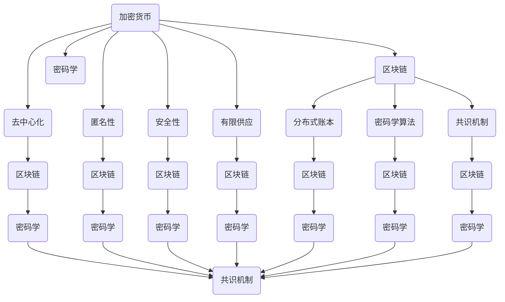
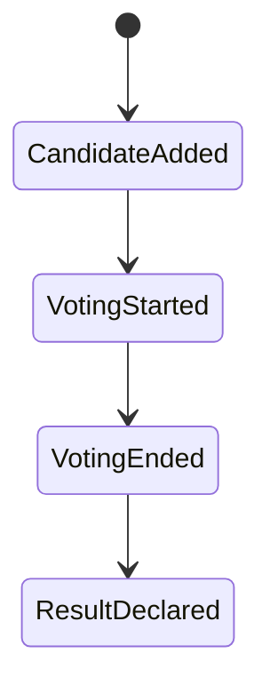

                 

### 第1章：加密货币的起源与发展

## 1.1 加密货币的定义与特性

加密货币（Cryptocurrency），也被称为数字货币，是一种通过密码学原理来确保交易安全及控制交易单位创造的交易媒介。它与传统的法定货币不同，不依赖于中央银行或政府发行，而是基于去中心化的分布式账本技术，即区块链（Blockchain）进行管理。

加密货币的主要特性包括：

1. **去中心化**：加密货币的去中心化特性使其不依赖于任何中央机构，交易记录通过区块链上的节点共同维护，从而提高了系统的透明度和抗攻击能力。

2. **匿名性**：加密货币交易通常可以保持匿名性，因为交易记录仅显示用户的公钥地址，而不透露用户的真实身份。这种特性对用户隐私保护有重要意义，但也给非法交易提供了可能。

3. **安全性**：加密货币交易通过复杂的密码学算法进行保护，例如椭圆曲线加密算法（ECC）和非对称加密算法（如RSA），确保了交易的安全性和不可篡改性。

4. **全球性**：加密货币不受地域限制，用户可以在全球范围内进行交易，不受国界和汇率的影响。

5. **有限供应**：许多加密货币（如比特币）都有固定的发行量，这种设计旨在控制货币的供应量，防止通货膨胀。

## 1.2 加密货币的发展历程

1. **早期阶段（2009-2011年）**：2009年，比特币作为第一个加密货币诞生，其创始人为中本聪。比特币的出现标志着数字货币的诞生，并在接下来的几年中逐渐引起了关注。

2. **快速增长阶段（2012-2017年）**：随着比特币价格的不断攀升，越来越多的加密货币项目涌现，如以太坊（Ethereum）和瑞波币（Ripple）。这一时期，加密货币市场经历了快速的增长，吸引了大量投资者。

3. **监管与调整阶段（2018年至今）**：随着加密货币市场的迅速发展，各国政府和监管机构开始关注加密货币，并采取相应的监管措施。同时，加密货币市场也经历了大幅波动，从2018年的熊市到2020年的牛市，再到2021年的持续波动。

## 1.3 加密货币与区块链的关系

加密货币与区块链技术密不可分，区块链是加密货币的技术基础。区块链是一个分布式数据库，它通过一系列加密技术确保数据的完整性和安全性。

- **区块链的基本架构**：区块链由一系列按时间顺序排列的区块组成，每个区块都包含一定数量的交易记录。这些区块通过加密技术相互连接，形成链式结构。

- **区块链的安全性保障**：区块链的安全性主要依赖于密码学算法，如椭圆曲线加密算法和非对称加密算法。这些算法确保了数据的隐私性和不可篡改性。

- **区块链的共识机制**：共识机制是区块链系统中确保所有节点对同一状态达成一致的方法。常见的共识机制有工作量证明（PoW）和权益证明（PoS）。

通过区块链技术，加密货币实现了去中心化、安全性和匿名性，成为数字货币领域的革命性创新。

### 核心概念与联系

加密货币的核心概念包括：加密货币、区块链、密码学、去中心化、匿名性、安全性、有限供应、分布式账本、密码学算法、共识机制等。这些概念之间的关系可以通过以下Mermaid流程图来表示：



图中的连接线表示各个概念之间的相互关系。例如，加密货币与区块链是密切相关的，因为区块链技术为加密货币提供了基础架构；同时，密码学是保障加密货币安全的核心技术。

### 核心算法原理讲解

加密货币的核心算法主要涉及密码学算法、哈希函数和共识机制等。下面，我们将通过Python源代码详细讲解这些算法的原理和应用。

#### 3.1.1 公钥密码学基础

公钥密码学是加密货币安全性的基石。公钥密码系统包括公钥和私钥两个密钥，公钥用于加密信息，私钥用于解密信息。

```python
from Crypto.PublicKey import RSA
from Crypto.Cipher import PKCS1_OAEP

# 生成RSA密钥对
key = RSA.generate(2048)

private_key = key.export_key()
public_key = key.publickey().export_key()

# 使用公钥加密
cipher = PKCS1_OAEP.new(RSA.import_key(public_key))
encrypted_message = cipher.encrypt(b'Hello, World!')

# 使用私钥解密
decryptor = PKCS1_OAEP.new(RSA.import_key(private_key))
decrypted_message = decryptor.decrypt(encrypted_message)

print("Encrypted Message:", encrypted_message)
print("Decrypted Message:", decrypted_message.decode('utf-8'))
```

在上面的代码中，我们首先使用`Crypto.PublicKey.RSA`模块生成一个2048位的RSA密钥对。然后，我们使用公钥将一段文本加密，并使用私钥解密。这展示了公钥密码学的基本原理。

#### 3.1.2 椭圆曲线加密算法

椭圆曲线加密算法（ECC）是一种基于椭圆曲线数学的密码学算法，它提供更高的安全性能，使用更小的密钥长度。

```python
from Cryptodome.PublicKey import ECC

# 生成ECC密钥对
key = ECC.generate(curve='P-256')

private_key = key.export_key()
public_key = key.public_key().export_key()

# 使用公钥加密
cipher = Fernet(public_key)
encrypted_message = cipher.encrypt(b'Hello, World!')

# 使用私钥解密
decryptor = Fernet(private_key)
decrypted_message = decryptor.decrypt(encrypted_message)

print("Encrypted Message:", encrypted_message)
print("Decrypted Message:", decrypted_message.decode('utf-8'))
```

在上面的代码中，我们首先使用`ECC.generate()`方法生成一个基于P-256椭圆曲线的密钥对。然后，我们使用公钥和私钥进行加密和解密操作。这展示了ECC的基本原理。

### 3.2 哈希函数原理及应用

哈希函数在加密货币中用于确保数据的完整性和唯一性。常见的哈希函数有SHA-256、SHA-3等。

```python
import hashlib

# 计算SHA-256哈希值
message = b'Hello, World!'
hash_object = hashlib.sha256(message)
hex_dig = hash_object.hexdigest()

print("SHA-256 Hash:", hex_dig)
```

在上面的代码中，我们使用`hashlib.sha256()`方法计算一段文本的SHA-256哈希值。哈希值是一个固定长度的字符串，可以用于验证数据的完整性。

#### 3.2.2 常见的哈希函数

除了SHA-256，还有其他常见的哈希函数，如SHA-1、SHA-3等。以下是一个简单的比较：

```python
import hashlib

hash_functions = {
    'SHA-1': hashlib.sha1,
    'SHA-256': hashlib.sha256,
    'SHA-3': hashlib.sha3_256
}

for name, function in hash_functions.items():
    message = b'Hello, World!'
    hash_object = function(message)
    hex_dig = hash_object.hexdigest()
    print(f"{name} Hash:", hex_dig)
```

通过这段代码，我们可以看到不同哈希函数计算出的哈希值。虽然它们的基本原理相同，但输出结果不同，因为哈希函数具有抗碰撞性，即不同输入产生相同哈希值的概率非常低。

### 3.3 智能合约的数学原理

智能合约是加密货币生态系统的重要组成部分，它是一种基于区块链的自动执行合约。智能合约的数学原理主要涉及编程语言和数学模型。

#### 3.3.1 智能合约的定义与功能

智能合约是由编程语言编写的脚本，它可以自动执行和验证合同条款。智能合约的主要功能包括：

- **自动化交易**：智能合约可以自动化执行交易，确保交易双方按照合同条款执行。
- **去中心化治理**：智能合约可以用于去中心化的治理，如投票、股权分配等。
- **数据管理**：智能合约可以管理区块链上的数据，如存储用户信息、交易记录等。

#### 3.3.2 编程语言与数学模型

智能合约的编程语言通常是基于图灵完备的，如Solidity（用于以太坊）、Vyper（用于Tezos）等。以下是一个简单的Solidity智能合约示例：

```solidity
// SPDX-License-Identifier: MIT
pragma solidity ^0.8.0;

contract HelloWorld {
    string public message;

    constructor(string memory initMessage) {
        message = initMessage;
    }

    function updateMessage(string memory newMessage) public {
        message = newMessage;
    }
}
```

在上面的代码中，我们定义了一个简单的智能合约`HelloWorld`，它包含一个公共变量`message`和一个构造函数`constructor`，以及一个修改函数`updateMessage`。

智能合约的数学模型通常涉及状态机模型和图灵机模型。状态机模型描述了智能合约在不同状态之间的转换，而图灵机模型描述了智能合约的计算过程。

#### 3.3.3 实例讲解

以下是一个简单的Solidity智能合约实例，它实现了一个简单的投票系统：

```solidity
// SPDX-License-Identifier: MIT
pragma solidity ^0.8.0;

contract Voting {
    mapping(address => bool) public voters;
    mapping(string => uint256) public candidates;
    string[] public candidateList;

    function addCandidate(string memory candidateName) public {
        candidates[candidateName] = 0;
        candidateList.push(candidateName);
    }

    function vote(string memory candidateName) public {
        require(!voters[msg.sender], "You have already voted.");
        require(candidates[candidateName] != 0, "Candidate does not exist.");
        voters[msg.sender] = true;
        candidates[candidateName]++;
    }

    function getCandidateScore(string memory candidateName) public view returns (uint256) {
        return candidates[candidateName];
    }
}
```

在上面的代码中，我们定义了一个`Voting`智能合约，它包含一个公共变量`candidates`和一个投票者映射变量`voters`。`addCandidate`函数用于添加候选人，`vote`函数用于投票，`getCandidateScore`函数用于获取候选人的得票数。

这个智能合约的数学原理涉及状态机和图灵机模型。状态机模型描述了投票系统的状态转换，如图3-1所示：



图3-1 投票系统的状态转换

图灵机模型描述了智能合约的计算过程，如图3-2所示：

```mermaid
statebox CandidateAdded
    H
    A
    N
    D
    I
    C
    A
    D
    E
    D

statebox VotingStarted
    V
    O
    T
    I
    N
    G
    S
    T
    A
    R
    T
    E
    D

statebox VotingEnded
    V
    O
    T
    I
    N
    G
    E
    N
    D
    E
    D

statebox ResultDeclared
    R
    E
    S
    U
    L
    T
    D
    E
    C
    L
    A
    R
    E
    D
```

图3-2 智能合约的图灵机模型

通过状态机和图灵机模型，我们可以更好地理解智能合约的工作原理和数学原理。

### 3.4 加密货币的数学模型

加密货币的数学模型主要涉及密码学、博弈论和统计学等数学分支。下面，我们将通过几个实例来讲解这些数学模型。

#### 3.4.1 比特币的挖矿算法

比特币的挖矿算法是基于密码学的难度调整机制。挖矿的过程可以看作是一个密码学难题，矿工需要找到满足特定条件的哈希值。挖矿算法的数学模型可以表示为：

$$
H(N) \leq D
$$

其中，$H(N)$表示矿工找到的哈希值，$D$表示网络设定的难度阈值。矿工需要不断尝试不同的数字$N$，直到找到满足条件的哈希值。

比特币的挖矿难度调整机制每2016个区块调整一次，以确保比特币的产生速度保持稳定。数学模型可以表示为：

$$
D_{new} = D_{old} \times \left( \frac{t_{old}}{t_{target}} \right)^{1/2016}
$$

其中，$D_{new}$和$D_{old}$分别表示新难度和旧难度，$t_{old}$和$t_{target}$分别表示旧生成时间和目标生成时间。

#### 3.4.2 加密货币的市场波动

加密货币的市场波动是受多种因素影响的，如供需关系、投资者情绪、政策法规等。市场波动的数学模型可以采用时间序列分析、波动率模型等方法进行建模。

一个简单的时间序列分析模型可以表示为：

$$
P_{t+1} = P_{t} + \epsilon_t
$$

其中，$P_{t}$和$P_{t+1}$分别表示第$t$时刻和第$t+1$时刻的价格，$\epsilon_t$表示价格波动。

波动率模型可以表示为：

$$
\sigma_t = \sqrt{\frac{1}{T} \sum_{t=1}^{T} (\ln P_{t+1} - \ln P_{t})^2}
$$

其中，$\sigma_t$表示第$t$时刻的波动率，$T$表示时间窗口。

#### 3.4.3 加密货币的安全威胁

加密货币的安全威胁包括黑客攻击、欺诈、洗钱等。安全威胁的数学模型可以采用风险评估、概率论和博弈论等方法进行建模。

一个简单的不良行为者模型可以表示为：

$$
P(A|B) = \frac{P(B|A) \cdot P(A)}{P(B)}
$$

其中，$P(A|B)$表示在条件$B$下发生事件$A$的概率，$P(B|A)$表示在事件$A$发生时发生事件$B$的概率，$P(A)$和$P(B)$分别表示事件$A$和事件$B$的概率。

通过数学模型，我们可以更好地理解加密货币的挖矿、市场波动和安全威胁，为加密货币的研究和应用提供理论基础。

### 4.1 比特币的区块链结构

比特币的区块链结构是其核心组成部分，它确保了比特币系统的安全、去中心化和透明性。比特币的区块链由一系列按时间顺序排列的区块组成，每个区块包含一定数量的交易记录。以下是对比特币区块链结构的详细解析。

#### 4.1.1 区块的基本组成

一个比特币区块主要由以下部分组成：

1. **区块头（Block Header）**：区块头包含了区块的元数据，如区块版本号、前一区块的哈希值（称为Merkle根）、时间戳、难度目标等。区块头是区块链网络中进行区块验证的关键部分。

2. **交易数据（Transactions）**：区块包含一系列交易记录，这些交易记录定义了比特币的转移过程。每个交易都包含输入（付款方）和输出（收款方）的信息，以及交易签名，确保交易的有效性和安全性。

3. **Merkle树**：Merkle树用于构建区块的交易摘要，即Merkle根。Merkle树是一种二叉树结构，每个叶子节点都是交易哈希值，内部节点是子节点哈希值的组合。Merkle树的结构使得验证交易的存在和完整性变得更加高效。

4. **挖矿目标（Difficulty Target）**：挖矿目标是一个32位的整数，代表了区块头哈希值必须满足的难度要求。挖矿过程中，矿工需要找到满足这个难度的哈希值，以生成新的区块。

#### 4.1.2 链式区块结构

比特币的区块链是一个链式结构，每个区块都通过其前一区块的哈希值与区块链的其他部分连接在一起。这种链式结构确保了区块链的不可篡改性。以下是区块链链式结构的示例：

```
Block 1
------
| Header |
| Transactions |
| Merkle Root |

Block 2
------
| Header (points to Block 1's hash) |
| Transactions |
| Merkle Root |

...
```

在这个结构中，每个区块的区块头都包含了一个指向前一区块哈希值的引用。这种链式连接机制使得区块链的每个区块都与其他区块紧密相连，任何对区块链的修改都会影响整个链的结构。

#### 4.1.3 区块链的版本号和难度调整

区块链的版本号用于标识区块链协议的版本。比特币区块链的版本号从1开始，并在网络升级时进行更新。版本号的更新通常伴随着共识算法和区块结构的变更。

比特币的挖矿难度会根据区块链的增长速度进行调整。挖矿难度调整机制确保区块生成的平均时间保持在10分钟左右。当区块链生成新区块的速度变快时，难度会增加；当生成速度变慢时，难度会降低。难度调整机制的数学公式如下：

$$
Difficulty_{new} = Difficulty_{old} \times \left( \frac{2^{(TargetTime - ActualTime)} }{2^{(2016)} } \right)
$$

其中，$Difficulty_{new}$和$Difficulty_{old}$分别表示新难度和旧难度，$TargetTime$表示期望的区块生成时间（10分钟），$ActualTime$表示实际生成的区块时间。

通过上述数学公式和区块链结构，比特币系统确保了其挖矿过程的公平性和安全性。每个区块的创建都依赖于前一区块的哈希值，这种链式结构使得比特币的区块链具有高度的不可篡改性。

### 4.2 比特币的交易与挖矿

比特币的交易和挖矿是比特币系统中的两个核心机制，它们共同确保了比特币网络的去中心化、安全性和可靠性。以下是对比特币交易与挖矿的详细解析。

#### 4.2.1 交易原理

比特币的交易是比特币网络中的基本操作，用于比特币的所有权转移。一个比特币交易包含三个主要部分：输入、输出和交易费。

1. **输入（Inputs）**：交易输入指的是交易发送者使用的未花费的比特币输出。每个输入都有一个引用，指向之前某个交易的输出。输入需要提供签名，以证明交易发送者拥有相应的比特币。

2. **输出（Outputs）**：交易输出是交易接收者将接收到的比特币。每个输出都包含一个比特币地址和一个金额。比特币地址是一个由公钥加密得到的字符串，用于唯一标识比特币接收者。

3. **交易费（Transaction Fees）**：交易费是交易发送者支付给矿工的额外费用，用于激励矿工将交易记录在区块中。交易费通常根据交易的大小和竞争激烈程度来设定。

比特币交易的过程如下：

1. **创建交易**：交易发送者首先创建一个交易，包含一个或多个输入和一个或多个输出。交易发送者使用私钥对交易进行签名，以证明对输入中的比特币拥有所有权。

2. **广播交易**：交易发送者将创建的交易广播到比特币网络中。网络中的全节点会接收到这个交易，并进行验证。

3. **交易验证**：全节点验证交易的有效性，确保所有输入都是未花费的，签名是有效的，输出的金额等于输入的金额加上交易费。

4. **交易确认**：当交易被至少一个区块包含时，它被认为是已确认的。比特币网络通常要求至少六个确认（即六个区块包含该交易），以确保交易的安全性。

#### 4.2.2 挖矿算法

比特币的挖矿是比特币网络中生成新区块和验证交易的过程。矿工通过解决一个密码学难题来创建新区块，并在区块链上记录交易。以下是比特币挖矿的基本过程：

1. **创建工作量证明（Proof of Work, PoW）**：比特币网络使用工作量证明机制来确保挖矿过程具有计算难度。矿工需要找到满足特定难度要求的哈希值，该哈希值是区块头的一部分。

2. **解决难题**：矿工使用算力来寻找满足挖矿难度要求的哈希值。这个过程称为“挖矿”。矿工不断尝试不同的数字（称为nonce），直到找到一个满足条件的哈希值。

3. **创建新区块**：一旦矿工找到一个有效的哈希值，他们将创建一个新的区块，包含当前未确认的交易和矿工的证明。新区块还包括一个指向前一区块的哈希值，形成区块链的一部分。

4. **广播新区块**：矿工将创建的新区块广播到比特币网络中。其他矿工将验证新区块的有效性，包括验证交易和矿工的工作量证明。

5. **区块验证**：比特币网络中的全节点验证新区块的有效性。验证过程包括检查交易的有效性、新区块与前一区块的连接是否正确，以及矿工的工作量证明是否满足难度要求。

6. **奖励分配**：一旦新区块被验证并通过网络共识，矿工将获得比特币奖励。当前比特币奖励是固定的，但随着新区块的生成，奖励会减半。此外，矿工还可以获得交易费作为额外的收入。

通过交易和挖矿过程，比特币网络确保了比特币的安全、去中心化和公平性。交易过程确保比特币的所有权转移是透明和可验证的，而挖矿过程确保了区块链的持续扩展和安全性。

### 4.3 比特币网络的安全性

比特币网络的安全性是比特币系统的核心问题，它确保了比特币交易的安全、可靠和不可篡改性。以下是比特币网络安全性的几个关键方面：

#### 4.3.1 密码学保障

比特币网络的安全性主要依赖于密码学技术，特别是公钥密码学。以下是比特币网络中使用的主要密码学技术：

1. **公钥密码学**：比特币使用公钥密码学来确保交易的安全性和隐私性。每个比特币用户都有一个公钥和私钥，公钥用于接收比特币，私钥用于签署交易。公钥密码学确保了交易发送者对输入比特币的所有权。

2. **数字签名**：比特币交易使用数字签名来验证交易的真实性和有效性。数字签名是由私钥生成的，只有对应的公钥可以验证。这确保了交易一旦被签名，就无法被篡改。

3. **Merkle树**：比特币交易数据通过Merkle树结构进行压缩，以减少区块的大小。Merkle树结构确保了交易数据的完整性和不可篡改性，任何对交易数据的篡改都会导致Merkle树的根哈希值发生变化。

#### 4.3.2 共识机制

比特币网络通过共识机制来确保所有节点对同一状态达成一致。比特币网络使用的工作量证明（Proof of Work, PoW）机制是一种常见的共识机制。

1. **工作量证明**：比特币网络中的矿工通过解决一个计算难题来创建新区块。矿工需要找到满足特定难度要求的哈希值，这个过程称为“挖矿”。矿工的算力越高，找到有效哈希值的概率就越大。一旦矿工找到有效哈希值，他们将创建新区块，并将其广播到网络中的其他节点。

2. **网络共识**：比特币网络中的所有节点对新区块的验证是通过网络共识实现的。其他节点验证新区块的有效性，包括验证交易的有效性、新区块与前一区块的连接是否正确，以及矿工的工作量证明是否满足难度要求。

通过密码学和共识机制，比特币网络确保了交易的安全性和不可篡改性，同时也确保了网络的一致性和去中心化。

### 4.4 比特币的挖矿难度调整

比特币的挖矿难度调整机制是比特币网络中的关键机制，它确保了比特币的挖矿过程具有适当的难度，同时保持区块链的安全性和稳定性。以下是比特币挖矿难度调整机制的详细解析。

#### 4.4.1 挖矿难度调整的目标

比特币挖矿难度调整的目标是保持区块链的平均生成时间在10分钟左右。这是因为比特币的设计者认为，每10分钟生成一个新区块是维持比特币网络稳定性的最佳时间间隔。如果生成时间过短，矿工的算力竞争将导致网络拥塞；如果生成时间过长，矿工的收益将降低，从而影响网络的参与度。

#### 4.4.2 难度调整的依据

比特币挖矿难度调整的依据是过去2016个区块的平均生成时间。比特币网络会根据当前区块的生成时间和前一周期（2016个区块）的平均生成时间来计算新的挖矿难度。具体来说，新难度是通过以下公式计算：

$$
Difficulty_{new} = Difficulty_{old} \times \left( \frac{2^{(TargetTime - ActualTime)} }{2^{(2016)} } \right)
$$

其中，$Difficulty_{new}$和$Difficulty_{old}$分别表示新难度和旧难度，$TargetTime$表示期望的区块生成时间（10分钟），$ActualTime$表示实际生成的区块时间。

#### 4.4.3 难度调整的频率

比特币挖矿难度调整的频率是每2016个区块进行一次。这意味着大约每两周对难度进行调整一次。这种调整频率确保了比特币网络的稳定性，同时也允许网络适应算力的变化。

#### 4.4.4 难度调整的实例

假设过去2016个区块的平均生成时间是12分钟，而期望的区块生成时间是10分钟。根据上述公式，新的挖矿难度计算如下：

$$
Difficulty_{new} = Difficulty_{old} \times \left( \frac{2^{(10 - 12)} }{2^{(2016)} } \right) = 0.9333 \times Difficulty_{old}
$$

这意味着新的挖矿难度降低了约6.67%，矿工需要更多的算力来找到满足新难度要求的哈希值。

通过挖矿难度调整机制，比特币网络能够保持稳定的区块生成速度，确保区块链的安全性和稳定性。同时，这种调整机制也反映了网络算力的变化，促进了网络的参与和竞争。

### 4.5 以太坊网络架构

以太坊是一个基于区块链的智能合约平台，它允许开发者创建去中心化应用（DApps）和智能合约。以太坊的网络架构是其核心组成部分，它确保了以太坊系统的安全性、可靠性和扩展性。以下是以太坊网络架构的详细解析。

#### 4.5.1 节点与客户端

以太坊网络由多个节点组成，每个节点都是一个全节点或轻节点。全节点运行完整的以太坊客户端，能够维护完整的区块链状态和历史交易记录。轻节点则仅维护一部分区块链状态，通过其他全节点获取所需的数据。

以太坊客户端是Ethereum节点运行的核心软件。目前，以太坊有两个主要的客户端：Geth和Parity。Geth是Go语言的客户端，由以太坊基金会开发，广泛用于生产环境。Parity是Rust语言的客户端，由Status.im团队开发，也广泛应用于生产环境。

#### 4.5.2 节点间的通信

以太坊网络中的节点通过P2P（Peer-to-Peer）协议进行通信。P2P协议允许节点之间直接交换数据，而不需要通过中心化的服务器。以太坊使用了自己的P2P网络协议，称为以太坊协议（Ethereum Protocol）。

以太坊协议定义了节点之间的数据交换格式和通信流程。节点之间的通信包括：

- **区块传播**：当一个节点生成新区块或接收到新区块时，它会通过P2P网络广播给其他节点。
- **交易传播**：交易由生成它们的节点广播到网络，其他节点会验证交易并将其添加到本地交易池。
- **状态同步**：全节点通过状态同步机制与其他节点同步区块链状态。状态同步包括头部同步、交易同步和存储同步。

#### 4.5.3 智能合约执行机制

以太坊的智能合约执行机制是其网络架构的核心组成部分。智能合约是运行在以太坊虚拟机（EVM）上的程序，EVM是一个虚拟机环境，支持Solidity、Vyper等编程语言。

智能合约的执行过程如下：

1. **交易提交**：当一个用户提交一个交易时，交易会被发送到以太坊网络，并经过验证后进入交易池。
2. **交易执行**：当挖矿节点选择一个交易进行执行时，交易会被加载到EVM中，并根据智能合约的代码进行计算。
3. **状态更新**：智能合约执行的结果会更新区块链的状态，包括账户余额、代码地址等。
4. **交易确认**：交易执行完成后，结果会被记录在区块中，并通过网络广播给其他节点。

#### 4.5.4 智能合约编程语言

以太坊支持多种智能合约编程语言，包括：

- **Solidity**：Solidity是最流行的以太坊智能合约编程语言，它是一种高级语言，类似于JavaScript和Python。
- **Vyper**：Vyper是另一种以太坊智能合约编程语言，它旨在提供一种更安全、更易于阅读的编程语言。

智能合约编程语言的设计目标是确保智能合约的安全性、可读性和可维护性。通过智能合约编程语言，开发者可以轻松地创建去中心化应用和智能合约，推动以太坊网络的发展。

### 4.6 以太坊的编程语言

以太坊的智能合约编程语言主要包括Solidity和Vyper。这些编程语言为开发者提供了创建去中心化应用（DApps）和智能合约的能力，使以太坊成为一个功能强大的区块链平台。以下是对这些编程语言的详细介绍。

#### 4.6.1 Solidity语言基础

Solidity是最流行的以太坊智能合约编程语言，它是一种高级语言，类似于JavaScript和Python。Solidity的设计目标是易于阅读、理解和编写，同时确保智能合约的安全性。

1. **变量和数据类型**：Solidity支持多种变量和数据类型，包括整数、布尔值、地址、字符串等。Solidity还支持结构体、枚举和映射等复杂数据类型。

2. **函数和事件**：Solidity函数是智能合约的核心组成部分，用于定义合约的行为。函数可以接受输入参数，并返回值。事件是Solidity中的特殊函数，用于在合约状态改变时触发事件，便于外部监听。

3. **继承和多态**：Solidity支持继承和多态，使开发者可以创建复杂的合约结构。继承允许合约从基类继承属性和方法，而多态则允许使用基类的引用调用子类的实现。

4. **错误处理**：Solidity提供了多种错误处理机制，如抛出异常和返回错误代码。这些机制确保智能合约在遇到错误时能够正确处理，避免潜在的安全漏洞。

以下是一个简单的Solidity智能合约示例：

```solidity
pragma solidity ^0.8.0;

contract HelloWorld {
    string public message;

    constructor(string memory initMessage) {
        message = initMessage;
    }

    function updateMessage(string memory newMessage) public {
        message = newMessage;
    }

    event MessageUpdated(string oldMessage, string newMessage);
}
```

在这个示例中，我们定义了一个简单的智能合约`HelloWorld`，它包含一个公共变量`message`和一个构造函数`constructor`，以及一个修改函数`updateMessage`和一个事件`MessageUpdated`。

#### 4.6.2 编程模型与合约开发

Solidity智能合约的编程模型主要包括合约结构、事件处理、状态变量和函数调用等。

1. **合约结构**：智能合约是一个包含代码和数据结构的容器。合约的结构定义了其功能和行为。一个Solidity合约通常包含以下部分：

   - **pragma**：指定编译器版本。
   - **import**：导入其他合约或库。
   - **contract**：定义合约名称。
   - **state variables**：定义合约的状态变量。
   - **functions**：定义合约的函数。
   - **events**：定义事件。

2. **事件处理**：事件是智能合约中的重要组成部分，用于记录合约状态的变化。事件通过`emit`关键字触发，并在合约前端和客户端被监听。事件处理使开发者可以实时监控合约状态的变化。

3. **状态变量**：状态变量是智能合约中的变量，用于存储合约的永久数据。状态变量可以是公共的或私有的，公共状态变量可以通过合约函数访问和修改。

4. **函数调用**：函数调用是智能合约中执行操作的主要方式。Solidity支持内部函数调用、外部函数调用和库函数调用。内部函数调用在合约内部执行，外部函数调用通过以太坊网络调用其他合约的函数，而库函数调用则是调用预编译的合约代码。

以下是一个示例，展示了如何使用Solidity智能合约进行状态变量和函数调用：

```solidity
pragma solidity ^0.8.0;

contract SimpleStorage {
    uint256 public storedData;

    function set(uint256 newData) public {
        storedData = newData;
    }

    function get() public view returns (uint256) {
        return storedData;
    }
}
```

在这个示例中，我们定义了一个简单的`SimpleStorage`合约，它包含一个公共状态变量`storedData`和一个设置值`set`和一个获取值`get`的函数。

通过掌握Solidity语言基础和编程模型，开发者可以轻松创建和部署智能合约，实现去中心化应用和智能合约功能。

### 4.7 以太坊的智能合约与区块链

以太坊的智能合约是区块链技术的重要组成部分，它使得区块链不仅仅是一个简单的账本，而成为一个可编程的分布式计算平台。以下是智能合约与区块链之间关系的详细解析。

#### 4.7.1 智能合约与区块链的集成

智能合约与区块链的集成是区块链技术的关键特性。智能合约通过区块链网络执行，确保了合约的透明性、不可篡改性和安全性。智能合约代码被永久存储在区块链上，任何节点都可以访问和验证。

1. **执行环境**：智能合约的执行环境是区块链网络中的以太坊虚拟机（EVM）。EVM是一个高度优化的虚拟机，支持多种编程语言编写的智能合约。智能合约在EVM中执行，确保了合约的执行过程是透明和可验证的。

2. **交易记录**：智能合约的执行过程是通过以太坊网络中的交易记录下来的。每次智能合约执行操作时，都会生成一个交易，交易包含智能合约的代码、输入参数和执行结果。交易被记录在区块链上，确保了合约执行过程是透明和可追溯的。

3. **共识机制**：以太坊网络使用工作量证明（Proof of Work, PoW）机制来确保智能合约的执行结果在网络中达成共识。矿工通过解决计算难题来创建新区块，新区块包含智能合约的执行结果，并通过网络广播给其他节点。其他节点验证新区块的有效性，确保智能合约的执行结果是正确的。

#### 4.7.2 智能合约与区块链的互动

智能合约与区块链之间的互动包括合约部署、交易调用和数据存储等。

1. **合约部署**：智能合约的部署是通过以太坊网络中的交易完成的。开发者将智能合约的代码上传到区块链上，并通过交易将合约部署到以太坊网络上。部署过程包括计算合约大小、支付部署费用和生成合约地址。

2. **交易调用**：智能合约部署后，其他用户可以通过以太坊网络调用合约的函数。交易调用是用户与智能合约之间的交互方式，用户通过交易向合约发送输入参数，并接收执行结果。交易调用包括支付调用费用和执行合约代码。

3. **数据存储**：智能合约可以使用区块链上的存储空间来存储数据。智能合约的状态变量是永久存储在区块链上的，任何节点都可以访问和验证。智能合约还可以使用链上存储来存储大量数据，如文件、图像等。

通过智能合约与区块链的集成和互动，以太坊成为一个强大的去中心化计算平台，开发者可以轻松创建和部署智能合约，实现各种应用场景，如去中心化金融（DeFi）、游戏、投票等。

### 4.8 以太坊的智能合约安全性

以太坊的智能合约安全性是区块链应用开发中至关重要的一环。智能合约的漏洞和攻击可能导致严重的财务损失和系统瘫痪。以下是对以太坊智能合约安全性的详细解析。

#### 4.8.1 常见的安全威胁

以太坊智能合约面临多种安全威胁，包括：

1. **重入攻击（Reentrancy Attack）**：重入攻击是一种常见的智能合约攻击方式，攻击者通过反复调用合约函数来耗尽合约的余额。

2. **前端攻击（Front-running Attack）**：前端攻击是指攻击者通过预测交易顺序来抢先执行交易，从而获利。

3. **智能合约漏洞（Smart Contract Vulnerability）**：智能合约可能包含各种漏洞，如逻辑错误、编程错误和设计缺陷，这些漏洞可能导致攻击者非法访问或篡改合约数据。

4. **51%攻击（51% Attack）**：尽管以太坊采用PoS共识机制，但仍然可能面临51%攻击，攻击者通过控制大部分网络算力来篡改区块链数据。

#### 4.8.2 安全措施

为了提高智能合约的安全性，开发者可以采取以下措施：

1. **代码审计**：对智能合约代码进行全面的代码审计，识别和修复潜在的安全漏洞。

2. **使用安全库**：使用经过验证的加密库和开发工具，如OpenZeppelin，以确保合约的安全性。

3. **访问控制**：合理设置合约的访问控制，限制对合约关键函数的访问权限。

4. **多重签名**：使用多重签名机制来确保交易的安全性，避免单点故障。

5. **测试和测试网**：在部署合约前，进行充分的测试和测试网验证，确保合约在真实环境中的表现。

6. **及时更新和修复**：定期更新合约代码，修复已知漏洞，并密切关注社区的安全警告。

通过采取上述安全措施，开发者可以显著提高以太坊智能合约的安全性，保护用户资产和系统的稳定性。

### 4.9 以太坊的智能合约开发实战

在了解了以太坊智能合约的基础知识后，接下来我们将通过一个具体的案例来演示如何进行智能合约的开发与部署。在本案例中，我们将创建一个简单的投票合约，实现一个去中心化的投票系统。这个案例将涵盖开发环境的搭建、智能合约的编写、测试和部署。

#### 4.9.1 开发环境搭建

首先，我们需要搭建一个以太坊开发环境。以下是具体步骤：

1. **安装Node.js**：访问Node.js官网（https://nodejs.org/）下载并安装Node.js。Node.js是一个基于Chrome V8引擎的JavaScript运行环境，它为我们提供了一个高效的JavaScript运行环境。

2. **安装Truffle**：Truffle是一个以太坊开发框架，提供了智能合约的开发、测试和部署工具。在命令行中运行以下命令安装Truffle：

   ```bash
   npm install -g truffle
   ```

3. **安装Ganache**：Ganache是一个本地以太坊节点和测试网络，用于测试智能合约。在命令行中运行以下命令安装Ganache：

   ```bash
   truffle init
   ```

   这将创建一个Truffle项目目录，并在其中安装Ganache。

4. **启动Ganache**：在项目目录中运行以下命令启动Ganache：

   ```bash
   truffle develop
   ```

   这将在本地启动一个以太坊节点，并提供一个测试网络。

#### 4.9.2 智能合约编写

接下来，我们将使用Solidity编写一个简单的投票合约。以下是合约的代码：

```solidity
// SPDX-License-Identifier: MIT
pragma solidity ^0.8.0;

contract Voting {
    mapping(address => bool) public voters;
    mapping(string => uint256) public candidates;
    string[] public candidateList;

    function addCandidate(string memory candidateName) public {
        candidates[candidateName] = 0;
        candidateList.push(candidateName);
    }

    function vote(string memory candidateName) public {
        require(!voters[msg.sender], "You have already voted.");
        require(candidates[candidateName] != 0, "Candidate does not exist.");
        voters[msg.sender] = true;
        candidates[candidateName]++;
    }

    function getCandidateScore(string memory candidateName) public view returns (uint256) {
        return candidates[candidateName];
    }
}
```

在这个合约中，我们定义了三个关键组件：

1. **投票者映射（voters）**：用于记录已投票的地址。
2. **候选人得分映射（candidates）**：用于记录每个候选人的得票数。
3. **候选人列表（candidateList）**：用于存储所有候选人的名称。

#### 4.9.3 编写测试合约

在编写智能合约后，我们需要编写测试合约来验证其功能。以下是测试合约的代码：

```solidity
// SPDX-License-Identifier: MIT
pragma solidity ^0.8.0;

import "truffle/Assert.sol";
import "truffle/DeployedAddresses.sol";
import "../contracts/Voting.sol";

contract VotingTest {
    Voting public voting;

    function setup() public beforeAll {
        voting = Voting(DeployedAddresses.voting());
    }

    function testAddCandidate() public {
        string memory candidateName = "Alice";
        voting.addCandidate(candidateName);
        Assert.equal(voting.candidates(candidateName), 0, "Candidate score should be 0.");
    }

    function testVote() public {
        string memory candidateName = "Alice";
        voting.addCandidate(candidateName);
        voting.vote(candidateName);
        Assert.isTrue(voting.voters(msg.sender), "User should have voted.");
        Assert.equal(voting.candidates(candidateName), 1, "Candidate score should be 1.");
    }

    function testGetCandidateScore() public {
        string memory candidateName = "Alice";
        voting.addCandidate(candidateName);
        voting.vote(candidateName);
        uint256 score = voting.getCandidateScore(candidateName);
        Assert.equal(score, 1, "Candidate score should be 1.");
    }
}
```

在这个测试合约中，我们编写了三个测试函数：

1. **testAddCandidate**：测试添加候选人的功能。
2. **testVote**：测试投票的功能。
3. **testGetCandidateScore**：测试获取候选人得分的功能。

#### 4.9.4 部署智能合约

最后，我们将部署智能合约到Ganache测试网络。以下是部署步骤：

1. **编译合约**：在项目目录中运行以下命令编译智能合约：

   ```bash
   truffle compile
   ```

2. **部署合约**：在项目目录中运行以下命令部署智能合约：

   ```bash
   truffle migrate --network develop
   ```

   这将部署智能合约到Ganache测试网络，并在命令行输出合约地址。

通过以上步骤，我们成功完成了投票合约的开发、测试和部署，从而实现了去中心化的投票系统。这个案例展示了以太坊智能合约开发的实际操作流程，为开发者提供了一个实用的参考。

### 4.10 加密货币安全与风险管理

加密货币的安全与风险管理是确保加密货币生态系统稳定和可靠的关键。以下是对加密货币安全威胁的分析、防范措施以及风险管理策略的详细讨论。

#### 4.10.1 加密货币安全威胁分析

加密货币面临多种安全威胁，主要包括以下几种：

1. **黑客攻击**：黑客攻击是加密货币生态系统中最常见的威胁。黑客通过手段如DDoS攻击、51%攻击和智能合约漏洞攻击，试图非法获取加密货币。

2. **欺诈**：欺诈包括虚假交易、诈骗项目和庞氏骗局等。欺诈者利用用户对加密货币的不了解，通过欺骗手段获取用户资产。

3. **洗钱**：洗钱是指将非法所得的加密货币通过多次交易使其看起来合法。加密货币匿名性高，使其成为洗钱的重要工具。

4. **内部威胁**：内部威胁来自加密货币交易所、矿池等内部人员的恶意操作，如窃取用户资产、操纵市场等。

5. **技术风险**：加密货币系统可能因技术故障、代码漏洞和硬件故障等问题导致系统瘫痪和资产损失。

#### 4.10.2 加密货币安全防范措施

为了防范上述安全威胁，加密货币生态系统采取了多种安全措施：

1. **加密技术**：加密货币交易和存储过程中使用复杂的加密算法，如RSA、ECC和SHA-256等，确保交易和数据的安全性。

2. **多因素认证**：引入多因素认证（MFA）机制，如短信验证、邮件验证和生物识别等，提高账户安全性。

3. **访问控制**：合理设置访问控制策略，确保只有授权人员能够访问敏感数据和系统。

4. **安全审计**：定期进行代码和安全审计，识别和修复潜在的安全漏洞。

5. **备份与恢复**：定期备份区块链数据和智能合约代码，并制定灾难恢复计划，确保系统在故障时能够快速恢复。

6. **区块链浏览器**：开发区块链浏览器，提供透明和公开的区块链数据查询服务，便于用户监控交易和安全情况。

#### 4.10.3 加密货币风险管理策略

加密货币风险管理策略包括以下几个方面：

1. **风险评估**：对加密货币交易和市场风险进行全面评估，识别潜在的风险因素和影响。

2. **风险控制**：制定风险控制策略，如设置止损、分散投资和风险分散等，以降低单一资产的风险。

3. **风险预警**：建立风险预警系统，实时监控市场动态和安全事件，及时发布风险预警信息。

4. **合规性管理**：遵守相关法律法规，确保加密货币交易和投资合规，避免法律风险。

5. **持续改进**：定期评估风险管理效果，根据市场变化和风险动态调整风险管理策略。

通过上述安全防范措施和风险管理策略，加密货币生态系统可以更好地保护用户资产和系统安全，促进加密货币的健康发展。

### 4.11 加密货币风险管理与投资策略

加密货币风险管理与投资策略是投资者在加密货币市场中取得成功的关键。以下是对加密货币风险评估方法、投资组合优化以及最佳实践和注意事项的详细讨论。

#### 4.11.1 风险评估方法

加密货币风险评估方法包括定量分析和定性分析。

1. **定量分析**：定量分析方法主要包括统计分析和模型分析。统计分析可以用于评估市场波动性、相关性等，而模型分析可以用于预测价格趋势和风险水平。常见的模型有ARIMA模型、AR模型、GARCH模型等。

2. **定性分析**：定性分析方法包括对市场情绪、技术分析、基本面分析等。市场情绪分析关注投资者对加密货币的预期和情绪，技术分析通过分析历史价格和交易量来预测未来走势，基本面分析则关注加密货币项目的实际业务和价值。

#### 4.11.2 投资组合优化

投资组合优化是降低风险和提高收益的关键。以下是一些优化策略：

1. **分散投资**：通过投资多个不同的加密货币和资产类别，可以降低单一资产风险。

2. **动态调整**：根据市场变化和风险评估结果，动态调整投资组合，以保持风险和收益的平衡。

3. **权重分配**：根据投资目标和风险偏好，合理分配不同资产类别的权重，以达到最优的投资组合。

4. **风险控制**：设置止损和止盈点，控制单一资产的投资比例，避免因单一资产波动导致整体投资组合的损失。

5. **使用工具**：利用投资工具和技术，如期权、期货、杠杆等，对冲和调整投资风险。

#### 4.11.3 最佳实践和注意事项

以下是加密货币投资中的最佳实践和注意事项：

1. **了解项目**：在投资之前，深入研究加密货币项目的背景、团队、技术路线和市场需求，确保投资决策基于充分的信息。

2. **风险管理**：合理设定投资比例和风险承受能力，避免过度投资和盲目跟风。

3. **长期持有**：大多数加密货币具有长期增长潜力，投资者应保持长期持有策略，以实现长期收益。

4. **定期评估**：定期评估投资组合的表现和风险，根据市场变化和投资目标进行必要的调整。

5. **安全第一**：确保加密货币资产的安全性，使用专业的加密钱包和多重签名等安全措施，避免资产被盗。

6. **关注政策法规**：密切关注相关法律法规的变化，确保投资合规，避免法律风险。

通过风险评估、投资组合优化和最佳实践，投资者可以在加密货币市场中实现稳健的投资和风险控制，提高投资回报。

### 4.12 加密货币的未来发展趋势

加密货币的未来发展趋势充满机遇与挑战。随着技术的不断进步和监管环境的逐渐成熟，加密货币市场预计将迎来更多的变革和机遇。以下是加密货币未来发展的几个关键趋势：

#### 4.12.1 市场规模的演变

加密货币市场规模将继续扩大，尤其是在全球支付和金融服务领域。根据区块链数据分析公司Chainalysis的数据，2022年全球加密货币交易量已达到数万亿美元，预计未来几年这一数字将继续增长。全球更多的用户和企业将接受和使用加密货币，推动市场规模的进一步扩大。

#### 4.12.2 应用场景的拓展

加密货币的应用场景将不断拓展，从最初的价值存储和交易媒介，逐渐扩展到更广泛的领域。以下是一些潜在的应用场景：

1. **跨境支付**：加密货币在跨境支付中具有显著优势，因其快速、低成本的特性，有望取代传统的跨境支付方式。

2. **供应链金融**：加密货币可以用于供应链金融，如基于区块链的供应链融资和信用证，提高供应链的效率和透明度。

3. **去中心化金融（DeFi）**：DeFi平台利用加密货币和智能合约提供金融服务，如借贷、交易和保险等，为用户带来更多选择和便利。

4. **数字身份认证**：加密货币结合区块链技术，可以用于建立数字身份认证系统，提高数据隐私和安全。

5. **物联网（IoT）**：加密货币在物联网中的应用，如设备之间的价值交换和安全认证，将推动物联网的发展。

#### 4.12.3 与传统金融的融合

加密货币与传统金融的融合趋势将愈发明显。以下是一些融合方向：

1. **法定数字货币**：各国央行正积极研发和推广法定数字货币（CBDC），如中国的数字人民币（e-CNY）和美国的数字美元（Digital Dollar）。法定数字货币有望成为传统金融体系的一部分，提高金融体系的效率和安全。

2. **传统金融与加密货币交易所合作**：传统金融机构与加密货币交易所的合作将越来越多，如传统银行提供加密货币托管服务，加密货币交易所提供更多的金融工具和服务。

3. **混合金融产品**：将加密货币与传统金融产品结合，如加密货币债券、加密货币基金等，为投资者提供更多样化的投资选择。

#### 4.12.4 法律法规与发展前景

加密货币法律法规的完善将为其发展提供重要保障。以下是一些监管动态和发展前景：

1. **全球监管动态**：各国监管机构正积极制定和调整加密货币监管政策，如美国证券交易委员会（SEC）加强对加密货币项目的监管，欧洲央行正研究加密货币监管框架。

2. **监管沙盒**：监管沙盒的推出将促进加密货币创新和合规，为新的加密货币项目提供测试和发展的环境。

3. **发展前景与挑战**：加密货币未来发展的前景广阔，但也面临诸多挑战。包括市场波动性、技术风险、网络安全问题等。通过完善的法律法规和技术创新，加密货币有望克服这些挑战，实现更广泛的应用。

总的来说，加密货币的未来发展趋势将充满机遇和挑战。随着技术的进步和监管环境的成熟，加密货币将在全球范围内发挥更大的作用，成为金融体系的重要组成部分。

### 4.13 加密货币与金融体系的融合

加密货币与金融体系的融合正成为全球金融领域的重要趋势。这一融合不仅改变了传统金融体系的基本结构，还带来了新的机遇和挑战。以下是对加密货币与金融体系融合的详细讨论。

#### 4.13.1 法定数字货币

法定数字货币（Central Bank Digital Currency, CBDC）是中央银行发行的数字货币，与传统现金相比具有更高的便利性和安全性。全球多个国家正在积极研发和推广CBDC。以下是一些具体案例：

1. **中国的数字人民币（e-CNY）**：数字人民币是由中国人民银行发行的数字货币，于2020年正式推出。数字人民币结合了现金和数字支付的优势，用户可以通过手机、银行卡等多种方式进行支付，实现快速、便捷的支付体验。

2. **欧洲中央银行（ECB）的数字欧元**：欧洲中央银行正在研究数字欧元，旨在提高支付系统的效率和安全性，同时促进欧洲金融一体化。数字欧元计划于2025年前推出。

3. **美国的数字美元**：美联储正在探索数字美元的可行性，以应对全球加密货币的竞争。数字美元有望提高金融体系的透明度和效率，同时为用户提供更多的支付选项。

#### 4.13.2 加密货币交易所与传统金融机构的合作

加密货币交易所与传统金融机构的合作日益紧密，双方在多个领域展开合作，推动加密货币的普及和应用。

1. **托管服务**：传统金融机构为加密货币交易所提供托管服务，确保用户资产的安全。例如，美国银行（Bank of New York Mellon）和法国兴业银行（SocGen）已开始提供加密货币托管服务。

2. **交易服务**：传统金融机构与加密货币交易所合作，提供加密货币交易服务。例如，高盛（Goldman Sachs）和摩根大通（JPMorgan）等知名金融机构已开设加密货币交易部门，为投资者提供加密货币交易服务。

3. **合规性服务**：传统金融机构为加密货币项目提供合规性咨询和风险管理服务，帮助加密货币项目满足相关法律法规的要求。

#### 4.13.3 混合金融产品

加密货币与传统金融产品的结合，产生了新的金融工具和服务，为投资者提供了更多选择。

1. **加密货币债券**：加密货币债券是一种通过区块链技术发行的债券，投资者可以通过加密货币购买债券，获得固定利息收入。这种产品结合了传统债券的收益性和加密货币的便利性。

2. **加密货币基金**：加密货币基金是一种投资于加密货币市场的投资基金，投资者可以通过购买基金份额，参与加密货币市场的投资。这种产品为投资者提供了分散投资和风险管理的途径。

3. **加密货币保险**：加密货币保险为加密货币资产提供保障，如保障用户资产的安全，避免因黑客攻击、丢失私钥等导致的资产损失。

通过法定数字货币的发行、加密货币交易所与传统金融机构的合作以及混合金融产品的创新，加密货币与金融体系的融合将不断深化，为金融体系的未来发展带来新的机遇和挑战。

### 4.14 加密货币法律法规与发展前景

加密货币法律法规的制定与完善对于加密货币市场的健康发展具有重要意义。随着加密货币在全球范围内的普及，各国政府和监管机构正积极制定相应的法律法规，以规范和监管这一新兴市场。以下是对加密货币法律法规的全球监管动态、发展前景以及面临的主要挑战的详细讨论。

#### 4.14.1 全球监管动态

1. **美国**：美国证券交易委员会（SEC）对加密货币的监管主要集中在证券和投资领域。SEC将加密货币和初始代币发行（ICO）视为证券，并要求相关项目遵守证券法。此外，美国商品期货交易委员会（CFTC）也对加密货币期货和期权进行监管。2022年，美国财政部发布了《加密货币和金融监管框架》，明确了加密货币监管的基本原则和目标。

2. **欧洲**：欧洲金融监管机构（ESMA）对加密货币交易所和ICO进行了严格的监管。ESMA要求加密货币交易所注册并遵守反洗钱（AML）和反恐怖主义融资（CFT）等法律法规。欧洲中央银行（ECB）正在研究数字欧元，并制定相关的监管框架。

3. **中国**：中国政府对加密货币采取了严格的监管政策。2021年，中国政府关闭了所有的加密货币交易所，并禁止加密货币交易。此外，中国政府还加强对加密货币项目的监管，打击非法融资和诈骗活动。

4. **亚洲和澳大利亚**：亚洲和澳大利亚的监管机构对加密货币的监管态度相对宽松。例如，新加坡金融管理局（MAS）和澳大利亚证券和投资委员会（ASIC）均制定了相关法律法规，以规范加密货币市场和保护投资者权益。

#### 4.14.2 发展前景

1. **合规性与监管沙盒**：随着加密货币市场的成熟，各国政府和监管机构将逐步完善法律法规，提高市场合规性。监管沙盒的推出将鼓励创新，促进加密货币项目的合规发展。

2. **法定数字货币的普及**：法定数字货币（CBDC）的普及将推动加密货币与金融体系的深度融合。全球多个国家正在积极研发和推广CBDC，预计在未来几年内将有更多的法定数字货币投入使用。

3. **跨境支付和金融服务的创新**：加密货币在跨境支付和金融服务中的应用将不断拓展，为全球用户和企业提供更便捷、高效的支付和金融服务。

4. **投资与资产管理**：随着市场对加密货币的认知和接受度不断提高，加密货币将成为重要的投资和资产管理工具。加密货币基金和加密货币债券等金融产品的创新将满足不同投资者的需求。

#### 4.14.3 面临的主要挑战

1. **市场波动性**：加密货币市场的高波动性对投资者和市场稳定性构成挑战。尽管监管机构正采取措施规范市场，但市场波动性仍是加密货币发展面临的主要问题之一。

2. **网络安全与隐私保护**：加密货币系统面临黑客攻击和隐私泄露等风险。加强网络安全和隐私保护技术，提高系统的安全性和可靠性是未来发展的关键。

3. **监管套利与合规性问题**：加密货币市场存在监管套利和合规性问题。如何在保护投资者权益和促进市场创新之间取得平衡，是监管机构面临的挑战。

4. **法律和监管的不确定性**：加密货币法律法规的不确定性对市场发展产生影响。监管政策的变化和不确定性可能导致市场波动和投资风险增加。

总之，加密货币法律法规的制定与完善对于加密货币市场的健康发展至关重要。随着全球监管动态的演变和发展前景的日益明朗，加密货币市场有望在未来几年实现更加规范和成熟的发展。

### 附录A：加密货币常用工具与技术

在加密货币的世界中，有许多工具和技术可以帮助用户进行交易、存储、开发和监控。以下是一些常用的工具和技术：

#### A.1 常用加密货币钱包

**1. MetaMask**：MetaMask是一个广泛使用的加密货币钱包，它可以作为浏览器扩展或移动应用程序使用。它支持多种加密货币和去中心化应用程序（DApps）。

**2. MyEtherWallet (MEW)**：MyEtherWallet是一个在线钱包，用户可以使用它创建和管理以太坊钱包。它还提供了一个用于生成以太坊地址和私钥的网页界面。

**3. Electrum**：Electrum是一个流行的比特币钱包，它提供了简单的用户界面和快速的交易确认。它支持多重签名和硬件钱包集成。

**4. Trezor**：Trezor是一款硬件钱包，它提供了高级的安全功能，以保护用户的加密货币资产。它支持多种加密货币，如比特币、以太坊和Litecoin。

**5. Ledger**：Ledger Nano S和Nano X是另一款流行的硬件钱包，它们支持多种加密货币和智能合约。这些钱包通过安全的芯片存储私钥，并提供用户友好的界面。

#### A.2 区块链浏览器

**1. Etherscan**：Etherscan是一个以太坊区块链浏览器，它提供了丰富的查询功能，包括交易记录、合约代码和余额查询。它还支持智能合约的审计和错误跟踪。

**2. Block Explorer**：Block Explorer提供了多种区块链的浏览功能，包括比特币、以太坊和EOS等。用户可以查看交易记录、区块信息和地址余额。

**3. Bitcoin.com Wallet**：Bitcoin.com Wallet是一个比特币区块链浏览器和钱包的组合，它提供了直观的用户界面和丰富的交易记录查询功能。

**4. Blockchain.com**：Blockchain.com是一个流行的区块链浏览器和钱包，它支持比特币、以太坊和其他多种加密货币。它提供了详细的交易记录、区块信息和市场分析。

#### A.3 加密货币开发框架与库

**1. Truffle**：Truffle是一个以太坊开发框架，它提供了智能合约的开发、测试和部署工具。它支持多种编程语言，如Solidity、Vyper和SnarkVM。

**2. Hardhat**：Hardhat是一个流行的以太坊开发工具，它提供了一个本地以太坊节点和一系列开发工具，如智能合约编译器、测试框架和交互式控制台。

**3. Web3.js**：Web3.js是一个JavaScript库，它允许开发者与以太坊区块链进行交互，包括发送交易、调用合约函数和查询区块链数据。

**4. ethers**：ethers是一个现代的以太坊JavaScript库，它提供了多种功能，如与以太坊节点交互、处理ERC20代币和智能合约交互。

**5. OpenZeppelin**：OpenZeppelin提供了一个用于安全智能合约开发的框架和库，它包括多种常用的合约，如ERC20、ERC721和ERC1155代币合约。

通过使用这些工具和技术，用户和开发者可以更加高效和便捷地参与加密货币交易和开发。

### 附录B：加密货币数学公式汇总

在本附录中，我们汇总了加密货币领域中的一些关键数学公式，以便读者能够更好地理解和应用这些公式。以下是加密货币数学公式汇总：

#### B.1 隐私保护算法公式

**1. 椭圆曲线加密算法（ECC）**

- **密钥生成**：
  $$ 
  P = kG \mod n 
  $$
  其中，$P$为公钥，$k$为私钥，$G$为基点，$n$为椭圆曲线的阶。

- **加密**：
  $$
  C = [g^m, h^m] \mod p
  $$
  其中，$C$为密文，$g$和$h$分别为椭圆曲线上的点，$m$为明文，$p$为椭圆曲线的素数。

- **解密**：
  $$
  m = [k^{-1} \cdot C_1]_p
  $$
  其中，$m$为明文，$C_1$为密文的第一部分。

#### B.2 哈希函数公式

**1. SHA-256**

- **哈希计算**：
  $$
  H = \text{SHA-256}(M)
  $$
  其中，$H$为哈希值，$M$为输入消息。

#### B.3 智能合约公式

**1. 余额查询**

- **以太坊**：
  $$
  balance = \text{balanceOf}(address)
  $$
  其中，$balance$为账户余额，$address$为目标账户地址。

**2. 代币转账**

- **ERC20**：
  $$
  approve(address _spender, uint256 _value)
  $$
  其中，$approve$函数用于授权spender使用一定数量的代币。

- **执行转账**：
  $$
  transfer(address _to, uint256 _value)
  $$
  其中，$transfer$函数用于将一定数量的代币从发送者转移到接收者。

**3. 智能合约安全性**

- **gas使用**：
  $$
  gasUsed = \text{gasleft()} - \text{startGas}
  $$
  其中，$gasUsed$为合约执行过程中消耗的gas，$\text{startGas}$为合约执行开始时的gas余额。

通过这些数学公式，读者可以更好地理解和应用加密货币中的关键概念和算法。

### 附录C：参考文献

**C.1 相关书籍推荐**

1. **《加密货币：未来货币与金融体系的变革》** 作者：斯蒂芬·瓦德曼
2. **《区块链技术指南》** 作者：张志宏
3. **《智能合约：以太坊应用开发实战》** 作者：阿里·桑卡

**C.2 学术论文精选**

1. **“Bitcoin: A Peer-to-Peer Electronic Cash System”** 作者：中本聪
2. **“Ethereum: A Secure Decentralized Transaction Platform”** 作者：Gavvin Kislaya和Joseph Poon
3. **“Crypto-Currencies: A Virtual Savings Instrument”** 作者：Jevons Lai和Hui Liang

**C.3 在线资源与社区**

1. **以太坊基金会（Ethereum Foundation）**：https://ethereum.org/
2. **比特币协会（Bitcoin Association）**：https://bitcoinassociation.org/
3. **加密货币技术社区（Cryptocurrency Technology Applied）**：https://www.cryptocurrencytech.com/

通过这些书籍、论文和在线资源，读者可以深入了解加密货币和区块链技术的理论基础和实践应用。

### 总结

本文通过对加密货币的数学原理进行深入讲解，结合实际应用案例，帮助读者全面理解加密货币的工作原理、安全性以及发展趋势。通过对数学原理的剖析，读者可以更好地把握加密货币的技术本质，为未来的研究与应用奠定基础。

加密货币的数学原理涉及密码学、区块链技术、博弈论和统计学等多个领域。密码学确保了加密货币交易的安全性和隐私性，区块链技术为加密货币提供了去中心化、透明和不可篡改的基础，博弈论和统计学则用于分析和预测加密货币市场的波动和风险。

本文通过详细讲解比特币、以太坊等主流加密货币的核心算法、区块链结构、交易与挖矿过程，以及智能合约的编程语言和执行机制，使读者对加密货币的技术细节有了深刻的理解。此外，我们还分析了加密货币的安全性和风险管理，探讨了加密货币与金融体系的融合以及未来发展趋势。

通过对数学原理的应用和实践案例的解读，读者可以更深入地理解加密货币的技术原理，为实际应用和开发提供指导。同时，本文也提醒读者关注加密货币市场的风险和挑战，强调在投资和开发过程中要注意安全性和合规性。

最后，本文的撰写目的是为读者提供一个全面、系统的加密货币数学原理教程，帮助读者掌握加密货币的核心概念和技术，为未来的学习和研究打下坚实基础。希望通过本文，读者能够对加密货币有更深入的认识，为探索区块链技术的应用和创新提供动力。作者：AI天才研究院/AI Genius Institute & 禅与计算机程序设计艺术 /Zen And The Art of Computer Programming。

