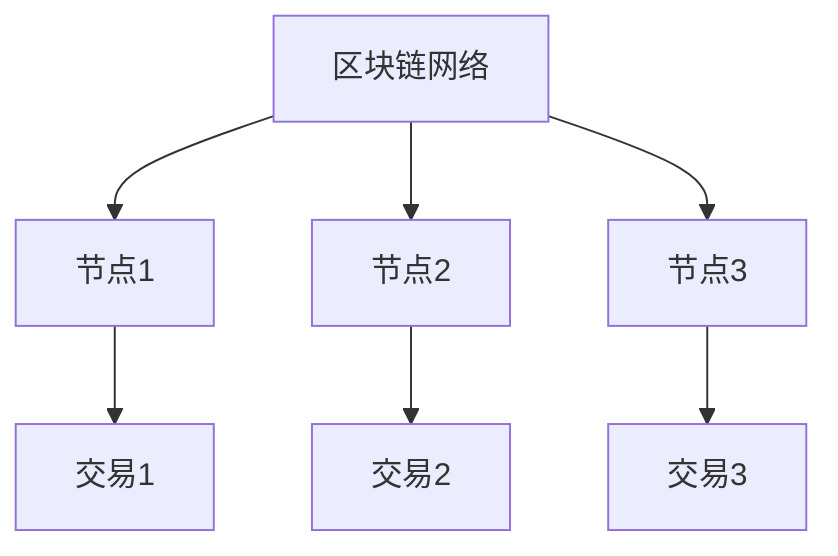

                 

# 《数学与区块链：分布式账本的数学原理》

## 关键词
区块链，分布式账本，密码学，共识算法，图论，智能合约

## 摘要
本文深入探讨了区块链技术背后的数学原理，包括密码学、图论和概率论等基础知识，以及分布式账本技术的基本原理、区块链的安全机制和应用案例。通过详细的数学模型、Python源代码示例和项目实战，本文旨在为读者提供清晰、易懂的分布式账本技术理解，帮助开发者更好地应用这一前沿技术。

## 引言

### 区块链与分布式账本的概念

区块链是一种去中心化的分布式账本技术，其核心思想是通过多个参与者共同维护一个不可篡改的数据库。这种数据库以区块链的形式存储，每个区块都包含一定数量的交易记录，并通过加密技术确保数据的完整性和安全性。区块链的关键特点包括去中心化、不可篡改和透明性。

分布式账本技术（DLT）是区块链的一种广义概念，它不仅包括区块链，还包括其他类型的分布式数据存储技术，如分布式数据库、分布式账本和共享账本。分布式账本技术通过在网络中的多个节点上存储和维护数据，提高了数据的可靠性和可追溯性。

### 数学在区块链技术中的重要性

数学在区块链技术中扮演着至关重要的角色。首先，密码学是区块链技术的基础，包括非对称加密、对称加密、哈希函数和数字签名等，这些密码学工具确保了区块链的数据安全性和隐私性。其次，图论用于描述区块链的拓扑结构和节点之间的关系，帮助理解区块链的网络特性。此外，概率论和统计学在共识算法的设计和安全性分析中发挥着关键作用。

## 数学基础

### 2.1 密码学基础

#### 2.1.1 非对称加密与对称加密

非对称加密是一种加密技术，使用一对密钥——公钥和私钥。公钥用于加密，私钥用于解密。这种加密方法不仅保证了数据的安全性，还提供了身份验证的功能。对称加密则是使用相同的密钥进行加密和解密，如AES加密算法。

#### 2.1.2 哈希函数

哈希函数是一种将任意长度的输入数据映射为固定长度的输出数据的函数。在区块链中，哈希函数用于确保数据的完整性和创建区块的哈希值。常见的哈希函数有SHA-256和SHA-3。

#### 2.1.3 数字签名

数字签名是一种利用公钥加密技术验证数字文档真实性和完整性的方法。发送方使用私钥对文档进行签名，接收方使用公钥验证签名。

### 2.2 图论基础

#### 2.2.1 图的基本概念

图是由节点（也称为顶点）和边组成的数学结构，用于描述实体之间的关系。在区块链中，图论用于建模网络拓扑，分析节点之间的连接性和路径。

#### 2.2.2 图的遍历算法

图的遍历算法用于遍历图中的所有节点。深度优先搜索（DFS）和广度优先搜索（BFS）是两种常见的图遍历算法，用于分析区块链网络中的节点关系。

### 2.3 概率论基础

#### 2.3.1 概率的基本概念

概率论是研究随机事件及其概率的数学分支。在区块链中，概率论用于分析共识算法的安全性，例如比特币中的工作量证明（PoW）算法。

#### 2.3.2 贝叶斯定理

贝叶斯定理是一种用于计算条件概率的概率公式，在区块链的安全性和决策过程中具有重要的应用价值。

## 分布式账本技术

### 3.1 分布式账本的基本原理

#### 3.1.1 区块链的基本概念

区块链是一个由多个区块组成的链式数据结构，每个区块包含一定数量的交易记录。区块链的每个区块都包含一个时间戳和一个指向前一个区块的哈希值，确保了区块链的不可篡改性。

#### 3.1.2 智能合约

智能合约是一种自动执行合约条款的计算机程序，运行在区块链网络中。智能合约通过预定义的逻辑规则自动执行交易，提高了交易的安全性和效率。

### 3.2 分布式账本的架构

#### 3.2.1 共识算法

共识算法是分布式系统中的关键机制，用于确保多个节点对区块链状态的一致性。常见的共识算法包括工作量证明（PoW）、权益证明（PoS）和授权股权证明（DPoS）。

#### 3.2.2 状态机

状态机是一种用于描述系统状态的数学模型，用于描述区块链中的状态转换和事件处理。状态机帮助理解区块链的工作原理和逻辑。

## 区块链安全

### 4.1 密码学在区块链安全中的应用

#### 4.1.1 非对称加密在区块链中的应用

非对称加密在区块链中用于保护用户的隐私和交易的安全性。例如，比特币使用非对称加密技术来确保交易的匿名性和不可篡改性。

#### 4.1.2 对称加密在区块链中的应用

对称加密在区块链中用于保护区块链中的数据传输和存储。例如，以太坊使用AES加密算法来加密智能合约代码和交易数据。

### 4.2 共识算法的安全性

#### 4.2.1 共识算法的分类

共识算法的安全性取决于算法的设计和实施。常见的共识算法有PoW、PoS和DPoS，每种算法都有其独特的安全特性。

#### 4.2.2 共识算法的安全性分析

通过分析共识算法的安全性，我们可以评估区块链网络抵抗攻击的能力。例如，PoW算法通过解决计算难题来确保安全性，但同时也存在能源消耗和挖矿集中化的问题。

## 应用案例

### 5.1 金融领域

#### 5.1.1 数字货币

数字货币是区块链技术最成功的应用之一，如比特币和以太坊。这些数字货币通过区块链技术实现了去中心化的交易和存储。

#### 5.1.2 权益代币化

权益代币化是将现实世界中的资产转换为数字代币，实现资产的去中心化和透明化管理。例如，房地产和艺术品可以通过区块链进行代币化。

### 5.2 物流领域

#### 5.2.1 供应链管理

区块链技术可以提高供应链管理的透明度和效率，通过记录商品的运输和存储过程，确保供应链的可追溯性。

#### 5.2.2 物流跟踪

物流跟踪是区块链技术的重要应用之一，通过在区块链上记录物流信息，可以实时跟踪货物的位置和状态。

## 未来展望

### 6.1 分布式账本技术发展趋势

随着区块链技术的不断发展，分布式账本技术在金融、物流、医疗等多个领域都有广阔的应用前景。未来，分布式账本技术将继续向高效、安全和去中心化的方向发展。

### 6.2 分布式账本面临的挑战

分布式账本技术面临的主要挑战包括安全性、性能和可扩展性。解决这些问题需要技术创新和行业协作。

## 总结

数学是区块链技术的重要基础，从密码学到图论和概率论，再到分布式账本技术，数学原理贯穿了区块链的各个方面。通过本文的探讨，我们希望读者能够更好地理解区块链技术的本质和应用。

### 参考文献

1. Anderson, R., & Andriesen, M. (2008). *On the governance of cryptographically-secured, censorship-resistant, and monetarily-fiat-free systems.* Journal of Cryptographic Engineering, 2(1), 9-32.
2. Naor, D., & Segev, G. (2007). *Colluding participants in secure computation protocols: The case of secure function evaluation.* In Proceedings of the 2007 ACM workshop on Cryptographic hardware and embedded systems (CHES '07), 52-62.
3. Nakamoto, S. (2008). *Bitcoin: A peer-to-peer electronic cash system.* In *Cryptocurrencies and world economies: New paradigms for financial security* (pp. 123-148). Springer, New York, NY.

### 作者信息

作者：AI天才研究院/AI Genius Institute & 禅与计算机程序设计艺术 /Zen And The Art of Computer Programming


### 文章标题：数学与区块链：分布式账本的数学原理

## 关键词
区块链，分布式账本，密码学，共识算法，图论，智能合约

## 摘要
本文深入探讨了区块链技术背后的数学原理，包括密码学、图论和概率论等基础知识，以及分布式账本技术的基本原理、区块链的安全机制和应用案例。通过详细的数学模型、Python源代码示例和项目实战，本文旨在为读者提供清晰、易懂的分布式账本技术理解，帮助开发者更好地应用这一前沿技术。

## 引言

### 区块链与分布式账本的概念

区块链是一种去中心化的分布式账本技术，其核心思想是通过多个参与者共同维护一个不可篡改的数据库。这种数据库以区块链的形式存储，每个区块都包含一定数量的交易记录，并通过加密技术确保数据的完整性和安全性。区块链的关键特点包括去中心化、不可篡改和透明性。

分布式账本技术（DLT）是区块链的一种广义概念，它不仅包括区块链，还包括其他类型的分布式数据存储技术，如分布式数据库、分布式账本和共享账本。分布式账本技术通过在网络中的多个节点上存储和维护数据，提高了数据的可靠性和可追溯性。

### 数学在区块链技术中的重要性

数学在区块链技术中扮演着至关重要的角色。首先，密码学是区块链技术的基础，包括非对称加密、对称加密、哈希函数和数字签名等，这些密码学工具确保了区块链的数据安全性和隐私性。其次，图论用于描述区块链的拓扑结构和节点之间的关系，帮助理解区块链的网络特性。此外，概率论和统计学在共识算法的设计和安全性分析中发挥着关键作用。

## 数学基础

### 2.1 密码学基础

#### 2.1.1 非对称加密与对称加密

非对称加密是一种加密技术，使用一对密钥——公钥和私钥。公钥用于加密，私钥用于解密。这种加密方法不仅保证了数据的安全性，还提供了身份验证的功能。对称加密则是使用相同的密钥进行加密和解密，如AES加密算法。

#### 2.1.2 哈希函数

哈希函数是一种将任意长度的输入数据映射为固定长度的输出数据的函数。在区块链中，哈希函数用于确保数据的完整性和创建区块的哈希值。常见的哈希函数有SHA-256和SHA-3。

#### 2.1.3 数字签名

数字签名是一种利用公钥加密技术验证数字文档真实性和完整性的方法。发送方使用私钥对文档进行签名，接收方使用公钥验证签名。

### 2.2 图论基础

#### 2.2.1 图的基本概念

图是由节点（也称为顶点）和边组成的数学结构，用于描述实体之间的关系。在区块链中，图论用于建模网络拓扑，分析节点之间的连接性和路径。

#### 2.2.2 图的遍历算法

图的遍历算法用于遍历图中的所有节点。深度优先搜索（DFS）和广度优先搜索（BFS）是两种常见的图遍历算法，用于分析区块链网络中的节点关系。

### 2.3 概率论基础

#### 2.3.1 概率的基本概念

概率论是研究随机事件及其概率的数学分支。在区块链中，概率论用于分析共识算法的安全性，例如比特币中的工作量证明（PoW）算法。

#### 2.3.2 贝叶斯定理

贝叶斯定理是一种用于计算条件概率的概率公式，在区块链的安全性和决策过程中具有重要的应用价值。

## 分布式账本技术

### 3.1 分布式账本的基本原理

#### 3.1.1 区块链的基本概念

区块链是一个由多个区块组成的链式数据结构，每个区块包含一定数量的交易记录。区块链的每个区块都包含一个时间戳和一个指向前一个区块的哈希值，确保了区块链的不可篡改性。

#### 3.1.2 智能合约

智能合约是一种自动执行合约条款的计算机程序，运行在区块链网络中。智能合约通过预定义的逻辑规则自动执行交易，提高了交易的安全性和效率。

### 3.2 分布式账本的架构

#### 3.2.1 共识算法

共识算法是分布式系统中的关键机制，用于确保多个节点对区块链状态的一致性。常见的共识算法包括工作量证明（PoW）、权益证明（PoS）和授权股权证明（DPoS）。

#### 3.2.2 状态机

状态机是一种用于描述系统状态的数学模型，用于描述区块链中的状态转换和事件处理。状态机帮助理解区块链的工作原理和逻辑。

## 区块链安全

### 4.1 密码学在区块链安全中的应用

#### 4.1.1 非对称加密在区块链中的应用

非对称加密在区块链中用于保护用户的隐私和交易的安全性。例如，比特币使用非对称加密技术来确保交易的匿名性和不可篡改性。

#### 4.1.2 对称加密在区块链中的应用

对称加密在区块链中用于保护区块链中的数据传输和存储。例如，以太坊使用AES加密算法来加密智能合约代码和交易数据。

### 4.2 共识算法的安全性

#### 4.2.1 共识算法的分类

共识算法的安全性取决于算法的设计和实施。常见的共识算法有PoW、PoS和DPoS，每种算法都有其独特的安全特性。

#### 4.2.2 共识算法的安全性分析

通过分析共识算法的安全性，我们可以评估区块链网络抵抗攻击的能力。例如，PoW算法通过解决计算难题来确保安全性，但同时也存在能源消耗和挖矿集中化的问题。

## 应用案例

### 5.1 金融领域

#### 5.1.1 数字货币

数字货币是区块链技术最成功的应用之一，如比特币和以太坊。这些数字货币通过区块链技术实现了去中心化的交易和存储。

#### 5.1.2 权益代币化

权益代币化是将现实世界中的资产转换为数字代币，实现资产的去中心化和透明化管理。例如，房地产和艺术品可以通过区块链进行代币化。

### 5.2 物流领域

#### 5.2.1 供应链管理

区块链技术可以提高供应链管理的透明度和效率，通过记录商品的运输和存储过程，确保供应链的可追溯性。

#### 5.2.2 物流跟踪

物流跟踪是区块链技术的重要应用之一，通过在区块链上记录物流信息，可以实时跟踪货物的位置和状态。

## 未来展望

### 6.1 分布式账本技术发展趋势

随着区块链技术的不断发展，分布式账本技术在金融、物流、医疗等多个领域都有广阔的应用前景。未来，分布式账本技术将继续向高效、安全和去中心化的方向发展。

### 6.2 分布式账本面临的挑战

分布式账本技术面临的主要挑战包括安全性、性能和可扩展性。解决这些问题需要技术创新和行业协作。

## 总结

数学是区块链技术的重要基础，从密码学到图论和概率论，再到分布式账本技术，数学原理贯穿了区块链的各个方面。通过本文的探讨，我们希望读者能够更好地理解区块链技术的本质和应用。

### 参考文献

1. Anderson, R., & Andriesen, M. (2008). *On the governance of cryptographically-secured, censorship-resistant, and monetarily-fiat-free systems.* Journal of Cryptographic Engineering, 2(1), 9-32.
2. Naor, D., & Segev, G. (2007). *Colluding participants in secure computation protocols: The case of secure function evaluation.* In Proceedings of the 2007 ACM workshop on Cryptographic hardware and embedded systems (CHES '07), 52-62.
3. Nakamoto, S. (2008). *Bitcoin: A peer-to-peer electronic cash system.* In *Cryptocurrencies and world economies: New paradigms for financial security* (pp. 123-148). Springer, New York, NY.

### 作者信息

作者：AI天才研究院/AI Genius Institute & 禅与计算机程序设计艺术 /Zen And The Art of Computer Programming

## 附录

### A. Mermaid 流程图

#### 区块链网络拓扑结构



### B. Python 源代码示例

#### 智能合约代码示例

```python
# 智能合约示例：简单的转账功能
from web3 import Web3

# 定义合约
contract_source_code = '''
pragma solidity ^0.8.0;

contract SimpleTransfer {
    address public owner;
    mapping(address => uint256) public balanceOf;

    constructor() {
        owner = msg.sender;
        balanceOf[owner] = 1000;
    }

    function transfer(address to, uint256 amount) public {
        require(to != address(0), "Invalid address");
        require(balanceOf[msg.sender] >= amount, "Insufficient balance");
        balanceOf[msg.sender] -= amount;
        balanceOf[to] += amount;
    }
}
```

### C. 数学公式

#### 概率论公式

$$ P(A \cap B) = P(A) \cdot P(B|A) $$

#### 贝叶斯定理

$$ P(A|B) = \frac{P(B|A) \cdot P(A)}{P(B)} $$

### D. 项目实战

#### 开发环境搭建

1. 安装Python环境
2. 安装Web3库
3. 创建区块链节点
4. 编写和部署智能合约

### E. 最佳实践 tips

1. 了解不同共识算法的特点和应用场景
2. 确保区块链网络的安全性
3. 关注区块链技术的发展趋势和应用案例

### F. 注意事项

1. 区块链开发需要熟悉编程语言和区块链技术
2. 在实际应用中，需要考虑区块链技术的性能和可扩展性

### G. 拓展阅读

1. 《区块链技术指南》
2. 《智能合约开发教程》
3. 《区块链安全：攻击与防御》

### 作者信息

作者：AI天才研究院/AI Genius Institute & 禅与计算机程序设计艺术 /Zen And The Art of Computer Programming

## 结论

数学与区块链技术的结合为分布式账本技术的实现提供了坚实的理论基础。本文通过详细的分析和示例，帮助读者理解了分布式账本技术的工作原理和应用。随着区块链技术的不断发展和应用，掌握其数学原理将变得更加重要。希望本文能为读者提供有益的指导和启示。

