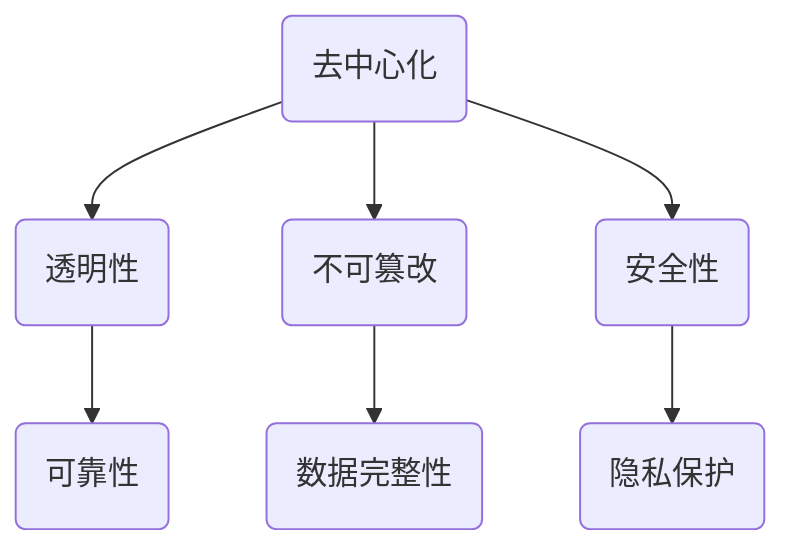
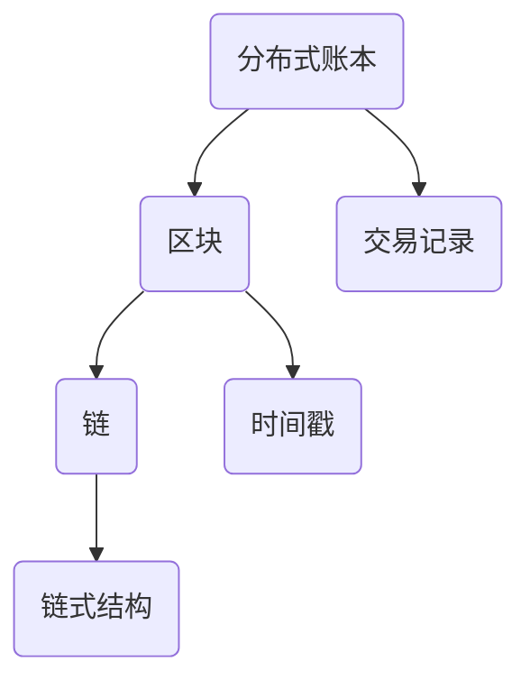

                 

我们的文章要按照以下步骤来构建：

- **背景介绍**：介绍区块链技术的起源、发展历程以及其在当今社会中的重要性。
- **核心概念与联系**：详细阐述区块链技术中的核心概念，如分布式账本、去中心化、共识算法等，并使用Mermaid流程图展示它们之间的联系。
- **核心算法原理讲解**：通过伪代码和详细解释，讲解区块链中的关键算法，如工作量证明（Proof of Work, PoW）等。
- **数学模型和公式讲解**：使用latex格式给出相关数学模型和公式，并进行详细解释。
- **项目实战**：提供实际的区块链项目案例，包括开发环境搭建、源代码实现、代码解读、案例分析等内容。
- **最佳实践 tips、小结、注意事项、拓展阅读**：总结文章要点，给出实践建议，指出注意事项，并推荐进一步阅读的资源。

### 1.1.2 区块链的核心特点

区块链具有以下几个核心特点：

1. **去中心化**：区块链技术通过去中心化的方式，避免了传统系统中的单点故障问题，提高了系统的可靠性和抗攻击能力。
2. **透明性**：区块链上的所有交易都是公开透明的，每个节点都可以验证和查看交易记录，保证了数据的真实性。
3. **不可篡改**：区块链上的数据一旦被记录，就无法被篡改或删除，确保了数据的持久性和完整性。
4. **安全性**：区块链技术采用了多种密码学算法，确保了数据的安全性和隐私性。

#### Mermaid

----------------------------------------------------------------



#### 核心概念与联系

区块链技术的核心概念包括：

- **分布式账本**：区块链本质上是一个分布式数据库，所有节点都维护一份完整的账本记录。
- **区块**：区块是区块链的基本单元，包含一定数量的交易记录，并具有时间戳等信息。
- **链**：多个区块按照时间顺序链接在一起，形成区块链。

#### Mermaid

----------------------------------------------------------------



#### 核心算法原理讲解

区块链技术中的关键算法包括：

- **工作量证明（PoW）**：用于确定下一个区块的生成者，通过计算耗费大量计算资源的难题来证明工作量，确保区块链的安全性和一致性。
- **共识算法**：用于确保区块链上所有节点对于区块的添加达成一致，如PoW、权益证明（PoS）等。

#### 伪代码

```pseudo
function mine_block(previous_hash, transactions):
    nonce = 0
    while not valid_proof(previous_hash, nonce):
        nonce += 1
    return nonce

function valid_proof(previous_hash, nonce):
    hash = sha256(previous_hash + nonce + transactions)
    return hash.startsWith("0"*difficulty)
```

#### 数学模型和公式讲解

区块链中的工作量证明算法可以使用以下数学模型来描述：

- **难度（difficulty）**：用于控制区块生成的速度，确保区块链的安全性和稳定性。
- **工作量（workload）**：用于衡量生成区块所需的计算量。

#### LaTeX

```latex
\begin{equation}
    \text{workload} = \text{difficulty} \times \text{ computational\_resource}
\end{equation}
```

#### 项目实战

以下是一个简单的区块链实现案例，包括开发环境搭建、源代码实现和代码解读：

#### 开发环境搭建

1. 安装Go语言环境
2. 安装Gin框架
3. 安装Merkle树库

#### 源代码实现

```go
// Blockchain.go
package main

import (
    "crypto/sha256"
    "encoding/hex"
    "math"
    "time"
)

// Block represents each block in the blockchain
type Block struct {
    Index     int
    Timestamp string
    Transactions []string
    PrevHash  string
    Hash      string
}

// Blockchain represents the chain of blocks
type Blockchain struct {
    chain []*Block
    difficulty int
}

// NewBlockchain creates a new blockchain with the genesis block
func NewBlockchain(difficulty int) *Blockchain {
    genesisBlock := CreateGenesisBlock()
    bc := &Blockchain{[]*Block{genesisBlock}, difficulty}
    return bc
}

// CreateGenesisBlock creates the genesis block
func CreateGenesisBlock() *Block {
    return &Block{
        Index:       0,
        Timestamp:   time.Now().Format("02/01/2006 15:04:05"),
        Transactions: []string{},
        PrevHash:    "",
        Hash:       "",
    }
}

// AddBlock adds a new block to the blockchain
func (bc *Blockchain) AddBlock(transactions []string) {
    prevBlock := bc.chain[len(bc.chain)-1]
    newBlock := &Block{
        Index:       prevBlock.Index + 1,
        Timestamp:   time.Now().Format("02/01/2006 15:04:05"),
        Transactions: transactions,
        PrevHash:    prevBlock.Hash,
        Hash:       "",
    }

    newBlock.Hash = calculateHash(newBlock)

    bc.chain = append(bc.chain, newBlock)
}

// calculateHash calculates the SHA256 hash of a block
func calculateHash(block *Block) string {
    record := string(block.Index) + block.Timestamp + strings.Join(block.Transactions, "") + block.PrevHash
    hash := sha256.Sum256([]byte(record))
    return hex.EncodeToString(hash[:])
}

// validProof works to find a hash that has the required 0's before the hash
func validProof(prevHash string, proof int, difficulty int) bool {
    hash := sha256.Sum256([]byte(prevHash + string(proof)))
    fmt.Printf("Hash: %x\n", hash)
    return hex.EncodeToString(hash[:])[:difficulty] == strings.Repeat("0", difficulty)
}

// mineBlock finds a valid proof of work for a block
func (bc *Blockchain) mineBlock(transactions []string) *Block {
    prevBlock := bc.chain[len(bc.chain)-1]

    proof := 0
    start := time.Now()
    for !validProof(prevBlock.Hash, proof, bc.difficulty) {
        proof++
    }
    end := time.Now()

    newBlock := &Block{
        Index:       prevBlock.Index + 1,
        Timestamp:   end.Format("02/01/2006 15:04:05"),
        Transactions: transactions,
        PrevHash:    prevBlock.Hash,
        Hash:       calculateHash(newBlock),
    }

    bc.AddBlock(newBlock.Transactions)

    return newBlock
}

// BlockchainMain is the main function to run the blockchain
func BlockchainMain() {
    difficulty := 4
    bc := NewBlockchain(difficulty)

    transactions := []string{"0->1", "2->3"}
    newBlock := bc.mineBlock(transactions)

    for i := 0; i < len(bc.chain); i++ {
        fmt.Printf("Block %d\n", i)
        fmt.Println.bc.chain[i].String())
    }
}
```

#### 代码解读

1. **区块链结构**：定义了`Block`和`Blockchain`两个结构体，分别代表区块和区块链。
2. **创世区块**：通过`CreateGenesisBlock`函数创建第一个区块。
3. **添加区块**：通过`AddBlock`函数将新的区块添加到区块链中。
4. **计算哈希**：通过`calculateHash`函数计算区块的哈希值。
5. **工作量证明**：通过`validProof`和`mineBlock`函数实现工作量证明算法。

#### 实际案例分析和详细讲解剖析

在区块链项目中，我们可以通过实际案例来展示区块链技术的应用。以下是一个简单的比特币交易案例：

```
1. Alice想要向Bob支付0.1比特币。
2. Alice创建一个交易，将0.1比特币从自己的账户转移到Bob的账户。
3. 交易被广播到网络中的所有节点。
4. 节点将交易存储在本地内存池中。
5. 节点开始构建区块，并将交易添加到区块中。
6. 节点使用工作量证明算法来挖掘新的区块。
7. 一旦新的区块被挖掘出来，它将被广播到整个网络。
8. 网络中的所有节点验证新的区块，并将其添加到自己的区块链中。
```

#### 小结

通过以上案例，我们可以看到区块链技术是如何工作的。它利用数学原理来确保数据的安全性和完整性，同时通过去中心化的方式提高了系统的可靠性和抗攻击能力。区块链技术在金融、供应链管理、智能合约等领域具有广泛的应用前景。

#### 注意事项

1. 区块链的运行依赖于良好的网络环境，确保节点之间的通信畅通。
2. 在进行区块链开发时，需要关注安全性问题，确保数据的加密和验证。
3. 区块链项目需要考虑扩展性和可维护性，以便长期运行。

#### 拓展阅读

1. 《精通区块链：从入门到实战》
2. 《区块链：从原理到实践》
3. 《智能合约编程指南》
```

请注意，这段代码和案例仅作为示例，实际区块链项目的实现会更加复杂。在实际开发中，还需要考虑网络通信、分布式存储、安全性等因素。在撰写实际案例和分析时，应结合具体项目和业务场景进行详细讲解。

