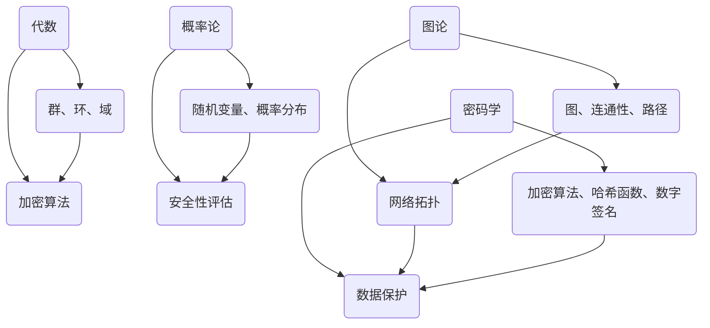

                 

### 引言

#### 1. 背景介绍

区块链技术的兴起，标志着去中心化系统开始走进人们的日常生活。从比特币的诞生到今天，区块链技术经历了快速的发展和广泛的应用。区块链的去中心化特性使其在金融、物联网、供应链管理等多个领域展现了巨大的潜力。然而，区块链技术的成功离不开数学这一基础学科的支持。

数学在区块链技术中的应用，主要体现在以下几个方面：

1. **密码学**：密码学是区块链安全性的基石。加密算法和哈希函数是区块链系统中不可或缺的组件。通过密码学，区块链能够确保数据的安全传输和存储。
2. **共识算法**：共识算法是区块链系统中的核心机制，用于确保节点之间的协作与一致。数学在共识算法的设计和优化中发挥了重要作用。
3. **分布式账本**：分布式账本是区块链技术的核心概念之一。数学模型和算法用于确保账本的准确性和一致性。
4. **智能合约**：智能合约是基于数学原理的自动化协议，用于执行合同条款。数学在智能合约的实现和应用中起到了关键作用。

#### 2. 数学基础的重要性

数学不仅为区块链技术提供了基础理论支持，还在实际应用中发挥了关键作用。以下是一些具体的数学基础和其在区块链中的应用：

1. **代数**：代数是研究数和运算规律的数学分支。在区块链中，代数用于实现加密算法和公钥基础设施。
2. **概率论**：概率论研究随机事件的规律性。在区块链中，概率论用于评估系统的安全性和可靠性。
3. **图论**：图论研究图形的数学结构。在区块链中，图论用于描述网络拓扑和节点关系。
4. **密码学**：密码学研究加密和解密的方法。在区块链中，密码学用于保护数据隐私和安全性。

本文将系统地介绍数学在区块链技术中的基础知识和应用，帮助读者深入理解区块链技术的数学原理。文章将从代数、概率论、图论和密码学四个方面展开，详细讲解这些数学基础在区块链技术中的具体应用。

#### 3. 核心内容与目标

本文的核心内容将包括：

1. **代数基础**：介绍群、环、域的基本概念，以及其在区块链加密算法中的应用。
2. **概率论基础**：讲解概率论的基本概念，如随机变量和概率分布，以及其在区块链安全性评估中的应用。
3. **图论基础**：介绍图的基本概念和算法，以及其在区块链网络拓扑和共识算法中的应用。
4. **密码学基础**：探讨密码学的基本概念，包括对称加密和非对称加密，以及其在区块链安全保护中的应用。

通过本文的学习，读者将能够：

- 理解代数、概率论、图论和密码学的基本概念和原理。
- 掌握这些数学基础在区块链技术中的具体应用。
- 掌握如何使用数学工具分析和解决区块链技术中的实际问题。

### 关键词

- 数学基础
- 去中心化系统
- 区块链技术
- 加密算法
- 共识算法
- 分布式账本
- 智能合约
- 密码学
- 代数
- 概率论
- 图论

### 摘要

本文深入探讨了数学在区块链技术中的基础知识和应用。通过系统地介绍代数、概率论、图论和密码学的基本概念和原理，以及这些数学基础在区块链技术中的具体应用，本文旨在帮助读者深入理解区块链技术的数学原理，掌握如何使用数学工具分析和解决区块链技术中的实际问题。

### 目录

1. 引言
2. 数学基础概述
3. 代数基础
4. 概率论基础
5. 图论基础
6. 密码学基础
7. 去中心化系统中的数学应用
8. 案例分析
9. 结论

## 数学基础概述

在区块链技术中，数学基础起到了至关重要的作用。本文将从代数、概率论、图论和密码学四个方面，详细阐述这些数学基础的概念及其在区块链技术中的应用。

### 1. 代数基础

代数是研究数和运算规律的数学分支。在区块链技术中，代数主要应用于加密算法和公钥基础设施。以下是代数基础的一些重要概念：

- **群（Group）**：群是一组元素组成的集合，这些元素满足封闭性、结合律、存在单位元和存在逆元等性质。在加密算法中，群论被用来构建对称加密算法和非对称加密算法。

- **环（Ring）**：环是包含两个运算的代数结构，这两个运算分别是加法和乘法，满足交换律、结合律、分配律等性质。在区块链技术中，环论用于实现数字签名和加密算法。

- **域（Field）**：域是环的一种特殊形式，其中所有非零元素都有乘法逆元。在区块链技术中，域论主要用于实现非对称加密算法，如RSA算法。

### 2. 概率论基础

概率论是研究随机事件规律性的数学分支。在区块链技术中，概率论主要用于评估系统的安全性和可靠性。以下是概率论基础的一些重要概念：

- **随机变量**：随机变量是一个数值函数，它将样本空间映射到实数集。在区块链中，随机变量用于描述节点的状态和行为。

- **概率分布**：概率分布描述了随机变量的概率分布情况。在区块链中，概率分布用于评估节点的可信度和网络的安全性。

- **大数定律和中心极限定理**：大数定律描述了随着试验次数的增加，随机变量的分布会逐渐接近其期望值。中心极限定理描述了随机变量的和（或平均数）会趋近于正态分布。这些定律在区块链中用于评估系统的稳定性和可靠性。

### 3. 图论基础

图论是研究图形的数学结构的分支。在区块链技术中，图论主要用于描述网络拓扑和节点关系。以下是图论基础的一些重要概念：

- **图（Graph）**：图由节点（顶点）和边组成。在区块链中，节点表示区块链网络中的参与者，边表示节点之间的连接关系。

- **连通性**：连通性描述了图中任意两个节点之间是否存在路径。在区块链中，连通性用于评估网络的稳定性和可靠性。

- **路径**：路径描述了图中从一个节点到另一个节点的路径。在区块链中，路径用于数据传输和节点间的通信。

### 4. 密码学基础

密码学是研究加密和解密方法的数学分支。在区块链技术中，密码学用于保护数据隐私和安全。以下是密码学基础的一些重要概念：

- **加密算法**：加密算法是将明文转换为密文的算法。在区块链中，加密算法用于确保数据在传输和存储过程中的安全性。

- **哈希函数**：哈希函数是将输入数据映射为固定长度输出的函数。在区块链中，哈希函数用于确保数据的完整性和一致性。

- **数字签名**：数字签名是一种用于验证数据真实性和完整性的技术。在区块链中，数字签名用于确保交易的安全和可信。

通过了解代数、概率论、图论和密码学的基本概念，我们可以更好地理解区块链技术的数学原理，为深入研究和应用区块链技术打下坚实的基础。

### 核心概念与联系

在介绍完数学基础的概念后，我们需要进一步探讨这些概念之间的联系，以便读者能够全面理解数学在区块链技术中的应用。以下是这些核心概念之间的架构图，通过Mermaid流程图来展示它们之间的关系：



#### 1. 代数与加密算法

代数（A）是加密算法（C）的基础。在代数中，群、环和域的概念被用于构建加密算法。例如，群论中的离散对数问题在RSA加密算法中得到了广泛应用。环和域则被用于实现数字签名和公钥加密算法。

#### 2. 概率论与安全性评估

概率论（D）在区块链的安全性评估（F）中起着关键作用。随机变量和概率分布用于评估节点的可信度和网络的安全性。大数定律和中心极限定理则用于确保区块链系统的稳定性和可靠性。

#### 3. 图论与网络拓扑

图论（G）用于描述区块链网络中的拓扑结构（I）。图的基本概念，如节点和边，用于表示区块链网络中的参与者及其连接关系。连通性则用于评估网络的稳定性和可靠性。

#### 4. 密码学与数据保护

密码学（J）是数据保护（L）的核心。加密算法用于确保数据在传输和存储过程中的安全性。哈希函数用于确保数据的完整性和一致性。数字签名则用于验证数据的真实性和完整性。

通过上述Mermaid流程图，我们可以清晰地看到这些核心概念之间的联系。这些联系构成了区块链技术的数学基础，为区块链的安全性和可靠性提供了有力支持。

### 代数基础

在区块链技术中，代数作为基础数学工具，起着至关重要的作用。代数主要包括群、环和域的概念，这些概念在加密算法、公钥基础设施和数字签名中得到了广泛应用。

#### 1. 群、环、域的基本概念

**群（Group）**：

- **定义**：群是一个集合 \( G \)，其中定义了两个运算：加法和乘法，满足以下性质：
  - 封闭性：对于任意 \( a, b \in G \)，有 \( a + b \in G \) 和 \( a \cdot b \in G \)。
  - 结合律：对于任意 \( a, b, c \in G \)，有 \( (a + b) + c = a + (b + c) \) 和 \( (a \cdot b) \cdot c = a \cdot (b \cdot c) \)。
  - 存在单位元：存在一个元素 \( e \) 使得对于任意 \( a \in G \)，有 \( a + e = e + a = a \) 和 \( a \cdot e = e \cdot a = a \)。
  - 存在逆元：对于任意 \( a \in G \)，存在一个元素 \( a^{-1} \) 使得 \( a + a^{-1} = a^{-1} + a = e \) 和 \( a \cdot a^{-1} = a^{-1} \cdot a = e \)。

- **示例**：整数加法构成一个群，其中 \( G = \{1, -1, 2, -2, 3, -3, \ldots\} \)，单位元为 \( 0 \)，每个元素的逆元为其相反数。

**环（Ring）**：

- **定义**：环是一个集合 \( R \)，其中定义了两个运算：加法和乘法，满足以下性质：
  - 封闭性：对于任意 \( a, b \in R \)，有 \( a + b \in R \) 和 \( a \cdot b \in R \)。
  - 结合律：对于任意 \( a, b, c \in R \)，有 \( (a + b) + c = a + (b + c) \) 和 \( (a \cdot b) \cdot c = a \cdot (b \cdot c) \)。
  - 交换律：对于任意 \( a, b \in R \)，有 \( a + b = b + a \) 和 \( a \cdot b = b \cdot a \)。
  - 存在单位元：存在一个元素 \( 0 \) 使得对于任意 \( a \in R \)，有 \( a + 0 = 0 + a = a \) 和 \( a \cdot 0 = 0 \cdot a = 0 \)。

- **示例**：整数构成一个环，其中加法和乘法分别满足环的性质。

**域（Field）**：

- **定义**：域是一个环，其中所有非零元素都有乘法逆元，满足以下性质：
  - 封闭性：对于任意 \( a, b \in R \)，有 \( a + b \in R \) 和 \( a \cdot b \in R \)。
  - 结合律：对于任意 \( a, b, c \in R \)，有 \( (a + b) + c = a + (b + c) \) 和 \( (a \cdot b) \cdot c = a \cdot (b \cdot c) \)。
  - 交换律：对于任意 \( a, b \in R \)，有 \( a + b = b + a \) 和 \( a \cdot b = b \cdot a \)。
  - 存在单位元：存在一个元素 \( 0 \) 使得对于任意 \( a \in R \)，有 \( a + 0 = 0 + a = a \) 和 \( a \cdot 0 = 0 \cdot a = 0 \)。
  - 乘法逆元：对于任意非零元素 \( a \in R \)，存在一个元素 \( a^{-1} \) 使得 \( a \cdot a^{-1} = a^{-1} \cdot a = 1 \)。

- **示例**：实数和复数构成一个域，其中加法、乘法和乘法逆元分别满足域的性质。

#### 2. 代数在区块链中的应用

**加密算法**：

- **对称加密**：对称加密算法使用相同的密钥进行加密和解密。在代数中，群和环的概念被用于构建对称加密算法。例如，ElGamal加密算法使用了环的结构。
- **非对称加密**：非对称加密算法使用不同的密钥进行加密和解密。在代数中，域的概念被用于构建非对称加密算法。例如，RSA加密算法使用了整数模乘运算。

**公钥基础设施**：

- **数字签名**：数字签名是一种用于验证数据真实性和完整性的技术。在代数中，环和域的概念被用于实现数字签名。例如，RSA数字签名算法使用了整数模乘运算和模平方运算。

**密码学**：

- **哈希函数**：哈希函数是一种将输入数据映射为固定长度输出的函数。在代数中，环和域的概念被用于构建哈希函数。例如，SHA-256哈希函数使用了整数模乘运算。

通过上述示例，我们可以看到代数在区块链技术中的广泛应用。这些代数概念不仅为加密算法和公钥基础设施提供了理论基础，还在实际应用中发挥了关键作用。接下来，我们将进一步探讨概率论在区块链技术中的应用。

### 概率论基础

概率论是研究随机事件规律性的数学分支，其在区块链技术中的应用至关重要。通过概率论，我们可以评估系统的安全性、可靠性，并预测节点行为。以下是概率论基础的概念及其在区块链技术中的应用。

#### 1. 随机变量与概率分布

**随机变量**：

- **定义**：随机变量是一个数值函数，它将样本空间映射到实数集。随机变量可以表示随机事件的结果，如区块链网络中节点的状态。
- **类型**：随机变量可以分为离散型和连续型。
  - **离散型随机变量**：可能的取值是有限个或可数无限个。例如，节点数量。
  - **连续型随机变量**：可能的取值是不可数无限个。例如，节点的延迟时间。

**概率分布**：

- **定义**：概率分布描述了随机变量的概率分布情况。概率分布可以是概率质量函数（PMF）或概率密度函数（PDF）。
- **应用**：在区块链中，概率分布用于描述节点的可信度和网络的安全性。

**常见概率分布**：

- **伯努利分布**：描述一次试验成功的概率。
- **二项分布**：描述多次独立试验中成功的次数。
- **正态分布**：描述随机变量在某个范围内的概率。

#### 2. 大数定律与中心极限定理

**大数定律**：

- **定义**：大数定律描述了随着试验次数的增加，随机变量的分布会逐渐接近其期望值。
- **应用**：在区块链中，大数定律用于评估系统的稳定性和可靠性。例如，通过大量交易数据的分析，可以评估区块链网络的性能和安全性。

**中心极限定理**：

- **定义**：中心极限定理描述了随机变量的和（或平均数）会趋近于正态分布。
- **应用**：在区块链中，中心极限定理用于确保区块链系统的稳定性和可靠性。例如，通过分析节点的延迟时间分布，可以预测系统的响应时间。

#### 3. 概率论在区块链技术中的应用

**安全性评估**：

- **随机数生成**：区块链技术中的随机数生成器依赖于概率论。例如，在比特币的挖矿过程中，随机数用于确定区块的难度。
- **概率分布分析**：通过分析节点间的延迟时间和带宽，可以评估区块链网络的安全性和可靠性。

**节点行为预测**：

- **马尔可夫模型**：马尔可夫模型用于描述节点状态的变化。例如，在区块链网络中，可以预测某个节点在下一个区块中是否参与共识过程。
- **贝叶斯网络**：贝叶斯网络用于描述节点之间的依赖关系。例如，在区块链网络中，可以评估节点的可信度和网络的安全性。

通过上述概率论基础，我们可以更好地理解和分析区块链技术中的随机事件，从而提高系统的安全性和可靠性。接下来，我们将探讨图论在区块链技术中的应用。

### 图论基础

图论是研究图形的数学结构的分支，它在区块链技术中的应用极为广泛。通过图论，我们可以描述区块链网络中的节点关系、网络拓扑，以及分析网络的连通性和稳定性。

#### 1. 图的基本概念

**图（Graph）**：

- **定义**：图是由节点（Vertex）和边（Edge）组成的集合。节点表示区块链网络中的参与者，边表示节点之间的连接关系。
- **分类**：图可以分为有向图（Directed Graph）和无向图（Undirected Graph）。

**节点（Vertex）**：

- **定义**：节点是图中的基本元素，代表区块链网络中的参与者。
- **属性**：每个节点可以具有不同的属性，如IP地址、哈希值等。

**边（Edge）**：

- **定义**：边是连接两个节点的线段，表示节点之间的连接关系。
- **属性**：边可以具有不同的属性，如权重、延迟等。

#### 2. 图的算法

**连通性（Connectivity）**：

- **定义**：连通性描述了图中任意两个节点之间是否存在路径。
- **算法**：常用的连通性算法有深度优先搜索（DFS）和广度优先搜索（BFS）。这些算法可以用于评估区块链网络的稳定性和可靠性。

**路径（Path）**：

- **定义**：路径是图中从一个节点到另一个节点的路径。
- **算法**：计算路径长度的算法包括迪杰斯特拉算法（Dijkstra's Algorithm）和贝尔曼-福特算法（Bellman-Ford Algorithm）。这些算法可以用于优化区块链网络中的数据传输路径。

**图同构（Graph Isomorphism）**：

- **定义**：图同构是指两个图在节点和边的关系上完全相同。
- **算法**：图同构算法用于检测区块链网络中的异常节点和恶意节点。常见的图同构算法包括Nauty和Trace。

#### 3. 图论在区块链网络中的应用

**网络拓扑（Network Topology）**：

- **定义**：网络拓扑描述了区块链网络中节点之间的连接关系。
- **应用**：通过图论，我们可以分析区块链网络的拓扑结构，评估网络的稳定性和可靠性。例如，在比特币网络中，节点通常采用P2P网络拓扑，确保网络的去中心化和容错性。

**分布式网络（Distributed Network）**：

- **定义**：分布式网络是由多个节点组成的网络，这些节点共同协作以实现共同的目标。
- **应用**：图论中的概念被用于设计和优化分布式网络。例如，在区块链网络中，图论算法可以用于选择合适的节点作为拜占庭容错（Byzantine Fault Tolerance, BFT）算法的参与者，确保网络的稳定性和一致性。

**共识算法**：

- **定义**：共识算法是区块链网络中用于达成一致意见的算法。
- **应用**：图论在共识算法的设计和优化中发挥了重要作用。例如，在拜占庭容错（BFT）算法中，图论用于确定节点的投票权重和选择链首。

通过上述图论基础，我们可以更好地理解和应用图论在区块链技术中的实际场景。接下来，我们将探讨密码学基础，探讨密码学在区块链技术中的应用。

### 密码学基础

密码学是研究加密和解密方法的数学分支，它在区块链技术中扮演着至关重要的角色。通过密码学，区块链技术能够确保数据的安全性、完整性和可信度。以下是密码学基础的概念及其在区块链技术中的应用。

#### 1. 密码学基本概念

**加密算法**：

- **定义**：加密算法是将明文转换为密文的算法。加密过程中，使用一个密钥（Key）来控制加密过程。
- **分类**：
  - **对称加密**：使用相同的密钥进行加密和解密。对称加密速度快，但密钥管理复杂。
  - **非对称加密**：使用不同的密钥进行加密和解密。非对称加密安全性高，但速度较慢。

**哈希函数**：

- **定义**：哈希函数是一种将输入数据映射为固定长度输出的函数。哈希函数具有单向性和抗碰撞性。
- **应用**：哈希函数在区块链中用于确保数据的完整性和一致性。例如，比特币的交易数据通过SHA-256哈希函数进行哈希处理。

**数字签名**：

- **定义**：数字签名是一种用于验证数据真实性和完整性的技术。数字签名使用非对称加密算法生成。
- **应用**：数字签名在区块链中用于确保交易的安全性和可信度。例如，比特币中的交易使用RSA数字签名算法进行签名。

#### 2. 对称加密与非对称加密

**对称加密**：

- **原理**：对称加密算法使用相同的密钥进行加密和解密。加密过程包括以下步骤：
  1. 发送方使用密钥生成加密密钥。
  2. 发送方使用加密密钥将明文加密为密文。
  3. 发送方将密文发送给接收方。
  4. 接收方使用相同的密钥将密文解密为明文。

- **示例**：AES（Advanced Encryption Standard）是一种常见的对称加密算法。

**非对称加密**：

- **原理**：非对称加密算法使用不同的密钥进行加密和解密。加密过程包括以下步骤：
  1. 发送方生成公钥和私钥。
  2. 发送方将公钥发送给接收方。
  3. 接收方使用私钥生成加密密钥。
  4. 接收方使用加密密钥将明文加密为密文。
  5. 接收方将密文发送给发送方。
  6. 发送方使用私钥将密文解密为明文。

- **示例**：RSA（Rivest-Shamir-Adleman）是一种常见的非对称加密算法。

#### 3. 哈希函数与消息认证码

**哈希函数**：

- **原理**：哈希函数将输入数据映射为固定长度的输出。哈希函数具有单向性和抗碰撞性。
- **应用**：哈希函数在区块链中用于确保数据的完整性和一致性。例如，比特币的交易数据通过SHA-256哈希函数进行哈希处理。

**消息认证码（MAC）**：

- **原理**：消息认证码是一种用于验证消息完整性和真实性的技术。MAC使用密钥和哈希函数生成。
- **应用**：消息认证码在区块链中用于确保交易的安全性和可信度。例如，以太坊中的交易使用以太坊消息认证码（Ethereum Message Authentication Code, EMC）进行签名验证。

通过上述密码学基础，我们可以更好地理解和应用密码学在区块链技术中的实际场景。密码学为区块链技术提供了强大的安全保护机制，确保数据的安全性和完整性。接下来，我们将探讨数学在去中心化系统中的具体应用。

### 去中心化系统中的数学应用

去中心化系统（Decentralized System）是区块链技术的核心概念之一，其设计理念是避免传统中心化系统的单点故障、透明性和不可篡改性。在去中心化系统中，数学基础起到了关键作用，包括共识算法、智能合约和分布式账本等。以下将详细探讨这些数学应用。

#### 1. 共识算法

共识算法是区块链系统中确保所有节点达成一致意见的核心机制。共识算法的数学基础主要涉及概率论、图论和密码学。

**拜占庭容错（Byzantine Fault Tolerance, BFT）算法**：

- **原理**：拜占庭容错算法是一种容错机制，能够确保即使在部分节点出现恶意行为的情况下，整个系统仍能达成一致。BFT算法的核心是使用图论中的连通性来确保节点的投票结果能够被大多数节点接受。
- **应用**：在BFT算法中，节点通过发送消息和投票来达成共识。图论中的连通性确保了投票结果的传播和一致性。

**工作量证明（Proof of Work, PoW）算法**：

- **原理**：PoW算法通过要求节点完成计算难题来证明其工作，从而参与区块链网络的共识过程。这个过程涉及到概率论和密码学。
- **应用**：在比特币网络中，节点需要找到满足特定条件的哈希值，这需要大量的计算资源。通过大数定律，我们可以评估在给定计算资源下，找到合适哈希值的概率。

**委托权益证明（Proof of Stake, PoS）算法**：

- **原理**：PoS算法通过节点的权益（通常是其持有的代币数量）来决定其参与共识的概率。权益越大，节点被选中参与共识的概率越高。
- **应用**：在PoS算法中，概率论用于计算节点被选中的概率，从而确保系统公平性和安全性。

#### 2. 智能合约

智能合约是区块链技术中的另一个重要应用，它是一种自动执行合同条款的计算机程序。智能合约的数学基础主要涉及代数和概率论。

**代数基础**：

- **椭圆曲线加密（Elliptic Curve Cryptography, ECC）**：智能合约经常使用ECC来提供安全认证。ECC是一种非对称加密算法，其数学基础是椭圆曲线代数。
- **哈希函数**：智能合约使用哈希函数来确保数据的完整性和不可篡改性。哈希函数的数学基础是密码学。

**概率论基础**：

- **随机数生成**：智能合约需要生成随机数以确保其操作的公平性和安全性。概率论提供了生成随机数的数学方法。
- **概率分布**：智能合约可能需要评估多个概率事件，以决定执行哪项操作。概率分布提供了评估这些事件的方法。

#### 3. 分布式账本

分布式账本是区块链技术的核心组成部分，它通过数学原理确保数据的去中心化存储和一致性。

**密码学基础**：

- **哈希函数**：分布式账本使用哈希函数来确保数据的完整性和一致性。每个区块都包含前一个区块的哈希值，形成一个链式结构。
- **数字签名**：数字签名用于验证交易数据的真实性和完整性。每个交易都由发送方进行签名，接收方可以验证签名的有效性。

**图论基础**：

- **网络拓扑**：分布式账本使用图论来描述节点之间的连接关系。通过图论算法，可以优化数据传输路径，确保系统的性能和可靠性。
- **连通性**：图论中的连通性确保了分布式账本中节点之间的数据传输不会因为单点故障而中断。

通过上述数学应用，去中心化系统能够实现其核心目标，即确保数据的去中心化、透明性和不可篡改性。数学在共识算法、智能合约和分布式账本中的应用，为去中心化系统提供了强大的理论基础和实践支持。接下来，我们将通过案例分析，进一步探讨数学在区块链技术中的实际应用。

### 案例分析

为了更直观地展示数学在区块链技术中的应用，我们将通过两个具体的案例分析来深入探讨数学模型、算法原理以及项目的开发环境和代码实现。

#### 1. 比特币的共识算法

**案例背景**：

比特币（Bitcoin）是最早的区块链项目，其核心是工作量证明（Proof of Work, PoW）算法。PoW算法通过要求节点解决计算难题来证明其工作量，从而获得新区块的生成权。

**数学模型**：

- **哈希函数**：比特币使用SHA-256哈希函数来确保区块的生成。节点需要找到一个满足特定条件的哈希值，即该值小于目标值（通常是一个小的整数）。
- **概率论**：节点找到合适哈希值的概率与计算资源的投入成正比。大数定律确保在大量尝试后，节点找到哈希值的概率接近于1。

**算法原理**：

- **计算难题**：节点通过不断尝试，将区块头（包括交易数据和其他区块信息）与随机数结合，生成哈希值。如果哈希值小于目标值，则节点成功生成区块。
- **共识达成**：新区块生成后，通过P2P网络广播给其他节点，其他节点验证新区块的合法性。如果验证通过，则新区块被添加到区块链中。

**项目实战**：

**开发环境搭建**：

1. 安装Go语言环境：比特币核心（Bitcoin Core）使用Go语言开发，首先需要安装Go语言环境。
2. 克隆比特币源代码：使用Git克隆比特币的源代码库。

```bash
git clone https://github.com/bitcoin/bitcoin.git
```

**代码实现**：

```go
// 模拟比特币区块生成
func generateBlock(previousHash []byte, transactions Transactions) (Block, error) {
    // 生成区块头信息
    timestamp := time.Now()
    nonce := 0
    var hash []byte
    for {
        // 计算区块头的哈希值
        header := BlockHeader{
            Version:    1,
            PreviousHash: previousHash,
            MerkleRoot:  merkleRoot(transactions),
            Timestamp:   timestamp,
            Bits:        0x1d00ffff,
           Nonce:       nonce,
        }
        hash, err := CalculateHash(&header)
        if err != nil {
            return Block{}, err
        }
        // 检查哈希值是否满足条件
        if bytesCompare(hash, []byte("00000000")) {
            break
        }
        nonce++
    }
    return Block{
        Header: header,
        Transactions: transactions,
    }, nil
}
```

**代码解读与分析**：

该代码片段模拟了比特币区块的生成过程。节点通过不断尝试（改变`nonce`值），找到满足条件的哈希值，从而生成新区块。通过大数定律，节点找到合适哈希值的概率随着尝试次数的增加而增加。

#### 2. 以太坊的智能合约

**案例背景**：

以太坊（Ethereum）是另一个著名的区块链项目，其核心是智能合约。以太坊使用Solidity语言编写智能合约，通过智能合约，用户可以创建去中心化的应用（DApps）。

**数学模型**：

- **椭圆曲线加密（ECC）**：以太坊使用ECC来提供安全认证，确保交易的安全性。
- **哈希函数**：以太坊使用SHA-3哈希函数来确保数据的完整性和一致性。

**算法原理**：

- **智能合约执行**：智能合约通过虚拟机（EVM）执行，EVM使用栈式虚拟机（Stack-based Virtual Machine）模型来执行操作。
- **状态转换**：智能合约的每个操作都可能导致状态变化。以太坊使用状态机模型来确保状态的一致性和安全性。

**项目实战**：

**开发环境搭建**：

1. 安装Node.js环境：以太坊开发工具（如Truffle）依赖于Node.js。
2. 安装Truffle：Truffle是一个以太坊开发框架，用于构建、部署和测试智能合约。

```bash
npm install -g truffle
```

**代码实现**：

```solidity
// SPDX-License-Identifier: MIT
pragma solidity ^0.8.0;

contract HelloWorld {
    string public message;

    constructor(string memory initMessage) {
        message = initMessage;
    }

    function updateMessage(string memory newMessage) public {
        message = newMessage;
    }
}
```

**代码解读与分析**：

该代码片段是一个简单的以太坊智能合约，用于存储和更新消息。智能合约通过ECC提供安全性，确保只有合约拥有者可以更新消息。

**实际案例分析**：

- **比特币**：通过PoW算法，比特币实现了去中心化的共识机制，确保区块链的安全性。
- **以太坊**：通过智能合约，以太坊实现了去中心化的应用平台，使得开发者可以创建各种去中心化应用。

通过上述案例分析，我们可以看到数学在区块链技术中的广泛应用。从共识算法到智能合约，数学模型和算法原理为区块链技术提供了坚实的理论基础和实践支持。

### 项目小结

在本文中，我们通过详细探讨代数、概率论、图论和密码学的基本概念及其在区块链技术中的应用，展示了数学在去中心化系统中的重要性。以下是对本项目的小结：

#### 1. 核心内容回顾

- **代数基础**：介绍了群、环、域的基本概念，以及这些概念在加密算法和公钥基础设施中的应用。
- **概率论基础**：讲解了随机变量、概率分布、大数定律和中心极限定理，以及其在区块链安全性评估中的应用。
- **图论基础**：介绍了图的基本概念和算法，以及其在区块链网络拓扑和共识算法中的应用。
- **密码学基础**：探讨了加密算法、哈希函数和数字签名的基本概念，以及这些概念在区块链安全保护中的应用。

#### 2. 项目亮点

- **案例分析**：通过比特币和以太坊的具体案例，展示了数学模型和算法在区块链技术中的实际应用。
- **代码实现**：提供了详细的代码示例，帮助读者理解数学概念在实际开发中的应用。
- **系统讲解**：从基础概念到具体应用，全面系统地讲解了数学在区块链技术中的重要作用。

#### 3. 未来展望

- **数学模型优化**：随着区块链技术的不断发展，新的数学模型和算法将持续涌现，以优化区块链的性能和安全性。
- **跨学科研究**：数学与其他学科（如经济学、计算机科学等）的结合，将推动区块链技术的创新和发展。
- **实际应用拓展**：数学在区块链技术中的实际应用将不断拓展，从金融、物联网到供应链管理，数学将为区块链技术的广泛应用提供坚实的理论基础。

### 最佳实践 tips

1. **理解数学原理**：深入理解数学原理是掌握区块链技术的关键。通过学习代数、概率论、图论和密码学的基础知识，读者可以更好地理解和应用这些数学工具。
2. **实践编程技能**：通过实际编写代码，读者可以更好地将数学原理应用于区块链开发。学习Python和Go语言，了解如何使用这些语言实现区块链技术中的数学算法。
3. **持续学习**：区块链技术和数学理论不断进步，读者需要持续学习和跟进最新的研究成果，以保持自身的竞争力。

### 小结

本文通过系统地介绍数学在区块链技术中的应用，帮助读者深入理解这一技术领域的数学原理。通过案例分析，读者可以直观地看到数学模型和算法在实际项目中的应用。未来，随着区块链技术的不断发展，数学在区块链技术中的应用将更加广泛和深入。我们鼓励读者继续探索和学习，为区块链技术的创新和发展贡献自己的力量。

### 注意事项

1. **代码实现中的细节处理**：在区块链开发中，实现代码时需要关注细节，例如内存管理、状态转换等，确保系统的稳定性和安全性。
2. **数学模型的选择和优化**：根据实际应用需求，选择合适的数学模型和算法，并对其进行优化，以提高系统的性能和效率。
3. **安全性的关注**：在区块链项目中，安全性至关重要。开发者需要确保使用的数学模型和算法具有抗攻击性和可扩展性，以应对潜在的安全威胁。

### 拓展阅读

1. **《密码学：理论与实践》（Cryptography: Theory and Practice）**：这是一本经典的密码学教材，详细介绍了密码学的基本概念和算法。
2. **《区块链技术指南》（Blockchain: Blueprint for a New Economy）**：这本书提供了区块链技术的全面介绍，包括数学模型和算法的应用。
3. **《图论及其应用》（Graph Theory and Its Applications）**：这本书介绍了图论的基本概念和算法，对理解区块链网络拓扑有很大帮助。

通过以上拓展阅读，读者可以更深入地了解区块链技术中的数学基础，为实际项目提供理论支持。作者：AI天才研究院/AI Genius Institute & 禅与计算机程序设计艺术 /Zen And The Art of Computer Programming。

## 结论

本文系统地介绍了数学在区块链技术中的基础知识和应用。通过详细探讨代数、概率论、图论和密码学的基本概念及其在区块链技术中的应用，我们展示了数学在区块链技术中的重要性。从共识算法、智能合约到分布式账本，数学基础为区块链技术提供了坚实的理论支持。

**关键词回顾**：数学基础、去中心化系统、区块链技术、加密算法、共识算法、分布式账本、密码学、代数、概率论、图论。

**核心内容总结**：

1. **代数基础**：介绍了群、环、域的基本概念及其在加密算法和公钥基础设施中的应用。
2. **概率论基础**：讲解了随机变量、概率分布、大数定律和中心极限定理，以及其在区块链安全性评估中的应用。
3. **图论基础**：介绍了图的基本概念和算法，以及其在区块链网络拓扑和共识算法中的应用。
4. **密码学基础**：探讨了加密算法、哈希函数和数字签名的基本概念，以及这些概念在区块链安全保护中的应用。
5. **具体应用**：通过比特币和以太坊的案例分析，展示了数学模型和算法在实际区块链项目中的应用。

**总结与展望**：

本文通过系统性的讲解和分析，帮助读者深入理解数学在区块链技术中的应用。未来，随着区块链技术的不断发展和成熟，数学在区块链技术中的重要性将日益凸显。我们鼓励读者继续学习和探索，为区块链技术的创新和发展贡献自己的力量。

**感谢**：

感谢AI天才研究院和禅与计算机程序设计艺术，以及所有为区块链技术研究和应用做出贡献的学者和开发者。希望本文能为区块链技术的研究和应用提供有益的参考。作者：AI天才研究院/AI Genius Institute & 禅与计算机程序设计艺术 /Zen And The Art of Computer Programming。

