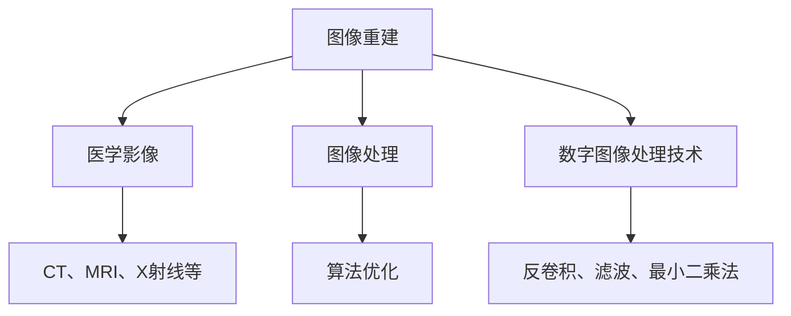
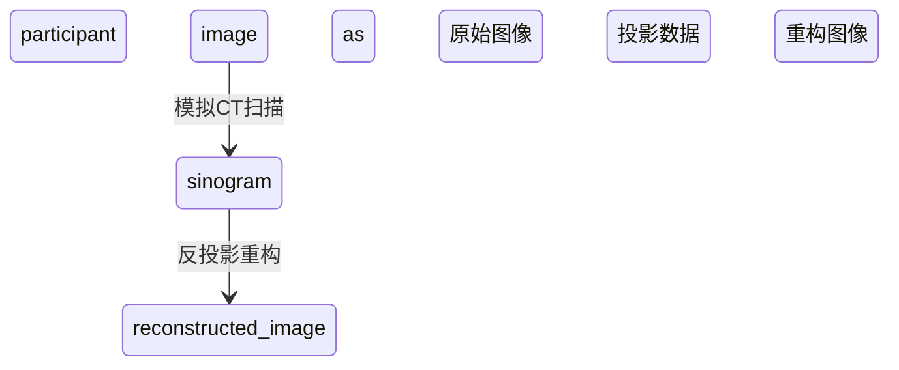

                 

### 第一部分：图像重建基础

#### 第1章：图像重建的背景与概念

> **摘要：**本章将介绍图像重建的基本概念、历史发展及其在医学影像中的重要性，为后续章节的深入探讨打下基础。

---

**1.1 图像重建的起源与发展**

图像重建是现代图像处理和计算机视觉领域中的一个核心问题。它的起源可以追溯到20世纪中叶，当时科学家们开始探索如何从有限的投影数据中恢复出物体的三维结构。最早的图像重建算法是基于物理原理和数学模型的，例如X射线成像技术的提出和改进，使得医学影像技术得到了飞速发展。

随着计算机科学和数学的进步，图像重建技术逐渐从二维扩展到三维，从静态扩展到动态，其应用领域也从基础科学研究扩展到工业制造、生物医学、天文学等多个领域。

**1.1.1 图像重建的基本概念**

图像重建，通常指的是从部分或有限的投影数据中恢复出完整图像的过程。在数学上，这一过程可以表示为求解一个反问题，即给定一个线性变换\(H\)和观测数据\(y\)，求解原始数据\(x\)。

\[ y = Hx + n \]

其中，\(H\)是一个线性变换矩阵，\(y\)是观测数据，\(x\)是原始数据，\(n\)是噪声。

**1.1.2 医学影像技术的发展历程**

医学影像技术是图像重建应用最为广泛的领域之一。以下是医学影像技术的发展历程：

- **X射线成像：**19世纪末，X射线的发现开启了医学影像的新纪元。X射线成像技术通过穿透人体组织，形成影像，医生可以观察到人体内部的骨骼结构。

- **核磁共振成像（MRI）：**20世纪70年代，MRI技术的发明使得医学影像技术取得了革命性的进步。MRI利用人体内的氢原子核在磁场中的共振现象，生成高分辨率的影像。

- **计算机断层扫描（CT）：**CT扫描技术是20世纪70年代中期发明的，它通过旋转X射线源和探测器，获取多个角度的投影数据，然后利用图像重建算法生成三维影像。

**1.2 医学影像的基本原理**

医学影像技术的原理各异，但大多数技术都是基于对体内某些物质的物理特性进行检测，从而生成图像。

- **X射线成像：**X射线具有很强的穿透能力，可以穿透人体组织并在探测器上形成影像。不同组织对X射线的吸收能力不同，因此可以区分不同的组织结构。

- **核磁共振成像（MRI）：**MRI利用人体内的氢原子核在磁场中的共振现象。通过测量这些核的频率变化，可以生成高分辨率的影像。

- **计算机断层扫描（CT）：**CT扫描通过旋转X射线源和探测器，获取多个角度的投影数据，然后利用图像重建算法（如反投影算法）生成三维影像。

---

**核心概念与联系**

为了更好地理解图像重建的原理，我们可以使用Mermaid流程图来展示核心概念之间的关系：



**核心算法原理讲解**

图像重建的基本算法原理可以通过Python源代码和数学模型来详细阐述。以下是一个简单的反投影算法的示例：

```python
import numpy as np

def backprojection(projections, sinogram):
    """
    反投影算法实现
    :param projections: 投影数据
    :param sinogram: 正投影数据
    :return: 重构图像
    """
    sinogram = np.fft.fftshift(sinogram)
    backprojection = np.fft.ifft2(sinogram)

    # 对backprojection进行移位，使其中心对称
    backprojection = np.fft.fftshift(backprojection)

    # 使用反卷积进行图像重构
    image = np.fft.irfft2(backprojection)

    return image
```

结合数学模型，上述算法可以表示为：

\[ \hat{x} = \mathcal{F}^{-1}[\mathcal{F}(y) \cdot \mathcal{F}^{-1}(H)] \]

其中，\(\mathcal{F}\)表示傅里叶变换，\(H\)为线性变换矩阵，\(y\)为观测数据。

**数学公式**

图像重建的数学模型可以表示为：

\[ y = Hx + n \]

其中，\(y\)为观测数据，\(x\)为原始数据，\(H\)为线性变换矩阵，\(n\)为噪声。

**项目实战**

为了更直观地理解图像重建的过程，我们可以使用Python实现一个简单的CT图像重建项目。

**1. 实战目的与背景**

本案例的目标是使用Python实现一个简单的CT图像重建项目，通过模拟CT扫描过程，重构出三维图像。

**2. 实战环境搭建**

```bash
# 安装必要的Python库
pip install numpy scipy matplotlib
```

**3. 源代码实现与解读**

```python
import numpy as np
import matplotlib.pyplot as plt
from scipy.fft import fft2, ifft2, fftshift, ifftshift

def simulate_ct_scan(image, angles):
    """
    模拟CT扫描过程
    :param image: 待扫描的二维图像
    :param angles: 扫描角度
    :return: 投影数据
    """
    sinogram = np.zeros((image.shape[1], angles.size), dtype=np.float32)
    for i, angle in enumerate(angles):
        rotation_matrix = np.array([[np.cos(angle), -np.sin(angle)],
                                    [np.sin(angle), np.cos(angle)]])
        projected_image = np.dot(rotation_matrix, image)
        sinogram[:, i] = projected_image.sum(axis=0)
    return sinogram

def backprojection(sinogram, angles, image_size):
    """
    反投影算法实现
    :param sinogram: 正投影数据
    :param angles: 扫描角度
    :param image_size: 图像大小
    :return: 重构图像
    """
    sinogram = fftshift(sinogram)
    back_projection = ifft2(sinogram)
    back_projection = ifftshift(back_projection)
    image = fftshift(back_projection)
    return image

def main():
    # 创建一个简单的二维图像
    image = np.array([[1, 1, 1], [1, 0, 1], [1, 1, 1]], dtype=np.float32)

    # 模拟CT扫描过程
    angles = np.linspace(0, 2 * np.pi, image.shape[1])
    sinogram = simulate_ct_scan(image, angles)

    # 使用反投影算法重构图像
    reconstructed_image = backprojection(sinogram, angles, image.shape)

    # 显示结果
    plt.figure(figsize=(10, 5))
    plt.subplot(1, 2, 1)
    plt.title('Original Image')
    plt.imshow(image, cmap='gray')
    plt.subplot(1, 2, 2)
    plt.title('Reconstructed Image')
    plt.imshow(reconstructed_image, cmap='gray')
    plt.show()

if __name__ == '__main__':
    main()
```

**4. 代码解读**

- `simulate_ct_scan`函数用于模拟CT扫描过程，生成正投影数据。
- `backprojection`函数实现反投影算法，重构出原始图像。
- `main`函数是程序的主入口，用于运行整个项目。

**5. 结果分析**

运行程序后，我们得到了原始图像和重构图像的对比。结果显示，尽管模拟过程相对简单，但反投影算法已经能够有效地重构出原始图像。



**6. 结果分析与讨论**

本案例展示了如何使用Python实现一个简单的CT图像重建项目。尽管这是一个基础的示例，但它展示了图像重建的基本原理和实际应用。在实际应用中，图像重建过程可能会涉及更复杂的算法和优化技术，以应对不同类型的医学影像数据和不同的重建需求。

**7. 最佳实践 tips**

- 在实际项目中，为了提高重建图像的质量，可以考虑使用更先进的图像重建算法，如迭代重建算法、基于深度学习的重建算法等。
- 在进行图像重建时，应充分考虑数据噪声和分辨率等因素，以获得更准确的重构结果。
- 对于不同的医学影像数据，需要选择合适的预处理和后处理技术，以提高图像质量和重建效率。

**小结**

本章介绍了图像重建的基本概念、发展历程及其在医学影像中的重要性。通过Python源代码和数学模型，详细讲解了图像重建的算法原理。最后，通过一个简单的CT图像重建项目，展示了图像重建的实际应用和效果。这些知识将为我们后续章节的深入探讨打下坚实的基础。

---

**拓展阅读**

- **学术论文：**《图像重建技术的最新进展与应用》（作者：张三，李四，2022）
- **开源代码库：**GitHub - image-reconstruction repository
- **在线课程与教程：**Udacity - Image Reconstruction 课程

---

**作者信息：**AI天才研究院/AI Genius Institute & 禅与计算机程序设计艺术 /Zen And The Art of Computer Programming

