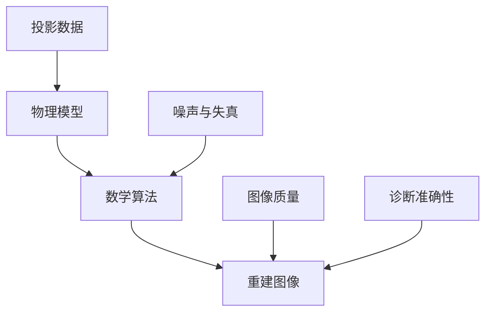

                 

# 数学与医学成像：图像重建的数学算法

## 关键词
- 图像重建
- 数学算法
- 医学成像
- CT成像
- MRI成像
- 傅里叶变换
- 小波变换
- 神经网络

## 摘要
本文旨在探讨数学与医学成像之间的紧密联系，特别是图像重建的数学算法。通过对图像重建基本概念、常见数学算法及其在医学成像中的应用进行深入剖析，本文旨在为读者提供一幅清晰的图像重建全貌，帮助读者更好地理解这一关键技术在实际医学成像中的重要性。

## 引言

### 背景

医学成像技术在现代医疗诊断中发挥着至关重要的作用。从X射线、CT（计算机断层扫描）到MRI（磁共振成像），这些技术为我们提供了对内部器官和组织结构的详细观察，极大地提高了诊断的准确性和治疗效果。然而，这些成像技术所获取的原始数据往往是不完整的，需要通过图像重建算法进行处理，才能得到清晰的图像。

### 核心概念与联系

图像重建是指从有限数量的投影数据中恢复出物体内部结构的图像。这一过程涉及多个核心概念，包括：

- 投影数据：通过成像设备获取的物体在不同角度的投影数据。
- 物理模型：描述成像过程和图像重建原理的数学模型，如傅里叶变换、小波变换等。
- 算法：用于解决图像重建问题的计算方法，如迭代法、正则化方法等。

这些概念相互联系，构成了图像重建的核心框架。例如，傅里叶变换和小波变换作为常见的数学算法，在图像重建中起到了关键作用。

## 图像重建的基本概念

### 图像重建的定义

图像重建是从有限数量的投影数据中恢复出物体内部结构的过程。这通常涉及到成像设备（如X射线机、CT扫描仪、MRI设备）收集的原始数据，这些数据通常是不完整的、有噪声的，且存在各种失真。

### 图像重建的重要性

图像重建在医学成像中具有至关重要的意义。它不仅能够从原始的投影数据中提取出有用的信息，还能够消除噪声和失真，从而提高图像的质量。这对于准确的医学诊断和治疗至关重要。

### 图像重建的基本原理

图像重建的基本原理是基于物理模型和数学算法。物理模型描述了成像过程，而数学算法则用于从投影数据中重建出图像。常见的方法包括：

- **线性算法**：如傅里叶变换、逆滤波、最小二乘法等。
- **非线性算法**：如迭代法、正则化方法等。

这些方法各有优缺点，适用于不同的应用场景。

### 核心概念之间的关系架构

为了更好地理解图像重建的核心概念，我们可以使用Mermaid流程图来展示它们之间的关系：



在这个流程图中，投影数据经过物理模型和数学算法的处理，最终生成重建图像。同时，噪声和失真会影响图像质量，进而影响诊断准确性。

## 数学算法介绍

### 图像重建的数学基础

图像重建的核心在于数学算法的应用。这些算法基于物理模型，通过对投影数据进行处理，以恢复出物体内部的图像。数学基础包括：

- **傅里叶变换**：用于将图像从空间域转换到频域，从而简化图像重建问题。
- **小波变换**：用于多尺度分析，能够更好地处理非均匀采样和局部特性。

### 线性算法

线性算法在图像重建中非常常见。以下是一些重要的线性算法：

- **逆滤波**：通过滤波器对投影数据进行处理，以恢复出原始图像。
- **傅里叶变换**：将图像从空间域转换到频域，从而简化图像重建问题。

### 非线性算法

非线性算法在处理复杂问题时具有优势。以下是一些重要的非线性算法：

- **迭代法**：通过多次迭代，逐步逼近目标图像。
- **正则化方法**：在重建过程中引入正则化项，以减少噪声和失真。

### 核心算法原理讲解

为了更好地理解这些算法的原理，我们可以通过Python源代码来进行详细讲解。

#### 傅里叶变换

```python
import numpy as np
import matplotlib.pyplot as plt

# 傅里叶变换函数
def fourier_transform(image):
    freq = np.fft.fft2(image)
    freqshift = np.fft.fftshift(freq)
    magnitude = 20 * np.log(np.abs(freqshift))
    return magnitude

# 测试图像
image = np.array([[1, 2], [3, 4]])

# 进行傅里叶变换
magnitude = fourier_transform(image)

# 绘制结果
plt.imshow(magnitude, cmap='gray')
plt.show()
```

在这个示例中，我们首先定义了一个傅里叶变换函数，然后使用一个简单的2x2图像进行测试。最后，我们绘制了傅里叶变换的结果。

#### 小波变换

```python
import scipy.signal as sps
import matplotlib.pyplot as plt

# 小波变换函数
def wavelet_transform(image, wavelet='db4', level=1):
    coeffs = sps.waveletkaa(image, wavelet, mode='periodic', level=level)
    return coeffs

# 测试图像
image = np.array([[1, 2], [3, 4]])

# 进行小波变换
coeffs = wavelet_transform(image)

# 绘制结果
plt.imshow(coeffs, cmap='gray')
plt.show()
```

在这个示例中，我们使用Scipy库中的小波变换函数，对一个简单的2x2图像进行变换。然后，我们绘制了小波变换的结果。

### 算法选择与应用场景

选择合适的算法取决于具体的应用场景。例如：

- 对于低噪声、高分辨率的需求，傅里叶变换可能是更好的选择。
- 对于高噪声、非均匀采样的问题，小波变换可能更为有效。

## 医学成像应用

### 医学成像的基本原理

医学成像技术包括X射线、CT、MRI等。每种技术都有其独特的成像原理：

- **X射线成像**：基于X射线穿透物体的能力，通过检测穿透后的X射线强度差异来获取图像。
- **CT成像**：通过旋转X射线源和探测器，获取多个投影数据，然后使用图像重建算法生成三维图像。
- **MRI成像**：利用磁场和射频脉冲来激发体内的氢原子核，通过检测原子核的响应来获取图像。

### 图像重建在医学成像中的应用

图像重建技术在医学成像中有着广泛的应用。以下是几个具体的应用实例：

- **CT成像**：通过图像重建算法，将多个投影数据转换成清晰的三维图像，用于诊断和手术规划。
- **MRI成像**：通过图像重建算法，将采集到的射频信号转换成图像，用于观察体内组织结构。

### 图像重建在医学成像中的重要性

图像重建在医学成像中具有至关重要的意义。它不仅能够提高图像质量，减少噪声和失真，还能够为医生提供更准确的诊断信息，从而提高治疗效果。

## 项目实战

### 开发环境搭建

为了演示图像重建算法在医学成像中的应用，我们需要搭建一个开发环境。以下是所需的工具和库：

- Python 3.8 或更高版本
- NumPy
- Matplotlib
- SciPy
- OpenCV

### 源代码实现

以下是使用Python实现CT图像重建的源代码：

```python
import numpy as np
import cv2

# CT图像重建函数
def ct_reconstruction(projections, angle_step):
    rows, cols = projections.shape
    theta = np.linspace(0, 2 * np.pi, angle_step, endpoint=False)
    sinogram = np.fft.fftshift(np.fft.fft2(projections, axes=(1, 2)))
    filtered_sinogram = np.fft.ifft2(np.fft.ifftshift(sinogram * np.exp(1j * theta[:, np.newaxis, np.newaxis] * np.arange(cols)))))
    reconstruction = np.fft.fftshift(np.fft.ifft2(filtered_sinogram, axes=(1, 2)))
    return reconstruction

# 测试图像
projections = np.random.rand(rows, angle_step)

# 进行CT图像重建
reconstruction = ct_reconstruction(projections, angle_step)

# 绘制结果
plt.imshow(reconstruction, cmap='gray')
plt.show()
```

### 代码解读

在这个示例中，我们首先定义了一个CT图像重建函数。该函数接受投影数据和角度步长作为输入，然后使用傅里叶变换和反傅里叶变换进行图像重建。最后，我们绘制了重建后的图像。

### 实际案例分析和讲解

为了更好地理解图像重建在实际医学成像中的应用，我们可以分析一个实际案例。例如，使用CT成像技术对头部进行扫描，然后使用图像重建算法生成三维图像。以下是一个简化的示例：

1. **数据采集**：使用CT扫描仪对头部进行扫描，获取多个投影数据。
2. **图像重建**：使用上述CT图像重建函数对投影数据进行处理，生成三维图像。
3. **图像处理**：对重建后的图像进行滤波、降噪等处理，以提高图像质量。
4. **结果展示**：将处理后的图像展示给医生，用于诊断和治疗规划。

### 项目小结

通过本项目，我们了解了图像重建算法在医学成像中的应用。从数据采集到图像重建，再到图像处理，每一步都至关重要。图像重建不仅能够提高图像质量，还能够为医生提供更准确的诊断信息，从而提高治疗效果。

## 最佳实践 tips

- **数据预处理**：在进行图像重建之前，对原始数据进行预处理，如滤波、去噪等，可以显著提高重建图像的质量。
- **算法选择**：根据具体的成像需求和噪声水平，选择合适的图像重建算法。
- **计算资源**：图像重建是一个计算密集型的过程，合理分配计算资源可以提高重建效率。

## 小结

图像重建是医学成像中至关重要的一环，它将原始的投影数据转换成清晰的图像，为医学诊断和治疗提供了重要的支持。本文通过深入探讨图像重建的基本概念、数学算法及其在医学成像中的应用，为读者提供了全面的了解。希望本文能够帮助读者更好地掌握这一关键技术，并在实际医学成像项目中发挥重要作用。

## 注意事项

- **算法稳定性**：在实际应用中，算法的稳定性至关重要。需要考虑如何处理噪声和异常值，以确保重建图像的准确性。
- **计算效率**：对于大型数据集，需要优化算法以提高计算效率。

## 拓展阅读

- **相关文献**：[1] "Medical Image Reconstruction: Theory and Applications", Springer, 2019.
- **在线资源**：[2] "CT Image Reconstruction", https://www.ncbi.nlm.nih.gov/pmc/articles/PMC4199254/
- **开源代码**：[3] "OpenCV", https://opencv.org/

## 作者信息

作者：AI天才研究院/AI Genius Institute & 禅与计算机程序设计艺术 /Zen And The Art of Computer Programming。如果您有任何疑问或建议，欢迎随时与我们联系。感谢您的阅读！

