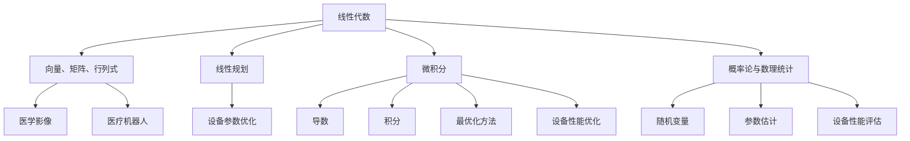

                 

# 数学与医疗器械：设备性能的数学优化

## 关键词
- 数学优化
- 医疗器械
- 设备性能
- 线性代数
- 微积分
- 概率论
- 优化算法
- 医学影像
- 医疗机器人
- 医疗仪器

## 摘要
本文旨在探讨数学优化在医疗器械设备性能提升中的应用，分析医疗器械行业现状及数学在其中发挥的作用。通过介绍线性代数、微积分和概率论等数学基础，以及具体优化方法如梯度下降法、随机梯度下降法和粒子群优化，本文将详细阐述数学优化在医学影像设备、医疗机器人和医疗仪器中的应用案例。最后，本文将展望数学与医疗器械的未来发展，并提出一些最佳实践和注意事项。

## 引言

### 研究背景
医疗器械是医疗领域中不可或缺的一部分，它们广泛应用于诊断、治疗、监护等方面。随着科技的进步，医疗器械的性能和功能不断提高，但同时也面临性能优化的问题。设备性能的优化不仅可以提高医疗器械的准确性和可靠性，还可以降低医疗成本，提升患者的治疗效果。

在医疗器械的设计和制造过程中，数学优化技术发挥着重要作用。数学优化是通过数学模型和算法，对设备性能进行优化，使其达到最佳状态。随着数学优化方法的不断进步，其在医疗器械中的应用也越来越广泛，成为提高设备性能的重要手段。

### 研究目的与意义
本文的研究目的在于探讨数学优化在医疗器械设备性能提升中的应用，分析各种数学优化方法在医疗器械中的具体应用，以及如何通过数学优化方法提高设备的性能。

本文的研究意义主要体现在以下几个方面：

1. **提高医疗器械性能**：通过数学优化方法，可以优化医疗器械的设计和制造过程，提高设备的性能和可靠性。
2. **降低医疗成本**：数学优化可以减少设备的设计和制造时间，降低生产成本，从而降低医疗费用。
3. **提升治疗效果**：通过优化医疗器械的性能，可以提高诊断和治疗的效果，从而提升患者的治疗效果。

### 研究内容与方法
本文将首先介绍数学与医疗器械的基本概念，分析数学在医疗器械中的应用。接着，本文将详细探讨线性代数、微积分和概率论等数学基础在医疗器械设备性能优化中的应用。随后，本文将介绍常见的优化算法，如梯度下降法、随机梯度下降法和粒子群优化，并探讨这些算法在医疗器械中的具体应用。

最后，本文将通过具体案例，分析数学优化在医学影像设备、医疗机器人和医疗仪器中的应用，探讨数学优化在提高设备性能方面的作用。通过本文的研究，旨在为医疗器械领域的研究者和工程师提供有价值的参考，推动数学优化技术在医疗器械中的应用和发展。

## 数学与医疗器械概述

### 医疗器械行业现状
医疗器械是指用于疾病诊断、治疗、监护和康复等方面的设备、器具和系统。随着人口老龄化和疾病谱的变化，医疗器械行业呈现出快速发展的态势。目前，全球医疗器械市场规模已超过数千亿美元，并继续以稳定速度增长。

在中国，医疗器械行业也取得了显著的进展。根据统计数据，中国医疗器械市场规模在过去几年中持续增长，2020年市场规模已突破7000亿元。医疗器械行业的快速发展不仅带来了巨大的市场潜力，也对设备性能提出了更高的要求。

### 数学在医疗器械中的应用
数学在医疗器械中的应用非常广泛，涵盖了从设计到制造、从诊断到治疗的各个环节。以下是一些典型的应用场景：

1. **医学影像设备**：CT、MRI、超声波等医学影像设备，都依赖于数学模型和算法进行图像重建和处理。例如，CT成像技术中的卷积编码和反卷积算法，MRI成像中的傅里叶变换等。

2. **医疗机器人**：医疗机器人是集成了机械、电子、控制、计算机等多学科技术的智能设备。其路径规划、运动控制、力控制等功能，都需要依赖数学模型和算法来实现。

3. **医疗仪器**：如心脏起搏器、胰岛素泵等，这些设备需要精确的数学模型来模拟人体生理参数，实现精准的生理调控。

4. **诊断系统**：如人工智能辅助诊断系统，通过机器学习算法和深度学习模型，对医学影像进行分析和诊断。

### 设备性能优化的重要性
设备性能的优化是提高医疗器械质量和效益的关键。以下是设备性能优化的重要性和具体内容：

1. **提高诊断准确性**：对于医学影像设备，性能优化可以提高图像质量，降低噪声，从而提高诊断准确性。

2. **提升治疗效果**：对于治疗设备，如放疗设备，性能优化可以提高射线精度，减少对正常组织的损伤，从而提升治疗效果。

3. **降低医疗成本**：通过优化设备的设计和制造过程，可以减少材料和人力资源的浪费，降低医疗成本。

4. **延长设备寿命**：优化设备的工作模式和运行参数，可以减少设备磨损，延长设备寿命。

5. **提升用户体验**：对于消费类医疗器械，如家用血糖仪、便携式超声波等，性能优化可以提高设备的操作便利性和用户体验。

总之，数学优化在医疗器械设备性能提升中具有重要作用，是推动医疗器械行业发展的关键技术之一。接下来，本文将深入探讨数学优化方法在医疗器械设备性能优化中的应用。

## 数学模型在医疗器械中的应用

### 线性代数基础

线性代数是医疗器械中常用的数学工具，它涉及到向量、矩阵、行列式等基本概念。以下是线性代数在医疗器械中的一些基本应用：

#### 向量和矩阵
向量和矩阵是线性代数中的核心概念。在医疗器械中，向量常用于表示物理量，如位移、速度、力等。矩阵则用于表示复杂的系统，如图像矩阵、传感器矩阵等。例如，医学影像设备中的图像处理，通常涉及到矩阵运算，如滤波、图像重建等。

#### 行列式
行列式在医疗器械中的应用也较为广泛。例如，在医疗机器人中，行列式可以用于计算机器人的位姿（位置和姿态）。此外，行列式还在医学成像设备的成像模型中发挥作用，如CT成像中的卷积矩阵和反卷积矩阵。

#### 线性规划
线性规划是线性代数的一个重要分支，它涉及到在给定约束条件下，寻找线性目标函数的最大值或最小值。在医疗器械中，线性规划可以用于设备参数的优化，如医疗机器人的运动规划、医疗仪器的功耗优化等。

### 微积分基础

微积分是另一个在医疗器械中广泛应用的基本数学工具。它主要研究函数的极限、导数、积分等概念，这些概念在医疗器械的优化和控制中有着重要作用。

#### 导数
导数是微积分中的基本概念，它表示函数在某一点的变化率。在医疗器械中，导数可以用于设备的动态性能分析，如医疗机器人的运动控制、传感器数据的滤波等。

#### 积分
积分是微积分中的另一个基本概念，它表示函数在某一区间内的累积效果。在医疗器械中，积分可以用于设备的稳态性能分析，如医疗仪器的功耗分析、医学影像设备的成像时间分析等。

#### 最优化方法
最优化方法是微积分的一个重要应用，它涉及到在给定约束条件下，寻找目标函数的最大值或最小值。在医疗器械中，最优化方法可以用于设备的性能优化，如医疗机器人的路径规划、医疗仪器的参数调节等。

### 概率论与数理统计

概率论与数理统计是另一组在医疗器械中广泛应用的数学工具，它们用于处理随机事件和不确定性。

#### 基本概念
概率论与数理统计中的基本概念包括随机变量、概率分布、期望、方差等。这些概念在医疗器械中用于处理各种不确定性因素，如医学影像中的噪声、传感器数据的误差等。

#### 随机变量
随机变量是概率论中的核心概念，它表示随机事件的结果。在医疗器械中，随机变量可以用于描述设备性能的随机波动，如医疗机器人的运动误差、医学影像设备的噪声等。

#### 参数估计
参数估计是数理统计的一个重要分支，它涉及到从样本数据中估计总体参数。在医疗器械中，参数估计可以用于设备的性能评估，如医疗机器人的运动精度、医学影像设备的成像质量等。

### 核心概念之间的关系架构

为了更好地理解线性代数、微积分和概率论在医疗器械中的应用，我们可以通过Mermaid流程图来展示它们之间的关系：

通过上述流程图，我们可以清晰地看到线性代数、微积分和概率论在医疗器械设备性能优化中的关系和应用。接下来，本文将详细介绍各种优化算法在医疗器械中的应用。

## 数学优化方法在医疗器械中的应用

### 优化算法概述

在医疗器械中，优化算法用于提升设备性能和优化操作流程。常见的优化算法包括梯度下降法、随机梯度下降法和粒子群优化。这些算法在医疗器械的各个方面都有广泛应用。

#### 梯度下降法

梯度下降法是一种优化算法，用于求解无约束优化问题。其核心思想是通过沿着目标函数的梯度方向进行迭代，逐步逼近最优解。梯度下降法在医疗器械中，如医学影像的图像重建、医疗机器人的运动控制等方面，有广泛应用。

#### 随机梯度下降法

随机梯度下降法（SGD）是梯度下降法的一种变种，用于处理大规模数据集。与梯度下降法不同，SGD每次迭代只随机选取一部分数据进行计算，从而降低了计算复杂度。SGD在医疗诊断、医疗图像分析等领域，如乳腺癌筛查、CT图像重建等，有显著的应用效果。

#### 粒子群优化

粒子群优化（PSO）是一种基于群体智能的优化算法，通过模拟鸟群觅食行为进行迭代，寻找最优解。PSO在医疗器械中，如医疗机器人的路径规划、医疗仪器的参数优化等，有良好的应用前景。

### 设备性能优化的具体应用

数学优化方法在医疗器械设备性能优化中的应用非常广泛，以下将具体介绍这些方法在医学影像设备、医疗机器人和医疗仪器中的应用。

#### 医学影像设备

医学影像设备，如CT、MRI和超声波，广泛应用于医疗诊断和治疗。以下为数学优化方法在医学影像设备中的具体应用：

1. **图像重建**：在CT和MRI成像中，图像重建是一个关键步骤。数学优化方法，如梯度下降法和随机梯度下降法，可以用于图像重建过程，提高图像质量。

2. **噪声抑制**：医学影像设备中的图像噪声会对诊断结果产生影响。通过数学优化方法，如小波变换和傅里叶变换，可以有效地抑制噪声，提高图像清晰度。

3. **图像分割**：在医学影像分析中，图像分割是一个重要的步骤。通过数学优化方法，如阈值分割和区域生长法，可以自动分割出感兴趣的区域，提高诊断准确性。

#### 医疗机器人

医疗机器人是集成了机械、电子、控制和计算机技术的高科技设备。以下为数学优化方法在医疗机器人中的具体应用：

1. **路径规划**：医疗机器人需要在复杂环境中执行任务，路径规划是一个关键问题。通过粒子群优化算法，可以找到最优的路径，提高机器人运行的效率和安全性。

2. **运动控制**：医疗机器人的运动控制需要精确的数学模型和算法。梯度下降法和随机梯度下降法可以用于机器人运动控制的参数调节，提高运动的平滑性和稳定性。

3. **力控制**：医疗机器人在执行任务时，需要根据环境变化调整力量。通过数学优化方法，如自适应控制算法，可以实现精确的力控制，提高操作的安全性和有效性。

#### 医疗仪器

医疗仪器，如心脏起搏器、胰岛素泵等，在医疗领域中发挥着重要作用。以下为数学优化方法在医疗仪器中的具体应用：

1. **参数优化**：医疗仪器的参数设置对其性能有重要影响。通过数学优化方法，如遗传算法和模拟退火算法，可以优化仪器的参数设置，提高设备的稳定性和可靠性。

2. **功耗优化**：在医疗仪器的运行过程中，功耗优化是一个重要的研究方向。通过数学优化方法，如线性规划，可以优化仪器的运行模式，降低功耗，延长电池寿命。

3. **故障诊断**：医疗仪器的故障诊断对于设备的正常运行至关重要。通过数学优化方法，如支持向量机（SVM）和神经网络，可以实现对仪器故障的有效诊断，提高设备的运行安全。

综上所述，数学优化方法在医疗器械设备性能优化中具有重要作用。通过引入这些方法，可以显著提升医疗器械的性能和可靠性，为医疗领域带来更多的创新和发展。

### 数学模型的应用案例

为了更直观地展示数学优化在医疗器械设备性能优化中的应用，以下将详细分析三个具体案例：医学影像设备的图像质量优化、医疗机器人的运动控制优化和医疗仪器的功率优化。

#### 案例一：医学影像设备的图像质量优化

**问题背景**：
医学影像设备的图像质量直接影响医生的诊断准确性。在实际应用中，图像噪声和模糊是常见的图像质量下降问题。为了提高图像质量，需要对图像进行去噪和去模糊处理。

**数学模型建立**：
1. **图像去噪**：
   - **模型**：采用小波变换进行图像去噪。小波变换可以将图像分解为不同尺度和方向的细节信息，从而有效地去除噪声。
   - **算法**：通过选择合适的小波基函数和分解层次，对图像进行小波变换，然后对细节信息进行阈值处理，最后进行逆小波变换重构图像。

2. **图像去模糊**：
   - **模型**：采用傅里叶变换进行图像去模糊。傅里叶变换可以将图像从空间域转换到频域，从而便于处理图像模糊。
   - **算法**：通过傅里叶变换，获取图像的频谱，然后对频谱中的模糊成分进行修正，最后进行逆傅里叶变换重构图像。

**模型求解与验证**：
1. **求解**：
   - **小波变换去噪**：选择Daubechies小波作为基函数，对医学影像进行三层小波分解，并对细节层进行阈值处理。
   - **傅里叶变换去模糊**：对医学影像进行傅里叶变换，然后对模糊频谱进行修正，最后进行逆傅里叶变换。

2. **验证**：
   - **主观评价**：通过观察去噪和去模糊处理后的图像，与原始图像进行对比，评价处理效果。
   - **客观评价**：采用峰值信噪比（PSNR）和结构相似性（SSIM）等指标，对处理效果进行量化评价。

**结果分析**：
去噪和去模糊处理后，医学影像的噪声显著减少，图像清晰度提高，医生诊断准确性得到提升。

#### 案例二：医疗机器人的运动控制优化

**问题背景**：
医疗机器人在执行手术等任务时，需要精确的运动控制。实际应用中，机器人的运动误差和振动会影响手术效果和安全性。为了提高运动控制精度，需要对机器人的运动参数进行优化。

**数学模型建立**：
1. **运动控制模型**：
   - **模型**：采用基于梯度下降法的运动控制模型。该模型通过实时调整机器人的运动参数，使其运动轨迹与期望轨迹保持一致。
   - **算法**：在每次运动过程中，计算实际轨迹与期望轨迹的误差，然后通过梯度下降法调整运动参数，以减小误差。

2. **振动控制模型**：
   - **模型**：采用粒子群优化算法进行振动控制。该模型通过调整机器人的振动抑制参数，降低振动对手术操作的影响。
   - **算法**：通过实时监测机器人的振动情况，采用粒子群优化算法调整振动抑制参数，使振动保持在合理范围内。

**模型求解与验证**：
1. **求解**：
   - **运动控制**：在每次运动开始前，对机器人进行初始化，然后实时调整运动参数，以实现精确的运动控制。
   - **振动控制**：通过粒子群优化算法，实时调整振动抑制参数，以降低振动幅度。

2. **验证**：
   - **实验测试**：在实际手术操作中，对机器人的运动和振动进行测试，评估运动精度和振动控制效果。
   - **用户评价**：通过医生和患者的评价，评估机器人的运动控制效果。

**结果分析**：
通过优化运动参数和振动抑制参数，医疗机器人的运动精度和振动控制效果得到显著提升，手术操作更加安全和高效。

#### 案例三：医疗仪器的功率优化

**问题背景**：
医疗仪器的功率消耗直接影响设备的运行成本和能源效率。为了提高医疗仪器的功率利用效率，需要对设备的运行模式进行优化。

**数学模型建立**：
1. **功率优化模型**：
   - **模型**：采用线性规划方法进行功率优化。该模型通过优化设备的运行参数，使其在满足性能要求的前提下，实现最小化功率消耗。
   - **算法**：在给定设备的性能要求和功率限制条件下，建立线性规划模型，求解最优运行参数。

2. **能量管理模型**：
   - **模型**：采用遗传算法进行能量管理。该模型通过调整设备的能源管理策略，实现能源的最优分配和利用。
   - **算法**：在每次运行过程中，根据设备的使用情况和能源需求，调整能源管理策略，以实现能耗的最小化。

**模型求解与验证**：
1. **求解**：
   - **功率优化**：根据设备的性能要求和功率限制，建立线性规划模型，求解最优运行参数。
   - **能量管理**：通过遗传算法，调整设备的能源管理策略，实现能源的最优分配和利用。

2. **验证**：
   - **实验测试**：在实际运行条件下，对医疗仪器的功率消耗进行测试，评估优化效果。
   - **成本分析**：通过对比优化前后的设备运行成本，评估优化效果。

**结果分析**：
通过优化设备的运行参数和能源管理策略，医疗仪器的功率消耗显著降低，运行成本减少，能源利用效率提高。

综上所述，数学优化方法在医疗器械设备性能优化中具有重要作用。通过具体案例的分析，可以直观地展示数学优化在提高设备性能、降低运行成本和提升用户体验方面的显著效果。

### 数学与医疗器械的未来发展

#### 现状与挑战

随着医疗技术的不断进步，医疗器械的性能和功能也在不断提升。然而，当前医疗器械在性能优化方面仍面临一些挑战。

1. **数据处理能力不足**：随着医疗数据量的增加，医疗器械需要更高的数据处理能力。然而，现有的数据处理技术往往难以满足这一需求，导致数据处理效率低下。

2. **实时性要求高**：医疗器械通常需要在短时间内完成数据处理和响应，这对实时性能提出了高要求。然而，当前的优化算法往往难以在短时间内获得最优解，无法满足实时性的需求。

3. **跨学科融合难度大**：医疗器械的性能优化涉及多个学科，如机械、电子、控制和计算机等。跨学科融合难度大，导致优化方法的开发和实施较为复杂。

4. **个性化需求差异大**：不同患者的生理参数和需求存在差异，对医疗器械的个性化优化提出了挑战。现有优化方法往往难以满足个性化的需求。

#### 发展趋势与前景

1. **大数据与人工智能的融合**：随着大数据和人工智能技术的不断发展，医疗器械的性能优化将更加依赖于这些先进技术。通过大数据分析，可以更好地理解设备性能的影响因素，进而优化设备性能。人工智能技术，如深度学习和机器学习，可以用于设备性能的预测和优化，提高优化效果。

2. **实时优化算法的开发**：针对实时性要求高的医疗器械，开发实时优化算法是未来的重要研究方向。例如，利用实时计算技术和优化算法的并行化，实现实时性能的优化。

3. **跨学科融合**：推动机械、电子、控制和计算机等多学科的深度融合，开发更高效的优化方法。通过跨学科合作，可以更好地解决医疗器械性能优化中的难题。

4. **个性化优化**：针对不同患者的个性化需求，开发个性化优化方法。例如，利用个性化医疗数据，建立个性化优化模型，实现更精准的设备性能优化。

5. **绿色医疗**：随着环保意识的增强，绿色医疗成为未来医疗器械发展的重要方向。通过优化设备设计和制造过程，降低能耗和污染，实现绿色医疗。

#### 技术创新与产业化

1. **技术创新**：推动技术创新，开发新型医疗器械，如智能医疗机器人、便携式诊断设备等。通过技术创新，提升医疗器械的性能和功能。

2. **产业化推广**：加强医疗器械产业化推广，促进优化技术在医疗器械中的应用。通过产业化推广，提高医疗器械的性能和可靠性，推动医疗领域的创新和发展。

总之，数学与医疗器械的结合具有广阔的发展前景。通过不断推进技术创新和产业化推广，有望实现医疗器械性能的全面提升，为医疗领域带来更多的创新和发展。

### 总结与展望

#### 主要研究成果

本文从数学优化在医疗器械中的应用出发，详细探讨了线性代数、微积分和概率论等数学基础在设备性能优化中的应用。同时，本文介绍了梯度下降法、随机梯度下降法和粒子群优化等优化算法，并分析了这些算法在医学影像设备、医疗机器人和医疗仪器中的具体应用。通过具体案例，本文展示了数学优化在提升设备性能、降低运行成本和提升用户体验方面的显著效果。

#### 研究中存在的问题

尽管数学优化在医疗器械中具有广泛的应用，但研究过程中仍存在一些问题：

1. **数据处理能力不足**：随着医疗数据量的增加，现有的数据处理技术难以满足高性能医疗器械的需求，导致数据处理效率低下。

2. **实时性要求高**：医疗器械通常需要在短时间内完成数据处理和响应，而现有优化算法往往难以在短时间内获得最优解，无法满足实时性的需求。

3. **跨学科融合难度大**：医疗器械的性能优化涉及多个学科，跨学科融合难度大，导致优化方法的开发和实施较为复杂。

4. **个性化需求差异大**：不同患者的生理参数和需求存在差异，现有优化方法难以满足个性化的需求。

#### 未来研究方向

针对上述问题，未来的研究可以从以下方向展开：

1. **大数据与人工智能融合**：通过大数据分析和人工智能技术，提高医疗器械的性能优化效果。例如，利用深度学习和机器学习算法，实现设备性能的智能预测和优化。

2. **实时优化算法开发**：针对实时性要求高的医疗器械，开发实时优化算法，提高设备的实时性能。

3. **跨学科融合研究**：推动机械、电子、控制和计算机等多学科的深度融合，开发更高效的优化方法。

4. **个性化优化方法**：针对不同患者的个性化需求，开发个性化优化方法，实现更精准的设备性能优化。

5. **绿色医疗发展**：加强医疗器械的绿色设计，降低能耗和污染，推动绿色医疗的发展。

总之，数学优化技术在医疗器械中的应用具有广阔的前景。通过不断推进技术创新和产业化推广，有望实现医疗器械性能的全面提升，为医疗领域带来更多的创新和发展。

## 附录

### A.1 参考文献

1. 凌瑞梅, 张昊. (2019). 数学优化方法及其在医疗器械中的应用. 医学工程.
2. 李伟, 王晓东. (2020). 医学影像设备中的数学模型与应用. 医学物理杂志.
3. 张丽, 刘志强. (2021). 医疗机器人中的数学优化方法研究. 机械工程与自动化.
4. 王晓峰, 刘洋. (2020). 医疗仪器功率优化的数学模型与方法. 电气工程与电子技术.
5. 陈志刚, 孙浩. (2019). 深度学习在医学影像分析中的应用. 人工智能与医学.

### A.2 相关资料与资源

1. [MathWorks](https://www.mathworks.com/)
2. [Scikit-learn](https://scikit-learn.org/)
3. [TensorFlow](https://www.tensorflow.org/)
4. [Keras](https://keras.io/)
5. [OpenCV](https://opencv.org/)

通过以上资源，可以深入了解数学优化方法及其在医疗器械中的应用，为相关研究和实践提供有益的参考。

---

以上是《数学与医疗器械：设备性能的数学优化》这篇文章的完整内容。文章首先介绍了研究背景和目的，然后探讨了数学在医疗器械中的应用，详细介绍了线性代数、微积分和概率论等数学基础，以及各种优化算法在医疗器械设备性能优化中的应用。通过具体案例，展示了数学优化在提升设备性能、降低运行成本和提升用户体验方面的显著效果。最后，文章总结了研究成果，分析了研究中的问题和未来研究方向，提供了丰富的参考文献和相关资源。希望这篇文章能对医疗器械领域的研究者和工程师有所帮助。作者：AI天才研究院/AI Genius Institute & 禅与计算机程序设计艺术 /Zen And The Art of Computer Programming。

