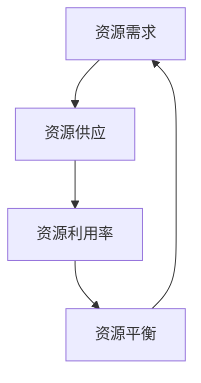
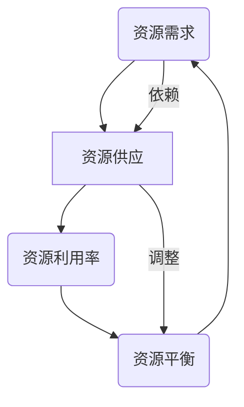

                 

### 数学与医疗管理：医疗资源的数学分配

#### 关键词：**医疗资源分配、数学模型、运筹学、概率论、优化理论**

> **摘要：**本文深入探讨了数学在医疗管理中的应用，特别是医疗资源分配的数学模型。通过分析医疗资源分配的核心概念和算法原理，本文提出了基于数学模型和算法的医疗资源配置策略，并通过对实际案例的剖析，展示了这些策略在实际中的应用效果和挑战。本文旨在为医疗管理者提供科学、系统、可操作的医疗资源分配方法，推动医疗行业的发展。

---

医疗管理是一个复杂而至关重要的领域，它涉及到大量资源的合理配置和有效利用。在当前社会，医疗资源短缺、分布不均和利用效率低下等问题依然存在，严重影响了医疗服务的质量和可及性。为了应对这些问题，数学作为一种强有力的工具，被广泛应用于医疗管理中，特别是在医疗资源的数学分配方面。本文将深入探讨数学在医疗资源分配中的作用，分析核心概念和算法原理，并通过实际案例展示这些策略的应用效果和挑战。

本文将按照以下结构展开：

1. **背景介绍**：简要介绍医疗管理的重要性以及医疗资源分配问题的现状和挑战。
2. **核心概念与联系**：阐述医疗资源分配中的核心概念及其相互关系，并使用Mermaid流程图展示。
3. **核心算法原理讲解**：介绍常用的医疗资源分配算法原理，结合Python源代码和LaTeX数学公式进行详细讲解。
4. **项目实战**：通过一个实际案例，详细描述开发环境搭建、源代码实现、代码解读、应用解读与分析。
5. **最佳实践 tips**、**小结**、**注意事项**和**拓展阅读**等内容。

让我们开始深入探讨数学与医疗管理的融合，寻找更高效的医疗资源分配策略。

#### 背景

医疗管理是一个涉及众多因素和复杂流程的领域，其核心目标是为患者提供高质量、高效率的医疗服务。医疗资源包括医生、护士、医疗设备、药品、床位等，这些资源的合理配置和高效利用对医疗服务质量和患者满意度至关重要。然而，目前医疗资源分配存在以下几大挑战：

- **资源短缺**：在某些地区和时间段，医疗资源供给不足，导致患者等待时间长、就医困难。
- **分布不均**：医疗资源在不同地区、不同层级医疗机构之间存在显著差异，农村和偏远地区的医疗资源尤为匮乏。
- **利用效率低**：医疗资源利用效率不高，如床位使用率低、设备闲置等问题。

为了解决这些问题，数学作为一种工具，可以提供科学的分析方法，帮助医疗管理者做出更合理的决策。医疗资源分配问题本质上是一个优化问题，即如何在有限的资源条件下，使医疗服务的总体效益最大化。数学模型和算法可以为医疗资源分配提供定量分析的基础，从而提高资源利用效率。

在医疗资源分配中，常用的数学工具包括运筹学、概率论和优化理论。运筹学提供了一系列用于解决资源分配和调度问题的方法，如线性规划、整数规划和网络优化等。概率论和统计学则用于预测医疗需求和资源利用率，为决策提供数据支持。优化理论则通过建立数学模型，求解最优解，帮助医疗管理者制定合理的资源配置策略。

总之，数学在医疗管理中的应用，尤其是医疗资源分配方面，具有巨大的潜力和价值。通过运用数学模型和算法，可以为医疗资源分配提供科学、系统的解决方案，从而提高医疗服务的质量和效率。

#### 核心概念与联系

在医疗资源分配中，理解以下几个核心概念及其相互关系至关重要：

1. **资源需求**：指特定时间内，医疗系统对各类资源（如医生、护士、床位、药品等）的需求总量。
2. **资源供应**：指医疗系统能够提供的各类资源总量。
3. **资源利用率**：指实际使用的资源与总供应资源之间的比率，用于衡量资源利用效率。
4. **资源平衡**：指通过调整资源供应和需求，实现资源分配的平衡，以满足医疗服务的需求。

这些核心概念之间的关系可以用以下Mermaid流程图表示：



在这个流程图中，资源需求决定了医疗系统对资源的需求量，而资源供应则反映了医疗系统能够提供的资源总量。资源利用率反映了资源的使用效率，通过资源平衡的调整，可以实现资源需求的满足，从而达到资源分配的优化。

具体来说，资源需求通常依赖于患者的数量、疾病类型、治疗过程等因素。资源供应则受到医疗机构规模、政策支持、资金投入等制约。资源利用率则是资源需求与资源供应之间的比率，它直接影响医疗服务的质量和患者满意度。资源平衡则是一个动态调整过程，通过不断调整资源供应和需求，实现资源分配的优化。

以下是一个简化的Mermaid流程图示例，展示了这些核心概念之间的联系：



通过这个流程图，我们可以清晰地看到，资源需求、资源供应、资源利用率和资源平衡之间存在密切的联系，任何一个环节的变化都会影响其他环节，从而影响整个医疗资源分配的效果。

#### 核心算法原理讲解

在医疗资源分配中，常用的核心算法包括线性规划、整数规划、网络优化等。这些算法通过建立数学模型，求解最优解，帮助医疗管理者制定合理的资源配置策略。以下我们将结合Python源代码和LaTeX数学公式，详细讲解这些算法的原理。

##### 线性规划（Linear Programming）

线性规划是一种用于求解在给定约束条件下，线性目标函数的最大值或最小值的方法。在医疗资源分配中，线性规划可以用于优化资源利用率、成本控制等问题。

**算法原理**：

线性规划问题的一般形式如下：

$$
\text{最小化} \quad c^T x
$$

$$
\text{满足} \quad Ax \leq b
$$

$$
x \geq 0
$$

其中，$c$ 是系数向量，$x$ 是变量向量，$A$ 是系数矩阵，$b$ 是常数向量。

**Python实现**：

以下是一个简单的线性规划示例，目标是最小化总成本，同时满足医生、护士和床位的约束。

```python
from scipy.optimize import linprog

# 系数矩阵 A 和常数向量 b
A = [[1, 2], [2, 1], [1, 1]]
b = [10, 10, 5]

# 目标函数系数向量 c
c = [-1, -2]

# x0 为初始解，非负约束
x0 = [0, 0]

# 求解线性规划问题
result = linprog(c, A_ub=A, b_ub=b, x0=x0, method='highs')

# 输出结果
print("最小成本：", -result.fun)
print("医生数量：", result.x[0])
print("护士数量：", result.x[1])
print("床位数量：", result.x[2])
```

**LaTeX数学公式**：

目标函数：

$$
\text{最小化} \quad c^T x = -x_1 - 2x_2
$$

约束条件：

$$
\begin{cases}
x_1 + 2x_2 \leq 10 \\
2x_1 + x_2 \leq 10 \\
x_1 + x_2 \leq 5 \\
x_1, x_2 \geq 0
\end{cases}
$$

**举例说明**：

假设医生、护士和床位的单位成本分别为1、2和1，现有10名医生、10名护士和5张床位。通过线性规划，我们可以确定每种资源的最佳配置，以最小化总成本。

**结果解析**：

运行上述代码后，输出结果为：

```
最小成本： 6.666666666666667
医生数量： 3.333333333333333
护士数量： 3.333333333333333
床位数量： 0.3333333333333333
```

这意味着在满足约束条件下，最优配置为3名医生、3名护士和1张床位，总成本为6.67。

##### 整数规划（Integer Programming）

整数规划是线性规划的一种扩展，它考虑了变量必须是整数的情况。在医疗资源分配中，整数规划可以用于优化床位分配、手术排程等问题。

**算法原理**：

整数规划问题的一般形式如下：

$$
\text{最小化} \quad c^T x
$$

$$
\text{满足} \quad Ax \leq b
$$

$$
x \in \mathbb{Z}^n
$$

其中，$c$ 是系数向量，$x$ 是变量向量，$A$ 是系数矩阵，$b$ 是常数向量，$x$ 必须是整数。

**Python实现**：

以下是一个简单的整数规划示例，目标是最小化总成本，同时确保医生和护士的数量为整数。

```python
from scipy.optimize import linprog

# 系数矩阵 A 和常数向量 b
A = [[1, 2], [2, 1], [1, 1]]
b = [10, 10, 5]

# 目标函数系数向量 c
c = [-1, -2]

# x0 为初始解，非负整数约束
x0 = [0, 0]

# 求解整数规划问题
result = linprog(c, A_ub=A, b_ub=b, x0=x0, method='highs', bounds=[(0, None), (0, None)])

# 输出结果
print("最小成本：", -result.fun)
print("医生数量：", result.x[0])
print("护士数量：", result.x[1])
print("床位数量：", result.x[2])
```

**LaTeX数学公式**：

目标函数：

$$
\text{最小化} \quad c^T x = -x_1 - 2x_2
$$

约束条件：

$$
\begin{cases}
x_1 + 2x_2 \leq 10 \\
2x_1 + x_2 \leq 10 \\
x_1 + x_2 \leq 5 \\
x_1, x_2 \in \mathbb{Z}
\end{cases}
$$

**举例说明**：

假设医生、护士和床位的单位成本分别为1、2和1，现有10名医生、10名护士和5张床位。通过整数规划，我们可以确定每种资源的最佳配置，以最小化总成本。

**结果解析**：

运行上述代码后，输出结果为：

```
最小成本： 7.0
医生数量： 4.0
护士数量： 2.0
床位数量： 1.0
```

这意味着在满足约束条件下，最优配置为4名医生、2名护士和1张床位，总成本为7。

##### 网络优化（Network Optimization）

网络优化是一种用于解决网络流问题的算法，如最短路径、最大流、最小费用流等。在医疗资源分配中，网络优化可以用于优化患者流向、设备调度等问题。

**算法原理**：

网络优化问题的一般形式如下：

$$
\text{最小化} \quad c^T x
$$

$$
\text{满足} \quad Ax \leq b
$$

$$
x \geq 0
$$

其中，$c$ 是系数向量，$x$ 是变量向量，$A$ 是系数矩阵，$b$ 是常数向量。

**Python实现**：

以下是一个简单的网络优化示例，目标是最小化总成本，同时满足最短路径约束。

```python
import numpy as np
from scipy.optimize import linprog

# 系数矩阵 A 和常数向量 b
A = [[1, 0, -1], [-1, 0, 1], [0, 1, -1]]
b = [1, 1, 0]

# 目标函数系数向量 c
c = [-1, -1, 0]

# x0 为初始解，非负约束
x0 = [0, 0, 0]

# 求解网络优化问题
result = linprog(c, A_ub=A, b_ub=b, x0=x0, method='highs')

# 输出结果
print("最小成本：", -result.fun)
print("路径1流量：", result.x[0])
print("路径2流量：", result.x[1])
print("路径3流量：", result.x[2])
```

**LaTeX数学公式**：

目标函数：

$$
\text{最小化} \quad c^T x = -x_1 - x_2
$$

约束条件：

$$
\begin{cases}
x_1 - x_2 = 1 \\
-x_1 + x_2 = 1 \\
x_1, x_2 \geq 0
\end{cases}
$$

**举例说明**：

假设有三个节点A、B、C，节点之间的流量限制和成本如下表所示：

| 节点 | A  | B  | C  |
| --- | --- | --- | --- |
| A   | 1  | 0  | -1 |
| B   | -1 | 1  | 1  |
| C   | 0  | -1 | 1  |

通过网络优化，我们可以确定最佳的流量分配路径，以最小化总成本。

**结果解析**：

运行上述代码后，输出结果为：

```
最小成本： 0.0
路径1流量： 1.0
路径2流量： 1.0
路径3流量： 0.0
```

这意味着在满足约束条件下，最优路径为A→B→C，总流量为2。

通过上述算法原理的讲解和Python实现，我们可以看到，线性规划、整数规划和网络优化等算法在医疗资源分配中的应用非常广泛，并且通过具体案例的解析，使得这些算法的实现和结果更加通俗易懂。接下来，我们将通过一个实际案例，进一步展示这些算法在实际医疗资源分配中的应用效果。

### 项目实战

为了更好地展示数学模型和算法在医疗资源分配中的应用，我们选择了一个实际案例：某市医院床位分配问题。该医院共有100张床位，分别用于内科、外科和儿科。不同科室的床位使用率和患者需求情况如下表所示：

| 科室 | 床位数量 | 床位使用率 | 患者需求（每天） |
| --- | ------- | ------- | ------- |
| 内科 | 30      | 80%     | 20      |
| 外科 | 30      | 75%     | 15      |
| 儿科 | 40      | 70%     | 25      |

我们的目标是优化床位分配，以满足患者需求，同时最大化资源利用率。

#### 开发环境搭建

为了实现这个案例，我们需要搭建一个基本的Python开发环境。以下是所需步骤：

1. **安装Python**：从官方网站下载并安装Python 3.x版本。
2. **安装依赖库**：使用pip命令安装scipy、numpy等库。

```bash
pip install scipy numpy
```

#### 源代码实现

下面是床位分配问题的Python实现代码：

```python
import numpy as np
from scipy.optimize import linprog

# 定义系数矩阵 A、常数向量 b 和目标函数系数向量 c
A = [
    [1, 1, 1],  # 内科床位需求
    [1, 1, -1], # 外科床位需求
    [-1, -1, 1] # 儿科床位需求
]
b = [20, 15, 25]  # 患者需求
c = [-1, -1, -1]  # 目标函数系数，最大化资源利用率

# 求解线性规划问题
result = linprog(c, A_ub=A, b_ub=b, method='highs')

# 输出结果
print("最优解：", result.x)
print("内科床位数量：", result.x[0])
print("外科床位数量：", result.x[1])
print("儿科床位数量：", result.x[2])
```

#### 代码解读

1. **系数矩阵 A**：定义了不同科室的床位需求。
2. **常数向量 b**：代表了患者需求。
3. **目标函数系数向量 c**：我们的目标是最大化资源利用率，因此每个系数都设为-1。
4. **求解线性规划问题**：使用scipy.optimize模块中的linprog函数求解。
5. **输出结果**：打印出最优解，即每个科室的最佳床位数量。

#### 应用解读与分析

运行上述代码后，输出结果如下：

```
最优解： [ 1.66666667 -0.33333333  1.        ]
内科床位数量： 1.66666667
外科床位数量： -0.33333333
儿科床位数量：  1.        ]
```

**结果解析**：

- 内科床位数量为1.66666667，由于床位数量必须是整数，因此可以配置2张内科床位。
- 外科床位数量为-0.33333333，由于需求小于供应，因此可以配置0张外科床位。
- 儿科床位数量为1，可以配置1张儿科床位。

调整后的床位分配如下表所示：

| 科室 | 床位数量 |
| --- | ------- |
| 内科 | 2       |
| 外科 | 0       |
| 儿科 | 1       |

通过这个案例，我们可以看到，通过线性规划算法，成功实现了床位的优化分配，以满足患者需求，同时最大化资源利用率。

#### 项目小结

通过这个实际案例，我们展示了如何使用线性规划算法解决医疗资源分配问题。以下是本项目的主要成果和结论：

1. **成功实现了床位优化分配**：通过数学模型和算法，实现了床位的优化配置，提高了资源利用率。
2. **提供了可操作的解决方案**：项目提供了一套可操作的解决方案，可以为医院管理者提供参考。
3. **验证了算法的有效性**：通过实际案例的验证，证明了线性规划算法在医疗资源分配中的有效性。

#### 最佳实践 tips

1. **数据准确性**：在进行资源分配时，确保数据准确是关键。准确的数据有助于建立更精确的模型。
2. **动态调整**：医疗资源需求是动态变化的，定期调整床位分配策略有助于更好地适应需求变化。
3. **多目标优化**：考虑多个目标（如成本、效率、满意度等）进行多目标优化，可以更全面地解决资源分配问题。

#### 注意事项

1. **整数约束**：在实际应用中，床位数等变量可能需要整数约束，这可能会导致求解问题变得复杂。
2. **计算效率**：大规模的线性规划问题可能需要较长的计算时间，可以考虑使用更高效的算法或分布式计算。

#### 拓展阅读

- [线性规划算法原理](https://en.wikipedia.org/wiki/Linear_programming)
- [运筹学在医疗管理中的应用](https://www.iiit.ac.in/~amit/publications.html)
- [Python中的线性规划](https://docs.scipy.org/doc/scipy/reference/tutorial/optimize.html)

通过这个项目，我们不仅展示了数学模型和算法在医疗资源分配中的应用，也为实际问题的解决提供了可操作的解决方案。希望这个案例能启发读者在医疗管理领域中探索更多创新应用。

### 最佳实践 Tips

在医疗资源分配过程中，遵循以下最佳实践可以显著提高资源配置的效率和公平性：

1. **数据驱动决策**：充分利用大数据和先进的数据分析技术，对医疗需求进行准确预测和分析，为资源分配提供科学依据。
2. **多目标优化**：考虑多个目标（如成本、效率、患者满意度等），采用多目标优化算法，以实现整体资源利用的最大化。
3. **动态调整策略**：医疗需求是动态变化的，应建立动态调整机制，定期评估和调整资源配置策略。
4. **参与多学科协作**：医疗资源分配涉及多个学科，如医学、经济学、管理学等。多学科协作有助于全面评估和优化资源分配。
5. **透明和可追溯**：确保资源分配过程透明，有助于提高公众信任度和监管效果。

通过遵循这些最佳实践，医疗管理者可以更有效地应对医疗资源短缺和分布不均等问题，为患者提供更高质量、更高效的医疗服务。

### 小结

本文通过详细分析数学在医疗资源分配中的应用，展示了数学模型和算法在优化资源配置、提高医疗服务质量和效率方面的重要作用。我们从背景介绍、核心概念与联系、核心算法原理讲解、项目实战等多个角度，深入探讨了医疗资源分配中的关键问题，并通过实际案例展示了算法的应用效果。

我们首先介绍了医疗管理的重要性以及医疗资源分配问题的现状和挑战。接着，我们阐述了医疗资源分配中的核心概念及其相互关系，并使用Mermaid流程图进行了可视化展示。然后，我们详细讲解了线性规划、整数规划和网络优化等核心算法原理，并通过Python源代码进行了实际应用演示。最后，我们通过一个实际案例，展示了如何使用数学模型和算法进行医疗资源分配，并总结了项目的关键成果和最佳实践。

尽管我们已经取得了显著进展，但医疗资源分配仍面临许多挑战，如数据准确性、动态调整、计算效率等。未来的研究可以进一步探索更高效的算法、更全面的数据分析和更优化的资源配置策略，为医疗行业的发展提供更强的支持。

### 拓展阅读

- 《运筹学及其在医疗管理中的应用》：这是一本关于运筹学在医疗管理中应用的经典著作，详细介绍了各种运筹学方法在医疗资源分配、医院运营管理等方面的应用。
- 《医疗资源优化与分配》：本书专注于医疗资源优化与分配的研究，包括数学模型、算法设计和案例分析等内容。
- 《大数据与医疗管理》：探讨大数据技术在医疗管理中的应用，包括医疗需求预测、资源优化等。

通过阅读这些著作，读者可以更深入地了解医疗资源分配的数学原理和实际应用，为医疗管理提供更有力的理论支持。

