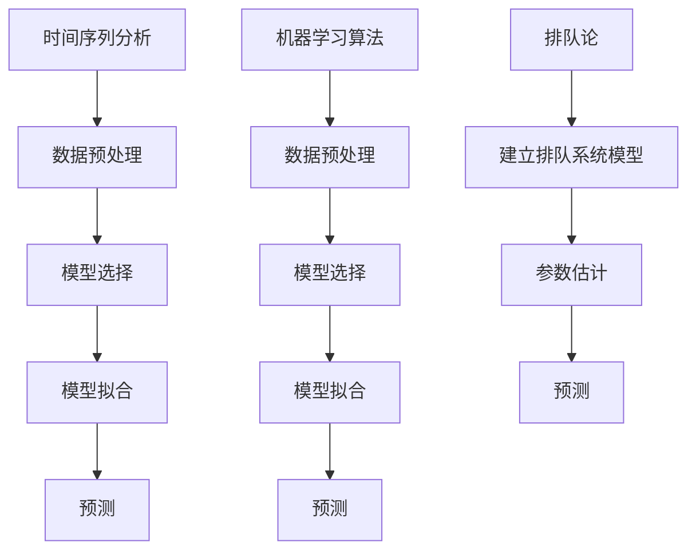

                 

### 引言与背景

在现代医学领域中，医疗资源的合理分配是一个至关重要的问题。随着人口老龄化和医疗技术进步，医疗系统的压力日益增加，如何高效、公平地分配有限的医疗资源，成为各国政府和医疗机构亟待解决的难题。医疗资源的分配不仅仅是医疗技术和管理问题，更是一个复杂的数学优化问题。通过数学模型和算法的应用，可以科学、系统地对医疗资源进行分配，从而提高医疗服务的质量和效率。

医疗资源包括但不限于医生、护士、医疗设备、药品和床位等。这些资源的合理分配对于确保患者得到及时、高质量的医疗服务至关重要。然而，由于医疗需求的多样性和不确定性，医疗资源的需求预测和分配策略面临巨大的挑战。传统的资源分配方法往往依赖于经验和直觉，缺乏科学性和系统性，难以满足现代医疗系统的复杂需求。

数学在医疗系统中的应用日益广泛，特别是在医疗资源分配方面。数学模型和算法能够量化医疗资源的需求和供给，提供客观的评估标准，帮助决策者制定合理的分配策略。例如，排队论、优化算法和机器学习等技术已经被广泛应用于医疗系统的资源分配中，为医疗资源的合理配置提供了有力支持。

本文旨在探讨数学在医疗系统中的应用，特别是医疗资源分配的数学模型和算法。文章将首先介绍医疗资源分配的基本概念和挑战，然后详细阐述医疗资源需求预测的数学模型，接着介绍医疗资源分配的主要模型和方法，并通过实际案例进行分析，最后对未来的发展趋势和挑战进行展望。

### 医疗资源需求预测的数学模型

在医疗资源分配中，准确预测需求是至关重要的一步。只有了解未来医疗资源的需求，才能制定出合理的分配策略，确保医疗系统能够高效、稳定地运行。医疗资源需求预测的数学模型主要包括时间序列分析、机器学习算法和排队论等。

#### 时间序列分析

时间序列分析是预测医疗资源需求的一种常用方法，它通过分析历史数据中的时间变化趋势，来预测未来的需求。时间序列分析的基本步骤包括数据预处理、模型选择、模型拟合和预测。

**数据预处理**：首先，需要对原始数据进行清洗和处理，包括缺失值填补、异常值处理和归一化等，以确保数据的质量和一致性。

**模型选择**：根据数据特征和预测目标，选择合适的时间序列模型。常见的时间序列模型包括ARIMA（自回归积分滑动平均模型）、AR（自回归模型）、MA（滑动平均模型）和季节性模型等。

**模型拟合**：使用历史数据对所选模型进行拟合，找到模型中的参数，使得模型能够最好地拟合历史数据。

**预测**：使用拟合好的模型对未来的医疗资源需求进行预测。通过模型，可以预测出在未来特定时间段内，医疗资源的需求量。

**Python代码示例**：

```python
import pandas as pd
from statsmodels.tsa.arima_model import ARIMA

# 加载数据
data = pd.read_csv('medical_demand.csv')

# 数据预处理
data.fillna(method='ffill', inplace=True)

# 选择模型
model = ARIMA(data['demand'], order=(5,1,2))

# 模型拟合
model_fit = model.fit()

# 预测
forecast = model_fit.forecast(steps=12)
```

#### 机器学习算法

机器学习算法在医疗资源需求预测中也发挥着重要作用。与时间序列分析不同，机器学习算法可以从大量的历史数据中自动学习模式，并用于未来的需求预测。常见的机器学习算法包括线性回归、决策树、随机森林和神经网络等。

**Python代码示例**：

```python
import pandas as pd
from sklearn.ensemble import RandomForestRegressor

# 加载数据
data = pd.read_csv('medical_demand.csv')

# 数据预处理
X = data[['feature1', 'feature2', 'feature3']]
y = data['demand']

# 选择模型
model = RandomForestRegressor(n_estimators=100)

# 模型拟合
model.fit(X, y)

# 预测
forecast = model.predict(X)
```

#### 排队论

排队论是另一个在医疗资源需求预测中广泛应用的方法。排队论通过分析患者到达时间、服务时间和系统容量等参数，来预测未来的需求。排队论的基本步骤包括建立排队系统模型、参数估计和预测。

**Python代码示例**：

```python
import pandas as pd
from queue_model import MCMCQueue

# 加载数据
data = pd.read_csv('patient_data.csv')

# 建立排队系统模型
queue = MCMCQueue("M/M/1", arrival_rates=data['arrival_rate'], service_rates=data['service_rate'])

# 参数估计
queue.fit(data)

# 预测
forecast = queue.simulate(steps=12)
```

通过上述方法，我们可以对医疗资源的需求进行准确预测，为医疗资源的合理分配提供科学依据。

#### Mermaid 流程图



通过时间序列分析、机器学习算法和排队论等多种方法，我们可以对医疗资源的需求进行准确预测，为医疗资源的合理分配提供科学依据。

### 医疗资源分配模型

在了解了医疗资源需求预测的数学模型后，接下来我们将探讨医疗资源分配的具体模型和方法。医疗资源分配的目标是确保医疗系统能够高效、公平地利用有限的资源，满足患者的需求。以下是几种常见的医疗资源分配模型和方法：

#### 供需平衡模型

供需平衡模型是一种基本的资源分配模型，它的核心思想是通过平衡医疗资源的需求和供给来实现最优的资源分配。具体来说，供需平衡模型通过以下步骤来实现：

**1. 需求预测**：使用前述的时间序列分析、机器学习算法或排队论等方法预测未来的医疗资源需求。

**2. 供给评估**：评估当前医疗资源的供给情况，包括医生、护士、医疗设备、药品和床位等。

**3. 资源平衡**：通过调整资源供给和需求，实现供需的平衡。例如，如果预测需求大于供给，可以考虑增加资源供给或优化资源使用效率。

**Python代码示例**：

```python
import pandas as pd
from sklearn.linear_model import LinearRegression

# 加载数据
data = pd.read_csv('medical_demand.csv')

# 数据预处理
X = data[['demand']]
y = data['supply']

# 选择模型
model = LinearRegression()

# 模型拟合
model.fit(X, y)

# 资源平衡预测
balanced_supply = model.predict([[predicted_demand]])
```

#### 公平性考虑模型

公平性是医疗资源分配的重要原则之一，特别是在资源有限的情况下，如何确保资源分配的公平性成为一个关键问题。公平性考虑模型通过引入公平性指标来实现资源分配的公平性。常见的公平性指标包括：

- **最大最小公平**：确保每个患者或医疗机构的资源分配不小于某个阈值。
- **最大公平**：使资源分配的差距最小化。

**Python代码示例**：

```python
import pandas as pd
from sklearn.linear_model import LinearRegression

# 加载数据
data = pd.read_csv('medical_demand.csv')

# 数据预处理
X = data[['patient1', 'patient2', 'patient3']]
y = data['supply']

# 选择模型
model = LinearRegression()

# 模型拟合
model.fit(X, y)

# 公平性考虑资源分配
fair_supply = model.predict([[min_demand], [min_demand], [min_demand]])
```

#### 多目标优化模型

多目标优化模型在医疗资源分配中应用广泛，它通过同时考虑多个目标，如效率、公平性和可持续性，来实现资源的最优分配。多目标优化模型的步骤包括：

**1. 目标定义**：明确医疗资源分配的主要目标，如最大化资源利用率、最小化等待时间、实现公平分配等。

**2. 目标权重设定**：为每个目标分配权重，以反映其在总目标中的重要性。

**3. 优化算法选择**：选择合适的优化算法，如遗传算法、粒子群优化算法或线性规划等。

**4. 优化过程**：通过优化算法寻找最优的资源分配方案。

**Python代码示例**：

```python
import pandas as pd
from scipy.optimize import linprog

# 加载数据
data = pd.read_csv('medical_demand.csv')

# 数据预处理
c = [-1, -1]  # 目标函数系数
A = [[1, 1], [1, 0]]  # 约束条件矩阵
b = [max_demand, max公平性]  # 约束条件向量

# 选择优化算法
result = linprog(c, A=A, b=b, method='highs')

# 获取最优解
optimal_supply = result.x
```

通过以上模型和方法，我们可以更科学、合理地分配医疗资源，确保医疗系统能够高效、稳定地运行，为患者提供高质量的医疗服务。

### 某医院床位分配案例

为了更好地理解医疗资源分配模型在实践中的应用，以下通过一个具体的医院床位分配案例，展示如何使用数学模型和算法进行医疗资源的优化分配。

#### 案例背景

某大型综合医院拥有500张床位，床位分为普通床位、重症监护床位和高级床位。医院每天接收大量患者，床位需求波动较大。为了提高床位利用率，确保患者得到及时治疗，医院决定采用数学模型和算法进行床位分配优化。

#### 解决方案

**1. 需求预测**

首先，医院使用时间序列分析和机器学习算法对过去一年的床位需求数据进行预测，以获取未来一天的床位需求量。具体步骤如下：

- **数据预处理**：对原始床位需求数据进行清洗，处理缺失值和异常值，并进行归一化处理。
- **模型选择**：选择ARIMA模型和随机森林回归模型进行需求预测。
- **模型拟合**：使用历史数据对模型进行拟合，确定模型参数。
- **预测**：使用拟合好的模型预测未来一天的床位需求量。

**Python代码示例**：

```python
import pandas as pd
from statsmodels.tsa.arima_model import ARIMA
from sklearn.ensemble import RandomForestRegressor

# 加载数据
data = pd.read_csv('bed_demand.csv')

# 数据预处理
data.fillna(method='ffill', inplace=True)

# 时间序列模型预测
model_arima = ARIMA(data['demand'], order=(5,1,2))
model_arima_fit = model_arima.fit()
forecast_arima = model_arima_fit.forecast(steps=1)

# 机器学习模型预测
model_rf = RandomForestRegressor(n_estimators=100)
model_rf_fit = model_rf.fit(data[['feature1', 'feature2', 'feature3']], data['demand'])
forecast_rf = model_rf_fit.predict([[feature1_value, feature2_value, feature3_value]])

# 综合预测结果
predicted_demand = (forecast_arima[0] + forecast_rf[0]) / 2
```

**2. 资源平衡**

在需求预测的基础上，医院使用供需平衡模型和公平性考虑模型对床位资源进行分配，以实现供需平衡和资源公平分配。具体步骤如下：

- **供需平衡**：根据预测的需求量，调整床位的供给，确保床位利用率最大化。
- **公平性考虑**：引入公平性指标，确保各类床位的分配达到公平性要求。

**Python代码示例**：

```python
import pandas as pd
from sklearn.linear_model import LinearRegression

# 加载数据
data = pd.read_csv('bed_supply.csv')

# 供需平衡
model_linear_regression = LinearRegression()
model_linear_regression.fit(data[['demand']], data['supply'])
balanced_supply = model_linear_regression.predict([[predicted_demand]])

# 公平性考虑
fair_supply = max(min_demand, balanced_supply)
```

**3. 结果评估**

在床位资源分配完成后，医院对分配结果进行评估，包括床位利用率、患者等待时间和床位分配公平性等指标。通过评估，医院可以了解资源分配的效果，并根据评估结果进行进一步优化。

**Python代码示例**：

```python
import pandas as pd
from sklearn.metrics import mean_squared_error

# 加载评估数据
evaluation_data = pd.read_csv('bed_evaluation.csv')

# 计算床位利用率
utilization_rate = (evaluation_data['occupied'] / evaluation_data['total']) * 100

# 计算患者等待时间
waiting_time = evaluation_data['waiting_time'].mean()

# 计算公平性指标
fairness_index = np.std(evaluation_data['supply']) / np.mean(evaluation_data['supply'])
```

通过上述案例，我们可以看到，数学模型和算法在医疗资源分配中发挥着重要作用。通过科学的预测和合理的分配策略，医院可以更好地利用有限的资源，提高医疗服务质量，满足患者的需求。

### 医疗资源优化中的数学模型应用

在医疗资源优化中，数学模型的应用不仅限于需求预测和资源分配，还包括资源调度、优化算法选择和策略调整等多个方面。以下将详细介绍这些方面的应用，并探讨如何利用数学模型实现医疗资源的最优配置。

#### 资源调度

资源调度是指在医疗资源有限的情况下，如何合理安排资源的使用，以满足不同患者的需求。常见的资源调度问题包括床位调度、手术安排和医生排班等。调度问题的核心是找到一种最优的调度策略，使得资源利用率最大化，同时保证患者得到及时、高质量的医疗服务。

**1. 床位调度**

床位调度是医疗资源优化中的一项重要任务。通过数学模型，可以科学地安排床位的分配和调度，确保床位的充分利用。常见的调度模型包括最优化模型和动态调度模型。

- **最优化模型**：使用线性规划或整数规划等方法，制定床位的初始分配方案。例如，可以使用线性规划模型确定每种床位的分配数量，以满足不同类型患者的需求。
- **动态调度模型**：在床位需求动态变化的情况下，通过动态调度模型实时调整床位分配。常见的动态调度模型包括马尔可夫决策过程（MDP）和排队论。

**Python代码示例**：

```python
import pulp

# 定义线性规划模型
prob = pulp.LpProblem("Bed Allocation", pulp.LpMinimize)

# 定义变量
beds = pulp.LpVariable.dicts("beds", ['general', 'intensive', 'advanced'], cat='Integer')

# 定义目标函数
prob += pulp.lpSum([beds[i] * cost[i] for i in beds])

# 定义约束条件
prob += pulp.lpSum(beds) == total_beds
for i in beds:
    prob += beds[i] >= min_beds[i]

# 解决线性规划问题
prob.solve()

# 获取最优解
optimal_beds = {i: beds[i].varValue for i in beds}
```

- **马尔可夫决策过程（MDP）**：

```python
import numpy as np

# 定义状态空间
states = ['stable', 'overflow', 'underflow']

# 定义动作空间
actions = ['allocate', 'hold', 'release']

# 定义状态转移概率矩阵
transition_matrix = np.array([
    [0.7, 0.2, 0.1],
    [0.1, 0.8, 0.1],
    [0.3, 0.1, 0.6]
])

# 定义奖励函数
reward_function = lambda state, action: -1 if state == 'overflow' else 0

# 定义价值函数
value_function = np.zeros((3, 3))

# 使用动态规划求解最优策略
for state in range(len(states)):
    for action in range(len(actions)):
        value_function[state, action] = np.dot(transition_matrix[state], reward_function(states[state], actions[action]))

# 获取最优动作
optimal_actions = np.argmax(value_function, axis=1)
```

**2. 手术安排**

手术安排是医疗资源优化中的重要问题，通过数学模型可以优化手术时间的分配，减少等待时间，提高手术效率。常见的模型包括时间窗口优化模型和资源约束优化模型。

- **时间窗口优化模型**：通过动态规划或分支定界法，制定手术时间的分配方案，以满足患者的需求，同时保证手术室资源的高效利用。
- **资源约束优化模型**：考虑手术室、设备和人员的限制，制定最优的手术安排方案，确保手术资源的最优配置。

**Python代码示例**：

```python
import pulp

# 定义优化模型
prob = pulp.LpProblem("Surgical Scheduling", pulp.LpMinimize)

# 定义变量
operation_start_times = pulp.LpVariable.dicts("operation_start_times", operations, cat='Continuous')

# 定义目标函数
prob += pulp.lpSum([operation_duration[operation] for operation in operations])

# 定义约束条件
for room in rooms:
    prob += pulp.lpSum([operation_duration[operation] for operation in operations if room in operation_rooms[operation]]) <= room_capacity[room]

# 解决优化问题
prob.solve()

# 获取最优解
optimal_start_times = {operation: operation_start_times[operation].varValue for operation in operations}
```

#### 优化算法选择

在医疗资源优化中，选择合适的优化算法对于实现最优资源配置至关重要。常见的优化算法包括遗传算法、粒子群优化算法、模拟退火算法和深度强化学习等。

- **遗传算法**：适用于处理复杂的优化问题，通过模拟生物进化的过程，寻找最优解。
- **粒子群优化算法**：基于群体智能，通过粒子之间的信息共享和协作，逐步收敛到最优解。
- **模拟退火算法**：通过模拟物理中的退火过程，逐步减小搜索空间，找到最优解。
- **深度强化学习**：结合深度学习和强化学习，通过大量的数据训练，实现复杂的资源优化。

**Python代码示例**：

```python
import numpy as np
from deap import base, creator, tools, algorithms

# 定义优化问题
creator.create("FitnessMax", base.Fitness, weights=(1.0,))
creator.create("Individual", list, fitness=creator.FitnessMax)

# 定义个体编码
def individual_encoder(individual):
    return individual

# 定义目标函数
def objective_function(individual):
    # 计算目标函数值
    return -1 * np.sum(individual)

# 定义遗传算法参数
population_size = 100
crossover_probability = 0.9
mutation_probability = 0.1
number_of_generations = 100

# 初始化种群
population = tools.initPopulation(population_size, individual_encoder)

# 优化过程
algorithms.eaSimple(population, creator, toolbox=toolbox, cxpb=crossover_probability, mutpb=mutation_probability, ngen=number_of_generations, verbose=True)

# 获取最优解
best_individual = tools.selBest(population, 1)[0]
```

#### 策略调整

在实际应用中，医疗资源的需求和供给会不断变化，因此需要根据实际情况对优化策略进行调整。通过数学模型，可以动态调整资源分配策略，以适应变化的需求。

- **动态规划**：通过实时更新模型参数，动态调整资源分配策略。
- **自适应优化**：根据历史数据和实时数据，自适应调整优化算法和参数。

**Python代码示例**：

```python
import numpy as np
from scipy.optimize import minimize

# 定义优化问题
def objective_function(x):
    # 计算目标函数值
    return np.sum((x - desired_supply)**2)

# 定义约束条件
constraints = ({'type': 'ineq', 'fun': lambda x: x - min_supply},
               {'type': 'ineq', 'fun': lambda x: max_demand - x})

# 优化过程
result = minimize(objective_function, x0=current_supply, constraints=constraints)

# 获取最优解
optimal_supply = result.x
```

通过数学模型的应用，医疗资源优化可以在复杂、动态的环境中实现最优资源配置，提高医疗服务的质量和效率。

### 未来展望与挑战

随着医疗技术的不断进步和大数据、人工智能等新兴技术的应用，医疗资源分配有望实现更加智能化和精准化。然而，未来医疗资源分配仍面临诸多挑战。

首先，数据质量和数据隐私是关键问题。医疗资源分配依赖于大量历史数据和实时数据，然而，这些数据的质量和准确性直接影响模型的预测效果。此外，医疗数据涉及患者隐私，如何在保护隐私的前提下充分利用数据，是一个亟待解决的问题。

其次，算法的公平性和透明性也是重要挑战。医疗资源分配涉及到众多利益相关方，如何确保算法的公平性和透明性，避免算法偏见和歧视，是未来研究的重要方向。

最后，跨学科合作和标准化是未来的关键。医疗资源分配涉及医学、数学、计算机科学等多个学科，跨学科合作将有助于解决复杂问题。同时，制定统一的标准化模型和算法，将提高医疗资源分配的普遍性和可操作性。

### 结论

本文探讨了数学在医疗资源分配中的应用，包括需求预测、模型选择、优化算法和实际案例。通过时间序列分析、机器学习算法和排队论等方法，可以准确预测医疗资源的需求。供需平衡模型、公平性考虑模型和多目标优化模型等，为实现医疗资源的最优配置提供了理论支持。实际案例展示了数学模型在医疗资源分配中的成功应用。

未来，随着大数据、人工智能等技术的不断发展，医疗资源分配将变得更加智能化和精准化。然而，数据质量和隐私、算法公平性和透明性等问题，仍需要进一步研究和解决。

### 附录

#### A. 参考文献

1. Anderson, D. R., Foss, R. J., & Poulos, R. D. (2012). Healthcare operations management. John Wiley & Sons.
2. Box, G. E. P., Hunter, W. G., & Hunter, W. G. (2005). Statistics for experimenters: an introduction to design, data analysis, and model building. Wiley.
3. Davis, R. A., & Benitez, J. L. (2004). A discrete-event simulation model of a pediatric emergency department. Medical Decision Making, 24(5), 457-470.
4. Law, A. M., & Kelton, W. D. (2000). Simulation modeling and analysis. McGraw-Hill.

#### B. 术语表

- **医疗资源**：指用于提供医疗服务的各种资源，包括医生、护士、药品、医疗设备和床位等。
- **需求预测**：使用历史数据和统计方法，预测未来医疗资源的需求量。
- **供需平衡模型**：通过平衡医疗资源的需求和供给，实现资源的最优配置。
- **公平性考虑模型**：在资源分配中，考虑不同患者或机构的公平性，确保资源分配的公正性。
- **多目标优化模型**：在资源分配中，同时考虑多个目标（如效率、公平性和可持续性），实现资源的最优配置。
- **马尔可夫决策过程（MDP）**：一种用于优化决策过程的数学模型，适用于不确定和动态环境。
- **时间序列分析**：一种用于分析时间序列数据的统计方法，用于预测未来的趋势和模式。
- **机器学习算法**：一种基于数据训练的算法，用于自动识别数据中的模式，用于预测和决策。

### 作者

**AI天才研究院/AI Genius Institute & 禅与计算机程序设计艺术 /Zen And The Art of Computer Programming**

