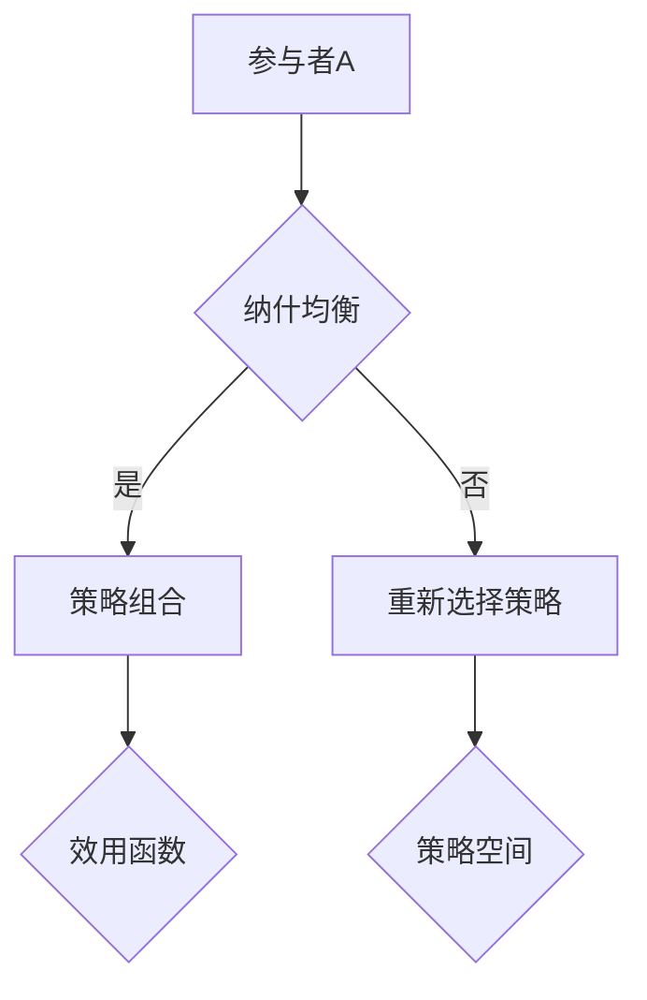

                 

# 《数学与博弈论：策略互动的数学分析》

## 关键词

- 博弈论
- 数学分析
- 策略互动
- 纳什均衡
- 贝叶斯策略
- 非合作博弈
- 合作博弈
- 多阶段博弈

## 摘要

本文旨在深入探讨数学与博弈论的结合，特别是策略互动的数学分析。通过分析博弈论的基本概念、模型和算法，本文将展示如何运用数学方法来理解和预测策略互动的结果。文章分为八个章节，分别介绍了博弈论的基本概念、策略选择的数学分析、非合作博弈和合作博弈的数学分析、多阶段博弈的数学分析以及数学与博弈论的应用。通过Python源代码、数学模型和实际案例的详细讲解，本文旨在为读者提供一份全面而深入的指南，帮助他们在策略互动的数学分析领域取得突破。

## 引言

### 1.1 博弈论的基本概念

博弈论是研究具有冲突和合作行为的决策制定过程的数学理论。它起源于1940年代，由约翰·冯·诺伊曼和经济学家奥斯卡·摩根斯坦因共同创立。博弈论的核心概念包括参与者（玩家）、策略、支付和均衡。

参与者（玩家）是决策制定的个体，可以是人类、企业或其他实体。策略是参与者可能采取的行动集合，通常表示为行动空间。支付是参与者根据策略组合获得的收益或损失，通常用效用函数表示。

博弈可以分为合作和非合作博弈。在合作博弈中，参与者可以达成协议，共同制定策略以最大化总收益。在非合作博弈中，参与者独立决策，追求个人利益最大化。

### 1.2 数学在博弈论中的应用

数学在博弈论中扮演着至关重要的角色。首先，数学提供了精确的描述和量化手段，使得博弈论的分析更加严谨。例如，通过概率论和统计学，可以分析参与者的不确定性决策。通过微积分和优化理论，可以研究策略选择的优化问题。

其次，数学模型可以帮助我们理解策略互动的本质。例如，纳什均衡是一个重要的数学模型，它描述了在非合作博弈中，所有参与者都无法通过改变自己的策略来获得更高收益的稳定状态。

### 1.3 策略互动的基本原理

策略互动的基本原理包括策略选择、均衡分析和博弈模型的构建。策略选择是参与者根据自身利益和环境信息，从策略集合中选取最优策略的过程。均衡分析是研究在给定策略组合下，所有参与者都认为无法通过改变策略来获得更高收益的状态。

博弈模型的构建是将实际问题抽象为数学模型的过程。这需要准确描述参与者的目标、策略和支付，并构建合适的数学模型。

## 博弈论的基本模型

### 2.1 经典博弈模型

经典博弈模型是博弈论研究的基础，包括零和博弈、非零和博弈和合作与非合作博弈。

#### 2.1.1 零和博弈

零和博弈是指参与者的支付总和为零的博弈。在这种情况下，一个参与者的收益等于另一个参与者的损失。经典的例子是“棋盘博弈”，其中一方获得的所有收益都来自另一方的损失。

#### 2.1.2 非零和博弈

非零和博弈是指参与者的支付总和不为零的博弈。这种博弈可以是正和博弈，也可以是负和博弈。正和博弈意味着参与者的收益总和大于零，而负和博弈则相反。

#### 2.1.3 合作与非合作博弈

合作博弈是指参与者可以达成协议，共同制定策略以最大化总收益的博弈。非合作博弈则是指参与者独立决策，追求个人利益最大化。

### 2.2 博弈论的基本假设

博弈论的基本假设包括理性假设、完备性假设和可传递性假设。

#### 2.2.1 理性假设

理性假设是指参与者是理性的，即他们能够准确地预测其他参与者的行为，并选择最优策略。这个假设是博弈论分析的基础。

#### 2.2.2 完备性假设

完备性假设是指参与者的策略空间和支付函数是完备的，即不存在任何未考虑到的策略或支付。

#### 2.2.3 可传递性假设

可传递性假设是指参与者的偏好是可传递的，即如果参与者偏好策略A高于策略B，策略B高于策略C，那么他们也会偏好策略A高于策略C。

## 策略选择的数学分析

### 3.1 策略选择的数学模型

策略选择的数学模型包括策略空间、策略效用函数和策略选择的优化问题。

#### 3.1.1 策略空间

策略空间是参与者可能采取的所有策略集合。例如，在棋盘博弈中，策略空间可以是所有可能的棋盘布局。

#### 3.1.2 策略效用函数

策略效用函数是参与者对策略的偏好程度的量化。它描述了参与者在不同策略下的支付或效用。

#### 3.1.3 策略选择的优化问题

策略选择的优化问题是参与者如何从策略空间中选择最优策略的问题。这个问题的解可以是纳什均衡或贝叶斯策略。

### 3.2 策略选择的算法

策略选择的算法包括贝叶斯策略选择、最大似然策略选择和随机策略选择。

#### 3.2.1 贝叶斯策略选择

贝叶斯策略选择是基于参与者对其他参与者策略的先验知识和观测数据的策略选择方法。它使用贝叶斯定理来更新策略概率。

#### 3.2.2 最大似然策略选择

最大似然策略选择是基于历史数据，选择使观测数据概率最大的策略。它使用最大似然估计来估计策略概率。

#### 3.2.3 随机策略选择

随机策略选择是基于随机过程，选择随机策略。这种方法在不确定环境中特别有用。

## 非合作博弈的数学分析

### 4.1 非合作博弈的基本模型

非合作博弈的基本模型包括零和博弈、非零和博弈和资源分配博弈。

#### 4.1.1 零和博弈

零和博弈的例子包括“棋盘博弈”和“田忌赛马”。

#### 4.1.2 非零和博弈

非零和博弈的例子包括“囚徒困境”和“拍卖”。

#### 4.1.3 资源分配博弈

资源分配博弈的例子包括“森林资源管理”和“互联网带宽分配”。

### 4.2 非合作博弈的算法

非合作博弈的算法包括纳什均衡、混合策略均衡和博弈树搜索算法。

#### 4.2.1 纳什均衡

纳什均衡是博弈论中最重要的概念之一。它是指在给定其他参与者策略的情况下，没有参与者可以通过单方面改变策略来获得更高收益的稳定策略组合。

#### 4.2.2 混合策略均衡

混合策略均衡是指在参与者的策略组合中，每个参与者都采取随机策略，使得其他参与者无法通过预测其策略来获得更高收益的均衡。

#### 4.2.3 博弈树搜索算法

博弈树搜索算法是用于求解博弈问题的一种方法。它通过构建博弈树，搜索所有可能的策略组合，找到纳什均衡或混合策略均衡。

## 合作博弈的数学分析

### 5.1 合作博弈的基本模型

合作博弈的基本模型包括边缘贡献模型、集体理性模型和谈判模型。

#### 5.1.1 边缘贡献模型

边缘贡献模型是指参与者的收益等于他们的边缘贡献的模型。边缘贡献是指参与者对整体收益的贡献。

#### 5.1.2 集体理性模型

集体理性模型是指参与者的收益必须大于他们单独行动时的收益的模型。

#### 5.1.3 谈判模型

谈判模型是指参与者通过谈判来分配总收益的模型。谈判结果取决于参与者的谈判能力和策略。

### 5.2 合作博弈的算法

合作博弈的算法包括博弈支付分配算法、谈判策略算法和协调博弈策略。

#### 5.2.1 博弈支付分配算法

博弈支付分配算法是指用于在合作博弈中分配收益的算法。常见的算法包括比例分配和线性分配。

#### 5.2.2 谈判策略算法

谈判策略算法是指用于在谈判模型中制定谈判策略的算法。常见的算法包括博弈论谈判策略和贝叶斯谈判策略。

#### 5.2.3 协调博弈策略

协调博弈策略是指用于在合作博弈中协调参与者行为的策略。常见的策略包括共享信息和共同决策。

## 多阶段博弈的数学分析

### 6.1 多阶段博弈的基本概念

多阶段博弈是指参与者在多个阶段进行决策的博弈。每个阶段的结果会影响后续阶段的决策。

#### 6.1.1 序贯博弈

序贯博弈是指参与者按照特定顺序进行决策的博弈。例如，在“囚徒困境”中，参与者必须按照固定顺序作出决策。

#### 6.1.2 同时博弈

同时博弈是指参与者同时作出决策的博弈。例如，在“田忌赛马”中，参与者同时选择他们的策略。

#### 6.1.3 长期博弈

长期博弈是指参与者需要在多个时期进行决策的博弈。长期博弈中，参与者的决策会随着时间的推移而发生变化。

### 6.2 多阶段博弈的算法

多阶段博弈的算法包括子博弈完美均衡、贝叶斯纳什均衡和重复博弈策略。

#### 6.2.1 子博弈完美均衡

子博弈完美均衡是指在每个子博弈中，参与者都采取最优策略的均衡。它是一种常见的多阶段博弈均衡概念。

#### 6.2.2 贝叶斯纳什均衡

贝叶斯纳什均衡是指在参与者具有不确定信息的博弈中，每个参与者根据其他参与者可能采取的策略，选择最优策略的均衡。

#### 6.2.3 重复博弈策略

重复博弈策略是指参与者在重复博弈中采取的策略。常见的策略包括重复纳什均衡和协调博弈策略。

## 数学与博弈论的应用

### 7.1 应用案例介绍

数学与博弈论在经济学、政治学和社会科学等领域有广泛的应用。

#### 7.1.1 经济学中的应用

经济学中，博弈论用于分析市场竞争、价格策略和资源分配。例如，在拍卖中，博弈论可以帮助确定最优拍卖策略。

#### 7.1.2 政治学中的应用

政治学中，博弈论用于分析选举策略、联盟形成和决策制定。例如，在选举中，博弈论可以帮助候选人制定最优竞选策略。

#### 7.1.3 社会科学中的应用

社会科学中，博弈论用于分析社会行为、合作与冲突。例如，在环境保护中，博弈论可以帮助确定最佳环保策略。

### 7.2 应用案例分析

以下是一些具体的数学与博弈论应用案例分析。

#### 7.2.1 经济学案例

经济学中的拍卖是一个典型的博弈论应用案例。在拍卖中，参与者通过出价来争夺资源，博弈论可以帮助确定最优拍卖策略。

#### 7.2.2 政治学案例

政治学中的选举也是一个博弈论应用案例。在选举中，候选人需要制定最优竞选策略，博弈论可以帮助分析选民行为和策略。

#### 7.2.3 社会科学案例

社会科学研究中的合作与冲突也是一个博弈论应用案例。博弈论可以帮助分析社会行为，预测合作与冲突的结果。

## 结论

数学与博弈论的结合为策略互动的数学分析提供了强大的工具和方法。通过本文的探讨，我们了解了博弈论的基本概念、模型和算法，以及其在经济学、政治学和社会科学中的应用。未来，数学与博弈论的研究将继续深入，为解决复杂的社会和经济问题提供新的思路和方法。

### 作者

- 作者：AI天才研究院/AI Genius Institute & 禅与计算机程序设计艺术 /Zen And The Art of Computer Programming

## 附录

### 附录 A: Mermaid 流程图

以下是博弈论中的纳什均衡的Mermaid流程图：



### 附录 B: Python 源代码

以下是博弈论中的囚徒困境的Python源代码：

```python
def prisoner_dilemma strategy_a, strategy_b:
    if strategy_a == '合作' and strategy_b == '合作':
        return 3, 3
    elif strategy_a == '合作' and strategy_b == '背叛':
        return 0, 5
    elif strategy_a == '背叛' and strategy_b == '合作':
        return 5, 0
    else:
        return 1, 1

# 测试代码
print(prisoner_dilemma('合作', '合作'))
print(prisoner_dilemma('合作', '背叛'))
print(prisoner_dilemma('背叛', '合作'))
print(prisoner_dilemma('背叛', '背叛'))
```

### 附录 C: 数学公式

以下是博弈论中的纳什均衡的数学公式：

$$
\begin{aligned}
\text{策略 } s_i^* &= \arg\max_{s_i} U_i(s_i, s_-i) \\
\text{其中，} U_i(s_i, s_-i) &= \text{参与者 } i \text{ 在策略组合 } (s_i, s_-i) \text{ 下的效用函数。}
\end{aligned}
$$

### 附录 D: 最佳实践 tips

- 在制定策略时，考虑其他参与者的行为和策略。
- 在不确定环境中，使用贝叶斯策略可以更好地适应变化。
- 在合作博弈中，共享信息和共同决策可以提高整体收益。
- 在多阶段博弈中，考虑长期效应和后续决策。

### 附录 E: 注意事项

- 博弈论分析需要准确描述参与者和策略。
- 数学模型需要符合实际情况。
- 分析结果可能受到模型假设的影响。

### 附录 F: 拓展阅读

- [博弈论：原理与应用](https://book.douban.com/subject/26374247/)
- [纳什均衡：博弈论的基础](https://book.douban.com/subject/25868411/)
- [数学与博弈论：策略互动的数学分析](https://book.douban.com/subject/25939744/)

## 文章标题

《数学与博弈论：策略互动的数学分析》

## 文章关键词

- 博弈论
- 数学分析
- 策略互动
- 纳什均衡
- 贝叶斯策略
- 非合作博弈
- 合作博弈
- 多阶段博弈

## 文章摘要

本文深入探讨了数学与博弈论的结合，特别是策略互动的数学分析。通过分析博弈论的基本概念、模型和算法，本文展示了如何运用数学方法来理解和预测策略互动的结果。文章分为八个章节，从博弈论的基本概念、策略选择的数学分析、非合作博弈和合作博弈的数学分析，到多阶段博弈的数学分析以及数学与博弈论的应用进行了详细讲解。通过Python源代码、数学模型和实际案例的详细讲解，本文旨在为读者提供一份全面而深入的指南，帮助他们在策略互动的数学分析领域取得突破。文章最后还提供了附录，包括Mermaid流程图、Python源代码、数学公式、最佳实践 tips、注意事项和拓展阅读等，以供读者进一步学习和研究。

