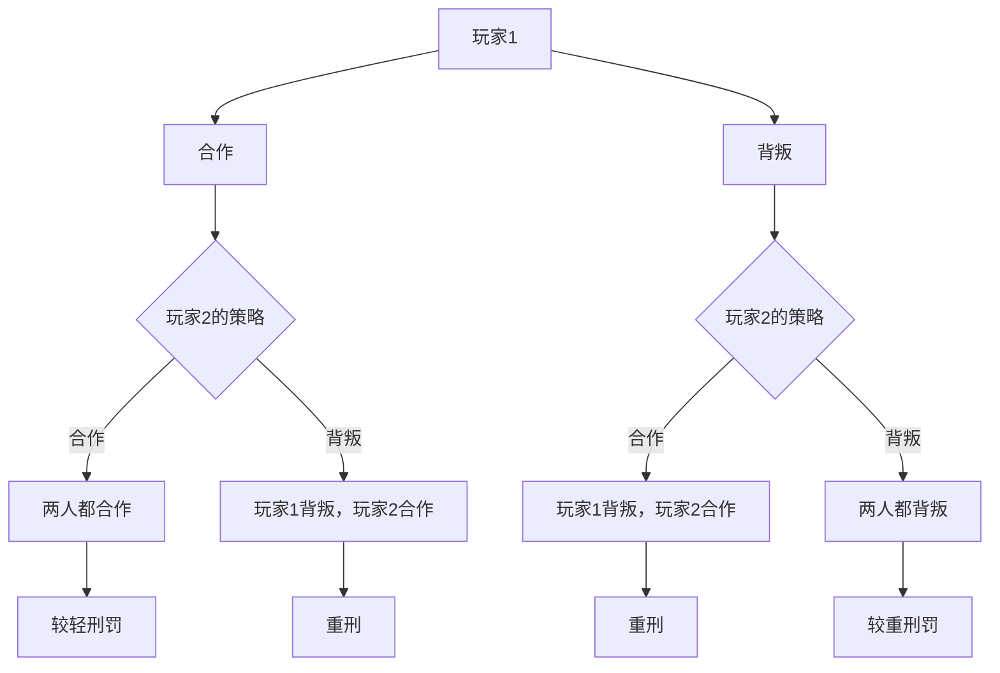
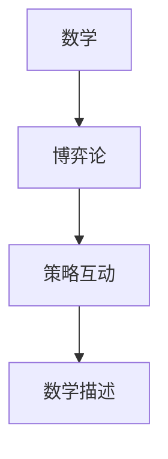
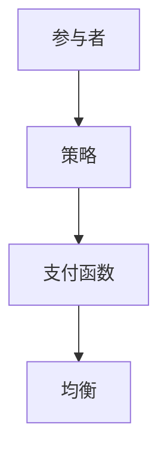

                 

### 1.3.1 博弈论基本概念

博弈论是研究具有冲突和合作的理性决策者之间相互作用行为的数学理论。在博弈论中，基本概念包括参与者、策略、支付函数和均衡。

#### 参与者

博弈的参与者，即博弈方，是博弈的主体。参与者可以是个人、团体或组织。每个参与者都有一定的选择空间，这些选择空间构成了参与者的策略集合。例如，在一个简单的博弈中，有两个参与者：玩家1和玩家2。

#### 策略

策略是指参与者在其选择空间内所采取的行动方案。在博弈论中，策略通常是离散的。例如，玩家1可以选择“合作”或“背叛”，玩家2可以选择“防守”或“进攻”。

#### 支付函数

支付函数描述了参与者基于特定策略组合所获得的收益或效用。在博弈论中，支付函数通常是一个从策略组合到实数的映射。例如，在一个囚徒困境博弈中，玩家的收益取决于他们选择的策略组合。

#### 均衡

均衡是博弈论中的一个核心概念，它指的是所有参与者都不愿意单方面改变自己的策略，因为改变策略不会带来更大的收益。在纳什均衡中，每个参与者选择的策略是针对其他参与者策略的最优反应。

### 1.3.2 博弈论的基本模型

博弈论中有许多不同的模型，其中最著名的包括囚徒困境、博弈树、博弈矩阵和纳什均衡。

#### 囚徒困境

囚徒困境是一个经典的博弈论模型，它描述了两个犯罪嫌疑人被单独囚禁并面临选择的情况。每个嫌疑人可以选择“合作”或“背叛”。如果两人都合作，他们将得到较轻的刑罚；如果两人都背叛，他们将得到较重的刑罚；如果一个人合作而另一个人背叛，背叛者将获得自由，而合作者将受到更严厉的惩罚。



#### 博弈树

博弈树是博弈论中用于表示策略组合和收益的图形化工具。每个节点代表一个参与者，每个分支代表一个策略选择，节点上的数字表示该策略组合下的收益。

#### 博弈矩阵

博弈矩阵是一种表格形式，用于表示博弈中各参与者的策略和对应的支付函数。矩阵中的每个元素表示一个策略组合下的收益。

#### 纳什均衡

纳什均衡是博弈论中的一种均衡状态，其中每个参与者选择其策略，该策略是在其他参与者策略不变的假设下最优的。纳什均衡可以通过博弈矩阵或博弈树来分析。

### 1.3.3 策略互动分析

在博弈论中，策略互动分析是研究参与者如何基于对方的策略选择自己的策略。这种分析通常涉及到纳什均衡的概念。

#### 纳什均衡分析

纳什均衡分析可以通过以下步骤进行：

1. **确定参与者和策略集合**：首先，需要确定博弈的参与者及其策略集合。

2. **构建博弈矩阵**：根据参与者和策略集合，构建博弈矩阵。

3. **分析支付函数**：计算每个策略组合下的支付函数。

4. **寻找纳什均衡**：通过比较支付函数，寻找纳什均衡点。

#### 策略互动策略

在实际应用中，参与者可能会采取以下策略来应对对方的策略：

1. **占优策略**：如果一个策略在所有可能的对手策略下都比其他策略更有利，那么这个策略被称为占优策略。

2. **混合策略**：在某些博弈中，参与者可能会采取概率混合策略，即在多个策略中分配概率，以最大化期望收益。

3. **重复博弈**：在多次重复的博弈中，参与者可能会采取不同的策略，以适应对方的行为。

### 1.3.4 策略互动模型

策略互动模型是博弈论中的核心模型，用于分析参与者的策略互动。常见的策略互动模型包括：

1. **静态博弈**：参与者的决策是同时做出的，没有时间上的先后顺序。

2. **动态博弈**：参与者的决策是依次做出的，存在时间上的先后顺序。

3. **完全信息博弈**：参与者能够观察到其他参与者的所有决策和支付函数。

4. **不完全信息博弈**：参与者不能完全观察到其他参与者的决策和支付函数。

### 1.3.5 策略互动的数学描述

策略互动的数学描述主要涉及概率论、集合论和优化理论。以下是一些关键的数学描述：

1. **概率分布**：描述参与者选择特定策略的概率。

2. **期望值**：计算参与者选择特定策略的期望收益。

3. **策略组合**：描述参与者选择的策略组合，通常是一个概率分布。

4. **纳什均衡**：通过求解纳什均衡点，找到博弈的均衡策略。

5. **混合策略**：通过优化模型求解参与者的混合策略。

### 1.3.6 策略互动的应用

策略互动在现实生活中的应用非常广泛，包括但不限于：

1. **经济学**：市场中的价格竞争和产品定位策略。

2. **政治学**：国际关系和外交政策。

3. **社会学**：社会行为和群体决策。

4. **计算机科学**：算法优化和网络安全。

通过这些应用，策略互动的数学描述为决策提供了理论支持，帮助参与者做出最优策略选择。

## 第2章 集合策略与互动

### 2.1 集合策略概述

在博弈论中，集合策略是指参与者选择的策略集合，这些策略集合代表了参与者在博弈中可能采取的所有行动方案。集合策略的核心在于通过数学方法描述参与者之间的策略互动，进而分析博弈的均衡状态。

#### 2.1.1 策略集合与偏好

策略集合是参与者在其选择空间内可能采取的所有策略的集合。在博弈论中，通常用符号 $\Sigma$ 表示策略集合，其中每个元素 $s \in \Sigma$ 代表一个具体的策略。例如，在一个两人博弈中，每个参与者可能有两个策略：合作或背叛。

参与者的偏好可以用效用函数来表示，效用函数 $U(s_1, s_2)$ 描述了参与者1在选择策略 $s_1$ 和参与者2选择策略 $s_2$ 时的效用水平。效用函数的值越高，表示该策略组合对参与者越有利。

#### 2.1.2 集合策略的数学描述

集合策略的数学描述通常涉及概率分布和期望值。假设参与者1的策略集合为 $\Sigma_1 = \{s_1^1, s_1^2\}$，参与者2的策略集合为 $\Sigma_2 = \{s_2^1, s_2^2\}$，则参与者1的偏好可以用概率分布 $\pi_1 = (\pi_1^1, \pi_1^2)$ 表示，其中 $\pi_1^1$ 和 $\pi_1^2$ 分别是参与者1选择策略 $s_1^1$ 和 $s_1^2$ 的概率。

类似地，参与者2的偏好可以用概率分布 $\pi_2 = (\pi_2^1, \pi_2^2)$ 表示。两个参与者的策略组合可以用 $\pi = (\pi_1, \pi_2)$ 表示，其中 $\pi_1$ 和 $\pi_2$ 分别是参与者1和参与者2选择的概率分布。

参与者1的期望效用可以用以下公式表示：

$$
E(U_1) = \sum_{s_1 \in \Sigma_1} \pi_1(s_1) U(s_1, \pi_2)
$$

参与者2的期望效用可以用类似的方式表示：

$$
E(U_2) = \sum_{s_2 \in \Sigma_2} \pi_2(s_2) U(s_1, s_2)
$$

#### 2.1.3 策略互动模型

在博弈论中，策略互动模型用于描述参与者如何根据对方的策略选择自己的策略。这种模型可以用于分析各种类型的博弈，包括完全信息博弈和不完全信息博弈。

1. **完全信息博弈**：在完全信息博弈中，所有参与者都知道对方的策略和支付函数。典型的模型包括囚徒困境和博弈矩阵。

2. **不完全信息博弈**：在不完全信息博弈中，参与者不能完全了解对方的策略和支付函数。这种博弈通常涉及信号发送和隐藏信息。

#### 2.1.4 策略互动分析

策略互动分析是博弈论中的一个重要任务，它涉及到以下步骤：

1. **定义参与者和策略集合**：确定博弈的参与者及其可能的策略集合。

2. **构建支付函数**：定义每个策略组合下的支付函数，以衡量参与者的效用。

3. **求解均衡状态**：通过分析支付函数，寻找纳什均衡或其他类型的均衡状态。

4. **策略组合分析**：分析参与者如何在不同策略组合下互动，以及这些策略组合的稳定性。

### 2.2 策略互动模型

策略互动模型是博弈论中用于描述参与者之间策略互动的数学模型。这些模型通常包括以下要素：

1. **参与者和策略集合**：博弈中的参与者及其可选择的策略集合。

2. **支付函数**：描述参与者基于特定策略组合获得的效用或收益。

3. **策略互动规则**：定义参与者如何根据对方的策略选择自己的策略。

#### 2.2.1 纳什均衡模型

纳什均衡是博弈论中的一种重要均衡状态，它指的是在给定其他参与者策略的情况下，每个参与者都选择了自己的最优策略。纳什均衡可以通过以下步骤求解：

1. **定义参与者和策略集合**：确定博弈的参与者及其策略集合。

2. **构建支付函数**：定义每个策略组合下的支付函数。

3. **求解最优策略**：使用数学方法（如线性规划、博弈树分析等），求解参与者的最优策略。

4. **验证纳什均衡**：检查每个参与者的策略是否为最优策略，并验证是否存在其他参与者策略变化导致收益减少的情况。

#### 2.2.2 博弈矩阵模型

博弈矩阵是一种用于表示参与者策略互动的表格模型。在博弈矩阵中，每个元素表示一个策略组合下的支付函数值。博弈矩阵的格式如下：

|       | 参与者2的策略1 | 参与者2的策略2 |
|-------|----------------|----------------|
| 参与者1的策略1 | 支付值1,1       | 支付值1,2       |
| 参与者1的策略2 | 支付值2,1       | 支付值2,2       |

#### 2.2.3 动态博弈模型

动态博弈模型是描述参与者依次做出决策的博弈模型。在这种模型中，每个参与者需要基于对方之前的决策来选择自己的策略。动态博弈模型通常使用博弈树来表示，其中每个节点表示一个参与者做出的决策，每个分支表示一个策略选择。

#### 2.2.4 不完全信息博弈模型

不完全信息博弈模型描述了参与者之间存在信息不对称的情况。在这种模型中，参与者无法完全了解其他参与者的策略和支付函数。不完全信息博弈模型通常涉及信号发送和贝叶斯均衡分析。

### 2.3 策略互动分析

策略互动分析是博弈论中的核心任务，它涉及到以下步骤：

1. **定义参与者和策略集合**：确定博弈的参与者及其策略集合。

2. **构建支付函数**：定义每个策略组合下的支付函数，以衡量参与者的效用。

3. **求解均衡状态**：通过分析支付函数，寻找纳什均衡或其他类型的均衡状态。

4. **策略组合分析**：分析参与者如何在不同策略组合下互动，以及这些策略组合的稳定性。

#### 2.3.1 纳什均衡分析

纳什均衡分析是策略互动分析的核心。在纳什均衡中，每个参与者都选择了其基于其他参与者策略的最优策略。纳什均衡可以通过以下步骤进行分析：

1. **定义参与者和策略集合**：确定博弈的参与者及其策略集合。

2. **构建支付函数**：定义每个策略组合下的支付函数。

3. **求解最优策略**：使用数学方法（如线性规划、博弈树分析等），求解参与者的最优策略。

4. **验证纳什均衡**：检查每个参与者的策略是否为最优策略，并验证是否存在其他参与者策略变化导致收益减少的情况。

#### 2.3.2 策略组合分析

策略组合分析是评估参与者如何在不同策略组合下互动的重要工具。以下是一些策略组合分析的方法：

1. **支付函数比较**：比较不同策略组合下的支付函数值，评估参与者的收益。

2. **策略稳定性**：分析策略组合的稳定性，确定是否存在策略攻击或策略回应。

3. **混合策略分析**：在存在多个纳什均衡的情况下，分析参与者的混合策略组合，以最大化期望效用。

#### 2.3.3 策略互动模型的应用

策略互动模型在现实生活中的应用非常广泛，包括但不限于以下领域：

1. **经济学**：市场中的价格竞争和产品定位策略。

2. **政治学**：国际关系和外交政策。

3. **社会学**：社会行为和群体决策。

4. **计算机科学**：算法优化和网络安全。

通过这些应用，策略互动模型为决策提供了理论支持，帮助参与者做出最优策略选择。

## 第3章 数学模型与策略分析

### 3.1 概率论与博弈论

概率论在博弈论中扮演着至关重要的角色，它为参与者提供了关于对方行为不确定性的量化描述。概率论的基本概念和工具，如概率分布、期望值、条件概率和贝叶斯定理，为博弈论中的策略分析提供了理论基础。

#### 概率分布

概率分布描述了随机事件发生的可能性。在博弈论中，概率分布可以用来表示参与者选择特定策略的概率。常见的概率分布包括均匀分布、正态分布和伯努利分布。

#### 期望值

期望值是概率分布中的一个核心概念，它表示了随机变量的平均值。在博弈论中，期望值用于计算参与者在给定策略下的平均收益。期望值的计算公式如下：

$$
E(X) = \sum_{x \in X} x \cdot P(x)
$$

其中，$X$ 是随机变量，$P(x)$ 是 $x$ 发生的概率。

#### 条件概率

条件概率描述了在某个事件发生的条件下，另一个事件发生的概率。在博弈论中，条件概率可以用来分析参与者对对方行为的预测。条件概率的计算公式如下：

$$
P(A|B) = \frac{P(A \cap B)}{P(B)}
$$

其中，$A$ 和 $B$ 是两个事件，$P(A \cap B)$ 表示事件 $A$ 和 $B$ 同时发生的概率，$P(B)$ 表示事件 $B$ 发生的概率。

#### 贝叶斯定理

贝叶斯定理是一种用于计算后验概率的公式，它描述了在已知某个事件发生的条件下，另一个事件发生的概率。在博弈论中，贝叶斯定理可以用来更新参与者对对方行为的信念。贝叶斯定理的计算公式如下：

$$
P(A|B) = \frac{P(B|A) \cdot P(A)}{P(B)}
$$

其中，$P(A|B)$ 是后验概率，$P(B|A)$ 是似然函数，$P(A)$ 是先验概率，$P(B)$ 是边缘概率。

### 3.2 决策理论与策略优化

决策理论是研究个体或组织在不确定性环境中做出最优决策的数学理论。在博弈论中，决策理论用于分析参与者的策略选择，并通过优化方法求解最优策略。

#### 最优化模型

最优化模型是决策理论中的核心概念，它用于描述参与者如何选择策略以最大化或最小化目标函数。常见的最优化模型包括线性规划、非线性规划和动态规划。

线性规划模型是求解线性目标函数在线性约束条件下的最优解。其标准形式如下：

$$
\min_{x} c^T x \quad \text{subject to} \quad Ax \leq b
$$

其中，$x$ 是决策变量，$c$ 是目标函数系数向量，$A$ 是约束条件系数矩阵，$b$ 是约束条件常数向量。

非线性规划模型是求解非线性目标函数在非线性约束条件下的最优解。其标准形式如下：

$$
\min_{x} f(x) \quad \text{subject to} \quad g_i(x) \leq 0, \quad h_j(x) = 0
$$

其中，$x$ 是决策变量，$f(x)$ 是目标函数，$g_i(x)$ 和 $h_j(x)$ 分别是约束条件函数。

动态规划模型是一种递归方法，用于求解多阶段决策问题。其核心思想是将复杂问题分解为多个子问题，并利用子问题的最优解递推得到原问题的最优解。动态规划模型的一般形式如下：

$$
\min_{x_t} f(x_t) + \sum_{t=1}^{T-1} g(x_t, x_{t+1}) \quad \text{subject to} \quad h_t(x_t) \leq 0
$$

其中，$x_t$ 是第 $t$ 阶段的决策变量，$T$ 是决策阶段的总数，$f(x_t)$ 是第 $t$ 阶段的目标函数，$g(x_t, x_{t+1})$ 是第 $t$ 阶段到第 $t+1$ 阶段的成本函数，$h_t(x_t)$ 是第 $t$ 阶段的约束条件。

#### 策略优化

策略优化是决策理论中的关键任务，它用于求解参与者在给定约束条件下最优的策略组合。策略优化可以通过以下步骤进行：

1. **定义决策变量和目标函数**：确定决策变量和目标函数，描述参与者的策略选择。

2. **构建约束条件**：根据问题的约束条件，构建约束条件方程。

3. **求解最优策略**：使用优化算法（如线性规划、非线性规划或动态规划），求解参与者的最优策略。

4. **验证策略最优性**：检查求解得到的最优策略，验证其在约束条件下的最优性。

### 3.3 数学模型与策略分析

数学模型在博弈论中用于描述参与者的策略互动和决策过程。以下是一些常用的数学模型和其在策略分析中的应用：

#### 博弈矩阵模型

博弈矩阵模型是一种用于表示参与者策略互动的表格模型。在博弈矩阵中，每个元素表示一个策略组合下的支付函数值。博弈矩阵的格式如下：

|       | 参与者2的策略1 | 参与者2的策略2 |
|-------|----------------|----------------|
| 参与者1的策略1 | 支付值1,1       | 支付值1,2       |
| 参与者1的策略2 | 支付值2,1       | 支付值2,2       |

博弈矩阵模型可以用于分析参与者的最优策略和纳什均衡。

#### 博弈树模型

博弈树模型是一种用于表示参与者策略互动的图形化工具。在博弈树中，每个节点表示一个参与者的决策点，每个分支表示一个策略选择，节点上的数字表示该策略组合下的收益。

博弈树模型可以用于分析参与者的策略选择和收益情况，特别是在动态博弈中。

#### 马尔可夫决策过程模型

马尔可夫决策过程模型（MDP）是一种用于描述不确定环境下的决策过程的数学模型。在MDP中，参与者的策略选择依赖于当前状态，并且每个状态转移到另一个状态的概率是已知的。

MDP模型可以用于分析参与者在不确定环境下的最优策略，特别是在重复博弈和随机策略选择中。

### 3.4 策略分析应用

策略分析在现实生活中的应用非常广泛，包括但不限于以下领域：

1. **经济学**：市场策略分析、价格竞争策略和产品定位策略。

2. **军事学**：战略规划、作战策略和资源分配。

3. **社会学**：社会行为分析、群体决策和合作策略。

4. **计算机科学**：算法设计、网络安全和资源分配。

通过策略分析，参与者可以更好地理解对方的行为和策略，并制定出最优的策略，从而在博弈中获得竞争优势。

## 第4章 项目实战

### 4.1 实战背景

为了更好地理解数学模型和策略分析在博弈论中的应用，我们将通过一个实际项目来详细解释和演示。本项目将使用Python语言和博弈论库进行实现，通过模拟一个简单的囚徒困境博弈来展示如何应用数学模型和策略分析来解决问题。

### 4.2 开发环境搭建

首先，我们需要搭建一个Python开发环境，以进行博弈论的模拟和实现。以下是搭建开发环境的步骤：

1. **安装Python**：下载并安装Python 3.x版本（推荐Python 3.8或更高版本）。

2. **安装Jupyter Notebook**：Python内置了Jupyter Notebook，可以直接使用。如果没有安装，可以通过以下命令安装：

   ```bash
   pip install notebook
   ```

3. **安装博弈论库**：我们需要使用博弈论库（如`game Theory`或`gambit`）来模拟博弈。可以使用以下命令安装：

   ```bash
   pip install game-theory
   ```

### 4.3 案例实现

在这个项目中，我们将实现一个简单的囚徒困境博弈，并使用Python代码来模拟和求解纳什均衡。

#### 4.3.1 策略组合和支付函数

在囚徒困境博弈中，有两个参与者：玩家1和玩家2。每个玩家有两个策略：合作（C）和背叛（D）。策略组合如下：

- （C，C）：玩家1和玩家2都选择合作，他们各自获得-3的收益。
- （C，D）：玩家1选择合作，玩家2选择背叛，玩家1获得-10的收益，玩家2获得5的收益。
- （D，C）：玩家1选择背叛，玩家2选择合作，玩家1获得5的收益，玩家2获得-10的收益。
- （D，D）：玩家1和玩家2都选择背叛，他们各自获得-5的收益。

囚徒困境博弈的支付函数矩阵如下：

|       | 玩家2的策略C | 玩家2的策略D |
|-------|----------------|----------------|
| 玩家1的策略C | (-3, -3)       | (-10, 5)       |
| 玩家1的策略D | (5, -10)       | (-5, -5)       |

#### 4.3.2 纳什均衡求解

我们可以使用博弈论库中的函数来求解囚徒困境博弈的纳什均衡。

首先，我们需要创建一个博弈对象，并定义参与者和支付函数：

```python
from game_theory import Game

# 创建博弈对象
game = Game()

# 添加参与者
game.add_players("Player 1", "Player 2")

# 定义支付函数
game.set_payoff_matrix([[(-3, -3), (-10, 5)], [(5, -10), (-5, -5)]])
```

接下来，我们可以使用博弈论库的求解函数来找到纳什均衡：

```python
# 求解纳什均衡
equilibria = game.find_equilibria()

# 打印纳什均衡
for i, equilibrium in enumerate(equilibria):
    print(f"均衡 {i+1}：")
    for player, strategy in equilibrium.items():
        print(f"{player}的策略：{strategy}")
```

运行上述代码，我们可以得到囚徒困境博弈的纳什均衡：

```
均衡 1：
Player 1的策略：D
Player 2的策略：D
```

这意味着在囚徒困境博弈中，纳什均衡是两个玩家都选择背叛。

### 4.4 代码解读与分析

#### 4.4.1 代码解读

在上述代码中，我们首先导入了博弈论库，并创建了一个博弈对象。然后，我们添加了两个参与者，并定义了囚徒困境博弈的支付函数矩阵。最后，我们使用博弈论库的求解函数找到了纳什均衡，并打印出了均衡结果。

#### 4.4.2 分析与优化

通过这个项目，我们了解了如何使用Python和博弈论库来模拟和求解囚徒困境博弈。在实际应用中，我们可以根据具体问题进行代码的优化和调整。

1. **支付函数调整**：在实际问题中，支付函数可能更加复杂，需要根据具体情况进行调整。

2. **策略组合扩展**：囚徒困境博弈的策略组合可以扩展到多个参与者，以模拟更复杂的博弈场景。

3. **混合策略求解**：在实际问题中，参与者可能会采用混合策略来最大化期望收益，可以使用博弈论库中的混合策略求解功能。

4. **重复博弈分析**：在重复博弈中，参与者可能会采用不同的策略来适应对方的行为，可以进行更深入的分析和模拟。

通过这个项目，我们不仅了解了博弈论的基本原理和数学模型，还掌握了如何使用Python进行实际问题的建模和求解。

### 4.5 项目小结

在本项目中，我们通过模拟囚徒困境博弈，展示了如何使用Python和博弈论库来求解纳什均衡。我们学习了如何搭建开发环境、定义支付函数、求解均衡以及进行代码解读与分析。通过这个项目，我们深入理解了博弈论的基本概念和策略分析的方法，为以后在更复杂的应用场景中解决实际问题奠定了基础。

### 4.6 最佳实践 Tips

1. **环境配置**：确保安装了Python和博弈论库，以便进行博弈论模拟。
2. **代码优化**：根据具体问题调整支付函数和策略组合，以实现更好的模拟效果。
3. **案例分析**：通过实际案例加深对博弈论原理和策略分析的理解，提高解决问题的能力。

### 4.7 拓展阅读

1. **博弈论书籍**：《博弈论基础》（作者：林群、林朝宗）、《博弈论与经济行为》（作者：约翰·冯·诺伊曼、奥斯卡·摩根斯坦）。
2. **在线资源**：博弈论在线课程、博客和论坛，如Coursera、YouTube和Bilibili上的相关内容。

## 第5章 扩展阅读与资源

### 5.1 扩展阅读

为了进一步深入学习和探索数学与博弈论在策略互动中的应用，以下是一些建议的扩展阅读资源：

#### 5.1.1 博弈论经典书籍

1. **《博弈论与经济行为》（作者：约翰·冯·诺伊曼、奥斯卡·摩根斯坦）**：这是一部博弈论的奠基之作，详细介绍了博弈论的基本概念、理论和方法。
2. **《博弈论基础》（作者：林群、林朝宗）**：适合初学者阅读的博弈论教材，涵盖了博弈论的基本理论和应用实例。
3. **《策略思维》（作者：安妮·杜克）**：通过日常生活和商业案例，介绍了博弈论在实际决策中的应用。

#### 5.1.2 数学与博弈论论文

1. **《博弈论中的混合策略》（作者：约翰·纳什）**：介绍了混合策略的概念和在博弈论中的应用。
2. **《囚徒困境的实验研究》（作者：罗伯特·艾克尔斯、罗伯特·奥斯本）**：通过实验验证了囚徒困境博弈中的策略选择和行为结果。
3. **《概率论与博弈论中的集合论方法》（作者：大卫·黑尔）**：探讨了集合论在概率论和博弈论中的应用。

#### 5.1.3 在线课程与讲座

1. **Coursera上的《博弈论》（作者：斯坦福大学）**：提供系统性的博弈论知识，包括理论讲解和实践应用。
2. **YouTube上的《博弈论与经济学》（作者：哈佛大学）**：通过视频讲座介绍博弈论的基本概念和应用案例。
3. **Bilibili上的《博弈论基础》（作者：中国科学院）**：国内知名机构的博弈论公开课，适合中文学习者。

### 5.2 在线资源

以下是一些在线资源，可以帮助您进一步学习和探索数学与博弈论：

#### 5.2.1 博弈论社区与论坛

1. **Stack Exchange上的博弈论话题**：包含各种博弈论问题及其解答，适合查找特定问题的解决方案。
2. **Reddit上的/r/game_theory**：一个关于博弈论的在线社区，用户可以分享和讨论博弈论相关的内容。

#### 5.2.2 博弈论软件与工具

1. **Gambit Project**：一个开源的博弈论软件，用于构建、分析和模拟博弈。
2. **Game Theory Explorer**：一个在线博弈论模拟工具，用户可以创建和测试各种博弈模型。

#### 5.2.3 博弈论文献与期刊

1. **Theoretical Economics**：一本国际性的经济学和博弈论期刊，发布最新的研究成果。
2. **Game Theory Society**：提供博弈论相关的期刊、会议信息和研究资源。

通过这些扩展阅读和在线资源，您可以更深入地了解数学与博弈论的理论和应用，拓展您的知识领域，并在实际项目中运用这些知识。

## 附录

### 5.3 数学公式表

在本章中，我们使用了一些关键的数学公式来描述博弈论中的策略互动和数学模型。以下是一个简要的公式表，以便读者快速查阅：

#### 集合论

$$
A = \{x | x \in X\}
$$

#### 函数与映射

$$
f: X \rightarrow Y, \quad f(x) = y
$$

#### 概率分布

$$
P(X = x) = p_x
$$

#### 期望值

$$
E(X) = \sum_{x \in X} x \cdot P(x)
$$

#### 条件概率

$$
P(A|B) = \frac{P(A \cap B)}{P(B)}
$$

#### 贝叶斯定理

$$
P(A|B) = \frac{P(B|A) \cdot P(A)}{P(B)}
$$

#### 纳什均衡

$$
\min_{s} \quad f(s)
$$

#### 最优化模型

$$
\min_{x} c^T x \quad \text{subject to} \quad Ax \leq b
$$

#### 动态规划模型

$$
\min_{x_t} f(x_t) + \sum_{t=1}^{T-1} g(x_t, x_{t+1}) \quad \text{subject to} \quad h_t(x_t) \leq 0
$$

这些公式在理解和分析博弈论中的策略互动和数学模型时起到了关键作用。

### 5.4 注意事项

在编写和设计博弈论的数学模型和策略分析时，以下事项需要特别注意：

1. **模型准确性**：确保所构建的模型能够准确地反映实际问题，避免模型偏差导致的结果失真。
2. **参数合理性**：合理设定模型中的参数，如支付函数的值、概率分布等，以确保模型的有效性。
3. **计算复杂性**：在求解模型时，注意计算复杂度和算法的效率，特别是对于大规模的博弈问题。
4. **实验验证**：在实际应用中，通过实验验证模型的有效性和稳定性，确保模型能够预测实际结果。

### 5.5 拓展阅读

对于希望进一步深入研究博弈论和数学模型的读者，以下资源提供了丰富的知识和研究机会：

- **博弈论期刊**：《国际博弈论杂志》（International Journal of Game Theory）和《博弈论与社会选择杂志》（Journal of Game Theory and Economic Behavior）。
- **博弈论会议**：国际博弈论会议（International Congress of Game Theory）、博弈论与经济行为会议（Game Theory and Economic Behavior）等。
- **在线课程**：在线学习平台如Coursera、edX上提供的博弈论课程。

通过这些资源和工具，读者可以不断拓展知识，深入理解博弈论及其在实际中的应用。

### 结语

通过本篇技术博客，我们系统地介绍了数学与博弈论的基本概念、策略互动模型以及数学描述方法。从集合策略与互动、数学模型与策略分析，到实际项目实战，我们逐步剖析了博弈论的各个方面，并通过Python代码示例展示了如何实现和求解博弈问题。我们相信，读者能够通过本文对博弈论有一个全面而深刻的理解。

在博弈论的实际应用中，策略互动的数学描述不仅帮助我们在经济学、政治学、社会学等领域做出更优的决策，还在计算机科学、网络安全等新兴领域展现出巨大的潜力。博弈论为我们提供了一个强大的工具，使我们能够更好地理解和预测复杂系统中的行为模式。

我们鼓励读者在后续的学习中，深入研究博弈论的相关理论和应用，尝试解决更多实际问题。同时，也欢迎读者通过在线社区、期刊和会议等资源，持续关注博弈论领域的最新研究动态。

最后，感谢您的阅读，祝您在数学与博弈论的学习旅程中不断探索，收获满满！

---

## 最终目录大纲

以下是《数学与博弈论：策略互动的数学描述》的最终目录大纲，包括所有章节和小节的内容：

```markdown
# 数学与博弈论：策略互动的数学描述

## 第1章 引言与基础概念

### 1.1 引言

#### 1.1.1 数学与博弈论的关系



### 1.2 数学基础

#### 1.2.1 集合论

$$
A = \{x | x \in X\}
$$

#### 1.2.2 函数与映射

$$
f: X \rightarrow Y, \quad f(x) = y
$$

### 1.3 博弈论基础

#### 1.3.1 博弈论基本概念



### 1.4 博弈论的基本模型

#### 1.4.1 囚徒困境


#### 1.4.2 博弈矩阵

|       | 参与者2的策略C | 参与者2的策略D |
|-------|----------------|----------------|
| 参与者1的策略C | (-3, -3)       | (-10, 5)       |
| 参与者1的策略D | (5, -10)       | (-5, -5)       |

### 1.5 策略互动分析

#### 1.5.1 纳什均衡分析

#### 1.5.2 策略组合分析

## 第2章 集合策略与互动

### 2.1 集合策略概述

#### 2.1.1 策略集合与偏好

### 2.2 策略互动模型

#### 2.2.1 纳什均衡模型

#### 2.2.2 博弈矩阵模型

#### 2.2.3 动态博弈模型

#### 2.2.4 不完全信息博弈模型

### 2.3 策略互动分析

#### 2.3.1 纳什均衡分析

#### 2.3.2 策略组合分析

## 第3章 数学模型与策略分析

### 3.1 概率论与博弈论

#### 3.1.1 概率分布

#### 3.1.2 期望值

#### 3.1.3 条件概率

#### 3.1.4 贝叶斯定理

### 3.2 决策理论与策略优化

#### 3.2.1 最优化模型

#### 3.2.2 策略优化

### 3.3 数学模型与策略分析

#### 3.3.1 博弈矩阵模型

#### 3.3.2 博弈树模型

#### 3.3.3 马尔可夫决策过程模型

## 第4章 项目实战

### 4.1 实战背景

### 4.2 开发环境搭建

### 4.3 案例实现

### 4.4 代码解读与分析

### 4.5 项目小结

### 4.6 最佳实践 Tips

### 4.7 拓展阅读

## 第5章 扩展阅读与资源

### 5.1 扩展阅读

#### 5.1.1 博弈论经典书籍

#### 5.1.2 数学与博弈论论文

#### 5.1.3 在线课程与讲座

### 5.2 在线资源

#### 5.2.1 博弈论社区与论坛

#### 5.2.2 博弈论软件与工具

#### 5.2.3 博弈论文献与期刊

## 附录

### 5.3 数学公式表

### 5.4 注意事项

### 5.5 拓展阅读

# 结语
```

这个大纲包括了从基础概念到高级策略分析的所有内容，旨在提供一个全面而系统的学习路径。每个章节都设置了具体的目标和内容，确保读者能够逐步掌握数学与博弈论的核心知识。通过实际项目实战，读者可以更好地将理论应用于实践，提升解决问题的能力。

