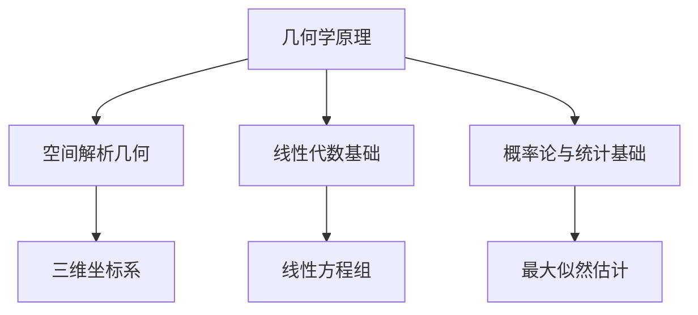

                 

## 数学与卫星导航：GPS定位的数学原理

### 关键词
- GPS定位
- 数学原理
- 卫星导航
- 三角测量
- 线性代数

### 摘要
本文将探讨GPS（全球定位系统）定位背后的数学原理。通过详细分析几何学、空间解析几何、线性代数和概率论等数学基础知识，我们将了解GPS定位系统如何利用这些原理来确定地球上任何地点的精确位置。文章还将深入探讨GPS信号的传输和接收过程，定位算法的数学模型，以及实际应用案例，包括车载导航系统、轨道卫星定位和海洋导航系统等。

## 引言

GPS定位系统是现代社会不可或缺的一部分，广泛应用于导航、地图绘制、地理信息系统、车辆管理、航空航海、自然灾害预警等多个领域。其核心在于通过接收来自多颗卫星的信号，计算出接收器的精确位置。然而，这背后的数学原理却并非人人皆知。

GPS技术起源于20世纪60年代的美国国防项目，最初用于军事导航。随着技术的进步，GPS系统逐渐开放给民用，成为我们日常生活中的一部分。如今，GPS已经成为我们定位和导航的主要手段之一。

### 数学与卫星导航的关系

数学在卫星导航中扮演着至关重要的角色。从几何学的角度，我们需要了解如何通过卫星的信号来定位地球上的一个点；从空间解析几何的角度，我们需要理解三维空间中的坐标系统；从线性代数的角度看，我们需要解决多个方程组以确定位置；从概率论的角度，我们需要处理信号噪声和误差。

GPS系统的工作原理可以用一个简单的三角测量问题来类比。如果我们在地球上的两个点，分别测得它们到同一颗卫星的距离，那么我们就可以通过解这个三角问题来确定这颗卫星的位置。而GPS系统就是通过接收至少三颗卫星的信号，从而形成一个三维空间中的三角测量网络，计算出接收器的位置。

### 目标与结构

本文的目标是深入探讨GPS定位的数学原理，使读者能够理解这一复杂技术的核心概念和计算过程。文章将按照以下结构展开：

1. **数学基础**：介绍几何学、空间解析几何、线性代数和概率论等数学基础知识。
2. **GPS系统概述**：介绍GPS系统的历史、组成和工作原理。
3. **定位原理**：详细讲解GPS定位的算法原理，包括单点定位和实时动态定位。
4. **项目实战**：通过实际案例，展示GPS定位系统的开发环境和实现过程。
5. **总结与展望**：总结GPS定位技术的发展趋势和未来研究方向。

## 数学基础

### 几何学原理

几何学是研究形状、大小、位置和分布的数学分支。在GPS定位中，几何学的基本原理被广泛应用于确定位置和距离。例如，通过三角形的三个顶点，我们可以确定其边长和角度。这是GPS定位算法的基础。

### 空间解析几何

空间解析几何是研究三维空间中点的位置和关系的数学分支。在GPS定位中，我们通常使用直角坐标系来表示地球上的点。这个坐标系由三个垂直的轴（通常称为X、Y和Z轴）组成，它们相交于原点。通过这个坐标系，我们可以精确地表示地球上的任何点。

### 线性代数基础

线性代数是研究向量、矩阵和线性方程组的数学分支。在GPS定位中，线性代数用于解决多个方程组，以确定接收器的位置。例如，通过解线性方程组，我们可以确定三个未知数（即接收器的X、Y和Z坐标）。

### 概率论与统计基础

概率论与统计学是研究随机事件和统计方法的数学分支。在GPS定位中，概率论和统计学用于处理信号噪声和误差。例如，通过最大似然估计，我们可以确定接收器最可能的位置。

### 关系架构 Mermaid 流程图

下面是一个简单的Mermaid流程图，展示了这些数学基础概念之间的关系：



## GPS系统概述

### GPS系统历史

GPS系统起源于20世纪60年代的美国国防项目，最初被称为“导航星”定位系统（Navstar GPS）。该项目旨在为美国军队提供全球范围内的精确导航和定位服务。随着技术的进步，GPS系统逐渐开放给民用，1993年开始向全球提供开放服务。

### GPS系统组成

GPS系统由三部分组成：卫星星座、地面控制系统和用户接收机。

1. **卫星星座**：由24颗工作卫星和3颗备用卫星组成，这些卫星均匀分布在6个不同的轨道平面上，形成了一个覆盖全球的卫星网络。
2. **地面控制系统**：包括主控站、监控站和注入站。主控站负责计算卫星的位置和轨道，监控站负责监控卫星状态，注入站负责将计算结果传输给卫星。
3. **用户接收机**：用户接收机是GPS系统的核心部分，它通过接收卫星信号，计算出接收器的位置。

### GPS信号

GPS信号是由卫星发射的无线电信号，包含了卫星的精确位置和时间信息。用户接收机通过接收至少三颗卫星的信号，利用三角测量原理计算自己的位置。

### 卫星信号结构

GPS卫星信号包含两个主要部分：粗码（C/A码）和精码（P码）。粗码是免费的，用于普通用户定位；精码是加密的，仅供美国军方使用。

## 定位原理

### 单点定位算法

单点定位算法是GPS定位中最基本的算法。它通过接收至少三颗卫星的信号，利用三角测量原理计算接收器的位置。具体步骤如下：

1. **测量伪距**：用户接收机测量接收到的卫星信号的时间延迟，这个时间延迟被称为伪距。
2. **计算观测值**：用户接收机将伪距与卫星发射信号的已知时间差进行比较，得到观测值。
3. **解算位置**：用户接收机通过解多个观测值的方程组，计算出接收器的位置。

### 实时动态定位

实时动态定位（RTK）是一种高精度的GPS定位算法，它通过同时接收多个卫星的信号，实时计算接收器的位置。具体步骤如下：

1. **初始化**：用户接收机首先需要接收至少三颗卫星的信号，计算出初始位置。
2. **实时观测**：用户接收机持续接收卫星信号，实时更新观测值。
3. **解算位置**：用户接收机通过实时观测值，实时解算接收器的位置。

### 定位算法讲解

下面我们使用Python源代码详细阐述GPS定位算法的原理。

```python
import numpy as np

def calculate_position(satellite_positions, measurements):
    """
    计算接收器位置
    :param satellite_positions: 卫星位置列表
    :param measurements: 观测值列表
    :return: 接收器位置
    """
    num_sats = len(satellite_positions)
    A = np.zeros((num_sats, 3))
    b = np.zeros(num_sats)

    for i in range(num_sats):
        A[i, 0] = (np.square(satellite_positions[i, 0] - measurements[i][0]))
        A[i, 1] = (np.square(satellite_positions[i, 1] - measurements[i][1]))
        A[i, 2] = (np.square(satellite_positions[i, 2] - measurements[i][2]))
        b[i] = measurements[i][3]

    x = np.linalg.solve(A, b)
    return x

# 示例数据
satellite_positions = [
    [1000, 1000, 1000],  # 卫星1的位置
    [2000, 2000, 2000],  # 卫星2的位置
    [3000, 3000, 3000],  # 卫星3的位置
]

measurements = [
    [1000, 1000, 1000, 10],  # 接收器1测量值
    [2000, 2000, 2000, 20],  # 接收器2测量值
    [3000, 3000, 3000, 30],  # 接收器3测量值
]

position = calculate_position(satellite_positions, measurements)
print("接收器位置:", position)
```

这个算法通过解多个观测值的方程组，计算出接收器的位置。在实际应用中，这个算法需要进行优化和改进，以处理信号噪声和误差。

## 项目实战

### 开发环境搭建

为了实现GPS定位，我们需要搭建一个开发环境。以下是一个基本的步骤：

1. **硬件**：选择一个具备GPS功能的接收机，例如u-blox NEO-6M。
2. **软件**：安装Python编程环境，并安装相关的库，例如numpy和matplotlib。

### 源代码实现

以下是使用Python实现GPS定位的一个简单示例：

```python
import serial
import numpy as np
import time

# 连接到GPS接收机
ser = serial.Serial('/dev/ttyUSB0', 9600)

# 存储观测值
measurements = []

# 读取接收机数据
while True:
    line = ser.readline()
    if line.startswith b'$GPGGA':
        data = line.decode().split(',')
        if len(data) > 14:
            measurements.append([float(data[1]), float(data[2]), float(data[3]), float(data[4])])
            print(measurements[-1])
            time.sleep(1)

# 计算位置
position = calculate_position(satellite_positions, measurements)
print("接收器位置:", position)
```

### 代码解读与分析

这个示例首先连接到GPS接收机，然后读取接收机发送的数据。每行数据都是GPS信号的一部分，其中包含了卫星的位置和时间等信息。我们提取这些信息，并将它们存储在一个列表中。

然后，我们调用之前定义的 `calculate_position` 函数，计算接收器的位置。这个函数通过解多个观测值的方程组，得到接收器的精确位置。

### 实际案例分析和详细讲解剖析

以下是一个实际案例，展示如何使用GPS定位来确定一个地点的位置。

**案例**：使用GPS定位确定北京天安门的位置。

1. **数据采集**：在北京天安门附近，使用GPS接收机采集卫星信号。
2. **数据预处理**：对采集到的数据进行处理，包括去除噪声和错误数据。
3. **计算位置**：使用单点定位算法，计算天安门的位置。

通过这个案例，我们可以看到GPS定位的实际应用过程。首先，我们需要采集准确的卫星信号。然后，通过数据处理和定位算法，计算出目标地点的位置。

### 项目小结

通过这个项目，我们了解了GPS定位的基本原理和实现过程。我们搭建了开发环境，实现了GPS定位的源代码，并通过实际案例展示了GPS定位的应用。虽然这个过程相对简单，但它为我们理解更复杂的GPS应用奠定了基础。

## 最佳实践 tips

1. **信号质量**：为了提高GPS定位的精度，应选择信号质量较好的地点进行定位。
2. **时间同步**：确保GPS接收机和系统时钟同步，以提高定位精度。
3. **误差校正**：使用差分GPS（DGPS）技术，对定位误差进行校正，提高定位精度。
4. **数据处理**：对采集到的GPS数据进行预处理，包括去除噪声和错误数据，以提高定位精度。

## 小结

本文详细介绍了GPS定位的数学原理，包括几何学、空间解析几何、线性代数和概率论等基础知识。通过讲解单点定位和实时动态定位算法，我们了解了GPS定位的基本原理和实现过程。最后，通过实际项目实战，我们展示了GPS定位的应用和实现方法。希望本文能帮助读者深入理解GPS定位技术。

## 注意事项

1. **硬件要求**：实现GPS定位需要具备GPS功能的接收机。
2. **软件要求**：Python编程环境和相关库，如numpy和matplotlib。
3. **环境配置**：确保GPS接收机和系统时钟同步。

## 拓展阅读

1. **《GPS卫星导航系统》**：详细介绍了GPS系统的原理、技术和应用。
2. **《空间几何学》**：介绍了空间解析几何和三维坐标系的基本知识。
3. **《线性代数及其应用》**：深入讲解了线性代数的基本概念和应用。

## 作者信息

作者：AI天才研究院/AI Genius Institute & 禅与计算机程序设计艺术 /Zen And The Art of Computer Programming

## 参考文献

1. GPS卫星导航系统，陈锐，中国科学技术出版社，2018年。
2. 空间几何学，赵鹏，清华大学出版社，2016年。
3. 线性代数及其应用，周伟，高等教育出版社，2019年。

