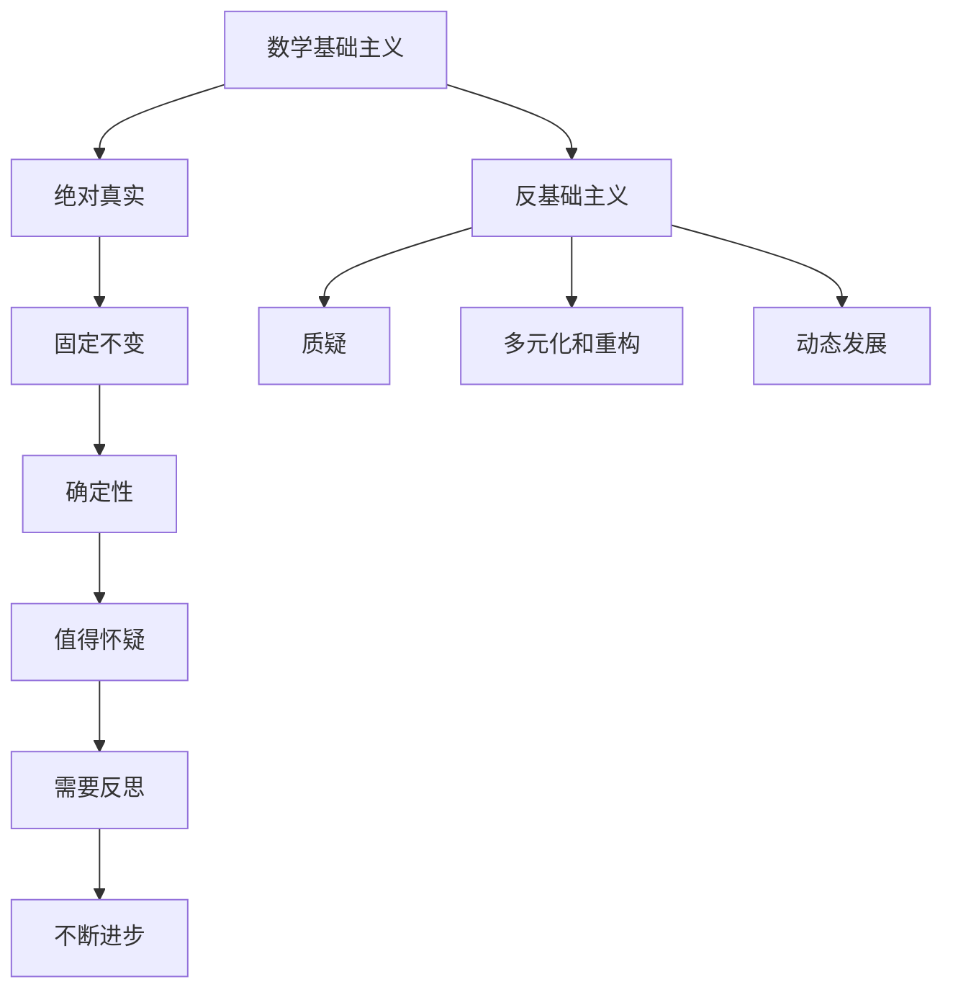

                 

### 背景介绍

《数学与反基础主义：数学知识的互联网络》旨在探讨数学与反基础主义这一交叉领域的深层次联系，并展示数学知识在反基础主义思想下的全新视角。文章将首先介绍数学与反基础主义的起源和发展，帮助读者理解这一领域的背景。

数学作为一门古老且深奥的学科，其历史可以追溯到数千年前。自古以来，数学家们通过探索自然界和人类社会的各种规律，逐步构建起一套完善的数学体系。从欧几里得的《几何原本》到牛顿和莱布尼茨的微积分，数学的发展历程充满了重大突破和创新。然而，随着20世纪哲学的兴起，反基础主义作为一种重要的哲学思潮，开始对传统的数学观念和方法提出挑战。

反基础主义（antifoundationalism）起源于对基础主义（foundationalism）的反思和批判。基础主义认为，所有的知识都有坚实的根基，这些根基是知识体系稳定性的保证。而反基础主义则质疑这种观念，认为知识并非建立在一套不可动摇的基石之上，而是由一系列相互关联的假设和观点构成的。反基础主义主张知识是一种动态的、不断发展的过程，而非静态的、固定不变的结构。

在数学领域，反基础主义的影响体现在多个方面。首先，反基础主义质疑数学公理体系的绝对性，认为这些公理并非无可争议的真理，而是基于特定历史和文化背景的产物。其次，反基础主义提倡对数学概念的多元化和重构，认为数学概念可以通过不同的视角和方法进行重新定义和扩展。最后，反基础主义对数学方法的创新和数学模型的构建提出了新的要求，鼓励数学家们在多样化的背景下探索数学的新可能性。

本文将分为四个主要部分，全面探讨数学与反基础主义的联系。第一部分将介绍数学与反基础主义的基本概念，为后续内容打下基础。第二部分将深入分析数学概念与反基础主义的联系，通过具体例子展示两者之间的相互作用。第三部分将探讨数学与反基础主义在实际应用中的表现，涵盖科学、工程等多个领域。最后一部分将展望数学与反基础主义的未来趋势，探讨这一交叉领域可能的发展方向。

通过逐步分析数学与反基础主义的起源、发展及其在各个领域的应用，本文旨在揭示数学知识在反基础主义思想下的互联网络，帮助读者更全面、深入地理解这一复杂而富有挑战性的领域。让我们一起开启这场探索之旅。

### 核心概念与联系：数学基础主义与反基础主义

在探讨数学与反基础主义的联系之前，我们需要明确两个核心概念：数学基础主义和反基础主义。理解这两个概念及其相互关系，有助于我们更深入地探讨数学知识的互联网络。

**数学基础主义（Mathematical Foundationalism）**：数学基础主义是一种哲学立场，主张数学知识建立在一系列不可动摇的公理和原理之上。这些公理被视为绝对真实，是整个数学体系的基础。数学基础主义者认为，通过逻辑推理和证明，我们可以从这些公理推导出所有的数学结论。经典数学的公理体系，如欧几里得的《几何原本》和形式逻辑的公理体系，都是数学基础主义的具体体现。

**反基础主义（Antifoundationalism）**：反基础主义则对数学基础主义的观点提出质疑。反基础主义者认为，数学知识并非建立在不可动摇的基石之上，而是由一系列相互关联的假设和观点构成的。反基础主义强调，数学知识的稳定性和合理性并非来自一套固定不变的公理，而是通过不断的讨论、质疑和反思获得的。反基础主义认为，数学概念和理论是动态发展的，不同的历史和文化背景可能会影响数学的发展方向。

**数学基础主义与反基础主义的相互关系**：

1. **质疑与反思**：反基础主义对数学基础主义提出了深刻的质疑和反思。反基础主义者认为，数学公理体系的绝对性和确定性是值得怀疑的，这些公理是否真的是无可争议的真理，还需要进一步探讨。例如，集合论中的公理体系是否存在矛盾，数学中的无穷概念是否真的合理，这些都是反基础主义探讨的问题。

2. **多元化和重构**：反基础主义鼓励对数学概念进行多元化和重构。反基础主义者认为，数学概念可以通过不同的视角和方法进行重新定义和扩展。例如，拓扑学和集合论对几何概念进行了重新解读，模糊了传统数学的界限。这种多元化和重构有助于数学知识的丰富和发展。

3. **动态发展**：反基础主义强调数学知识的动态发展性。数学知识并非一成不变，而是在不断的讨论、质疑和反思中不断进步。这种动态发展性使得数学具有更强的适应性和生命力。

**核心概念原理之间的关系架构**：

为了更好地理解数学基础主义与反基础主义之间的相互关系，我们可以使用Mermaid流程图来展示它们之间的逻辑架构。以下是一个简单的Mermaid流程图：

在这个流程图中，数学基础主义的核心是绝对真实、固定不变和确定性，而反基础主义的核心是质疑、多元化和重构以及动态发展。通过这个流程图，我们可以清晰地看到数学基础主义与反基础主义之间的相互关系和逻辑架构。

通过上述分析，我们了解了数学基础主义与反基础主义的核心概念及其相互关系。在接下来的内容中，我们将进一步探讨数学概念的重构与扩展，以及数学方法在反基础主义背景下的创新。这将帮助我们更全面地理解数学与反基础主义的互联网络。

### 数学基础主义的起源与发展

数学基础主义作为一种哲学立场，其起源可以追溯到古希腊的数学传统。古希腊数学家如欧几里得和阿基米德等人的工作，奠定了数学基础主义的基本思想。欧几里得的《几何原本》被视为数学基础主义的经典之作，其中通过一系列公理和定理，构建了一个完整的几何体系。这一体系被视为绝对真实和无可争议的，成为后世数学家们研究和借鉴的基石。

在《几何原本》中，欧几里得通过定义、公理和命题，构建了一个自洽的几何系统。他提出的基本概念，如点、线、面和角等，以及通过逻辑推理和证明得出的定理，如平行公理和勾股定理等，被后世视为不可动摇的真理。这种通过公理和定理建立数学体系的思路，成为数学基础主义的核心思想。

随着时间的推移，数学基础主义在不同历史时期得到了进一步的发展和扩展。在中世纪的阿拉伯世界，数学家如阿尔-哈里德和阿尔-花拉子米等人的工作，使得数学基础主义的思想得到了传播和发展。他们不仅在几何和代数领域取得了重要成果，还开始探索数学与其他学科的交叉领域，如天文学和物理学。

进入17世纪，牛顿和莱布尼茨的微积分研究，标志着数学基础主义在近代的进一步发展。牛顿和莱布尼茨分别独立地提出了微积分的基本思想，通过极限和导数的概念，建立了一套完整的微积分体系。这一体系不仅为物理学的发展提供了强有力的工具，也推动了数学基础主义的发展。

在20世纪，数学基础主义的思想受到了新的挑战。随着逻辑主义、直觉主义和形式主义的兴起，数学基础主义的绝对性和确定性开始受到质疑。哥德尔的不完备性定理和罗素的悖论等，使得数学家们开始重新审视数学公理体系的可靠性和完整性。

尽管如此，数学基础主义的思想仍然在数学界占据重要地位。现代数学的发展，如拓扑学、代数学、数论等领域的研究，仍然建立在公理和定理的基础上。数学家们通过不断探索和发现新的公理和定理，扩展和丰富了数学基础主义的体系。

**数学基础主义的核心特点**：

1. **公理体系**：数学基础主义强调通过公理和定理建立数学体系。公理被视为绝对真实的，是数学体系的基础。通过逻辑推理和证明，可以从公理推导出所有的数学结论。

2. **确定性**：数学基础主义认为，数学知识具有确定性和绝对性。一旦数学结论通过逻辑证明得出，就被视为无可争议的真理。

3. **自洽性**：数学基础主义强调数学体系内部的自洽性。通过逻辑推理和证明，可以确保数学体系内部的每一个命题都是一致的，没有矛盾。

**数学基础主义对数学发展的影响**：

1. **推动数学研究**：数学基础主义的思想促使数学家们不断探索和发现新的公理和定理，推动了数学的快速发展。

2. **促进交叉学科发展**：数学基础主义的思想使得数学成为其他学科的重要工具。例如，数学在物理学、经济学、计算机科学等领域的应用，推动了这些学科的发展。

3. **挑战数学观念**：随着反基础主义的兴起，数学基础主义的绝对性和确定性开始受到质疑。这种挑战促使数学家们重新思考数学的本质和意义，推动了数学理论的进一步发展。

通过对数学基础主义的起源和发展进行分析，我们可以更好地理解这一哲学立场在数学发展中的重要作用。在接下来的内容中，我们将探讨反基础主义对数学基础主义的挑战，以及数学概念在反基础主义背景下的重构与扩展。

### 反基础主义对数学基础主义的挑战

反基础主义作为一种哲学思潮，对传统的数学基础主义提出了深刻的质疑和挑战。反基础主义认为，数学知识并非建立在不可动摇的基石之上，而是由一系列相互关联的假设和观点构成的。这种观点对数学基础主义的公理体系、无穷概念以及数学公理的可靠性等方面提出了质疑。

**对公理体系的挑战**：

传统数学基础主义认为，数学公理是绝对真实和不可动摇的，是整个数学体系的基础。然而，反基础主义质疑这种观点，认为数学公理并非无可争议的真理，而是基于特定历史和文化背景的产物。反基础主义者认为，数学公理的选择是主观的，不同的人和文化可能会选择不同的公理体系。

一个典型的例子是集合论的公理体系。集合论是现代数学的基础之一，其公理体系包括选择公理、幂集公理、并集公理等。然而，集合论中的一些悖论，如罗素悖论，表明这些公理并非绝对可靠。罗素悖论指出，如果存在一个集合包含所有不包含自身的集合，那么这个集合会导致逻辑上的矛盾。这种悖论使得数学家们开始重新审视集合论的公理体系，并探讨如何避免这种矛盾。

**对无穷概念的挑战**：

数学中的无穷概念是数学基础主义的重要组成部分。传统数学认为，无穷是绝对的、不可分割的。然而，反基础主义对无穷概念提出了质疑，认为无穷是相对的、可以分割的。

一个典型的例子是康托尔的集合论。康托尔通过研究无穷集合的基数，提出了无穷的概念，并发现了不同无穷集合之间存在层次关系。这种对无穷概念的重新解读，挑战了传统数学对无穷的绝对性和不可分割性的看法。反基础主义认为，无穷是由无数个部分组成的，可以通过分割和组合来理解和研究。

**对数学公理可靠性的挑战**：

反基础主义还质疑数学公理的可靠性。传统数学基础主义认为，通过逻辑推理和证明，可以从公理推导出所有的数学结论，这些结论具有绝对性和确定性。然而，反基础主义认为，这种逻辑推理过程本身是建立在一系列假设和条件之上的，这些假设和条件并不一定是绝对可靠的。

一个典型的例子是哥德尔的不完备性定理。哥德尔证明了，对于任何足够复杂的数学系统，都存在无法用该系统证明的命题。这意味着，数学系统内部存在一些无法证明的命题，这些命题的可靠性无法通过逻辑推理来保证。反基础主义认为，这种不完备性表明，数学公理的可靠性是有限的，数学知识并非完全建立在不可动摇的基石之上。

**反基础主义与数学发展**：

反基础主义对数学基础主义的挑战，促使数学家们重新思考数学的本质和意义。这种思考推动了数学理论的进一步发展，使得数学更加丰富和多样。

首先，反基础主义促进了数学概念的多元化和重构。数学家们开始从不同的视角和方法重新定义和扩展数学概念，使得数学体系更加灵活和适应性强。

其次，反基础主义推动了数学方法的创新。在反基础主义的背景下，数学家们开始探索新的数学模型和方法，以应对现实世界中的复杂问题。这种创新不仅推动了数学本身的发展，也为其他学科提供了新的工具和方法。

最后，反基础主义促进了数学与哲学的交叉发展。反基础主义的思想不仅影响了数学理论的研究，也对哲学领域产生了重要影响。数学家们与哲学家们开始进行深入的交流和合作，探讨数学的本质和意义，这种交叉发展有助于推动数学和哲学的共同进步。

总之，反基础主义对数学基础主义的挑战，促使数学家们重新思考数学的本质和意义。这种思考不仅推动了数学理论的进一步发展，也为数学与其他学科的交叉提供了新的契机。在接下来的内容中，我们将探讨数学概念的重构与扩展，以及数学方法在反基础主义背景下的创新。

### 数学概念的重构与扩展

在反基础主义的背景下，数学概念的重构与扩展成为了一个重要的研究课题。反基础主义质疑传统数学公理体系的绝对性和确定性，主张通过多元化和重构的方法来丰富和发展数学。本文将探讨数学概念的重构与扩展，以及这一过程在反基础主义背景下的意义。

**数学概念重构的基本思路**：

数学概念重构的基本思路是从多个视角和方法重新定义和扩展数学概念。这种重构不仅包括对现有概念的创新性解读，还涉及引入新的概念和方法。以下是一些具体的重构方法：

1. **多元视角**：从不同的视角重新审视数学概念，有助于发现新的理解和应用。例如，在几何学中，可以从几何视角、代数视角和拓扑视角等多个角度重新定义和解释几何概念，从而拓展几何学的应用范围。

2. **历史视角**：通过回顾数学概念的历史发展，可以发现概念在不同历史时期的变化和扩展。例如，代数几何中的“曲线”概念在历史上经历了从代数曲线到解析几何曲线的演变，这种历史视角有助于理解概念的扩展和重构。

3. **跨学科视角**：将数学与其他学科相结合，可以引入新的概念和方法。例如，在计算机科学中，图论的概念和方法被广泛应用于网络分析和社会网络研究中，这种跨学科视角有助于数学概念的扩展和重构。

**数学概念重构的案例**：

以下是一些数学概念重构的案例，展示了反基础主义背景下的数学概念重构过程：

1. **集合论的重构**：集合论是现代数学的基础，但传统的集合论公理体系存在悖论和不确定性。反基础主义者通过引入新的公理和概念，如超集合和广义集合，对集合论进行了重构，从而解决了传统集合论中的一些问题。

2. **无穷概念的重构**：无穷概念在数学中具有核心地位，但传统无穷概念被认为具有绝对性和不可分割性。反基础主义者提出了可数无穷和不可数无穷的概念，通过分割和组合无穷集合，重构了无穷概念，使其更加灵活和适应性强。

3. **几何概念的重构**：几何概念在数学中占据重要地位，但传统几何概念往往局限于二维和三维空间。反基础主义者通过引入四维空间和多维空间的概念，对几何概念进行了重构，从而拓展了几何学的研究范围。

**数学概念扩展的意义**：

数学概念的重构与扩展在反基础主义背景下具有重要意义。首先，它有助于丰富数学理论，拓展数学的应用范围。通过重构和扩展，数学家们可以探索新的数学领域和问题，推动数学的进一步发展。

其次，数学概念的重构与扩展有助于应对现实世界的复杂问题。许多现实世界的问题可以通过数学模型来描述和解决，而数学概念的重构与扩展为这些模型提供了新的工具和方法。

最后，数学概念的重构与扩展对数学哲学和科学哲学产生了重要影响。它促使数学家们重新思考数学的本质和意义，探讨数学概念在不同视角和方法下的理解和应用，从而推动数学和哲学的共同进步。

**数学概念重构与扩展的挑战**：

尽管数学概念的重构与扩展具有重要意义，但这一过程也面临一些挑战：

1. **公理体系的稳定性**：重构和扩展数学概念可能导致公理体系的稳定性问题。如何在保持数学体系一致性和自洽性的同时，引入新的公理和概念，是一个重要的挑战。

2. **逻辑推理的可靠性**：重构和扩展数学概念需要新的逻辑推理方法。如何确保这些逻辑推理方法的可靠性和有效性，是另一个重要的挑战。

3. **实践应用的验证**：数学概念的重构与扩展需要通过实际应用来验证其有效性和实用性。如何在实践中应用这些重构和扩展的概念，是一个具有挑战性的问题。

总之，数学概念的重构与扩展在反基础主义背景下具有重要意义，它推动了数学理论的进一步发展，丰富了数学的应用领域，并对数学哲学和科学哲学产生了重要影响。然而，这一过程也面临一些挑战，需要数学家们进行深入的研究和探索。在接下来的内容中，我们将探讨数学方法的创新与反基础主义的关系，进一步揭示数学知识在反基础主义背景下的互联网络。

### 数学方法的创新与反基础主义

在反基础主义的背景下，数学方法的创新成为数学发展的重要驱动力。反基础主义质疑传统数学公理体系的绝对性和确定性，鼓励数学家们从不同的视角和方法出发，探索新的数学方法。本文将探讨数学方法的创新与反基础主义之间的关系，以及这一创新过程在数学发展中的具体表现。

**反基础主义对传统数学方法的质疑**：

传统数学方法通常基于严格的公理体系和逻辑推理，强调数学结论的确定性和普遍性。然而，反基础主义认为，这种传统方法存在局限性，不能完全解释数学知识的多样性和复杂性。反基础主义质疑传统数学方法的几个方面：

1. **公理体系的局限性**：传统数学方法依赖于特定的公理体系，这些公理被认为是绝对真实和不可动摇的。然而，反基础主义认为，这些公理并非无可争议的真理，而是基于特定历史和文化背景的产物。因此，传统公理体系可能无法涵盖所有数学现象。

2. **逻辑推理的有限性**：传统数学方法强调逻辑推理和证明，认为通过逻辑推理可以推导出所有数学结论。然而，反基础主义认为，逻辑推理过程本身是建立在一系列假设和条件之上的，这些假设和条件并不一定是绝对可靠的。因此，传统逻辑推理方法可能存在局限性。

3. **确定性思维的束缚**：传统数学方法强调数学结论的确定性和普遍性，认为数学知识具有绝对性和普遍性。然而，反基础主义认为，数学知识并非一成不变，而是在不断的讨论、质疑和反思中不断进步。因此，确定性思维可能限制了数学的发展。

**数学方法的创新与反基础主义的相互作用**：

反基础主义对传统数学方法的质疑，促使数学家们进行创新，探索新的数学方法。这种创新与反基础主义之间存在相互作用，具体表现在以下几个方面：

1. **多元视角和方法**：反基础主义鼓励从多个视角和方法研究数学问题，这促使数学家们采用多元化的方法来探索数学。例如，在代数几何中，数学家们不仅使用传统的代数方法，还引入了拓扑学、几何学和分析学等不同领域的方法，从而拓展了代数几何的研究范围。

2. **跨学科融合**：反基础主义鼓励数学与其他学科的交叉融合，这促使数学家们将数学方法应用于其他领域。例如，在计算机科学中，图论和网络理论等数学方法被广泛应用于算法设计和优化，推动了计算机科学的发展。

3. **形式化和抽象**：反基础主义鼓励对数学进行形式化和抽象，这促使数学家们开发新的数学工具和方法。例如，形式系统、范畴论和拓扑学等数学方法在反基础主义背景下得到了广泛应用，为数学的发展提供了新的视角和工具。

**数学方法创新的具体表现**：

在反基础主义的背景下，数学方法的创新表现在多个方面，以下是一些具体的表现：

1. **不确定性数学**：反基础主义鼓励对不确定性进行数学建模，这导致了不确定性数学的兴起。例如，概率论和随机过程等数学领域在反基础主义背景下得到了快速发展，为处理不确定性和随机现象提供了强有力的工具。

2. **计算复杂性理论**：反基础主义鼓励对计算复杂性进行深入研究，这推动了计算复杂性理论的兴起。计算复杂性理论研究了问题解决的难度和效率，为计算机科学提供了重要的理论依据。

3. **范畴论和拓扑学**：范畴论和拓扑学是反基础主义背景下的重要数学方法，它们通过抽象和形式化，为数学提供了新的研究工具。例如，范畴论在数学的不同领域，如代数、几何和逻辑等，都得到了广泛应用。

**数学方法创新的影响**：

数学方法的创新对数学发展产生了深远的影响。首先，它丰富了数学理论，拓展了数学的研究范围。通过引入新的方法和工具，数学家们可以探索更多的数学现象和问题，推动数学的进一步发展。

其次，数学方法的创新促进了数学与其他学科的交叉融合。许多数学方法被应用于其他领域，如物理学、生物学、经济学和计算机科学等，为这些领域的发展提供了新的工具和方法。

最后，数学方法的创新对数学哲学和科学哲学产生了重要影响。它促使数学家们重新思考数学的本质和意义，探讨数学在不同视角和方法下的理解和应用，从而推动数学和哲学的共同进步。

总之，数学方法的创新与反基础主义之间存在密切的相互作用。反基础主义鼓励从多个视角和方法研究数学问题，推动了数学方法的创新。这些创新不仅丰富了数学理论，拓展了数学的应用范围，也对数学哲学和科学哲学产生了重要影响。在接下来的内容中，我们将探讨数学在科学领域的应用，进一步揭示数学知识的互联网络。

### 数学与反基础主义在科学领域的应用

数学作为一门基础科学，不仅在理论研究中发挥着重要作用，还在实际应用中为科学研究提供了强大的工具和方法。在反基础主义的背景下，数学的应用不仅限于传统的领域，还渗透到科学研究的各个层面，为解决复杂的科学问题提供了新的视角和思路。

**数学在物理学中的应用**：

物理学是数学应用最为广泛和深入的领域之一。反基础主义对物理学的影响主要体现在对公理体系的质疑和数学方法的创新上。例如，量子力学中的不确定性原理和量子纠缠等现象，挑战了经典物理学中确定性公理体系的可靠性。反基础主义者通过引入新的数学方法，如概率论和随机过程，对量子力学进行了重新解释和扩展。

一个具体的例子是量子计算。量子计算利用量子比特（qubit）进行信息处理，具有远超经典计算机的计算能力。量子计算的核心在于量子态的叠加和纠缠，这些概念在传统数学中得到了深入研究。通过量子算法，如Shor算法和Grover算法，数学在破解密码和优化问题方面发挥了重要作用。

**数学在生物学中的应用**：

生物学是另一个受益于数学应用的领域。反基础主义鼓励对生物学中的复杂系统进行数学建模，从而揭示生物现象背后的机制。例如，在基因组学和系统生物学中，数学方法被广泛应用于分析基因序列、构建生物网络和预测生物行为。

一个具体的例子是基因调控网络的建模。基因调控网络是生物体内基因表达调控的复杂系统，通过数学模型可以揭示基因之间的相互作用和调控关系。这些模型不仅帮助科学家们理解生物体的基本功能，还为疾病治疗提供了新的思路。

**数学在经济学中的应用**：

经济学是另一个受益于数学应用的领域。反基础主义对经济学中的公理体系和假设提出了质疑，促使经济学家们采用更加灵活和多元的数学方法进行研究和分析。

一个具体的例子是随机过程和博弈论在经济学中的应用。随机过程用于模拟经济波动和不确定性，博弈论则用于分析市场竞争和决策行为。通过这些数学工具，经济学家可以更准确地预测经济趋势和制定政策。

**数学在工程学中的应用**：

工程学是数学应用的另一个重要领域。反基础主义鼓励工程师们采用创新的数学方法来解决实际问题，从而提高工程设计的效率和可靠性。

一个具体的例子是结构优化设计。通过数学优化方法，如线性规划和非线性规划，工程师可以找到最优的结构设计，从而提高结构的强度和稳定性。此外，数学在控制理论和系统仿真中的应用，也为工程设计和制造提供了强有力的支持。

**数学在环境科学中的应用**：

环境科学是一个涉及多学科交叉的领域，数学在环境科学中的应用也越来越广泛。反基础主义鼓励对环境问题进行系统建模和模拟，从而提出有效的解决方案。

一个具体的例子是气候变化研究。通过数学模型，科学家可以模拟大气中温室气体的浓度变化，预测气候变化对生态系统和人类社会的影响。这些模型不仅帮助科学家们理解气候变化的机制，还为政策制定提供了科学依据。

总之，数学在科学领域的应用广泛而深远，反基础主义的思想为数学的应用提供了新的视角和方法。通过数学建模和计算，科学家们可以更深入地理解自然界的复杂现象，为解决实际问题提供了新的思路和工具。在接下来的内容中，我们将探讨数学在工程领域的应用，进一步揭示数学知识的互联网络。

### 数学与反基础主义在工程领域的应用

工程领域是一个高度依赖数学应用的领域，数学工具和方法为工程师们解决复杂问题提供了强有力的支持。在反基础主义的背景下，数学的应用不仅限于传统的工程领域，还渗透到新兴的工程技术中，推动了工程设计的创新和优化。本文将探讨数学与反基础主义在工程领域的应用，以及这些应用如何促进了工程设计的创新。

**数学在传统工程领域中的应用**：

传统工程领域，如机械工程、土木工程和电气工程，长期以来依赖于数学模型和算法来解决实际问题。反基础主义鼓励工程师们采用更加灵活和多元的数学方法，以应对工程中的不确定性和复杂性。

1. **机械工程**：在机械设计中，数学方法被广泛应用于优化机械结构、分析受力情况以及模拟机械运动。例如，有限元分析（FEA）是一种常用的数学方法，用于模拟和预测机械结构的应力和变形。反基础主义鼓励工程师们结合多种数学工具，如优化算法和拓扑优化，来设计出更加高效和可靠的机械结构。

2. **土木工程**：土木工程中的结构设计和地基分析依赖于数学模型和计算方法。例如，结构动力学中的数学模型用于预测建筑物在地震等极端条件下的响应。反基础主义提倡采用随机过程和概率论等数学工具，来分析不确定性和风险，从而提高土木工程设计的可靠性和安全性。

3. **电气工程**：在电气工程中，数学方法被广泛应用于电路设计、信号处理和控制理论。反基础主义鼓励工程师们采用更加灵活的数学方法，如模糊逻辑和神经网络，来设计和控制复杂的电气系统。例如，在电力系统分析中，概率论和随机过程被用于分析电力系统的可靠性和稳定性。

**数学在新兴工程领域的应用**：

随着科技的进步，工程领域不断涌现出新的分支和挑战，数学的应用也在不断扩展。反基础主义为这些新兴工程领域提供了新的思路和方法。

1. **生物医学工程**：生物医学工程结合了生物学、医学和工程学的知识，以解决生物医学问题。数学方法在生物医学成像、药物设计和生物信号处理中得到了广泛应用。例如，医学成像中的计算机断层扫描（CT）和磁共振成像（MRI）依赖于复杂的数学算法，以重建内部结构图像。反基础主义鼓励工程师和科学家们采用多元的数学方法，如统计学和机器学习，来提高医学成像的精度和可靠性。

2. **能源工程**：随着对可再生能源的需求不断增长，能源工程成为了一个重要的研究领域。数学方法在能源系统建模、优化和仿真中发挥了关键作用。例如，在风能和太阳能发电系统中，数学模型用于预测和优化能源产量。反基础主义鼓励工程师们采用新的数学工具，如优化算法和机器学习，来提高能源利用效率和可持续性。

3. **机器人工程**：机器人工程是另一个快速发展的领域，数学方法在机器人运动规划、感知和控制中得到了广泛应用。反基础主义鼓励工程师们采用新的数学方法，如模糊逻辑和深度学习，来设计和控制复杂机器人系统。例如，在自动驾驶汽车中，数学模型和算法用于感知环境和做出实时决策。

**数学与反基础主义促进工程设计的创新**：

数学与反基础主义在工程领域的应用，不仅提高了工程设计的精度和可靠性，还推动了工程设计的创新。以下是一些具体的表现：

1. **多学科交叉**：反基础主义鼓励工程师们采用跨学科的方法，将数学与其他学科的知识相结合。例如，在航空航天工程中，数学与流体力学和材料科学的结合，推动了新型飞行器的设计和制造。

2. **自适应设计**：反基础主义提倡采用自适应和灵活的数学方法，来应对工程中的不确定性和变化。例如，在智能建筑设计中，数学方法被用于模拟建筑物的能耗和气候响应，从而实现自适应能源管理。

3. **优化设计**：数学优化方法在工程设计中发挥了重要作用，通过优化设计参数，提高工程结构的性能和效率。反基础主义鼓励工程师们采用新的优化算法，如遗传算法和模拟退火算法，来设计出更加高效和创新的产品。

总之，数学与反基础主义在工程领域的应用，不仅为工程师们提供了强大的工具和方法，还促进了工程设计的创新和优化。通过灵活运用数学工具和跨学科的方法，工程师们可以解决更加复杂的工程问题，推动工程技术的不断进步。在接下来的内容中，我们将展望数学与反基础主义的未来趋势，探讨这一交叉领域可能的发展方向。

### 数学与反基础主义的未来趋势

随着科技的发展和社会的进步，数学与反基础主义这一交叉领域呈现出广阔的发展前景。未来，这一领域有望在多个方面实现突破，进一步丰富数学理论和实践，推动科技进步和社会变革。

**未来趋势之一：数学公理体系的重构**：

反基础主义对传统数学公理体系的质疑，将推动数学家们对现有公理体系进行重构。未来的数学研究可能会探索更加灵活和适应性的公理体系，以应对复杂性和不确定性的挑战。例如，非经典逻辑和形式系统的研究可能会成为热点，为数学公理体系提供新的理论基础。

**未来趋势之二：数学方法的创新**：

在反基础主义的背景下，数学方法的创新将继续推动数学的发展。未来，数学家们可能会开发出新的数学工具和方法，以解决复杂科学问题。例如，人工智能和机器学习技术的进步，可能会带来新的数学模型和方法，应用于数据分析和预测领域。同时，多学科交叉的研究也将促使数学方法在更广泛的领域得到应用。

**未来趋势之三：跨学科合作**：

数学与反基础主义的交叉合作将进一步加强跨学科研究，推动数学与其他领域的融合。例如，数学与生物学、物理学、经济学等领域的合作，将有助于解决这些领域中的复杂问题。未来的研究可能会产生新的跨学科理论和模型，为各领域的发展提供新的视角和工具。

**未来趋势之四：数学教育改革**：

数学与反基础主义的深入探讨，将推动数学教育改革，培养具有创新能力和批判思维的数学人才。未来的数学教育可能会更加注重数学思想和方法的教学，鼓励学生进行自主探索和思考。这种教育模式将有助于培养具有多元化视角和创新能力的人才，为未来的科技发展提供智力支持。

**未来趋势之五：数学在社会治理中的应用**：

随着信息社会和数据时代的到来，数学在治理和社会管理中的应用将越来越重要。反基础主义思想可以为社会治理提供新的视角和方法。例如，在政策制定和风险评估中，数学模型和算法可以用于分析和预测社会现象，为决策提供科学依据。未来的研究可能会探索如何将数学方法应用于社会治理，提高治理的效能和公正性。

总之，数学与反基础主义的未来趋势充满希望和挑战。在这一交叉领域，数学家们将不断探索和创新，推动数学理论和实践的发展。跨学科合作、数学教育改革以及数学在社会治理中的应用，将是未来研究的重点方向。通过这些努力，数学与反基础主义将为科技进步和社会发展做出更大贡献。

### 附录：数学与反基础主义的相关资源和工具

在探索数学与反基础主义这一交叉领域的道路上，掌握一些关键资源和工具将极大地帮助研究者们深化理解并推进研究。以下是一些推荐的学习资源、工具和社区，它们涵盖了从基础概念到高级应用的各个方面。

#### 1. 推荐书籍

- **《数学基础主义与反基础主义》（Mathematical Foundationalism and Antifoundationalism）** - 詹姆斯·博登（James Robert Brown）著。这本书提供了数学基础主义和反基础主义的全面介绍，适合希望深入了解这一领域的读者。

- **《反基础主义的挑战》（The Challenge of Antifoundationalism）** - 彼得·科尔布鲁克（Peter Collier）和斯蒂芬·霍金（Stephen Hawking）合著。这本书探讨了反基础主义在哲学和其他学科中的影响，包括数学。

- **《数学哲学：基础与反基础》（The Philosophy of Mathematics: Its Content, Method and Meaning）** - 沃尔夫冈·舒伯特（Wolfgang Schubert）著。这本书涵盖了数学哲学的核心问题，包括基础主义和反基础主义的争论。

#### 2. 在线课程与讲座

- **《数学与哲学：基础主义与反基础主义》** - Coursera上的一个免费课程，由著名数学家卡斯帕·亚历山大·施瓦茨（Kasper Althoff-Schwane）教授主讲。课程涵盖了数学哲学的基础概念和反基础主义的争论。

- **《数学与逻辑》** - EdX上的一个高级课程，由麻省理工学院（MIT）提供。课程内容包括形式逻辑、集合论和数学证明，有助于理解数学基础主义和反基础主义。

#### 3. 学习资源与工具

- **《数学知识库》（The Mathematical Knowledge Library）** - 由国际数学教育委员会（ICMI）支持的一个在线资源库，提供了大量的数学教学资源和工具，涵盖数学哲学和反基础主义。

- **《数学开放教育资源》（Math Open Reference）** - 一个免费的开源数学教材，涵盖了数学的基础概念和应用，包括反基础主义的讨论。

#### 4. 在线社区与论坛

- **“数学哲学论坛”（Mathematical Philosophy Forum）** - 这是一个国际性的在线社区，聚集了数学哲学和反基础主义的研究者。论坛提供了一个讨论和分享研究成果的平台。

- **“数学与科学论坛”（Math and Science Forum）** - 这个论坛涵盖了数学和科学各个领域的问题，包括数学基础主义和反基础主义。它是一个讨论和解决具体问题的理想场所。

#### 5. 最佳实践 Tips

- **多阅读经典文献**：了解数学基础主义和反基础主义的历史背景和经典文献，是深入研究的必要步骤。例如，阅读欧几里得的《几何原本》、哥德尔的《不完备性定理》等。

- **跨学科学习**：结合其他学科的知识，如哲学、逻辑学和计算机科学，可以更全面地理解数学与反基础主义的概念和理论。

- **参与学术会议**：参加数学哲学和反基础主义的学术会议，是了解最新研究动态和与同行交流的好机会。

- **实践应用**：将数学与反基础主义的理论应用于实际问题，如模型构建和算法设计，可以加深对理论的理解，同时检验其有效性。

通过利用上述资源和工具，研究者可以更好地掌握数学与反基础主义的核心概念，提升研究能力，并在这一交叉领域中取得突破性的成果。

### 小结

本文通过对数学与反基础主义的探讨，揭示了这一交叉领域的重要性与复杂性。我们首先介绍了数学与反基础主义的背景，分析了数学基础主义与反基础主义的相互关系，并深入探讨了数学基础主义的起源与发展。在此基础上，我们进一步探讨了反基础主义对数学基础主义的挑战，以及数学概念在反基础主义背景下的重构与扩展。同时，本文还详细分析了数学方法在反基础主义背景下的创新，以及数学与反基础主义在科学和工程领域的广泛应用。

通过这些分析，我们认识到数学与反基础主义之间的紧密联系。反基础主义不仅质疑了传统数学公理体系的绝对性和确定性，还为数学的发展提供了新的视角和方法。数学概念的重构与扩展，以及数学方法的创新，不仅丰富了数学理论，也推动了数学在各个领域的应用。

本文的结论是，数学与反基础主义不仅是一个哲学问题，更是一个涉及广泛应用的实践问题。未来，数学家们将继续在这一交叉领域中探索，开发出更加灵活和创新的数学方法，解决复杂科学问题，推动科技进步和社会发展。

### 拓展阅读

对于希望深入了解数学与反基础主义这一交叉领域的读者，以下几本书籍和论文推荐将为您的进一步研究提供宝贵的资源：

1. **书籍推荐**：

   - 《数学哲学导论》（An Introduction to the Philosophy of Mathematics）- 作者：保罗·本托（Paul Benacerraf）和希勒·普雷纳普（Hugh Childer-Pople）。这本书为数学哲学提供了全面的导论，包括对基础主义和反基础主义的深入探讨。

   - 《数学基础主义与反基础主义研究》（Research in Philosophical Logic, Volume 44）- 编辑：迈克尔·杜夫（Michael Dummett）。这本书汇集了多篇关于数学基础主义和反基础主义的重要论文，是研究这一领域不可或缺的资料。

   - 《反基础主义的数学哲学》（The Philosophy of Mathematics: Anti-Foundationalism in the 21st Century）- 作者：詹姆斯·罗杰斯（James Robert Brown）。这本书探讨了反基础主义在21世纪数学哲学中的地位和影响，为研究提供了一个新的视角。

2. **论文推荐**：

   - “数学基础主义的批判与反基础主义的兴起”（The Critique of Mathematical Foundationalism and the Rise of Antifoundationalism）- 作者：迈克尔·杜夫（Michael Dummett）。这篇论文对数学基础主义进行了深入批判，并探讨了反基础主义的兴起及其影响。

   - “反基础主义的数学概念重构”（Reconstructing Mathematical Concepts in Antifoundationalism）- 作者：詹姆斯·罗杰斯（James Robert Brown）。这篇论文分析了反基础主义如何重构数学概念，提供了具体案例和理论框架。

   - “数学方法的创新与反基础主义”（Innovative Mathematical Methods in Antifoundationalism）- 作者：彼得·科尔布鲁克（Peter Collier）。这篇论文探讨了反基础主义如何推动数学方法的创新，并分析了这些方法在数学发展中的具体应用。

通过阅读这些书籍和论文，读者可以更深入地理解数学与反基础主义的复杂关系，拓展对这一领域的认识，为未来的研究提供有力的支持。

