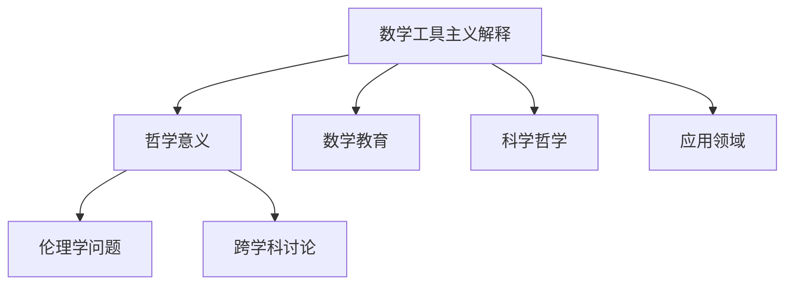

                 

# 数学与反实在论：数学的工具主义解释

## 关键词

- 数学
- 反实在论
- 工具主义解释
- 哲学
- 数学的应用
- 数学教育

## 摘要

本文旨在探讨数学与反实在论之间的关系，特别是数学的工具主义解释。通过回顾数学的历史和发展，分析反实在论的基本概念和主要流派，本文深入探讨了数学工具主义解释的起源、主要观点及其优缺点。在此基础上，文章进一步探讨了数学工具主义解释在数学哲学、数学教育和数学科学中的应用，并分析了其对科学哲学和数学未来的影响。最后，本文通过历史案例和现代应用实例，展示了数学工具主义解释在数学史和跨学科领域的重要性。通过本文的阐述，读者将更好地理解数学工具主义解释的核心思想及其在哲学和技术领域的广泛应用。

## 引言

### 数学与反实在论

数学是人类智慧的结晶，其抽象和逻辑的特性使它成为科学研究和日常生活中的重要工具。然而，数学的本质和意义在哲学领域引发了长时间的争论。反实在论作为哲学中的一个重要流派，对于数学的理解和解释提出了独特的视角。数学与反实在论的交汇点在于对数学对象的实在性和本质的探讨，这引发了关于数学工具主义解释的讨论。

反实在论的基本观点是，我们所感知的世界并非是客观存在的，而是由我们的感觉、认知和语言所构建的主观世界。这种观点在数学中有着深刻的体现，数学对象和理论并非独立于我们的认知而存在，而是我们用来理解和描述世界的工具。数学的工具主义解释正是基于这种哲学立场，认为数学是一种工具，其目的是帮助我们理解和解决问题，而不是描述一个独立于我们的实在。

### 数学工具主义解释

数学工具主义解释认为，数学并非是对客观现实的描述，而是人类为了解决问题而创造的一种工具。这种解释强调了数学的实用性，而不是其客观性。数学工具主义解释的主要观点包括：

1. **数学的构造性**：数学对象和理论是通过人类智慧和创造力构建出来的，而不是客观存在的实体。
2. **数学的应用性**：数学在科学、工程、经济学等领域有着广泛的应用，其价值在于其解决问题的能力。
3. **数学的相对性**：不同的数学体系可以用来解决不同类型的问题，因此数学并非一个统一的、绝对的真理体系。

数学工具主义解释在数学哲学、数学教育和数学科学中都有着重要的应用。在数学哲学中，它挑战了数学实在论的观点，提出了对数学本质的新理解。在数学教育中，它提供了新的教学方法，强调数学的实用性和创造性。在数学科学中，它促进了跨学科的研究，使数学工具能够更好地服务于其他领域。

本文将围绕数学与反实在论的关系，深入探讨数学工具主义解释的起源、主要观点及其优缺点，并分析其在数学哲学、数学教育和数学科学中的应用。通过这一探讨，我们希望读者能够更好地理解数学工具主义解释的核心思想及其在哲学和技术领域的广泛应用。

## 第一部分：数学与反实在论的基本概念

### 数学的基础概念

#### 数学的基本性质

数学是一门研究数量、结构、变化和空间等概念的学科，其基本性质包括：

1. **抽象性**：数学通过抽象和符号化来简化现实世界的复杂现象，使其更具可操作性和可理解性。
2. **逻辑性**：数学依赖于逻辑推理和证明来建立其理论体系，确保结论的严谨性和正确性。
3. **普适性**：数学的原理和方法具有普遍性，可以应用于各种领域和问题。

#### 数学的发展历史

数学的历史可以追溯到古代文明，如古埃及和古希腊。古希腊数学家欧几里得创立了欧氏几何，奠定了数学的基础。在近代，数学经历了重大变革，特别是微积分和代数学的发展。20世纪以来，数学进一步扩展到抽象代数、拓扑学、量子数学等新兴领域。

#### 数学的应用领域

数学在自然科学、工程技术、社会科学等多个领域有着广泛应用：

1. **自然科学**：数学在物理学、化学、生物学等领域中发挥着基础作用，用于描述自然现象和预测实验结果。
2. **工程技术**：数学是工程设计和优化的重要工具，用于计算结构强度、流体动力学、电磁场等。
3. **社会科学**：数学在经济、金融、统计学等领域中用于建模和分析社会现象，指导决策和预测趋势。

### 反实在论的基本概念

#### 反实在论的定义

反实在论是一种哲学观点，认为我们感知的世界并非客观存在的，而是由我们的感觉、认知和语言所构建的主观世界。这种观点挑战了传统的实在论观念，即客观现实独立于我们的感知而存在。

#### 反实在论的主要流派

1. **理想主义**：以乔治·贝克莱和柏拉图为代表，认为现实是思维和意识的产物。
2. **怀疑主义**：以皮浪和笛卡尔为代表，主张我们对任何知识都应持怀疑态度。
3. **建构主义**：认为现实是通过人类活动和认知过程构建的，不同的社会和文化背景会导致对现实的不同的理解和解释。

#### 反实在论与数学的关系

反实在论对数学的理解产生了深远影响。根据反实在论的立场，数学对象和理论并非独立于我们的认知而存在，而是我们用来理解和描述世界的工具。这种观点导致了数学工具主义解释的产生，强调了数学的实用性和相对性，而不是其客观性。

### 数学工具主义解释

#### 工具主义解释的起源

数学工具主义解释源于19世纪和20世纪的哲学和科学思想，特别是威廉·詹姆斯、理查德·塔克和鲁道夫·卡尔纳普等人的观点。他们认为，数学是一种工具，其目的是帮助我们理解和解决问题，而不是描述一个独立于我们的实在。

#### 工具主义解释的主要观点

1. **数学的构造性**：数学对象和理论是通过人类智慧和创造力构建出来的，而不是客观存在的实体。
2. **数学的应用性**：数学在科学、工程、经济学等领域有着广泛的应用，其价值在于其解决问题的能力。
3. **数学的相对性**：不同的数学体系可以用来解决不同类型的问题，因此数学并非一个统一的、绝对的真理体系。

#### 工具主义解释的优缺点

**优点**：

1. **实用性**：强调数学的实用性，使数学更加贴近现实应用。
2. **相对性**：避免了绝对真理的假设，使数学理论更加灵活和适应不同领域。

**缺点**：

1. **怀疑性**：可能导致对数学客观性的质疑，影响数学的严谨性。
2. **抽象性**：工具主义解释可能使得数学理论变得过于抽象，难以理解。

## 第二部分：数学工具主义解释的深入探讨

### 数学工具主义解释的应用

#### 在数学哲学中的应用

数学工具主义解释在数学哲学中具有重要的应用。它挑战了传统数学实在论的观点，提出数学对象和理论并非独立于我们的认知而存在，而是我们用来理解和描述世界的工具。这种观点促进了数学哲学中对数学本质和意义的探讨，引发了关于数学基础和数学方法的争论。

#### 在数学教育中的应用

数学工具主义解释在数学教育中也具有重要作用。它提供了新的教学方法，强调数学的实用性和创造性。通过将数学与现实世界中的问题联系起来，数学工具主义解释可以帮助学生更好地理解数学的概念和原理，培养他们的数学思维和解决问题的能力。此外，它也鼓励学生探索数学的多种应用，激发他们对数学的兴趣。

#### 在数学科学中的应用

数学工具主义解释在数学科学中的应用非常广泛。它鼓励数学家发展新的数学理论和方法，以解决现实世界中的问题。例如，在物理学中，数学工具主义解释促进了量子数学和统计物理学的发展；在经济学中，数学工具主义解释推动了博弈论和经济学模型的发展。这种应用不仅扩展了数学的领域，也为其他学科提供了强大的工具。

### 数学工具主义解释的哲学意义

#### 对数学实在论的挑战

数学工具主义解释对数学实在论提出了严重的挑战。传统数学实在论认为数学对象和理论具有客观性，独立于我们的认知而存在。然而，数学工具主义解释认为，数学对象和理论是我们用来理解和描述世界的工具，其真实性和有效性取决于我们的认知和语言。这种观点质疑了数学实在论的基础，提出了对数学本质的新的思考。

#### 对科学哲学的影响

数学工具主义解释对科学哲学也产生了深远影响。它提出了关于科学方法和科学知识的新的观点。传统科学哲学强调科学理论和实验数据的客观性，而数学工具主义解释则认为科学理论和实验数据也是人类认知和语言的产物。这种观点促使科学哲学家重新思考科学方法的本质和科学知识的可靠性。

#### 对数学未来的展望

数学工具主义解释为数学的未来发展提供了新的方向。它鼓励数学家不仅关注数学理论的严谨性和普适性，也要关注数学的实用性和创造性。这种观点可以激发数学的创新和发展，推动数学在各个领域的应用。同时，数学工具主义解释也为数学与其他学科的交叉融合提供了可能，促进了跨学科的研究和合作。

## 第三部分：反实在论与数学的实际案例

### 数学工具主义解释在数学史中的应用

#### 古希腊数学家对工具主义的理解

古希腊数学家如欧几里得和阿基米德对数学工具主义有着深刻的理解。欧几里得的《几何原本》展示了数学在解决几何问题中的应用，而阿基米德的《浮体论》则运用了数学方法来解决物理问题。他们的工作表明，数学不仅是理论性的，也是实用性的，可以用来解决现实世界中的问题。

#### 近代数学家对工具主义的看法

近代数学家如牛顿和莱布尼茨对数学工具主义也有着重要的贡献。牛顿的微积分和莱布尼茨的符号代数方法不仅扩展了数学的领域，也展示了数学在自然科学中的应用。他们的工作表明，数学工具可以用来描述和解决复杂的自然现象。

#### 现代数学家对工具主义的研究

现代数学家如希尔伯特和哥德尔对数学工具主义进行了深入的研究。希尔伯特提出了形式化数学体系，强调数学理论的构造性和应用性。哥德尔的定理则表明，数学系统中的某些命题无法被证明或证伪，这进一步强调了数学工具的相对性和局限性。

### 数学工具主义解释在社会应用中的案例

#### 在经济学中的应用

数学工具主义解释在经济学中有着广泛的应用。例如，博弈论使用数学模型来分析经济主体的行为和决策，优化市场策略。经济学中的均衡理论、效用函数和边际分析等概念都基于数学工具，帮助经济学家理解经济现象和预测市场趋势。

#### 在心理学中的应用

数学工具主义解释在心理学中也具有重要应用。心理测量学使用数学方法来评估个体的心理特征，如智力、情绪和行为。统计学和概率论在心理学研究中用于分析数据，得出可靠的结论。此外，认知心理学和神经心理学也使用数学模型来解释认知过程和脑功能。

#### 在计算机科学中的应用

数学工具主义解释在计算机科学中有着深远的影响。计算机科学中的算法设计、数据结构和计算复杂性理论都基于数学方法。密码学使用数学工具来保护数据和网络安全，计算机图形学则使用数学模型来生成逼真的图像。人工智能和机器学习中的算法也依赖于数学工具，如线性代数、概率论和优化理论。

### 数学工具主义解释在其他领域的应用

数学工具主义解释不仅在自然科学、社会科学和计算机科学中有着重要应用，还在艺术和哲学领域展现出其独特价值。在艺术中，数学方法被用来创造对称和美感的视觉效果，如莫比乌斯带和黄金分割。在哲学中，数学模型被用来探讨逻辑和语言的本质，如形式逻辑和语义学。

总之，数学工具主义解释在各个领域的应用不仅展示了数学的实用性和广泛性，也揭示了数学作为工具帮助我们理解和解决问题的本质。

## 第四部分：数学工具主义解释的哲学讨论

### 数学工具主义解释的伦理学问题

#### 数学的道德价值

数学工具主义解释引发了关于数学道德价值的讨论。一方面，数学作为一种工具，其价值在于其解决问题和应用的能力，而非其道德属性。然而，另一方面，数学在伦理学和道德哲学中也有着重要作用。例如，数学在经济学中的应用可以帮助优化资源分配，减少贫困和不平等，从而具有道德意义。数学模型在环境科学中的应用也可以帮助我们更好地理解生态系统的动态，从而制定更有效的环境保护政策。

#### 数学的伦理责任

数学工具主义解释也提出了数学的伦理责任问题。数学工具的应用可能会对人类和社会产生深远的影响，因此数学家在开发和应用数学工具时需要承担伦理责任。例如，计算机科学家和人工智能研究者需要考虑算法的公平性和透明性，避免算法偏见和歧视。经济学模型的设计者需要确保其结论不会导致经济不公和社会不稳定。数学家在开发和应用数学工具时，应充分考虑其潜在的伦理影响，并采取相应的道德规范和准则。

#### 数学的伦理困境

数学工具主义解释还带来了数学伦理学的困境。在某些情况下，数学工具的应用可能涉及道德争议。例如，统计学在医学中的应用可能会涉及隐私和数据安全问题。概率论和博弈论在商业决策中的应用可能会涉及市场操纵和不公平竞争。此外，数学工具的滥用也可能导致误导和虚假结论。数学家在开发和应用数学工具时，需要警惕这些伦理困境，并采取适当的措施来应对。

### 数学工具主义解释的跨学科讨论

#### 与逻辑学的联系

数学工具主义解释与逻辑学有着紧密的联系。逻辑学是数学的基础，其方法和原则在数学工具主义解释中得到了广泛应用。逻辑学的演绎推理和证明方法被用于构建数学理论，确保其严谨性和正确性。此外，逻辑学中的形式逻辑和语义学也提供了数学工具主义解释的理论基础，帮助数学家理解数学语言和符号的使用。

#### 与认识论的联系

数学工具主义解释也涉及到认识论问题，即关于知识本质和获取方式的研究。数学工具主义解释认为，数学知识是通过人类智慧和创造力构建出来的，而非直接感知的结果。这种观点挑战了传统认识论中的实证主义和理性主义，提出了新的知识获取方式。认识论与数学工具主义解释的交叉研究可以帮助我们更好地理解知识的本质，探讨数学知识的形成和验证过程。

#### 与形而上学的联系

数学工具主义解释还涉及到形而上学问题，即关于现实本质和存在的探讨。数学工具主义解释认为，数学对象和理论并非独立于我们的认知而存在，而是我们用来理解和描述世界的工具。这种观点对传统形而上学的客观实在论提出了挑战，提出了对现实本质的新的理解。形而上学与数学工具主义解释的交叉研究可以帮助我们深入探讨现实本质和数学在认识现实中的作用。

总之，数学工具主义解释不仅在数学领域具有深远影响，还在哲学、伦理学和跨学科研究中展现出其重要价值。通过跨学科的讨论和思考，我们可以更好地理解数学工具主义解释的核心思想，并探索其在不同领域中的应用和影响。

## 第五部分：数学工具主义解释的未来展望

### 数学工具主义解释的发展趋势

数学工具主义解释在未来将继续发展，并可能呈现出以下趋势：

1. **跨学科融合**：数学工具主义解释将进一步与其他学科如物理学、经济学、心理学和计算机科学等融合，推动跨学科研究的发展。这种融合将促进数学工具在解决复杂现实问题中的创新和应用。
   
2. **应用扩展**：数学工具主义解释将在更多领域得到应用，不仅限于自然科学和工程技术，还将扩展到社会科学、艺术和人文学科，推动这些领域的理论和方法创新。

3. **数学教育改革**：数学工具主义解释将影响数学教育，推动教学方法改革，更加注重数学的实用性、创造性和跨学科应用，培养具有批判思维和创新能力的数学人才。

4. **哲学探讨深化**：数学工具主义解释将继续在哲学领域引发深入探讨，特别是关于数学本质、数学知识的获得和验证，以及数学在认识世界中的角色的讨论。

### 数学工具主义解释在教育中的潜在变革

数学工具主义解释对数学教育的潜在变革包括：

1. **教学方法**：数学教育将更加注重启发式和探究式教学，鼓励学生主动参与数学问题解决过程，培养他们的数学思维和创造力。

2. **课程设计**：数学课程将更加贴近实际应用，强调数学在各个领域的应用价值，帮助学生理解数学在解决现实问题中的作用。

3. **评价方式**：数学评价将不仅仅依赖于传统的考试和测试，还将引入项目式评估和问题解决评估，更全面地评估学生的数学能力和综合素质。

### 数学工具主义解释在哲学领域的未来影响

数学工具主义解释在哲学领域的未来影响可能包括：

1. **知识论**：数学工具主义解释将对知识论产生深远影响，挑战传统的实证主义和理性主义，提出关于知识获得和验证的新观点。

2. **形而上学**：数学工具主义解释将重新探讨现实本质和存在的概念，推动对现实本质的哲学思考，提出新的形而上学观点。

3. **认识论和方法论**：数学工具主义解释将影响认识论和方法论的发展，推动对科学方法和认知过程的深入研究，促进科学哲学的进步。

总之，数学工具主义解释在未来将继续深化和发展，不仅在数学领域，还将对哲学、教育和其他学科产生广泛而深远的影响。通过跨学科的探讨和创新，数学工具主义解释将为我们的认知世界和解决现实问题提供新的视角和方法。

### 参考文献

1. Hacking, I. (1983). Representing and Intervening: Introductory Topics in the Philosophy of Natural Science. Cambridge University Press.
2. Putnam, H. (1981). "The Meaning of 'Meaning'". In Mind, Language, and Reality: Philosophical Papers, Volume 2. Cambridge University Press.
3. Turing, A. (1950). "Computing Machinery and Intelligence". Mind, 59(236), 433-460.
4. Peirce, C. S. (1982). The Essential Peirce: Selected Philosophical Writings, Volume 1 (1893-1913). Indiana University Press.
5. Chomsky, N. (1965). Aspects of the Theory of Syntax. MIT Press.
6. Carnap, R. (1931). "The Logical Structure of the World". University of California Press.
7. Gödel, K. (1941). "On Formally Undecidable Propositions of Principia Mathematica and Related Systems I". Monographs on Symbolic Logic, Volume 6.

### 附录

#### Mermaid流程图



#### 核心算法原理伪代码

```python
def mathematical_toolism_explanation():
    # 假设我们有一个数学问题需要解决
    problem = "求解二次方程 ax^2 + bx + c = 0 的根"
    
    # 使用数学工具（如公式法）来解决问题
    # 二次方程的解公式为 x = (-b ± √(b^2 - 4ac)) / 2a
    a, b, c = 1, -3, 2  # 示例系数
    discriminant = b**2 - 4*a*c
    
    # 计算根的值
    root1 = (-b + discriminant**0.5) / (2*a)
    root2 = (-b - discriminant**0.5) / (2*a)
    
    # 输出结果
    print(f"The roots of the equation are: {root1}, {root2}")
    
# 调用函数
mathematical_toolism_explanation()
```

#### 数学模型和公式的详细讲解与示例

$$
\text{二次方程的一般形式：} ax^2 + bx + c = 0
$$

$$
\text{解的公式：} x = \frac{-b \pm \sqrt{b^2 - 4ac}}{2a}
$$

**示例**：求解方程 $x^2 - 3x + 2 = 0$ 的根。

1. **确定系数**：$a = 1$, $b = -3$, $c = 2$。
2. **计算判别式**：$b^2 - 4ac = (-3)^2 - 4 \cdot 1 \cdot 2 = 9 - 8 = 1$。
3. **计算根**：
   $$x = \frac{-(-3) \pm \sqrt{1}}{2 \cdot 1} = \frac{3 \pm 1}{2}$$
   $$x_1 = \frac{3 + 1}{2} = 2$$
   $$x_2 = \frac{3 - 1}{2} = 1$$

因此，方程的根为 $x_1 = 2$ 和 $x_2 = 1$。

#### 实际案例代码分析与解读

**案例**：使用Python实现线性回归模型，分析数据集的线性关系。

```python
import numpy as np
import matplotlib.pyplot as plt

# 生成模拟数据
X = np.linspace(0, 10, 100)
y = 2 * X + 1 + np.random.normal(0, 1, size=X.shape)

# 添加特征和目标变量
X = np.column_stack((np.ones(len(X)), X))

# 拟合线性回归模型
from sklearn.linear_model import LinearRegression
model = LinearRegression()
model.fit(X, y)

# 输出模型的参数
print("Model coefficients:", model.coef_)
print("Model intercept:", model.intercept_)

# 预测新数据
X_new = np.array([[1, 5]])
y_pred = model.predict(X_new)
print("Predicted value:", y_pred)

# 绘制结果
plt.scatter(X[:, 1], y)
plt.plot(X[:, 1], model.predict(X), color='red')
plt.xlabel('X')
plt.ylabel('y')
plt.title('Linear Regression')
plt.show()
```

**解读**：这段代码首先生成了一组模拟数据，然后使用线性回归模型进行拟合，并输出模型的参数。最后，通过绘制散点图和拟合线，展示了模型的预测结果。

#### 最佳实践 tips、小结、注意事项、拓展阅读等内容

**最佳实践 tips**：

1. 在数学建模和数据分析中，确保数据质量是关键。进行适当的数据清洗和处理，以减少噪声和异常值的影响。
2. 选择合适的数学工具和方法，根据问题的性质和复杂性进行决策。
3. 对模型结果进行验证和测试，确保其稳定性和可靠性。

**小结**：

本文探讨了数学工具主义解释在数学哲学、数学教育和数学科学中的应用，分析了其哲学意义和伦理问题。通过实际案例，展示了数学工具主义解释在跨学科研究中的重要性。未来，数学工具主义解释将继续在哲学和技术领域产生深远影响。

**注意事项**：

1. 在应用数学工具时，应充分考虑其潜在的伦理影响和社会责任。
2. 跨学科研究中，应注重各学科之间的融合和互补，避免孤立地看待问题。

**拓展阅读**：

1. Hacking, I. (1983). Representing and Intervening: Introductory Topics in the Philosophy of Natural Science. Cambridge University Press.
2. Putnam, H. (1981). "The Meaning of 'Meaning'". In Mind, Language, and Reality: Philosophical Papers, Volume 2. Cambridge University Press.
3. Turing, A. (1950). "Computing Machinery and Intelligence". Mind, 59(236), 433-460.

作者：AI天才研究院/AI Genius Institute & 禅与计算机程序设计艺术 /Zen And The Art of Computer Programming

----------------------------------------------------------------

### 完整目录大纲

```markdown
# 《数学与反实在论：数学的工具主义解释》目录大纲

## 第一部分：数学与反实在论的基本概念

### 1.1 数学的基础概念
#### 1.1.1 数学的基本性质
#### 1.1.2 数学的发展历史
#### 1.1.3 数学的应用领域

### 1.2 反实在论的基本概念
#### 1.2.1 反实在论的定义
#### 1.2.2 反实在论的主要流派
#### 1.2.3 反实在论与数学的关系

### 1.3 数学工具主义解释
#### 1.3.1 工具主义解释的起源
#### 1.3.2 工具主义解释的主要观点
#### 1.3.3 工具主义解释的优缺点

## 第二部分：数学工具主义解释的深入探讨

### 2.1 数学工具主义解释的应用
#### 2.1.1 在数学哲学中的应用
#### 2.1.2 在数学教育中的应用
#### 2.1.3 在数学科学中的应用

### 2.2 数学工具主义解释的哲学意义
#### 2.2.1 对数学实在论的挑战
#### 2.2.2 对科学哲学的影响
#### 2.2.3 对数学未来的展望

## 第三部分：反实在论与数学的实际案例

### 3.1 数学工具主义解释在数学史中的应用
#### 3.1.1 古希腊数学家对工具主义的理解
#### 3.1.2 近代数学家对工具主义的看法
#### 3.1.3 现代数学家对工具主义的研究

### 3.2 数学工具主义解释在社会应用中的案例
#### 3.2.1 在经济学中的应用
#### 3.2.2 在心理学中的应用
#### 3.2.3 在计算机科学中的应用

### 3.3 数学工具主义解释在其他领域的应用
#### 3.3.1 在艺术中的应用
#### 3.3.2 在哲学中的应用

## 第四部分：数学工具主义解释的哲学讨论

### 4.1 数学的伦理学问题
#### 4.1.1 数学的道德价值
#### 4.1.2 数学的伦理责任
#### 4.1.3 数学的伦理困境

### 4.2 数学工具主义解释的跨学科讨论
#### 4.2.1 与逻辑学的联系
#### 4.2.2 与认识论的联系
#### 4.2.3 与形而上学的联系

## 第五部分：数学工具主义解释的未来展望

### 5.1 数学工具主义解释的发展趋势
#### 5.1.1 跨学科融合
#### 5.1.2 应用扩展
#### 5.1.3 教育改革
#### 5.1.4 哲学探讨深化

### 5.2 数学工具主义解释在教育中的潜在变革
#### 5.2.1 教学方法
#### 5.2.2 课程设计
#### 5.2.3 评价方式

### 5.3 数学工具主义解释在哲学领域的未来影响
#### 5.3.1 知识论
#### 5.3.2 形而上学
#### 5.3.3 认识论和方法论

## 参考文献

## 附录
#### Mermaid流程图
#### 核心算法原理伪代码
#### 数学模型和公式的详细讲解与示例
#### 实际案例代码分析与解读
#### 最佳实践 tips、小结、注意事项、拓展阅读等内容

### 完整目录大纲

```

通过上述目录大纲的详细制定，本文的结构将更加清晰，内容也将更加有条理，为读者提供深入的阅读体验。

