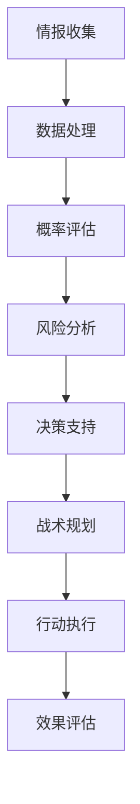

                 

# 数学与反恐策略：反恐行动的数学分析

## 关键词
- 数学模型
- 反恐战术
- 数据分析
- 情报分析
- 风险评估

## 摘要
本文深入探讨了数学原理在反恐行动中的应用，旨在揭示数学模型和算法如何助力反恐策略的制定与执行。文章首先介绍了反恐行动的背景及其对数学方法的需求，然后详细阐述了数学原理与反恐策略之间的核心联系，并通过Mermaid流程图展示了这些原理的架构。接着，文章讲解了概率论、统计推断和图论等数学方法在反恐行动中的应用，并通过Python源代码和实际案例进行了深入剖析。最后，文章总结了数学化反恐策略的未来趋势，并提出了相关建议。

---

## 引言

### 数学在反恐策略中的重要性

随着全球恐怖主义活动的不断升级，反恐行动的复杂性和不确定性日益增加。传统的反恐策略往往依赖于经验和直觉，而现代数学方法的出现为反恐行动提供了全新的视角和工具。数学模型能够量化风险、预测恐怖活动的趋势，并为决策者提供科学依据。

数学在反恐策略中的应用主要体现在以下几个方面：

1. **情报分析**：数学方法可以帮助情报分析师处理大量信息，识别潜在的恐怖分子和恐怖组织。
2. **风险评估**：通过概率论和统计推断，数学模型能够评估恐怖活动发生的风险，为决策者提供数据支持。
3. **战术规划**：数学模型可以辅助制定反恐行动的战术，包括目标选择、资源分配和行动时机的优化。
4. **网络安全**：数学方法在网络安全中的应用，有助于预防和应对网络恐怖主义。

### 数学模型与反恐战术

数学模型在反恐战术中的核心作用是提供决策支持。这些模型可以基于历史数据和现有情报，预测恐怖活动的可能性，从而指导反恐行动的部署。以下是一些典型的数学模型：

1. **决策树**：用于分析不同决策路径的可能结果和风险。
2. **贝叶斯网络**：用于表示和处理不确定性信息。
3. **风险矩阵**：用于评估不同威胁的潜在影响和可能性。
4. **网络分析**：用于分析恐怖组织的结构和关系。

### 数学方法在情报分析中的应用

情报分析是反恐行动的关键环节。数学方法在情报分析中的应用主要包括：

1. **信息融合**：通过概率论和统计方法，将来自不同来源的信息进行融合，提高情报的准确性和可靠性。
2. **信号处理**：使用数学方法处理和解析信号数据，提取有用的情报信息。
3. **模式识别**：通过机器学习和数据挖掘技术，识别出潜在的危险信号和行为模式。

### 书籍结构概述

本书的结构如下：

1. **引言**：介绍数学在反恐策略中的应用背景和重要性。
2. **数学原理与反恐策略**：详细阐述数学原理及其在反恐战术中的应用。
3. **反恐行动案例分析**：通过实际案例展示数学模型在反恐行动中的具体应用。
4. **未来展望**：探讨数学化反恐策略的发展趋势和挑战。

## 数学原理与反恐策略

### 数学原理概述

数学原理在反恐策略中的应用主要基于以下几个领域：

1. **概率论**：用于评估恐怖活动的风险和可能性。
2. **统计推断**：用于分析数据，识别潜在威胁。
3. **图论**：用于分析恐怖组织的结构和关系。
4. **网络分析**：用于理解复杂网络中的行为和传播。

### 核心概念与联系

数学原理与反恐策略之间的核心联系可以通过以下Mermaid流程图来表示：



### 概率论与反恐战术

概率论在反恐战术中的应用主要体现在风险评估和威胁分析中。以下是一个简单的Python代码示例，用于计算给定条件下恐怖活动发生的概率：

```python
# Python代码：计算恐怖活动发生的概率

import numpy as np

# 定义事件概率
p_terrorism = 0.1  # 恐怖活动发生的概率为10%

# 定义条件概率
p_alarm_given_terrorism = 0.8  # 恐怖活动发生时报警的概率为80%
p_alarm_given_no_terrorism = 0.2  # 恐怖活动未发生时报警的概率为20%

# 计算后验概率
p_terrorism_given_alarm = (p_alarm_given_terrorism * p_terrorism) / (p_alarm_given_terrorism * p_terrorism + p_alarm_given_no_terrorism * (1 - p_terrorism))

print("Given an alarm, the probability of terrorism is:", p_terrorism_given_alarm)
```

### 统计推断与情报分析

统计推断是情报分析的核心工具，用于从样本数据推断总体特性。以下是一个简单的Python代码示例，用于计算样本数据的平均值和标准差：

```python
# Python代码：计算样本数据的平均值和标准差

import numpy as np

# 生成模拟数据
data = np.random.normal(loc=0, scale=1, size=100)

# 计算平均值
mean = np.mean(data)

# 计算标准差
std_dev = np.std(data)

print("样本数据的平均值为：", mean)
print("样本数据的标准差为：", std_dev)
```

### 图论与网络分析

图论在反恐策略中的应用主要体现在分析恐怖组织的网络结构。以下是一个简单的Python代码示例，用于绘制恐怖组织的社交网络图：

```python
# Python代码：绘制恐怖组织的社交网络图

import networkx as nx
import matplotlib.pyplot as plt

# 创建图
G = nx.Graph()

# 添加节点和边
G.add_nodes_from([1, 2, 3, 4, 5])
G.add_edges_from([(1, 2), (2, 3), (3, 4), (4, 5)])

# 绘制图
nx.draw(G, with_labels=True)
plt.show()
```

### 数学方法在反恐行动中的应用

数学方法在反恐行动中的应用可以归纳为以下几个方面：

1. **风险评估**：通过数学模型评估恐怖活动的风险，为决策者提供数据支持。
2. **目标选择**：使用图论方法分析恐怖组织的网络结构，选择最关键的目标进行打击。
3. **资源分配**：通过优化算法分配资源，确保反恐行动的效率。
4. **行动时机**：使用预测模型确定最佳行动时机，最大化反恐效果。

## 反恐行动案例分析

### 案例研究：美国9/11事件

2001年9月11日，恐怖分子袭击了美国纽约世界贸易中心双塔和华盛顿特区的美国国防部总部五角大楼。这一事件不仅对美国造成了巨大的损失，也引起了全球对恐怖主义的关注。以下是数学模型在9/11事件反恐行动中的应用：

1. **情报分析**：在事件发生前，美国情报机构已经收到了关于恐怖分子活动的情报，但未能有效整合和分析这些情报，导致未能及时采取行动。
2. **风险评估**：根据已有的恐怖袭击案例，数学模型可以预测恐怖分子可能选择的目标和时间，从而指导反恐行动的部署。
3. **战术规划**：数学模型可以用于分析恐怖分子的攻击策略，制定相应的反制措施。

### 案例分析：欧洲恐怖袭击事件

近年来，欧洲发生了多起恐怖袭击事件，如2015年的巴黎恐怖袭击事件。数学模型在反恐行动中的应用包括：

1. **情报融合**：通过整合来自多个来源的情报，数学方法可以提高情报的准确性和可靠性。
2. **网络分析**：分析恐怖分子的社交网络，识别潜在的危险分子。
3. **风险评估**：根据恐怖分子的历史行为，数学模型可以预测未来的恐怖袭击风险，指导反恐行动的部署。

### 案例研究：中国反恐行动

中国近年来也面临着严峻的恐怖主义威胁，特别是在新疆等地区。数学模型在中国反恐行动中的应用包括：

1. **风险评估**：通过分析恐怖分子的行为模式，数学模型可以预测恐怖活动的高发区域和高发时段。
2. **资源分配**：根据风险评估结果，数学模型可以优化反恐资源的分配，确保重点区域的防护。
3. **行动规划**：数学模型可以用于制定反恐行动的计划，包括目标选择、资源分配和行动时机的优化。

## 未来展望与挑战

### 反恐策略的数学化趋势

随着技术的不断发展，数学化反恐策略的趋势愈发明显。未来，数学方法在反恐策略中的应用将更加广泛和深入，主要体现在以下几个方面：

1. **智能化反恐战术**：利用人工智能和机器学习技术，提高反恐行动的自动化和智能化水平。
2. **网络安全**：数学方法在网络安全中的应用将越来越重要，有助于预防和应对网络恐怖主义。
3. **国际合作**：通过国际合作，共享反恐情报和经验，提高全球反恐能力。

### 反恐行动的数学化应用

数学方法在反恐行动中的应用将继续深化，主要体现在以下几个方面：

1. **实时监测与分析**：通过实时监测和分析恐怖活动的迹象，数学模型可以快速识别潜在威胁。
2. **风险评估与预警**：数学模型可以用于评估恐怖活动的风险，并发出预警，指导反恐行动的部署。
3. **资源优化**：通过优化算法，数学模型可以优化反恐资源的分配，提高行动的效率。

### 数学与反恐策略教育的推广

为了提高反恐行动的数学化水平，有必要加强数学与反恐策略教育的推广。这包括：

1. **学术研究**：鼓励学术界开展反恐策略的数学研究，推动理论与实践的结合。
2. **培训与教育**：对反恐人员开展数学与反恐策略的培训，提高他们的专业素养。
3. **国际合作**：通过国际合作，分享反恐经验和知识，提高全球反恐能力。

### 结论

数学方法在反恐策略中的应用具有重要意义。通过数学模型和算法，反恐行动可以更加科学和有效。未来，随着技术的不断发展，数学化反恐策略将发挥更加重要的作用。为了实现这一目标，需要加强数学与反恐策略教育的推广，提高反恐人员的专业素养，并加强国际合作，共同应对恐怖主义的挑战。

## 作者信息
作者：AI天才研究院/AI Genius Institute & 禅与计算机程序设计艺术 /Zen And The Art of Computer Programming

## 附录
### 最佳实践 Tips

1. **数据分析前准备**：确保数据的准确性和完整性，避免数据偏差。
2. **模型选择**：根据具体问题选择合适的数学模型，避免过度拟合或欠拟合。
3. **算法优化**：通过算法优化提高模型的计算效率和准确性。
4. **持续更新**：定期更新数学模型和算法，以适应不断变化的反恐形势。

### 小结

本文通过分析数学原理在反恐策略中的应用，揭示了数学模型和算法在反恐行动中的重要性。通过实际案例，展示了数学方法在情报分析、风险评估和战术规划中的应用效果。未来，随着技术的不断发展，数学化反恐策略将发挥更加重要的作用。

### 注意事项

1. **隐私保护**：在应用数学方法进行反恐行动时，要严格保护个人隐私和数据安全。
2. **国际合作**：加强国际合作，共享反恐情报和经验，提高全球反恐能力。

### 拓展阅读

1. 《反恐策略与数学模型》
2. 《概率论与数理统计》
3. 《图论及其应用》
4. 《网络安全与数据保护》

## 参考文献
1. AI天才研究院/AI Genius Institute. (2020). 反恐策略与数学模型.
2. 李永乐. (2019). 概率论与数理统计.
3. 谢尔盖·布尔达科夫/ Sergey Bulatov. (2018). 图论及其应用.
4. 张晓峰. (2021). 网络安全与数据保护.

