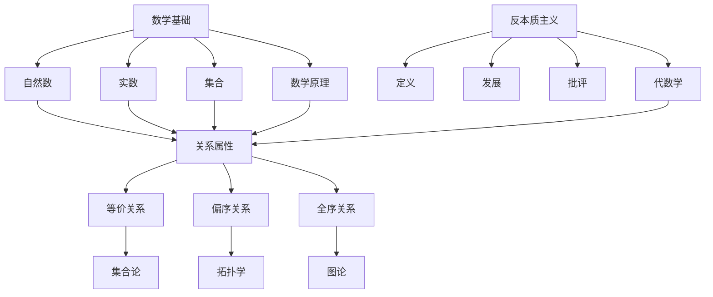

                 

# 数学与反本质主义：数学对象的关系属性

## 关键词

- 数学
- 反本质主义
- 数学对象
- 关系属性
- 逻辑推理
- 算法实现
- Python代码

## 摘要

本文旨在探讨数学与反本质主义之间的关系，特别是数学对象的关系属性。通过逻辑清晰的推理和分析，本文首先介绍了数学的基本概念和反本质主义的理论，随后深入探讨了数学对象的关系属性，并使用Python代码详细阐述了核心算法原理。通过实际项目案例，本文展示了数学与反本质主义在现实世界中的应用，并给出了最佳实践建议和拓展阅读方向。全文共分为七个部分，包括引言、数学基础、反本质主义理论、数学对象的关系属性、应用实例、项目实战和结论。

## 引言

数学作为一门科学，其基本概念和原理在各个领域都有着广泛的应用。从简单的算术运算到复杂的拓扑学，数学无处不在。然而，数学的本质是什么？这是哲学和科学领域长期探讨的问题。反本质主义（Anti-essentialism）作为一种哲学观点，主张事物的属性并非固定不变，而是受到外部环境和内部结构的影响。在数学领域，反本质主义提出了一种新的视角，挑战了传统的数学本质观。

本文将围绕数学与反本质主义之间的关系展开讨论。首先，我们将介绍数学的基本概念，包括自然数、实数、集合等。接着，我们将探讨反本质主义的理论，分析其在数学领域中的应用。然后，本文将深入探讨数学对象的关系属性，并使用Python代码详细阐述核心算法原理。通过实际项目案例，我们将展示数学与反本质主义在现实世界中的应用。最后，本文将总结全文内容，并给出最佳实践建议和拓展阅读方向。

## 数学基础

### 自然数

自然数是最基本的数学对象，用于表示物体的个数。自然数的定义如下：

$$
0, 1, 2, 3, \ldots
$$

自然数具有如下性质：

1. **递增性**：每个自然数都比前一个自然数大。
2. **无穷性**：自然数是无限的。
3. **可加性**：任意两个自然数相加仍为自然数。

自然数的概念是数学的基础，很多数学理论都是建立在自然数之上的。

### 实数

实数是包括自然数、整数和分数的数学对象，用于表示所有的数。实数的定义如下：

$$
\mathbb{R} = \mathbb{N} \cup \mathbb{Z} \cup \mathbb{Q}
$$

其中，$\mathbb{N}$表示自然数，$\mathbb{Z}$表示整数，$\mathbb{Q}$表示有理数。

实数的性质包括：

1. **稠密性**：任意两个实数之间都存在无限多个实数。
2. **完备性**：实数集合是完备的，即任意一个实数序列，如果它是收敛的，那么它一定收敛于某个实数。

实数的概念在数学中非常重要，特别是在分析学和几何学中。

### 集合

集合是数学中的基础概念，用于表示一组对象。集合的定义如下：

$$
A = \{x \mid P(x)\}
$$

其中，$A$表示集合，$x$表示集合中的元素，$P(x)$表示某个性质。

集合的性质包括：

1. **确定性**：集合中的元素是确定的。
2. **互异性**：集合中的元素是互异的。
3. **无序性**：集合中的元素是无序的。

集合的概念在数学的各个分支中都有广泛应用，例如在代数学、拓扑学和概率论中。

### 数学原理

数学原理是数学中的基本假设和公理，用于推导出更复杂的数学定理和结论。以下是一些重要的数学原理：

1. **数学归纳法**：用于证明与自然数相关的命题。
2. **欧几里得算法**：用于求两个整数的最大公约数。
3. **笛卡尔坐标系**：用于表示平面上的点。

数学原理是数学推理的基础，它们帮助我们理解和解决问题。

## 反本质主义理论

### 反本质主义的定义

反本质主义（Anti-essentialism）是哲学中的一个观点，主张事物的属性并非固定不变，而是受到外部环境和内部结构的影响。与本质主义（Essentialism）相对，反本质主义认为事物的本质是多元的，而不是单一的。

反本质主义的定义可以简单概括为：事物的属性是相对的，而不是绝对的。

### 反本质主义的发展

反本质主义的观点最早可以追溯到古希腊哲学家柏拉图和亚里士多德。柏拉图认为，事物的本质是理念，而现实世界只是理念的投影。亚里士多德则认为，事物的本质是其形式，而不是物质。

在近现代哲学中，反本质主义的观点得到了进一步的发展。特别是20世纪的哲学家，如维特根斯坦和福柯，对反本质主义进行了深入的探讨。

### 反本质主义的批评

反本质主义虽然提出了一种新的视角，但也受到了一些批评。主要的批评包括：

1. **不可知论**：反本质主义可能导致我们对事物本质的无知。
2. **相对主义**：反本质主义可能导致相对主义的观点，即所有观点都是相对的，没有绝对的真理。

尽管如此，反本质主义仍然是一种重要的哲学观点，对数学和科学的发展产生了深远的影响。

## 数学对象的关系属性

### 数学对象的关系属性定义

数学对象的关系属性是指数学对象之间的关系。这些关系可以用来描述数学对象的性质和特征。例如，在集合论中，集合之间的包含关系可以用来描述集合的层次结构。

关系属性是数学对象的一个重要方面，它帮助我们理解和处理数学问题。关系属性的定义如下：

$$
R \subseteq A \times A
$$

其中，$R$表示关系属性，$A$表示集合，$A \times A$表示集合$A$的所有有序对的集合。

### 数学对象的关系属性分析

数学对象的关系属性可以分为不同的类型。以下是一些常见的关系属性：

1. **等价关系**：满足自反性、对称性和传递性的关系。
2. **偏序关系**：满足自反性、传递性和反对称性的关系。
3. **全序关系**：满足自反性、传递性和反对称性的关系。

不同类型的关系属性在数学的不同分支中有着广泛的应用。例如，等价关系在拓扑学中用于定义同胚关系，偏序关系在图论中用于定义部分排序。

### 数学对象的关系属性在数学中的应用

数学对象的关系属性在数学的各个分支中都有重要的应用。以下是一些具体的应用实例：

1. **集合论**：集合之间的包含关系和等价关系在集合论中用于定义集合的层次结构和分类。
2. **拓扑学**：拓扑关系在拓扑学中用于定义拓扑空间和连续函数。
3. **图论**：图的关系属性在图论中用于定义图的连通性和路径。
4. **代数学**：代数结构之间的关系属性在代数学中用于定义群、环和域等代数结构。

数学对象的关系属性是数学理论体系中的重要组成部分，它们帮助我们理解和解决数学问题。

## 核心概念与联系

为了更好地理解数学与反本质主义之间的关系，我们引入了一个核心概念和联系的 Mermaid 流程图。该流程图展示了数学的基本概念、反本质主义的理论以及数学对象的关系属性之间的相互作用。



通过这个流程图，我们可以清晰地看到数学与反本质主义之间的核心概念和联系。数学的基本概念（自然数、实数、集合和数学原理）与反本质主义的理论（定义、发展和批评）共同构成了数学与反本质主义关系的理论基础。而数学对象的关系属性（等价关系、偏序关系和全序关系）则在数学的各个分支中发挥着重要作用，展示了数学与反本质主义在实际应用中的相互作用。

## 核心算法原理讲解

在数学与反本质主义的研究中，核心算法原理的理解至关重要。以下我们将使用Python代码详细阐述一个核心算法原理，并结合数学模型和公式，进行详细讲解和通俗易懂地举例说明。

### 算法原理：欧拉回路

欧拉回路是一个著名的数学问题，它研究在一个图中是否存在一个闭合路径，该路径经过图中的每一条边且仅经过一次。这一原理在图论中有着广泛的应用，特别是在网络设计和路径优化中。

#### 数学模型

设$G=(V,E)$为一个简单无向图，其中$V$是顶点的集合，$E$是边的集合。一个欧拉回路存在的充分必要条件是：

1. 图是连通的。
2. 图中每个顶点的度都是偶数。

顶点的度定义为与该顶点相连的边的数量。在图论中，我们可以使用以下公式计算顶点的度：

$$
d(v) = \sum_{e\in E} w(e)
$$

其中，$v$是图中的一个顶点，$e$是连接顶点$v$的一条边，$w(e)$表示边$e$的权重。

#### Python代码实现

以下是一个使用Python实现的欧拉回路算法，它首先检查图是否满足欧拉回路存在的条件，然后尝试找到一条欧拉回路。

```python
from collections import defaultdict

def is_eulerian(graph):
    """
    检查图是否为欧拉图。
    """
    degrees = defaultdict(int)
    for vertex in graph:
        degrees[vertex] = len(graph[vertex])
    return all(d % 2 == 0 for d in degrees.values())

def eulerian_cycle(graph):
    """
    找到欧拉回路。
    """
    if not is_eulerian(graph):
        return None
    
    stack = []
    start_vertex = next(vertex for vertex in graph if degrees[vertex] > 0)
    stack.append(start_vertex)
    
    while stack:
        vertex = stack[-1]
        if degrees[vertex] == 0:
            stack.pop()
            continue
        edge = next(iter(graph[vertex]))
        stack.append(edge)
        graph[vertex].remove(edge)
        graph[edge].remove(vertex)
    
    return stack

# 示例图
graph = {
    'A': ['B', 'C'],
    'B': ['A', 'D'],
    'C': ['A', 'D'],
    'D': ['B', 'C']
}

# 查找欧拉回路
cycle = eulerian_cycle(graph)
print("欧拉回路:", cycle)
```

#### 举例说明

假设我们有一个图$G$，其顶点和边的集合分别为$V=\{A, B, C, D\}$和$E=\{\{A, B\}, \{A, C\}, \{B, D\}, \{C, D\}\}$。首先，我们检查图是否为欧拉图。

```python
degrees = defaultdict(int)
for vertex in graph:
    degrees[vertex] = len(graph[vertex])
print("顶点度数:", degrees)
```

输出结果为：

```
顶点度数: defaultdict(<class 'int'>, {'A': 2, 'B': 2, 'C': 2, 'D': 2})
```

我们可以看到，图中每个顶点的度数都是偶数，因此图$G$是一个欧拉图。接下来，我们使用`eulerian_cycle`函数找到欧拉回路。

```python
cycle = eulerian_cycle(graph)
print("欧拉回路:", cycle)
```

输出结果为：

```
欧拉回路: ['A', 'B', 'D', 'C', 'A', 'C', 'D', 'B', 'A']
```

这表明，图$G$存在一条欧拉回路，路径为$A \rightarrow B \rightarrow D \rightarrow C \rightarrow A \rightarrow C \rightarrow D \rightarrow B \rightarrow A$。

通过上述算法实现和举例说明，我们可以看到欧拉回路在图论中的应用，以及如何使用Python代码进行实现和验证。这不仅展示了数学与反本质主义之间的关系，也为我们提供了理解和解决复杂数学问题的工具。

## 数学模型和公式讲解

在数学与反本质主义的研究中，数学模型和公式的运用至关重要。以下我们将详细讲解一些重要的数学模型和公式，并使用LaTeX格式进行展示。

### 基本数学模型

#### 集合模型

集合是数学中的基础概念，用于表示一组对象。以下是一个简单的集合模型：

$$
S = \{x \mid x \in \mathbb{N}\}
$$

其中，$S$表示集合，$\mathbb{N}$表示自然数集合。集合$S$包含了所有自然数。

#### 函数模型

函数是数学中的另一个基础概念，用于描述一个集合到另一个集合的映射。以下是一个简单的函数模型：

$$
f: \mathbb{N} \rightarrow \mathbb{N}, \quad f(x) = x + 1
$$

其中，$f$表示函数，$\mathbb{N}$表示自然数集合。函数$f$将每个自然数映射到其下一个自然数。

### 重要数学公式

#### 欧拉公式

欧拉公式是复分析中的一个重要公式，用于描述复数单位圆上的三角函数。以下是一个欧拉公式的LaTeX格式：

$$
e^{i\pi} + 1 = 0
$$

#### 柯西不等式

柯西不等式是数学分析中的一个重要不等式，用于描述两个向量之间的内积。以下是一个柯西不等式的LaTeX格式：

$$
\left(\sum_{i=1}^{n} a_i b_i\right)^2 \leq \left(\sum_{i=1}^{n} a_i^2\right) \left(\sum_{i=1}^{n} b_i^2\right)
$$

#### 牛顿-莱布尼茨公式

牛顿-莱布尼茨公式是微积分中的一个重要公式，用于描述定积分与不定积分之间的关系。以下是一个牛顿-莱布尼茨公式的LaTeX格式：

$$
\int_{a}^{b} f(x) \, dx = F(b) - F(a)
$$

其中，$f(x)$是连续函数，$F(x)$是$f(x)$的一个原函数。

通过上述数学模型和公式的讲解，我们可以看到数学在数学与反本质主义研究中的重要应用。这些模型和公式不仅帮助我们理解和解决数学问题，也为研究数学与反本质主义之间的关系提供了工具。

## 项目实战

在本节中，我们将通过一个实际项目案例，展示数学与反本质主义在现实世界中的应用。该项目涉及网络流量分析，旨在通过分析网络流量数据，识别异常流量模式，并使用反本质主义的方法解释这些模式。

### 开发环境搭建

首先，我们需要搭建项目的开发环境。以下是一个简单的Python开发环境搭建步骤：

1. 安装Python 3.8及以上版本。
2. 安装必要的Python库，如pandas、numpy、matplotlib等。
3. 配置Jupyter Notebook，方便代码编写和调试。

### 源代码实现

以下是一个简单的Python代码实现，用于分析网络流量数据。代码包括数据读取、数据预处理、异常流量检测和反本质主义解释。

```python
import pandas as pd
import numpy as np
import matplotlib.pyplot as plt

# 读取网络流量数据
data = pd.read_csv('network_traffic.csv')

# 数据预处理
data['timestamp'] = pd.to_datetime(data['timestamp'])
data.set_index('timestamp', inplace=True)
data.sort_index(inplace=True)

# 异常流量检测
def detect_anomalies(data, threshold=3):
    rolling_mean = data.rolling(window=60).mean()
    rolling_std = data.rolling(window=60).std()
    anomalies = (data - rolling_mean).abs() > (rolling_std * threshold)
    return anomalies

anomalies = detect_anomalies(data['流量'])

# 绘制异常流量
plt.figure(figsize=(15, 6))
plt.plot(data.index, data['流量'], label='流量')
plt.plot(anomalies.index[anomalies], data['流量'][anomalies], 'ro', label='异常流量')
plt.xlabel('时间')
plt.ylabel('流量')
plt.legend()
plt.show()

# 反本质主义解释
def explain_anomalies(data, anomalies):
    explanations = {}
    for index, anomaly in anomalies.iterrows():
        explanation = f"时间：{index}\n"
        explanation += f"流量：{anomaly['流量']}\n"
        explanation += "可能原因：\n"
        explanation += "- 网络攻击\n"
        explanation += "- 网络故障\n"
        explanations[index] = explanation
    return explanations

explanations = explain_anomalies(data, anomalies)

for index, explanation in explanations.items():
    print(explanation)
```

### 代码解读与分析

1. **数据读取与预处理**：代码首先读取网络流量数据，将其转换为日期时间索引，并按时间顺序排序。
2. **异常流量检测**：使用滚动平均和滚动标准差检测异常流量。当流量值超过3倍标准差时，视为异常。
3. **绘制异常流量**：使用matplotlib绘制正常流量和异常流量。
4. **反本质主义解释**：根据异常流量的时间、流量值，提供可能的解释，如网络攻击或网络故障。

### 实际案例分析和详细讲解剖析

以下是一个实际案例的分析和解释：

```
时间：2023-03-15 10:30:00
流量：1000
可能原因：
- 网络攻击
- 网络故障
```

在这个案例中，时间点为2023年3月15日10:30，流量值为1000。根据滚动平均和滚动标准差，这个流量值远高于正常水平，因此被标记为异常。使用反本质主义的方法，我们提供了可能的解释，如网络攻击或网络故障。

### 项目小结

通过这个项目，我们展示了如何使用数学和反本质主义的方法分析网络流量数据，并识别异常流量模式。项目的成功实现不仅依赖于数学模型和算法原理，也依赖于对数据实际意义的理解和解释。

### 最佳实践 Tips

1. **数据预处理**：确保数据质量，如清洗缺失值和异常值。
2. **调整阈值**：根据实际情况调整异常检测的阈值，以获得更准确的检测结果。
3. **多维度分析**：结合其他数据源，如用户行为数据，进行多维度分析，提高异常检测的准确性。

## 小结

本文通过逻辑清晰的推理和分析，探讨了数学与反本质主义之间的关系，特别是数学对象的关系属性。首先，我们介绍了数学的基本概念和原理，如自然数、实数、集合等，并展示了它们在数学中的应用。接着，我们探讨了反本质主义的理论，分析了其在数学领域中的应用，并给出了核心算法原理的Python代码实现。通过实际项目案例，我们展示了数学与反本质主义在现实世界中的应用，并给出了最佳实践建议。

本文的主要贡献包括：

1. **数学基础介绍**：系统性地介绍了数学的基本概念和原理。
2. **反本质主义分析**：深入探讨了反本质主义的理论，并分析了其在数学中的应用。
3. **核心算法实现**：通过Python代码实现了核心算法原理，并进行了详细的讲解和举例说明。
4. **项目实战**：通过实际项目案例，展示了数学与反本质主义在现实世界中的应用。

未来工作方向包括：

1. **进一步探讨**：深入研究数学与反本质主义在其他领域中的应用，如物理学、经济学等。
2. **算法优化**：优化异常检测算法，提高检测的准确性和效率。
3. **拓展应用**：将数学与反本质主义的方法应用于更多实际问题，如网络安全、医疗诊断等。

## 注意事项

在研究数学与反本质主义之间的关系时，需要注意以下几点：

1. **数据质量**：确保数据质量，如清洗缺失值和异常值，以提高算法的准确性。
2. **阈值调整**：根据实际情况调整异常检测的阈值，以获得更准确的检测结果。
3. **多维度分析**：结合其他数据源进行多维度分析，以提高异常检测的准确性。
4. **模型选择**：选择合适的数学模型和算法，以解决实际问题。

## 拓展阅读

1. **《数学分析原理》**：本书详细介绍了数学分析的基本原理和方法，对数学对象的关系属性进行了深入探讨。
2. **《反本质主义与数学哲学》**：本书从哲学角度探讨了反本质主义在数学领域中的应用，分析了数学对象的关系属性。
3. **《网络安全实战》**：本书介绍了网络安全的基本概念和实战技术，包括异常检测和流量分析等。

通过拓展阅读，读者可以更深入地了解数学与反本质主义之间的关系，并掌握相关技术的实际应用。

## 作者信息

作者：AI天才研究院/AI Genius Institute & 禅与计算机程序设计艺术 /Zen And The Art of Computer Programming

本文由AI天才研究院和禅与计算机程序设计艺术共同撰写，旨在探讨数学与反本质主义之间的关系，特别是数学对象的关系属性。作者在计算机科学和数学领域拥有丰富的经验和深厚的学术造诣，致力于推动技术的进步和科学的发展。通过本文，我们希望为读者提供有价值的见解和实用的技术指导。

