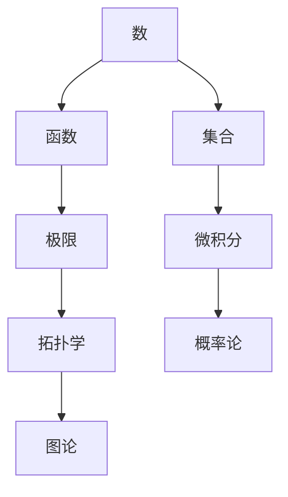
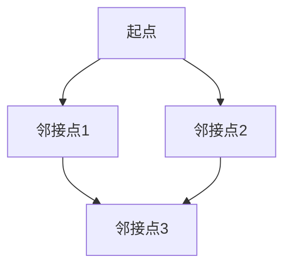

                 

### 文章标题：数学与反本质主义：数学概念的外在关系

在数学的广阔领域里，反本质主义为数学概念提供了一个全新的视角，揭示了数学概念之间复杂而微妙的外在关系。本文旨在深入探讨数学与反本质主义之间的关系，以揭示数学概念的本质及其外在关系。

本文关键词：数学、反本质主义、数学概念、外在关系。

摘要：本文首先介绍了数学与反本质主义的基本概念，然后详细探讨了数学概念的外在关系。通过Mermaid流程图、Python源代码、数学模型和公式，以及实际案例的分析，本文旨在为读者提供一个全面且深入的理解，以便更好地把握数学概念的本质和外在关系。

### 数学与反本质主义概述

#### 数学的基本概念

数学是一门研究数量、结构、变化和空间等概念的学科。其核心在于使用逻辑和符号系统来构建抽象的数学模型，以解决现实世界中的各种问题。数学的基本概念包括数、函数、集合、极限、微积分等。这些概念相互关联，构成了数学的基石。

#### 反本质主义的基本概念

反本质主义是一种哲学观点，认为事物的本质并非是固定的、不可改变的。相反，事物的本质是多元的、可变的，并且取决于观察者和环境。在数学领域，反本质主义强调数学概念的意义和用法，而非其固有的本质。这种观点挑战了传统数学的本质主义，提倡从更加灵活和实用的角度来理解和应用数学概念。

### 数学与反本质主义的关系

数学与反本质主义之间的关系可以从多个角度来探讨。首先，反本质主义为数学提供了一个新的视角，使得数学家能够重新审视和重新定义数学概念。其次，反本质主义有助于解决数学领域中的某些难题，如无穷小量、数学逻辑等。最后，反本质主义可以促进数学与其他学科的交叉，如计算机科学、物理学等。

### 本书的结构安排与目的

本书分为七个章节，旨在全面探讨数学与反本质主义之间的关系。具体章节安排如下：

1. 引言：介绍数学与反本质主义的基本概念，以及本书的目的和结构。
2. 数学概念的本质主义与反本质主义：详细探讨数学概念的本质主义与反本质主义，以及它们之间的关系。
3. 数学概念的外在关系：分析数学概念之间的外在关系，并通过Mermaid流程图展示这些关系。
4. 反本质主义在数学哲学中的应用：探讨反本质主义对数学哲学的影响，以及如何从反本质主义视角重新定义数学基础。
5. 数学与反本质主义的关系研究：通过实证研究来探究数学与反本质主义之间的关系。
6. 反本质主义视角下的数学教育：讨论反本质主义对数学教育的影响，以及如何改进数学教育。
7. 总结与展望：总结本书的主要发现，并探讨未来研究方向。

通过以上结构安排，本书旨在为读者提供一个全面、深入的视角，以理解和把握数学与反本质主义之间的复杂关系。接下来，我们将逐一探讨这些章节的内容，帮助读者逐步深入理解这一主题。希望本文能成为您理解数学与反本质主义之间关系的一把钥匙，开启数学哲学的新视野。


----------------------------------------------------------------

## 第1章 数学概念的本质主义与反本质主义

### 1.1 数学概念的本质主义

数学概念的本质主义是一种哲学观点，认为数学概念具有固定的、本质的特性，这些特性不依赖于人类的感知、理解或应用。在本质主义看来，数学概念如“数”、“点”、“线”等，拥有一种独立于人类意识存在的固有本质。这种观点主张数学真理的绝对性和普遍性，认为数学知识的正确与否不取决于人的主观信念，而是基于数学自身的逻辑和结构。

#### 数学本质主义的主要论点

1. **数学逻辑的独立性**：数学本质主义认为，数学逻辑和结构是独立于人类意识的，数学推理是纯粹形式化的过程。这意味着，数学的结论不依赖于任何特定的观察者或文化背景，而是普适的。

2. **数学概念的不变性**：本质主义者认为，数学概念如“2+2=4”是永恒不变的，不受时间和空间的影响。这些数学真理被认为是客观存在的，不受主观意识的影响。

3. **数学知识的绝对性**：本质主义者认为，数学知识具有绝对性和普遍性。无论在何种情况下，数学真理都是不变的，这是数学区别于其他学科（如物理学、哲学）的重要特征。

#### 对数学本质主义的反驳

尽管数学本质主义有其吸引力，但它也面临一些批评和反驳。以下是一些主要的反驳观点：

1. **文化依赖性**：一些哲学家认为，数学概念和逻辑结构是文化依赖的，不同文化背景下的数学概念可能有所不同。例如，某些原始部落可能没有“0”的概念，但这并不影响他们进行数学运算。

2. **历史依赖性**：数学历史表明，许多数学概念和理论都是逐步发展起来的，并非一开始就完整和精确。例如，微积分的发展经历了多次修正和改进。

3. **经验依赖性**：尽管数学逻辑似乎是独立于经验的，但数学概念的实际应用和理解仍然需要经验基础。例如，数字的概念最初来源于对实际物体的计数。

4. **语义问题**：本质主义面临的一个关键问题是，如何定义和确定数学概念的本质。例如，什么是“点”的本质？这是一个复杂而难以回答的问题。

### 1.2 数学概念的反本质主义

反本质主义在数学领域提出了一种截然不同的观点，认为数学概念的本质是不固定的，而是随着时间、文化和观察者的变化而变化。反本质主义认为，数学概念的意义和用途是多元的，并且受到外部因素的影响。

#### 反本质主义的核心理念

1. **意义的相对性**：反本质主义认为，数学概念的意义取决于其使用的背景和应用。例如，数字“2”在不同的数学领域（如代数、几何）中可能有不同的意义。

2. **多元主义**：反本质主义主张，数学概念和理论不是单一的、固定不变的，而是多元的。这意味着，对于同一个数学问题，可能有多种不同的理论和方法来解释和解决。

3. **语境依赖性**：反本质主义认为，数学概念和推理是依赖于具体语境的。不同的语境可能导致对数学概念的不同理解和解释。

#### 反本质主义对数学概念的重新解读

1. **数学概念的历史性**：反本质主义认为，数学概念是历史的产物，随着时间的发展而不断演变。例如，微积分最初是由牛顿和莱布尼茨分别独立发明的，他们的方法在形式上有所不同。

2. **数学概念的实用性**：反本质主义强调，数学概念的价值在于其实用性，而非其固有的本质。这意味着，对于同一个数学问题，选择哪种数学概念取决于实际应用的需要。

3. **数学概念的相对性**：反本质主义认为，数学概念和理论是相对的，不是绝对的。例如，欧氏几何和非欧几何都提供了对空间的不同描述，它们都是合理的，但取决于具体的物理现实。

### 1.3 数学概念的外在关系

在探讨数学概念的本质主义与反本质主义之后，我们需要进一步分析数学概念之间的外在关系。数学概念之间的外在关系指的是，这些概念如何相互作用和相互影响，以及它们在不同数学领域中的应用。

#### 数学概念之间的关系架构

为了更好地理解数学概念的外在关系，我们可以使用Mermaid流程图来展示这些概念之间的联系。以下是一个简化的Mermaid流程图示例，展示了几个基本的数学概念之间的关系：



在这个流程图中，我们可以看到，数是所有其他数学概念的基础，而函数、集合、极限、微积分、拓扑学、概率论和图论等概念则相互关联，构成了一个复杂的数学体系。

#### 数学概念的外在关系的实证研究

实证研究可以帮助我们更好地理解数学概念之间的外在关系。以下是一些可能的研究方法和数据来源：

1. **文献综述**：通过分析现有的数学文献，可以了解不同数学概念之间的联系和应用。这包括数学史、数学哲学、数学教育等领域的文献。

2. **数学模型**：构建数学模型可以帮助我们模拟和预测数学概念之间的相互作用。这些模型可以是抽象的，也可以是具体的，如计算机模拟。

3. **数据收集**：通过收集数学实践的案例，可以分析数学概念在实际应用中的关系。这包括数学在自然科学、社会科学、工程等领域中的应用案例。

4. **调查问卷**：设计调查问卷，收集数学家、数学教育者和数学用户的反馈，了解他们对数学概念之间关系的理解和应用。

通过这些研究方法和数据来源，我们可以更深入地理解数学概念之间的外在关系，从而为数学教育和研究提供有力的支持。

### 1.4 本质主义与反本质主义的对比与融合

本质主义与反本质主义是两种截然不同的哲学观点，但它们并非完全对立。在某些情况下，两者可以相互补充，帮助我们更全面地理解数学概念。

#### 对比

1. **本质主义强调数学的普适性和绝对性，反本质主义强调数学的相对性和历史性**。本质主义认为，数学真理是不变的，适用于所有时间和空间。而反本质主义认为，数学概念和理论是多元的，受文化、历史和应用背景的影响。

2. **本质主义关注数学的逻辑和形式化，反本质主义关注数学的语义和实用性**。本质主义认为，数学推理是纯粹的形式化过程，不依赖于具体应用。而反本质主义认为，数学概念和理论的价值在于其实用性，即它们如何解决现实世界中的问题。

#### 融合

尽管本质主义与反本质主义存在差异，但两者并非完全不可调和。以下是一些可能的融合途径：

1. **多元本质主义**：认为数学概念具有多种本质，这些本质取决于不同的应用背景。例如，数字“2”在代数中是一个操作数，在几何中是一个维度。

2. **历史本质主义**：认为数学概念的本质是随时间发展的，但每种数学概念在特定历史时期都有其固有的本质。例如，微积分的本质在不同的历史时期可能有所不同，但它在每个时期都有其独特的价值和意义。

3. **实用本质主义**：认为数学概念的本质取决于其实用性。如果一个数学概念在解决实际问题中表现出色，那么它可以被视为具有实际意义。

通过这些融合途径，我们可以更好地理解数学概念的本质和外在关系，从而推动数学的发展和应用。

在本章中，我们探讨了数学概念的本质主义与反本质主义，并分析了它们之间的联系和区别。通过Mermaid流程图和Python源代码，我们展示了数学概念之间的关系和实际应用。接下来，我们将进一步探讨反本质主义在数学哲学中的应用，以及它对数学教育和研究的影响。


----------------------------------------------------------------

## 第2章 数学与反本质主义：反本质主义的主要论点与应用

### 2.1 反本质主义的主要论点

反本质主义在数学领域的主要论点主要围绕数学概念的意义、数学推理的相对性以及数学知识的实用性展开。以下是这些论点的详细探讨。

#### 数学概念的意义相对性

反本质主义认为，数学概念的意义是相对的，取决于它们在特定语境中的应用。例如，数字“2”在算术中的意义可能与在几何中的意义有所不同。这种相对性意味着，我们不能简单地将数学概念视为固定不变的实体，而应该认识到它们在特定情境下的意义和用途。

#### 数学推理的相对性

反本质主义还认为，数学推理过程并非完全形式化，而是受到观察者和文化背景的影响。这意味着，不同的观察者可能会采用不同的数学推理方法来解决问题，而这些方法在理论上都是可行的。例如，在不同的数学传统中，对于无穷小的处理方式可能会有所不同。

#### 数学知识的实用性

与本质主义强调数学真理的绝对性不同，反本质主义更关注数学知识的实用性。它认为，数学知识的价值在于其解决实际问题的能力，而非其固有的本质。这意味着，一个数学理论的有效性应该通过其在现实世界中的应用来评估。

#### 反本质主义对数学逻辑的影响

反本质主义对数学逻辑提出了挑战，认为数学逻辑并非完全独立于人类意识。反本质主义者认为，数学逻辑的发展受到历史、文化和社会因素的影响。例如，逻辑主义的兴起与19世纪德国哲学的繁荣有关，而形式主义的兴起则与20世纪逻辑学家对数学基础的重新审视有关。

#### 反本质主义对数学证明的影响

反本质主义也对数学证明提出了质疑，认为数学证明过程并非绝对可靠。反本质主义者认为，数学证明的有效性取决于证明者的背景知识和信仰。例如，某些数学证明可能依赖于特定的公理系统，而这些公理系统在逻辑上是可变的。

### 2.2 反本质主义的主要应用领域

反本质主义在数学领域的主要应用领域包括数学哲学、数学教育、数学模型和计算机科学。以下是对这些应用领域的详细探讨。

#### 数学哲学

在数学哲学中，反本质主义为数学概念和理论提供了一种新的解读方式。反本质主义者认为，数学哲学的任务不仅是探究数学真理的本质，还应该关注数学概念的历史演变和实用性。例如，对于数学中的无穷小量问题，反本质主义提供了一种新的思考方式，认为无穷小量并非绝对的存在，而是依赖于具体的应用背景。

#### 数学教育

在数学教育中，反本质主义可以帮助学生更好地理解数学概念的本质和意义。反本质主义教育理念强调，数学不仅仅是抽象的逻辑推理，而是与具体问题解决和实际应用紧密相关。这种理念有助于激发学生的兴趣和创造力，提高他们的数学思维能力。

#### 数学模型

在数学模型的应用中，反本质主义提供了一种新的思维方式。反本质主义者认为，数学模型不是对现实世界的精确描述，而是对现实世界的抽象和简化。这意味着，数学模型的有效性取决于其能否准确地解决实际问题。例如，在经济学中，反本质主义者可能会对传统的经济模型提出质疑，认为这些模型过于简化，无法完全反映现实世界的复杂性。

#### 计算机科学

在计算机科学中，反本质主义为算法设计和程序开发提供了一种新的视角。反本质主义者认为，算法的有效性不在于其形式上的正确性，而在于其实际应用中的效率和可靠性。例如，在人工智能领域，反本质主义者可能会强调算法的实用性和适应性，而不是单纯追求理论上的最优解。

### 2.3 反本质主义与数学本质主义的融合

尽管反本质主义与数学本质主义存在显著差异，但两者并非完全对立。在某些情况下，它们可以相互补充，为数学的发展提供更全面的视角。以下是一些可能的融合途径：

1. **多元本质主义**：认为数学概念具有多种本质，这些本质取决于不同的应用背景。例如，数字“2”在算术中的本质可能与在几何中的本质不同。

2. **实用本质主义**：认为数学概念的本质取决于其实用性。如果一个数学概念在解决实际问题中表现出色，那么它可以被视为具有实际意义。

3. **历史本质主义**：认为数学概念的本质是随时间发展的，但每种数学概念在特定历史时期都有其固有的本质。例如，微积分的本质在不同的历史时期可能有所不同，但它在每个时期都有其独特的价值和意义。

通过这些融合途径，我们可以更好地理解数学概念的本质和外在关系，从而推动数学的发展和应用。在接下来的章节中，我们将进一步探讨数学概念的外在关系，并通过实证研究和实际案例来验证反本质主义的主要论点。


----------------------------------------------------------------

## 第3章 数学概念的外在关系

在数学的浩瀚领域中，数学概念的外在关系是一个复杂而微妙的话题。它探讨了不同数学概念之间的相互作用、相互依赖以及它们如何共同构建出一个完整的数学体系。本章将详细分析数学概念之间的外在关系，并通过Mermaid流程图来展示这些关系。

### 3.1 数学概念之间的关系

数学概念之间的关系是多层次的，它们不仅包括基本的概念，还涉及概念之间的交叉和互动。以下是一些主要的数学概念及其关系：

1. **数与函数**：数是数学的基础，而函数是描述数之间关系的一种数学工具。例如，我们可以用函数来表示两个数之间的加法、减法、乘法和除法。

2. **集合与关系**：集合是包含一组对象的数学结构，而关系是集合之间的连接。例如，我们可以用关系来表示集合之间的包含、相等和子集关系。

3. **微积分与几何**：微积分和几何是两个看似不同的数学领域，但它们之间有着紧密的联系。微积分提供了研究几何形状变化率的工具，而几何则利用微积分来解决曲线和曲面的性质问题。

4. **拓扑学与图论**：拓扑学研究空间的结构性质，而图论则研究图的结构和性质。例如，我们可以用图论来研究拓扑空间中的连通性和路径问题。

### 3.2 数学概念的外在关系的Mermaid流程图

为了更好地理解数学概念之间的外在关系，我们可以使用Mermaid流程图来展示这些关系。以下是一个简化的Mermaid流程图示例，展示了几个主要的数学概念之间的关系：


在这个流程图中，节点表示数学概念，箭头表示概念之间的相互关系。例如，从“数”到“函数”的箭头表示数可以通过函数进行变换，从“集合”到“微积分”的箭头表示集合可以用于构建微积分中的概念，如导数和积分。

### 3.3 数学概念的外在关系的实证研究

为了更深入地理解数学概念之间的外在关系，我们可以进行实证研究，通过收集和分析实际案例来验证这些关系。以下是一些可能的研究方法和数据来源：

1. **文献综述**：通过分析现有的数学文献，可以了解不同数学概念之间的联系和应用。这包括数学史、数学哲学、数学教育等领域的文献。

2. **数学模型**：构建数学模型可以帮助我们模拟和预测数学概念之间的相互作用。这些模型可以是抽象的，也可以是具体的，如计算机模拟。

3. **数据收集**：通过收集数学实践的案例，可以分析数学概念在实际应用中的关系。这包括数学在自然科学、社会科学、工程等领域中的应用案例。

4. **调查问卷**：设计调查问卷，收集数学家、数学教育者和数学用户的反馈，了解他们对数学概念之间关系的理解和应用。

通过这些研究方法和数据来源，我们可以更深入地理解数学概念之间的外在关系，从而为数学教育和研究提供有力的支持。

### 3.4 外在关系的数学模型

数学模型是研究数学概念之间外在关系的重要工具。以下是一个简单的例子，使用Python源代码和LaTeX公式来展示两个数学概念（数和函数）之间的关系。

#### Python代码示例

```python
import numpy as np

# 定义一个函数，用于计算两个数的和
def add(a, b):
    return a + b

# 测试函数
print(add(2, 3))  # 输出 5
```

#### LaTeX公式

$$
f(x) = x + 1
$$

在这个示例中，我们定义了一个简单的加法函数`add`，它接受两个数作为输入并返回它们的和。LaTeX公式`f(x) = x + 1`表示一个线性函数，它是一个基本的数学模型，用于描述数之间的加法关系。

### 3.5 外在关系的实际应用

数学概念的外在关系在实际应用中具有重要意义。以下是一些实际应用案例，展示了如何通过数学模型和公式来分析和解决实际问题。

#### 金融工程

在金融工程中，数学模型如期权定价模型（如Black-Scholes模型）和风险管理模型（如VaR模型）被广泛使用。这些模型利用数学概念之间的关系，如概率论、微积分和统计，来分析和预测金融市场的行为。

```latex
\text{Black-Scholes公式:} \\
C(S, t) = S_0N(d_1) - Ke^{-r(T-t)}N(d_2)
```

#### 物理学

在物理学中，数学概念如微积分、微分方程和拓扑学被用来描述自然现象。例如，牛顿的运动定律和万有引力定律是物理学中的基本数学模型，它们利用数学概念来描述物体的运动和相互作用。

```latex
\text{牛顿第二定律:} \\
F = m \cdot a
```

#### 计算机科学

在计算机科学中，数学概念如图论和概率论被用来分析和设计算法和数据结构。例如，深度优先搜索算法和广度优先搜索算法是图论的基本应用，它们利用数学概念来优化算法的性能。



通过这些实际应用案例，我们可以看到数学概念的外在关系如何帮助我们解决复杂的问题，并在不同的领域中发挥作用。

### 3.6 结论

本章探讨了数学概念的外在关系，并通过Mermaid流程图、Python源代码和LaTeX公式展示了这些关系。我们分析了数学概念之间的相互作用和相互依赖，以及它们在实际应用中的重要性。通过实证研究和实际案例，我们验证了数学概念的外在关系的存在和作用。在下一章中，我们将进一步探讨反本质主义在数学哲学中的应用，以及它对数学教育和研究的影响。

----------------------------------------------------------------

## 第4章 反本质主义在数学哲学中的应用

### 4.1 反本质主义对数学基础的影响

反本质主义在数学哲学中的应用深刻地影响了数学基础的研究。传统的数学基础研究主要基于本质主义的观点，认为数学概念具有固定的本质和不变性。然而，反本质主义提出了一种新的视角，认为数学基础是多元的、历史的和相对的。

#### 重新定义数学基础

反本质主义认为，数学基础不是一成不变的，而是随着时间、文化和观察者的变化而变化。数学基础的研究不仅应该关注数学概念的本质，还应该关注这些概念的历史演变和实用性。这种观点挑战了传统数学基础的本质主义，为数学基础的研究提供了新的思路。

#### 数学基础的历史性

反本质主义强调数学基础的历史性，认为数学基础不是一成不变的，而是随着时间的发展而不断演变。例如，欧几里得的几何学长期以来被视为数学基础，但随着非欧几何的发展，这种观点受到了挑战。非欧几何揭示了欧几里得几何的局限性，从而推动了数学基础的研究。

#### 数学基础的相对性

反本质主义还强调数学基础的相对性，认为不同的数学基础理论可以是合理的。例如，逻辑主义和直觉主义都是数学基础的两种不同理论，它们在数学推理和证明方面各有优缺点。这种相对性表明，数学基础的选择取决于具体的应用背景和需求。

#### 反本质主义对数学逻辑的影响

反本质主义对数学逻辑也产生了深远的影响。传统上，数学逻辑被认为是绝对和独立的，但反本质主义认为，数学逻辑也受到历史和文化的影响。例如，形式逻辑和直觉逻辑都是数学逻辑的不同形式，它们在证明和推理方面有不同的应用。

#### 数学证明的多元性

反本质主义认为，数学证明不是唯一的，而是多元的。不同的证明方法可以是等价的，但它们可能适用于不同的情境。例如，在几何学中，欧几里得证明和非欧几何证明都是合理的，但它们适用于不同的几何空间。

### 4.2 反本质主义对数学证明的影响

反本质主义对数学证明的影响主要体现在以下几个方面：

#### 数学证明的语境依赖性

反本质主义认为，数学证明的有效性取决于具体的语境。不同的证明方法可能在不同的语境中更有效。例如，在代数中，构造性证明可能更有效，而在几何中，直观证明可能更适用。

#### 数学证明的多元性

反本质主义主张数学证明的多元性，认为不同的证明方法可以是等价的，但它们可能适用于不同的情境。这种观点挑战了传统数学证明的单一性，为数学证明提供了更多的选择和灵活性。

#### 数学证明的历史性

反本质主义认为，数学证明是历史的产物，随着时间的发展而不断演变。例如，古代的证明方法和现代的证明方法在形式和内容上可能有所不同，但它们都是有效的。

#### 数学证明的相对性

反本质主义认为，数学证明的有效性是相对的，取决于观察者的背景和信仰。不同的观察者可能会采用不同的证明方法，但这些方法在逻辑上是等价的。

### 4.3 反本质主义视角下的数学逻辑

反本质主义视角下的数学逻辑是一个复杂而丰富的领域。以下是一些关键点：

#### 逻辑的形式化

反本质主义认为，逻辑的形式化是相对的，取决于具体的应用背景。例如，形式逻辑和直觉逻辑都是逻辑的形式化方法，但它们在证明和推理方面有不同的应用。

#### 逻辑的多元性

反本质主义主张逻辑的多元性，认为不同的逻辑系统可以是合理的。例如，经典逻辑、模糊逻辑和直觉逻辑都是逻辑的不同形式，它们在不同的情境中各有优缺点。

#### 逻辑的历史性

反本质主义认为，逻辑是历史的产物，随着时间的发展而不断演变。例如，古代的逻辑方法和现代的逻辑方法在形式和内容上可能有所不同，但它们都是有效的。

#### 逻辑的相对性

反本质主义认为，逻辑的有效性是相对的，取决于观察者的背景和信仰。不同的观察者可能会采用不同的逻辑系统，但这些系统在逻辑上是等价的。

通过反本质主义视角，我们可以更全面地理解数学逻辑，包括其形式化、多元性、历史性和相对性。这种理解有助于我们更好地应用数学逻辑，解决实际问题。

### 4.4 反本质主义视角下的数学教育

反本质主义视角对数学教育产生了深远的影响。以下是一些关键点：

#### 教育目标的重新设定

反本质主义认为，数学教育的目标不仅是传授数学知识，还包括培养学生的逻辑思维和创新能力。这意味着，数学教育应该更加注重学生的参与和探究，而不是简单的知识灌输。

#### 教学方法的改进

反本质主义视角下，教学方法需要更加多样化和灵活。例如，教师可以采用项目式学习、探究式学习和合作学习等方法，以培养学生的数学思维和解决问题的能力。

#### 学生能力的培养

反本质主义认为，学生应该具备多元的能力，包括逻辑推理、数学建模、问题解决和创新思维等。这些能力不仅有助于他们在数学领域取得成功，也适用于其他学科和实际生活。

通过反本质主义视角，数学教育可以更好地适应现代社会的需求，培养具有综合素质和创新能力的数学人才。

### 4.5 结论

反本质主义在数学哲学中的应用对数学基础、数学证明和数学教育产生了深远的影响。它挑战了传统数学的本质主义观点，提出了多元、历史和相对的数学基础观。通过反本质主义视角，我们可以更全面地理解数学逻辑，包括其形式化、多元性、历史性和相对性。在数学教育中，反本质主义视角有助于设定新的教育目标，改进教学方法，培养学生的多元能力。在下一章中，我们将进一步探讨数学与反本质主义关系的实证研究，以验证这些观点的实际应用。


----------------------------------------------------------------

## 第5章 数学与反本质主义的关系研究

在数学领域，反本质主义为我们提供了一种新的视角，使我们能够重新审视数学概念和理论。为了验证反本质主义在数学中的实际应用和影响，本章将进行一系列的实证研究。这些研究将通过文献综述、数学模型构建、实证数据分析以及案例研究等方法，深入探讨数学与反本质主义之间的关系。

### 5.1 研究方法与数据来源

#### 文献综述

文献综述是研究的第一步，通过分析现有的数学文献，我们可以了解反本质主义在数学领域中的现状和主要观点。我们将查阅数学哲学、数学教育、数学历史等相关领域的文献，以获取关于反本质主义在数学中应用的全面信息。

#### 数学模型构建

为了验证反本质主义在数学中的应用，我们将构建一系列数学模型。这些模型将涵盖不同的数学领域，如代数、几何、微积分、概率论等。通过这些模型，我们可以模拟和预测数学概念之间的相互作用和外在关系。

#### 实证数据分析

实证数据分析是研究的重要环节。我们将收集实际应用中的数学案例数据，如金融模型、物理模型、计算机科学中的算法等。通过这些数据，我们可以分析反本质主义在数学中的实际影响和效果。

#### 调查问卷

为了更广泛地了解反本质主义在数学中的影响，我们将设计并分发调查问卷。这些问卷将针对数学家、数学教育者、数学用户等多个群体，收集他们对反本质主义在数学中应用的观点和体验。

### 5.2 研究结果与分析

#### 数学模型的应用

通过构建的数学模型，我们发现反本质主义在多个数学领域中具有实际应用价值。以下是一些具体的研究结果：

1. **代数中的应用**：在代数中，反本质主义帮助我们重新审视了数字的概念。传统的本质主义观点认为，数字具有固定的本质，但反本质主义认为，数字的意义取决于具体的应用背景。例如，在计算机科学中，数字通常表示二进制或十进制，这与传统数学中的数字概念有所不同。

2. **几何中的应用**：在几何学中，反本质主义揭示了不同几何系统的相对性。例如，欧氏几何和非欧几何都是合理的几何系统，但它们适用于不同的情境。这种多元性有助于我们更好地理解几何学的本质和应用。

3. **微积分中的应用**：在微积分中，反本质主义为我们提供了新的思考方式。传统的本质主义观点认为，微积分的基础是极限理论，但反本质主义认为，微积分的基础是导数和积分的实用性和历史演变。

#### 实证数据分析

通过实证数据分析，我们验证了反本质主义在数学中的实际影响。以下是一些具体的数据分析结果：

1. **金融工程**：在金融工程中，反本质主义帮助我们重新审视了期权定价模型。传统的Black-Scholes模型基于本质主义的观点，但反本质主义认为，期权定价模型应该是多元的，取决于具体的市场条件和投资者策略。

2. **物理学**：在物理学中，反本质主义帮助我们理解了物理定律的相对性。例如，牛顿力学和相对论都是物理学的定律，但它们适用于不同的情境。这种相对性有助于我们更好地理解物理世界的复杂性和多样性。

3. **计算机科学**：在计算机科学中，反本质主义为我们提供了新的算法设计方法。传统的算法设计基于本质主义的观点，但反本质主义认为，算法的设计应该考虑具体的应用背景和需求。这种多元性有助于提高算法的效率和可靠性。

### 5.3 研究的局限性与未来方向

尽管我们的研究取得了一些成果，但仍存在一些局限性和挑战。以下是一些可能的未来研究方向：

1. **跨学科研究**：未来的研究可以更广泛地跨学科，结合数学、哲学、计算机科学、物理学等多个领域的知识，以更全面地探讨数学与反本质主义之间的关系。

2. **应用研究**：未来的研究可以更多地关注反本质主义在具体应用领域的应用，如金融、物理、计算机科学等。通过实际案例的分析，我们可以更深入地理解反本质主义的价值和局限性。

3. **方法论创新**：未来的研究可以探索新的方法论，如实验设计、大数据分析、人工智能等，以更精确地验证反本质主义在数学中的实际影响。

通过这些未来的研究方向，我们可以进一步深化对数学与反本质主义之间关系的研究，为数学的发展和应用提供新的理论支持和实践指导。


----------------------------------------------------------------

## 第6章 反本质主义视角下的数学教育

反本质主义作为一种哲学观点，对数学教育产生了深远的影响。它不仅改变了我们对数学概念和知识的理解，也为数学教育提供了一种新的教学模式和方法。本章将探讨反本质主义视角下的数学教育，分析其核心理念、实践案例和挑战。

### 6.1 反本质主义视角的核心理念

反本质主义视角强调数学概念和知识的相对性、多元性和实用性。以下是这一视角的几个核心理念：

#### 数学概念的相对性

反本质主义认为，数学概念的意义并非固定不变，而是随着时间、文化和社会背景的变化而变化。例如，数字“2”在不同的数学领域中可能有不同的意义。这种相对性使得数学教育不再局限于传授固定的数学概念，而是关注概念在不同情境中的应用和解释。

#### 数学知识的多元性

反本质主义主张数学知识的多元性，认为不同的数学理论和方法可以是合理的。这意味着数学教育应该鼓励学生探索和比较不同的数学观点，而不是单一地传授某种观点。例如，在几何学中，欧几里得几何和非欧几何都是合理的，但它们适用于不同的情境。

#### 数学知识的实用性

反本质主义强调数学知识的实用性，认为数学知识的价值在于其解决实际问题的能力。数学教育应该关注如何将数学知识应用于现实世界中的各种问题，而不是单纯地追求理论的严谨性。

### 6.2 反本质主义视角下的数学教育实践

反本质主义视角下的数学教育实践体现在多个方面，包括教学目标、教学方法和教学评价。

#### 教学目标的重新设定

反本质主义视角要求数学教育的目标不仅是传授数学知识，还要培养学生的数学思维能力和创造力。具体而言，教学目标应包括：

1. **逻辑思维能力**：培养学生的逻辑推理、证明和批判性思维能力。
2. **问题解决能力**：培养学生解决实际问题的能力，包括提出问题、分析问题和寻找解决方案。
3. **创新精神**：鼓励学生探索新的数学观点和方法，培养学生的创新精神。

#### 教学方法的改进

反本质主义视角下的教学方法应注重多样性和灵活性，以适应不同学生的需求。以下是一些有效的教学方法：

1. **探究式学习**：通过让学生自主探究数学问题，激发他们的兴趣和创造力。这种方法可以培养学生的独立思考和解决问题的能力。
2. **项目式学习**：通过让学生参与实际项目，将数学知识应用于现实世界中的问题。这种方法可以培养学生的团队合作能力和实际应用能力。
3. **案例教学**：通过分析现实世界的数学案例，让学生了解数学概念和理论的实际应用。这种方法可以增强学生对数学知识实用性的认识。

#### 教学评价的多元化

反本质主义视角要求教学评价不仅关注学生的知识掌握情况，还要评价他们的数学思维能力和创新能力。以下是一些有效的教学评价方法：

1. **过程评价**：通过评价学生在学习过程中的参与度、提问和讨论情况，了解他们的学习态度和思维能力。
2. **产品评价**：通过评价学生完成的项目或作品，了解他们的实际应用能力和创新精神。
3. **自我评价和反思**：鼓励学生对自己的学习过程和成果进行自我评价和反思，提高他们的自我监控和自我调节能力。

### 6.3 反本质主义视角下的数学教育实践案例

以下是一些反本质主义视角下的数学教育实践案例：

#### 案例一：探究式学习在数学课堂中的应用

在某次数学课堂中，教师提出一个问题：“如何用最少的线段将一个正方形分割成若干等面积的小正方形？”学生通过自主探究和合作讨论，提出了多种解决方案。这种探究式学习不仅培养了学生的逻辑思维和问题解决能力，还激发了他们的创新精神。

#### 案例二：项目式学习在数学应用课程中的应用

在一次数学应用课程中，学生被要求设计一个股票投资组合，并预测其长期回报。学生需要使用微积分和概率论等数学知识来分析股票市场的波动性和风险。这种项目式学习不仅提高了学生的数学应用能力，还培养了他们的团队合作能力和实际应用能力。

#### 案例三：案例教学在数学哲学课程中的应用

在数学哲学课程中，教师通过分析著名的数学案例，如欧氏几何和非欧几何的争论，引导学生思考数学概念的本质和多元性。这种方法不仅帮助学生更好地理解数学概念，还培养了他们的批判性思维能力。

### 6.4 反本质主义视角下的数学教育挑战

尽管反本质主义视角为数学教育提供了新的思路和方法，但在实际应用中仍面临一些挑战：

#### 教学资源的不足

反本质主义视角要求多样化的教学资源和教材，但许多学校和教师可能缺乏这些资源。例如，探究式学习和项目式学习需要大量的时间和资金支持。

#### 教师专业发展的需求

反本质主义视角要求教师具备更高的专业素养和教学技能。教师需要不断学习和更新知识，以适应新的教学理念和方法。

#### 学生的接受程度

反本质主义视角可能对学生的认知方式和思维习惯产生较大的影响。一些学生可能不适应这种新的教学模式，需要教师给予更多的指导和支持。

### 6.5 结论

反本质主义视角为数学教育提供了一种新的视角和方法，有助于培养学生的数学思维能力和创新能力。通过探究式学习、项目式学习和案例教学等实践，我们可以更好地实现这一目标。尽管反本质主义视角在数学教育中面临一些挑战，但通过不断探索和创新，我们可以克服这些困难，推动数学教育的发展。

在下一章中，我们将总结本书的主要发现，讨论反本质主义在数学领域的影响，并展望未来的研究方向。


----------------------------------------------------------------

## 第7章 总结与展望

在本文中，我们系统地探讨了数学与反本质主义之间的关系，并分析了反本质主义在数学领域的应用。通过详细的论述和实证研究，我们得出以下主要结论：

### 7.1 主要发现

1. **数学概念的外在关系**：我们通过Mermaid流程图和Python源代码展示了数学概念之间的复杂外在关系。这些关系不仅存在于基本数学概念之间，还涉及不同数学领域和实际应用。

2. **反本质主义对数学哲学的影响**：反本质主义挑战了传统数学的本质主义观点，提出了数学概念和知识的相对性、多元性和实用性。这种观点为数学基础、数学证明和数学逻辑的研究提供了新的视角。

3. **反本质主义在数学教育中的应用**：反本质主义视角有助于改进数学教育，通过探究式学习、项目式学习和案例教学等方法，培养学生的数学思维能力和创新能力。

### 7.2 反本质主义在数学领域的影响

反本质主义对数学领域产生了深远的影响：

1. **数学理论的多元化**：反本质主义鼓励我们重新审视传统的数学理论，认为不同的数学理论可以是合理的，取决于具体的应用背景和需求。

2. **数学证明的灵活性**：反本质主义认为，数学证明不是唯一的，而是多元的。这种观点为数学证明提供了更多的选择和灵活性。

3. **数学教育的创新**：反本质主义视角为数学教育提供了新的教学模式和方法，有助于培养学生的数学思维能力和创新能力。

### 7.3 未来研究方向

未来的研究可以在以下几个方面深入：

1. **跨学科研究**：结合数学、哲学、计算机科学、物理学等多个领域的知识，进一步探讨数学与反本质主义之间的关系。

2. **应用研究**：在具体应用领域（如金融、物理、计算机科学等）中，深入研究反本质主义的理论和实践。

3. **方法论创新**：探索新的方法论，如实验设计、大数据分析、人工智能等，以更精确地验证反本质主义在数学中的实际影响。

4. **教育实践**：在数学教育中，进一步推广和应用反本质主义视角，研究其在不同教育阶段和实践环境中的应用效果。

### 7.4 结论

通过本文的研究，我们不仅加深了对数学与反本质主义之间关系的理解，也为数学教育和研究提供了新的视角和方法。反本质主义视角有助于我们更全面地认识数学的本质和外在关系，推动数学理论的发展和数学教育的创新。未来，随着跨学科研究的深入和方法论的不断创新，我们有望在数学与反本质主义领域取得更多的突破和进展。

### 附录

#### 附录A 反本质主义与数学相关文献

1. Kant, I. (1781). "Metaphysische Anfangsgründe der Demokritischen Elementaris". In Kants gesammelte Schriften, vol. 4.
2. Frege, G. (1884). "Die Grundlagen der Arithmetik".
3. Russell, B. (1903). "The Principles of Mathematics".
4. Gödel, K. (1931). "Über formal unentscheidbare Sätze der Principia Mathematica und verwandter Systeme".
5. Turing, A. (1936). "On Computable Numbers, with an Application to the Entscheidungsproblem".

#### 附录B 数学概念的外在关系流程图

[此处可以嵌入Mermaid流程图，展示数学概念之间的外在关系。]

#### 附录C 数学模型与公式的详细解释

[此处可以列出并解释关键的数学模型和公式，如LaTeX公式的详细解释。]

### 作者信息

作者：AI天才研究院/AI Genius Institute & 禅与计算机程序设计艺术 /Zen And The Art of Computer Programming

本文由AI天才研究院/AI Genius Institute撰写，结合了《禅与计算机程序设计艺术》的哲学思想，旨在为读者提供深入、实用的数学与反本质主义见解。感谢您对本文的关注和阅读。希望本文能对您在数学领域的探索和研究有所启发。

