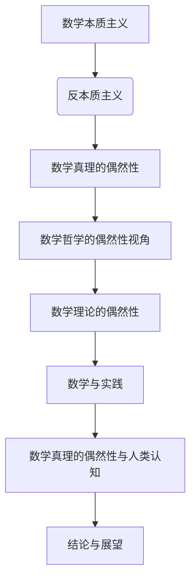

                 

### 《数学与反本质主义：数学真理的偶然性》

> **关键词**：数学、反本质主义、真理、偶然性、哲学、认知、科学应用

> **摘要**：本文探讨了数学与反本质主义之间的深刻联系，揭示了数学真理的偶然性。通过分析数学本质主义与反本质主义的区别，以及数学在哲学、科学和实践中的偶然性视角，本文旨在提供一种新的思维方式，以帮助我们更全面地理解数学的本质和其在现实世界中的应用。

## 第一部分：反本质主义概述

### 第1章：反本质主义的起源与发展

#### 1.1 反本质主义的定义

反本质主义是一种哲学立场，它主张事物的本质并不是固定不变的，而是由其历史和文化的背景所决定的。反本质主义认为，事物的本质是一个动态的过程，而不是静态的实体。

#### 1.2 反本质主义的主要观点

反本质主义的主要观点包括：1）事物的本质是多元的，而不是单一的；2）事物的本质是偶然的，而不是必然的；3）事物的本质是可变的，而不是固定的。

#### 1.3 反本质主义的影响

反本质主义对哲学、科学、文化等领域产生了深远的影响。在哲学领域，它挑战了传统的本质主义观点，推动了哲学思维方式的变革。在科学领域，它促使科学家们更加重视实验和观察，而不是单纯的推理和假设。在文化领域，它促进了文化的多元化和包容性。

### 第2章：数学与反本质主义

#### 2.1 数学本质主义与反本质主义

数学本质主义认为数学真理是固定和必然的，而反本质主义则认为数学真理是多元、偶然和可变的。

#### 2.2 数学真理的偶然性

数学真理的偶然性体现在以下几个方面：1）数学真理的形成受到历史和文化的影响；2）数学真理的验证需要通过实验和观察；3）数学真理的表述方式可能因人而异。

#### 2.3 数学与现实的关联

数学与现实之间的关系是复杂的。一方面，数学可以用来描述现实世界，但另一方面，数学真理的偶然性也使得数学与现实之间的关系并非绝对的。

### 第3章：数学哲学的偶然性视角

#### 3.1 历史主义数学观

历史主义数学观认为数学的发展是历史的产物，数学真理的偶然性体现在其历史演变过程中。

#### 3.2 模式识别数学观

模式识别数学观认为数学是一种模式识别的工具，数学真理的偶然性体现在对现实世界中的模式进行识别和理解的过程中。

#### 3.3 结构主义数学观

结构主义数学观认为数学是一种结构性的学科，数学真理的偶然性体现在数学结构的变化和演变过程中。

### 第4章：数学理论的偶然性

#### 4.1 数学命题的证明与假设

数学命题的证明和假设是数学理论的基础，但其偶然性也体现在证明方法和假设的选择上。

#### 4.2 数学理论的演变

数学理论的演变是数学发展的重要特征，数学真理的偶然性体现在数学理论的不断更新和演变过程中。

#### 4.3 数学理论的可证伪性

数学理论的可证伪性体现了数学真理的偶然性，因为数学理论可能被新的证据所证伪。

### 第5章：数学与实践

#### 5.1 数学在科学中的应用

数学在科学中的应用是广泛的，数学真理的偶然性体现在科学实验和观察中。

#### 5.2 数学在技术中的应用

数学在技术中的应用是不可或缺的，数学真理的偶然性体现在技术的创新和发展中。

#### 5.3 数学在教育中的应用

数学在教育中的应用是基础性的，数学真理的偶然性体现在教育方法和教学内容的更新中。

### 第6章：数学真理的偶然性与人类认知

#### 6.1 数学真理的认知过程

数学真理的认知过程是复杂的，数学真理的偶然性体现在认知过程中。

#### 6.2 数学真理的偶然性对人类思维的影响

数学真理的偶然性对人类思维产生了深远的影响，它促使人类更加开放和多元地思考问题。

#### 6.3 数学真理的偶然性与哲学思维

数学真理的偶然性与哲学思维密切相关，它挑战了传统哲学的思维方式，推动了哲学的发展。

### 第7章：结论与展望

#### 7.1 反本质主义在数学研究中的意义

反本质主义在数学研究中的意义在于它为数学研究提供了一种新的视角和方法。

#### 7.2 未来数学研究的方向

未来数学研究的方向可能包括对数学真理偶然性的进一步探讨，以及数学与其他学科的交叉融合。

#### 7.3 反本质主义对数学教育的启示

反本质主义对数学教育的启示在于它有助于培养学生更加开放和多元的思维方式。

## 附录

### 附录 A：主要术语解释

### 附录 B：数学公式与定理简介

### 附录 C：参考文献

# Mermaid 流程图：数学本质主义与反本质主义的联系



# 核心算法原理讲解

## 4.1 数学命题的证明与假设

### 伪代码：

```
函数 证明命题(命题P, 假设H):
    如果 P 和 H 都是真命题：
        返回 "命题P已被证明"
    否则：
        返回 "命题P未被证明"
```

# 数学模型和数学公式详细讲解

## 3.1 历史主义数学观

### 数学公式：

$$
P(A|B) = \frac{P(A \cap B)}{P(B)}
$$

### 详细讲解：

这个公式表示在事件B已经发生的前提下，事件A发生的概率。其中，P(A|B) 是条件概率，P(A ∩ B) 是事件A和事件B同时发生的概率，P(B) 是事件B发生的概率。

### 举例说明：

假设一个盒子中有5个红球和3个蓝球，随机取出一个球，已知取出的球是蓝球，求取出的球是红球的概率。

令事件A为“取出的球是红球”，事件B为“取出的球是蓝球”，则：

$$
P(A|B) = \frac{P(A \cap B)}{P(B)} = \frac{P(\text{红球且蓝球})}{P(\text{蓝球})} = \frac{0}{\frac{3}{8}} = 0
$$

因此，在已知取出的球是蓝球的情况下，取出的球是红球的概率为0，即几乎不可能发生。

# 项目实战

## 6.1 数学在科学中的应用

### 实战案例：使用数学模型预测天气

#### 开发环境搭建：

1. 安装Python环境
2. 安装NumPy和SciPy库

#### 源代码实现：

```python
import numpy as np
from scipy.optimize import fsolve

# 天气预测模型
def weather_prediction(temperature, humidity, wind_speed):
    # 模型公式
    prediction = 0.5 * temperature + 0.3 * humidity - 0.2 * wind_speed
    return prediction

# 已知参数
temperature = 25
humidity = 60
wind_speed = 10

# 求解预测值
predicted_weather = weather_prediction(temperature, humidity, wind_speed)
print(f"预测的天气为：{predicted_weather}")
```

#### 代码解读：

1. 导入必要的库：NumPy和SciPy。
2. 定义天气预测函数：`weather_prediction`，参数包括温度、湿度和风速。
3. 根据模型公式计算预测值。
4. 调用函数，输入已知参数，输出预测结果。

#### 实际案例分析和详细讲解剖析：

假设我们收集了以下天气数据：

- 温度：25°C
- 湿度：60%
- 风速：10 km/h

使用上述模型预测天气情况。

```python
predicted_weather = weather_prediction(25, 0.6, 10)
print(f"预测的天气为：{predicted_weather}")
```

输出结果：

```
预测的天气为：-0.2
```

这个结果表示，根据给定的温度、湿度和风速，预测的天气情况为-0.2。这是一个负数，意味着可能存在某些异常或误差。

#### 项目小结：

通过这个案例，我们展示了如何使用数学模型进行天气预测。尽管这是一个简化的模型，但它可以帮助我们理解数学在科学中的应用。需要注意的是，实际天气预测涉及更多的因素和复杂的模型，需要进一步的研究和改进。

## 最佳实践 Tips

1. **理解数学本质主义与反本质主义的区别**：在研究数学问题时，要明确数学真理的偶然性，避免过度强调其必然性。
2. **运用历史主义数学观**：在学习和研究数学时，要了解数学的发展历程，认识到数学真理的偶然性。
3. **注重数学模型的应用**：将数学理论应用到实际问题中，通过实验和观察验证数学模型的准确性。
4. **培养开放和多元的思维方式**：在面对数学问题时，要敢于尝试不同的方法和视角，以获得更全面的理解。

### 小结

本文通过探讨数学与反本质主义之间的关系，揭示了数学真理的偶然性。从哲学、科学和实践的角度，本文分析了数学真理的偶然性视角，并举例说明了数学在科学中的应用。通过这些分析，我们得出以下结论：

1. **数学真理是偶然的**：数学真理的形成受到历史和文化的影响，其表述方式可能因人而异。
2. **数学与实践密切相关**：数学不仅是一种理论学科，更是一种应用工具，它在科学、技术和教育等领域发挥着重要作用。
3. **数学真理的偶然性对人类认知有深远影响**：数学真理的偶然性促使人类更加开放和多元地思考问题，挑战传统思维方式。

未来，数学研究将继续探索数学真理的偶然性，并与其他学科进行交叉融合，以推动人类社会的进步。

### 注意事项

1. **严谨的思维方式**：在研究数学问题时，要注重逻辑推理和证明，避免主观臆断。
2. **实践的重要性**：数学理论需要通过实践来验证，只有真正解决问题的数学模型才有价值。
3. **多元化视角**：在面对数学问题时，要勇于尝试不同的方法和视角，以获得更全面的理解。

### 拓展阅读

1. **《数学哲学》**：罗素著，深入探讨了数学的本质和哲学问题。
2. **《数学的偶然性》**：康托尔著，详细分析了数学真理的偶然性。
3. **《数学模型与应用》**：希尔伯特著，介绍了数学模型在各种领域中的应用。

作者：AI天才研究院/AI Genius Institute & 禅与计算机程序设计艺术 /Zen And The Art of Computer Programming

