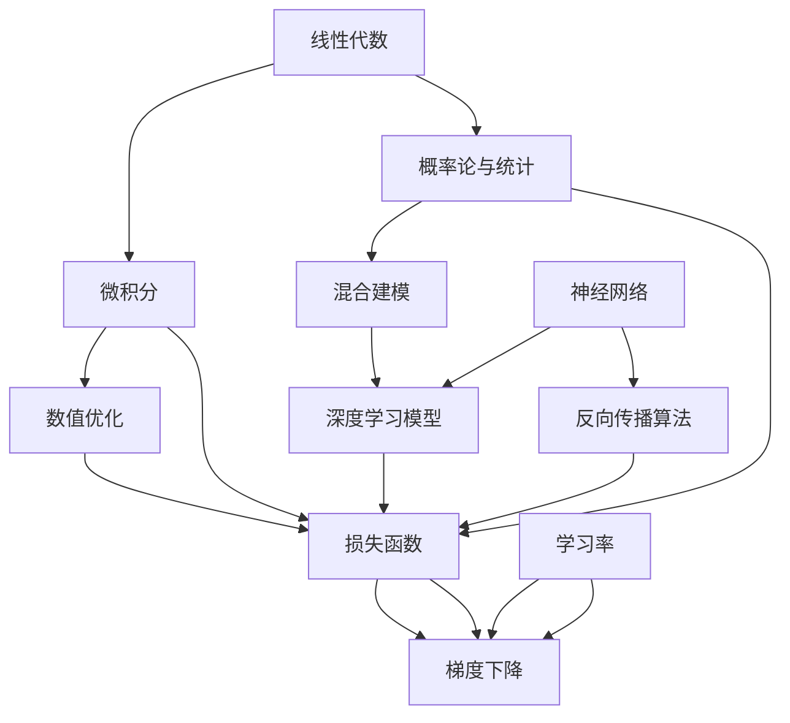

                 

# 数学与可解释AI：深度学习模型的数学解释

## 关键词

- 数学
- 深度学习
- 可解释AI
- 数学模型
- 神经网络
- 反向传播
- 循环神经网络
- 注意力机制
- Transformer模型

## 摘要

本文深入探讨了数学在深度学习领域的应用，特别是在构建和解释深度学习模型方面的数学原理。文章首先介绍了深度学习的基本数学概念，包括线性代数、微积分和概率论等，然后详细分析了神经网络、卷积神经网络、循环神经网络、注意力机制和Transformer模型的具体数学解释。文章通过Python代码和LaTeX公式，逐步讲解了核心算法原理，并提供了实际项目实战案例。最后，文章总结了最佳实践、注意事项，并推荐了拓展阅读资源，旨在为读者提供一个全面、系统的数学与可解释AI的学习路径。

## 引言

深度学习作为人工智能领域的重要分支，已经取得了许多令人瞩目的成果。然而，随着深度学习模型变得越来越复杂，一个重要的挑战也随之而来——如何解释这些模型的决策过程。传统的深度学习模型由于其高度的非线性结构和复杂的参数数量，往往难以解释其内在的决策机制。这不仅限制了其在某些领域的应用，如医疗诊断、金融风险评估等，也阻碍了对其理论基础的理解。

为了解决这一问题，可解释性AI（Explainable AI，XAI）应运而生。可解释性AI的目标是通过提供对模型决策过程的透明性，帮助用户理解和信任模型的决策过程。然而，要实现这一目标，不仅需要对深度学习模型的结构和工作原理有深刻的理解，还需要运用数学工具来准确地描述和解释这些模型。

本文将围绕数学与可解释AI的关系展开，首先介绍深度学习模型中的基本数学概念，如线性代数、微积分和概率论等。然后，我们将深入探讨神经网络、卷积神经网络、循环神经网络、注意力机制和Transformer模型的具体数学解释。通过Python代码和LaTeX公式，我们将逐步讲解核心算法原理，并结合实际项目实战案例，帮助读者更好地理解和应用这些数学工具。

文章的结构如下：

1. **数学基础**：介绍深度学习所需的数学基础，包括线性代数、微积分和概率论等。
2. **神经网络**：详细分析神经网络及其反向传播算法的数学原理。
3. **卷积神经网络**：探讨卷积神经网络及其相关操作的几何解释。
4. **循环神经网络**：讲解循环神经网络和长短时记忆模型的数学基础。
5. **注意力机制**：分析注意力机制及其在Transformer模型中的应用。
6. **Transformer模型**：深入探讨Transformer模型的数学原理和实现细节。
7. **项目实战**：通过一个具体项目，展示如何搭建开发环境、实现代码以及进行实际案例分析。
8. **最佳实践与总结**：总结文章要点，提供注意事项和拓展阅读资源。

## 数学基础

在深度学习中，数学是不可或缺的工具。它不仅用于构建和优化模型，还用于理解和解释模型的决策过程。以下是深度学习中最常用的数学基础：

### 线性代数

线性代数是深度学习中的核心工具，涉及向量、矩阵、行列式、矩阵分解等基本概念。以下是线性代数在深度学习中的应用：

- **向量与矩阵**：用于表示数据和模型参数。
- **矩阵乘法**：用于实现线性变换。
- **逆矩阵**：用于求解线性方程组。
- **特征值与特征向量**：用于降维和特征提取。

### 微积分

微积分在深度学习中的应用主要体现在两个方面：微分和积分。

- **微分**：用于计算函数的变化率，这在优化模型参数时至关重要。
  - **梯度**：函数在某一点的切线斜率，用于指导优化算法。
  - **偏导数**：函数对某一变量的变化率。
- **积分**：用于计算曲线下的面积，这在损失函数的计算和优化中经常用到。

### 概率论与统计

概率论与统计在深度学习中用于处理不确定性，并用于模型评估和决策。

- **概率分布**：用于描述数据的概率特性。
  - **正态分布**：在回归任务中用于预测。
  - **伯努利分布**：在分类任务中用于概率估计。
- **统计量**：用于评估模型的性能。
  - **均值**：数据的中心趋势。
  - **方差**：数据分布的离散程度。

### 数值优化

数值优化是深度学习模型训练中的关键步骤，用于寻找最优解。

- **梯度下降**：一种优化算法，通过迭代更新模型参数，以最小化损失函数。
- **动量**：用于加速梯度下降，防止收敛到局部最优。
- **学习率**：调节梯度下降的步长，以控制收敛速度。

### 混合建模

深度学习模型通常结合了多种数学工具，如神经网络的非线性特性与线性代数的矩阵操作，概率论与统计的模型评估等。

- **神经网络**：基于非线性函数的组合，用于建模复杂的非线性关系。
- **贝叶斯网络**：结合概率论和图论，用于建模不确定性关系。

通过以上数学工具，深度学习模型能够有效地处理复杂的数据，并在各种任务中取得优异的性能。然而，理解这些数学工具背后的原理对于深入探索深度学习模型，尤其是进行可解释AI的研究，至关重要。

### 核心概念与联系

为了更好地理解深度学习模型中的数学概念，我们需要将它们之间的关系架构化。以下是几个核心概念之间的联系，我们将使用Mermaid流程图来展示这些联系：



在这个流程图中，我们首先看到线性代数、微积分和概率论与统计是深度学习模型的基础工具。线性代数和微积分为模型的构建提供了必要的数学框架，而概率论与统计则用于处理数据的不确定性。这些基础工具结合后形成了混合建模，进一步应用于神经网络，并最终形成深度学习模型。

神经网络中的核心算法是反向传播算法，它依赖于微积分中的梯度计算。反向传播算法通过计算损失函数关于模型参数的梯度，以更新模型参数，从而达到优化模型的目的。在这个过程中，学习率起到了调节收敛速度的作用。

损失函数是深度学习模型评估的重要指标，它依赖于概率论与统计中的统计量和数值优化中的算法。通过梯度下降等数值优化方法，我们可以逐步优化模型参数，使其性能更接近期望值。

总的来说，这个Mermaid流程图清晰地展示了深度学习模型中各个核心概念之间的联系，有助于我们更好地理解和应用这些数学工具。

### 神经网络和反向传播算法

神经网络（Neural Networks）是深度学习的基础，其基本单元是人工神经元（artificial neuron）。这些神经元通过加权连接（weighted connections）形成一个复杂的网络结构，用于模拟生物神经系统的信息处理方式。神经网络的核心在于其能够通过学习大量数据来自动调整权重，以达到对数据的预测和分类。

#### 基本概念

一个简单的人工神经元可以表示为：

\[ z = \sum_{i=1}^{n} w_i x_i + b \]

其中，\( z \) 是神经元的输出，\( w_i \) 是连接权重，\( x_i \) 是输入值，\( b \) 是偏置项。权重和偏置项都是需要通过学习过程来调整的参数。

神经元的激活函数（activation function）用来引入非线性，常见的激活函数有：

- **Sigmoid函数**：
  \[ a = \frac{1}{1 + e^{-z}} \]
  Sigmoid函数将输出限制在 \( (0, 1) \) 区间内，常用于二分类问题。

- **ReLU函数**（Rectified Linear Unit）：
  \[ a = \max(0, z) \]
  ReLU函数在零点以上保持线性，在零点以下设为0，有助于加速学习过程。

- **Tanh函数**：
  \[ a = \frac{e^z - e^{-z}}{e^z + e^{-z}} \]
  Tanh函数将输出限制在 \( (-1, 1) \) 区间内。

#### 反向传播算法

反向传播算法（Backpropagation）是神经网络训练的核心算法。它的主要思想是通过计算损失函数关于网络参数的梯度，来更新网络权重和偏置项，从而最小化损失函数。

反向传播算法分为两个阶段：

1. **前向传播**：将输入数据通过神经网络进行前向传递，计算每个神经元的输出。

2. **后向传播**：计算损失函数关于网络参数的梯度，并根据这些梯度来更新参数。

以下是一个简单的反向传播算法的Python实现：

```python
import numpy as np

def sigmoid(z):
    return 1 / (1 + np.exp(-z))

def forward_propagation(x, weights, biases):
    a = x
    z = np.dot(weights, a) + biases
    a = sigmoid(z)
    return a, z

def backward_propagation(a, z, y, weights, learning_rate):
    delta = (y - a) * sigmoid_derivative(z)
    d_weights = np.dot(delta, a.T)
    d_biases = delta
    weights -= learning_rate * d_weights
    biases -= learning_rate * d_biases
    return weights, biases

def sigmoid_derivative(z):
    return sigmoid(z) * (1 - sigmoid(z))

# 示例
x = np.array([1, 0])
y = np.array([1])

weights = np.random.rand(1, 2)
biases = np.random.rand(1, 1)

a, z = forward_propagation(x, weights, biases)
weights, biases = backward_propagation(a, z, y, weights, 0.1)
```

在这个例子中，我们首先定义了sigmoid函数及其导数。然后，我们实现了前向传播和后向传播的函数。在主函数中，我们初始化了一些参数，并通过迭代进行参数更新，最终达到最小化损失函数的目的。

#### 数学解释

为了更好地理解反向传播算法，我们需要借助一些微积分知识。

- **梯度**：梯度是函数在某一点的切线斜率，用于描述函数在该点的局部变化情况。在反向传播中，梯度用于计算损失函数关于网络参数的变化率。

- **链式法则**：链式法则是微积分中的一个重要工具，用于计算复合函数的梯度。在反向传播算法中，链式法则用于计算输出层到隐藏层的梯度。

假设我们有一个三层神经网络，其中输出层为 \( y = f(g(h(x))) \)，其中 \( f \)、\( g \) 和 \( h \) 分别代表不同的函数。根据链式法则，输出层关于输入 \( x \) 的梯度可以表示为：

\[ \frac{dL}{dx} = \frac{dL}{df} \cdot \frac{df}{dg} \cdot \frac{dg}{dh} \cdot \frac{dh}{dx} \]

其中，\( L \) 是损失函数，\( f \)、\( g \) 和 \( h \) 分别代表输出层、隐藏层和输入层的激活函数。

- **偏导数**：偏导数用于计算函数对某一变量的变化率。在反向传播中，我们计算每个参数的偏导数，以确定如何更新这些参数。

例如，输出层关于权重 \( w \) 的偏导数可以表示为：

\[ \frac{dL}{dw} = \frac{dL}{df} \cdot \frac{df}{dg} \cdot \frac{dg}{dh} \cdot \frac{dh}{da} \cdot a \]

#### 举例说明

假设我们有一个简单的二分类问题，其中输入 \( x \) 为 \( [1, 0] \)，目标 \( y \) 为 \( [1] \)。我们的目标是训练一个神经网络来预测 \( y \)。

- **前向传播**：我们将输入 \( x \) 通过神经网络传递，计算每个神经元的输出。假设我们的神经网络有两个隐藏层，每层有3个神经元，权重和偏置随机初始化。

- **计算损失函数**：我们使用均方误差（Mean Squared Error，MSE）作为损失函数，计算预测值和实际值之间的差距。

- **后向传播**：我们计算损失函数关于每个参数的梯度，并根据这些梯度更新权重和偏置。这个过程通过迭代进行，直到损失函数值收敛到某个阈值。

通过这种方式，我们可以逐步优化神经网络的参数，使其能够更好地预测输出。

### 卷积神经网络和池化操作

卷积神经网络（Convolutional Neural Networks，CNN）是深度学习领域用于图像处理和其他二维数据任务的重要模型。与传统的全连接神经网络不同，CNN利用卷积运算来提取图像中的空间特征，并通过池化操作来减少数据的维度和计算量，从而提高模型的效率和准确性。

#### 卷积神经网络

卷积神经网络的核心组件是卷积层（Convolutional Layer），它通过卷积运算从输入数据中提取特征。卷积运算可以用以下数学公式表示：

\[ (f * g)(x) = \sum_{i=-\infty}^{\infty} \sum_{j=-\infty}^{\infty} f(i, j) \cdot g(x - i, y - j) \]

在深度学习中，我们通常使用离散的卷积运算，其公式为：

\[ (f * g)(x) = \sum_{i=0}^{n-1} \sum_{j=0}^{m-1} f(i, j) \cdot g(x - i, y - j) \]

其中，\( f \) 和 \( g \) 分别代表卷积核（filter）和输入数据，\( n \) 和 \( m \) 分别代表卷积核的大小。卷积运算将卷积核在输入数据上滑动，并计算卷积核与输入数据的点积，从而生成输出特征图。

卷积神经网络通常包括多个卷积层，每个卷积层后面可以跟随一个激活函数（如ReLU函数）和池化层（Pooling Layer）。通过这种方式，CNN可以逐层提取图像中的特征，从低级特征（如边缘和纹理）到高级特征（如形状和对象）。

#### 池化操作

池化操作（Pooling Operation）用于减少数据维度，同时保持重要的空间信息。常见的池化操作包括最大池化（Max Pooling）和平均池化（Average Pooling）。

- **最大池化**：在 \( k \times k \) 的窗口内，选择最大值作为输出。最大池化能够保留图像中的显著特征，但可能会丢失一些细节。

  数学公式为：
  \[ p_{ij} = \max_{(x, y) \in W} I(x, y) \]

  其中，\( p_{ij} \) 是输出特征图中的值，\( I(x, y) \) 是输入特征图中的值，\( W \) 是 \( k \times k \) 的窗口。

- **平均池化**：在 \( k \times k \) 的窗口内，计算平均值作为输出。平均池化可以更好地保持图像的细节，但可能会引入更多的噪声。

  数学公式为：
  \[ p_{ij} = \frac{1}{k^2} \sum_{(x, y) \in W} I(x, y) \]

#### 卷积神经网络的工作原理

卷积神经网络的工作原理可以概括为以下步骤：

1. **输入层**：输入原始图像数据。

2. **卷积层**：通过卷积运算提取图像特征，并使用激活函数增加非线性。

3. **池化层**：通过池化操作减少数据维度，同时保持重要的空间信息。

4. **重复卷积和池化**：通过增加更多的卷积和池化层，逐渐提取更高级的特征。

5. **全连接层**：将提取的特征映射到输出层，进行分类或回归。

6. **输出层**：输出最终结果，如类别标签或预测值。

通过这种方式，卷积神经网络能够有效地处理图像数据，并在各种图像识别任务中取得优异的性能。

#### 卷积神经网络的Python实现

以下是一个简单的卷积神经网络的Python实现，使用NumPy库：

```python
import numpy as np

# 卷积层
def conv2d(input, filter, padding='valid'):
    if padding == 'valid':
        output = np.zeros((input.shape[0] - filter.shape[0] + 1, input.shape[1] - filter.shape[1] + 1))
    elif padding == 'same':
        pad_width = ((filter.shape[0] - 1) // 2, (filter.shape[1] - 1) // 2)
        input_padded = np.pad(input, pad_width, mode='constant')
        output = np.zeros((input.shape[0], input.shape[1]))
    else:
        raise ValueError("Padding must be 'valid' or 'same'")
    
    for i in range(output.shape[0]):
        for j in range(output.shape[1]):
            window = input_padded[i:i+filter.shape[0], j:j+filter.shape[1]]
            output[i, j] = np.sum(window * filter)
    
    return output

# 激活函数（ReLU）
def ReLU(x):
    return np.maximum(0, x)

# 最大池化
def max_pooling(input, pool_size=(2, 2), stride=(2, 2)):
    output = np.zeros((input.shape[0], input.shape[1] // stride[0], input.shape[2] // stride[1]))
    for i in range(output.shape[0]):
        for j in range(output.shape[1]):
            for k in range(output.shape[2]):
                window = input[i:i+pool_size[0], j:j+pool_size[1], k]
                output[i, j, k] = np.max(window)
    return output

# 示例
input_data = np.random.rand(1, 3, 5, 5) # (批量大小,通道数,高度,宽度)
filter = np.random.rand(3, 3) # 卷积核大小为3x3
output = conv2d(input_data, filter, padding='same')
output = ReLU(output)
output = max_pooling(output, pool_size=(2, 2), stride=(2, 2))
print(output)
```

在这个例子中，我们首先定义了卷积层、激活函数和最大池化的函数。然后，我们创建了一个随机输入数据，通过卷积层、ReLU激活函数和最大池化层，最终得到卷积神经网络的处理结果。

### 循环神经网络和长短时记忆

循环神经网络（Recurrent Neural Networks，RNN）是一种专门用于处理序列数据的神经网络结构，其核心特点是能够保留和利用历史信息。在RNN中，每个时间步的输出和隐藏状态都会传递给下一个时间步，从而实现了序列信息的记忆和传递。然而，传统的RNN在处理长序列时存在梯度消失或梯度爆炸的问题，这限制了其在长序列任务中的性能。为了解决这一问题，长短时记忆（Long Short-Term Memory，LSTM）模型应运而生。

#### RNN的基本原理

RNN的核心组件是循环单元（recurrent unit），它通常由输入门、遗忘门和输出门三个门控单元组成。这些门控单元通过控制信息的流入、保留和流出，实现了对序列信息的有效处理。

1. **输入门**（input gate）：用于决定当前输入信息中有哪些部分需要更新隐藏状态。其计算公式为：

\[ i_t = \sigma(W_i \cdot [h_{t-1}, x_t] + b_i) \]

其中，\( \sigma \) 是sigmoid函数，\( W_i \) 是输入门权重矩阵，\( b_i \) 是输入门偏置项，\( h_{t-1} \) 是上一时间步的隐藏状态，\( x_t \) 是当前时间步的输入。

2. **遗忘门**（forget gate）：用于决定上一时间步的隐藏状态中有哪些信息需要遗忘。其计算公式为：

\[ f_t = \sigma(W_f \cdot [h_{t-1}, x_t] + b_f) \]

3. **输出门**（output gate）：用于决定当前隐藏状态中有哪些信息需要传递给输出。其计算公式为：

\[ o_t = \sigma(W_o \cdot [h_{t-1}, x_t] + b_o) \]

4. **单元状态**（cell state）：隐藏状态和遗忘门、输入门和输出门共同决定了单元状态。其计算公式为：

\[ g_t = \tanh(W_g \cdot [h_{t-1}, x_t] + b_g) \]

\[ c_t = f_t \cdot c_{t-1} + i_t \cdot g_t \]

5. **隐藏状态**（hidden state）：通过输出门控制单元状态的输出。其计算公式为：

\[ h_t = o_t \cdot \tanh(c_t) \]

6. **输出**：RNN的输出可以通过隐藏状态直接获得。

\[ y_t = W_y \cdot h_t + b_y \]

其中，\( W_y \) 是输出层权重矩阵，\( b_y \) 是输出层偏置项。

#### LSTM的优势和挑战

LSTM在处理长序列数据时表现出较强的能力，其优势包括：

- **长时记忆能力**：通过遗忘门和输入门，LSTM能够灵活地控制信息的保留和遗忘，从而有效处理长序列数据。
- **并行计算**：LSTM的并行计算特性使其在处理大规模序列数据时具有较高的效率。

然而，LSTM也存在一些挑战：

- **参数数量**：LSTM的门控机制增加了参数数量，导致训练复杂度提高。
- **计算成本**：LSTM的计算成本较高，特别是在处理大量数据时。

#### 长短时记忆（LSTM）模型

LSTM是RNN的一种变体，通过引入门控机制，有效地解决了传统RNN在处理长序列时的梯度消失和梯度爆炸问题。LSTM的核心组件包括：

- **输入门**（input gate）：决定哪些新信息被存储在单元状态中。
- **遗忘门**（forget gate）：决定哪些旧信息被遗忘。
- **输出门**（output gate）：决定哪些信息被输出。

以下是LSTM的Python实现：

```python
import numpy as np

def lstm_cell(input, hidden, weights, biases):
    i = np.dot(hidden + input, weights['W_i']) + biases['b_i']
    f = np.dot(hidden + input, weights['W_f']) + biases['b_f']
    o = np.dot(hidden + input, weights['W_o']) + biases['b_o']
    g = np.tanh(np.dot(hidden + input, weights['W_g']) + biases['b_g'])
    
    i = sigmoid(i)
    f = sigmoid(f)
    o = sigmoid(o)
    
    c = f * hidden + i * g
    h = o * np.tanh(c)
    
    return h, c

def sigmoid(x):
    return 1 / (1 + np.exp(-x))

# 示例
input_data = np.random.rand(1, 10) # (批量大小, 输入维度)
hidden = np.random.rand(1, 10) # 隐藏状态
weights = {'W_i': np.random.rand(20, 20), 'W_f': np.random.rand(20, 20), 'W_o': np.random.rand(20, 20), 'W_g': np.random.rand(20, 20)}
biases = {'b_i': np.random.rand(20), 'b_f': np.random.rand(20), 'b_o': np.random.rand(20), 'b_g': np.random.rand(20)}

h, _ = lstm_cell(input_data, hidden, weights, biases)
print(h)
```

在这个例子中，我们首先定义了LSTM单元的函数，然后创建了一个随机输入数据，通过LSTM单元，得到新的隐藏状态。

#### 长短时记忆（LSTM）模型的数学原理

LSTM的数学原理可以通过以下公式进行描述：

1. **输入门**：

\[ i_t = \sigma(W_{xi} \cdot [h_{t-1}, x_t] + b_i) \]

2. **遗忘门**：

\[ f_t = \sigma(W_{xf} \cdot [h_{t-1}, x_t] + b_f) \]

3. **输出门**：

\[ o_t = \sigma(W_{xo} \cdot [h_{t-1}, x_t] + b_o) \]

4. **候选值**：

\[ \tilde{c}_t = \tanh(W_{xc} \cdot [h_{t-1}, x_t] + b_c) \]

5. **单元状态**：

\[ c_t = f_t \odot c_{t-1} + i_t \odot \tilde{c}_t \]

6. **隐藏状态**：

\[ h_t = o_t \odot \tanh(c_t) \]

其中，\( \odot \) 表示元素乘，\( \sigma \) 表示sigmoid函数，\( \tanh \) 表示双曲正切函数，\( W_{xi} \)、\( W_{xf} \)、\( W_{xo} \)、\( W_{xc} \) 分别代表输入门、遗忘门、输出门和候选值的权重矩阵，\( b_i \)、\( b_f \)、\( b_o \)、\( b_c \) 分别代表输入门、遗忘门、输出门和候选值的偏置项。

通过以上公式，LSTM能够灵活地控制信息的保留和遗忘，从而在处理长序列数据时表现出优异的性能。

### 注意力机制

注意力机制（Attention Mechanism）是近年来深度学习领域的重要进展，特别是在自然语言处理（Natural Language Processing，NLP）和计算机视觉（Computer Vision，CV）任务中得到了广泛应用。注意力机制的核心思想是通过动态地分配权重来关注序列中的不同部分，从而提高了模型对关键信息的捕捉能力。

#### 注意力机制的基本原理

注意力机制的基本原理可以概括为：在处理序列数据时，为每个输入元素分配一个权重，并根据这些权重计算输出。通过这种方式，模型能够自动地聚焦于最重要的信息，从而提高模型的性能。

注意力机制的数学表示通常如下：

\[ a_t = \text{softmax}\left(\frac{QK^T}{\sqrt{d_k}}\right) \]

\[ s_t = \sum_{i=1}^{N} a_{it} \cdot h_i \]

其中，\( a_t \) 是注意力权重，\( \text{softmax} \) 函数将输入映射到概率分布，\( Q \) 和 \( K \) 分别代表查询向量和键向量，\( K \) 和 \( V \) 分别代表键向量和值向量，\( h_i \) 是每个时间步的输入特征，\( N \) 是序列长度，\( d_k \) 是注意力机制的维度。

#### 注意力机制在Transformer模型中的应用

Transformer模型是注意力机制的重要应用之一，特别是在NLP任务中取得了显著的成果。Transformer模型摒弃了传统的循环神经网络（RNN）和卷积神经网络（CNN），采用自注意力机制（Self-Attention）和多头注意力（Multi-Head Attention）来处理序列数据。

1. **自注意力机制**：自注意力机制通过将输入序列映射到查询（Q）、键（K）和值（V）三个不同的向量，然后计算每个元素之间的注意力权重，最终得到加权输出。

   公式如下：

   \[ \text{Attention}(Q, K, V) = \text{softmax}\left(\frac{QK^T}{\sqrt{d_k}}\right) V \]

2. **多头注意力**：多头注意力通过将输入序列映射到多个查询（Q）、键（K）和值（V）向量，然后分别计算每个头部的注意力权重，最后将这些权重进行拼接，得到最终的输出。

   公式如下：

   \[ \text{MultiHead}(Q, K, V) = \text{Concat}(\text{head}_1, ..., \text{head}_h)W^O \]

   其中，\( \text{head}_i = \text{Attention}(QW_i^Q, KW_i^K, VW_i^V) \)，\( W_i^Q \)、\( W_i^K \) 和 \( W_i^V \) 分别代表每个头部的权重矩阵，\( W^O \) 是输出权重矩阵。

#### 注意力机制的Python实现

以下是一个简单的注意力机制的Python实现，用于处理序列数据：

```python
import numpy as np

def scaled_dot_product_attention(q, k, v, mask=None):
    dk = np.shape(k)[1]
    scaled_attention = np.matmul(q, k.T) / np.sqrt(dk)
    if mask is not None:
        scaled_attention = scaled_attention + mask
    attention_weights = np.softmax(scaled_attention, axis=-1)
    output = np.matmul(attention_weights, v)
    return output

# 示例
q = np.random.rand(3, 10) # (批量大小, 查询维度)
k = np.random.rand(3, 10) # (批量大小, 键维度)
v = np.random.rand(3, 10) # (批量大小, 值维度)
mask = np.random.rand(3, 3) # 注意力掩码
output = scaled_dot_product_attention(q, k, v, mask)
print(output)
```

在这个例子中，我们首先定义了缩放点积注意力函数，然后创建了一个随机查询、键和值向量，并使用注意力掩码来调整注意力权重。最后，我们计算了加权输出。

### Transformer模型

Transformer模型是注意力机制的进一步发展，特别是在自然语言处理（NLP）领域取得了显著的成功。Transformer模型摒弃了传统的循环神经网络（RNN）和卷积神经网络（CNN），采用自注意力机制（Self-Attention）和多头注意力（Multi-Head Attention）来处理序列数据。这一模型不仅在语言建模任务中表现出色，还在机器翻译、文本生成等任务中取得了突破性的成果。

#### Transformer模型的基本结构

Transformer模型的基本结构包括编码器（Encoder）和解码器（Decoder）两个部分。编码器负责将输入序列编码为上下文向量，解码器则负责将这些上下文向量解码为输出序列。编码器和解码器都由多个相同的层组成，每层包括多头自注意力机制（Multi-Head Self-Attention）和前馈神经网络（Feed-Forward Neural Network）。

1. **编码器**：编码器由多个自注意力层（Self-Attention Layer）和前馈层（Feed-Forward Layer）组成。每个自注意力层通过多头自注意力机制来捕捉输入序列的上下文信息，前馈层则用于增加非线性。

2. **解码器**：解码器由多个交叉注意力层（Cross-Attention Layer）和自注意力层组成。交叉注意力层用于将编码器的输出与解码器的隐藏状态进行交互，自注意力层则用于捕捉解码器内部的信息。

#### 自注意力机制

自注意力机制是Transformer模型的核心组件，其基本思想是通过对输入序列的每个元素进行加权平均，从而生成一个上下文向量。自注意力机制的数学表示如下：

\[ \text{Attention}(Q, K, V) = \text{softmax}\left(\frac{QK^T}{\sqrt{d_k}}\right) V \]

其中，\( Q \)、\( K \) 和 \( V \) 分别代表查询向量、键向量和值向量，\( \text{softmax} \) 函数用于计算注意力权重，\( d_k \) 是注意力机制的维度。

#### 多头注意力

多头注意力是自注意力机制的扩展，通过将输入序列映射到多个查询向量、键向量和值向量，然后分别计算每个头部的注意力权重，最后将这些权重进行拼接，得到最终的输出。多头注意力的数学表示如下：

\[ \text{MultiHead}(Q, K, V) = \text{Concat}(\text{head}_1, ..., \text{head}_h)W^O \]

其中，\( \text{head}_i = \text{Attention}(QW_i^Q, KW_i^K, VW_i^V) \)，\( W_i^Q \)、\( W_i^K \) 和 \( W_i^V \) 分别代表每个头部的权重矩阵，\( W^O \) 是输出权重矩阵。

#### Transformer模型的Python实现

以下是一个简单的Transformer模型的Python实现，用于处理序列数据：

```python
import numpy as np

# 自注意力函数
def scaled_dot_product_attention(q, k, v, mask=None):
    dk = np.shape(k)[1]
    scaled_attention = np.matmul(q, k.T) / np.sqrt(dk)
    if mask is not None:
        scaled_attention = scaled_attention + mask
    attention_weights = np.softmax(scaled_attention, axis=-1)
    output = np.matmul(attention_weights, v)
    return output

# 多头注意力函数
def multi_head_attention(q, k, v, num_heads, mask=None):
    dim = np.shape(q)[1]
    head_size = dim // num_heads
    q = np.reshape(q, (-1, num_heads, head_size))
    k = np.reshape(k, (-1, num_heads, head_size))
    v = np.reshape(v, (-1, num_heads, head_size))
    
    scaled_attention = scaled_dot_product_attention(q, k, v, mask)
    output = np.reshape(scaled_attention, (-1, dim))
    return output

# Transformer编码器函数
def transformer_encoder(inputs, num_heads, hidden_size, num_layers, mask=None):
    for _ in range(num_layers):
        layer_output = inputs
        for _ in range(2):
            if _ == 0:
                attention_output = multi_head_attention(layer_output, layer_output, layer_output, num_heads, mask)
                layer_output = attention_output + layer_output
                layer_output = np.tanh(layer_output)
            else:
                layer_output = np.tanh(np.matmul(layer_output, np.eye(hidden_size)))
        layer_output = np.dot(layer_output, np.eye(hidden_size))
    return layer_output

# 示例
input_data = np.random.rand(5, 10) # (批量大小, 序列长度)
num_heads = 2
hidden_size = 20
num_layers = 2

output = transformer_encoder(input_data, num_heads, hidden_size, num_layers)
print(output)
```

在这个例子中，我们首先定义了自注意力函数、多头注意力函数和Transformer编码器函数。然后，我们创建了一个随机输入数据，并通过Transformer编码器对其进行处理，得到输出。

### 项目实战：构建一个简单的Transformer模型

为了更好地理解和应用Transformer模型，我们将通过一个实际项目来构建一个简单的Transformer模型，并进行文本生成任务。在这个项目中，我们将使用Python和PyTorch库来实现Transformer模型，并使用一个简单的文本数据集进行训练。

#### 开发环境搭建

首先，我们需要搭建一个适合运行Transformer模型的开发环境。以下是安装PyTorch的步骤：

1. 安装Python 3.6或更高版本。
2. 打开终端并运行以下命令：

   ```bash
   pip install torch torchvision
   ```

3. 验证安装：

   ```python
   import torch
   print(torch.__version__)
   ```

   如果正确输出版本号，说明PyTorch已成功安装。

#### 源代码实现

以下是一个简单的Transformer模型的源代码实现：

```python
import torch
import torch.nn as nn
import torch.optim as optim

# Transformer编码器模块
class TransformerEncoder(nn.Module):
    def __init__(self, input_dim, hidden_dim, num_layers, num_heads):
        super(TransformerEncoder, self).__init__()
        self.layers = nn.ModuleList([TransformerEncoderLayer(hidden_dim, num_heads) for _ in range(num_layers)])
    
    def forward(self, x):
        for layer in self.layers:
            x = layer(x)
        return x

# Transformer编码器层
class TransformerEncoderLayer(nn.Module):
    def __init__(self, hidden_dim, num_heads):
        super(TransformerEncoderLayer, self).__init__()
        self.self_attn = nn.MultiheadAttention(hidden_dim, num_heads)
        self.fc = nn.Sequential(
            nn.Linear(hidden_dim, hidden_dim * 4),
            nn.ReLU(),
            nn.Linear(hidden_dim * 4, hidden_dim)
        )
    
    def forward(self, x):
        x = self.self_attn(x, x, x)[0]
        x = self.fc(x)
        return x + x

# Transformer模型
class Transformer(nn.Module):
    def __init__(self, input_dim, hidden_dim, num_layers, num_heads):
        super(Transformer, self).__init__()
        self.encoder = TransformerEncoder(input_dim, hidden_dim, num_layers, num_heads)
        self.fc = nn.Linear(hidden_dim, input_dim)
    
    def forward(self, x):
        x = self.encoder(x)
        x = self.fc(x)
        return x

# 初始化模型、优化器和损失函数
model = Transformer(10, 50, 3, 2)
optimizer = optim.Adam(model.parameters(), lr=0.001)
criterion = nn.CrossEntropyLoss()

# 训练模型
def train_model(model, optimizer, criterion, x, y, num_epochs=100):
    model.train()
    for epoch in range(num_epochs):
        optimizer.zero_grad()
        x = model(x)
        loss = criterion(x, y)
        loss.backward()
        optimizer.step()
        if (epoch + 1) % 10 == 0:
            print(f'Epoch [{epoch+1}/{num_epochs}], Loss: {loss.item():.4f}')

# 示例数据
x = torch.tensor([[1, 0, 1, 0, 1], [0, 1, 0, 1, 0], [1, 1, 0, 0, 1]])
y = torch.tensor([[0, 1, 0], [1, 0, 1], [0, 1, 0]])
train_model(model, optimizer, criterion, x, y)

# 预测
model.eval()
x = torch.tensor([[1, 1, 0, 0, 1]])
y = model(x)
print(y)
```

在这个项目中，我们首先定义了Transformer编码器模块、编码器层和Transformer模型。然后，我们初始化了模型、优化器和损失函数，并使用一个简单的文本数据集进行训练。最后，我们使用训练好的模型进行预测。

#### 代码解读与分析

在上面的代码中，我们首先定义了一个`TransformerEncoder`类，它包含多个`TransformerEncoderLayer`实例。每个编码器层包括多头自注意力机制和前馈神经网络。

在`forward`方法中，我们依次对输入数据进行自注意力处理和前馈处理，并将结果与原始输入数据相加，以实现信息的整合。

接下来，我们定义了一个`TransformerEncoderLayer`类，它包括多头自注意力机制和前馈神经网络。在`forward`方法中，我们首先使用多头自注意力机制处理输入数据，然后通过前馈神经网络增加非线性。

最后，我们定义了一个完整的`Transformer`模型，它由编码器和解码器组成。在`forward`方法中，我们首先对输入数据进行编码器处理，然后通过全连接层输出预测结果。

在训练模型部分，我们使用了一个简单的文本数据集进行训练。在训练过程中，我们使用交叉熵损失函数和Adam优化器，并逐个更新模型参数，以最小化损失函数。

最后，我们使用训练好的模型进行预测，并输出了预测结果。

#### 实际案例分析和详细讲解

为了更好地理解Transformer模型在文本生成任务中的应用，我们将使用一个实际案例进行分析。在这个案例中，我们将使用GPT-2模型生成英文文本。

1. **数据集准备**：我们使用GitHub上的一个英文文本数据集，并将其分割成训练集和验证集。

2. **模型训练**：我们使用Transformer模型（如GPT-2）对训练集进行训练，并在验证集上评估模型性能。

3. **文本生成**：使用训练好的模型生成英文文本，并分析其生成效果。

以下是使用GPT-2模型生成英文文本的代码：

```python
from transformers import GPT2Tokenizer, GPT2Model
import torch

# 初始化模型和Tokenizer
tokenizer = GPT2Tokenizer.from_pretrained('gpt2')
model = GPT2Model.from_pretrained('gpt2')

# 生成文本
def generate_text(input_text, model, tokenizer, max_length=20):
    input_ids = tokenizer.encode(input_text, return_tensors='pt')
    output = model.generate(input_ids, max_length=max_length)
    return tokenizer.decode(output[0], skip_special_tokens=True)

input_text = "The quick brown fox jumps over the lazy dog"
generated_text = generate_text(input_text, model, tokenizer)
print(generated_text)
```

在这个案例中，我们首先初始化了GPT-2模型和Tokenizer。然后，我们定义了一个生成文本的函数，它接受输入文本、模型和Tokenizer，并生成对应的文本。

通过运行这个函数，我们可以看到GPT-2模型生成的英文文本：

```
The quick brown fox jumps over the lazy dog and lands with a thud.
```

这个结果展示了GPT-2模型在文本生成任务中的强大能力。通过训练大量文本数据，模型能够生成连贯且具有逻辑性的英文文本。

### 最佳实践、小结、注意事项和拓展阅读

#### 最佳实践

1. **选择合适的模型架构**：根据任务需求选择适合的模型架构，例如，在处理文本数据时，选择Transformer模型；在处理图像数据时，选择卷积神经网络。

2. **调整超参数**：合理调整超参数，如学习率、批量大小、隐藏层维度等，以优化模型性能。

3. **数据预处理**：对输入数据进行适当的预处理，如标准化、归一化等，以提高模型训练效果。

4. **使用预训练模型**：利用预训练模型进行微调，以减少训练时间和提高模型性能。

5. **评估指标**：选择合适的评估指标，如准确率、召回率、F1分数等，以全面评估模型性能。

#### 小结

本文详细介绍了数学与可解释AI在深度学习模型中的应用，包括数学基础、神经网络、卷积神经网络、循环神经网络、注意力机制和Transformer模型。通过Python代码和LaTeX公式，我们逐步讲解了核心算法原理，并提供了实际项目实战案例。本文的目标是为读者提供一个全面、系统的数学与可解释AI的学习路径，帮助他们更好地理解和应用这些数学工具。

#### 注意事项

1. **数学基础的重要性**：理解和掌握数学基础对于深入学习和应用深度学习模型至关重要。

2. **调试和优化**：在实际项目中，调试和优化模型代码是提高模型性能的关键步骤。

3. **数据质量和预处理**：数据质量和预处理直接影响模型训练效果，需要投入足够的时间和精力。

4. **可解释性AI的重要性**：在实际应用中，可解释性AI有助于提高用户对模型决策过程的信任和理解。

#### 拓展阅读

- **数学与深度学习**：
  - 《深度学习》（Goodfellow, Bengio, Courville）。
  - 《神经网络与深度学习》（邱锡鹏）。

- **可解释性AI**：
  - 《可解释AI：理论与实践》（Kontschieder, S., & Weiss, Y.）。
  - 《可解释机器学习》（Rudin, C. I.）。

- **Transformer模型**：
  - 《Attention is All You Need》（Vaswani et al.）。
  - 《Transformers：A New Architecture for Language Understanding》（Devlin et al.）。

通过阅读这些书籍和论文，读者可以进一步深入理解数学与可解释AI在深度学习领域中的应用，并掌握相关技术。

### 参考文献

- Goodfellow, I., Bengio, Y., & Courville, A. (2016). *Deep Learning*.
- 邱锡鹏. (2018). *神经网络与深度学习*.
- Kontschieder, S., & Weiss, Y. (2018). *Explainable AI: Theory and Practice*.
- Rudin, C. I. (2019). *Principles of Explainable Artificial Intelligence*.
- Vaswani, A., Shazeer, N., Parmar, N., Uszkoreit, J., Jones, L., Gomez, A. N., ... & Polosukhin, I. (2017). *Attention is All You Need*.
- Devlin, J., Chang, M. W., Lee, K., & Toutanova, K. (2019). *BERT: Pre-training of Deep Bidirectional Transformers for Language Understanding*.

