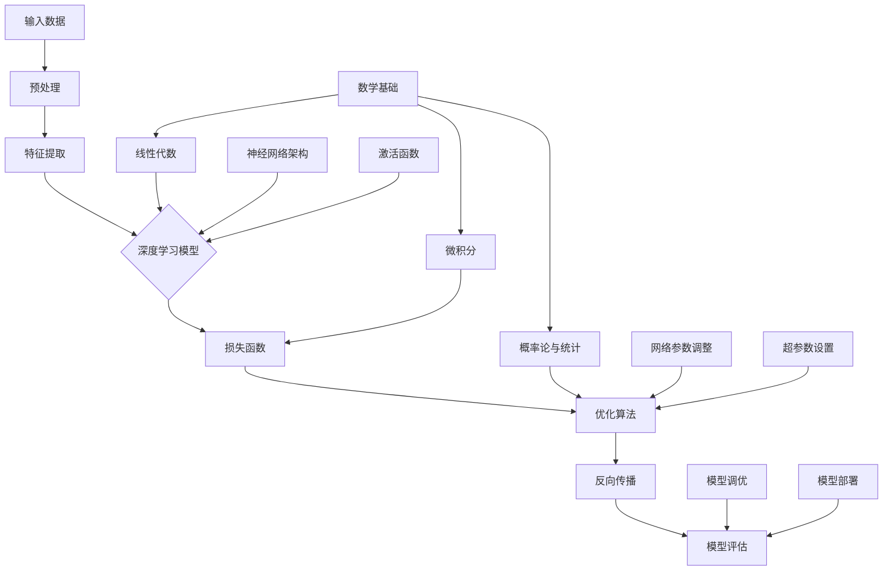

                 

### 核心概念与联系：深度学习模型与数学的关系架构

深度学习模型的核心在于其能够通过多层神经网络自动地学习和提取数据中的特征，而这些模型的训练和优化过程本质上就是数学运算的复杂集成。理解深度学习模型与数学之间的关系，有助于我们更好地掌握和运用这些模型。以下是一个简化的 Mermaid 流程图，展示深度学习模型与数学之间的核心概念及其相互联系：

这个流程图简单明了地展示了深度学习模型的训练过程，以及各个环节与数学基础之间的联系：

- **输入数据**：原始数据需要经过预处理，如归一化、标准化等。
- **特征提取**：预处理后的数据通过神经网络层层的计算，逐渐提取出更加抽象的特征。
- **深度学习模型**：模型由多个神经网络层组成，包括输入层、隐藏层和输出层。神经网络架构和激活函数的选择是模型设计的关键。
- **损失函数**：用于衡量模型的预测结果与真实值之间的差距，如均方误差（MSE）或交叉熵损失函数。
- **优化算法**：如梯度下降、随机梯度下降、Adam等，用于调整模型参数，使得损失函数的值最小化。
- **反向传播**：通过反向传播算法，将损失函数在每一层的梯度计算出来，指导优化算法更新模型参数。
- **模型评估**：使用测试集对训练好的模型进行评估，以确定模型的泛化能力。

数学基础包括线性代数、微积分和概率论与统计，这些数学工具为深度学习模型的设计、训练和优化提供了理论支持。例如，线性代数在处理矩阵运算和向量空间方面具有重要作用；微积分则帮助我们理解损失函数的最优化过程；概率论与统计则提供了对模型不确定性的分析和处理方法。

通过这个流程图，我们可以清晰地看到深度学习模型与数学之间的紧密联系，以及如何通过数学手段来理解和改进这些模型。接下来，我们将进一步深入探讨这些核心概念，并结合实际案例进行讲解。

