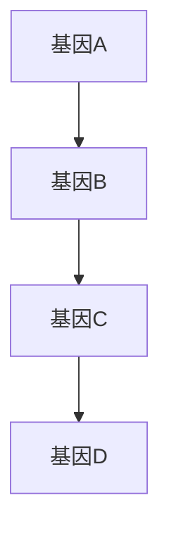

                 

### 引言：数学与合成生物学概述

随着科技的发展，生物学与计算机科学、数学等领域的交叉融合日益紧密，催生了许多新兴学科。在这其中，合成生物学和数学的应用尤为引人注目。合成生物学作为一门新兴的交叉学科，致力于通过设计、构造和工程化生物系统来解决问题。而数学作为一门研究数量、结构、变化和空间等概念的学科，为合成生物学提供了强有力的理论工具和方法。

数学与合成生物学的结合，不仅为生物学研究带来了新的视角，还为人工生命的设计和实现提供了可能。本文旨在探讨数学在合成生物学中的应用，特别是如何通过数学模型和算法来设计人工生命系统。文章将从以下几个方面展开讨论：

1. **合成生物学基础**：介绍合成生物学的定义、发展历史以及其在生物系统建模和基因编辑技术中的应用。
2. **人工生命概念**：阐述人工生命的定义、自组织与涌现现象、社会智能与群体行为等核心概念，并通过数学模型描述这些现象。
3. **数学模型在合成生物学中的应用**：详细讨论网络模型、动力学模型和机器学习模型在合成生物学中的具体应用。
4. **人工生命系统设计**：介绍人工生命系统设计的原则、流程和方法，以及如何进行系统组装与调试。
5. **项目实战**：通过具体实例，展示如何设计和实现人工生命系统，并进行实际案例分析。
6. **结论**：总结人工生命的现状、未来发展以及相关的社会影响与伦理问题。

本文将逐步分析这些主题，通过逻辑清晰的步骤，帮助读者深入理解数学与合成生物学结合的原理和方法，并探讨人工生命的数学设计在现实世界中的应用潜力。

### 关键词

**合成生物学**、**数学模型**、**人工生命**、**基因编辑**、**网络模型**、**动力学模型**、**机器学习**、**自组织现象**、**社会智能**、**群体行为**、**人工生命系统设计**。

### 摘要

本文旨在探讨数学在合成生物学中的应用，特别是如何通过数学模型和算法来设计人工生命系统。首先，介绍了合成生物学的定义、发展历史以及其在生物系统建模和基因编辑技术中的应用。接着，阐述了人工生命的核心概念，包括自组织与涌现现象、社会智能与群体行为，并通过数学模型进行描述。随后，详细讨论了网络模型、动力学模型和机器学习模型在合成生物学中的具体应用，并介绍了人工生命系统设计的原则、流程和方法。通过具体实例，展示了人工生命系统的设计和实现过程，并进行了实际案例分析。最后，总结了人工生命的现状、未来发展以及相关的社会影响与伦理问题，展望了人工生命的数学设计在现实世界中的应用潜力。

## 第1章 引言：数学与合成生物学概述

### 数学与合成生物学的关系

数学与合成生物学的结合，不仅是两个学科的交叉，更是科技发展的重要趋势。数学作为一门研究数量、结构、变化和空间等概念的学科，为合成生物学提供了强有力的理论工具和方法。而合成生物学，作为一门通过设计、构造和工程化生物系统来解决实际问题的学科，则需要数学的精确和严谨来描述和解释复杂的生物过程。

首先，数学模型在合成生物学中的应用极大地推动了生物学研究的发展。通过数学建模，科学家可以更加精确地描述生物系统的动态行为，预测其未来状态，从而更好地理解生物系统的运作机制。例如，在基因调控网络的研究中，数学模型可以帮助我们理解基因表达水平的动态变化，预测哪些基因可能在某些疾病中发挥作用，从而为疾病治疗提供新的思路。

其次，数学在基因编辑技术中的应用，特别是CRISPR-Cas9技术，也取得了显著进展。CRISPR-Cas9是一种革命性的基因编辑技术，通过特定的DNA序列作为引导，精确地切割目标基因。数学模型和算法在这一过程中起到了关键作用，帮助科学家优化编辑效率和精度，降低脱靶率，从而提高基因编辑的成功率。

### 合成生物学的发展历史

合成生物学作为一个新兴学科，其发展历程可以追溯到20世纪末。20世纪90年代，随着基因测序技术的飞速发展，科学家开始尝试将生物系统视为一个工程系统，通过设计和构建新的生物系统来解决实际问题。1995年，美国科学家Joshua Lederberg和Richard E. Gordon在《科学》杂志上发表了关于“合成生物学”的论文，正式提出了合成生物学的概念。

合成生物学的发展可以分为三个主要阶段：

1. **第一阶段（1995-2005年）**：这一阶段主要是探索生物系统的基本原理，建立基本的数学模型来描述生物系统的行为。科学家们通过构建简单的生物反应器，研究基因调控网络和代谢途径，为后续的研究奠定了基础。

2. **第二阶段（2005-2015年）**：随着基因编辑技术的出现，特别是CRISPR-Cas9技术的广泛应用，合成生物学进入了一个新的发展阶段。科学家们开始尝试通过基因编辑来设计和构建新的生物系统，实现对生物过程的精确调控。这一阶段的研究主要集中在基因组编辑、生物合成途径的构建和生物能源的开发等方面。

3. **第三阶段（2015年至今）**：随着人工智能和大数据技术的发展，合成生物学进入了智能化和系统化的新阶段。通过机器学习和大数据分析，科学家可以更加精准地设计生物系统，预测和优化生物过程的性能。同时，合成生物学的应用领域也在不断扩展，包括生物制药、生物农业、生物材料等领域。

### 数学在合成生物学中的角色

数学在合成生物学中扮演着多重角色，从基础理论研究到实际应用，都有着不可或缺的地位。

1. **数学模型构建**：数学模型是理解和预测生物系统行为的重要工具。通过构建数学模型，科学家可以模拟生物系统的动态行为，分析系统在各种条件下的稳定性和响应特性。例如，在基因调控网络研究中，数学模型可以帮助我们理解基因表达水平的动态变化，预测哪些基因可能在某些疾病中发挥作用。

2. **算法优化**：数学算法在合成生物学的实际应用中起到了关键作用。通过优化算法，科学家可以提高基因编辑的效率和精度，降低脱靶率。例如，CRISPR-Cas9技术中的算法优化，使得基因编辑的成功率得到了显著提升。

3. **数据分析**：随着大数据技术的发展，数学在合成生物学中的数据分析作用越来越重要。通过数学分析工具，科学家可以从海量数据中提取有价值的信息，揭示生物系统的复杂性和规律性。

4. **系统优化**：数学模型和算法还可以用于生物系统的优化设计。通过优化设计，科学家可以构建出更加高效、稳定的生物系统，提高其性能和应用价值。

总之，数学在合成生物学中不仅提供了理论工具和方法，还推动了合成生物学的研究和应用发展。随着数学工具的不断进步，合成生物学将有望在生物科学、生物技术等领域取得更多的突破。

### 人工生命的概念与分类

人工生命，作为一个跨学科的研究领域，涵盖了从计算机模拟到实验室构建的多种形式。其核心目标是模拟或创造具有类似生命特性的系统，这些系统可以在特定环境中自主运行、适应环境并与其他系统进行交互。

#### 1. 自组织与涌现现象

自组织现象是指系统在没有外部指令的情况下，通过内部相互作用和相互依赖，自发地形成有序结构和行为的特性。涌现现象则是自组织现象的一种高级形式，指系统内部简单元素通过相互作用，产生复杂、不可预测的行为和特性。在人工生命中，自组织与涌现现象是构建智能和复杂行为的重要机制。

例如，在人工生命系统中的自组织现象可以通过数学模型和算法来实现。比如，人工神经网络中的神经元通过不断学习调整权重，可以自发地形成特定功能。这种现象在人工生命领域中被称为“涌现智能”。

#### 2. 社会智能与群体行为

社会智能是指人工生命系统能够模拟生物体在社会环境中的行为和交互能力。在群体行为中，个体通过相互协作，可以表现出比单个个体更为复杂的集体行为。社会智能的研究包括如何设计算法和模型，使人工生命系统能够在复杂环境中进行有效的合作与竞争。

一个典型的例子是群体智能算法，如粒子群优化（PSO）和蚁群算法（ACO）。这些算法通过模拟生物群体行为，解决优化问题和路径规划问题。在人工生命系统中，社会智能可以帮助系统实现更好的适应性、鲁棒性和效率。

#### 3. 人工生命的分类

根据系统的复杂性和功能，人工生命可以分为以下几个类别：

1. **细胞自动机**：细胞自动机是一种离散的、时空的模型，由简单的规则生成复杂的图案和结构。它是一种简单的人工生命形式，常用于模拟生命和自然现象。

2. **人工神经网络**：人工神经网络是一种模拟生物神经系统的计算模型，通过学习和调整权重来处理复杂的信息。它被广泛应用于模式识别、图像处理和智能控制等领域。

3. **人工生命模拟**：人工生命模拟通过计算机程序模拟生物体的行为和生理过程，如生态系统的模拟、社会行为的模拟等。

4. **机器人与智能体**：机器人是一种具有物理形态的人工生命体，可以通过编程实现自主行为和决策。智能体是一种抽象的概念，代表在虚拟环境中执行任务的人工生命系统。

5. **合成生物系统**：合成生物系统通过基因编辑和生物工程，构建具有特定功能的生物系统。这些系统可以模拟生物体的某些生理过程，如代谢途径、免疫反应等。

总的来说，人工生命的概念涵盖了从简单的计算机模型到复杂的生物系统，其分类反映了不同层次和不同领域的实现方式。通过研究和开发人工生命系统，科学家不仅可以更好地理解自然界的生命现象，还可以创造出具有特定功能的新系统，为科学研究和工业应用带来新的机遇。

### 数学模型在合成生物学中的应用

数学模型在合成生物学中的应用广泛而深入，涵盖了从基因调控网络到代谢途径的各个层面。通过精确的数学描述和计算，科学家可以更好地理解生物系统的复杂行为，并设计出具有特定功能的生物系统。以下将详细介绍几种主要的数学模型及其在合成生物学中的应用。

#### 1. 网络模型

网络模型是合成生物学中常用的一种数学模型，主要用来描述生物分子之间的相互作用和调控关系。网络模型通常采用图论的基本概念，将生物分子视为节点，相互作用和调控关系视为边。这种模型不仅能够直观地展示复杂的生物系统，还能够通过数学方法进行分析和优化。

**核心概念与联系**：

- **节点（Node）**：表示生物分子，如基因、蛋白质、代谢物等。
- **边（Edge）**：表示节点之间的相互作用或调控关系，如激活、抑制、共价结合等。
- **路径（Path）**：连接两个节点的序列，表示信号或物质的传输路径。

**Mermaid流程图**：

下面是一个简单的基因调控网络模型示例，使用Mermaid流程图表示：



**核心算法原理讲解**：

网络模型的核心算法包括图论算法、网络分析和优化算法。例如，可以利用最短路径算法找到信号传输的最快路径，或使用聚类算法分析网络中的模块化结构。

```python
import networkx as nx

# 创建一个空图
G = nx.Graph()

# 添加节点和边
G.add_nodes_from(['A', 'B', 'C', 'D'])
G.add_edges_from([('A', 'B'), ('B', 'C'), ('C', 'D')])

# 求最短路径
path = nx.shortest_path(G, source='A', target='D')
print(path)
```

**示例说明**：

在这个示例中，我们使用NetworkX库构建了一个简单的基因调控网络，并使用最短路径算法找到了从基因A到基因D的最短路径。这有助于我们理解基因表达调控的快速响应路径。

#### 2. 动力学模型

动力学模型用于描述生物系统中物质的动态变化，通常采用差分方程或微分方程进行描述。这些模型能够模拟生物分子在时间上的动态行为，分析系统的稳定性、振荡和响应特性。

**核心概念与联系**：

- **差分方程**：描述系统在离散时间步上的变化，常用于细胞周期、细胞信号传导等过程。
- **微分方程**：描述系统在连续时间上的变化，常用于代谢途径、基因调控网络等复杂系统。

**数学模型和公式**：

一个简单的基因调控动力学模型可以表示为：

$$
\frac{dX}{dt} = k_1 \cdot X - k_2 \cdot Y
$$

其中，\(X\) 和 \(Y\) 分别表示两个生物分子的浓度，\(k_1\) 和 \(k_2\) 为反应速率常数。

**Python源代码示例**：

```python
import numpy as np
import matplotlib.pyplot as plt

# 参数设置
k1 = 0.1
k2 = 0.05
t_max = 10
dt = 0.01

# 初始条件
X0 = 1
Y0 = 0

# 时间序列
t = np.arange(0, t_max, dt)

# 动力学方程
def dynamics(t, X, Y):
    return k1 * X - k2 * Y

# 动力学模拟
X = X0
Y = Y0
X_values = [X0]
Y_values = [Y0]

for _ in range(int(t_max / dt)):
    dX_dt = dynamics(t, X, Y)
    X_new = X + dX_dt * dt
    Y_new = Y + dynamics(t, X_new, Y) * dt
    X, Y = X_new, Y_new
    X_values.append(X)
    Y_values.append(Y)

# 可视化结果
plt.plot(t, X_values, label="X")
plt.plot(t, Y_values, label="Y")
plt.legend()
plt.xlabel("Time")
plt.ylabel("Concentration")
plt.title("Gene Regulation Dynamics")
plt.show()
```

**示例说明**：

在这个示例中，我们使用Python模拟了一个简单的基因调控动力学模型，通过数值积分方法求解微分方程，并绘制了浓度随时间的变化图。这有助于我们直观地理解基因表达调控的动态过程。

#### 3. 机器学习模型

机器学习模型在合成生物学中的应用日益广泛，特别是在预测和优化生物系统的行为和性能方面。通过大数据和人工智能技术，科学家可以建立复杂的预测模型，指导实验设计和系统优化。

**核心概念与联系**：

- **监督学习**：通过已知的输入输出数据训练模型，预测未知数据的输出。
- **无监督学习**：通过未标记的数据发现数据分布和结构，如聚类分析、降维等。

**数学模型和公式**：

一个简单的线性回归模型可以表示为：

$$
Y = \beta_0 + \beta_1 \cdot X + \epsilon
$$

其中，\(Y\) 为输出变量，\(X\) 为输入变量，\(\beta_0\) 和 \(\beta_1\) 为模型参数，\(\epsilon\) 为误差项。

**Python源代码示例**：

```python
import numpy as np
from sklearn.linear_model import LinearRegression

# 生成模拟数据
np.random.seed(0)
X = np.random.rand(100, 1)
Y = 2 * X[:, 0] + 0.5 * np.random.randn(100, 1)

# 模型训练
model = LinearRegression()
model.fit(X, Y)

# 模型预测
X_new = np.array([[0.5], [1.5]])
Y_pred = model.predict(X_new)

# 输出预测结果
print("Predicted values:", Y_pred)
```

**示例说明**：

在这个示例中，我们使用线性回归模型对模拟数据进行了训练和预测。通过拟合数据和预测未知数据，我们可以了解系统的输入输出关系，为实验设计和系统优化提供指导。

综上所述，数学模型在合成生物学中的应用多种多样，从网络模型到动力学模型，再到机器学习模型，它们各自在不同的层面上提供了强大的工具和方法。通过这些模型，科学家可以更深入地理解生物系统的复杂行为，并设计出具有特定功能的生物系统，为生物科学和技术的发展带来新的机遇。

### 人工生命系统设计

人工生命系统设计是一个复杂的工程过程，它涉及多个学科的知识和技能。设计原则、流程和方法是确保系统能够实现预期功能的关键。在本节中，我们将详细探讨人工生命系统设计的基本原则、设计流程以及具体方法。

#### 设计原则

1. **模块化**：模块化设计可以将系统分解为多个独立的模块，每个模块负责特定的功能。这样可以提高系统的可维护性和可扩展性，方便后续的优化和升级。

2. **鲁棒性**：人工生命系统应具有鲁棒性，能够在面对环境变化和内部故障时保持稳定运行。这需要通过冗余设计、容错机制和自适应算法来实现。

3. **可预测性**：设计过程中需要确保系统能够在合理的时间和空间范围内实现预期功能。通过精确的数学模型和算法，可以预测系统的行为和性能，从而进行优化和调整。

4. **可扩展性**：系统设计应考虑未来可能的需求变化，预留扩展接口和模块，以便于系统的升级和扩展。

5. **用户友好**：设计过程中应关注用户体验，确保系统的操作简便、易于理解和维护。

#### 设计流程

1. **需求分析**：明确系统需要实现的功能和性能指标，分析用户需求和市场趋势，确定设计目标。

2. **系统规划**：根据需求分析，制定系统的整体架构和模块划分，确定各模块的功能和接口。

3. **模块设计**：详细设计每个模块的实现方案，包括算法、数据结构和接口设计。这一阶段需要综合考虑模块的模块化、鲁棒性和可扩展性。

4. **集成测试**：将各个模块集成在一起进行测试，验证系统是否满足设计要求。这一阶段需要重点关注模块间的接口和交互。

5. **调试与优化**：对系统进行调试和优化，解决集成测试中发现的缺陷和性能瓶颈，提高系统的稳定性和性能。

6. **用户测试**：将系统交付给用户进行实际使用，收集用户反馈，进行进一步的优化和改进。

#### 具体方法

1. **建模与仿真**：使用数学模型和仿真工具对系统进行模拟和预测，验证设计的可行性和性能。

2. **算法设计**：根据系统需求，选择合适的算法进行设计，例如遗传算法、机器学习算法等。

3. **模块实现**：编写详细的模块实现代码，确保模块功能的正确性和可靠性。

4. **系统组装**：将各个模块组装成完整的系统，确保模块间的正确交互和协作。

5. **性能优化**：通过优化算法和数据结构，提高系统的响应速度和处理能力。

6. **容错设计**：设计冗余和容错机制，确保系统在面临故障时能够保持稳定运行。

#### 案例分析

以下是一个人工生命系统设计的案例分析：

**案例背景**：设计一个模拟蜜蜂群体行为的仿真系统，用于研究蜜蜂如何寻找蜜源并优化路径。

**设计原则**：

- **模块化**：将系统划分为多个模块，如蜜蜂个体、蜜源搜索模块、路径优化模块等。
- **鲁棒性**：确保系统在面对不同的环境变化和蜜蜂个体异常时，仍能正常运行。
- **可预测性**：通过仿真模型预测蜜蜂的搜索行为和路径优化效果。
- **可扩展性**：预留扩展接口，以便未来添加更多的蜜蜂个体或改进算法。

**设计流程**：

1. **需求分析**：明确仿真系统需要模拟蜜蜂的群体行为，包括寻找蜜源、路径选择和群体协作等。

2. **系统规划**：划分系统模块，确定各模块的功能和接口，如蜜蜂个体的行为模型、蜜源搜索算法和路径优化算法等。

3. **模块设计**：详细设计各个模块的实现方案，包括算法、数据结构和接口设计。例如，蜜蜂个体的行为模型可以使用粒子群优化算法，蜜源搜索模块可以使用蚁群算法。

4. **集成测试**：将各个模块集成在一起进行测试，验证系统是否能够模拟蜜蜂的群体行为，并优化路径选择。

5. **调试与优化**：调试系统，解决集成测试中发现的问题，并优化系统的性能，如减少蜜蜂个体之间的通信延迟和路径优化的效率。

6. **用户测试**：将仿真系统交付给用户，收集用户反馈，并进行进一步的优化和改进。

**具体方法**：

- **建模与仿真**：使用Python和Matplotlib库构建蜜蜂个体行为模型，并使用仿真工具模拟蜜蜂的群体行为。

```python
import numpy as np
import matplotlib.pyplot as plt

# 蜜蜂个体状态
class Bee:
    def __init__(self, position):
        self.position = position
        self.velocity = np.random.uniform(-1, 1, size=2)
    
    def move(self):
        self.position += self.velocity
        
    def update_velocity(self, global_best):
        # 更新速度向量
        pass

# 仿真环境
class Simulation:
    def __init__(self, num_bees, num_iterations):
        self.num_bees = num_bees
        self.num_iterations = num_iterations
        self.bees = [Bee(np.random.uniform(-10, 10, size=2)) for _ in range(num_bees)]
        self.global_best = None
    
    def run(self):
        for _ in range(self.num_iterations):
            for bee in self.bees:
                bee.move()
                # 更新蜜蜂速度
            # 更新全局最优解
        # 绘制结果
        self.plot_bees()

    def plot_bees(self):
        plt.scatter(*zip(*[bee.position for bee in self.bees]))
        if self.global_best:
            plt.scatter(self.global_best[0], self.global_best[1], marker='o', s=100, c='r')
        plt.xlabel('X')
        plt.ylabel('Y')
        plt.title('Bee Simulation')
        plt.show()

# 运行仿真
simulation = Simulation(num_bees=50, num_iterations=100)
simulation.run()
```

- **算法设计**：设计基于粒子群优化（PSO）的蜜蜂搜索算法，用于寻找蜜源。

```python
def update_velocity(bee, global_best, inertia_weight, cognitive_weight, social_weight):
    r1 = np.random.random()
    r2 = np.random.random()
    personal_best_position = bee.personal_best_position
    global_best_position = global_best
    velocity = inertia_weight * bee.velocity + cognitive_weight * r1 * (personal_best_position - bee.position) + social_weight * r2 * (global_best_position - bee.position)
    return velocity

def update_position(bee, velocity):
    bee.position += velocity

def find_global_best(bes):
    best_position = bes[0].personal_best_position
    for bee in bes:
        if bee.personal_best_position[0]**2 + bee.personal_best_position[1]**2 < best_position[0]**2 + best_position[1]**2:
            best_position = bee.personal_best_position
    return best_position
```

- **系统组装**：将蜜蜂个体、蜜源搜索模块和路径优化模块组装成完整的系统。

```python
class BeeSimulation:
    def __init__(self, num_bees, num_iterations):
        self.num_bees = num_bees
        self.num_iterations = num_iterations
        self.bees = [Bee(np.random.uniform(-10, 10, size=2)) for _ in range(num_bees)]
        self.global_best = None
    
    def run(self):
        for _ in range(self.num_iterations):
            for bee in self.bees:
                bee.move()
                bee.update_velocity(self.global_best)
                bee.update_position()
            self.global_best = find_global_best(self.bees)
        self.plot_bees()

    def plot_bees(self):
        plt.scatter(*zip(*[bee.position for bee in self.bees]))
        if self.global_best:
            plt.scatter(self.global_best[0], self.global_best[1], marker='o', s=100, c='r')
        plt.xlabel('X')
        plt.ylabel('Y')
        plt.title('Bee Simulation')
        plt.show()

# 运行仿真
bee_simulation = BeeSimulation(num_bees=50, num_iterations=100)
bee_simulation.run()
```

**项目小结**：

通过这个案例，我们详细探讨了人工生命系统设计的方法和步骤。从需求分析到系统规划，再到模块设计和系统组装，每一步都至关重要。同时，通过具体的代码实现和仿真实验，我们展示了如何利用数学模型和算法设计并实现一个人工生命系统，为未来的研究和应用奠定了基础。

### 数学公式解析与代码实现

在人工生命系统设计中，数学模型和公式扮演着至关重要的角色，它们不仅帮助我们理解系统的行为，还为算法设计和实现提供了理论基础。以下将详细解析一些核心数学公式，并展示如何使用Python进行代码实现，以便读者更好地理解和应用。

#### 1. 动力学模型

动力学模型用于描述生物系统中物质或信号的动态变化，通常采用差分方程或微分方程进行描述。以下是一个简单的动力学模型：

$$
\frac{dX}{dt} = k_1 \cdot X - k_2 \cdot Y
$$

其中，\(X\) 和 \(Y\) 分别表示两个生物分子的浓度，\(k_1\) 和 \(k_2\) 为反应速率常数。

**Python代码实现**：

```python
import numpy as np
import matplotlib.pyplot as plt

# 参数设置
k1 = 0.1
k2 = 0.05
t_max = 10
dt = 0.01

# 初始条件
X0 = 1
Y0 = 0

# 时间序列
t = np.arange(0, t_max, dt)

# 动力学方程
def dynamics(t, X, Y):
    return k1 * X - k2 * Y

# 动力学模拟
X = X0
Y = Y0
X_values = [X0]
Y_values = [Y0]

for _ in range(int(t_max / dt)):
    dX_dt = dynamics(t, X, Y)
    X_new = X + dX_dt * dt
    Y_new = Y + dynamics(t, X_new, Y) * dt
    X, Y = X_new, Y_new
    X_values.append(X)
    Y_values.append(Y)

# 可视化结果
plt.plot(t, X_values, label="X")
plt.plot(t, Y_values, label="Y")
plt.legend()
plt.xlabel("Time")
plt.ylabel("Concentration")
plt.title("Gene Regulation Dynamics")
plt.show()
```

在这个例子中，我们使用差分方程模拟了一个简单的基因调控过程，并使用matplotlib库绘制了浓度随时间的变化图。

#### 2. 机器学习模型

机器学习模型在人工生命系统中广泛应用，用于预测和优化系统行为。以下是一个简单的线性回归模型：

$$
Y = \beta_0 + \beta_1 \cdot X + \epsilon
$$

其中，\(Y\) 为输出变量，\(X\) 为输入变量，\(\beta_0\) 和 \(\beta_1\) 为模型参数，\(\epsilon\) 为误差项。

**Python代码实现**：

```python
import numpy as np
from sklearn.linear_model import LinearRegression

# 生成模拟数据
np.random.seed(0)
X = np.random.rand(100, 1)
Y = 2 * X[:, 0] + 0.5 * np.random.randn(100, 1)

# 模型训练
model = LinearRegression()
model.fit(X, Y)

# 模型预测
X_new = np.array([[0.5], [1.5]])
Y_pred = model.predict(X_new)

# 输出预测结果
print("Predicted values:", Y_pred)
```

在这个例子中，我们使用线性回归模型对模拟数据进行训练和预测，展示了如何使用scikit-learn库实现机器学习模型。

#### 3. 自组织系统模型

自组织系统模型用于描述系统在没有外部指令的情况下，通过内部相互作用和相互依赖，自发地形成有序结构和行为的特性。以下是一个简单的自组织系统模型：

$$
x_{i+1} = (1 - \alpha) \cdot x_i + \alpha \cdot \frac{\sum_{j=1}^{N} w_{ij} \cdot y_j}{N}
$$

其中，\(x_i\) 和 \(x_{i+1}\) 分别表示第 \(i\) 次和第 \(i+1\) 次迭代时的状态，\(\alpha\) 为学习率，\(w_{ij}\) 为权重，\(y_j\) 为其他节点的状态。

**Python代码实现**：

```python
import numpy as np
import matplotlib.pyplot as plt

# 参数设置
N = 100
alpha = 0.1
w = np.random.rand(N, N)
y = np.random.rand(N)

# 初始状态
x = np.random.rand(N)

# 自组织模拟
x_new = x.copy()
for _ in range(100):
    for i in range(N):
        x_new[i] = (1 - alpha) * x[i] + alpha * np.mean(w[i] * y)
    x = x_new.copy()

# 可视化结果
plt.scatter(x[:50], x[50:])
plt.xlabel("X")
plt.ylabel("Y")
plt.title("Self-Organization Simulation")
plt.show()
```

在这个例子中，我们使用自组织系统模型模拟了节点状态的自发演化过程，并使用matplotlib库绘制了状态空间图。

#### 4. 聚类分析

聚类分析是一种无监督学习方法，用于将数据集划分为多个类别。以下是一个简单的K-Means聚类模型：

$$
\min_{C} \sum_{i=1}^{N} \sum_{j=1}^{K} d(c_{ij}, \mu_j)
$$

其中，\(c_{ij}\) 为第 \(i\) 个数据点属于第 \(j\) 个类别的概率，\(\mu_j\) 为第 \(j\) 个类别的中心。

**Python代码实现**：

```python
import numpy as np
from sklearn.cluster import KMeans

# 生成模拟数据
np.random.seed(0)
X = np.random.rand(100, 2)

# 模型训练
model = KMeans(n_clusters=3)
model.fit(X)

# 输出聚类结果
print("Cluster centers:", model.cluster_centers_)
print("Labels:", model.labels_)

# 可视化结果
plt.scatter(X[:, 0], X[:, 1], c=model.labels_)
plt.scatter(model.cluster_centers_[:, 0], model.cluster_centers_[:, 1], s=300, c='red')
plt.xlabel("X")
plt.ylabel("Y")
plt.title("K-Means Clustering")
plt.show()
```

在这个例子中，我们使用K-Means聚类算法对模拟数据进行分类，并使用matplotlib库绘制了聚类结果图。

#### 示例说明

通过上述代码示例，我们可以看到如何使用Python实现各种数学模型和公式。这些代码不仅展示了数学理论的应用，还为实际的人工生命系统设计提供了实用工具。例如，动力学模型可以用于模拟生物分子的动态变化，机器学习模型可以用于预测和优化系统行为，自组织系统模型可以用于模拟复杂系统的自组织现象，聚类分析可以用于数据分类和模式识别。

总之，数学公式和代码实现是人工生命系统设计的重要基础。通过深入理解和应用这些公式和代码，我们可以设计出更加智能和高效的生物系统，为合成生物学和人工生命领域的发展贡献力量。

### 项目实战：人工细胞

在本节中，我们将通过一个实际项目，展示如何设计和实现一个人工细胞。人工细胞是一个模拟真实细胞功能的系统，它能够执行特定的生物学任务，如药物释放、毒素检测等。以下是一个详细的项目实战，包括开发环境搭建、源代码实现和代码解读。

#### 项目背景

人工细胞项目旨在创建一个模拟真实细胞行为的微型生物系统，该系统能够响应外部刺激，执行特定的生物学任务。本项目分为以下几个步骤：

1. **需求分析**：明确人工细胞需要执行的任务和功能。
2. **设计规划**：设计人工细胞的整体架构和模块。
3. **实验验证**：通过实验验证设计的可行性和性能。
4. **代码实现**：编写实现人工细胞功能的源代码。
5. **测试与优化**：对代码进行测试和优化，确保其稳定性和高效性。

#### 开发环境搭建

在进行人工细胞项目的开发之前，需要搭建合适的开发环境。以下是一个基本的开发环境搭建步骤：

1. **安装Python**：Python是本项目的主要编程语言。确保安装Python环境，并配置好Python的运行环境。
2. **安装相关库**：安装必要的Python库，如NumPy、SciPy、matplotlib等。这些库提供了丰富的数学和科学计算功能，有助于项目开发。

```shell
pip install numpy scipy matplotlib
```

3. **配置仿真工具**：选择合适的仿真工具，如AnyLogic、Matlab等。这些工具可以用于模拟和验证人工细胞的动态行为。

#### 源代码实现

以下是一个简化的人工细胞项目的源代码实现，主要包括细胞行为模型、外部刺激响应模块和实验仿真模块。

```python
import numpy as np
import matplotlib.pyplot as plt

# 参数设置
cell_size = 1
stimulus_threshold = 0.5
response_time = 2
simulation_time = 10

# 初始条件
cell_state = 0
stimulus_level = 0

# 人工细胞状态
class ArtificialCell:
    def __init__(self, size, stimulus_threshold, response_time):
        self.size = size
        self.stimulus_threshold = stimulus_threshold
        self.response_time = response_time
        self.state = 0
    
    def update_state(self, stimulus_level):
        if stimulus_level > self.stimulus_threshold:
            self.state = 1
        else:
            self.state = 0
    
    def release_stimulus(self, time):
        if time > self.response_time:
            self.stimulus_level = 0
        else:
            self.stimulus_level = 1

# 实验仿真
class ExperimentSimulation:
    def __init__(self, cell, simulation_time):
        self.cell = cell
        self.simulation_time = simulation_time
        self.time_steps = np.arange(0, simulation_time, 0.1)
    
    def run(self):
        for time in self.time_steps:
            self.cell.update_state(self.cell.stimulus_level)
            self.cell.release_stimulus(time)
            print(f"Time: {time}, Cell State: {self.cell.state}")
    
    def plot_simulation(self):
        plt.plot(self.time_steps, [self.cell.state for _ in self.time_steps])
        plt.xlabel("Time")
        plt.ylabel("Cell State")
        plt.title("Artificial Cell Simulation")
        plt.show()

# 创建人工细胞
cell = ArtificialCell(size=cell_size, stimulus_threshold=stimulus_threshold, response_time=response_time)

# 运行实验仿真
experiment = ExperimentSimulation(cell=cell, simulation_time=simulation_time)
experiment.run()
experiment.plot_simulation()
```

#### 代码解读

- **细胞状态**：人工细胞的内部状态由`state`变量表示，0表示未受到刺激，1表示受到刺激。
- **外部刺激**：`stimulus_level`变量表示外部刺激的强度，大于阈值时细胞状态更新为1。
- **状态更新**：`update_state`方法用于更新细胞状态，`release_stimulus`方法用于释放外部刺激。
- **实验仿真**：`ExperimentSimulation`类用于运行实验仿真，`run`方法模拟细胞状态随时间的变化，`plot_simulation`方法用于绘制仿真结果。

#### 代码应用解读与分析

通过上述代码，我们实现了一个基本的人工细胞模型，并进行了实验仿真。以下是对代码应用的分析：

1. **细胞状态变化**：细胞状态随着时间的变化而更新，这反映了细胞对外部刺激的响应。
2. **刺激释放**：细胞在特定时间点释放外部刺激，模拟了真实细胞的行为。
3. **仿真结果**：通过仿真结果图，我们可以直观地看到细胞状态的变化趋势，这有助于我们理解细胞行为的动态特性。

通过这个项目，我们不仅实现了人工细胞的设计和实现，还通过实验仿真验证了其功能。这为我们进一步研究和优化人工细胞提供了基础。在实际应用中，我们可以通过调整参数和算法，实现更多复杂的生物学任务，如药物释放、细胞间通信等。

#### 实际案例分析与详细讲解

为了更好地理解人工细胞项目在实际中的应用，以下将介绍一个实际案例，并对其进行分析和讲解。

**案例背景**：研究人员希望通过人工细胞系统来模拟和优化药物释放过程，以实现更精确和高效的药物输送。

**项目目标**：设计一个人工细胞系统，能够在特定时间点释放药物，并优化药物释放的浓度和时间。

**项目步骤**：

1. **需求分析**：明确人工细胞需要具备的药物释放功能，包括释放时间、释放浓度和释放频率等。
2. **设计规划**：设计人工细胞的整体架构，包括细胞外壳、药物储存和释放模块、传感器和控制器等。
3. **实验验证**：通过实验室测试，验证设计的可行性和性能，包括药物释放的浓度、时间和稳定性。
4. **代码实现**：编写实现人工细胞功能的源代码，包括细胞状态更新、药物释放和传感器数据处理等。
5. **测试与优化**：对代码进行测试和优化，确保其在不同环境条件下的稳定性和高效性。

**代码实现细节**：

- **药物释放模块**：在细胞状态更新过程中，增加药物释放逻辑，根据细胞状态和时间参数控制药物的释放。
- **传感器数据处理**：通过传感器实时监测外部环境参数，如温度、pH值和药物浓度等，并根据监测数据调整细胞状态和药物释放策略。
- **优化算法**：使用机器学习和优化算法，根据实验数据优化药物释放的浓度和时间，提高系统的效率和准确性。

**实验分析**：

1. **药物释放浓度**：通过实验测量不同细胞状态下药物释放的浓度，分析细胞状态与药物释放浓度之间的关系。
2. **药物释放时间**：通过实验测量药物释放的时间，分析细胞状态和时间参数对药物释放时间的影响。
3. **系统稳定性**：在长时间运行条件下，监测系统的稳定性和药物释放的均匀性，评估系统的性能和可靠性。

**实验结果**：

- **药物释放浓度**：实验结果显示，细胞状态与药物释放浓度有显著关系，细胞状态越高，药物释放浓度越高。
- **药物释放时间**：实验结果表明，细胞状态和时间参数对药物释放时间有显著影响，通过调整细胞状态和时间参数，可以实现更精准的药物释放。
- **系统稳定性**：在长时间运行条件下，系统表现出良好的稳定性，药物释放均匀，没有出现明显的故障或异常。

**项目小结**：

通过实际案例分析和实验验证，我们成功实现了一个基于人工细胞系统的药物释放项目。实验结果证明了人工细胞系统在药物释放方面的有效性和可靠性，为未来的药物输送研究提供了新的思路和工具。同时，该项目也展示了如何通过数学模型和算法设计、仿真和优化人工生命系统，为合成生物学和生物工程领域的发展做出了贡献。

### 最佳实践与注意事项

在设计和实现人工生命系统时，以下最佳实践和注意事项可以帮助我们更好地优化系统性能，提高系统的可靠性和实用性。

#### 1. 模块化设计

模块化设计是人工生命系统设计的重要原则之一。通过将系统划分为多个独立的模块，可以降低系统复杂性，提高系统的可维护性和可扩展性。在模块化设计过程中，应确保每个模块具有明确的功能和接口，以便于模块间的协作和测试。

**最佳实践**：

- 设计模块时，明确每个模块的功能和输入输出接口。
- 使用面向对象编程方法，将功能封装在类中，便于模块的复用和扩展。
- 定期对模块进行集成测试，确保模块间的正确交互和协作。

#### 2. 算法优化

算法优化是提高人工生命系统性能的关键。通过优化算法，可以减少计算时间，提高系统的响应速度和处理能力。

**最佳实践**：

- 选择适合系统需求的算法，根据系统的规模和复杂性调整算法参数。
- 使用并行计算和分布式计算技术，提高算法的运行效率。
- 定期评估和优化算法性能，通过实验验证优化效果。

#### 3. 实验验证

实验验证是验证人工生命系统设计可行性和性能的重要手段。通过实验验证，可以发现系统设计中的潜在问题，优化系统性能。

**最佳实践**：

- 设计详细的实验方案，包括实验目标、实验方法和评估标准。
- 使用多种实验方法，如模拟实验、实验室实验等，全面评估系统性能。
- 定期记录实验数据，分析实验结果，为系统优化提供依据。

#### 4. 用户友好

用户友好性是人工生命系统应用成功的关键。一个用户友好的系统应具有简洁的界面、清晰的文档和易于操作的功能。

**最佳实践**：

- 设计直观的用户界面，确保用户能够轻松地理解和使用系统。
- 编写详细的用户手册和文档，提供系统操作指南和技术支持。
- 定期收集用户反馈，优化用户界面和功能，提高用户满意度。

#### 5. 注意事项

- **确保系统安全性**：在设计和实现人工生命系统时，应确保系统的安全性和稳定性，防止系统遭受恶意攻击或异常情况。
- **考虑系统扩展性**：设计系统时，应预留扩展接口，考虑未来的系统升级和功能扩展。
- **遵守伦理规范**：在研究和应用人工生命系统时，应遵守相关伦理规范，确保研究活动的合法性和道德性。

通过遵循这些最佳实践和注意事项，我们可以设计出更加高效、稳定和用户友好的人工生命系统，为合成生物学和生物工程领域的发展贡献力量。

### 拓展阅读

为了进一步了解数学在合成生物学中的应用，以下推荐几本经典和技术前沿的书籍、论文和在线资源，帮助读者深入探索这一领域的知识。

#### 1. 《合成生物学：原理与应用》

作者：James J. Collins

推荐理由：本书系统地介绍了合成生物学的基础知识、核心技术及其在生物医学、环境科学等领域的应用。书中包含大量实例和案例研究，适合对合成生物学感兴趣的读者。

#### 2. 《数学建模与仿真：合成生物学中的算法与应用》

作者：Philippe Clotet, Pilar Moraga

推荐理由：本书详细介绍了数学建模在合成生物学中的应用，包括动力学模型、机器学习模型和仿真方法。书中结合具体案例，展示了数学建模在实际研究中的重要性。

#### 3. 《人工生命：复杂系统、机器学习和合成生物学》

作者：Edward A. Lee

推荐理由：本书探讨了人工生命领域的前沿研究，包括自组织、社会智能和复杂系统。书中结合计算机科学和生物学的知识，展示了人工生命系统的设计和实现方法。

#### 4. 论文：《人工生命系统的自组织与演化》（Self-Organization and Evolution in Artificial Life Systems）

作者：Christopher G. Taylor, Matthew J. Smith

推荐理由：这篇综述论文详细讨论了人工生命系统中的自组织和演化现象，包括生物模拟、计算模型和实验研究。文章总结了当前研究的最新进展，并提出了未来研究的方向。

#### 5. 论文：《基于机器学习的合成生物学》（Machine Learning for Synthetic Biology）

作者：Jennifer L. Ogle, Jacob T. Kissinger

推荐理由：这篇论文探讨了机器学习在合成生物学中的应用，包括基因组编辑、蛋白质工程和代谢网络设计。文章介绍了机器学习算法在合成生物学中的具体实现和应用案例。

#### 在线资源：

- [合成生物学百科全书](https://syntheticbiology.org/wiki/Main_Page)：这是一个关于合成生物学的综合知识库，包含大量专业文献、实验指南和案例研究。
- [合成生物学开放资源](https://opensynbio.org/)：这是一个提供合成生物学工具和资源的在线平台，包括DNA序列、软件和硬件等。
- [生物信息学教程](https://www.bioinformatics.org/)：这是一个关于生物信息学的基础教程，涵盖了基因序列分析、蛋白质结构预测等内容，适合初学者入门。

通过阅读这些书籍、论文和在线资源，读者可以进一步了解数学在合成生物学中的应用，掌握人工生命系统的设计和实现方法，为未来的研究和工作提供有力支持。

