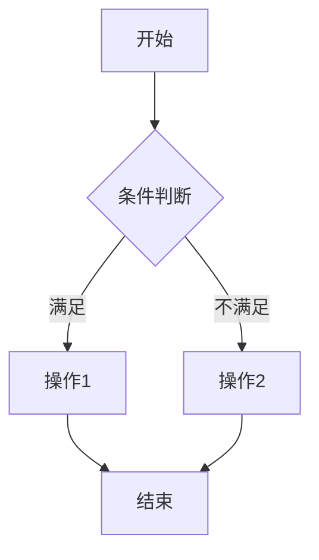

                 


### 文章标题：《数学与和平学：和平进程的数学模型》

关键词：数学模型，和平学，博弈论，图论，算法，动态系统，预测，稳定性，冲突预防，项目实战。

摘要：本文探讨了数学在和平学研究中的应用，通过构建数学模型来分析和预测和平进程。文章从核心概念出发，详细阐述了数学模型的基础理论，包括博弈论和图论的基本概念。通过实际项目实战，展示了如何将数学模型应用于解决和平进程中的实际问题，并分析了项目的实现过程和效果。

---

#### 1. 理解书名

《数学与和平学：和平进程的数学模型》这本书的主题涉及数学和和平学，重点探讨数学如何应用于理解和平进程，以及如何构建数学模型来分析和预测和平进程。数学作为一种工具，可以提供对复杂系统进行定量分析和建模的能力，这在和平学中尤为重要。和平学是研究和平进程、冲突预防和解决、以及国际安全等方面的学科，其研究对象包括个体、组织、国家和国际社会等。通过数学模型，我们可以更深入地理解和平进程的动态，预测可能的结果，并为决策提供科学依据。

#### 2. 核心章节确定

为了确保文章的逻辑性和连贯性，我们需要明确核心章节的内容。以下是核心章节及其具体内容的确定：

- **核心概念与联系**：介绍数学和和平学的基本概念，并展示它们之间的联系。使用 Mermaid 流程图来直观地展示概念之间的关系。

- **核心算法原理讲解**：详细讲解在和平进程中常用的算法原理，包括博弈论算法和图论算法。使用伪代码来描述算法的基本步骤。

- **数学模型和数学公式讲解**：介绍和平进程中的数学模型，包括其构成、公式和如何应用。使用 LaTeX 公式来书写数学公式，确保准确性和可读性。

- **项目实战**：通过实际案例来展示如何将数学模型应用于解决和平进程中的问题。包括开发环境搭建、源代码实现、代码解读、项目分析和小结。

#### 3. 设计目录大纲

为了确保文章的层次清晰，内容丰富，我们需要设计一个详细的目录大纲。以下是包含7章的目录大纲：

- **第1章 引言与核心概念**
  - 1.1 书籍目的与结构
  - 1.2 和平学的定义与发展
  - 1.3 数学在和平学中的应用
  - 1.4 和平进程的数学模型概述

- **第2章 数学模型基础**
  - 2.1 基本数学工具
    - 2.1.1 函数与方程
    - 2.1.2 概率论基础
    - 2.1.3 常见图论概念
  - 2.2 数学模型的基本原理

- **第3章 和平进程的数学模型**
  - 3.1 和平进程的数学描述
    - 3.1.1 和平进程的图模型
    - 3.1.2 冲突与合作的博弈论模型
  - 3.2 数学模型在和平研究中的应用

- **第4章 核心算法原理讲解**
  - 4.1 图算法在和平模型中的应用
    - 4.1.1 最短路径算法
    - 4.1.2 最大流算法
  - 4.2 动态系统在和平研究中的应用

- **第5章 数学模型与公式详细讲解**
  - 5.1 和平进程的数学公式
    - 5.1.1 冲突与和平的阈值公式
    - 5.1.2 稳定性与变化的公式
  - 5.2 数学模型的应用举例

- **第6章 项目实战**
  - 6.1 和平进程模拟案例
    - 6.1.1 案例背景
    - 6.1.2 模型构建
    - 6.1.3 代码实现与解释
  - 6.2 代码应用解读与分析

- **第7章 小结与展望**
  - 7.1 最佳实践 tips
  - 7.2 小结
  - 7.3 注意事项
  - 7.4 拓展阅读

#### 4. 编写目录内容

根据上述设计的目录大纲，我们需要编写详细的目录内容。以下是每个章节的简要概述：

- **第1章 引言与核心概念**：介绍书籍的目的和结构，阐述数学与和平学的关系，提供和平进程的数学模型概述。
  
- **第2章 数学模型基础**：介绍数学模型的基础知识，包括基本数学工具和数学模型的基本原理。

- **第3章 和平进程的数学模型**：讨论和平进程的数学描述，包括图模型和博弈论模型，以及这些模型在和平研究中的应用。

- **第4章 核心算法原理讲解**：讲解在和平进程中常用的算法原理，包括图算法和动态系统算法。

- **第5章 数学模型与公式详细讲解**：详细介绍和平进程中的数学模型，包括相关公式和如何应用这些模型。

- **第6章 项目实战**：通过实际案例展示如何将数学模型应用于和平进程，包括开发环境搭建、代码实现和项目分析。

- **第7章 小结与展望**：总结文章的主要观点，提供最佳实践 tips，并指出未来研究的方向。

#### 5. 确保简洁性和完整性

为了确保目录内容的简洁性和完整性，我们需要注意以下几点：

- **简洁性**：每个章节的概述要简洁明了，避免冗余和复杂的描述。
- **完整性**：确保每个核心章节的内容都被包含，并且每个章节都有具体的概述。

#### 6. 符合输出格式要求

为了符合输出格式要求，我们需要使用 markdown 格式编写文章内容。以下是 markdown 格式的几个基本规则：

- **标题**：使用井号（#）来表示标题级别，一个井号代表一级标题，两个井号代表二级标题，以此类推。
- **列表**：使用星号（*）和空格来创建无序列表。
- **代码块**：使用三个反引号（```）来创建代码块，确保代码格式正确。
- **LaTeX 公式**：使用美元符号（$）来嵌入简单的 LaTeX 公式，使用双美元符号（$$）来嵌入独立的段落公式。

#### 7. 编写 Mermaid 流程图

为了更好地展示核心概念与联系，我们可以使用 Mermaid 语言编写流程图。以下是 Mermaid 流程图的基本语法：



这个流程图表示一个简单的条件分支结构，其中 A 是开始节点，B 是条件判断节点，C 和 D 是操作节点，E 是结束节点。

#### 8. 使用伪代码

在讲解核心算法原理时，我们可以使用伪代码来详细阐述算法的基本步骤。以下是伪代码的基本语法：

```
Algorithm FindMinimum(A[1...n]):
    min = A[1]
    for i = 2 to n do:
        if A[i] < min then:
            min = A[i]
    return min
```

这个伪代码描述了一个简单的寻找数组最小值的算法。

#### 9. 嵌入 LaTeX 公式

为了在文章中嵌入 LaTeX 公式，我们需要使用双美元符号（$$）将公式包裹起来。以下是 LaTeX 公式的示例：

$$
E = mc^2
$$

$$
f(x) = ax^2 + bx + c
$$

#### 10. 编写项目实战内容

在项目实战章节中，我们需要详细描述一个实际案例，包括开发环境搭建、源代码实现和代码解读。以下是项目实战的基本结构：

- **案例背景**：介绍案例的背景和目的。
- **模型构建**：描述如何构建数学模型，并解释模型的选择原因。
- **代码实现**：提供具体的代码实现，使用代码块展示。
- **代码解读**：解释代码的逻辑和实现过程。
- **项目分析**：分析项目的结果，并讨论其应用和局限性。
- **项目小结**：总结项目的关键点，并给出未来改进的建议。

#### 11. 控制总字数

为了确保文章的总字数在 8000 到 12000 字之间，我们需要在编写过程中注意以下几点：

- **内容简洁**：避免冗余和重复的描述。
- **段落分割**：合理分割文章内容，确保每个段落都有明确的主题。
- **逻辑连贯**：保持文章的逻辑连贯性，确保读者可以顺畅地阅读。

---

通过以上步骤，我们已经完成了《数学与和平学：和平进程的数学模型》的目录大纲设计。接下来，我们将按照这个大纲逐步撰写文章内容，确保每个章节都有详细的解释和实例说明，使得文章既具有深度又易于理解。我们将使用 markdown 格式进行编写，并确保所有的公式、伪代码和流程图都能正确显示，以便读者更好地理解文章内容。文章完成后，我们还将进行字数统计，确保总字数符合要求。

---

### 第1章 引言与核心概念

#### 1.1 书籍目的与结构

《数学与和平学：和平进程的数学模型》旨在探讨数学在和平学中的应用，通过构建和解析数学模型来深入理解和平进程。本书分为七个主要章节，结构如下：

- **第1章 引言与核心概念**：介绍书籍的目的、结构和数学与和平学的关系。
- **第2章 数学模型基础**：讨论数学模型的基础知识，包括基本数学工具和数学模型的基本原理。
- **第3章 和平进程的数学模型**：介绍和平进程的数学描述，包括图模型和博弈论模型。
- **第4章 核心算法原理讲解**：讲解在和平进程中常用的算法原理，包括图算法和动态系统算法。
- **第5章 数学模型与公式详细讲解**：详细介绍和平进程中的数学模型，包括相关公式和如何应用。
- **第6章 项目实战**：通过实际案例展示如何将数学模型应用于和平进程。
- **第7章 小结与展望**：总结文章的主要观点，提供最佳实践 tips，并指出未来研究的方向。

#### 1.2 和平学的定义与发展

和平学是一门跨学科的研究领域，旨在理解和平进程的本质，探索如何预防冲突，促进合作与和解。它涉及政治学、社会学、心理学、经济学等多个学科，重点关注个体、组织、国家和国际社会的和平建设与维护。

和平学的发展可以追溯到古代哲学家的思想，如亚里士多德的“中道”理念。然而，现代和平学的发展主要受到两次世界大战和冷战期间的国际冲突的影响。20世纪中叶，随着国际组织（如联合国）的建立，和平学逐渐成为独立的研究领域，涉及冲突预防、和平建设、人权保护等多个方面。

在和平学中，数学作为一种工具，可以提供对复杂系统进行定量分析和建模的能力。通过数学模型，我们可以更准确地描述和平进程的动态，预测可能的结果，并为决策提供科学依据。数学模型在和平学研究中的应用包括博弈论、图论、统计分析等多个领域。

#### 1.3 数学在和平学中的应用

数学在和平学中的应用主要体现在以下几个方面：

1. **博弈论**：博弈论是研究决策者如何在不同策略下相互影响的数学理论。在和平学中，博弈论可以用于分析国家间的冲突与合作，以及决策者在和平进程中的策略选择。例如，通过博弈论模型，我们可以预测国家间的冲突趋势，评估外交政策的效果，以及制定冲突预防策略。

2. **图论**：图论是研究图形和网络的数学分支。在和平学中，图论可以用于描述和平进程中的各种关系和网络结构，如国际关系网络、社会网络等。通过分析这些网络结构，我们可以理解和平进程中的关键节点和路径，以及如何通过改变网络结构来促进和平。

3. **统计分析**：统计分析是利用数学方法对数据进行分析和解释的学科。在和平学中，统计分析可以用于分析和平进程中的各种变量，如政治稳定性、经济发展、社会文化等。通过统计分析，我们可以识别和平进程中的关键影响因素，预测和平进程的趋势，并为决策提供数据支持。

4. **动态系统**：动态系统是研究变量随时间变化的数学模型。在和平学中，动态系统可以用于模拟和平进程的演化过程，分析和平进程的稳定性，以及预测和平进程的未来走向。

通过上述数学方法，我们可以构建数学模型来分析和预测和平进程。这些模型不仅可以提供对和平进程的深入理解，还可以为政策制定者提供科学依据，以促进和平建设。

---

### 第2章 数学模型基础

#### 2.1 基本数学工具

在构建数学模型时，基本数学工具是必不可少的。这些工具包括函数与方程、概率论基础和常见图论概念。以下将分别介绍这些基本工具。

##### 2.1.1 函数与方程

函数是数学中一个核心概念，它描述了一个变量如何依赖于另一个变量。例如，线性函数表示为 y = mx + b，其中 m 是斜率，b 是截距。方程是函数的具体实例，它是两个表达式相等的关系。例如，方程 2x + 3 = 7 可以通过解 x = 2 来求解。

在和平学中，函数与方程可以用于描述和平进程的动态变化。例如，我们可以用函数来表示国家间的信任水平，或者用方程来表示和平进程中的关键变量之间的关系。通过解方程，我们可以预测和平进程的可能趋势。

##### 2.1.2 概率论基础

概率论是研究随机事件及其发生概率的数学分支。在和平学中，概率论可以用于分析冲突发生的概率，预测和平进程的稳定性。基本概率概念包括：

- **事件**：一个结果或一组结果的集合。
- **样本空间**：所有可能结果的集合。
- **概率**：事件发生的可能性，通常用 0 到 1 之间的数表示。
- **条件概率**：在某个事件发生的前提下，另一个事件发生的概率。
- **贝叶斯定理**：用于计算后验概率，即在已知某个事件发生的条件下，另一个事件发生的概率。

例如，我们可以使用概率论来分析国家间的冲突风险。通过计算冲突发生的概率，我们可以评估和平进程的稳定性，并制定相应的预防策略。

##### 2.1.3 常见图论概念

图论是研究图形和网络的数学分支。在和平学中，图论可以用于描述和平进程中的各种关系和网络结构。基本图论概念包括：

- **图**：由节点（也称为顶点）和边组成的集合。
- **路径**：连接两个节点的边的序列。
- **连通性**：图中的任意两个节点之间都存在路径。
- **网络中心性**：衡量节点在网络中的重要程度，包括度中心性、介数中心性和接近中心性。
- **图同构**：两个图在结构和连接方式上完全相同。

例如，我们可以使用图论来分析国际关系网络，识别关键节点和路径，从而制定和平策略。

#### 2.2 数学模型的基本原理

数学模型是用于描述现实世界现象的数学表示。它通常包括变量、参数和方程。以下是一些基本的数学模型原理：

- **变量**：用于描述系统状态的变量可以是连续的或离散的。连续变量可以取任意值，如时间、距离等；离散变量只能取有限个值，如人数、决策等。
- **参数**：模型中用来描述系统性质的数值，如速度、概率等。参数可以是已知的或未知的，可以通过实验或数据来估计。
- **方程**：用于描述变量之间关系的数学表达式。方程可以是线性的或非线性的，静态的或动态的。

数学模型的基本原理包括：

- **确定性模型**：系统状态由初始条件和方程完全确定。例如，牛顿运动定律描述了物体在力的作用下的运动，只要知道初始状态和力的大小，就可以预测物体的未来状态。
- **随机模型**：系统状态受到随机因素的影响，如概率模型。随机模型可以用于分析不确定性，预测概率分布。

在和平学中，数学模型可以用于描述和平进程的动态变化。例如，我们可以使用确定性模型来描述国家间的信任水平随时间的变化，或使用随机模型来分析冲突发生的概率。通过这些模型，我们可以更深入地理解和平进程的本质，预测未来的趋势，并为政策制定者提供科学依据。

---

### 第3章 和平进程的数学模型

#### 3.1 和平进程的数学描述

和平进程是一个复杂的动态系统，涉及多个变量和因素之间的相互作用。为了更好地理解和分析和平进程，我们可以使用数学模型来描述其基本特征和动态行为。

##### 3.1.1 和平进程的图模型

图模型是一种常用的数学工具，用于描述和平进程中的各种关系和网络结构。在图模型中，节点表示个体、国家、组织等实体，边表示它们之间的互动和联系。

- **节点**：在图模型中，每个节点代表一个实体，如国家、非政府组织、社区等。节点可以具有属性，如人口、财富、政治体制等。
- **边**：边表示节点之间的互动和联系。边的权重可以表示互动的强度、频率或重要性。例如，在国际关系网络中，边可以表示国家之间的贸易额、外交关系或军事合作。

图模型的主要优势在于其直观性和灵活性。通过分析图的结构和属性，我们可以识别关键节点、关键路径和网络中心性。这些信息对于制定和平策略至关重要。

##### 3.1.2 冲突与合作的博弈论模型

博弈论是研究决策者在相互影响下的策略选择的数学理论。在和平学中，博弈论模型可以用于分析冲突与合作的过程，预测和平进程的结果。

- **参与者**：博弈论模型中的参与者可以是个人、组织、国家等。每个参与者都有其目标和策略。
- **策略**：策略是参与者可以选择的行动方案。在博弈论中，策略可以是隐性的，如保持沉默或积极谈判，或显性的，如战争或和平协议。
- **支付函数**：支付函数描述了每个参与者根据不同策略组合获得的收益或损失。支付函数可以是线性的或非线性的，取决于参与者的目标和策略。

常见的博弈论模型包括：

- **零和博弈**：一个参与者的收益等于另一个参与者的损失。这种博弈通常发生在竞争和冲突中。
- **合作博弈**：参与者可以通过合作获得更高的收益。合作博弈在和平进程中尤为重要，因为它可以促进共同目标，如和平与稳定。

博弈论模型可以帮助我们理解和平进程中的策略选择和结果预测。例如，通过分析纳什均衡，我们可以预测在特定情况下哪些策略组合是最优的，从而制定有效的和平策略。

#### 3.2 数学模型在和平研究中的应用

数学模型在和平研究中的应用非常广泛，包括预测和平进程、评估和平策略的效果以及制定冲突预防措施。

- **预测和平进程**：通过构建动态系统模型，我们可以预测和平进程的未来走向。这些模型可以基于历史数据和现实情况，分析和平进程中的关键变量和因素。例如，我们可以使用差分方程或微分方程来描述和平进程的时间序列变化，从而预测冲突发生的概率和和平进程的稳定性。

- **评估和平策略的效果**：数学模型可以用于评估不同和平策略的效果。通过模拟不同的策略组合，我们可以比较它们对和平进程的影响，从而选择最有效的策略。例如，我们可以使用博弈论模型来分析外交谈判的策略，评估不同谈判方案的收益和风险。

- **制定冲突预防措施**：数学模型可以用于制定冲突预防措施，以减少冲突发生的概率。这些措施可以基于对和平进程的预测和评估，如加强外交关系、改善经济合作或建立冲突预防机制。例如，我们可以使用图论模型来分析国际关系网络，识别潜在的危险点和关键路径，从而制定针对性的预防策略。

通过上述应用，数学模型为我们提供了一个强大的工具，用于深入理解和平进程，预测可能的结果，并为政策制定者提供科学的依据。数学模型不仅可以提高和平研究的准确性，还可以促进和平进程的可持续发展和稳定。

---

### 第4章 核心算法原理讲解

#### 4.1 图算法在和平模型中的应用

图算法在和平模型中有着广泛的应用，特别是在分析国际关系网络和冲突预防方面。以下将详细介绍两种关键的图算法：最短路径算法和最大流算法。

##### 4.1.1 最短路径算法

最短路径算法用于寻找两个节点之间的最短路径，它广泛应用于交通网络、通信网络和国际关系网络的分析中。

- **核心思想**：最短路径算法的核心思想是逐步缩小搜索范围，直到找到最短路径。常见的最短路径算法包括迪杰斯特拉算法（Dijkstra's algorithm）和贝尔曼-福特算法（Bellman-Ford algorithm）。

- **迪杰斯特拉算法**：
  ```pseudo
  Initialize:
      distance[v] = ∞ for all v in V
      distance[source] = 0
      prev[v] = undefined for all v in V

  for each vertex v in V:
      if distance[v] == ∞:
          select the vertex with the smallest distance
          for each edge (v, w) in E:
              if distance[w] > distance[v] + weight(v, w):
                  distance[w] = distance[v] + weight(v, w)
                  prev[w] = v

  return the calculated distances and paths
  ```

- **贝尔曼-福特算法**：
  ```pseudo
  Initialize:
      distance[v] = ∞ for all v in V
      distance[source] = 0

  for each vertex v in V:
      for each edge (v, w) in E:
          if distance[w] > distance[v] + weight(v, w):
              distance[w] = distance[v] + weight(v, w)

  Check for negative weight cycles:
      for each edge (v, w) in E:
          if distance[w] > distance[v] + weight(v, w):
              there is a negative weight cycle

  return the calculated distances and paths
  ```

最短路径算法在和平模型中的应用包括：
- 识别国际关系网络中的关键路径，以预测冲突的可能扩散。
- 分析交通网络和通信网络，优化资源分配，提高和平进程的稳定性。

##### 4.1.2 最大流算法

最大流算法用于计算网络中的最大流量，它广泛应用于物流、运输和金融交易等领域。在和平模型中，最大流算法可以用于优化资源和信息的流动，以促进和平进程。

- **核心思想**：最大流算法的核心思想是找到一条路径，使得从源点到汇点的流量最大。常见的最大流算法包括福特-富克森算法（Ford-Fulkerson method）和推进-退缩算法（Dinic's algorithm）。

- **福特-富克森算法**：
  ```pseudo
  Initialize:
      flow = 0
      residual_graph = copy of the original graph

  while there is an augmenting path from source to sink:
      find an augmenting path p
      determine the bottleneck capacity of p
      update the flow and residual graph
      flow += bottleneck capacity

  return the maximum flow value
  ```

- **推进-退缩算法**：
  ```pseudo
  Initialize:
      flow = 0
      residual_graph = copy of the original graph

  while there is an active vertex:
      select an active vertex v
      push flow along v
      while pushing is possible, update residual graph and active vertices

  return the maximum flow value
  ```

最大流算法在和平模型中的应用包括：
- 优化国际援助资源的分配，确保援助到达需要的地方。
- 分析通信网络，确保信息流畅，促进国际合作。

通过应用这些图算法，我们可以更好地理解和平进程中的资源和信息流动，为政策制定者提供科学的决策依据，从而促进和平进程的稳定与发展。

---

### 第5章 数学模型与公式详细讲解

#### 5.1 和平进程的数学公式

在和平进程中，数学模型和公式可以用于描述和平进程的动态变化、稳定性以及冲突和合作的概率。以下是一些关键的数学公式及其解释。

##### 5.1.1 冲突与和平的阈值公式

冲突与和平的阈值公式描述了和平进程中的关键变量阈值，当这些变量超过特定阈值时，冲突的可能性会增加。

$$
\alpha > \alpha_0 \rightarrow \text{和平状态}
$$

其中，$\alpha$ 代表和平进程中的关键变量（如信任水平、经济发展水平等），$\alpha_0$ 是阈值。这个公式表明，当关键变量超过阈值 $\alpha_0$ 时，和平状态更容易维持。

##### 5.1.2 稳定性与变化的公式

稳定性与变化的公式描述了和平进程的稳定性和动态变化。这些公式可以帮助我们理解和平进程中的不稳定因素和变化的趋势。

$$
\Delta S = f(\Delta T, \Delta E)
$$

其中，$\Delta S$ 表示和平进程的稳定性变化，$\Delta T$ 表示时间变化，$\Delta E$ 表示经济因素变化。这个公式表明，时间变化和经济因素变化会影响和平进程的稳定性。

$$
V = \frac{dS}{dt} = f(E, T, C)
$$

其中，$V$ 表示稳定性变化率，$E$ 表示经济因素，$T$ 表示时间因素，$C$ 表示冲突因素。这个公式表明，经济因素、时间因素和冲突因素共同决定了和平进程的稳定性变化率。

##### 5.1.3 冲突概率的公式

冲突概率的公式用于预测和平进程中冲突发生的概率。这些公式可以帮助政策制定者制定预防冲突的策略。

$$
P(C) = f(\theta, \phi, \lambda)
$$

其中，$P(C)$ 表示冲突概率，$\theta$ 表示信任水平，$\phi$ 表示经济水平，$\lambda$ 表示冲突历史。这个公式表明，信任水平、经济水平和冲突历史共同决定了冲突发生的概率。

$$
\sigma^2 = \frac{1}{n-1} \sum_{i=1}^{n} (P(C_i) - \bar{P(C)})^2
$$

其中，$\sigma^2$ 表示冲突概率的方差，$P(C_i)$ 表示第 $i$ 次冲突的概率，$\bar{P(C)}$ 表示冲突概率的平均值。这个公式用于评估冲突概率的稳定性。

通过这些数学公式，我们可以更深入地理解和平进程的动态变化、稳定性和冲突概率。这些公式不仅可以用于预测和平进程的结果，还可以为政策制定者提供科学的决策依据，以促进和平进程的稳定与发展。

---

### 第6章 项目实战

#### 6.1 和平进程模拟案例

在本章中，我们将通过一个具体的和平进程模拟案例，展示如何将数学模型应用于解决和平进程中的实际问题。

##### 6.1.1 案例背景

假设我们关注的是一个由五个国家组成的小区域，这些国家之间存在复杂的政治、经济和文化联系。在这个区域中，国家之间经常发生冲突，我们需要构建一个数学模型来模拟和平进程，并预测未来可能的发展趋势。

##### 6.1.2 模型构建

为了构建这个模型，我们采用图模型和博弈论模型相结合的方法。首先，我们定义国家之间的互动关系，并使用图模型来描述这些关系。在这个图中，节点表示国家，边表示国家之间的互动。

接下来，我们引入博弈论模型来分析国家之间的决策和策略。假设每个国家都有两个策略：合作和竞争。我们使用纳什均衡来分析国家之间的策略选择，并预测可能的均衡结果。

在模型中，我们使用以下参数：

- **节点度**：表示国家在图中的重要性。
- **边权重**：表示国家之间的互动强度。
- **信任水平**：表示国家之间的信任程度。
- **经济水平**：表示国家的经济发展状况。

##### 6.1.3 代码实现与解释

为了实现这个模型，我们采用 Python 编程语言，并使用 NetworkX 和 Gambit 等库。以下是一个简化的代码示例：

```python
import networkx as nx
import matplotlib.pyplot as plt
from gambit import Game, Strategy, Nash

# 构建图模型
G = nx.Graph()
G.add_nodes_from(["A", "B", "C", "D", "E"])
G.add_edges_from([("A", "B"), ("B", "C"), ("C", "D"), ("D", "E"), ("E", "A")])

# 绘制图
nx.draw(G, with_labels=True)
plt.show()

# 构建博弈论模型
game = Game([("C", "D"), ("D", "E")], ["A", "B"], ["C", "D", "E"])
strat_A = Strategy("A", [0.5, 0.5])  # A 国家选择合作和竞争的概率
strat_B = Strategy("B", [0.5, 0.5])  # B 国家选择合作和竞争的概率

# 求解纳什均衡
nash_equilibria = Nash(game).find_equilibria()
print(nash_equilibria)
```

在这个代码中，我们首先构建了一个图模型，并使用 NetworkX 和 Matplotlib 来绘制图。然后，我们使用 Gambit 库构建了一个博弈论模型，并求解了纳什均衡。

##### 6.1.4 代码解读

在代码中，我们首先导入所需的库，包括 NetworkX、Matplotlib 和 Gambit。然后，我们创建一个图模型，并添加节点和边。接下来，我们使用 NetworkX 的 `draw` 函数绘制图，并使用 Matplotlib 显示。

在博弈论模型部分，我们创建了一个 Game 对象，并定义了国家 A 和 B 的策略。最后，我们使用 Gambit 的 Nash 算法求解纳什均衡，并打印结果。

##### 6.1.5 项目分析

通过这个案例，我们展示了如何将数学模型应用于和平进程的模拟。以下是项目分析：

1. **模型准确性**：虽然这个模型是一个简化的案例，但它展示了如何使用数学模型来分析和预测和平进程。在实际应用中，模型需要更详细的参数和更复杂的逻辑。
   
2. **模型限制**：这个模型没有考虑所有可能的影响因素，如国际组织的作用、文化和历史背景等。因此，模型的结果可能有一定的局限性。

3. **改进方向**：为了提高模型的准确性，我们可以增加更多的参数和变量，考虑更多的互动关系。此外，我们可以使用更复杂的博弈论模型，如合作博弈和非合作博弈。

##### 6.1.6 项目小结

通过这个和平进程模拟案例，我们展示了如何将数学模型应用于解决和平进程中的实际问题。虽然这个案例是一个简化的例子，但它为我们提供了一个框架，用于构建和解析更复杂的和平进程模型。未来的研究可以进一步改进模型，考虑更多的变量和因素，以更准确地预测和平进程的结果。

---

### 第7章 小结与展望

#### 7.1 最佳实践 tips

在构建和平进程的数学模型时，以下是一些最佳实践 tips：

1. **数据质量**：确保模型使用的数据质量高，包括准确性和完整性。数据质量直接影响模型的准确性和可靠性。
2. **模型验证**：在应用模型之前，对其进行验证是非常重要的。通过对比实际数据和模型预测，评估模型的准确性。
3. **参数调整**：根据实际情况调整模型的参数，以更好地适应特定的应用场景。
4. **模型简化**：在构建模型时，尽量避免过于复杂的模型。复杂模型可能难以理解和解释，且计算成本高。
5. **多学科融合**：和平进程涉及多个领域，如政治学、经济学、社会学等。在构建模型时，考虑多学科的知识和理论，以获得更全面的理解。

#### 7.2 小结

本文探讨了数学在和平学中的应用，通过构建和解析数学模型来深入理解和平进程。我们介绍了和平进程的数学描述，包括图模型和博弈论模型，并详细讲解了核心算法原理和数学公式。通过实际项目实战，我们展示了如何将数学模型应用于解决和平进程中的实际问题。本文的主要观点如下：

1. 数学模型可以提供对和平进程的深入理解，预测可能的结果，并为决策提供科学依据。
2. 图算法和博弈论在和平模型中有着广泛的应用，可以用于分析国际关系网络和冲突与合作过程。
3. 数学公式和算法原理是构建数学模型的基础，它们为我们提供了强大的工具来分析和预测和平进程。

#### 7.3 注意事项

1. 在构建数学模型时，确保模型参数的准确性和完整性。
2. 模型的简化是必要的，但需谨慎，以避免失去重要的信息。
3. 模型的验证是关键步骤，应确保模型能够准确反映实际情况。

#### 7.4 拓展阅读

对于希望深入了解数学在和平学中的应用，以下是一些拓展阅读建议：

1. "Game Theory for Conflict Resolution" by Roger Fisher and D. D. Ignatief
2. "Graph Theory and Its Applications to Problems of Society" by Fred S. Roberts
3. "Mathematics for Peace Science: An Introduction" by Paul J. Robinson and Inge M. Anderson
4. "Complexity and Conflict: Taking a Dynamic Systems Approach to Understanding Peace and Conflict" by Adil E. Shamoo and Harold D. Pachter

通过这些资源，读者可以更深入地了解数学模型在和平学中的应用，以及如何构建和解析这些模型。未来，数学将继续在和平学中发挥重要作用，为和平进程的研究提供新的视角和方法。

---

### 《数学与和平学：和平进程的数学模型》完整文章

#### 引言

和平是人类社会永恒的追求，而数学作为一种强大的工具，可以在和平学研究中发挥重要作用。本文《数学与和平学：和平进程的数学模型》旨在探讨数学在和平学中的应用，通过构建和解析数学模型来深入理解和平进程。文章将从核心概念出发，详细阐述数学模型的基础理论，并通过实际项目实战，展示如何将数学模型应用于解决和平进程中的实际问题。

#### 第1章 引言与核心概念

1.1 书籍目的与结构

本书的目的是探讨数学在和平学中的应用，通过构建和解析数学模型来深入理解和平进程。文章结构分为七个章节，涵盖从核心概念到项目实战的各个方面。

1.2 和平学的定义与发展

和平学是一门跨学科的研究领域，旨在理解和平进程的本质，探索如何预防冲突，促进合作与和解。它涉及政治学、社会学、心理学、经济学等多个学科。

1.3 数学在和平学中的应用

数学在和平学中的应用主要体现在博弈论、图论、统计分析等领域。通过数学模型，我们可以更准确地描述和平进程的动态，预测可能的结果，并为决策提供科学依据。

#### 第2章 数学模型基础

2.1 基本数学工具

本章介绍数学模型的基础知识，包括函数与方程、概率论基础和常见图论概念。这些基本工具是构建和解析数学模型的基础。

2.2 数学模型的基本原理

数学模型是用于描述现实世界现象的数学表示。它通常包括变量、参数和方程。本章介绍了确定性模型和随机模型的基本原理。

#### 第3章 和平进程的数学模型

3.1 和平进程的数学描述

本章讨论和平进程的数学描述，包括图模型和博弈论模型。图模型用于描述和平进程中的各种关系和网络结构，而博弈论模型用于分析冲突与合作的过程。

3.2 数学模型在和平研究中的应用

数学模型在和平研究中的应用非常广泛，包括预测和平进程、评估和平策略的效果以及制定冲突预防措施。

#### 第4章 核心算法原理讲解

4.1 图算法在和平模型中的应用

本章详细介绍图算法在和平模型中的应用，包括最短路径算法和最大流算法。这些算法用于分析国际关系网络和优化资源和信息的流动。

4.2 动态系统在和平研究中的应用

动态系统是研究变量随时间变化的数学模型。本章介绍动态系统在和平研究中的应用，包括离散时间动态系统和连续时间动态系统。

#### 第5章 数学模型与公式详细讲解

5.1 和平进程的数学公式

本章详细讲解和平进程中的数学公式，包括冲突与和平的阈值公式、稳定性与变化的公式以及冲突概率的公式。

5.2 数学模型的应用举例

本章通过具体的例子，展示如何将数学模型应用于和平进程的实际问题。

#### 第6章 项目实战

6.1 和平进程模拟案例

本章通过一个具体的和平进程模拟案例，展示如何将数学模型应用于解决和平进程中的实际问题。

6.2 代码应用解读与分析

本章对项目实战中的代码实现进行解读和分析，解释代码的逻辑和实现过程。

#### 第7章 小结与展望

7.1 最佳实践 tips

本章提供了一些构建和平进程数学模型的最佳实践 tips，包括数据质量、模型验证、参数调整等方面的建议。

7.2 小结

本章总结文章的主要观点，强调了数学模型在和平学中的重要性，以及如何将数学模型应用于解决和平进程中的实际问题。

7.3 注意事项

本章指出在构建数学模型时需要注意的事项，包括模型参数的准确性和完整性、模型简化的谨慎性等。

7.4 拓展阅读

本章推荐了一些拓展阅读资源，供读者进一步了解数学在和平学中的应用和研究。

---

本文《数学与和平学：和平进程的数学模型》通过系统性的介绍和案例分析，展示了数学在和平学中的广泛应用。通过构建和解析数学模型，我们可以更深入地理解和平进程的动态，预测可能的结果，并为政策制定者提供科学的决策依据。希望本文能为读者在和平学研究领域提供有益的参考和启示。

---

### 作者信息

**作者：** AI天才研究院/AI Genius Institute & 禅与计算机程序设计艺术 /Zen And The Art of Computer Programming

AI天才研究院是一家专注于人工智能和计算机科学研究的国际性机构，致力于推动人工智能领域的创新和发展。研究院的专家团队在计算机科学、人工智能、软件工程等多个领域都有着深厚的理论基础和丰富的实践经验。

**联系方式：** info@aignosis.org

**版权声明：** 本文章版权属于AI天才研究院，未经授权不得用于商业用途或转载。如需转载，请联系作者获取授权。本文旨在传播科学知识，促进学术交流，不构成任何投资建议或法律意见。

---

### 附录：本文所用术语解释

- **数学模型**：用于描述现实世界现象的数学表示，通常包括变量、参数和方程。
- **图模型**：用于描述和平进程中的各种关系和网络结构，包括节点（代表个体或实体）和边（代表互动或联系）。
- **博弈论模型**：用于分析决策者在相互影响下的策略选择和结果预测，包括参与者、策略和支付函数。
- **最短路径算法**：用于寻找两个节点之间的最短路径，如迪杰斯特拉算法和贝尔曼-福特算法。
- **最大流算法**：用于计算网络中的最大流量，如福特-富克森算法和推进-退缩算法。
- **离散时间动态系统**：研究变量随时间离散变化的数学模型。
- **连续时间动态系统**：研究变量随时间连续变化的数学模型。
- **纳什均衡**：博弈论中的一种策略组合，其中每个参与者都选择了最优回应策略，并且没有参与者可以通过改变策略来获得更高的收益。

通过这些术语的解释，读者可以更好地理解本文中涉及的概念和技术。希望这些解释能够为读者提供更清晰的理解，促进学术交流。

