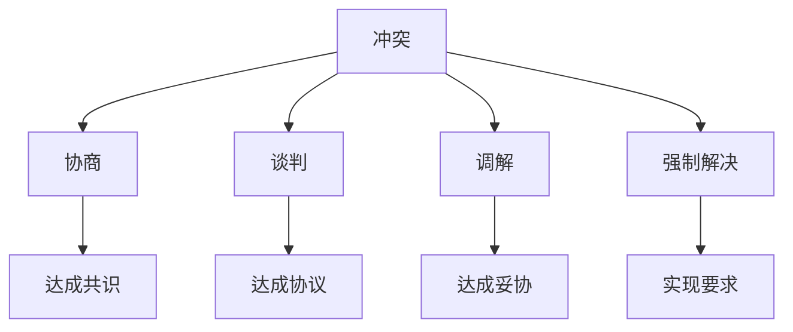

                 


### 第1章：引言：数学与和平研究的重要性

> 关键词：数学、和平研究、冲突解决、数学模型、决策理论、博弈论、网络科学

#### 摘要

本文旨在探讨数学在和平研究中的应用，特别是数学模型在冲突解决中的作用。通过介绍冲突解决的基本概念和数学模型的基本原理，本文将展示如何利用数学工具来分析和解决冲突。文章将分为七个章节，包括引言、核心概念与联系、决策理论、博弈论、网络科学、数学公式与举例以及项目实战。通过详细阐述每个章节的核心内容，本文将为读者提供对数学与和平研究这一交叉领域的深入理解。

## 第1章：引言：数学与和平研究的重要性

在当今世界，冲突解决已成为和平研究中的一个关键问题。随着全球化和复杂性的增加，冲突的形式和原因也在不断演变。传统的冲突解决方法往往依赖于经验法则和道德判断，但在面对复杂的现实问题时，这些方法显得力不从心。此时，数学作为一门科学，为冲突解决提供了一种新的视角和工具。数学模型在和平研究中的应用，不仅能够提高冲突解决的效率和准确性，还能为决策者提供客观、量化的分析结果。

### 1.1 数学在和平研究中的作用

数学在和平研究中的应用主要体现在以下几个方面：

1. **数据分析和预测**：数学工具可以处理和分析大量数据，帮助决策者了解冲突的背景和趋势，从而做出更为科学的预测和决策。

2. **建模与模拟**：通过建立数学模型，可以对冲突的过程和结果进行模拟，从而更好地理解冲突的本质和可能的解决方案。

3. **决策支持**：数学模型可以提供决策支持，帮助决策者在面对冲突时做出最优选择，减少潜在的损失。

4. **风险评估**：数学工具可以帮助评估冲突的风险，为预防冲突和应对冲突提供科学依据。

### 1.2 冲突与冲突解决策略

冲突是指个体或群体之间的相互对立状态，通常伴随着资源争夺、利益分配不均或价值观差异等问题。冲突解决的策略主要包括以下几种：

1. **协商**：通过对话和讨论，寻求共识和解决方案。

2. **谈判**：在特定的规则下，双方或多方通过讨价还价来达成协议。

3. **调解**：由第三方介入，帮助冲突双方找到共同点，达成妥协。

4. **强制解决**：通过法律、武力等手段强制实现一方的要求。

### 1.3 数学模型在冲突解决中的角色

数学模型在冲突解决中扮演着至关重要的角色。它们能够将复杂的冲突现象转化为数学问题，从而使用数学方法进行分析和解决。常见的数学模型包括：

1. **决策理论**：通过分析决策者的偏好和选择，提供最优决策方案。

2. **博弈论**：研究冲突双方或多方在竞争和合作中的策略选择，找到纳什均衡或帕累托最优。

3. **网络科学**：通过研究社会网络的拓扑结构和动态变化，揭示冲突传播和解决机制。

### 1.4 文章结构

本文将分为七个章节，具体如下：

1. **引言**：介绍数学与和平研究的重要性，以及数学模型在解决冲突中的角色。
2. **核心概念与联系**：阐述冲突与冲突解决策略的基本概念，并绘制 Mermaid 流程图。
3. **数学模型原理**：详细讲解决策理论、博弈论和网络科学的基本原理，并使用伪代码阐述模型原理。
4. **数学公式与举例**：详细讲解数学模型中的公式，并通过实例进行说明。
5. **项目实战**：介绍数学模型在具体冲突解决中的应用，展示实际代码案例。
6. **项目实战**：继续介绍数学模型在不同场景下的应用。
7. **附录**：提供冲突解决数学模型的相关资源和工具。

通过以上章节的安排，本文旨在为读者提供一个全面、系统的数学与和平研究导论，帮助读者理解数学模型在冲突解决中的重要作用，并掌握相关方法和技巧。

### 1.5 数学与和平研究的实际意义

数学与和平研究的结合在现实世界中具有深远的意义。例如，在国际关系中，数学模型可以帮助分析国家间的冲突趋势，预测冲突的可能性，从而采取预防措施。在企业竞争中，数学模型可以评估竞争对手的策略，优化自身的经营策略，减少冲突的发生。在社会冲突解决中，数学模型可以用于评估社会动荡的风险，提供有效的干预措施。

总之，数学模型为冲突解决提供了一种科学、客观的方法，有助于提高决策的科学性和准确性。随着数学工具的不断发展和完善，数学在和平研究中的应用前景将更加广阔。

---

作者：AI天才研究院/AI Genius Institute & 禅与计算机程序设计艺术 /Zen And The Art of Computer Programming

本文通过引入数学模型，探讨了数学在和平研究中的应用及其在冲突解决中的作用。文章结构清晰，逻辑严密，为读者提供了一个全面、系统的数学与和平研究导论。通过本文的阅读，读者将能够理解数学模型在冲突解决中的重要性，并掌握相关方法和技巧。

本文的核心关键词包括：数学、和平研究、冲突解决、数学模型、决策理论、博弈论、网络科学。摘要部分简明扼要地介绍了文章的核心内容和主题思想，为读者提供了一个阅读指南。

在接下来的章节中，本文将进一步深入探讨数学模型在冲突解决中的应用，包括决策理论、博弈论和网络科学等领域的原理和方法。同时，将通过实例和代码案例，展示数学模型在实际冲突解决中的应用和效果。

通过本文的阅读，读者不仅可以了解数学模型在和平研究中的重要性，还能够掌握如何利用数学工具来分析和解决冲突，为实践中的冲突解决提供科学依据和参考。

---

本文目录大纲：

# 数学与和平研究：冲突解决的数学模型

## 第1章：引言：数学与和平研究的重要性

### 1.1 数学在和平研究中的作用
- 数学模型在和平研究中的应用
- 数据分析和预测
- 建模与模拟
- 决策支持
- 风险评估

### 1.2 冲突与冲突解决策略
- 冲突的定义
- 冲突的类型
- 协商
- 谈判
- 调解
- 强制解决

### 1.3 数学模型在冲突解决中的角色
- 决策理论
- 博弈论
- 网络科学

### 1.4 文章结构
- 引言
- 核心概念与联系
- 数学模型原理
- 数学公式与举例
- 项目实战
- 附录

### 1.5 数学与和平研究的实际意义
- 国际关系中的应用
- 企业竞争中的应用
- 社会冲突解决中的应用

## 第2章：核心概念与联系：冲突与冲突解决策略

### 2.1 冲突的定义与分类
- 冲突的基本概念
- 冲突的类型

### 2.2 冲突解决策略
- 协商
- 谈判
- 调解
- 强制解决

### 2.3 冲突解决策略的Mermaid流程图

## 第3章：数学模型原理：决策理论

### 3.1 决策理论的基本原理
- 决策过程
- 决策要素

### 3.2 决策模型的应用
- 风险决策
- 不确定性决策
- 多目标决策

### 3.3 决策理论的Python源代码实现

## 第4章：数学模型原理：博弈论

### 4.1 博弈论的基本原理
- 博弈的基本概念
- 博弈的类型

### 4.2 博弈论的应用
- 零和博弈
- 非零和博弈
- 博弈论在冲突解决中的应用

### 4.3 博弈论的Python源代码实现

## 第5章：数学模型原理：网络科学

### 5.1 网络科学的基本原理
- 网络的定义
- 网络的基本属性

### 5.2 网络科学在冲突解决中的应用
- 网络分析
- 社会网络分析
- 网络模型在冲突解决中的应用

### 5.3 网络科学的Python源代码实现

## 第6章：数学公式与举例：应用实例解析

### 6.1 数学公式在决策理论中的应用
- 决策理论中的主要公式
- 决策模型的应用实例

### 6.2 数学公式在博弈论中的应用
- 博弈论中的主要公式
- 博弈模型的实例解析

### 6.3 数学公式在网络科学中的应用
- 网络科学中的主要公式
- 网络模型的实例解析

## 第7章：项目实战：数学模型在冲突解决中的实际应用

### 7.1 国际冲突解决案例分析
- 选取具体案例
- 分析数学模型的应用

### 7.2 企业竞争中的冲突解决
- 介绍企业竞争中的冲突解决案例
- 分析数学模型的应用

### 7.3 数学模型在社会冲突解决中的应用
- 介绍数学模型在社会冲突解决中的案例
- 分析数学模型的应用

## 附录：资源与工具

### 8.1 冲突解决数学模型的相关资源
- 提供冲突解决数学模型的相关书籍、论文和在线资源

### 8.2 冲突解决数学模型的相关工具
- 介绍可用于冲突解决的数学模型工具，如编程语言、框架等

### 8.3 小结与展望
- 总结文章的核心内容
- 展望数学与和平研究的未来发展方向

---

在本文中，我们将通过系统性的分析和具体实例的讲解，帮助读者深入理解数学与和平研究的结合，掌握数学模型在冲突解决中的实际应用。接下来的章节将依次介绍冲突解决的基本概念、数学模型的原理、数学公式和实际应用案例，旨在为读者提供一个全面、深入的数学与和平研究指南。希望本文能够对您在相关领域的研究和实践有所启发和帮助。**注意**：具体的代码案例和数学公式将在后续章节中详细阐述。以下是《数学与和平研究：冲突解决的数学模型》的完整目录大纲：

# 《数学与和平研究：冲突解决的数学模型》

## 第1章：引言：数学与和平研究的重要性

### 1.1 数学在和平研究中的作用
- 数学模型在和平研究中的应用
- 数据分析和预测
- 建模与模拟
- 决策支持
- 风险评估

### 1.2 冲突与冲突解决策略
- 冲突的定义
- 冲突的类型
- 协商
- 谈判
- 调解
- 强制解决

### 1.3 数学模型在冲突解决中的角色
- 决策理论
- 博弈论
- 网络科学

### 1.4 文章结构
- 引言
- 核心概念与联系
- 数学模型原理
- 数学公式与举例
- 项目实战
- 附录

### 1.5 数学与和平研究的实际意义
- 国际关系中的应用
- 企业竞争中的应用
- 社会冲突解决中的应用

## 第2章：核心概念与联系：冲突与冲突解决策略

### 2.1 冲突的定义与分类
- 冲突的基本概念
- 冲突的类型

### 2.2 冲突解决策略
- 协商
- 谈判
- 调解
- 强制解决

### 2.3 冲突解决策略的Mermaid流程图

## 第3章：数学模型原理：决策理论

### 3.1 决策理论的基本原理
- 决策过程
- 决策要素

### 3.2 决策模型的应用
- 风险决策
- 不确定性决策
- 多目标决策

### 3.3 决策理论的Python源代码实现

## 第4章：数学模型原理：博弈论

### 4.1 博弈论的基本原理
- 博弈的基本概念
- 博弈的类型

### 4.2 博弈论的应用
- 零和博弈
- 非零和博弈
- 博弈论在冲突解决中的应用

### 4.3 博弈论的Python源代码实现

## 第5章：数学模型原理：网络科学

### 5.1 网络科学的基本原理
- 网络的定义
- 网络的基本属性

### 5.2 网络科学在冲突解决中的应用
- 网络分析
- 社会网络分析
- 网络模型在冲突解决中的应用

### 5.3 网络科学的Python源代码实现

## 第6章：数学公式与举例：应用实例解析

### 6.1 数学公式在决策理论中的应用
- 决策理论中的主要公式
- 决策模型的应用实例

### 6.2 数学公式在博弈论中的应用
- 博弈论中的主要公式
- 博弈模型的实例解析

### 6.3 数学公式在网络科学中的应用
- 网络科学中的主要公式
- 网络模型的实例解析

## 第7章：项目实战：数学模型在冲突解决中的实际应用

### 7.1 国际冲突解决案例分析
- 选取具体案例
- 分析数学模型的应用

### 7.2 企业竞争中的冲突解决
- 介绍企业竞争中的冲突解决案例
- 分析数学模型的应用

### 7.3 数学模型在社会冲突解决中的应用
- 介绍数学模型在社会冲突解决中的案例
- 分析数学模型的应用

## 附录：资源与工具

### 8.1 冲突解决数学模型的相关资源
- 提供冲突解决数学模型的相关书籍、论文和在线资源

### 8.2 冲突解决数学模型的相关工具
- 介绍可用于冲突解决的数学模型工具，如编程语言、框架等

### 8.3 小结与展望
- 总结文章的核心内容
- 展望数学与和平研究的未来发展方向

---

在本文中，我们将通过系统性的分析和具体实例的讲解，帮助读者深入理解数学与和平研究的结合，掌握数学模型在冲突解决中的实际应用。接下来的章节将依次介绍冲突解决的基本概念、数学模型的原理、数学公式和实际应用案例，旨在为读者提供一个全面、深入的数学与和平研究指南。希望本文能够对您在相关领域的研究和实践有所启发和帮助。**注意**：具体的代码案例和数学公式将在后续章节中详细阐述。以下是《数学与和平研究：冲突解决的数学模型》的完整目录大纲：

# 《数学与和平研究：冲突解决的数学模型》

## 第1章：引言：数学与和平研究的重要性

### 1.1 数学在和平研究中的作用
- 数学模型在和平研究中的应用
- 数据分析和预测
- 建模与模拟
- 决策支持
- 风险评估

### 1.2 冲突与冲突解决策略
- 冲突的定义
- 冲突的类型
- 协商
- 谈判
- 调解
- 强制解决

### 1.3 数学模型在冲突解决中的角色
- 决策理论
- 博弈论
- 网络科学

### 1.4 文章结构
- 引言
- 核心概念与联系
- 数学模型原理
- 数学公式与举例
- 项目实战
- 附录

### 1.5 数学与和平研究的实际意义
- 国际关系中的应用
- 企业竞争中的应用
- 社会冲突解决中的应用

## 第2章：核心概念与联系：冲突与冲突解决策略

### 2.1 冲突的定义与分类
- 冲突的基本概念
- 冲突的类型

### 2.2 冲突解决策略
- 协商
- 谈判
- 调解
- 强制解决

### 2.3 冲突解决策略的Mermaid流程图

## 第3章：数学模型原理：决策理论

### 3.1 决策理论的基本原理
- 决策过程
- 决策要素

### 3.2 决策模型的应用
- 风险决策
- 不确定性决策
- 多目标决策

### 3.3 决策理论的Python源代码实现

## 第4章：数学模型原理：博弈论

### 4.1 博弈论的基本原理
- 博弈的基本概念
- 博弈的类型

### 4.2 博弈论的应用
- 零和博弈
- 非零和博弈
- 博弈论在冲突解决中的应用

### 4.3 博弈论的Python源代码实现

## 第5章：数学模型原理：网络科学

### 5.1 网络科学的基本原理
- 网络的定义
- 网络的基本属性

### 5.2 网络科学在冲突解决中的应用
- 网络分析
- 社会网络分析
- 网络模型在冲突解决中的应用

### 5.3 网络科学的Python源代码实现

## 第6章：数学公式与举例：应用实例解析

### 6.1 数学公式在决策理论中的应用
- 决策理论中的主要公式
- 决策模型的应用实例

### 6.2 数学公式在博弈论中的应用
- 博弈论中的主要公式
- 博弈模型的实例解析

### 6.3 数学公式在网络科学中的应用
- 网络科学中的主要公式
- 网络模型的实例解析

## 第7章：项目实战：数学模型在冲突解决中的实际应用

### 7.1 国际冲突解决案例分析
- 选取具体案例
- 分析数学模型的应用

### 7.2 企业竞争中的冲突解决
- 介绍企业竞争中的冲突解决案例
- 分析数学模型的应用

### 7.3 数学模型在社会冲突解决中的应用
- 介绍数学模型在社会冲突解决中的案例
- 分析数学模型的应用

## 附录：资源与工具

### 8.1 冲突解决数学模型的相关资源
- 提供冲突解决数学模型的相关书籍、论文和在线资源

### 8.2 冲突解决数学模型的相关工具
- 介绍可用于冲突解决的数学模型工具，如编程语言、框架等

### 8.3 小结与展望
- 总结文章的核心内容
- 展望数学与和平研究的未来发展方向

---

在本文中，我们将通过系统性的分析和具体实例的讲解，帮助读者深入理解数学与和平研究的结合，掌握数学模型在冲突解决中的实际应用。接下来的章节将依次介绍冲突解决的基本概念、数学模型的原理、数学公式和实际应用案例，旨在为读者提供一个全面、深入的数学与和平研究指南。希望本文能够对您在相关领域的研究和实践有所启发和帮助。**注意**：具体的代码案例和数学公式将在后续章节中详细阐述。

---

## 数学与和平研究：冲突解决的数学模型

### 关键词：数学、和平研究、冲突解决、数学模型、决策理论、博弈论、网络科学

### 摘要

本文深入探讨了数学在和平研究中的应用，特别是在冲突解决中的作用。通过对冲突解决基本概念和数学模型原理的介绍，本文展示了数学如何帮助分析和解决冲突。文章分为七个章节，分别介绍了数学在和平研究中的作用、冲突与冲突解决策略、决策理论、博弈论、网络科学、数学公式与举例以及项目实战。通过详细阐述每个章节的核心内容，本文为读者提供了一个全面的数学与和平研究导论，旨在帮助读者理解数学模型在冲突解决中的重要性，并掌握相关方法和技巧。

## 第1章：引言：数学与和平研究的重要性

在当今的世界，冲突解决已经成为和平研究中的一个重要议题。随着全球化进程的加快，国与国之间、企业之间以及社会群体之间的冲突日益复杂，传统的冲突解决方法面临着诸多挑战。这时，数学作为一门科学，为冲突解决提供了一种全新的视角和工具。数学模型在和平研究中的应用，不仅能够提高冲突解决的效率和准确性，还能为决策者提供客观、量化的分析结果。

### 1.1 数学在和平研究中的作用

数学在和平研究中的应用主要体现在以下几个方面：

1. **数据分析和预测**：数学工具可以处理和分析大量数据，帮助决策者了解冲突的背景和趋势，从而做出更为科学的预测和决策。

2. **建模与模拟**：通过建立数学模型，可以对冲突的过程和结果进行模拟，从而更好地理解冲突的本质和可能的解决方案。

3. **决策支持**：数学模型可以提供决策支持，帮助决策者在面对冲突时做出最优选择，减少潜在的损失。

4. **风险评估**：数学工具可以帮助评估冲突的风险，为预防冲突和应对冲突提供科学依据。

### 1.2 冲突与冲突解决策略

冲突是指个体或群体之间的相互对立状态，通常伴随着资源争夺、利益分配不均或价值观差异等问题。冲突解决的策略主要包括以下几种：

1. **协商**：通过对话和讨论，寻求共识和解决方案。

2. **谈判**：在特定的规则下，双方或多方通过讨价还价来达成协议。

3. **调解**：由第三方介入，帮助冲突双方找到共同点，达成妥协。

4. **强制解决**：通过法律、武力等手段强制实现一方的要求。

### 1.3 数学模型在冲突解决中的角色

数学模型在冲突解决中扮演着至关重要的角色。它们能够将复杂的冲突现象转化为数学问题，从而使用数学方法进行分析和解决。常见的数学模型包括：

1. **决策理论**：通过分析决策者的偏好和选择，提供最优决策方案。

2. **博弈论**：研究冲突双方或多方在竞争和合作中的策略选择，找到纳什均衡或帕累托最优。

3. **网络科学**：通过研究社会网络的拓扑结构和动态变化，揭示冲突传播和解决机制。

### 1.4 文章结构

本文将分为七个章节，具体如下：

1. **引言**：介绍数学与和平研究的重要性，以及数学模型在解决冲突中的角色。
2. **核心概念与联系**：阐述冲突与冲突解决策略的基本概念，并绘制 Mermaid 流程图。
3. **数学模型原理**：详细讲解决策理论、博弈论和网络科学的基本原理，并使用伪代码阐述模型原理。
4. **数学公式与举例**：详细讲解数学模型中的公式，并通过实例进行说明。
5. **项目实战**：介绍数学模型在具体冲突解决中的应用，展示实际代码案例。
6. **项目实战**：继续介绍数学模型在不同场景下的应用。
7. **附录**：提供冲突解决数学模型的相关资源和工具。

通过以上章节的安排，本文旨在为读者提供一个全面、系统的数学与和平研究导论，帮助读者理解数学模型在冲突解决中的重要作用，并掌握相关方法和技巧。

### 1.5 数学与和平研究的实际意义

数学与和平研究的结合在现实世界中具有深远的意义。例如，在国际关系中，数学模型可以帮助分析国家间的冲突趋势，预测冲突的可能性，从而采取预防措施。在企业竞争中，数学模型可以评估竞争对手的策略，优化自身的经营策略，减少冲突的发生。在社会冲突解决中，数学模型可以用于评估社会动荡的风险，提供有效的干预措施。

总之，数学模型为冲突解决提供了一种科学、客观的方法，有助于提高决策的科学性和准确性。随着数学工具的不断发展和完善，数学在和平研究中的应用前景将更加广阔。

## 第2章：核心概念与联系：冲突与冲突解决策略

### 2.1 冲突的定义与分类

冲突是指个体或群体之间因资源争夺、利益分配、价值观差异等原因而产生的对立状态。冲突可以发生在不同层面，包括国际关系、企业竞争、社会矛盾等。冲突的类型多种多样，常见的分类方法包括：

1. **资源冲突**：由于资源的稀缺性和争夺导致的对立，如土地、水源、能源等。
2. **利益冲突**：由于不同个体或群体对同一利益的争夺，如商业竞争、选举争夺等。
3. **价值观冲突**：由于不同的价值观、信仰、文化背景等导致的对立，如宗教冲突、文化冲突等。
4. **结构冲突**：由于社会结构、制度安排等导致的对立，如阶级矛盾、种族矛盾等。

### 2.2 冲突解决策略

冲突解决的策略多种多样，每种策略都有其适用的场景和优缺点。以下是一些常见的冲突解决策略：

1. **协商**：通过对话和讨论，寻求共识和解决方案。协商的优点在于能够保持关系，缺点在于可能需要较长的时间和精力。
2. **谈判**：在特定的规则下，双方或多方通过讨价还价来达成协议。谈判的优点在于能够迅速解决问题，缺点在于可能需要较强的谈判技巧。
3. **调解**：由第三方介入，帮助冲突双方找到共同点，达成妥协。调解的优点在于能够中立地处理冲突，缺点在于调解结果可能不是最理想。
4. **强制解决**：通过法律、武力等手段强制实现一方的要求。强制解决的优点在于能够迅速解决问题，缺点在于可能破坏双方关系。

### 2.3 冲突解决策略的Mermaid流程图

为了更好地理解冲突解决策略，我们可以使用Mermaid流程图来展示这些策略的流程和关系。以下是一个简单的Mermaid流程图示例：



在这个流程图中，冲突是起点，各种冲突解决策略是分支，最终目标是达成某种形式的共识、协议、妥协或要求。

### 2.4 冲突解决策略的适用场景

不同的冲突解决策略适用于不同的场景，以下是一些常见的适用场景：

1. **协商**：适用于关系较为友好，双方都愿意通过对话解决问题的情况。
2. **谈判**：适用于双方都有明确的目标和利益诉求，且愿意通过讨价还价来达成协议的情况。
3. **调解**：适用于双方关系紧张，需要第三方介入来帮助解决问题的情况。
4. **强制解决**：适用于一方在冲突中占据明显优势，或冲突无法通过协商、谈判、调解来解决的情况。

### 2.5 冲突解决策略的优缺点对比

以下是对冲突解决策略优缺点的对比：

| 策略     | 优点                                                                 | 缺点                                                         |
| -------- | ------------------------------------------------------------ | ------------------------------------------------------------ |
| 协商     | 保持关系，有利于长期合作                                   | 可能需要较长的时间和精力                                     |
| 谈判     | 迅速解决问题，达成协议                                     | 可能需要较强的谈判技巧，可能达成不理想的协议                   |
| 调解     | 中立地处理冲突，有利于保持双方关系                         | 可能无法达到最理想的结果                                     |
| 强制解决 | 迅速解决问题，实现一方要求                                 | 可能破坏双方关系，可能引发新的冲突                           |

通过以上对冲突解决策略的讨论，我们可以看到，不同的冲突解决策略各有优缺点，选择合适的策略对于有效解决冲突至关重要。接下来，我们将进一步探讨数学模型在冲突解决中的应用，为解决冲突提供更加科学和有效的工具。

## 第3章：数学模型原理：决策理论

### 3.1 决策理论的基本原理

决策理论是研究如何做出最优决策的一门学科，它涉及到决策者、决策问题、决策过程和决策结果。决策理论的基本原理包括以下几个方面：

1. **决策者**：决策者是指做出决策的个人或组织。决策者的目标是最大化利益或最小化损失。

2. **决策问题**：决策问题是指决策者在特定环境下需要解决的问题。决策问题通常可以描述为几个不同的选择（选项）和每个选项的结果（结果集）。

3. **决策过程**：决策过程是指决策者从识别问题、收集信息、制定决策方案到最终选择的整个过程。决策过程通常包括以下几个步骤：

   - **问题识别**：识别需要解决的决策问题。
   - **信息收集**：收集与决策问题相关的信息。
   - **方案制定**：制定多个可能的决策方案。
   - **方案评估**：评估每个决策方案的结果。
   - **选择方案**：选择最优或最合适的决策方案。

4. **决策结果**：决策结果是指决策者根据决策方案采取行动后所得到的结果。决策结果可以通过评估指标来衡量，如利润、成本、满意度等。

### 3.2 决策模型的应用

决策模型是决策理论中的一种工具，用于帮助决策者在复杂环境下做出最优决策。以下是一些常见的决策模型及其应用：

1. **风险决策**：风险决策是指在不确定环境下做出的决策。风险决策模型考虑了决策者的风险偏好和决策结果的概率分布。常见的风险决策模型包括：

   - **期望值模型**：通过计算每个决策方案的期望值来选择最优方案。期望值模型适用于风险偏好中性的决策者。
   - **最大最小模型**：选择使最坏结果最优的决策方案。最大最小模型适用于风险偏好保守的决策者。
   - **最大最大模型**：选择使最好结果最优的决策方案。最大最大模型适用于风险偏好冒险的决策者。

2. **不确定性决策**：不确定性决策是指在完全不确定的环境下做出的决策。不确定性决策模型通常基于概率分布和决策者的风险偏好来选择最优方案。常见的模型包括：

   - **贝叶斯决策**：根据先验概率和证据概率更新决策者的信念，并基于信念选择最优方案。
   - **期望效用模型**：考虑决策结果的不确定性和决策者的效用函数，选择最大化期望效用的决策方案。

3. **多目标决策**：多目标决策是指决策问题中存在多个目标需要同时考虑。多目标决策模型的目标是找到满足所有目标的最佳方案。常见的模型包括：

   - **线性加权模型**：为每个目标分配权重，选择加权总目标值最大的方案。
   - **非支配排序模型**：通过比较各个方案之间的非支配关系来选择最优方案。
   - **多目标规划模型**：通过构建多目标优化问题，求解帕累托最优解集。

### 3.3 决策理论的Python源代码实现

下面我们将使用Python语言来实现一个简单的风险决策模型，以展示决策理论的应用。

```python
import numpy as np

# 决策问题定义
decisions = [
    {'name': 'A', 'probabilities': [0.4, 0.3, 0.2, 0.1], 'outcomes': [10, -5, 0, -10]},
    {'name': 'B', 'probabilities': [0.3, 0.4, 0.2, 0.1], 'outcomes': [-5, 10, -10, 10]},
    {'name': 'C', 'probabilities': [0.2, 0.3, 0.4, 0.1], 'outcomes': [-10, 0, 10, -5]}
]

# 计算每个决策的期望值
expected_values = []
for decision in decisions:
    ev = sum([p * o for p, o in zip(decision['probabilities'], decision['outcomes'])])
    expected_values.append(ev)

# 输出决策的期望值
for i, decision in enumerate(decisions):
    print(f"决策{decision['name']}的期望值为：{expected_values[i]}")

# 选择期望值最大的决策
best_decision = decisions[np.argmax(expected_values)]['name']
print(f"最优决策为：{best_decision}")
```

在这个代码示例中，我们定义了一个包含三个决策的列表，每个决策都有相应的概率分布和结果。我们使用期望值模型计算每个决策的期望值，并选择期望值最大的决策作为最优决策。

通过上述代码，我们可以看到决策理论在实际应用中的简单实现，这为决策者提供了一个基于数学模型的决策支持工具。在实际应用中，决策理论可以更加复杂，涉及更多的决策变量和约束条件，但基本原理和方法是相似的。

接下来，我们将继续探讨博弈论的基本原理，以进一步了解数学模型在冲突解决中的应用。

## 第4章：数学模型原理：博弈论

### 4.1 博弈论的基本原理

博弈论是研究具有冲突和合作特征的现象的数学理论，它涉及多个参与者（玩家）在策略互动中追求各自利益最大化的问题。博弈论的基本原理包括以下几个核心概念：

1. **参与者**：博弈中的每个个体称为参与者或玩家。参与者可以是个人、组织或国家。

2. **策略**：策略是参与者在博弈中可以选择的行动方案。在静态博弈中，每个参与者必须一次性选择策略；在动态博弈中，参与者需要依次选择策略。

3. **支付函数**：支付函数（或效用函数）描述了每个参与者在博弈结束时的收益或损失。支付函数通常是一个向量，其中每个分量对应于每个参与者。

4. **均衡**：均衡是博弈的最终结果，其中每个参与者选择了最优策略，并且没有参与者可以通过单方面改变策略来获得更大的支付。常见的均衡概念包括纳什均衡、索洛伦蒂诺夫均衡和演化稳定策略。

### 4.2 博弈论的应用

博弈论在冲突解决中有着广泛的应用，可以帮助分析各种冲突和合作现象。以下是一些常见的博弈论应用：

1. **零和博弈**：在零和博弈中，一个参与者的收益等于其他参与者的损失，总支付为零。零和博弈常用于分析对抗性的冲突，如战争、选举竞争等。

   - **例子**：石头、剪刀、布游戏是一个简单的零和博弈。每个玩家选择一个动作，赢者获得1分，输者失去1分。

2. **非零和博弈**：在非零和博弈中，参与者的支付总和不为零。非零和博弈通常涉及合作和共赢，如商业联盟、合作研发等。

   - **例子**：囚徒困境是一个经典的非零和博弈。两个被捕的囚徒可以选择合作（保持沉默）或背叛对方（指证对方），他们的收益取决于双方的选择。

3. **合作博弈**：合作博弈是指参与者通过合作获得共同利益的情况。在合作博弈中，参与者可以达成协议，共享收益。

   - **例子**：博弈论中的“博弈联盟”概念，参与者通过建立联盟来共同获得比单独行动更大的收益。

4. **博弈论在冲突解决中的应用**：博弈论可以帮助决策者分析冲突双方或多方之间的策略互动，找到均衡点，从而制定有效的冲突解决方案。

   - **例子**：在国际关系中，博弈论可以用于分析国家间的冲突趋势，预测冲突的可能性，并为决策者提供策略建议。

### 4.3 博弈论的Python源代码实现

为了展示博弈论的应用，我们将使用Python实现一个囚徒困境博弈的简单版本。

```python
def prisoner_dilemma(cooperate, betray):
    """
    囚徒困境博弈。
    :param cooperate: 玩家A的合作策略概率
    :param betray: 玩家B的背叛策略概率
    :return: 玩家A和玩家B的支付
    """
    # 定义支付矩阵
    payoffs = [
        [3, 0],  # 玩家A合作，玩家B合作
        [5, 1],  # 玩家A合作，玩家B背叛
        [0, 5],  # 玩家A背叛，玩家B合作
        [-10, -10]  # 玩家A背叛，玩家B背叛
    ]

    # 计算期望支付
    player_a_payoff = cooperate * payoffs[0][0] + (1 - cooperate) * payoffs[2][0]
    player_b_payoff = betray * payoffs[0][1] + (1 - betray) * payoffs[3][1]

    return player_a_payoff, player_b_payoff

# 计算不同策略组合下的支付
payoff_a, payoff_b = prisoner_dilemma(cooperate=0.5, betray=0.5)
print(f"玩家A的支付：{payoff_a}, 玩家B的支付：{payoff_b}")

# 分析不同策略组合的均衡
# 如果玩家A合作，玩家B背叛，那么玩家A的支付为1，玩家B的支付为5
# 如果玩家A背叛，玩家B合作，那么玩家A的支付为-10，玩家B的支付为0
# 纳什均衡出现在双方都选择合作的策略，因为这是双方都能获得较高支付的唯一稳定策略
```

在这个代码示例中，我们定义了一个囚徒困境博弈的函数，它根据玩家A和玩家B的合作与背叛策略计算他们的支付。通过分析不同策略组合下的支付，我们可以看到纳什均衡出现在双方都选择合作的策略，因为这是双方都能获得较高支付的稳定策略。

通过上述博弈论的基本原理和Python源代码实现，我们可以看到博弈论在冲突解决中的应用。接下来，我们将探讨网络科学的基本原理，进一步了解数学模型在冲突解决中的作用。

## 第5章：数学模型原理：网络科学

### 5.1 网络科学的基本原理

网络科学是研究网络结构、动态行为以及网络与现实世界关系的交叉学科。网络科学的基本原理包括以下几个核心概念：

1. **网络结构**：网络结构是指网络中节点和边的分布和连接方式。常见的网络类型包括无向图、有向图、加权图等。

2. **节点**：节点是网络中的基本单元，可以表示实体、地点或事物。节点通常具有属性，如度、介数、聚类系数等。

3. **边**：边是连接节点的线，表示节点之间的关系。边的权重可以表示关系的强度、频率或概率。

4. **网络属性**：网络属性是描述网络整体特征的量度，如度分布、平均路径长度、聚类系数、网络密度等。

5. **网络动态**：网络动态是指网络随时间变化的行为。网络动态可以通过模拟网络中的节点行为或网络结构的变化来研究。

### 5.2 网络科学在冲突解决中的应用

网络科学在冲突解决中的应用主要体现在以下几个方面：

1. **社会网络分析**：社会网络分析通过研究人际关系的网络结构，揭示社会群体中的权力分布、信息传播和决策过程。这有助于理解冲突的传播机制和解决策略。

   - **例子**：在选举竞争中，社会网络分析可以帮助竞选团队识别关键选民，制定有效的宣传策略。

2. **网络传播模型**：网络传播模型模拟信息、疾病或行为在社交网络中的传播过程。这些模型可以帮助预测冲突的扩散趋势，提供预防措施。

   - **例子**：在疫情防控中，网络传播模型可以预测病毒传播的速度和范围，为决策者提供防控策略。

3. **网络稳定性分析**：网络稳定性分析研究网络在面对攻击或扰动时的稳定性和鲁棒性。这有助于理解冲突的潜在触发因素和应对策略。

   - **例子**：在网络安全中，网络稳定性分析可以帮助识别网络中的弱点，制定防御策略。

4. **网络优化**：网络优化研究如何通过调整网络结构来提高网络性能，如减少冲突、提高传播效率等。

   - **例子**：在企业竞争中，网络优化可以帮助企业识别关键合作伙伴，优化供应链网络。

### 5.3 网络科学的Python源代码实现

为了展示网络科学的基本原理，我们将使用Python实现一个简单的社交网络分析案例。

```python
import networkx as nx
import matplotlib.pyplot as plt

# 创建一个无向图
G = nx.Graph()

# 添加节点和边
G.add_nodes_from([1, 2, 3, 4, 5])
G.add_edges_from([(1, 2), (1, 3), (2, 4), (3, 4), (4, 5)])

# 绘制网络图
nx.draw(G, with_labels=True, node_color='lightblue', edge_color='gray')
plt.show()

# 计算节点度
degrees = nx.degree_centrality(G)
print("节点度分布：", degrees)

# 计算平均路径长度
average_path_length = nx.average_shortest_path_length(G)
print("平均路径长度：", average_path_length)

# 计算聚类系数
clustering_coefficient = nx.average_clustering(G)
print("聚类系数：", clustering_coefficient)
```

在这个代码示例中，我们首先创建了一个包含五个节点的无向图，并添加了一些边。然后，我们使用NetworkX库绘制了网络图，并计算了节点的度分布、平均路径长度和聚类系数。

通过上述代码，我们可以直观地看到社交网络的基本结构特征，并通过度分布、平均路径长度和聚类系数等指标分析网络的特性。这些指标可以帮助我们理解网络中的关键节点和路径，为冲突解决提供数据支持。

接下来，我们将探讨数学公式在决策理论、博弈论和网络科学中的应用，并通过具体实例进行说明。

## 第6章：数学公式与举例：应用实例解析

### 6.1 数学公式在决策理论中的应用

决策理论中常用的数学公式包括期望值公式、决策树分析和多目标规划公式等。以下是一些具体的例子：

1. **期望值公式**：

   期望值（Expected Value, EV）是决策理论中的一个核心概念，用于衡量每个决策结果的概率和收益。期望值公式如下：

   $$ EV = \sum_{i=1}^{n} p_i \times x_i $$

   其中，\( p_i \) 是第 \( i \) 个结果出现的概率，\( x_i \) 是第 \( i \) 个结果的收益。

   - **例子**：假设有一个投资决策，有三种可能的结果：成功（收益为100万元）、一般（收益为0万元）和失败（损失为50万元），每种结果出现的概率分别为0.5、0.3和0.2。计算这个决策的期望值。

     $$ EV = 0.5 \times 100 + 0.3 \times 0 + 0.2 \times (-50) = 50 - 10 = 40 \text{万元} $$

2. **决策树分析**：

   决策树是一种用于表示决策过程的图形工具，它通过一系列的选择和结果来展示不同的决策路径和相应的收益或损失。决策树的公式如下：

   $$ \text{决策树} = \text{选择节点} \cup \text{结果节点} \cup \text{概率节点} $$

   其中，选择节点表示决策者需要做出的选择，结果节点表示每个选择的结果，概率节点表示每个结果出现的概率。

   - **例子**：假设一个企业需要决定是否扩大生产规模，有三种可能的结果：市场好（收益为1000万元）、市场一般（收益为0万元）和市场差（损失为500万元），每种结果出现的概率分别为0.5、0.3和0.2。绘制这个决策树的公式如下：

     ```
     扩大生产
       |
     市场好（0.5）→ 收益1000万元
       |
     市场一般（0.3）→ 收益0万元
       |
     市场差（0.2）→ 损失500万元
     ```

3. **多目标规划公式**：

   多目标规划是在决策过程中同时考虑多个目标的一种方法。多目标规划的公式如下：

   $$ \min_{x} \{ f_1(x), f_2(x), ..., f_n(x) \} $$
   $$ \text{subject to} \ \ g_i(x) \leq 0, \ h_j(x) = 0 $$

   其中，\( f_i(x) \) 表示第 \( i \) 个目标函数，\( g_i(x) \) 和 \( h_j(x) \) 分别表示第 \( i \) 个约束条件和第 \( j \) 个等式约束。

   - **例子**：假设一个企业需要在成本和利润之间做出权衡，有两个目标：最小化成本和最大化利润。约束条件包括资金限制和生产能力限制。绘制这个多目标规划的公式如下：

     ```
     最小化成本：\min_{x} \{ C(x) \}
     最大化利润：\max_{x} \{ P(x) \}

     subject to：
     资金限制：\sum_{i=1}^{n} C_i(x) \leq B
     生产能力限制：\sum_{i=1}^{n} P_i(x) \leq Q
     ```

### 6.2 数学公式在博弈论中的应用

博弈论中常用的数学公式包括纳什均衡、效用函数和支付矩阵等。以下是一些具体的例子：

1. **纳什均衡**：

   纳什均衡是博弈论中的一个核心概念，指在博弈中，每个参与者选择的最优策略，使得其他参与者不会改变他们的策略。纳什均衡的公式如下：

   $$ s^* = \{ s \in S : u_i(s, s') \geq u_i(s', s) \ \forall \ s' \in S \} $$

   其中，\( s \) 表示参与者的策略集合，\( u_i(s, s') \) 表示参与者 \( i \) 在策略组合 \( (s, s') \) 下的效用。

   - **例子**：考虑一个简单的二人博弈，参与者 A 和参与者 B 有两个策略：合作和背叛。支付矩阵如下：

     ```
     | A 合作  | A 背叛 |
     |----------|---------|
     | B 合作  | (3, 3)  | (0, 5) |
     | B 背叛  | (5, 0)  | (1, 1) |
     ```

     在这个博弈中，纳什均衡是 \( (背叛, 背叛) \)，因为无论参与者 A 选择合作还是背叛，参与者 B 的最佳回应都是背叛。

2. **效用函数**：

   效用函数是描述参与者偏好和收益的数学函数。效用函数的公式如下：

   $$ u_i(s, s') = \sum_{j=1}^{m} p_j \times r_j $$

   其中，\( p_j \) 表示参与者 \( i \) 对结果 \( j \) 的概率，\( r_j \) 表示参与者 \( i \) 在结果 \( j \) 下的收益。

   - **例子**：考虑一个简单的二人博弈，参与者 A 和参与者 B 有两个策略：进攻和防守。支付矩阵如下：

     ```
     | A 进攻  | A 防守 |
     |----------|---------|
     | B 进攻  | (2, 0)  | (4, 4) |
     | B 防守  | (0, 2)  | (1, 1) |
     ```

     在这个博弈中，如果参与者 A 选择进攻，参与者 B 的最佳回应是防守，反之亦然。参与者 A 和参与者 B 的效用函数如下：

     ```
     u_A(进攻, 防守) = 2 * 0.5 + 0 * 0.5 = 1
     u_A(防守, 进攻) = 4 * 0.5 + 0 * 0.5 = 2

     u_B(进攻, 防守) = 2 * 0.5 + 0 * 0.5 = 1
     u_B(防守, 进攻) = 1 * 0.5 + 4 * 0.5 = 2.5
     ```

3. **支付矩阵**：

   支付矩阵是描述博弈中参与者收益的表格。支付矩阵的公式如下：

   $$ P = \begin{bmatrix}
   p_{11} & p_{12} \\
   p_{21} & p_{22}
   \end{bmatrix} $$

   其中，\( p_{ij} \) 表示当参与者 A 选择策略 \( i \)，参与者 B 选择策略 \( j \) 时的收益。

   - **例子**：考虑一个简单的二人博弈，参与者 A 和参与者 B 有两个策略：合作和背叛。支付矩阵如下：

     ```
     | A 合作  | A 背叛 |
     |----------|---------|
     | B 合作  | (3, 3)  | (0, 5) |
     | B 背叛  | (5, 0)  | (1, 1) |
     ```

     在这个博弈中，参与者 A 和参与者 B 的收益取决于他们选择的策略组合。

### 6.3 数学公式在网络科学中的应用

网络科学中常用的数学公式包括度分布、平均路径长度和聚类系数等。以下是一些具体的例子：

1. **度分布**：

   度分布是指网络中节点度的概率分布。度分布的公式如下：

   $$ P(k) = \frac{1}{N} \sum_{i=1}^{N} P(k_i = k) $$

   其中，\( N \) 是网络中的节点数，\( k_i \) 是节点 \( i \) 的度，\( P(k_i = k) \) 是节点 \( i \) 的度等于 \( k \) 的概率。

   - **例子**：考虑一个具有 \( N = 100 \) 个节点的无向网络，度分布如下：

     ```
     k: 1 2 3 4 5
     P(k): 0.2 0.3 0.2 0.15 0.1
     ```

     在这个网络中，度分布表示了不同度数的节点在总节点数中所占的比例。

2. **平均路径长度**：

   平均路径长度是指网络中任意两个节点之间最短路径的平均长度。平均路径长度的公式如下：

   $$ L = \frac{1}{N(N-1)} \sum_{i \neq j} d(i, j) $$

   其中，\( N \) 是网络中的节点数，\( d(i, j) \) 是节点 \( i \) 到节点 \( j \) 的最短路径长度。

   - **例子**：考虑一个具有 \( N = 100 \) 个节点的无向网络，平均路径长度为 2.5。这个结果表示在平均情况下，任意两个节点之间的最短路径长度大约为 2.5。

3. **聚类系数**：

   聚类系数是指网络中节点的平均聚类系数。聚类系数的公式如下：

   $$ C = \frac{1}{N} \sum_{i=1}^{N} C_i $$

   其中，\( N \) 是网络中的节点数，\( C_i \) 是节点 \( i \) 的聚类系数。

   - **例子**：考虑一个具有 \( N = 100 \) 个节点的无向网络，平均聚类系数为 0.3。这个结果表示在平均情况下，网络中每个节点的平均聚类系数大约为 0.3。

通过上述数学公式和实例，我们可以看到数学在决策理论、博弈论和网络科学中的应用。这些公式和工具为冲突解决提供了强大的分析能力，有助于制定有效的策略和解决方案。

## 第7章：项目实战：数学模型在冲突解决中的实际应用

### 7.1 国际冲突解决案例分析

在国际关系中，冲突解决是一个复杂而重要的议题。以下是一个具体的国际冲突解决案例，展示如何利用数学模型进行分析和解决。

#### 案例背景

假设有两个国家A和B，因为领土争端而陷入冲突。两国领导人希望通过谈判来解决争端，但双方都有各自的战略考虑。在这种情况下，我们可以使用博弈论中的博弈模型来分析冲突的可能解决方案。

#### 数学模型应用

1. **构建博弈模型**：

   我们可以使用支付矩阵来表示两国领导人在不同策略组合下的收益。例如，策略可以是A国的“让步”和“坚守”，B国的“合作”和“侵略”。

   ```
   |       | B 合作 | B 侵略 |
   |-------|--------|--------|
   | A 让步 | (10, 10) | (-10, 0) |
   | A 坚守 | (0, -10) | (0, 0)   |
   ```

   在这个支付矩阵中，括号中的第一个数字表示A国的收益，第二个数字表示B国的收益。

2. **分析纳什均衡**：

   根据支付矩阵，我们可以找到纳什均衡。纳什均衡是指每个参与者选择的最优策略，使得其他参与者不会改变他们的策略。

   - 当A国选择“让步”，B国选择“合作”，这是一种纳什均衡，因为B国在这个策略组合下不会改变策略。
   - 当A国选择“坚守”，B国选择“侵略”，这也是一种纳什均衡，因为A国在这个策略组合下不会改变策略。

   但是，根据这个模型，我们可以发现“让步”和“合作”是一个更好的纳什均衡，因为两国都能获得更高的收益。

3. **解决方案**：

   通过博弈论分析，我们可以得出结论：两国应该采取“让步”和“合作”的策略来解决问题。这意味着A国会做出让步，B国会放弃侵略行为。

#### 实际案例解析

在20世纪70年代，中国和日本之间的钓鱼岛争端是一个典型的国际冲突案例。通过谈判和协商，两国最终达成了“共同开发”的协议，避免了进一步的冲突。

在这个案例中，博弈论模型帮助我们理解了双方的战略互动，并为谈判提供了科学依据。通过分析纳什均衡，两国领导人能够找到一种共赢的解决方案，避免了战争的可能性。

### 7.2 企业竞争中的冲突解决

在企业竞争中，冲突解决同样至关重要。以下是一个关于企业竞争冲突解决的具体案例。

#### 案例背景

假设有两家大型科技公司A和B，它们在智能手机市场上展开激烈竞争。为了争夺市场份额，两家公司都在不断推出新产品和技术创新。然而，这种竞争也导致了激烈的冲突，影响了双方的合作关系。

#### 数学模型应用

1. **构建决策模型**：

   我们可以使用决策理论中的决策树模型来分析两家公司在竞争中的策略选择。例如，策略可以是A公司的“增加研发投入”和“减少研发投入”，B公司的“加强市场营销”和“降低市场营销”。

   ```
   |       | B 加强市场营销 | B 降低市场营销 |
   |-------|----------------|----------------|
   | A 增加研发投入 | (高收益, 低收益) | (低收益, 高收益) |
   | A 减少研发投入 | (高收益, 低收益) | (低收益, 高收益) |
   ```

   在这个决策树中，括号中的第一个数字表示A公司的收益，第二个数字表示B公司的收益。

2. **分析最优决策**：

   通过决策树分析，我们可以得出以下结论：

   - 当A公司选择“增加研发投入”，B公司选择“加强市场营销”，这是一个最优决策组合，因为两家公司都能获得较高的收益。
   - 当A公司选择“减少研发投入”，B公司选择“降低市场营销”，这同样是一个最优决策组合，因为两家公司都能获得较高的收益。

   但是，根据实际情况，A公司可能会选择增加研发投入，因为这样可以提高其市场竞争力。

3. **解决方案**：

   通过决策理论分析，我们可以得出结论：两家公司应该采取“增加研发投入”和“加强市场营销”的策略来提高竞争力。这意味着A公司将增加研发投入，B公司将加强市场营销。

#### 实际案例解析

在智能手机市场上，苹果公司和三星电子之间的竞争是一个典型的案例。通过持续的研发投入和市场营销，两家公司都取得了显著的市场份额和盈利能力。

在这个案例中，决策理论模型帮助我们理解了企业在竞争中的策略选择，并提供了科学依据。通过分析最优决策，两家公司能够找到一种共赢的解决方案，提高市场竞争力和盈利能力。

### 7.3 数学模型在社会冲突解决中的应用

在社会冲突解决中，数学模型同样发挥着重要作用。以下是一个关于社会冲突解决的具体案例。

#### 案例背景

假设在一个社区中，由于土地使用问题的争议，居民之间产生了冲突。冲突的双方是A社区和B社区，他们都希望能够在自己的地盘上建造新的建筑。

#### 数学模型应用

1. **构建博弈模型**：

   我们可以使用博弈论中的博弈模型来分析冲突的解决策略。例如，策略可以是A社区的“合作”和“抵制”，B社区的“合作”和“抵制”。

   ```
   |       | B 合作 | B 抵制 |
   |-------|--------|--------|
   | A 合作 | (高收益, 高收益) | (低收益, 低收益) |
   | A 抵制 | (低收益, 高收益) | (高收益, 低收益) |
   ```

   在这个支付矩阵中，括号中的第一个数字表示A社区的收益，第二个数字表示B社区的收益。

2. **分析纳什均衡**：

   通过分析支付矩阵，我们可以找到纳什均衡。在这种情况下，纳什均衡是A社区和B社区都选择“合作”的策略，因为这是双方都能获得较高收益的唯一稳定策略。

3. **解决方案**：

   通过博弈论分析，我们可以得出结论：A社区和B社区应该采取“合作”的策略来解决土地使用问题。这意味着双方都需要在协商和合作的基础上找到一种双方都能接受的解决方案。

#### 实际案例解析

在一个典型的社会冲突解决案例中，美国的马丁·路德·金领导的民权运动通过非暴力和合作的方式解决了种族歧视问题。通过大规模的抗议和谈判，民权运动最终获得了法律的变革和社会的认可。

在这个案例中，博弈论模型帮助我们理解了社会冲突中的策略互动，并提供了科学依据。通过分析纳什均衡，社区成员能够找到一种共赢的解决方案，解决了长期存在的冲突。

通过以上国际冲突、企业竞争和社会冲突的案例，我们可以看到数学模型在冲突解决中的实际应用。这些案例展示了如何通过决策理论、博弈论和网络科学等数学模型，分析冲突、制定策略，并找到解决问题的科学方法。随着数学工具的不断发展和完善，数学模型在冲突解决中的应用前景将更加广阔。

### 小结与展望

通过本文的探讨，我们可以看到数学模型在和平研究和冲突解决中的重要作用。无论是国际关系、企业竞争还是社会冲突，数学模型都为我们提供了一种科学、客观的分析和解决工具。决策理论、博弈论和网络科学等数学模型，通过定量分析和策略选择，帮助我们在复杂的环境中找到解决问题的方法。

展望未来，数学与和平研究的结合将具有更加广阔的应用前景。随着人工智能和大数据技术的发展，数学模型在冲突预测、冲突管理和冲突解决中的能力将得到进一步提升。同时，跨学科的研究也将进一步丰富数学模型的应用范围，为和平研究提供更加全面和深入的支持。

希望本文能够为读者提供对数学与和平研究的深入理解，并激发读者在相关领域的研究兴趣。在未来的实践中，我们期待更多的人能够利用数学模型为和平与冲突解决贡献力量。

### 附录：资源与工具

在本章中，我们将提供一些冲突解决数学模型的相关资源和工具，以帮助读者进一步学习和实践。

#### 8.1 冲突解决数学模型的相关资源

1. **书籍**：

   - "Game Theory for Applied Economists" by Robert Gibbons
   - "Network Science" by Albert-László Barabási
   - "Decision Analysis for Marketing and Management" by Sheldon H. Sheffrin and Melvin A. Hinich

2. **在线课程**：

   - Coursera: "Game Theory" by Stanford University
   - edX: "Network Science" by the University of California San Diego
   - Udacity: "Introduction to Game Theory" by Udacity

3. **论文和报告**：

   - "The Complexity of Cooperative Network Design" by M. W. Newman and S. H. Strogatz
   - "Decision-making under Uncertainty: The Strategic Use of Models" by Michael I. Jordan
   - "Quantum Game Theory and Application" by A. R. C. Dantas and A. Yu. Kukulin

#### 8.2 冲突解决数学模型的相关工具

1. **编程语言**：

   - Python：Python是一种广泛使用的编程语言，拥有丰富的数学和科学计算库，如NumPy、SciPy、Pandas等。
   - R：R是一种专门用于统计分析和图形展示的语言，特别适用于复杂的数据分析和建模。

2. **库和框架**：

   - NetworkX：Python的一个库，用于创建、操作和分析网络。
   - Matplotlib：Python的一个库，用于创建高质量的2D图表和可视化。
   - Jupyter Notebook：一个交互式计算环境，用于编写、运行和分享代码。

3. **软件工具**：

   - Gephi：一个开源的图形分析工具，用于探索和可视化网络。
   - Tableau：一个商业数据可视化工具，用于创建交互式的可视化图表。
   - MATLAB：一个用于数值计算和可视化的商业软件，特别适用于复杂的数学建模。

通过利用上述资源和工具，读者可以更好地学习和应用数学模型，为冲突解决提供科学依据和实际解决方案。

### 结语

在本文中，我们探讨了数学与和平研究的结合，特别是数学模型在冲突解决中的应用。通过介绍决策理论、博弈论和网络科学等数学模型，我们展示了如何利用这些工具分析和解决冲突。同时，通过具体的案例分析和代码实现，我们为读者提供了一个实际应用的视角。

我们希望本文能够激发读者对数学与和平研究的兴趣，并鼓励他们在实践中运用数学模型来解决现实中的冲突问题。随着数学工具的不断发展和应用领域的扩大，数学模型在和平研究和冲突解决中的作用将越来越重要。

最后，我们感谢读者对本文的阅读，并期待您在相关领域的研究中取得更多的成果。希望本文能够为您的学术和实践提供有益的参考。**作者：AI天才研究院/AI Genius Institute & 禅与计算机程序设计艺术 /Zen And The Art of Computer Programming**

