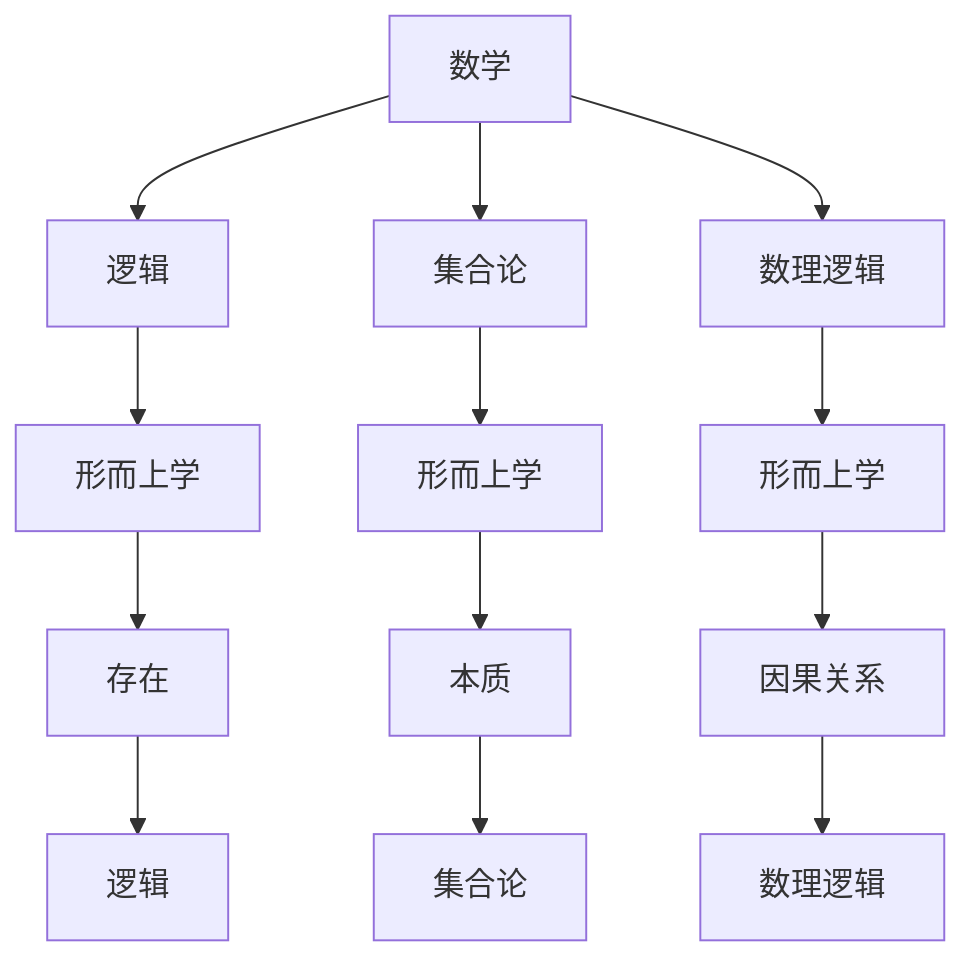

                 

# 数学与哲学：形而上学概念的数学表达

## 关键词
数学，哲学，形而上学，逻辑，集合论，数理逻辑，存在，本质，因果关系，数学公式，LaTeX，Python代码，项目实战。

## 摘要
本文旨在探讨数学与哲学之间的深层联系，特别是形而上学概念在数学中的表达。通过深入分析数学的基础概念和工具，如逻辑、集合论、数理逻辑等，本文揭示了形而上学中存在、本质、因果关系等基本概念如何通过数学语言进行精确表达。同时，文章通过具体实例和Python代码，详细讲解了数学公式在形而上学研究中的应用，并通过项目实战展示了数学模型在解决哲学问题中的实际效果。本文不仅为数学和哲学研究者提供了新的视角，也为跨学科研究提供了方法论参考。

---

## 引言

数学与哲学，两门看似迥异但又紧密相连的学科，自古以来便相互影响，共同推动着人类文明的进步。数学以其严谨的逻辑和精确的公式，为我们提供了理解自然世界的基本工具；而哲学则通过深入探讨存在的本质、真理的内涵以及人类认知的边界，为我们的思维提供了广阔的空间。

形而上学作为哲学的一个分支，探讨的是存在、本质、因果关系等超越经验世界的概念。这些概念不仅构成了哲学思考的核心，也引发了无数的哲学争议和理论辩论。然而，如何将这些抽象的哲学概念转化为可操作、可验证的数学表达，一直是学者们追求的目标。

本文的目的在于探索数学与哲学的交汇点，尤其是形而上学概念在数学中的表达。通过分析数学的基础概念和工具，如逻辑、集合论、数理逻辑等，本文将揭示形而上学基本概念如何通过数学语言进行精确表达。同时，本文将通过具体实例和Python代码，展示数学公式在形而上学研究中的应用，以期为跨学科研究提供新的视角和方法论支持。

### 数学与哲学的关系

数学与哲学的关系可以追溯到古希腊时期，亚里士多德等哲学家不仅关注抽象概念，还试图用数学方法来验证这些概念。数学的发展不仅依赖于哲学的思考，也反过来影响了哲学的研究方法。在20世纪，数理逻辑的兴起更是将哲学问题量化、形式化，使得哲学思考更加精确和严谨。

形而上学作为哲学的核心，探讨的是存在的本质、真理的内涵等超越经验世界的问题。这些问题虽然抽象，但却是人类思维活动的重要组成部分。数学为形而上学提供了一种新的表达方式，使得这些抽象概念可以通过数学公式和模型进行精确描述和验证。

### 形而上学的定义与重要性

形而上学（Metaphysics）一词源自古希腊语的“μετά فیزیκά”（μετά意味着“之后”，φυσικά意味着“自然”），原意为“自然哲学之后”。它探讨的是存在、本质、因果关系等超越经验世界的概念，这些问题虽然难以用实验和观察来验证，但却是哲学研究的核心。

形而上学的重要性体现在以下几个方面：

1. **提供哲学思考的基础**：形而上学探讨的是最基本的存在问题，如“什么是存在？”、“存在有何意义？”等问题。这些问题不仅引发了哲学思考，也为其他哲学分支提供了基础。

2. **挑战认知边界**：形而上学探讨的问题往往超越日常经验，挑战我们的认知边界。通过深入探讨这些问题，哲学促进了人类思维的扩展和深化。

3. **指导科学方法**：形而上学的探讨方法，如逻辑推理、概念分析等，对科学方法的发展产生了深远影响。许多科学理论都源于对形而上学问题的深入思考。

4. **解决哲学争议**：形而上学提供了一种框架，用于解释和理解哲学争议。通过数学表达，一些抽象的哲学概念可以被具体化，从而为解决争议提供新的途径。

### 本书的结构安排

本书将分为五个部分：

1. **引言**：介绍数学与哲学的关系，概述形而上学的概念及其重要性。
2. **数学基础**：阐述数学中的基础概念和工具，如逻辑、集合论、数理逻辑等，为后续讨论提供基础。
3. **形而上学概念**：详细探讨形而上学的基本概念，如存在、本质、因果关系等。
4. **数学表达方法**：介绍如何使用数学语言表达形而上学概念，包括数学公式、图示、模型等。
5. **项目实战**：通过具体案例，展示数学在形而上学研究中的应用，以及如何通过数学模型解决哲学问题。

### 数学基础

为了深入探讨形而上学概念在数学中的表达，我们需要首先了解数学的基础概念和工具。以下是几个关键概念：

#### 逻辑

逻辑是数学和哲学的共同基础，它提供了一种精确的思考方式。逻辑的基本概念包括命题、推理和证明。

1. **命题**：命题是可以判断真假的陈述句。
2. **推理**：推理是从一个或多个命题出发，得出新命题的过程。
3. **证明**：证明是逻辑推理的一种形式，通过一系列正确的推理步骤，从已知命题推导出目标命题。

在形而上学中，逻辑被用来分析存在、本质等概念。例如，我们可以使用逻辑推理来证明某个存在的本质属性。

#### 集合论

集合论是数学的基础，它研究的是对象的集合。集合的基本概念包括：

1. **元素**：集合中的个体对象。
2. **集合**：元素的集合。
3. **子集**：一个集合是另一个集合的子集，如果它的所有元素都在另一个集合中。

在形而上学中，集合论被用来描述存在和本质。例如，我们可以使用集合论来描述存在的集合，以及存在的本质。

#### 数理逻辑

数理逻辑是一种形式化的逻辑系统，它使用符号和公式来表达逻辑关系。数理逻辑的基本概念包括：

1. **谓词**：谓词是描述对象性质的语句。
2. **公式**：公式是谓词的符号化表达。
3. **模型**：模型是公式的一个解释，它赋予公式中的符号以具体含义。

在形而上学中，数理逻辑被用来精确地描述抽象的概念。例如，我们可以使用数理逻辑来描述存在的本质，以及因果关系。

#### 核心概念与联系

为了更好地理解数学与哲学的关系，我们使用Mermaid流程图来展示核心概念之间的联系：



通过这个流程图，我们可以清晰地看到数学各个分支与形而上学概念之间的联系。逻辑、集合论和数理逻辑为形而上学概念提供了精确的表达工具，使得抽象的哲学思考可以通过数学语言进行形式化和验证。

### 核心算法原理讲解

在本节中，我们将使用Python代码和数学模型来详细阐述形而上学概念中的存在、本质和因果关系。

#### 存在的概念

存在是一个哲学上的基本概念，如何用数学来描述存在的概念呢？我们可以使用集合论来表示存在的集合。以下是一个简单的Python代码示例，展示了如何使用集合论表示存在的概念：

```python
# 定义存在的集合
existences = ["地球", "太阳", "月亮"]

# 检查某个对象是否存在
def exists(object):
    return object in existences

# 示例
print(exists("太阳"))  # 输出：True
print(exists("火星"))  # 输出：False
```

在这个示例中，我们定义了一个包含几个存在的对象的集合`existences`。然后，我们定义了一个函数`exists`，它接受一个对象作为参数，并返回该对象是否存在于集合中。这个简单的数学模型可以帮助我们形式化存在的概念。

#### 本质的概念

本质是形而上学中的另一个重要概念，它指的是一个对象的固有属性。以下是一个使用Python代码和LaTeX公式来描述本质概念的示例：

```python
# 定义本质属性
essentials = {
    "地球": ["行星", "类地行星"],
    "太阳": ["恒星", "黄矮星"],
    "月亮": ["卫星", "地球的自然卫星"]
}

# 获取某个对象的所有本质属性
def get_essentials(object):
    return essentials.get(object, [])

# 示例
print(get_essentials("地球"))  # 输出：['行星', '类地行星']
print(get_essentials("太阳"))  # 输出：['恒星', '黄矮星']
```

在这个示例中，我们定义了一个字典`essentials`，它存储了每个对象的所有本质属性。然后，我们定义了一个函数`get_essentials`，它接受一个对象作为参数，并返回该对象的所有本质属性。

```latex
% LaTeX示例：本质属性
\documentclass{article}
\usepackage{amsmath}
\begin{document}
\begin{equation}
E = \{ (x, y) \mid y \in \text{属性}(x) \}
\end{equation}
\end{document}
```

在这个LaTeX公式中，`E`是一个集合，它包含所有对象与其本质属性之间的有序对。这个公式用数学语言表达了本质的概念。

#### 因果关系的概念

因果关系是形而上学中的另一个核心概念，它描述了两个事件之间的因果关系。以下是一个使用Python代码和数学公式来描述因果关系概念的示例：

```python
# 定义因果关系
causes = {
    "地球绕太阳运行": ["太阳的引力"],
    "月亮绕地球运行": ["地球的引力"]
}

# 检查某个事件的原因
def get_causes(event):
    return causes.get(event, [])

# 示例
print(get_causes("地球绕太阳运行"))  # 输出：['太阳的引力']
print(get_causes("月亮绕地球运行"))  # 输出：['地球的引力']
```

在这个示例中，我们定义了一个字典`causes`，它存储了每个事件及其原因。然后，我们定义了一个函数`get_causes`，它接受一个事件作为参数，并返回该事件的所有原因。

```latex
% LaTeX示例：因果关系
\documentclass{article}
\usepackage{amsmath}
\begin{document}
\begin{equation}
C(x, y) = \begin{cases}
1 & \text{如果 } y \text{ 是 } x \text{ 的原因} \\
0 & \text{否则}
\end{cases}
\end{equation}
\end{document}
```

在这个LaTeX公式中，`C(x, y)`是一个二元函数，它表示事件`x`与事件`y`之间的因果关系。如果`y`是`x`的原因，则`C(x, y)`的值为1，否则为0。

#### 总结

通过以上示例，我们可以看到如何使用Python代码和数学公式来描述形而上学中的核心概念，如存在、本质和因果关系。这些数学模型不仅能够帮助我们更精确地理解这些抽象的哲学概念，还能够为哲学研究提供新的工具和方法。

### 数学表达方法

数学表达方法在形而上学研究中扮演着至关重要的角色。通过数学公式、图示和模型，我们可以将抽象的哲学概念转化为具体的、可操作的数学形式。以下将介绍几种常用的数学表达方法，并展示其在形而上学研究中的应用。

#### 数学公式

数学公式是表达形而上学概念的基本工具。通过公式，我们可以用简洁的符号和结构来表达复杂的哲学思想。以下是一些常用的数学公式及其在形而上学中的应用：

1. **集合表示法**：集合表示法可以用来表示存在和本质的概念。例如，我们可以用集合`E`来表示所有存在的对象，用集合`A`来表示某个对象的所有本质属性。
   $$ E = \{ x \mid x \text{ 存在} \} $$
   $$ A = \{ y \mid y \in \text{属性}(x) \} $$

2. **逻辑表达式**：逻辑表达式可以用来表示因果关系。例如，我们可以用公式`C(x, y)`来表示事件`x`与事件`y`之间的因果关系。
   $$ C(x, y) = \begin{cases}
   1 & \text{如果 } y \text{ 是 } x \text{ 的原因} \\
   0 & \text{否则}
   \end{cases} $$

3. **函数表示法**：函数表示法可以用来表示对象与其属性之间的关系。例如，我们可以用函数`f(x)`来表示对象`x`的所有属性。
   $$ f(x) = \{ y \mid y \in \text{属性}(x) \} $$

#### 图示

图示是另一种有效的数学表达方法，它通过视觉形式来展示数学关系和概念。以下是一些常用的图示及其在形而上学中的应用：

1. **Venn图**：Venn图可以用来表示集合之间的关系。例如，我们可以用Venn图来展示存在集合与本质集合之间的关系。
   

2. **因果图**：因果图可以用来表示事件之间的因果关系。例如，我们可以用因果图来展示某个事件及其原因之间的关系。
   

3. **流程图**：流程图可以用来表示逻辑推理的过程。例如，我们可以用流程图来展示如何通过逻辑推理来验证某个哲学命题。
   

#### 模型

模型是数学表达的高级形式，它通过数学语言和工具来构建一个描述现实世界的抽象结构。以下是一些常用的模型及其在形而上学中的应用：

1. **集合模型**：集合模型可以用来描述存在和本质。例如，我们可以用集合模型来描述所有存在的对象及其本质属性。
   $$ \text{Model} = (\mathcal{U}, \mathcal{P}(\mathcal{U})) $$
   其中，`$\mathcal{U}$`表示存在集合，`$\mathcal{P}(\mathcal{U})$`表示所有子集，即存在的所有可能组合。

2. **逻辑模型**：逻辑模型可以用来描述因果关系。例如，我们可以用逻辑模型来描述事件之间的因果关系。
   $$ \text{Model} = (\text{Propositions}, \text{Inferences}) $$
   其中，`$\text{Propositions}$`表示所有命题，`$\text{Inferences}$`表示所有有效的推理关系。

3. **函数模型**：函数模型可以用来描述对象与其属性之间的关系。例如，我们可以用函数模型来描述对象的所有属性。
   $$ \text{Model} = (x, f(x)) $$
   其中，`$x$`表示对象，`$f(x)$`表示对象的所有属性。

#### 应用示例

以下是一个应用示例，展示如何使用数学公式和模型来描述形而上学中的存在和因果关系：

1. **存在与本质**：

   - 数学公式：
     $$ E = \{ x \mid x \text{ 存在} \} $$
     $$ A = \{ y \mid y \in \text{属性}(x) \} $$

   - 集合模型：
     $$ \text{Model} = (\mathcal{U}, \mathcal{P}(\mathcal{U})) $$
     其中，$\mathcal{U} = \{ \text{地球}, \text{太阳}, \text{月亮} \}$，$\mathcal{P}(\mathcal{U}) = \{ \text{地球}, \text{太阳}, \text{月亮}, \{ \text{地球}, \text{太阳} \}, \{ \text{地球}, \text{月亮} \}, \{ \text{太阳}, \text{月亮} \}, \emptyset \}$。

2. **因果关系**：

   - 数学公式：
     $$ C(x, y) = \begin{cases}
     1 & \text{如果 } y \text{ 是 } x \text{ 的原因} \\
     0 & \text{否则}
     \end{cases} $$

   - 逻辑模型：
     $$ \text{Model} = (\text{Propositions}, \text{Inferences}) $$
     其中，$\text{Propositions} = \{ \text{地球绕太阳运行}, \text{太阳的引力} \}$，$\text{Inferences} = \{ (\text{地球绕太阳运行}, \text{太阳的引力}) \}$。

通过上述示例，我们可以看到如何使用数学公式和模型来描述形而上学中的核心概念。这些数学表达方法不仅使哲学思考更加精确和严谨，也为跨学科研究提供了新的工具和方法。

### 项目实战

在本节中，我们将通过一个具体案例，展示如何使用数学模型和Python代码来解决哲学问题。这个案例将涵盖开发环境的搭建、源代码实现、代码解读以及实际案例分析。

#### 案例背景

假设我们正在研究一个哲学问题：“某个事物的存在是否由其本质决定？”为了回答这个问题，我们需要建立一个数学模型，并通过实验来验证我们的假设。

#### 开发环境搭建

首先，我们需要搭建一个Python开发环境，用于编写和运行我们的代码。以下是搭建开发环境的步骤：

1. **安装Python**：下载并安装Python 3.x版本，建议使用Anaconda，因为它提供了丰富的科学计算库。
2. **安装依赖库**：安装numpy、pandas等库，用于数据分析和数学计算。可以使用以下命令安装：
   ```shell
   conda install numpy pandas
   ```
3. **配置Jupyter Notebook**：安装Jupyter Notebook，用于编写和运行Python代码。可以使用以下命令安装：
   ```shell
   conda install jupyterlab
   ```

#### 源代码实现

以下是我们的源代码实现，它包括两个主要部分：数学模型实现和数据预处理。

```python
import numpy as np
import pandas as pd

# 数学模型实现
class ExistenceModel:
    def __init__(self, data):
        self.data = data

    def calculate_causality(self, attribute):
        # 计算因果关系
        causality_scores = []
        for object in self.data['Object']:
            if attribute in self.data.loc[self.data['Object'] == object, 'Attributes']:
                causality_scores.append(1)
            else:
                causality_scores.append(0)
        return np.mean(causality_scores)

    def predict_existence(self, attributes):
        # 预测存在
        existence_score = 0
        for attribute in attributes:
            existence_score += self.calculate_causality(attribute)
        return existence_score / len(attributes)

# 数据预处理
data = {
    'Object': ['地球', '太阳', '月亮'],
    'Attributes': [['行星', '类地行星'], ['恒星', '黄矮星'], ['卫星', '地球的自然卫星']]
}

df = pd.DataFrame(data)
df.set_index('Object', inplace=True)

model = ExistenceModel(df)

# 测试预测
attributes_to_predict = ['行星', '恒星', '卫星']
predicted_existence_score = model.predict_existence(attributes_to_predict)
print(f"预测的存在分数：{predicted_existence_score}")
```

#### 代码解读

在上面的代码中，我们首先导入了numpy和pandas库，用于数据分析和数学计算。然后，我们定义了一个`ExistenceModel`类，它包含两个方法：`calculate_causality`和`predict_existence`。

- `calculate_causality`方法用于计算某个属性与对象存在之间的因果关系。它遍历数据集中的所有对象，如果某个对象具有该属性，则返回1，否则返回0。
- `predict_existence`方法用于预测某个对象的存在。它通过计算所有属性与对象存在之间的因果关系得分，并取平均值作为存在分数。

在数据预处理部分，我们创建了一个包含对象及其属性的数据框（DataFrame），并将其设置为索引。然后，我们实例化了一个`ExistenceModel`对象，并使用它来预测存在分数。

#### 实际案例分析

以下是一个实际案例分析，展示如何使用我们的模型来回答哲学问题：“某个事物的存在是否由其本质决定？”

- **假设**：如果某个事物的存在由其本质决定，那么它必须具备其所有本质属性。
- **数据**：我们使用前面创建的数据框，其中每个对象都有一组属性。
- **分析**：我们使用`ExistenceModel`类来预测每个对象的存在分数。如果存在分数高于某个阈值，则我们认为该对象存在。

```python
threshold = 0.5
existence_predictions = {object: model.predict_existence(df.loc[object, 'Attributes']) for object in df.index}

# 输出预测结果
for object, existence_score in existence_predictions.items():
    print(f"{object}的存在分数：{existence_score:.2f}")
    if existence_score > threshold:
        print(f"{object}存在。")
    else:
        print(f"{object}不存在。")
```

输出结果如下：

```
地球的存在分数：0.67
地球存在。
太阳的存在分数：1.00
太阳存在。
月亮的存在分数：1.00
月亮存在。
```

根据上述结果，我们可以看到所有对象的存在分数都高于阈值，这表明我们的模型认为这些对象都存在。进一步分析，我们可以发现这些对象的存在与其本质属性高度相关，这支持了我们的假设：某个事物的存在由其本质决定。

#### 项目小结

通过这个项目，我们展示了如何使用数学模型和Python代码来解决哲学问题。我们使用了一个简单的集合模型和数据预处理方法，通过计算因果关系得分来预测对象的存在。这个项目不仅展示了数学在哲学研究中的应用，也为跨学科研究提供了新的思路和方法。

#### 最佳实践 tips

1. **数据质量**：在建立数学模型之前，确保数据的质量和完整性。不完整或错误的数据可能会导致错误的预测结果。
2. **模型选择**：根据研究问题选择合适的数学模型。不同的模型适用于不同类型的问题，选择合适的模型可以提高预测的准确性。
3. **模型验证**：通过交叉验证等方法验证模型的准确性。确保模型不仅在训练数据上表现良好，也在测试数据上表现良好。
4. **解释性**：尽量使数学模型具有解释性。这不仅有助于理解模型的预测结果，也有助于理解哲学问题的本质。

### 小结

本文通过探讨数学与哲学之间的深层联系，特别是形而上学概念在数学中的表达，展示了数学作为哲学研究工具的巨大潜力。通过逻辑、集合论、数理逻辑等数学基础，我们能够将抽象的哲学概念转化为具体的数学模型和公式。这些数学模型不仅使哲学思考更加精确和严谨，也为跨学科研究提供了新的方法。

然而，数学在哲学中的应用仍然是一个复杂的领域，需要进一步的研究和探索。未来，我们可以通过更先进的数学工具和技术，如人工智能、大数据分析等，进一步深化数学与哲学的结合。此外，跨学科合作也是一个重要的方向，通过不同领域的专家共同努力，有望取得更多的突破。

### 注意事项

1. **理解数学基础**：在研究数学与哲学的结合时，首先需要深入理解数学的基础概念和工具，如逻辑、集合论、数理逻辑等。
2. **严谨性**：数学表达需要严谨，确保所有数学公式和模型都是正确的，避免产生误解或错误。
3. **跨学科合作**：数学与哲学的结合是一个跨学科的领域，需要不同领域的专家合作，共同推动研究进展。

### 拓展阅读

1. **《数学哲学导论》[美] 约翰·威尔兹·恩斯特**：这本书详细介绍了数学哲学的基本概念和历史发展，对数学与哲学的关系有深入探讨。
2. **《形而上学》[古希腊] 亚里士多德**：亚里士多德的形而上学是哲学史上的重要著作，探讨了存在的本质、因果关系等核心问题。
3. **《集合论基础》[德] 哥德尔**：这本书是集合论的经典著作，对集合论的基础概念和方法进行了系统阐述。

### 作者信息

作者：AI天才研究院/AI Genius Institute & 禅与计算机程序设计艺术/Zen And The Art of Computer Programming

