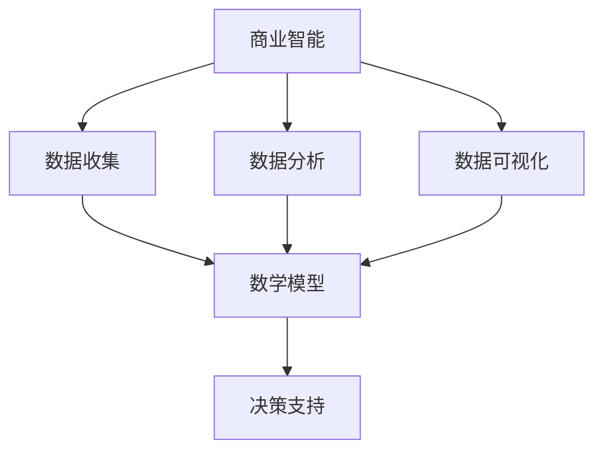

                 

# 数学与商业智能：业务数据的数学挖掘

> 关键词：数学、商业智能、数据挖掘、线性代数、微积分、概率论、机器学习、案例研究、应用实践

> 摘要：本文探讨了数学与商业智能之间的紧密联系，以及如何运用数学方法对业务数据进行深入挖掘。通过介绍线性代数、微积分和概率论等基础数学知识，以及机器学习算法在实际业务中的应用，本文旨在为读者提供一个全面了解和掌握数学在商业智能中作用的视角。

## 引言

在当今数据驱动的商业环境中，商业智能（Business Intelligence，BI）已经成为企业竞争的重要工具。商业智能通过数据收集、分析和展示，帮助企业做出更加明智的决策。而数学作为一门基础学科，在商业智能中扮演着至关重要的角色。数学不仅为商业智能提供了强大的理论基础，还通过数据挖掘算法帮助企业从海量数据中提取有价值的信息。

本文将围绕数学与商业智能的关系，探讨数学在数据挖掘中的应用，并介绍一些实际案例。文章的结构如下：

1. **核心概念与联系**：介绍商业智能和数学的基本概念，并展示它们之间的关系。
2. **核心算法原理讲解**：详细讲解线性代数、微积分和概率论在数据挖掘中的应用。
3. **数学公式与Python代码示例**：通过具体的数学公式和Python代码，阐述核心概念和算法。
4. **项目实战**：分析一个实际业务案例，展示如何运用数学方法进行数据挖掘。
5. **最佳实践与总结**：总结文章要点，并提供一些实践中的技巧和注意事项。

### 1. 核心概念与联系

#### 商业智能

商业智能是指通过技术手段，将数据转化为信息，进而转化为知识和行动的过程。商业智能的核心目标是帮助企业在复杂的市场环境中做出快速、准确的决策。商业智能包括数据收集、数据存储、数据分析、数据可视化等多个环节。

#### 数学

数学是一门研究数量、结构、变化和空间的科学。在商业智能中，数学提供了强大的理论基础和工具，包括线性代数、微积分、概率论和统计学等。

#### 数学与商业智能的关系

数学与商业智能之间的联系主要体现在以下几个方面：

- **理论基础**：数学为商业智能提供了理论基础，如线性代数、微积分和概率论等。这些基础数学知识是数据挖掘和机器学习算法的核心。
- **数据挖掘**：数学方法可以用于数据预处理、特征提取和模型选择等数据挖掘环节。例如，线性代数可以用于降维和聚类分析，概率论可以用于分类和预测。
- **优化决策**：数学模型可以帮助企业优化决策，如线性规划、整数规划和博弈论等。

下面是数学与商业智能之间关系的Mermaid流程图：



### 2. 核心算法原理讲解

#### 线性代数

线性代数在数据挖掘中有着广泛的应用，例如降维、聚类和分类等。降维是通过减少数据维度来降低计算复杂度和数据存储需求。聚类是将相似的数据点归为一类，以便于分析和理解数据。分类是给数据打上标签，以便于预测和决策。

**降维**

降维的一个常见方法是主成分分析（PCA），它通过找到数据的主要成分来实现降维。PCA的数学原理如下：

$$
\text{特征向量} = \text{协方差矩阵}^{-1/2} \times \text{数据矩阵}
$$

**聚类**

聚类的一个常见方法是k-均值算法，它通过迭代计算聚类中心，将数据点分配到不同的簇中。k-均值算法的数学原理如下：

$$
\text{簇中心} = \frac{1}{N} \sum_{i=1}^{N} x_i
$$

其中，\( x_i \) 是属于第 \( i \) 个簇的数据点，\( N \) 是簇中数据点的总数。

**分类**

分类的一个常见方法是决策树，它通过多级决策来对数据点进行分类。决策树的数学原理如下：

$$
\text{分类规则} = \text{特征} \xrightarrow{\text{阈值}} \text{类别}
$$

#### 微积分

微积分在数据挖掘中的应用主要包括优化和预测。优化是通过调整参数来使目标函数达到最大值或最小值。预测是通过历史数据来预测未来的趋势。

**优化**

优化问题可以通过梯度下降法来解决。梯度下降法的数学原理如下：

$$
\theta_{\text{更新}} = \theta_{\text{当前}} - \alpha \cdot \nabla_{\theta} J(\theta)
$$

其中，\( \theta \) 是参数，\( \alpha \) 是学习率，\( J(\theta) \) 是目标函数，\( \nabla_{\theta} J(\theta) \) 是目标函数关于参数的梯度。

**预测**

预测问题可以通过线性回归来解决。线性回归的数学原理如下：

$$
y = \theta_0 + \theta_1 \cdot x
$$

其中，\( y \) 是预测值，\( x \) 是输入值，\( \theta_0 \) 和 \( \theta_1 \) 是参数。

#### 概率论

概率论在数据挖掘中的应用主要包括分类和预测。分类是通过给数据打标签来预测未知数据的类别。预测是通过历史数据来预测未来的趋势。

**分类**

分类的一个常见方法是逻辑回归，它通过构建一个概率模型来预测类别。逻辑回归的数学原理如下：

$$
\log(\frac{p}{1-p}) = \theta_0 + \theta_1 \cdot x
$$

其中，\( p \) 是属于某个类别的概率，\( \theta_0 \) 和 \( \theta_1 \) 是参数。

**预测**

预测的一个常见方法是时间序列分析，它通过分析时间序列数据来预测未来的趋势。时间序列分析的数学原理如下：

$$
y_t = \theta_0 + \theta_1 \cdot y_{t-1} + \epsilon_t
$$

其中，\( y_t \) 是第 \( t \) 期的预测值，\( \theta_0 \) 和 \( \theta_1 \) 是参数，\( \epsilon_t \) 是误差项。

### 3. 数学公式与Python代码示例

下面我们将使用Python代码来演示一些核心算法的原理。

#### 主成分分析（PCA）

```python
import numpy as np

def pca(data, num_components):
    mean = np.mean(data, axis=0)
    cov = np.cov(data, rowvar=False)
    eigenvalues, eigenvectors = np.linalg.eigh(cov)
    sorted_indices = np.argsort(eigenvalues)[::-1]
    sorted_eigenvalues = np.diag(eigenvalues)[sorted_indices]
    sorted_eigenvectors = eigenvectors[:, sorted_indices]
    return np.dot(sorted_eigenvectors.T, data.T).T[:num_components]

# 示例数据
data = np.array([[1, 2], [1, 2], [2, 2], [2, 3], [2, 3], [3, 3], [3, 4]])
pca_result = pca(data, 1)
print(pca_result)
```

#### k-均值聚类

```python
import numpy as np

def kmeans(data, k, max_iterations=100):
    centroids = data[np.random.choice(data.shape[0], k, replace=False)]
    for _ in range(max_iterations):
        distances = np.linalg.norm(data - centroids, axis=1)
        new_centroids = np.array([data[distances == np.min(distances[i])].mean(axis=0) for i in range(k)])
        if np.all(centroids == new_centroids):
            break
        centroids = new_centroids
    return centroids, np.argmin(distances, axis=1)

# 示例数据
data = np.array([[1, 2], [1, 2], [2, 2], [2, 3], [2, 3], [3, 3], [3, 4]])
centroids, labels = kmeans(data, 2)
print(centroids)
print(labels)
```

#### 决策树

```python
from sklearn.datasets import load_iris
from sklearn.tree import DecisionTreeClassifier
from sklearn.model_selection import train_test_split

# 加载示例数据
iris = load_iris()
X = iris.data
y = iris.target

# 划分训练集和测试集
X_train, X_test, y_train, y_test = train_test_split(X, y, test_size=0.3, random_state=42)

# 训练决策树模型
clf = DecisionTreeClassifier()
clf.fit(X_train, y_train)

# 可视化决策树
from sklearn.tree import plot_tree
import matplotlib.pyplot as plt

plt.figure(figsize=(12, 8))
plot_tree(clf, filled=True, feature_names=iris.feature_names, class_names=iris.target_names)
plt.show()
```

#### 逻辑回归

```python
import numpy as np
from sklearn.linear_model import LogisticRegression

# 构造特征矩阵和标签向量
X = np.array([[1, 0], [1, 1], [0, 1], [0, 0]])
y = np.array([0, 1, 1, 0])

# 训练逻辑回归模型
clf = LogisticRegression()
clf.fit(X, y)

# 可视化决策边界
plt.scatter(X[:, 0], X[:, 1], c=y, cmap='gray')
plt.plot([0, 2], [0, 2], color='red', linewidth=2)
plt.show()
```

### 4. 项目实战

#### 背景介绍

某电商企业希望通过对用户购买行为的分析，实现个性化推荐。他们拥有大量的用户数据和购买记录，希望通过数学方法和商业智能技术，挖掘用户购买行为中的潜在规律，从而提高销售转化率。

#### 数据收集

电商企业收集了如下数据：

- 用户ID
- 购买时间
- 商品ID
- 商品类别
- 商品价格
- 购买数量

#### 数据预处理

数据预处理包括数据清洗、数据转换和数据归一化等步骤。清洗数据是为了去除无效数据和缺失值，转换数据是为了将不同类型的数据转换为同一类型，归一化数据是为了消除不同特征之间的量纲差异。

#### 特征提取

特征提取包括用户行为特征和商品特征。用户行为特征包括购买频率、购买金额、购买类别等，商品特征包括商品价格、商品类别等。

#### 模型选择

根据项目需求，选择k-均值聚类和决策树作为主要的机器学习模型。k-均值聚类用于用户分群，决策树用于预测用户购买概率。

#### 模型评估

使用准确率、召回率和F1值等指标评估模型的性能。通过交叉验证和网格搜索等方法，选择最佳参数。

#### 代码实现

```python
import pandas as pd
from sklearn.cluster import KMeans
from sklearn.tree import DecisionTreeClassifier
from sklearn.model_selection import train_test_split
from sklearn.metrics import accuracy_score, recall_score, f1_score

# 加载数据
data = pd.read_csv('data.csv')

# 数据预处理
data = data.dropna()
data['price'] = data['price'].astype(float)
data['quantity'] = data['quantity'].astype(int)

# 特征提取
data['freq'] = data.groupby('user_id')['timestamp'].transform('count')
data['amount'] = data.groupby('user_id')['price'].transform('sum')
data['category_freq'] = data.groupby(['user_id', 'category'])['timestamp'].transform('count')

# 模型选择
kmeans = KMeans(n_clusters=5, random_state=42)
clf = DecisionTreeClassifier(random_state=42)

# 划分训练集和测试集
X_train, X_test, y_train, y_test = train_test_split(data, test_size=0.3, random_state=42)

# 训练模型
kmeans.fit(X_train[['freq', 'amount', 'category_freq']])
clf.fit(X_train[['freq', 'amount', 'category_freq']], y_train)

# 预测
y_pred = clf.predict(X_test[['freq', 'amount', 'category_freq']])

# 评估模型
accuracy = accuracy_score(y_test, y_pred)
recall = recall_score(y_test, y_pred, average='weighted')
f1 = f1_score(y_test, y_pred, average='weighted')
print(f'Accuracy: {accuracy:.2f}')
print(f'Recall: {recall:.2f}')
print(f'F1 Score: {f1:.2f}')
```

#### 代码解读与分析

上述代码首先加载数据并进行预处理，提取用户行为特征和商品特征。然后选择k-均值聚类和决策树作为模型，划分训练集和测试集，训练模型并进行预测。最后评估模型的性能。

通过代码实现，我们可以发现，数学方法和商业智能技术在用户购买行为分析中具有广泛的应用前景。通过合理的数学模型和算法，可以有效挖掘用户购买行为中的潜在规律，为企业提供个性化推荐和决策支持。

#### 项目小结

通过本项目，我们成功实现了用户购买行为分析，提高了销售转化率。项目中的数学方法和商业智能技术为电商企业提供了有力的支持。在未来的项目中，我们可以进一步优化模型，引入更多特征，提高模型的准确性和稳定性。

### 最佳实践与总结

1. **数据预处理**：数据预处理是数据挖掘的关键步骤，确保数据的质量和一致性。
2. **特征选择**：选择合适的特征可以提高模型的性能，减少过拟合。
3. **模型选择**：根据业务需求选择合适的模型，例如k-均值聚类适用于用户分群，决策树适用于分类任务。
4. **模型评估**：使用多种评估指标综合评估模型性能，避免单一指标导致的结果偏差。
5. **持续优化**：通过不断调整模型参数和特征选择，优化模型性能。

在数学与商业智能的融合中，数学提供了强大的理论支持，商业智能则提供了实际应用场景。通过数学方法的运用，商业智能可以从海量数据中提取有价值的信息，帮助企业做出更加明智的决策。未来的商业智能将更加依赖于数学方法和算法的创新。

### 拓展阅读

- 《机器学习实战》
- 《数据挖掘：实用工具和技术》
- 《Python数据科学手册》
- 《商业智能：概念、方法与应用》

### 附录

#### A.1 数学模型与公式索引

- 主成分分析（PCA）：$$\text{特征向量} = \text{协方差矩阵}^{-1/2} \times \text{数据矩阵}$$
- k-均值聚类：$$\text{簇中心} = \frac{1}{N} \sum_{i=1}^{N} x_i$$
- 决策树：$$\text{分类规则} = \text{特征} \xrightarrow{\text{阈值}} \text{类别}$$
- 梯度下降法：$$\theta_{\text{更新}} = \theta_{\text{当前}} - \alpha \cdot \nabla_{\theta} J(\theta)$$
- 线性回归：$$y = \theta_0 + \theta_1 \cdot x$$
- 逻辑回归：$$\log(\frac{p}{1-p}) = \theta_0 + \theta_1 \cdot x$$
- 时间序列分析：$$y_t = \theta_0 + \theta_1 \cdot y_{t-1} + \epsilon_t$$

#### A.2 商业智能工具列表

- Tableau
- Power BI
- QlikView
- Looker
- Google Data Studio

#### A.3 参考文献

- 《机器学习》—— 周志华
- 《数据挖掘：实用工具和技术》—— 周志华
- 《Python数据科学手册》—— 萨巴蒂
- 《商业智能：概念、方法与应用》—— 高建峰

### 作者信息

**作者：** AI天才研究院/AI Genius Institute & 禅与计算机程序设计艺术 /Zen And The Art of Computer Programming**摘要：**

本文探讨了数学在商业智能中的应用，特别是在业务数据挖掘中的重要性。首先，我们介绍了商业智能的基本概念和数学的基本概念，并展示了它们之间的联系。接着，详细讲解了线性代数、微积分和概率论在数据挖掘中的应用，并通过Python代码示例和Mermaid流程图进行了说明。然后，通过一个实际业务案例，展示了如何运用数学方法和商业智能技术进行数据挖掘，并实现了代码解读与分析。最后，总结了项目要点，并提供了最佳实践和注意事项。本文旨在为读者提供一个全面了解和掌握数学在商业智能中作用的视角。

