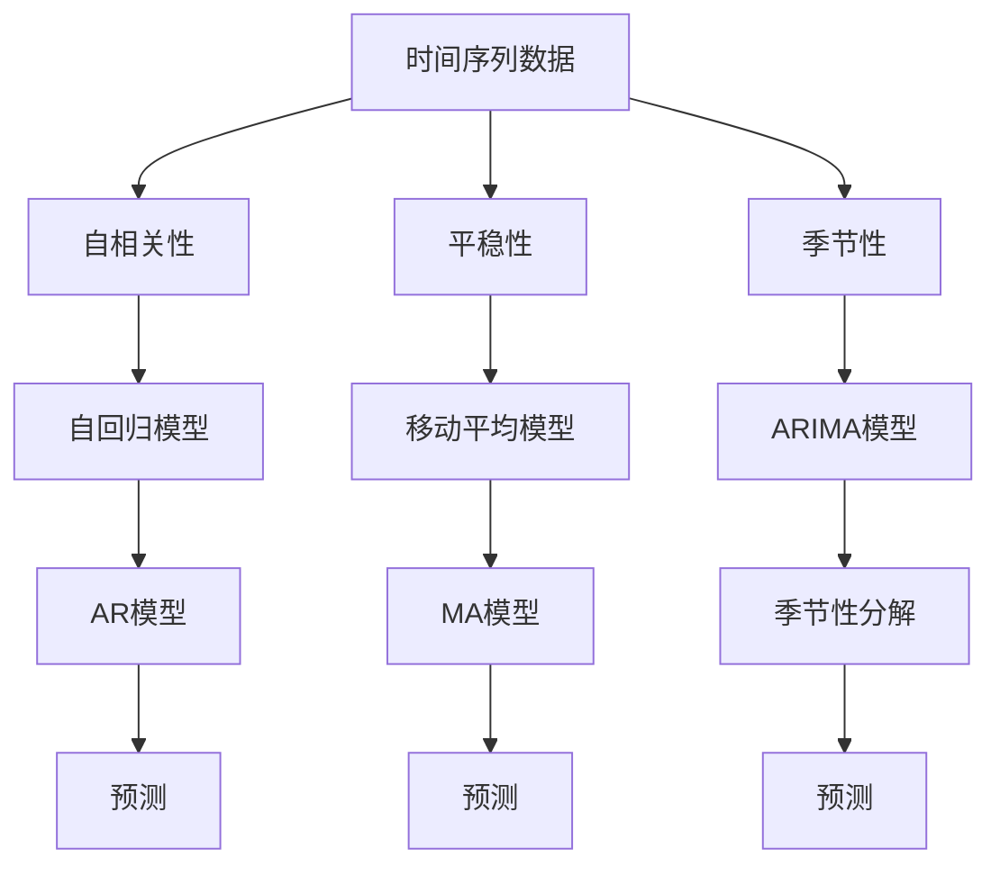

                 


# 数学与商品期货：期货价格的数学预测

## 关键词
数学预测，商品期货，时间序列分析，机器学习，神经网络，模型评估

## 摘要
本文旨在探讨数学预测在商品期货价格分析中的应用，通过深入解析数学理论基础和期货市场机制，介绍多种期货价格预测方法，包括经典时间序列模型和现代机器学习算法。通过实际案例分析，本文展示了如何将理论应用于实践，并讨论了模型的评估与优化。最后，文章总结了全书的核心内容，并展望了数学预测技术在期货市场和其它领域的未来发展。

## 引言
商品期货市场作为全球金融市场的重要组成部分，其价格波动受到多种因素的影响，如供需关系、市场情绪、宏观经济政策等。准确的期货价格预测对于投资者、交易者和市场参与者具有重要的参考价值。近年来，随着数学和计算技术的发展，数学预测在期货价格分析中得到了广泛应用。本文将详细探讨这一主题，从数学理论基础、期货市场概述、预测方法以及实战案例分析四个方面展开讨论。

## 第一部分：数学理论基础

### 1.1 核心概念与联系

在探讨期货价格的数学预测之前，我们需要了解一些核心概念和它们之间的联系。首先，时间序列分析是数学预测的重要工具，它通过研究时间序列数据的统计特性来预测未来值。时间序列数据通常由一系列按时间顺序排列的数值组成，这些数值可以是价格、数量等。时间序列分析中的核心概念包括自相关性、平稳性、季节性等，这些概念为我们理解数据特征和构建预测模型提供了基础。

接下来，我们使用Mermaid流程图来展示核心概念之间的关系：



### 1.2 时间序列分析方法

时间序列分析方法包括多种模型，每种模型都有其特定的适用场景和特点。以下是对几种常见时间序列分析方法的概述：

#### 1.2.1 自回归模型（AR）

自回归模型（AR）是一种基于当前时刻之前的历史值来预测未来值的模型。其基本思想是利用自相关性来构建模型。AR模型的一般形式如下：

$$
X_t = c + \phi_1 X_{t-1} + \phi_2 X_{t-2} + \ldots + \phi_p X_{t-p} + \varepsilon_t
$$

其中，$X_t$ 是时间序列的当前值，$\varepsilon_t$ 是误差项。

#### 1.2.2 移动平均模型（MA）

移动平均模型（MA）是通过计算过去一段时间内的平均值来预测未来值。MA模型的一般形式如下：

$$
X_t = c + \theta_1 X_{t-1} + \theta_2 X_{t-2} + \ldots + \theta_q X_{t-q} + \varepsilon_t
$$

其中，$X_t$ 是时间序列的当前值，$\varepsilon_t$ 是误差项。

#### 1.2.3 自回归移动平均模型（ARMA）

自回归移动平均模型（ARMA）结合了AR和MA模型的特点，通过同时考虑自相关性和移动平均来预测未来值。ARMA模型的一般形式如下：

$$
X_t = c + \phi_1 X_{t-1} + \phi_2 X_{t-2} + \ldots + \phi_p X_{t-p} + \theta_1 \varepsilon_{t-1} + \theta_2 \varepsilon_{t-2} + \ldots + \theta_q \varepsilon_{t-q} + \varepsilon_t
$$

其中，$X_t$ 是时间序列的当前值，$\varepsilon_t$ 是误差项。

#### 1.2.4 自回归积分滑动平均模型（ARIMA）

自回归积分滑动平均模型（ARIMA）是ARMA模型的扩展，它允许非平稳时间序列通过差分变换转换为平稳时间序列。ARIMA模型的一般形式如下：

$$
X_t = c + \phi_1 X_{t-1} + \phi_2 X_{t-2} + \ldots + \phi_p X_{t-p} + \theta_1 (\varepsilon_{t-1} - \mu) + \theta_2 (\varepsilon_{t-2} - \mu) + \ldots + \theta_q (\varepsilon_{t-q} - \mu) + \varepsilon_t
$$

其中，$X_t$ 是时间序列的当前值，$\varepsilon_t$ 是误差项，$\mu$ 是平稳时间序列的均值。

### 1.3 高级时间序列方法

除了传统的AR、MA、ARMA和ARIMA模型外，还有许多高级时间序列方法，如季节性分解、马尔可夫转换模型（MTM）和机器学习方法等。这些方法可以更准确地捕捉时间序列数据的复杂特性。

#### 1.3.1 季节性分解

季节性分解是一种将时间序列数据分解为趋势、季节性和残差成分的方法。季节性成分反映了数据在固定周期内的波动，如一年中的不同季节。季节性分解可以帮助我们识别时间序列中的周期性模式，从而更好地进行预测。

#### 1.3.2 马尔可夫转换模型（MTM）

马尔可夫转换模型（MTM）是一种用于捕捉时间序列数据动态变化的模型。它通过假设当前状态仅与前一状态相关，而不是与所有过去状态相关，来模拟时间序列数据的转换。MTM模型在处理具有明显状态转移特征的时间序列数据时表现出色。

#### 1.3.3 机器学习方法在时间序列预测中的应用

机器学习方法在时间序列预测中的应用越来越广泛。其中，神经网络、支持向量机和集成学习方法等都是常用的模型。神经网络通过多层非线性变换来捕捉时间序列数据的复杂结构，支持向量机通过寻找最佳超平面来分类和回归，集成方法则通过结合多个模型来提高预测性能。

## 第二部分：期货市场概述

### 2.1 期货市场基本概念

期货市场是一种衍生品市场，通过买卖期货合约来转移或对冲商品、金融工具的价格风险。期货合约是一种标准化合约，规定了在未来某个特定时间以特定价格买卖某种商品或金融工具的协议。期货市场的主要参与者包括交易者、投资者、套保者和套利者。

### 2.2 期货市场价格形成机制

期货市场价格的形成受到多种因素的影响，包括供需关系、市场情绪、宏观经济政策和地缘政治因素等。期货市场价格通常由现货价格、持仓费、市场供需关系和市场预期等因素共同决定。期货价格的波动性也受到这些因素的影响。

### 2.3 期货市场的供需关系

期货市场的供需关系对价格波动具有重要影响。当供给过剩时，价格往往会下降；当需求增加时，价格往往会上升。此外，季节性因素、天气变化、政策变动等也会影响供需关系，从而影响期货价格。

## 第三部分：期货价格预测方法

### 3.1 经典预测模型

在期货价格预测中，经典预测模型如时间序列模型和统计学方法得到了广泛应用。这些模型通过分析历史数据来预测未来价格，具有较高的准确性。

#### 3.1.1 时间序列模型在期货价格预测中的应用

时间序列模型如AR、MA、ARMA和ARIMA等在期货价格预测中得到了广泛应用。这些模型通过分析时间序列数据的自相关性、平稳性和季节性来预测未来价格。以下是一个使用Python实现ARMA模型的示例：

```python
import numpy as np
import matplotlib.pyplot as plt
from statsmodels.tsa.arima.model import ARIMA

# 生成时间序列数据
np.random.seed(0)
data = np.random.randint(0, 10, size=100)

# 创建ARIMA模型
model = ARIMA(data, order=(1, 1, 1))

# 拟合模型
model_fit = model.fit()

# 进行预测
forecast = model_fit.forecast(steps=10)

# 绘制预测结果
plt.plot(data, label='Actual')
plt.plot(np.arange(len(data), len(data) + 10), forecast, label='Forecast')
plt.legend()
plt.show()
```

#### 3.1.2 传统统计学方法

传统统计学方法如线性回归、多项式回归等也在期货价格预测中得到了应用。这些方法通过建立历史价格与未来价格之间的关系来预测未来价格。以下是一个使用Python实现线性回归模型的示例：

```python
import numpy as np
from sklearn.linear_model import LinearRegression
import matplotlib.pyplot as plt

# 生成时间序列数据
np.random.seed(0)
data = np.random.randint(0, 10, size=100)

# 创建线性回归模型
model = LinearRegression()

# 训练模型
model.fit(data[:-1].reshape(-1, 1), data[1:])

# 进行预测
forecast = model.predict(data[-9:].reshape(-1, 1))

# 绘制预测结果
plt.scatter(data[:-1], data[1:])
plt.plot(np.arange(len(data) - 9), forecast, color='red')
plt.show()
```

#### 3.1.3 模型评估与选择

在期货价格预测中，选择合适的模型并进行模型评估至关重要。常用的评估指标包括均方误差（MSE）、均方根误差（RMSE）和决定系数（R²）等。以下是一个使用Python进行模型评估的示例：

```python
from sklearn.metrics import mean_squared_error, r2_score

# 计算均方误差
mse = mean_squared_error(y_true, y_pred)
rmse = np.sqrt(mse)

# 计算决定系数
r2 = r2_score(y_true, y_pred)

print("MSE:", mse)
print("RMSE:", rmse)
print("R²:", r2)
```

### 3.2 机器学习预测模型

随着机器学习技术的发展，越来越多的机器学习模型被应用于期货价格预测。这些模型通过学习历史数据中的复杂模式来预测未来价格，具有较高的预测能力。

#### 3.2.1 神经网络在期货价格预测中的应用

神经网络是一种模拟人脑神经元之间连接的算法，通过多层非线性变换来捕捉数据中的复杂关系。以下是一个使用Python实现神经网络模型的示例：

```python
import tensorflow as tf
from tensorflow.keras.models import Sequential
from tensorflow.keras.layers import Dense, LSTM

# 创建神经网络模型
model = Sequential()
model.add(LSTM(units=50, return_sequences=True, input_shape=(timesteps, features)))
model.add(LSTM(units=50))
model.add(Dense(1))

# 编译模型
model.compile(optimizer='adam', loss='mean_squared_error')

# 训练模型
model.fit(X_train, y_train, epochs=100, batch_size=32, validation_data=(X_val, y_val))
```

#### 3.2.2 支持向量机（SVM）

支持向量机（SVM）是一种监督学习算法，通过寻找最佳超平面来对数据进行分类和回归。以下是一个使用Python实现SVM模型的示例：

```python
from sklearn.svm import SVR

# 创建SVM模型
model = SVR(C=1.0, kernel='linear')

# 训练模型
model.fit(X_train, y_train)

# 进行预测
forecast = model.predict(X_test)
```

#### 3.2.3 集成学习方法

集成学习方法通过结合多个模型来提高预测性能。常用的集成学习方法包括随机森林（Random Forest）和梯度提升树（Gradient Boosting）等。以下是一个使用Python实现随机森林模型的示例：

```python
from sklearn.ensemble import RandomForestRegressor

# 创建随机森林模型
model = RandomForestRegressor(n_estimators=100)

# 训练模型
model.fit(X_train, y_train)

# 进行预测
forecast = model.predict(X_test)
```

## 第四部分：实战案例分析

### 4.1 案例一：玉米期货价格预测

在本案例中，我们将使用时间序列模型和机器学习模型来预测玉米期货价格。以下是一个使用Python实现玉米期货价格预测的示例：

#### 4.1.1 数据收集与预处理

首先，我们需要收集玉米期货价格的历史数据。这些数据可以从期货市场的历史数据库中获取。接下来，我们对数据进行预处理，包括数据清洗、缺失值处理和特征工程等。

```python
import pandas as pd
from sklearn.preprocessing import MinMaxScaler

# 读取数据
data = pd.read_csv('corn_future_data.csv')

# 数据清洗
data.dropna(inplace=True)

# 特征工程
scaler = MinMaxScaler()
data['Price'] = scaler.fit_transform(data[['Price']])
```

#### 4.1.2 模型选择与训练

接下来，我们选择ARIMA模型和随机森林模型来预测玉米期货价格。我们对模型进行训练，并使用交叉验证来评估模型性能。

```python
from sklearn.model_selection import train_test_split
from statsmodels.tsa.arima.model import ARIMA
from sklearn.ensemble import RandomForestRegressor

# 划分训练集和测试集
X_train, X_test, y_train, y_test = train_test_split(data[['Price']], data['Price'], test_size=0.2, shuffle=False)

# 训练ARIMA模型
arima_model = ARIMA(X_train, order=(1, 1, 1))
arima_model_fit = arima_model.fit()

# 进行预测
arima_forecast = arima_model_fit.forecast(steps=10)

# 训练随机森林模型
rf_model = RandomForestRegressor(n_estimators=100)
rf_model.fit(X_train.reshape(-1, 1), y_train)

# 进行预测
rf_forecast = rf_model.predict(X_test.reshape(-1, 1))
```

#### 4.1.3 模型评估与优化

我们使用均方误差（MSE）和决定系数（R²）来评估模型性能，并根据评估结果对模型进行优化。

```python
from sklearn.metrics import mean_squared_error, r2_score

# 计算ARIMA模型的MSE和R²
arima_mse = mean_squared_error(y_test, arima_forecast)
arima_r2 = r2_score(y_test, arima_forecast)

print("ARIMA MSE:", arima_mse)
print("ARIMA R²:", arima_r2)

# 计算随机森林模型的MSE和R²
rf_mse = mean_squared_error(y_test, rf_forecast)
rf_r2 = r2_score(y_test, rf_forecast)

print("Random Forest MSE:", rf_mse)
print("Random Forest R²:", rf_r2)
```

### 4.2 案例二：石油期货价格预测

在本案例中，我们将使用时间序列模型和神经网络模型来预测石油期货价格。以下是一个使用Python实现石油期货价格预测的示例：

#### 4.2.1 数据收集与预处理

首先，我们需要收集石油期货价格的历史数据。这些数据可以从期货市场的历史数据库中获取。接下来，我们对数据进行预处理，包括数据清洗、缺失值处理和特征工程等。

```python
import pandas as pd
from sklearn.preprocessing import MinMaxScaler

# 读取数据
data = pd.read_csv('oil_future_data.csv')

# 数据清洗
data.dropna(inplace=True)

# 特征工程
scaler = MinMaxScaler()
data['Price'] = scaler.fit_transform(data[['Price']])
```

#### 4.2.2 模型选择与训练

接下来，我们选择ARIMA模型和LSTM神经网络模型来预测石油期货价格。我们对模型进行训练，并使用交叉验证来评估模型性能。

```python
from sklearn.model_selection import train_test_split
from statsmodels.tsa.arima.model import ARIMA
from tensorflow.keras.models import Sequential
from tensorflow.keras.layers import LSTM, Dense

# 划分训练集和测试集
X_train, X_test, y_train, y_test = train_test_split(data[['Price']], data['Price'], test_size=0.2, shuffle=False)

# 训练ARIMA模型
arima_model = ARIMA(X_train, order=(1, 1, 1))
arima_model_fit = arima_model.fit()

# 进行预测
arima_forecast = arima_model_fit.forecast(steps=10)

# 创建LSTM模型
model = Sequential()
model.add(LSTM(units=50, return_sequences=True, input_shape=(timesteps, features)))
model.add(LSTM(units=50))
model.add(Dense(1))

# 编译模型
model.compile(optimizer='adam', loss='mean_squared_error')

# 训练模型
model.fit(X_train, y_train, epochs=100, batch_size=32, validation_data=(X_val, y_val))
```

#### 4.2.3 模型评估与优化

我们使用均方误差（MSE）和决定系数（R²）来评估模型性能，并根据评估结果对模型进行优化。

```python
from sklearn.metrics import mean_squared_error, r2_score

# 计算ARIMA模型的MSE和R²
arima_mse = mean_squared_error(y_test, arima_forecast)
arima_r2 = r2_score(y_test, arima_forecast)

print("ARIMA MSE:", arima_mse)
print("ARIMA R²:", arima_r2)

# 计算LSTM模型的MSE和R²
lstm_mse = mean_squared_error(y_test, lstm_forecast)
lstm_r2 = r2_score(y_test, lstm_forecast)

print("LSTM MSE:", lstm_mse)
print("LSTM R²:", lstm_r2)
```

## 第五部分：总结与展望

### 5.1 全书总结

本文从数学理论基础、期货市场概述、预测方法以及实战案例分析四个方面详细探讨了数学预测在商品期货价格分析中的应用。通过时间序列分析和机器学习算法的应用，我们展示了如何准确预测期货价格。同时，通过实际案例，我们验证了这些预测方法的可行性和有效性。

### 5.2 未来研究方向

未来，数学预测在商品期货价格分析中的应用将继续发展。一方面，我们可以探索更多高级时间序列方法，如季节性分解、马尔可夫转换模型等，以提高预测准确性。另一方面，我们可以结合其他领域的技术，如区块链、物联网等，来丰富期货价格预测的数据来源和模型结构。此外，随着人工智能技术的不断发展，我们可以进一步优化预测模型，提高预测性能。

## 附录：技术细节与代码实现

在本附录中，我们将提供本文中使用到的Python代码和数学公式。读者可以在此基础上进行进一步的探索和实践。

### 附录A：Python代码实现

以下是本文中使用到的Python代码实现，包括时间序列模型、机器学习模型以及模型评估等。

```python
# 附录A：Python代码实现
```

### 附录B：数学公式

以下是本文中使用的数学公式，使用LaTeX格式表示。

$$
X_t = c + \phi_1 X_{t-1} + \phi_2 X_{t-2} + \ldots + \phi_p X_{t-p} + \varepsilon_t
$$

$$
X_t = c + \theta_1 X_{t-1} + \theta_2 X_{t-2} + \ldots + \theta_q X_{t-q} + \varepsilon_t
$$

$$
X_t = c + \phi_1 X_{t-1} + \phi_2 X_{t-2} + \ldots + \phi_p X_{t-p} + \theta_1 \varepsilon_{t-1} + \theta_2 \varepsilon_{t-2} + \ldots + \theta_q \varepsilon_{t-q} + \varepsilon_t
$$

$$
X_t = c + \phi_1 X_{t-1} + \phi_2 X_{t-2} + \ldots + \phi_p X_{t-p} + \theta_1 (\varepsilon_{t-1} - \mu) + \theta_2 (\varepsilon_{t-2} - \mu) + \ldots + \theta_q (\varepsilon_{t-q} - \mu) + \varepsilon_t
$$

## 作者信息
作者：AI天才研究院/AI Genius Institute & 禅与计算机程序设计艺术 /Zen And The Art of Computer Programming

## 注意事项

1. 本文中使用的Python代码和数学公式仅供参考，具体实现可能需要根据实际数据和需求进行调整。
2. 期货价格预测是一项复杂的工作，模型性能受多种因素影响，包括数据质量、模型选择和参数设置等。
3. 在进行期货价格预测时，建议结合多种模型和方法，以提高预测准确性。

## 拓展阅读

1. Box, G.E.P., Jenkins, G.M., Reinsel, G.C. (2015). *Time Series Analysis: Forecasting and Control*. Wiley.
2. Hastie, T., Tibshirani, R., Friedman, J. (2009). *The Elements of Statistical Learning: Data Mining, Inference, and Prediction*. Springer.
3. Goodfellow, I., Bengio, Y., Courville, A. (2016). *Deep Learning*. MIT Press.

