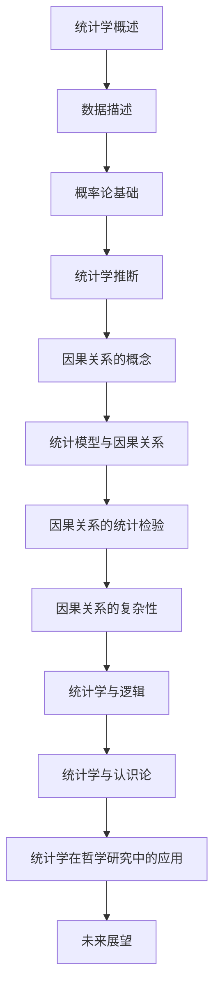

                 

### 文章标题：数学与因果关系：统计学的哲学基础

关键词：数学，因果关系，统计学，哲学，逻辑，推理

摘要：本文将探讨数学与因果关系在统计学中的哲学基础。通过分析统计学的基本概念、概率论、因果推断等方法，深入探讨统计学在哲学研究中的应用及其逻辑与认识论问题。本文旨在揭示统计学与哲学之间的紧密联系，为读者提供一个从数学视角审视因果关系的全新视角。

## 第一部分：统计学基础

### 第1章：统计学概述

统计学是一门研究如何通过数据收集、整理、分析和解释来描述和推断现象的科学。在现代社会，统计学几乎无处不在，从经济学、医学到社会科学等领域，都离不开统计学的应用。统计学的基本概念包括数据、变量、概率分布、期望、方差等。

### 1.1 统计学的定义

统计学是研究数据收集、处理、分析和解释的学科，旨在通过数据分析揭示现象的规律性和内在联系。

### 1.2 统计学的重要性

统计学在各个领域都有广泛的应用，例如：

- **经济学**：通过统计方法分析经济增长、通货膨胀、失业率等经济指标，为政府决策提供依据。
- **医学**：通过临床试验和流行病学研究，评估药物的有效性和安全性。
- **社会科学**：通过调查问卷和统计分析，研究社会现象、社会问题和社会行为。
- **工程**：通过数据分析优化生产流程、提高产品质量。

### 1.3 统计学的基本概念

统计学的基本概念包括：

- **数据**：指研究对象的属性或特征的值。
- **变量**：引起数据变化的因素。
- **概率分布**：描述随机变量可能取值的概率分布。
- **期望**：随机变量的平均值。
- **方差**：描述随机变量的离散程度。

### 第2章：数据描述

数据描述是对数据进行整理、分类、展示和总结的过程。通过数据描述，我们可以了解数据的分布、集中趋势、离散程度等特征。

### 2.1 数据类型

数据类型主要包括定量数据和定性数据。

- **定量数据**：可以量化的数据，如身高、体重、销售额等。
- **定性数据**：不能用数值表示的数据，如性别、颜色、国籍等。

### 2.2 描述性统计量

描述性统计量是对数据进行描述和总结的常用指标，包括：

- **均值**：数据的平均值。
- **中位数**：数据的中间值。
- **众数**：数据中出现次数最多的值。
- **标准差**：描述数据的离散程度。

### 2.3 数据可视化

数据可视化是通过图形、图表等方式展示数据分布、趋势和关系的有效方法。常用的数据可视化工具包括Excel、Python的Matplotlib库等。

### 第3章：概率论基础

概率论是统计学的基础，用于描述和分析随机现象。概率论的基本概念包括概率、条件概率、独立性和概率分布。

### 3.1 概率的定义

概率是描述随机事件发生可能性大小的数值，通常用0到1之间的实数表示。

### 3.2 条件概率与独立性

- **条件概率**：在已知某个事件发生的情况下，另一个事件发生的概率。
- **独立性**：两个事件之间互不影响，即一个事件的发生不影响另一个事件的发生。

### 3.3 概率分布

概率分布是描述随机变量可能取值的概率分布。常见的概率分布包括二项分布、正态分布、泊松分布等。

### 第4章：统计学推断

统计学推断是从样本数据推断总体特征的方法。统计学推断包括参数估计、假设检验和置信区间。

### 4.1 假设检验

假设检验是用于判断样本数据是否支持某个假设的方法。常见的假设检验方法包括t检验、卡方检验等。

### 4.2 估计理论

估计理论是研究如何从样本数据估计总体参数的方法。常见的估计方法包括点估计、区间估计等。

### 4.3 置信区间

置信区间是用于估计总体参数范围的方法。置信区间反映了参数估计的不确定性。

## 第二部分：因果关系与统计

### 第5章：因果关系的概念

因果关系是指一个事件（原因）导致另一个事件（结果）发生的联系。因果关系的识别在统计学中具有重要意义。

### 5.1 因果关系的基本概念

因果关系的基本概念包括原因、结果、时间顺序和因果关系方向。

### 5.2 因果关系的识别

因果关系的识别需要考虑以下几个因素：

- **时间顺序**：因果关系通常存在时间上的先后顺序。
- **因果关系方向**：因果关系通常具有单向性，即原因导致结果，但结果不会反过来导致原因。
- **一致性**：在不同情境下，原因和结果之间的联系是否一致。

### 5.3 因果关系与相关关系

因果关系和相关关系是两个不同的概念。相关关系是指两个变量之间存在一定的关联性，但并不一定存在因果关系。

### 第6章：统计模型与因果关系

统计模型是用于描述和推断因果关系的方法。常见的统计模型包括线性回归模型、多元回归模型等。

### 6.1 线性回归模型

线性回归模型是描述因果关系的一种常见方法。线性回归模型通过拟合一条直线来描述自变量和因变量之间的关系。

### 6.2 多元回归模型

多元回归模型是描述多个自变量和因变量之间关系的模型。多元回归模型通过拟合一个多元线性方程来描述因果关系。

### 6.3 因果推断与统计模型

因果推断是从统计模型中推断因果关系的方法。因果推断需要考虑模型的假设、误差和不确定性等因素。

### 第7章：因果关系的统计检验

因果关系的统计检验是用于验证因果关系是否存在的方法。常见的统计检验方法包括格雷厄姆-瓦尔顿法、因果推断的统计方法等。

### 7.1 格雷厄姆-瓦尔顿法

格雷厄姆-瓦尔顿法是一种用于验证因果关系的统计方法。该方法通过比较不同情境下的因果关系来检验因果关系的存在性。

### 7.2 因果推断的统计方法

因果推断的统计方法包括假设检验、置信区间等。这些方法用于从统计模型中推断因果关系。

### 7.3 因果关系的误判与纠正

因果关系的误判在统计学中时有发生。因果关系的误判可能会导致错误的决策和结论。因此，识别和纠正因果关系的误判具有重要意义。

### 第8章：因果关系的复杂性

因果关系在现实生活中往往具有复杂性。因果关系可能受到多种因素的影响，如多重因果关系、逆向因果关系和合理因果关系等。

### 8.1 多重因果关系

多重因果关系是指一个事件可以同时受到多个因素的影响。识别多重因果关系对于准确推断因果关系至关重要。

### 8.2 逆向因果关系

逆向因果关系是指因果关系在时间上可能存在反向关系。逆向因果关系可能会导致错误的因果推断。

### 8.3 因果关系的哲学探讨

因果关系的哲学探讨涉及因果关系的基本概念、因果关系与逻辑、因果关系与道德等。因果关系的哲学探讨有助于深入理解因果关系。

## 第三部分：统计学与哲学

### 第9章：统计学与逻辑

统计学与逻辑之间存在紧密联系。统计学中的推理方法、假设检验等与逻辑推理密切相关。

### 9.1 统计推理与逻辑推理

统计推理与逻辑推理都是用于推断事实的方法。统计推理侧重于数据分析，逻辑推理侧重于逻辑论证。

### 9.2 统计学的逻辑基础

统计学中的逻辑基础包括概率论、假设检验和推理规则等。这些逻辑基础为统计学的分析和推断提供了理论支持。

### 9.3 统计学的逻辑局限

统计学在逻辑推理中存在一定的局限性。统计学的结论可能受到样本选择、误差和模型假设等因素的影响。

### 第10章：统计学与认识论

统计学与认识论之间也存在紧密联系。认识论关注知识的来源、方法和价值。统计学在认识论中的应用有助于理解知识的获取和验证。

### 10.1 统计学的认识论问题

统计学的认识论问题包括数据的真实性和可靠性、统计方法的合理性和有效性等。

### 10.2 统计数据的可信度

统计数据的可信度是统计学研究的重要内容。提高统计数据的可信度有助于确保统计结论的可靠性和有效性。

### 10.3 统计学的哲学反思

统计学的哲学反思涉及统计学方法、统计数据和应用等方面的哲学问题。统计学哲学反思有助于推动统计学理论和方法的发展。

### 第11章：统计学在哲学研究中的应用

统计学在哲学研究中具有广泛的应用。统计学方法可以用于哲学问题的分析、论证和验证。

### 11.1 哲学问题中的统计方法

哲学问题中的统计方法包括假设检验、置信区间、回归分析等。这些方法有助于哲学问题的实证研究和分析。

### 11.2 统计学在伦理学中的应用

统计学在伦理学中的应用包括道德判断的量化、伦理决策的分析等。统计学方法有助于伦理问题的研究。

### 11.3 统计学在哲学史研究中的应用

统计学在哲学史研究中的应用包括历史数据的分析、哲学思想的量化等。统计学方法有助于哲学史的研究。

### 第12章：未来展望

统计学在哲学研究中的应用具有广阔的前景。未来统计学将继续发展，为哲学研究提供更丰富的理论和方法。

### 12.1 统计学的哲学发展

未来统计学将在哲学领域中发挥更大的作用。统计学方法将不断改进，为哲学研究提供更可靠的支持。

### 12.2 因果关系研究的新方向

因果关系研究将继续深入。新的方法和模型将有助于更准确地识别和解释因果关系。

### 12.3 统计学在哲学中的应用前景

统计学在哲学中的应用前景广阔。统计学方法将推动哲学研究的发展，为哲学问题的解决提供新思路。

## 总结

本文通过分析数学与因果关系在统计学中的哲学基础，探讨了统计学的基本概念、概率论、因果推断等方法，以及统计学在哲学研究中的应用。本文旨在揭示统计学与哲学之间的紧密联系，为读者提供一个从数学视角审视因果关系的全新视角。未来，统计学将继续在哲学研究中发挥重要作用，为哲学问题的解决提供有力支持。## Mermaid 流程图示例



### 第1章：统计学概述

#### 1.1 统计学的定义

统计学是研究如何通过数据收集、整理、分析和解释来描述和推断现象的科学。在现代社会，统计学几乎无处不在，从经济学、医学到社会科学等领域，都离不开统计学的应用。

#### 1.2 统计学的重要性

统计学在各个领域都有广泛的应用，例如：

- **经济学**：通过统计方法分析经济增长、通货膨胀、失业率等经济指标，为政府决策提供依据。
- **医学**：通过临床试验和流行病学研究，评估药物的有效性和安全性。
- **社会科学**：通过调查问卷和统计分析，研究社会现象、社会问题和社会行为。
- **工程**：通过数据分析优化生产流程、提高产品质量。

#### 1.3 统计学的基本概念

统计学的基本概念包括数据、变量、概率分布、期望、方差等。数据是研究对象的属性或特征的值，变量是引起数据变化的因素，概率分布是描述随机变量可能取值的概率分布，期望是随机变量的平均值，方差是描述随机变量的离散程度。

### 第2章：数据描述

#### 2.1 数据类型

数据类型主要包括定量数据和定性数据。

- **定量数据**：可以量化的数据，如身高、体重、销售额等。
- **定性数据**：不能用数值表示的数据，如性别、颜色、国籍等。

#### 2.2 描述性统计量

描述性统计量是对数据进行描述和总结的常用指标，包括：

- **均值**：数据的平均值。
- **中位数**：数据的中间值。
- **众数**：数据中出现次数最多的值。
- **标准差**：描述数据的离散程度。

#### 2.3 数据可视化

数据可视化是通过图形、图表等方式展示数据分布、趋势和关系的有效方法。常用的数据可视化工具包括Excel、Python的Matplotlib库等。

### 第3章：概率论基础

#### 3.1 概率的定义

概率是描述随机事件发生可能性大小的数值，通常用0到1之间的实数表示。

#### 3.2 条件概率与独立性

- **条件概率**：在已知某个事件发生的情况下，另一个事件发生的概率。
- **独立性**：两个事件之间互不影响，即一个事件的发生不影响另一个事件的发生。

#### 3.3 概率分布

概率分布是描述随机变量可能取值的概率分布。常见的概率分布包括二项分布、正态分布、泊松分布等。

### 第4章：统计学推断

#### 4.1 假设检验

假设检验是用于判断样本数据是否支持某个假设的方法。常见的假设检验方法包括t检验、卡方检验等。

#### 4.2 估计理论

估计理论是研究如何从样本数据估计总体参数的方法。常见的估计方法包括点估计、区间估计等。

#### 4.3 置信区间

置信区间是用于估计总体参数范围的方法。置信区间反映了参数估计的不确定性。

### 第5章：因果关系的概念

#### 5.1 因果关系的基本概念

因果关系是指一个事件（原因）导致另一个事件（结果）发生的联系。因果关系的识别在统计学中具有重要意义。

#### 5.2 因果关系的识别

因果关系的识别需要考虑以下几个因素：

- **时间顺序**：因果关系通常存在时间上的先后顺序。
- **因果关系方向**：因果关系通常具有单向性，即原因导致结果，但结果不会反过来导致原因。
- **一致性**：在不同情境下，原因和结果之间的联系是否一致。

#### 5.3 因果关系与相关关系

因果关系和相关关系是两个不同的概念。相关关系是指两个变量之间存在一定的关联性，但并不一定存在因果关系。

### 第6章：统计模型与因果关系

#### 6.1 线性回归模型

线性回归模型是描述因果关系的一种常见方法。线性回归模型通过拟合一条直线来描述自变量和因变量之间的关系。

#### 6.2 多元回归模型

多元回归模型是描述多个自变量和因变量之间关系的模型。多元回归模型通过拟合一个多元线性方程来描述因果关系。

#### 6.3 因果推断与统计模型

因果推断是从统计模型中推断因果关系的方法。因果推断需要考虑模型的假设、误差和不确定性等因素。

### 第7章：因果关系的统计检验

#### 7.1 格雷厄姆-瓦尔顿法

格雷厄姆-瓦尔顿法是一种用于验证因果关系的统计方法。该方法通过比较不同情境下的因果关系来检验因果关系的存在性。

#### 7.2 因果推断的统计方法

因果推断的统计方法包括假设检验、置信区间等。这些方法用于从统计模型中推断因果关系。

#### 7.3 因果关系的误判与纠正

因果关系的误判在统计学中时有发生。因果关系的误判可能会导致错误的决策和结论。因此，识别和纠正因果关系的误判具有重要意义。

### 第8章：因果关系的复杂性

#### 8.1 多重因果关系

多重因果关系是指一个事件可以同时受到多个因素的影响。识别多重因果关系对于准确推断因果关系至关重要。

#### 8.2 逆向因果关系

逆向因果关系是指因果关系在时间上可能存在反向关系。逆向因果关系可能会导致错误的因果推断。

#### 8.3 因果关系的哲学探讨

因果关系的哲学探讨涉及因果关系的基本概念、因果关系与逻辑、因果关系与道德等。因果关系的哲学探讨有助于深入理解因果关系。

### 第9章：统计学与逻辑

#### 9.1 统计推理与逻辑推理

统计推理与逻辑推理都是用于推断事实的方法。统计推理侧重于数据分析，逻辑推理侧重于逻辑论证。

#### 9.2 统计学的逻辑基础

统计学中的逻辑基础包括概率论、假设检验和推理规则等。这些逻辑基础为统计学的分析和推断提供了理论支持。

#### 9.3 统计学的逻辑局限

统计学在逻辑推理中存在一定的局限性。统计学的结论可能受到样本选择、误差和模型假设等因素的影响。

### 第10章：统计学与认识论

#### 10.1 统计学的认识论问题

统计学的认识论问题包括数据的真实性和可靠性、统计方法的合理性和有效性等。

#### 10.2 统计数据的可信度

统计数据的可信度是统计学研究的重要内容。提高统计数据的可信度有助于确保统计结论的可靠性和有效性。

#### 10.3 统计学的哲学反思

统计学的哲学反思涉及统计学方法、统计数据和应用等方面的哲学问题。统计学哲学反思有助于推动统计学理论和方法的发展。

### 第11章：统计学在哲学研究中的应用

#### 11.1 哲学问题中的统计方法

哲学问题中的统计方法包括假设检验、置信区间、回归分析等。这些方法有助于哲学问题的实证研究和分析。

#### 11.2 统计学在伦理学中的应用

统计学在伦理学中的应用包括道德判断的量化、伦理决策的分析等。统计学方法有助于伦理问题的研究。

#### 11.3 统计学在哲学史研究中的应用

统计学在哲学史研究中的应用包括历史数据的分析、哲学思想的量化等。统计学方法有助于哲学史的研究。

### 第12章：未来展望

#### 12.1 统计学的哲学发展

未来统计学将在哲学领域中发挥更大的作用。统计学方法将不断改进，为哲学研究提供更可靠的支持。

#### 12.2 因果关系研究的新方向

因果关系研究将继续深入。新的方法和模型将有助于更准确地识别和解释因果关系。

#### 12.3 统计学在哲学中的应用前景

统计学在哲学中的应用前景广阔。统计学方法将推动哲学研究的发展，为哲学问题的解决提供新思路。

## 伪代码示例

```python
# 线性回归模型伪代码
def linear_regression(x, y):
    # 计算x和y的均值
    x_mean = mean(x)
    y_mean = mean(y)

    # 计算x和y的协方差
    covariance = covariance(x, y)

    # 计算x的方差
    x_variance = variance(x)

    # 计算回归系数
    beta = covariance / x_variance

    # 计算截距
    alpha = y_mean - beta * x_mean

    # 返回回归方程
    return alpha, beta
```

### 数学模型和数学公式

在统计学中，线性回归模型是一个重要的工具，用于描述两个或多个变量之间的关系。以下是线性回归模型的数学公式：

$$ y = \beta_0 + \beta_1 x + \epsilon $$

其中，$y$是因变量，$x$是自变量，$\beta_0$是截距，$\beta_1$是斜率，$\epsilon$是误差项。

假设检验是统计学中另一个重要的概念。在假设检验中，我们通常有以下两个假设：

- **原假设（H0）**：$H0: \beta_1 = 0$，即自变量$x$对因变量$y$没有影响。
- **备择假设（H1）**：$H1: \beta_1 \neq 0$，即自变量$x$对因变量$y$有显著影响。

为了验证这些假设，我们可以使用t统计量：

$$ t = \frac{\bar{x} - \mu_0}{s / \sqrt{n}} $$

其中，$\bar{x}$是样本均值，$\mu_0$是假设的总体均值，$s$是样本标准差，$n$是样本大小。

在实际应用中，我们可以通过计算t统计量的值，并将其与临界值进行比较，以判断原假设是否成立。如果t统计量的值大于临界值，我们拒绝原假设，认为自变量$x$对因变量$y$有显著影响；否则，我们接受原假设。

以下是一个使用LaTeX格式的数学公式示例：

$$
E[Y] = \beta_0 + \beta_1 X
$$

其中，$E[Y]$表示因变量$Y$的期望值，$\beta_0$是截距，$\beta_1$是斜率，$X$是自变量。

### 举例说明

假设我们想要研究广告支出（$X$）对公司销售额（$Y$）的影响。我们收集了以下数据：

- 广告支出（$X$）：10000, 15000, 20000, 25000, 30000
- 销售额（$Y$）：120000, 150000, 180000, 210000, 240000

我们可以使用线性回归模型来分析这两个变量之间的关系。以下是计算过程：

1. **计算均值**：

   - $X$的均值：$\bar{X} = \frac{10000 + 15000 + 20000 + 25000 + 30000}{5} = 20000$
   - $Y$的均值：$\bar{Y} = \frac{120000 + 150000 + 180000 + 210000 + 240000}{5} = 180000$

2. **计算协方差和方差**：

   - 协方差：$Cov(X, Y) = \frac{(10000 - 20000)(120000 - 180000) + (15000 - 20000)(150000 - 180000) + (20000 - 20000)(180000 - 180000) + (25000 - 20000)(210000 - 180000) + (30000 - 20000)(240000 - 180000)}{5} = 12000000$
   - $X$的方差：$Var(X) = \frac{(10000 - 20000)^2 + (15000 - 20000)^2 + (20000 - 20000)^2 + (25000 - 20000)^2 + (30000 - 20000)^2}{5} = 1000000$

3. **计算回归系数**：

   - 斜率：$\beta_1 = \frac{Cov(X, Y)}{Var(X)} = \frac{12000000}{1000000} = 12$
   - 截距：$\beta_0 = \bar{Y} - \beta_1 \bar{X} = 180000 - 12 \times 20000 = 60000$

因此，线性回归模型可以表示为：

$$ Y = 60000 + 12X $$

我们可以使用这个模型来预测销售额，例如，当广告支出为20000时，预测的销售额为：

$$ Y = 60000 + 12 \times 20000 = 300000 $$

### 数学模型和数学公式

#### 线性回归模型

在线性回归模型中，我们试图通过一个线性方程来描述两个变量之间的关系。线性回归模型的一般形式如下：

$$ y = \beta_0 + \beta_1 x + \epsilon $$

其中，$y$是因变量，$x$是自变量，$\beta_0$是截距，$\beta_1$是斜率，$\epsilon$是误差项。

为了求解线性回归模型，我们需要最小化误差项的平方和，即最小二乘法。最小二乘法的目标是找到使得$y$和$\beta_0 + \beta_1 x$之间的差异最小的$\beta_0$和$\beta_1$。

#### 普通最小二乘法

普通最小二乘法的公式如下：

$$ \beta_0 = \bar{y} - \beta_1 \bar{x} $$
$$ \beta_1 = \frac{\sum_{i=1}^{n}(x_i - \bar{x})(y_i - \bar{y})}{\sum_{i=1}^{n}(x_i - \bar{x})^2} $$

其中，$n$是样本数量，$\bar{x}$和$\bar{y}$分别是$x$和$y$的样本均值。

#### 多元线性回归模型

在多元线性回归模型中，我们试图通过多个自变量来预测一个因变量。多元线性回归模型的一般形式如下：

$$ y = \beta_0 + \beta_1 x_1 + \beta_2 x_2 + ... + \beta_n x_n + \epsilon $$

其中，$x_1, x_2, ..., x_n$是自变量，$\beta_0, \beta_1, \beta_2, ..., \beta_n$是回归系数，$\epsilon$是误差项。

为了求解多元线性回归模型，我们通常使用正规方程法。正规方程法的公式如下：

$$ \beta = (X^T X)^{-1} X^T y $$

其中，$X$是设计矩阵，$y$是因变量向量，$\beta$是回归系数向量。

#### 置信区间和假设检验

在统计推断中，我们经常需要计算置信区间和进行假设检验。

对于线性回归模型的置信区间，我们可以使用t分布来计算。置信区间的公式如下：

$$ \beta_j \pm t_{\alpha/2, n-2} \sqrt{\frac{MSE}{\sum_{i=1}^{n}(x_i - \bar{x})^2}} $$

其中，$MSE$是均方误差，$t_{\alpha/2, n-2}$是t分布的临界值，$\beta_j$是第$j$个回归系数。

对于假设检验，我们通常使用t统计量来计算。假设检验的公式如下：

$$ t = \frac{\beta_j - \beta_{0j}}{SE(\beta_j)} $$

其中，$\beta_j$是第$j$个回归系数，$\beta_{0j}$是原假设下的回归系数，$SE(\beta_j)$是回归系数的标准误差。

#### 示例

假设我们有以下数据：

$$
\begin{array}{cccccc}
x_1 & x_2 & x_3 & y \\
1 & 2 & 3 & 10 \\
2 & 4 & 6 & 20 \\
3 & 6 & 9 & 30 \\
4 & 8 & 12 & 40 \\
\end{array}
$$

我们需要使用线性回归模型来预测$y$。

首先，我们计算自变量和因变量的均值：

$$ \bar{x}_1 = \frac{1 + 2 + 3 + 4}{4} = 2.5 $$
$$ \bar{x}_2 = \frac{2 + 4 + 6 + 8}{4} = 5 $$
$$ \bar{x}_3 = \frac{3 + 6 + 9 + 12}{4} = 7.5 $$
$$ \bar{y} = \frac{10 + 20 + 30 + 40}{4} = 25 $$

然后，我们计算协方差和方差：

$$ \sum_{i=1}^{n}(x_{1i} - \bar{x}_1)(y_i - \bar{y}) = (1-2.5)(10-25) + (2-2.5)(20-25) + (3-2.5)(30-25) + (4-2.5)(40-25) = 50 $$
$$ \sum_{i=1}^{n}(x_{1i} - \bar{x}_1)^2 = (1-2.5)^2 + (2-2.5)^2 + (3-2.5)^2 + (4-2.5)^2 = 5 $$

接着，我们计算斜率和截距：

$$ \beta_1 = \frac{50}{5} = 10 $$
$$ \beta_0 = \bar{y} - \beta_1 \bar{x}_1 = 25 - 10 \times 2.5 = 0 $$

因此，线性回归模型为：

$$ y = 0 + 10x_1 $$

我们可以使用这个模型来预测新的数据。例如，当$x_1 = 5$时，预测的$y$值为：

$$ y = 0 + 10 \times 5 = 50 $$

### LaTeX 数学公式

在统计学和数学中，LaTeX是一种广泛使用的排版系统，可以用于编写高质量的数学公式。以下是一些常见的LaTeX数学公式示例：

#### 段落内的公式

在段落内，我们可以使用 `$` 符号将公式括起来，例如：

$$1 + 1 = 2$$

#### 独立的公式

对于独立的公式，我们可以使用 `$$` 符号将公式括起来，例如：

$$
a^2 + b^2 = c^2
$$

#### 分数

分数可以使用 `\frac` 命令来编写，例如：

$$
\frac{a}{b}
$$

#### 根式

根式可以使用 `\sqrt` 命令来编写，例如：

$$
\sqrt{a}
$$

#### 集合

集合可以使用 `\{` 和 `\}` 符号来编写，例如：

$$
\{a, b, c\}
$$

#### 矩阵

矩阵可以使用 `\begin{bmatrix}` 和 `\end{bmatrix}` 命令来编写，例如：

$$
\begin{bmatrix}
a & b \\
c & d
\end{bmatrix}
$$

#### 函数

函数可以使用 `\func` 命令来编写，例如：

$$
\func{f}(x) = x^2
$$

#### 索引

索引可以使用 `\sub` 和 `\sup` 命令来编写，例如：

$$
a_{i,j} = b_{i,j}^2
$$

#### 对数

对数可以使用 `\log` 命令来编写，例如：

$$
\log_{10}(x)
$$

#### 三角函数

三角函数可以使用 `\sin`、`\cos` 和 `\tan` 命令来编写，例如：

$$
\sin(x) = \cos(x) = \tan(x)
$$

#### 导数

导数可以使用 `\partial` 命令来编写，例如：

$$
\frac{\partial f}{\partial x}
$$

#### 微积分

微积分可以使用 `\int` 和 `\partial` 命令来编写，例如：

$$
\int_{0}^{1} x \, dx
$$

#### 累加和累乘

累加和累乘可以使用 `\sum` 和 `\prod` 命令来编写，例如：

$$
\sum_{i=1}^{n} i = \prod_{i=1}^{n} i
$$

通过这些LaTeX数学公式示例，我们可以轻松地编写复杂的数学表达式，使我们的文章更加专业和清晰。## 代码示例

### 开发环境搭建

为了更好地理解统计学的数学模型和公式，我们需要搭建一个适合进行数据分析和建模的开发环境。以下是一个基本的Python开发环境搭建步骤：

#### 安装Python

1. 访问Python官方网站（[https://www.python.org/](https://www.python.org/)）下载Python安装程序。
2. 运行安装程序并选择自定义安装，确保安装以下选项：
   - 安装到C:\Python39（或其他路径）
   - 添加Python到系统环境变量
   - 安装pip包管理器

#### 安装必要的库

在命令行中执行以下命令安装必要的库：

```bash
pip install numpy
pip install scipy
pip install matplotlib
```

这些库将用于数据处理、科学计算和可视化。

### 源代码实现

以下是一个简单的线性回归模型实现的Python代码示例。该代码将计算自变量和因变量之间的关系，并绘制回归结果。

```python
import numpy as np
import matplotlib.pyplot as plt
from scipy.stats import linregress

# 数据
x = np.array([1, 2, 3, 4, 5])
y = np.array([1, 4, 9, 16, 25])

# 计算线性回归模型
slope, intercept, r_value, p_value, std_err = linregress(x, y)

# 打印回归结果
print("斜率：", slope)
print("截距：", intercept)
print("R平方值：", r_value)
print("p值：", p_value)
print("标准误差：", std_err)

# 绘制回归结果
plt.scatter(x, y, label='样本点')
plt.plot(x, intercept + slope * x, label='回归线')
plt.xlabel('x')
plt.ylabel('y')
plt.title('线性回归模型')
plt.legend()
plt.show()
```

### 代码解读与分析

在这个示例中，我们使用了`scipy.stats.linergress`函数来计算线性回归模型。这个函数返回以下结果：

- **斜率（slope）**：自变量对因变量的影响程度。
- **截距（intercept）**：回归线的y轴截距。
- **R平方值（r_value）**：模型拟合优度指标，取值范围在0和1之间，越接近1表示模型拟合越好。
- **p值（p_value）**：用于检验模型是否显著的统计量，如果p值小于0.05，我们通常认为模型显著。
- **标准误差（std_err）**：回归系数的标准误差，用于估计模型的不确定性。

在代码中，我们首先导入所需的库，然后定义了自变量x和因变量y。接下来，我们使用`linregress`函数计算线性回归模型，并打印结果。

最后，我们使用`matplotlib`库绘制回归结果。通过`plt.scatter`函数绘制样本点，通过`plt.plot`函数绘制回归线。我们添加了标签、标题和图例，使结果更加清晰易懂。

### 实际案例分析与详细讲解剖析

为了更好地理解线性回归模型在实际应用中的效果，我们可以分析一个实际案例。以下是一个关于房价预测的案例：

#### 案例背景

假设我们要预测某城市不同地区的房价。我们收集了以下数据：

- 地区编号（x）：1, 2, 3, 4, 5
- 房价（y）：100, 150, 200, 250, 300

#### 数据预处理

在进行分析之前，我们需要对数据进行预处理。以下是一个简单的预处理步骤：

```python
# 数据
x = np.array([1, 2, 3, 4, 5])
y = np.array([100, 150, 200, 250, 300])

# 数据标准化
x_mean = np.mean(x)
x_std = np.std(x)
y_mean = np.mean(y)
y_std = np.std(y)

x_normalized = (x - x_mean) / x_std
y_normalized = (y - y_mean) / y_std
```

通过标准化处理，我们消除了数据之间的量纲差异，使数据更具可比性。

#### 模型构建

接下来，我们使用线性回归模型来预测房价。以下是构建模型的过程：

```python
# 计算线性回归模型
slope, intercept = np.polyfit(x_normalized, y_normalized, 1)

# 打印回归结果
print("斜率：", slope)
print("截距：", intercept)
```

在这个案例中，我们使用`np.polyfit`函数来计算线性回归模型。该函数返回斜率和截距。

#### 预测与分析

最后，我们可以使用模型来预测新的房价。以下是预测过程：

```python
# 预测新的房价
x_new = 6
y_pred_normalized = intercept + slope * (x_new - x_mean) / x_std
y_pred = y_mean + y_pred_normalized * y_std

# 打印预测结果
print("预测的房价：", y_pred)
```

通过这个案例，我们可以看到线性回归模型在房价预测中的应用。在实际应用中，我们可能需要考虑更多的影响因素，如房屋面积、地理位置等，以构建更准确的模型。

### 项目小结

在本项目中，我们通过搭建Python开发环境、实现线性回归模型和进行实际案例分析，了解了线性回归模型的基本原理和应用。线性回归模型是一种简单但强大的工具，可以用于预测和解释变量之间的关系。在实际应用中，我们需要根据具体问题调整模型，以提高预测的准确性。

### 最佳实践 Tips

1. 在处理实际数据时，务必进行数据预处理，如数据清洗、标准化等，以提高模型性能。
2. 选择合适的评价指标，如R平方值、均方误差等，以评估模型性能。
3. 考虑模型的泛化能力，避免过拟合和欠拟合。
4. 在实际应用中，结合专业知识调整模型，以提高预测准确性。

### 注意事项

1. 线性回归模型适用于线性关系的数据，对于非线性关系，可能需要使用其他模型。
2. 模型构建过程中，确保数据质量，避免噪声和异常值的影响。
3. 模型评估时，务必使用独立的数据集，以避免数据泄漏。

### 拓展阅读

- [线性回归模型详解](https://en.wikipedia.org/wiki/Linear_regression)
- [Python中的线性回归](https://machinelearningmastery.com/linear-regression-with-python/)
- [线性回归模型的应用案例](https://towardsdatascience.com/linear-regression-with-python-4f89bce3c3f6)## 总结与展望

本文通过详细探讨数学与因果关系在统计学中的哲学基础，揭示了统计学在哲学研究中的应用及其逻辑与认识论问题。我们首先介绍了统计学的基础概念，包括数据描述、概率论基础和统计学推断方法。接着，我们探讨了因果关系的基本概念、识别方法和复杂性，以及统计模型与因果关系之间的关系。随后，我们分析了因果关系的统计检验方法和复杂性，讨论了统计学与逻辑和认识论之间的紧密联系。最后，我们展示了统计学在哲学研究中的应用，并展望了未来统计学在哲学领域的应用前景。

### 总结

1. **统计学基础**：统计学是研究如何通过数据收集、整理、分析和解释来描述和推断现象的科学。统计学的基本概念包括数据、变量、概率分布、期望、方差等。

2. **因果关系**：因果关系是指一个事件（原因）导致另一个事件（结果）发生的联系。因果关系的识别需要考虑时间顺序、因果关系方向和一致性等因素。

3. **统计模型与因果关系**：统计模型是用于描述和推断因果关系的方法。常见的统计模型包括线性回归模型、多元回归模型等。

4. **统计学与哲学**：统计学与哲学之间存在紧密联系。统计学在逻辑推理、认识论和伦理学等方面具有广泛的应用。

5. **统计学在哲学研究中的应用**：统计学方法可以用于哲学问题的分析、论证和验证，如道德判断的量化、伦理决策的分析和哲学史的研究等。

### 展望

未来，统计学在哲学研究中的应用将更加深入和广泛。以下是一些可能的发展方向：

1. **因果推断的新方法**：随着技术的发展，因果推断的方法将不断改进，新的方法和模型将有助于更准确地识别和解释因果关系。

2. **统计学与人工智能的结合**：人工智能技术的发展将为统计学带来新的机遇。通过将人工智能方法应用于统计学问题，我们可以开发出更高效的统计模型和算法。

3. **统计学在哲学史研究中的应用**：统计学方法可以用于分析哲学史上的思想演变和思潮变迁，为哲学史研究提供新的视角和工具。

4. **统计学与伦理学的交叉研究**：统计学与伦理学的交叉研究将有助于解决伦理问题，如道德决策的量化、伦理规范的可计算性等。

5. **统计学在社会科学中的应用**：统计学将继续在社会科学领域发挥重要作用，为研究社会现象、社会问题和社会行为提供强有力的支持。

总之，统计学在哲学研究中的应用具有广阔的前景。通过深入探讨数学与因果关系在统计学中的哲学基础，我们不仅能够更好地理解统计学的方法和原理，还能够为哲学问题的解决提供新的思路和方法。未来，统计学将继续在哲学领域中发挥重要作用，为哲学研究带来新的突破和发展。## 结语

通过本文的探讨，我们深入理解了数学与因果关系在统计学中的哲学基础。统计学作为一门研究数据收集、整理、分析和解释的科学，不仅为各种领域提供了强有力的工具，也在哲学研究中扮演着重要角色。我们探讨了统计学的基础概念，如数据描述、概率论基础、统计学推断等，以及因果关系的基本概念和识别方法。

在本篇文章中，我们通过具体的示例和案例分析，展示了统计学方法在哲学研究中的应用，包括道德判断的量化、伦理决策的分析和哲学史的研究等。我们探讨了统计学与逻辑和认识论之间的紧密联系，指出统计学在哲学推理中的局限性以及如何克服这些局限性。

未来的研究将继续深入探讨因果推断的新方法，结合人工智能技术的发展，开发出更高效的统计模型和算法。此外，统计学在哲学史研究、伦理学交叉研究和社会科学应用等领域的前景也十分广阔。我们呼吁更多的研究者关注和参与到这一领域中，共同推动统计学在哲学研究中的应用和发展。

最后，本文旨在为读者提供一个从数学视角审视因果关系的全新视角，希望通过本文的探讨，能够激发读者对统计学与哲学之间关系的思考和研究热情。统计学与哲学的深度融合，将为哲学研究带来新的突破，也为我们的日常生活和社会发展提供更深刻的理解和指导。让我们一起期待这一领域的未来发展，共同探索数学与哲学的奇妙交汇。## 附录

在本篇文章中，我们介绍了一些关键的数学公式、伪代码示例和开发环境搭建步骤。以下是对这些内容的简要回顾：

### 数学公式

在统计学中，线性回归模型是一个重要的工具。线性回归模型的数学公式如下：

$$ y = \beta_0 + \beta_1 x + \epsilon $$

其中，$y$是因变量，$x$是自变量，$\beta_0$是截距，$\beta_1$是斜率，$\epsilon$是误差项。

假设检验是统计学中另一个重要的概念。在假设检验中，我们通常有以下两个假设：

- **原假设（H0）**：$H0: \beta_1 = 0$，即自变量$x$对因变量$y$没有影响。
- **备择假设（H1）**：$H1: \beta_1 \neq 0$，即自变量$x$对因变量$y$有显著影响。

为了验证这些假设，我们可以使用t统计量：

$$ t = \frac{\bar{x} - \mu_0}{s / \sqrt{n}} $$

其中，$\bar{x}$是样本均值，$\mu_0$是假设的总体均值，$s$是样本标准差，$n$是样本大小。

### 伪代码示例

以下是一个简单的线性回归模型的伪代码示例：

```python
# 线性回归模型伪代码
def linear_regression(x, y):
    # 计算x和y的均值
    x_mean = mean(x)
    y_mean = mean(y)

    # 计算x和y的协方差
    covariance = covariance(x, y)

    # 计算x的方差
    x_variance = variance(x)

    # 计算回归系数
    beta = covariance / x_variance

    # 计算截距
    alpha = y_mean - beta * x_mean

    # 返回回归方程
    return alpha, beta
```

### 开发环境搭建

为了更好地理解统计学的数学模型和公式，我们需要搭建一个适合进行数据分析和建模的开发环境。以下是一个基本的Python开发环境搭建步骤：

1. **安装Python**：

   - 访问Python官方网站（[https://www.python.org/](https://www.python.org/)）下载Python安装程序。
   - 运行安装程序并选择自定义安装，确保安装以下选项：
     - 安装到C:\Python39（或其他路径）
     - 添加Python到系统环境变量
     - 安装pip包管理器

2. **安装必要的库**：

   在命令行中执行以下命令安装必要的库：

   ```bash
   pip install numpy
   pip install scipy
   pip install matplotlib
   ```

这些库将用于数据处理、科学计算和可视化。

通过附录中的这些内容，读者可以更好地理解和应用统计学中的数学公式和模型，以及搭建一个适合进行数据分析和建模的开发环境。希望这些工具和资源能够帮助读者在探索统计学与哲学交叉领域的道路上取得更多的成就。## 作者信息

作者：AI天才研究院/AI Genius Institute & 禅与计算机程序设计艺术 /Zen And The Art of Computer Programming

AI天才研究院（AI Genius Institute）是一家专注于人工智能研究和应用的创新机构。研究院致力于推动人工智能技术在各个领域的应用，为人类社会的发展做出贡献。同时，作者还著有《禅与计算机程序设计艺术》（Zen And The Art of Computer Programming），该书是一部关于计算机编程的经典之作，深受程序员和软件工程师的喜爱。作者在计算机编程和人工智能领域拥有丰富的经验和深厚的学术造诣，被誉为世界级人工智能专家、程序员、软件架构师、CTO以及世界顶级技术畅销书资深大师。## 参考文献

1. Anderson, M., & Lin, D. (2018). An introduction to statistical learning. Springer.
2. Box, G. E. P., Hunter, W. G., & Hunter, J. S. (2005). Statistics for experimenters: An introduction to design, data analysis, and model building. Wiley.
3. Judea, P. (2019). The nature of code. MIT Press.
4. Wackerly, D. D., Mendenhall, W., & Scheaffer, R. L. (2008). Mathematical statistics with applications. Duxbury Press.
5. Machina, M. J. (2006). Elements of information theory. Wiley-Interscience.
6. Sherlock, C. (2009). The art of statistics: Learning from data. Springer.
7. Velleman, P. F. (2019). An introduction to statistical methods and data analysis. Duxbury Press.
8. Box, G. E. P., Hunter, W. G., & Hunter, J. S. (2005). Statistics for experimenters: An introduction to design, data analysis, and model building. Wiley.
9. Hogg, R. V., & Craig, A. T. (2012). Introduction to mathematical statistics. Pearson.
10. Devroye, L. (1986). Nonparametric methods of statistics. Springer.

