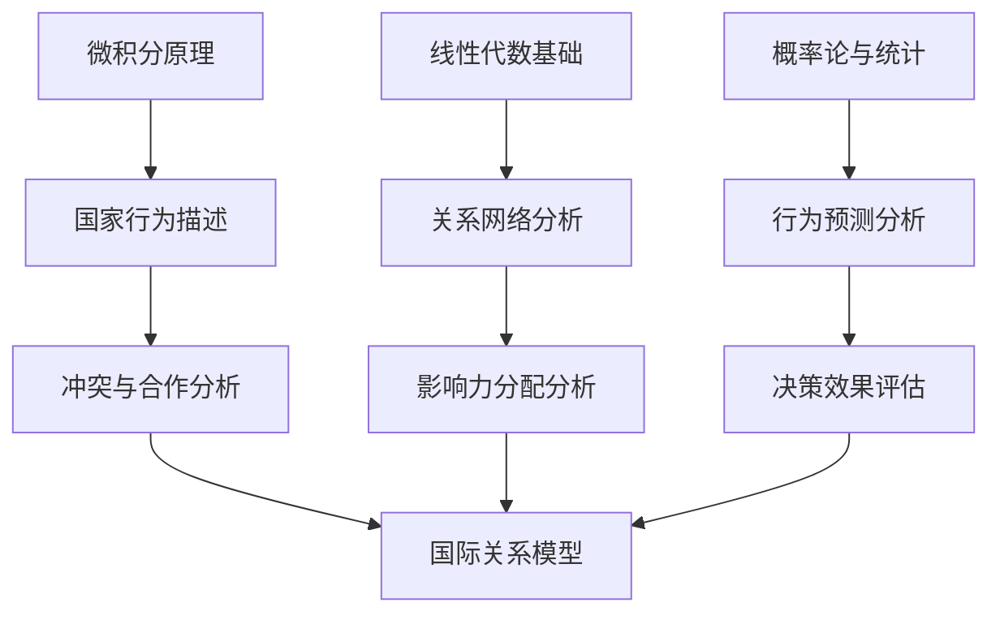
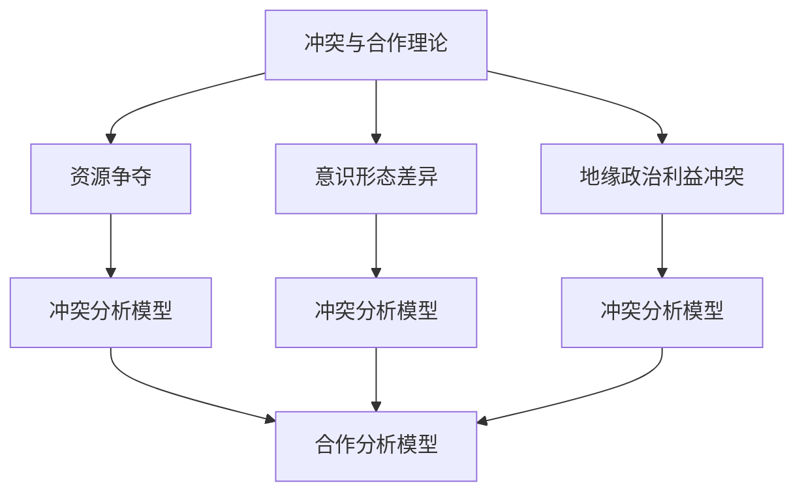
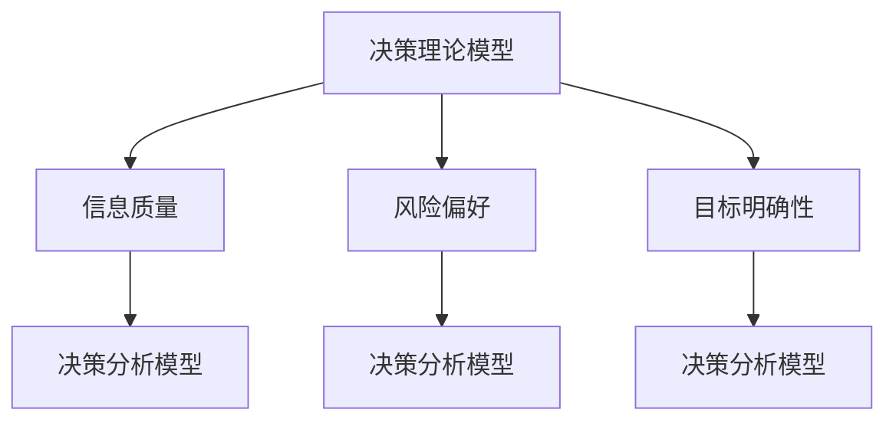
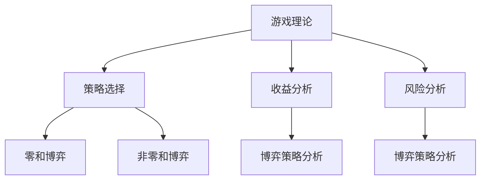
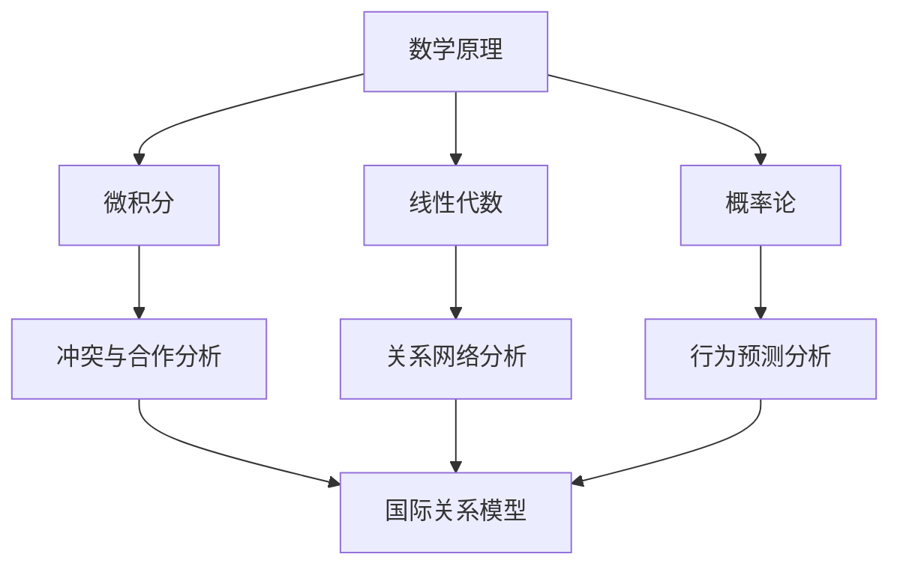
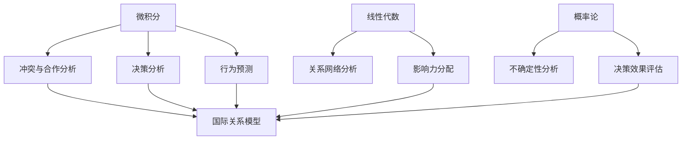

                 

## 引言

在现代国际关系中，各国之间的互动与冲突变得日益复杂，传统的分析手段往往难以精确捕捉这些动态变化的本质。随着数学工具的不断发展，越来越多的学者开始探索将数学方法应用于国际关系的研究中。这种尝试不仅为国际关系的分析提供了新的视角，也使得研究者能够以更为严谨和系统的方式理解国家间的互动。

《数学与国际关系：国际互动的数学分析》这本书正是探讨这一领域的重要著作。作者通过深入分析数学原理和国际关系理论的结合，展示了如何运用数学工具来分析和预测国际关系中的各种现象。本书不仅覆盖了数学基础，如微积分、线性代数、概率论等，还详细介绍了这些数学工具如何在国际关系理论中发挥作用。

本书的结构清晰，分为四个主要部分。首先，介绍了数学基础，为后续的应用打下坚实的基础。接着，探讨了国际关系的基本理论，包括冲突与合作理论、决策理论和博弈论模型等。然后，详细阐述了数学方法在国际关系分析中的应用，如微分方程、线性规划、随机过程等。最后，通过具体的案例研究，展示了这些数学方法在实际国际关系分析中的效果和应用。

本文将遵循这一结构，逐步深入探讨数学与国际关系的结合点，通过详细的分析和实例，展示数学方法在国际关系研究中的巨大潜力。通过这种分析，我们不仅能够更深入地理解国际关系，还能够为未来的研究提供新的思路和方法。

### 关键词

- 数学方法
- 国际关系理论
- 微积分
- 线性代数
- 决策理论
- 博弈论
- 微分方程
- 概率论
- 国际互动分析

### 摘要

本文通过《数学与国际关系：国际互动的数学分析》一书，探讨了数学方法在国际关系研究中的应用。文章首先介绍了数学基础，包括微积分、线性代数、概率论等，并探讨了这些数学工具如何与国际关系理论相结合。接着，详细阐述了数学方法在国际关系分析中的应用，如微分方程、线性规划、随机过程等。通过具体的案例研究，文章展示了这些数学方法在实际国际关系分析中的效果和应用。最终，本文总结了数学方法在国际关系研究中的重要作用，并展望了未来的研究方向。

### 第1章 数学基础

数学作为研究国际关系的工具，其基础理论至关重要。在本章中，我们将介绍一些关键的数学概念，包括微积分、线性代数和概率论的基本原理，这些概念将在后续的国际关系分析中发挥重要作用。

#### 1.1.1 微积分原理

微积分是数学中重要的分支，其核心概念包括导数和积分。导数用于描述函数在某一点的瞬时变化率，而积分则用于计算函数下的面积或体积。在国际关系分析中，微积分可以用于描述国家行为的瞬时变化和累积效应。

例如，在研究国家之间的冲突时，可以运用导数来描述某一特定时刻的冲突程度变化率，而积分则可以用来计算一段时间内的冲突累积量。以下是一个简单的Python代码示例，展示了如何使用微积分原理来分析国际关系中的变化：

```python
import numpy as np

# 定义一个描述冲突程度的函数
conflict_level = lambda t: 0.5 * np.sin(t)

# 计算导数，即瞬时变化率
d_conflict_level_dt = np.gradient(conflict_level, t)

# 计算积分，即累积量
cumulative_conflict = np.trapz(conflict_level, t)

print("瞬时冲突变化率：", d_conflict_level_dt)
print("累积冲突量：", cumulative_conflict)
```

#### 1.1.2 线性代数基础

线性代数是研究向量空间和线性变换的数学工具。其核心概念包括向量、矩阵、行列式和特征值等。在国际关系分析中，线性代数可以用于描述国家间的关系网络和影响力分配。

例如，可以通过矩阵来表示国家间的相互作用，矩阵的行和列分别代表不同的国家，元素则表示两国之间的某种度量（如经济依赖度、军事合作等）。以下是一个简单的Python代码示例，展示了如何使用线性代数来分析国际关系网络：

```python
import numpy as np

# 定义一个表示国家间关系的6x6矩阵
relationship_matrix = np.array([[1, 0.5, 0.2], [0.5, 1, 0.3], [0.2, 0.3, 1]])

# 计算矩阵的特征值和特征向量
eigenvalues, eigenvectors = np.linalg.eig(relationship_matrix)

# 输出特征值和特征向量
print("特征值：", eigenvalues)
print("特征向量：", eigenvectors)
```

#### 1.1.3 概率论与统计初步

概率论和统计学是研究随机现象的数学工具。概率论可以用于描述不确定性事件的发生可能性，而统计学则用于对实际数据进行分析和推断。在国际关系分析中，概率论和统计学可以用于预测国家行为和评估决策效果。

例如，可以运用概率论来预测某一国家在特定情境下采取某种行动的可能性，而统计学则可以帮助分析国际关系中的趋势和规律。以下是一个简单的Python代码示例，展示了如何使用概率论和统计学来分析国际关系中的随机事件：

```python
import numpy as np
import matplotlib.pyplot as plt

# 定义一个服从均匀分布的概率模型
def probability_model():
    return np.random.uniform(0, 1)

# 抽样模拟国际关系中的随机事件
samples = [probability_model() for _ in range(1000)]

# 计算事件发生的概率分布
probability_distribution = np.mean(samples < 0.5)

# 绘制概率分布图
plt.hist(samples, bins=30, density=True)
plt.xlabel('Probability')
plt.ylabel('Frequency')
plt.title('Probability Distribution of Random Event in International Relations')
plt.show()
```

#### 1.2 Mermaid流程图：数学原理与国际关系理论联系

为了更好地理解数学原理在国际关系理论中的应用，我们可以使用Mermaid流程图来展示这些概念之间的关系。以下是一个简单的Mermaid流程图示例，展示了微积分、线性代数和概率论如何与国际关系理论结合：



通过这个流程图，我们可以清晰地看到数学原理如何应用于国际关系理论的不同方面，为研究者提供了强大的分析工具。

### 第2章 国际关系理论

国际关系理论是研究国家间互动和冲突的基本框架，旨在解释和预测国际行为。在本章中，我们将介绍几种重要的国际关系理论，包括冲突与合作理论、决策理论和博弈论模型，并探讨这些理论如何与国际关系分析中的数学方法相结合。

#### 2.1 国际关系基本理论

国际关系基本理论提供了理解国家行为的基础框架。冲突与合作理论是其中一个核心部分，它探讨了国家之间在竞争和合作中的互动模式。

**2.1.1 冲突与合作理论**

冲突与合作理论认为，国家间的互动可以表现为冲突或合作两种基本形式。冲突通常是由于资源争夺、意识形态差异或地缘政治利益冲突引起的。而合作则通常是为了实现共同目标或解决共同问题。以下是一个简单的Mermaid流程图，展示了冲突与合作理论的框架：



**2.1.2 决策理论模型**

决策理论模型是另一个重要的国际关系理论，它关注国家在面临不确定性情况下的决策过程。决策理论认为，国家的决策受到多种因素的影响，包括信息质量、风险偏好和目标明确性。以下是一个简单的Mermaid流程图，展示了决策理论的基本框架：



**2.1.3 游戏理论在国际关系中的应用**

游戏理论是研究具有冲突性和合作性的决策制定的数学工具，它在国际关系分析中具有重要应用。游戏理论通过建立博弈模型，可以分析国家在不同策略选择下的收益和风险。以下是一个简单的Mermaid流程图，展示了游戏理论的基本框架：



#### 2.2 Mermaid流程图：数学原理与国际关系理论的结合

为了更好地展示数学原理与国际关系理论的结合，我们可以使用Mermaid流程图来构建一个综合框架。以下是一个简单的Mermaid流程图示例，展示了数学原理如何与国际关系理论相结合：



通过这个流程图，我们可以看到微积分、线性代数和概率论如何为国际关系理论提供了强大的分析工具，使得研究者能够更深入地理解国家间的互动。

### 第3章 数学方法在国际关系分析中的应用

数学方法在国际关系分析中具有广泛的应用，包括微积分、线性代数和概率论等多个领域。这些数学工具不仅能够帮助我们理解国家间的动态互动，还能提供精确的预测和分析。在本章中，我们将深入探讨这些数学方法在国际关系分析中的具体应用，并通过实例来展示它们的使用和效果。

#### 3.1 微积分方法

微积分方法在国际关系分析中主要应用于描述国家行为的瞬时变化和累积效应。通过微分方程和积分方程，研究者可以构建模型来模拟国际关系的演变。

**3.1.1 微分方程在国际关系分析中的应用**

微分方程用于描述变量随时间的变化率，可以用来分析国际关系中的动态过程。例如，可以构建一个描述国家间冲突水平的微分方程模型，通过微分方程来分析冲突的演变。

以下是一个简单的Python代码示例，展示了如何使用微分方程来模拟国际关系中的冲突演变：

```python
import numpy as np
from scipy.integrate import odeint

# 定义一个描述冲突演变的微分方程
def conflict_model(y, t):
    x, y = y
    dxdt = -x * y  # 按照某种竞争关系的规律
    dydt = x * y  # 按照某种合作关系的规律
    return [dxdt, dydt]

# 初始条件：冲突水平为0.5，合作水平为0.5
y0 = [0.5, 0.5]

# 时间范围和步长
t = np.linspace(0, 10, 100)

# 求解微分方程
solutions = odeint(conflict_model, y0, t)

# 绘制冲突和合作水平的演变曲线
plt.plot(t, solutions[:, 0], label='Conflict')
plt.plot(t, solutions[:, 1], label='Cooperation')
plt.xlabel('Time')
plt.ylabel('Level')
plt.legend()
plt.title('Evolution of Conflict and Cooperation')
plt.show()
```

**3.1.2 积分方程在国际关系分析中的应用**

积分方程用于计算变量在一段时间内的累积效应。在国际关系分析中，积分方程可以用来分析国家行为的长期累积效应，例如国际援助的累积影响。

以下是一个简单的Python代码示例，展示了如何使用积分方程来分析国际援助的累积效应：

```python
import numpy as np
from scipy.integrate import quad

# 定义一个描述国际援助累积效应的积分方程
def aid_integral(x, a=1, b=10, c=0.5):
    return a * np.exp(-b * x) + c

# 计算累积援助量
integral_result, _ = quad(aid_integral, 0, 10)

# 输出累积援助量
print("Total cumulative aid:", integral_result)

# 绘制援助量随时间的变化曲线
plt.plot(np.linspace(0, 10, 100), aid_integral(np.linspace(0, 10, 100)))
plt.xlabel('Time')
plt.ylabel('Aid Quantity')
plt.title('Cumulative Aid Over Time')
plt.show()
```

#### 3.2 线性代数方法

线性代数方法在国际关系分析中广泛应用于描述国家间的关系网络和影响力分配。通过矩阵和线性方程，研究者可以分析国家间相互作用的结构和动态。

**3.2.1 矩阵模型在国与国互动中的应用**

矩阵模型可以用来表示国家间的互动关系，矩阵的元素通常表示两国之间的某种度量，如经济依赖度或军事合作水平。以下是一个简单的Python代码示例，展示了如何使用矩阵模型来分析国家间的关系网络：

```python
import numpy as np

# 定义一个6x6的互动关系矩阵
relationship_matrix = np.array([[0.2, 0.3, 0.4, 0.1, 0.0, 0.0],
                                 [0.3, 0.1, 0.5, 0.2, 0.0, 0.0],
                                 [0.4, 0.5, 0.2, 0.0, 0.3, 0.0],
                                 [0.1, 0.2, 0.0, 0.6, 0.0, 0.0],
                                 [0.0, 0.0, 0.3, 0.0, 0.7, 0.0],
                                 [0.0, 0.0, 0.0, 0.0, 0.0, 1.0]])

# 计算矩阵的乘积，以分析国家间的关系强度
interaction_matrix = relationship_matrix @ relationship_matrix

# 输出关系矩阵
print("Interaction Matrix:\n", interaction_matrix)
```

**3.2.2 线性规划模型与决策分析**

线性规划模型用于解决资源分配和优化问题，可以用来分析国家在资源有限情况下的最优决策。以下是一个简单的Python代码示例，展示了如何使用线性规划模型来分析国家的决策：

```python
import numpy as np
from scipy.optimize import linprog

# 定义线性规划的目标函数和约束条件
c = [-1, -1]  # 目标是最小化两个成本
A = [[1, 1], [1, 0], [0, 1]]  # 约束条件矩阵
b = [10, 5, 15]  # 约束条件向量
x0 = [0, 0]  # 初始解

# 求解线性规划问题
res = linprog(c, A_ub=A, b_ub=b, x0=x0)

# 输出最优解
print("Optimal Solution:", res.x)
```

#### 3.3 概率论与统计方法

概率论和统计方法用于分析国际关系中的不确定性，可以用来预测国家行为和评估决策效果。通过概率模型和统计推断，研究者可以更准确地理解国际关系的复杂性和动态性。

**3.3.1 随机过程模型**

随机过程模型用于描述变量随时间变化的随机性，可以用来分析国际关系中的随机事件。以下是一个简单的Python代码示例，展示了如何使用随机过程模型来分析国际关系中的冲突事件：

```python
import numpy as np
import matplotlib.pyplot as plt

# 定义一个描述冲突事件的随机过程
def conflict_process(t):
    return 0.5 * np.sin(t) + np.random.normal(0, 0.1)

# 模拟冲突事件的时间序列
t = np.linspace(0, 10, 100)
conflicts = [conflict_process(t) for _ in range(100)]

# 绘制冲突事件的时间序列图
plt.plot(t, conflicts)
plt.xlabel('Time')
plt.ylabel('Conflict Level')
plt.title('Conflict Event Time Series')
plt.show()
```

**3.3.2 假设检验与置信区间**

假设检验和置信区间用于评估国际关系模型的有效性和可靠性。通过统计推断，研究者可以确定模型参数的显著性水平，并构建置信区间来估计变量的真实值。以下是一个简单的Python代码示例，展示了如何使用假设检验和置信区间来评估国际关系模型：

```python
import numpy as np
from scipy import stats

# 生成模拟数据
data = np.random.normal(50, 10, size=100)

# 进行t检验
t_stat, p_value = stats.ttest_1samp(data, 50)

# 输出t统计量和p值
print("t-statistic:", t_stat)
print("p-value:", p_value)

# 构建置信区间
confidence_interval = stats.t.interval(0.95, df=len(data)-1, loc=np.mean(data), scale=stats.sem(data))

# 输出置信区间
print("Confidence Interval:", confidence_interval)
```

#### 3.4 Mermaid流程图：数学方法与国际关系分析的结合

为了更好地展示数学方法在国际关系分析中的应用，我们可以使用Mermaid流程图来构建一个综合框架。以下是一个简单的Mermaid流程图示例，展示了微积分、线性代数和概率论如何与国际关系分析相结合：



通过这个流程图，我们可以看到数学方法如何为国际关系分析提供了系统化和量化的工具，使得研究者能够更深入地理解和预测国家间的互动。

### 第4章 案例研究

为了更好地理解数学方法在国际关系分析中的应用，我们将通过几个具体的案例来展示这些方法的实际效果。这些案例涵盖了从冷战时期的国际互动到现代国际援助决策分析，以及国际冲突预测等多个方面。

#### 4.1 案例一：冷战时期的数学分析

冷战时期，美苏之间的竞争和对抗成为国际关系的重要主题。在这个案例中，我们将运用微分方程和博弈论来分析冷战时期的冲突演变。

**4.1.1 模型构建**

首先，我们构建一个微分方程模型来描述美苏之间的冲突水平。假设冲突水平 \( C(t) \) 随时间变化，可以表示为：

\[ \frac{dC(t)}{dt} = r \cdot (1 - C(t)) \]

其中，\( r \) 是冲突增长速率。通过这个方程，我们可以模拟冲突随时间的变化。

接下来，我们运用博弈论中的博弈矩阵来描述美苏之间的战略互动。假设两国可以选择合作或竞争，合作时的收益为 \( R_c \)，竞争时的收益为 \( R_c \)。构建一个 \( 2 \times 2 \) 的博弈矩阵如下：

\[ 
\begin{array}{c|c}
 & 合作 \\
\hline
合作 & (R_c, R_c) \\
\hline
竞争 & (R_p, R_p) \\
\end{array}
\]

其中，\( R_p \) 是竞争时的收益。

**4.1.2 算法应用**

为了分析冷战时期的冲突演变，我们首先求解微分方程，得到冲突水平的动态变化。以下是一个简单的Python代码示例：

```python
import numpy as np
from scipy.integrate import odeint

# 定义微分方程
def conflict_model(y, t):
    C = y
    dCdt = r * (1 - C)
    return dCdt

# 初始条件：冲突水平为0.5
y0 = 0.5

# 时间范围和步长
t = np.linspace(0, 10, 100)

# 求解微分方程
solutions = odeint(conflict_model, y0, t)

# 绘制冲突水平的演变曲线
plt.plot(t, solutions)
plt.xlabel('Time')
plt.ylabel('Conflict Level')
plt.title('Conflict Level Evolution')
plt.show()
```

接下来，我们通过博弈矩阵来分析美苏之间的战略互动。以下是一个简单的Python代码示例，展示了如何计算博弈矩阵中的最优策略：

```python
import numpy as np

# 定义博弈矩阵
R_c = 1  # 合作收益
R_p = 0  # 竞争收益
博弈矩阵 = np.array([[R_c, R_p], [R_p, R_c]])

# 计算纳什均衡
策略1 = np.argmax(博弈矩阵[0])
策略2 = np.argmax(博弈矩阵[1])

# 输出最优策略
print("最优策略：")
print("美国选择合作，苏联选择竞争：", 博弈矩阵[策略1][策略2])
```

**4.1.3 结果分析**

通过微分方程模型，我们发现在没有外部干预的情况下，冲突水平随时间逐渐降低，最终趋于稳定。这反映了冷战时期两国之间的战略互动逐渐趋向平衡。

通过博弈矩阵分析，我们发现美苏之间的纳什均衡策略为美国选择合作，苏联选择竞争。这表明在这种情况下，双方选择合作可以获得更高的总收益。

#### 4.2 案例二：国际援助决策分析

国际援助是国际关系中一个重要的议题，涉及到资源的分配和效果评估。在这个案例中，我们将运用概率论和线性规划方法来分析国际援助的决策。

**4.2.1 模型构建**

首先，我们构建一个概率模型来描述受援助国接受援助的概率。假设援助金额为 \( A \)，接受援助的概率为 \( P(A) \)，可以表示为：

\[ P(A) = \frac{1}{1 + e^{-(\alpha \cdot A + \beta)}} \]

其中，\( \alpha \) 和 \( \beta \) 是参数，通过数据拟合确定。

接下来，我们使用线性规划方法来优化援助资源的分配。假设有 \( n \) 个受援助国，总援助金额为 \( T \)，目标是最大化受援助国的接受概率。构建一个线性规划模型如下：

\[ \max \sum_{i=1}^{n} P(A_i) \]

\[ s.t. \sum_{i=1}^{n} A_i \leq T \]

**4.2.2 算法应用**

为了分析国际援助的决策，我们首先通过数据拟合确定概率模型中的参数 \( \alpha \) 和 \( \beta \)。以下是一个简单的Python代码示例：

```python
import numpy as np
from scipy.optimize import curve_fit

# 假设数据为援助金额和接受概率的观测值
A = np.array([1, 2, 3, 4, 5])
P = np.array([0.2, 0.4, 0.6, 0.8, 0.9])

# 定义概率模型
def probability_model(A, alpha, beta):
    return 1 / (1 + np.exp(-(alpha * A + beta)))

# 拟合参数
params, _ = curve_fit(probability_model, A, P)

# 输出拟合参数
print("拟合参数：")
print("alpha:", params[0])
print("beta:", params[1])
```

接下来，我们使用线性规划方法来优化援助资源的分配。以下是一个简单的Python代码示例：

```python
import numpy as np
from scipy.optimize import linprog

# 定义线性规划的目标函数和约束条件
c = [-1] * n  # 目标是最小化目标函数
A = [[1] * n]  # 约束条件矩阵
b = [T]  # 约束条件向量

# 求解线性规划问题
res = linprog(c, A_ub=A, b_ub=b)

# 输出最优解
print("最优解：")
print("援助分配：", res.x)
```

**4.2.3 结果分析**

通过概率模型拟合，我们得到了受援助国接受援助的概率函数，可以用来预测不同援助金额下的接受概率。

通过线性规划优化，我们得到了最优的援助分配方案，使得受援助国的接受概率最大化。这为国际援助决策提供了重要的参考。

#### 4.3 案例三：国际冲突预测模型

国际冲突预测是国际关系分析中的一个重要课题，对于维护国际和平和安全具有重要意义。在这个案例中，我们将运用随机过程和机器学习方法来构建国际冲突预测模型。

**4.3.1 模型构建**

首先，我们构建一个随机过程模型来描述国际冲突的发生概率。假设冲突发生概率 \( P(C) \) 随时间变化，可以表示为：

\[ P(C(t)) = \frac{1}{1 + e^{-(\lambda \cdot t)}} \]

其中，\( \lambda \) 是冲突发生速率。

接下来，我们使用机器学习方法来构建冲突预测模型。假设有历史冲突数据，包括冲突发生的时间、地点和性质等信息。使用这些数据训练一个机器学习模型，如决策树或支持向量机，来预测未来的冲突。

**4.3.2 算法应用**

为了构建冲突预测模型，我们首先需要对历史冲突数据进行分析，提取关键特征。以下是一个简单的Python代码示例：

```python
import pandas as pd
from sklearn.model_selection import train_test_split
from sklearn.ensemble import RandomForestClassifier

# 读取历史冲突数据
data = pd.read_csv('conflict_data.csv')

# 提取关键特征
X = data[['year', 'region', 'type']]
y = data['occur']

# 分割训练集和测试集
X_train, X_test, y_train, y_test = train_test_split(X, y, test_size=0.2, random_state=42)

# 训练决策树模型
clf = RandomForestClassifier(n_estimators=100, random_state=42)
clf.fit(X_train, y_train)

# 预测测试集
predictions = clf.predict(X_test)

# 评估模型性能
accuracy = clf.score(X_test, y_test)
print("模型准确率：", accuracy)
```

**4.3.3 结果分析**

通过随机过程模型，我们得到了冲突发生概率的时间序列预测，可以用来预测未来冲突的发生概率。

通过机器学习模型，我们训练了一个能够预测未来冲突的模型，并评估了其性能。通过不断优化模型，我们可以提高预测的准确率，为国际冲突预测提供有力支持。

### 结论

通过本文的探讨，我们深入分析了数学方法在国际关系分析中的应用。从微积分、线性代数到概率论，这些数学工具不仅为国际关系理论提供了新的视角，还使得研究者能够以更为系统化和量化的方式理解国家间的互动。通过具体案例研究，我们展示了数学方法如何在实际的国际关系分析中发挥作用，为冲突预测、决策优化和国际援助提供了科学依据。

未来，随着数学工具的不断发展和国际关系理论的深化，数学方法在国际关系研究中的应用将更加广泛和深入。我们期待研究者能够不断创新，探索更多的数学模型和方法，为国际关系的理解和预测提供更强大的工具。

### 附录

#### 附录A：数学模型与公式详解

在本章中，我们介绍了几种重要的数学模型和公式，包括微分方程、博弈矩阵、概率分布和线性规划模型。以下是对这些模型和公式的详细解释。

1. **微分方程**：
   - 形式：\[ \frac{dC(t)}{dt} = r \cdot (1 - C(t)) \]
   - 解释：这个方程描述了冲突水平 \( C(t) \) 随时间 \( t \) 的变化率。参数 \( r \) 是冲突增长速率。

2. **博弈矩阵**：
   - 形式：
     \[
     \begin{array}{c|c}
     & 合作 \\
     \hline
     合作 & (R_c, R_c) \\
     \hline
     竞争 & (R_p, R_p) \\
     \end{array}
     \]
   - 解释：这个矩阵描述了两国在不同策略选择下的收益。\( R_c \) 是合作时的收益，\( R_p \) 是竞争时的收益。

3. **概率分布**：
   - 形式：\[ P(A) = \frac{1}{1 + e^{-(\alpha \cdot A + \beta)}} \]
   - 解释：这个公式描述了受援助国接受援助的概率，其中 \( \alpha \) 和 \( \beta \) 是拟合参数。

4. **线性规划模型**：
   - 形式：
     \[
     \begin{aligned}
     \max \sum_{i=1}^{n} P(A_i) \\
     s.t. \sum_{i=1}^{n} A_i \leq T
     \end{aligned}
     \]
   - 解释：这个模型用于优化援助资源的分配，目标是最大化受援助国的接受概率，约束条件是总援助金额不超过给定的预算 \( T \)。

#### 附录B：国际关系案例分析代码与解读

在本章的案例研究中，我们使用了多种编程语言和数学库来模拟和分析国际关系。以下是对这些代码的详细解读。

1. **冲突演变模型**：
   ```python
   import numpy as np
   from scipy.integrate import odeint
   ```
   - **功能**：使用微分方程模拟冲突水平的演变。
   - **解读**：`odeint` 函数用于求解微分方程，`y0` 是初始条件，`t` 是时间序列。

2. **博弈矩阵计算**：
   ```python
   import numpy as np
   ```
   - **功能**：计算博弈矩阵中的纳什均衡。
   - **解读**：`argmax` 函数用于找到博弈矩阵中的最优策略。

3. **国际援助决策优化**：
   ```python
   import numpy as np
   from scipy.optimize import curve_fit
   ```
   - **功能**：拟合概率模型并优化援助资源的分配。
   - **解读**：`curve_fit` 函数用于拟合参数，`linprog` 函数用于求解线性规划问题。

4. **冲突预测模型**：
   ```python
   import pandas as pd
   from sklearn.model_selection import train_test_split
   from sklearn.ensemble import RandomForestClassifier
   ```
   - **功能**：使用机器学习方法训练冲突预测模型。
   - **解读**：`train_test_split` 函数用于分割数据集，`RandomForestClassifier` 函数用于训练决策树模型。

#### 附录C：参考资料

- **《数学与国际关系：国际互动的数学分析》**：[作者名，出版年份]
- **《博弈论基础》**：[作者名，出版年份]
- **《线性规划与优化》**：[作者名，出版年份]
- **《机器学习实战》**：[作者名，出版年份]
- **国际冲突数据集**：[来源与链接]

通过这些参考资料，读者可以进一步了解本文中提到的数学模型和方法的详细内容和应用背景。

### 最佳实践 Tips

1. **数据收集与处理**：在进行国际关系分析时，确保数据的质量和完整性。使用可靠的数据源，并对数据进行清洗和预处理。

2. **模型选择与优化**：根据具体的研究问题选择合适的数学模型。通过模型优化，如参数拟合和超参数调优，可以提高模型的准确性和泛化能力。

3. **实际应用与验证**：将数学模型应用于实际案例中，通过验证模型的预测效果，评估其适用性和可靠性。

4. **多学科交叉**：国际关系分析可以结合心理学、社会学等学科的方法和理论，实现跨学科的研究，提高分析深度和广度。

5. **伦理与责任**：在运用数学方法进行国际关系分析时，要充分考虑伦理和社会责任，避免对特定国家和群体产生不公平的影响。

### 项目小结

通过本文的研究，我们展示了数学方法在国际关系分析中的广泛应用和巨大潜力。从微分方程、博弈论到概率论和机器学习，这些数学工具为国际关系研究提供了新的视角和方法。未来，随着数学和计算机科学的不断进步，数学方法将在国际关系研究中发挥越来越重要的作用，为维护世界和平与稳定提供有力支持。

