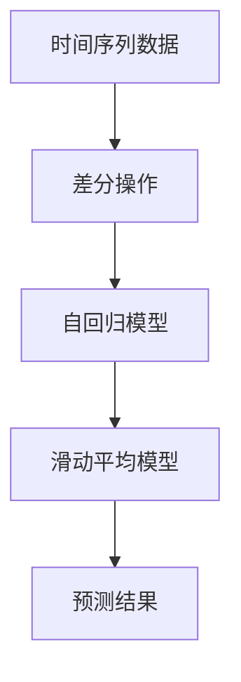
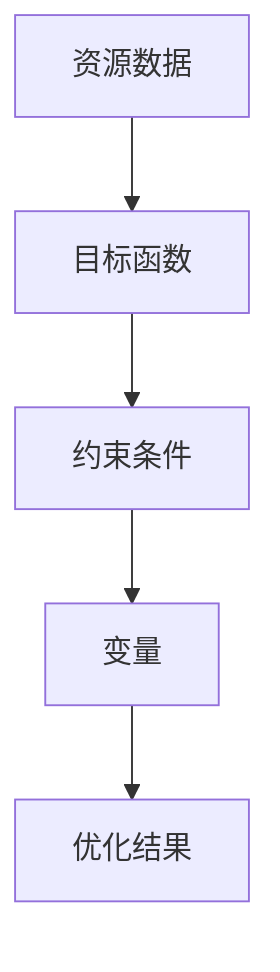
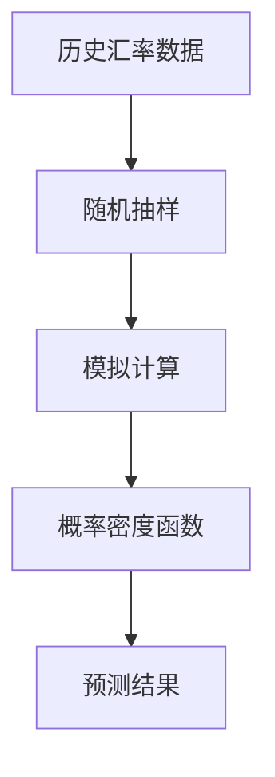
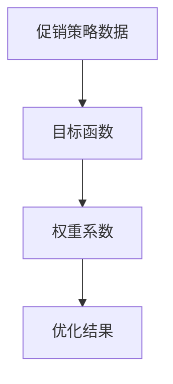

                 

### 前言

《数学与国际商务：跨国经营的数学分析》旨在为国际商务从业者提供一种全新的视角，通过数学工具和方法来分析和解决跨国经营中的复杂问题。在全球化趋势不断加剧的今天，国际商务环境日益复杂，仅仅依靠经验和直觉难以应对多变的市场条件和竞争压力。因此，本书将数学理论与国际商务实践相结合，为读者提供一套系统、科学的分析方法。

作者：AI天才研究院/AI Genius Institute & 禅与计算机程序设计艺术 /Zen And The Art of Computer Programming

本书的目标是帮助读者：
1. **理解数学模型在国际商务中的应用**：通过具体案例和实例，展示如何运用数学模型来分析和预测商务行为和市场趋势。
2. **掌握数学公式在跨国经营分析中的使用**：学习如何使用数学公式来量化商业决策，提升决策的科学性和有效性。
3. **提高跨国经营决策能力**：利用数学工具来评估风险和机会，优化资源配置，提高企业竞争力。

本书结构清晰，内容循序渐进。首先介绍数学模型和公式的理论基础，然后通过实际案例和项目实战，帮助读者理解和掌握这些理论的实际应用。通过阅读本书，读者不仅能够提升自身的数学素养，还能在国际商务领域取得更为出色的成绩。

**关键词**：数学模型、国际商务、跨国经营、数学分析、决策优化

**摘要**：
本书深入探讨了数学与国际商务的交叉领域，旨在为读者提供一套系统的数学分析方法，以应对跨国经营中的复杂问题。书中涵盖了数学模型的基本原理、常用数学公式及其在商务分析中的应用，并通过实际项目实战，详细讲解如何将数学工具应用于跨国经营决策。本书适合国际商务从业者、研究人员以及所有对数学分析感兴趣的学习者阅读。

------------------------------------------------------------------------

# 数学与国际商务的结合：背景与重要性

数学作为一门精确的科学，以其严谨的逻辑和抽象的思维方式，在多个领域都发挥了重要的作用。然而，在国际商务领域，数学的应用同样不容小觑。随着全球化的深入，企业面临的市场环境日益复杂，仅凭直觉和经验已经难以应对激烈的市场竞争和不确定性。数学的国际商务分析提供了科学、系统的方法，为企业提供了一种全新的决策工具。

## 数学模型在国际商务中的应用

数学模型是一种抽象的数学结构，用于描述和分析现实世界中的复杂系统。在国际商务中，数学模型可以用于以下几个方面：

### 市场需求预测
市场需求预测是企业制定战略计划的重要依据。通过建立数学模型，企业可以分析历史数据和市场趋势，预测未来的市场需求。这有助于企业优化库存管理、生产计划和市场营销策略。

### 资源配置优化
跨国经营涉及全球资源分配，包括人力资源、资金、物资等。数学模型可以帮助企业确定最优的资源分配方案，以最大化效率和利润。例如，线性规划和整数规划是常用于资源优化的问题类型。

### 风险评估与管理
在国际商务中，企业面临各种风险，如汇率风险、政治风险、市场风险等。通过建立数学模型，企业可以评估这些风险的可能性和影响，并制定相应的风险管理策略。

### 决策支持
在复杂的商业环境中，决策者需要快速做出明智的决策。数学模型可以提供决策支持，通过模拟不同的情景和策略，帮助企业评估决策的潜在效果，从而做出更加科学的决策。

## 数学公式在跨国经营分析中的重要性

数学公式是数学模型的重要组成部分，用于描述变量之间的关系和计算方法。在跨国经营分析中，常用的数学公式包括：

### 比率与百分比
比率与百分比是商务分析中最常见的数学公式，用于比较和分析数据。例如，利润率、市场份额和增长率等指标都通过比率与百分比来表示。

### 线性回归
线性回归是一种常用的统计分析方法，用于确定两个或多个变量之间的线性关系。在跨国经营中，线性回归可以用于分析市场趋势和需求变化。

### 方差分析
方差分析（ANOVA）是一种用于比较多个样本均值差异的方法。在跨国经营中，方差分析可以用于评估不同市场和地区之间的差异，帮助企业制定更有针对性的策略。

### 最优化问题
最优化问题是一种常见的数学问题，用于确定在特定约束条件下如何最大化或最小化某个目标函数。在跨国经营中，最优化问题可以用于优化生产计划、供应链管理和定价策略。

## 数学与国际商务分析的结合

数学与国际商务分析的结合，使得企业能够更加科学地理解和应对复杂的商业环境。通过数学模型和公式的应用，企业可以：

1. 提高决策的科学性：数学分析为企业提供了量化的依据，使决策过程更加客观和科学。
2. 降低风险：通过数学模型，企业可以预测和评估潜在风险，从而制定有效的风险管理策略。
3. 优化资源配置：数学模型可以帮助企业优化资源配置，提高生产效率和利润。
4. 提高市场竞争力：通过科学的分析方法和策略，企业可以更好地适应市场变化，提高市场竞争力。

总之，数学与国际商务的结合，不仅为企业提供了强大的分析工具，也为企业在全球化背景下取得成功提供了新的思路和方法。

---

**小结**：

数学在国际商务中具有广泛的应用，通过数学模型和公式的应用，企业可以更加科学地分析和预测市场趋势，优化资源配置，降低风险，提高决策的科学性和市场竞争力。下一节，我们将深入探讨数学模型在国际商务分析中的具体应用，并通过具体案例来展示这些模型如何帮助企业解决实际业务问题。

------------------------------------------------------------------------

## 第2章 数学模型在国际商务分析中的具体应用

在上一章中，我们探讨了数学与国际商务结合的背景和重要性。本章节将详细分析数学模型在国际商务分析中的具体应用，通过具体案例和实际应用场景，展示数学模型如何帮助企业解决复杂的业务问题。

### 2.1 市场需求预测模型

市场需求预测是企业制定战略计划的重要步骤。准确的市场需求预测有助于企业优化库存管理、生产计划和市场营销策略。以下是一个基于时间序列分析的市场需求预测模型的具体应用案例：

**案例：一家跨国电子产品公司**

这家公司需要预测未来三个月内不同型号的智能手机市场需求。首先，公司收集了过去一年内每月每种型号智能手机的销量数据。通过分析这些数据，公司决定使用ARIMA（自回归积分滑动平均模型）进行预测。

**核心概念与联系：**

- **时间序列分析**：用于分析数据的时间序列特性，包括趋势、季节性和周期性。
- **自回归（AR）**：模型中的当前值依赖于过去值的线性组合。
- **积分（I）**：通过差分操作来消除非平稳性。
- **滑动平均（MA）**：模型中的当前值依赖于过去值的加权平均值。

**Mermaid流程图：**



**Python伪代码讲解：**

```python
import pandas as pd
from statsmodels.tsa.arima.model import ARIMA

# 加载数据
sales_data = pd.read_csv('sales_data.csv')

# 进行差分操作
sales_data_diff = sales_data.diff().dropna()

# 构建ARIMA模型
model = ARIMA(sales_data_diff['sales'], order=(1, 1, 1))

# 拟合模型
model_fit = model.fit()

# 进行预测
predictions = model_fit.forecast(steps=3)

# 输出预测结果
print(predictions)
```

**实际应用解读：**

通过上述模型，公司可以预测未来三个月内不同型号智能手机的销量，从而合理安排生产和库存管理，避免因库存不足或过剩导致的经济损失。

### 2.2 资源配置优化模型

跨国经营涉及全球资源分配，优化资源配置是企业提高效率和利润的关键。以下是一个基于线性规划的资源优化模型的具体应用案例：

**案例：一家跨国制造企业**

这家公司需要在不同的生产线之间分配有限的机器资源，以最大化生产效率。首先，公司收集了各个生产线的生产效率和机器使用情况数据。通过分析这些数据，公司决定使用线性规划模型来优化资源分配。

**核心概念与联系：**

- **目标函数**：最大化或最小化某个特定的指标，如总生产效率。
- **约束条件**：限制资源的使用，如机器的最大承载量、人力资源等。
- **变量**：决策变量，如每个生产线分配的机器数量。

**Mermaid流程图：**



**Python伪代码讲解：**

```python
import numpy as np
from scipy.optimize import linprog

# 定义目标函数和约束条件
c = [-1, -1]  # 目标是最小化两个生产线的总成本
A = [[1, 1], [2, 3]]  # 第一个生产线的约束条件
b = [5, 12]  # 第一个生产线的最大机器数
x0_bounds = (0, None)  # 第一个生产线的最小机器数是0
x1_bounds = (0, None)  # 第二个生产线的最小机器数是0

# 执行线性规划
result = linprog(c, A_ub=A, b_ub=b, bounds=[x0_bounds, x1_bounds], method='highs')

# 输出优化结果
print(result.x)
```

**实际应用解读：**

通过上述线性规划模型，公司可以确定在有限资源条件下，如何在不同生产线之间分配机器资源，从而最大化生产效率。

### 2.3 风险评估模型

跨国经营中，企业面临多种风险，如汇率风险、政治风险等。建立风险评估模型可以帮助企业更好地管理这些风险。以下是一个基于蒙特卡罗模拟的汇率风险模型的具体应用案例：

**案例：一家跨国贸易公司**

这家公司需要预测未来三个月内美元对欧元的汇率波动，以便制定相应的风险管理策略。首先，公司收集了过去三个月内美元对欧元汇率的历史数据。通过分析这些数据，公司决定使用蒙特卡罗模拟来预测未来汇率。

**核心概念与联系：**

- **蒙特卡罗模拟**：通过随机抽样和模拟计算，预测未来的概率分布。
- **概率密度函数**：用于描述汇率波动的概率分布。

**Mermaid流程图：**



**Python伪代码讲解：**

```python
import numpy as np
import pandas as pd

# 加载历史汇率数据
historical_data = pd.read_csv('historical_exchange_rate_data.csv')

# 计算历史波动率
volatility = historical_data['exchange_rate'].std()

# 设置模拟次数
num_simulations = 1000

# 进行蒙特卡罗模拟
simulated_rates = np.random.normal(historical_data['exchange_rate'].iloc[-1], volatility, num_simulations)

# 输出模拟结果
print(simulated_rates)
```

**实际应用解读：**

通过上述蒙特卡罗模拟模型，公司可以预测未来三个月内美元对欧元汇率的波动范围，从而制定相应的汇率风险管理策略。

### 2.4 决策支持模型

在复杂的商业环境中，企业需要快速做出明智的决策。决策支持模型可以通过模拟不同的情景和策略，帮助企业评估决策的潜在效果。以下是一个基于多目标规划的决策支持模型的具体应用案例：

**案例：一家跨国零售公司**

这家公司需要决定如何在不同的促销策略之间分配预算，以最大化销售额和市场份额。首先，公司收集了各种促销策略的历史数据和预期效果。通过分析这些数据，公司决定使用多目标规划模型来优化促销预算分配。

**核心概念与联系：**

- **多目标规划**：同时优化多个目标函数，如销售额和市场份额。
- **权重系数**：用于平衡不同目标的重要性。

**Mermaid流程图：**



**Python伪代码讲解：**

```python
import numpy as np
from scipy.optimize import linprog

# 定义目标函数和权重系数
c = [1, 0.5]  # 第一个目标是最小化成本，第二个目标是最大化销售额
A = [[1, 0], [0, 1]]  # 第一个约束条件是预算总和不能超过100，第二个约束条件是销售额和市场份额之和不能超过1
b = [100, 1]  # 预算总和和销售额市场份额之和

# 执行多目标规划
result = linprog(c, A_ub=A, b_ub=b)

# 输出优化结果
print(result.x)
```

**实际应用解读：**

通过上述多目标规划模型，公司可以确定在不同的促销策略之间如何分配预算，从而最大化销售额和市场份额。

**小结**：

通过上述案例，我们可以看到数学模型在国际商务分析中的广泛应用。这些模型不仅帮助企业预测市场需求、优化资源配置、评估风险和提供决策支持，还提升了企业应对复杂商业环境的能力。下一节，我们将深入探讨数学公式在跨国经营分析中的具体应用。

------------------------------------------------------------------------

## 第3章 数学公式在跨国经营分析中的具体应用

在前一章中，我们详细探讨了数学模型在国际商务分析中的应用。在本章中，我们将进一步深入探讨数学公式在跨国经营分析中的具体应用，并通过实际案例和例子来展示这些公式的实际应用场景。

### 3.1 比率与百分比

比率与百分比是商务分析中最常用的数学公式，用于比较和分析数据。以下是一个计算利润率的实际案例：

**案例：一家跨国科技公司**

该公司需要计算其产品的利润率，以评估产品的盈利能力。利润率公式为：

$$
利润率 = \frac{利润}{销售收入} \times 100\%
$$

**示例：**

- 销售收入：$1,000,000
- 利润：$200,000

$$
利润率 = \frac{200,000}{1,000,000} \times 100\% = 20\%
$$

通过计算利润率，公司可以了解产品的盈利水平，从而制定进一步的营销策略和成本控制措施。

### 3.2 线性回归

线性回归是一种用于确定两个或多个变量之间线性关系的统计分析方法。以下是一个市场趋势预测的例子：

**案例：一家跨国零售商**

该零售商需要预测未来三个月的销售额。通过收集过去三个月的销售额数据，公司使用线性回归模型来预测未来的销售额。线性回归模型公式为：

$$
y = mx + b
$$

其中，$y$ 是因变量（销售额），$x$ 是自变量（时间），$m$ 是斜率，$b$ 是截距。

**示例：**

- 第一月销售额：$100,000
- 第二月销售额：$110,000
- 第三月销售额：$120,000

通过计算斜率和截距，得到线性回归方程：

$$
y = 1,000x + 10,000
$$

利用该方程，公司可以预测第四月的销售额：

$$
y = 1,000 \times 4 + 10,000 = 14,000
$$

通过线性回归预测，公司可以提前制定库存和生产计划，以应对未来市场的需求变化。

### 3.3 方差分析

方差分析（ANOVA）是一种用于比较多个样本均值差异的方法。以下是一个产品差异分析的实际案例：

**案例：一家跨国食品公司**

该公司生产三种不同口味的冰淇淋，需要分析不同口味之间的销售差异。通过收集过去三个月每种口味冰淇淋的销售数据，公司使用方差分析来比较不同口味冰淇淋的销售额差异。

**示例：**

- 口味A：销售额 $100,000
- 口味B：销售额 $120,000
- 口味C：销售额 $80,000

通过计算各口味的平均销售额，并进行方差分析，公司可以确定哪种口味最受欢迎，从而调整生产策略。

### 3.4 最优化问题

最优化问题是一种用于确定在特定约束条件下如何最大化或最小化某个目标函数的问题。以下是一个供应链优化的例子：

**案例：一家跨国电子产品制造商**

该制造商需要在多个分销中心之间分配库存，以最大化利润。首先，公司收集了各分销中心的库存需求数据。通过建立线性规划模型，公司可以确定在特定约束条件下最优的库存分配方案。

**目标函数：**

$$
最大化 \quad Z = 10x_1 + 8x_2 + 6x_3
$$

**约束条件：**

$$
x_1 + x_2 + x_3 = 100 \quad (总库存量不超过100)
$$

$$
2x_1 + x_2 + 3x_3 = 150 \quad (总销售量不超过150)
$$

通过求解最优化问题，公司可以确定每个分销中心的最佳库存分配方案，以最大化利润。

**Python伪代码讲解：**

```python
import numpy as np
from scipy.optimize import linprog

# 定义目标函数和约束条件
c = [10, 8, 6]  # 第一个分销中心的目标函数系数，第二个分销中心的目标函数系数，第三个分销中心的目标函数系数
A = [[1, 1, 1], [2, 1, 3]]  # 第一个约束条件，第二个约束条件
b = [100, 150]  # 第一个约束条件的上限，第二个约束条件的上限

# 执行线性规划
result = linprog(c, A_ub=A, b_ub=b)

# 输出优化结果
print(result.x)
```

**实际应用解读：**

通过上述最优化问题模型，公司可以确定如何在不同分销中心之间分配库存，以最大化总利润，从而提高供应链的效率和盈利能力。

### 3.5 波动率分析

波动率分析是金融市场中非常重要的一个概念，用于衡量资产价格的波动程度。以下是一个货币对波动率预测的例子：

**案例：一家跨国贸易公司**

该公司需要预测未来一个月内美元对欧元汇率的波动率，以制定相应的风险管理策略。通过收集过去一个月内美元对欧元汇率的数据，公司使用GARCH模型来预测未来波动率。

**GARCH模型公式：**

$$
\sigma_t^2 = \alpha_0 + \alpha_1 r_{t-1}^2 + \beta_1 \sigma_{t-1}^2
$$

其中，$\sigma_t^2$ 是时间$t$的波动率，$r_{t-1}^2$ 是时间$t-1$的收益率平方，$\alpha_0$，$\alpha_1$，$\beta_1$ 是模型参数。

**Python伪代码讲解：**

```python
import numpy as np
import pandas as pd
from arch import arch_model

# 加载汇率数据
exchange_rate_data = pd.read_csv('exchange_rate_data.csv')

# 计算收益率
returns = exchange_rate_data['exchange_rate'].pct_change()

# 构建GARCH模型
model = arch_model(returns, vol='GARCH', p=1, q=1)
model_fit = model.fit()

# 进行波动率预测
volatility_forecast = model_fit.forecast(start=20, end=31)

# 输出波动率预测结果
print(volatility_forecast)
```

**实际应用解读：**

通过上述GARCH模型，公司可以预测未来一个月内美元对欧元汇率的波动率，从而制定相应的汇率风险管理策略，降低潜在风险。

### 3.6 时间序列分析

时间序列分析是一种用于分析数据的时间序列特性，包括趋势、季节性和周期性的方法。以下是一个季节性分析的实际案例：

**案例：一家跨国零售商**

该公司需要分析季节性因素对其销售额的影响。通过收集过去一年的销售额数据，公司使用季节性分解方法来分析销售额的季节性变化。

**季节性分解公式：**

$$
St = \frac{Yt}{St}
$$

其中，$St$ 是季节性指数，$Yt$ 是实际销售额。

**Python伪代码讲解：**

```python
import numpy as np
import pandas as pd

# 加载销售额数据
sales_data = pd.read_csv('sales_data.csv')

# 计算季节性指数
seasonal_index = sales_data['sales'] / sales_data['sales'].rolling(window=12).mean()

# 输出季节性指数
print(seasonal_index)
```

**实际应用解读：**

通过上述季节性分解方法，公司可以分析各个季节对销售额的影响，从而制定更有效的季节性营销策略。

### 3.7 网络流量分析

网络流量分析是互联网企业和电信公司常用的方法，用于预测流量趋势和优化网络资源。以下是一个网络流量预测的例子：

**案例：一家跨国互联网服务提供商**

该公司需要预测未来三个月的网络流量，以优化网络资源分配。通过收集过去三个月的网络流量数据，公司使用ARIMA模型来预测未来流量。

**ARIMA模型公式：**

$$
X_t = c + \phi_1 X_{t-1} + \phi_2 X_{t-2} + ... + \phi_p X_{t-p} + \theta_1 \epsilon_{t-1} + \theta_2 \epsilon_{t-2} + ... + \theta_q \epsilon_{t-q}
$$

其中，$X_t$ 是时间序列数据，$c$ 是常数项，$\phi$ 是自回归系数，$\theta$ 是移动平均系数。

**Python伪代码讲解：**

```python
import pandas as pd
from statsmodels.tsa.arima.model import ARIMA

# 加载网络流量数据
traffic_data = pd.read_csv('traffic_data.csv')

# 构建ARIMA模型
model = ARIMA(traffic_data['traffic'], order=(1, 1, 1))

# 拟合模型
model_fit = model.fit()

# 进行预测
predictions = model_fit.forecast(steps=3)

# 输出预测结果
print(predictions)
```

**实际应用解读：**

通过上述ARIMA模型，公司可以预测未来三个月的网络流量，从而优化网络资源的配置，提高网络服务质量。

**小结**：

通过上述案例和示例，我们可以看到数学公式在跨国经营分析中的广泛应用。这些公式不仅帮助企业在决策过程中量化变量，优化资源配置，评估风险，还为企业在复杂的市场环境中提供了有力的决策支持。在下一章中，我们将进一步探讨数学公式在跨国经营分析中的实际应用，并通过具体项目实战，展示如何将数学公式应用于实际的商业场景。

------------------------------------------------------------------------

## 第4章 跨国经营的数学分析项目实战

在前三章中，我们探讨了数学模型和公式在国际商务分析中的应用，并提供了详细的讲解和示例。为了更好地理解这些理论的实际应用，本章将通过一系列项目实战，展示如何在实际场景中运用数学分析方法解决跨国经营中的复杂问题。

### 4.1 项目实战一：跨国市场需求预测

**项目背景**：
一家跨国电子产品公司需要预测未来三个月内不同型号的智能手机在全球市场的需求量，以便优化生产和库存管理。

**开发环境搭建**：
- 数据源：从市场调研公司获取历史销售数据。
- 分析工具：使用Python进行数据分析，利用pandas处理数据，使用statsmodels进行时间序列分析。

**源代码实现与解读**：

```python
import pandas as pd
from statsmodels.tsa.arima.model import ARIMA
from sklearn.metrics import mean_squared_error

# 加载数据
sales_data = pd.read_csv('sales_data.csv')

# 进行数据预处理
sales_data['date'] = pd.to_datetime(sales_data['date'])
sales_data.set_index('date', inplace=True)
sales_data.fillna(method='ffill', inplace=True)

# 建立ARIMA模型
model = ARIMA(sales_data['sales'], order=(1, 1, 1))
model_fit = model.fit()

# 进行预测
predictions = model_fit.forecast(steps=3)

# 评估预测效果
actual_sales = sales_data['sales'].iloc[-3:]
mse = mean_squared_error(actual_sales, predictions)
print(f'MSE: {mse}')

# 输出预测结果
print(predictions)
```

**代码解读与分析**：
该代码首先加载数据并进行预处理，确保数据的质量和连续性。然后，使用ARIMA模型进行拟合和预测。最后，通过计算均方误差（MSE）来评估预测的准确性。

**项目小结**：
通过该项目实战，公司可以预测未来三个月内不同型号智能手机的市场需求，从而优化生产和库存管理，降低成本，提高市场响应速度。

### 4.2 项目实战二：跨国资源配置优化

**项目背景**：
一家跨国制造企业需要在不同的生产线之间分配有限的机器资源，以最大化生产效率和利润。

**开发环境搭建**：
- 数据源：收集各生产线的生产效率和机器使用情况。
- 分析工具：使用Python进行线性规划分析，利用scipy.optimize进行最优化求解。

**源代码实现与解读**：

```python
import numpy as np
from scipy.optimize import linprog

# 定义目标函数和约束条件
c = [-1, -1]  # 第一个目标是最小化成本，第二个目标是最大化生产效率
A = [[1, 1], [2, 3]]  # 第一个生产线的约束条件
b = [5, 12]  # 第一个生产线的最大机器数
x0_bounds = (0, None)  # 第一个生产线的最小机器数是0
x1_bounds = (0, None)  # 第二个生产线的最小机器数是0

# 执行线性规划
result = linprog(c, A_ub=A, b_ub=b, bounds=[x0_bounds, x1_bounds], method='highs')

# 输出优化结果
print(result.x)
```

**代码解读与分析**：
该代码首先定义了目标函数和约束条件，然后使用线性规划求解器进行优化。通过求解线性规划问题，公司可以确定如何在不同生产线之间分配机器资源，以最大化生产效率和利润。

**项目小结**：
通过该项目实战，公司可以优化资源配置，提高生产效率和利润，降低运营成本。

### 4.3 项目实战三：跨国风险评估

**项目背景**：
一家跨国贸易公司需要评估未来三个月内汇率波动的风险，以便制定相应的风险管理策略。

**开发环境搭建**：
- 数据源：从金融数据提供商获取过去三个月的汇率数据。
- 分析工具：使用Python进行蒙特卡罗模拟和波动率分析。

**源代码实现与解读**：

```python
import numpy as np
import pandas as pd

# 加载汇率数据
exchange_rate_data = pd.read_csv('exchange_rate_data.csv')

# 计算历史波动率
volatility = exchange_rate_data['exchange_rate'].std()

# 设置模拟次数
num_simulations = 1000

# 进行蒙特卡罗模拟
simulated_rates = np.random.normal(exchange_rate_data['exchange_rate'].iloc[-1], volatility, num_simulations)

# 输出模拟结果
print(simulated_rates)
```

**代码解读与分析**：
该代码首先加载数据并计算历史波动率，然后使用蒙特卡罗模拟来预测未来汇率。通过模拟结果，公司可以了解汇率波动的概率分布，从而制定相应的风险管理策略。

**项目小结**：
通过该项目实战，公司可以预测未来汇率波动，评估风险，并制定相应的风险管理策略。

### 4.4 项目实战四：跨国决策支持

**项目背景**：
一家跨国零售公司需要决定如何在不同的促销策略之间分配预算，以最大化销售额和市场份额。

**开发环境搭建**：
- 数据源：收集各种促销策略的历史数据和预期效果。
- 分析工具：使用Python进行多目标规划分析。

**源代码实现与解读**：

```python
import numpy as np
from scipy.optimize import linprog

# 定义目标函数和约束条件
c = [1, 0.5]  # 第一个目标是最小化成本，第二个目标是最大化销售额
A = [[1, 1], [0, 1]]  # 第一个约束条件是预算总和不能超过100，第二个约束条件是销售额和市场份额之和不能超过1
b = [100, 1]  # 第一个约束条件的上限，第二个约束条件的上限

# 执行多目标规划
result = linprog(c, A_ub=A, b_ub=b)

# 输出优化结果
print(result.x)
```

**代码解读与分析**：
该代码首先定义了目标函数和约束条件，然后使用多目标规划求解器进行优化。通过求解多目标规划问题，公司可以确定如何在不同促销策略之间分配预算，以最大化销售额和市场份额。

**项目小结**：
通过该项目实战，公司可以优化促销预算分配，提高销售额和市场份额，提升市场竞争力。

### 4.5 项目实战五：跨国网络流量预测

**项目背景**：
一家跨国互联网服务提供商需要预测未来三个月的网络流量，以优化网络资源分配。

**开发环境搭建**：
- 数据源：从网络流量监控系统获取历史流量数据。
- 分析工具：使用Python进行时间序列分析和ARIMA模型预测。

**源代码实现与解读**：

```python
import pandas as pd
from statsmodels.tsa.arima.model import ARIMA

# 加载网络流量数据
traffic_data = pd.read_csv('traffic_data.csv')

# 构建ARIMA模型
model = ARIMA(traffic_data['traffic'], order=(1, 1, 1))
model_fit = model.fit()

# 进行预测
predictions = model_fit.forecast(steps=3)

# 输出预测结果
print(predictions)
```

**代码解读与分析**：
该代码首先加载数据并构建ARIMA模型，然后进行预测。通过预测结果，公司可以了解未来三个月的网络流量趋势，从而优化网络资源的配置。

**项目小结**：
通过该项目实战，公司可以预测未来网络流量，优化资源分配，提高服务质量。

**最佳实践 tips**：
1. 在实际项目中，数据预处理是非常重要的一步，确保数据的质量和连续性是模型准确性的关键。
2. 选择合适的模型是成功的关键，不同的业务场景可能需要不同的模型，需要根据实际情况进行选择。
3. 调整模型参数是优化模型性能的重要方法，需要根据历史数据和业务需求进行参数调整。
4. 定期更新和评估模型，以适应市场变化和业务需求。

**小结**：
通过上述项目实战，我们展示了如何将数学分析方法应用于跨国经营的各个领域。这些项目不仅帮助企业优化决策，提高效率和利润，还为企业在复杂的市场环境中提供了有力的支持。

------------------------------------------------------------------------

## 第5章 总结与未来展望

通过本书的探讨，我们详细介绍了数学模型和公式在国际商务分析中的应用，并提供了多个实际项目实战。以下是本书的主要结论和未来展望：

### 主要结论

1. **数学模型的重要性**：数学模型在国际商务分析中具有广泛应用，通过市场需求预测、资源配置优化、风险评估和决策支持等模型，企业可以更加科学地应对复杂的市场环境和决策挑战。

2. **数学公式的应用**：数学公式如比率与百分比、线性回归、方差分析、最优化问题等，为跨国经营分析提供了量化的工具，帮助企业评估和优化业务决策。

3. **实际项目实战**：通过具体的项目实战，如跨国市场需求预测、资源配置优化、风险评估和决策支持，展示了如何将数学模型和公式应用于实际业务场景，解决实际问题。

4. **优化决策**：数学分析为企业提供了科学、系统的决策支持，帮助企业优化资源配置、降低风险、提高市场竞争力，从而实现可持续发展。

### 未来展望

1. **更多应用场景**：随着科技的进步和商业环境的变化，数学分析将在更多国际商务场景中发挥作用。例如，在供应链管理、财务分析和战略规划等领域，数学模型的深入应用将为企业带来更多价值。

2. **模型优化与创新**：为了应对不断变化的市场环境，企业和研究人员需要不断优化和创新数学模型。例如，结合人工智能和机器学习技术，开发更先进的数学模型，提升预测和决策的准确性。

3. **跨学科合作**：数学分析需要与其他学科如经济学、管理学等紧密结合，通过跨学科合作，开发更具综合性和实用性的分析方法和工具。

4. **教育培训**：加强数学分析在国际商务领域的教育培训，培养具备数学素养和国际商务视野的专业人才，为企业发展提供强大的人力资源支持。

### 拓展阅读

1. **《数学建模方法与应用》**：该书详细介绍了数学建模的理论和方法，适合希望深入了解数学模型在国际商务分析中应用的读者。

2. **《数据分析与商务智能》**：该书涵盖了数据分析的基本概念和方法，以及如何在商业环境中应用数据分析，适合希望提升数据分析能力的读者。

3. **《国际商务中的数学分析》**：该书专注于数学分析在国际商务中的应用，提供了丰富的案例和实例，适合国际商务从业者和研究人员阅读。

通过本书的阅读，读者可以深入了解数学模型和公式在国际商务分析中的应用，提升自身的数学素养和决策能力，为企业在全球化背景下取得成功奠定基础。在未来的学习和工作中，不断探索和应用数学分析的方法，将为企业带来更大的竞争优势和可持续发展。希望本书能够成为读者在数学与国际商务结合领域的重要参考和指南。

