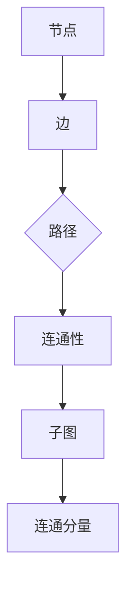
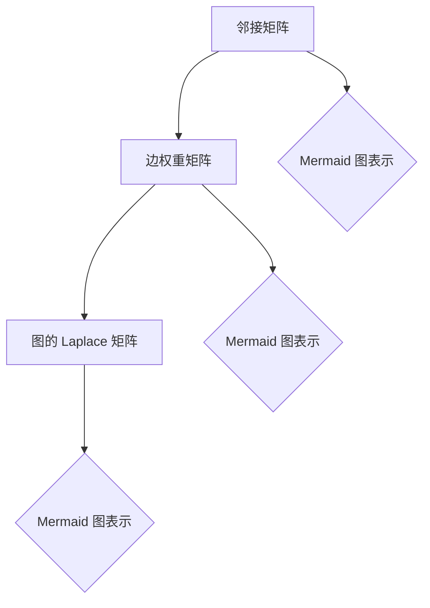

                 

# 《数学与图论：网络结构的数学表示》

## 关键词
- 数学表示
- 图论
- 网络结构
- 最短路径算法
- 生成树
- 最大流
- 随机游走模型

## 摘要
本文深入探讨了数学与图论在网络结构表示中的应用，包括基本概念、数学表示方法、核心算法原理，以及实际项目案例。通过图论中的节点、边、路径等概念，结合数学模型和公式，展示了如何用数学方法对网络结构进行精确表示。文章还详细讲解了最短路径算法、最小生成树算法和最大流算法，并通过实际项目案例，帮助读者理解理论在实际中的应用。

## 引言

在网络日益复杂的现代社会中，网络结构的分析与管理变得至关重要。从社交网络到通信网络，从互联网到交通网络，网络的各个方面都影响着我们的日常生活。为了有效地分析和理解这些复杂的网络结构，数学与图论提供了强大的工具和方法。图论作为数学的一个分支，专门研究图的结构和性质，而数学表示方法则为图的抽象和量化提供了理论基础。

本文将首先介绍图论的基本概念，包括节点、边、路径、连通性等。接着，我们将讨论如何使用数学方法来表示网络结构，如邻接矩阵、边权重矩阵和图的 Laplace 矩阵。在此基础上，我们将详细讲解图论中的核心算法，包括最短路径算法、最小生成树算法和最大流算法。最后，通过实际项目案例，我们将展示如何将理论应用于实际问题，并进行代码实现和分析。

## 图论的基本概念

在图论中，图（Graph）是一个由节点（Node）和边（Edge）组成的数学结构。节点表示图中的个体，而边表示节点之间的关系。以下是一些图论的基本概念：

### 节点与边
- **节点（Node）**：图中的每个个体被称为节点。节点可以表示为数字、字母或其他符号。
- **边（Edge）**：连接两个节点的线段称为边。边也可以是有向的（Directed）或无向的（Undirected）。

### 路径与连通性
- **路径（Path）**：路径是图中从一个节点到另一个节点的边的序列。路径可以是简单的，也可以是循环的。
- **连通性（Connectivity）**：如果图中任意两个节点都是连通的，则称该图为连通图。

### 子图与连通分量
- **子图（Subgraph）**：从图中选取一部分节点和边构成的新图称为子图。
- **连通分量（Connected Component）**：连通分量是图中最大的连通子图。

为了更好地理解这些概念，我们可以使用 Mermaid 图来表示它们之间的关系：



通过这个图，我们可以清晰地看到节点、边、路径、连通性、子图和连通分量之间的联系。

## 数学表示方法

数学表示方法在图论中扮演着重要的角色，它使得复杂的网络结构可以用简洁的数学形式表达。以下是几种常用的数学表示方法：

### 邻接矩阵
邻接矩阵（Adjacency Matrix）是一个二维数组，用于表示图中的节点和边。矩阵的行和列都对应于图中的节点，如果存在一条从节点 i 到节点 j 的边，则矩阵中的对应位置（i, j）的值为1，否则为0。例如，一个有 n 个节点的无向图的邻接矩阵如下所示：

$$
\begin{bmatrix}
0 & 1 & 0 & \cdots & 0 \\
1 & 0 & 1 & \cdots & 0 \\
0 & 1 & 0 & \cdots & 1 \\
\vdots & \vdots & \vdots & \ddots & \vdots \\
0 & 0 & 1 & \cdots & 0
\end{bmatrix}
$$

### 边权重矩阵
边权重矩阵（Weighted Adjacency Matrix）与邻接矩阵类似，但矩阵中的元素不是0或1，而是边之间的权重值。如果图中的边具有权重，我们可以使用边权重矩阵来表示它们。

### 图的 Laplace 矩阵
图的 Laplace 矩阵（Laplacian Matrix）是图论中的一个重要矩阵，它与图的连通性密切相关。Laplace 矩阵可以通过邻接矩阵和度矩阵（Degree Matrix）的运算得到。其定义如下：

$$
L = D - A
$$

其中，\(D\) 是度矩阵，\(A\) 是邻接矩阵。度矩阵是一个对角矩阵，对角线上的元素表示相应节点的度数。

为了更好地理解这些数学表示方法，我们可以使用 Mermaid 图来展示它们：



通过这个图，我们可以看到邻接矩阵、边权重矩阵和图的 Laplace 矩阵之间的联系，以及如何用 Mermaid 图表示它们。

## 核心算法讲解

图论中的核心算法在计算机网络分析、社交网络分析、路由算法等领域有着广泛的应用。以下是最短路径算法、最小生成树算法和最大流算法的详细讲解。

### 最短路径算法

最短路径算法用于寻找图中两点之间的最短路径。以下是最常用的两种最短路径算法：

#### Dijkstra 算法

Dijkstra 算法是一种基于贪心策略的算法，它通过迭代更新节点的最短路径估计值，直到找到所有节点的最短路径。以下是 Dijkstra 算法的伪代码：

```
Dijkstra(G, s):
    for each vertex v ∈ G.V:
        dist[v] ← INFINITY
        prev[v] ← UNDEFINED
    dist[s] ← 0
    Q ← G.V

    while Q is not empty:
        u ← vertex in Q with min dist[u]
        remove u from Q

        for each edge (u, v) ∈ G.E:
            if dist[u] + weight(u, v) < dist[v]:
                dist[v] ← dist[u] + weight(u, v)
                prev[v] ← u
```

#### A* 算法

A* 算法是一种启发式搜索算法，它结合了 Dijkstra 算法和贪心策略，通过估算每个节点的实际路径长度，优化了搜索过程。以下是 A* 算法的伪代码：

```
A*(G, s, g):
    openSet ← {s}
    gScore[s] ← 0
    fScore[s] ← heuristic(s, g)

    while openSet is not empty:
        current ← vertex in openSet with the lowest fScore[] value
        if current = g:
            return reconstruct_path(prev[current])

        remove current from openSet

        for each neighbor of current:
            if neighbor is not in openSet:
                add neighbor to openSet
            tentative_gScore ← gScore[current] + length(current, neighbor)

            if tentative_gScore < gScore[neighbor]:
                prev[neighbor] ← current
                gScore[neighbor] ← tentative_gScore
                fScore[neighbor] ← gScore[neighbor] + heuristic(neighbor, g)
```

### 最小生成树算法

最小生成树算法用于从图中生成一棵包含所有节点的树，且边的总权重最小。以下是最常用的两种最小生成树算法：

#### Prim 算法

Prim 算法是一种贪心算法，它从一个节点开始，逐渐扩展生成树，直到包含所有节点。以下是 Prim 算法的伪代码：

```
Prim(G, r):
    T ← {}
    A ← {r}
    while A does not contain all vertices:
        for each edge (u, v) ∈ G.E such that u ∈ A and v ∉ A:
            if weight(u, v) is the minimum weight edge connecting A and V - A:
                add edge (u, v) to T
                A ← A ∪ {v}
```

#### Kruskal 算法

Kruskal 算法是一种基于排序的贪心算法，它按边的权重顺序选择边，并确保不形成环。以下是 Kruskal 算法的伪代码：

```
Kruskal(G):
    sort all edges in non-decreasing order of their weight
    T ← {}
    for each edge (u, v) ∈ G.E:
        if find(u) ≠ find(v):
            add edge (u, v) to T
            union(u, v)

    return T
```

### 最大流算法

最大流算法用于计算网络中从源点到汇点的最大流量。以下是最常用的两种最大流算法：

#### Ford-Fulkerson 算法

Ford-Fulkerson 算法是一种基于增广路径的概念的算法，它通过寻找增广路径并更新流量，直到无法找到增广路径为止。以下是 Ford-Fulkerson 算法的伪代码：

```
FordFulkerson(G, s, t):
    while there exists an augmenting path from s to t:
        path ← find_augmenting_path(s, t)
        augment流量 along path
```

#### Edmonds-Karp 算法

Edmonds-Karp 算法是 Ford-Fulkerson 算法的一个改进版本，它使用广度优先搜索来寻找增广路径。以下是 Edmonds-Karp 算法的伪代码：

```
EdmondsKarp(G, s, t):
    while there exists a path from s to t:
        path ← BFS(s, t)
        augment流量 along path
```

## 数学模型与公式

在图论中，数学模型和公式用于描述图的结构和性质。以下是一些重要的数学模型和公式：

### 随机游走模型

随机游走模型描述了图中节点之间的随机游走过程。在无向图中，节点的状态转移矩阵可以表示为：

$$
P = \begin{bmatrix}
0 & p_{12} & \cdots & p_{1n} \\
p_{21} & 0 & \cdots & p_{2n} \\
\vdots & \vdots & \ddots & \vdots \\
p_{n1} & p_{n2} & \cdots & 0
\end{bmatrix}
$$

其中，\(p_{ij}\) 表示从节点 i 到节点 j 的概率。

### 图的 Laplace 矩阵

图的 Laplace 矩阵是图论中的一个重要矩阵，它与图的连通性密切相关。Laplace 矩阵可以通过邻接矩阵和度矩阵的运算得到，其定义如下：

$$
L = D - A
$$

其中，\(D\) 是度矩阵，\(A\) 是邻接矩阵。

### Markov 链模型

Markov 链模型描述了图中节点的状态转移过程。在无向图中，状态转移矩阵可以表示为：

$$
P = \begin{bmatrix}
p_{11} & p_{12} & \cdots & p_{1n} \\
p_{21} & p_{22} & \cdots & p_{2n} \\
\vdots & \vdots & \ddots & \vdots \\
p_{n1} & p_{n2} & \cdots & p_{nn}
\end{bmatrix}
$$

其中，\(p_{ij}\) 表示从状态 i 到状态 j 的概率。

## 项目实战

### 社交网络分析

在社交网络分析中，图论和数学模型可以用来分析用户之间的关系和社交网络的结构。以下是一个简单的项目案例：

#### 项目背景

假设我们有一个包含用户和用户之间关系的社交网络。我们的目标是分析用户之间的社交关系，并识别出社交网络中的关键节点。

#### 环境搭建

我们使用 Python 和 NetworkX 库来构建和操作社交网络。首先，我们需要安装 NetworkX：

```
pip install networkx
```

#### 代码实现

以下是一个简单的代码实现，用于构建社交网络并计算节点的度数：

```python
import networkx as nx
import matplotlib.pyplot as plt

# 创建一个无向图
G = nx.Graph()

# 添加节点和边
G.add_nodes_from([1, 2, 3, 4, 5])
G.add_edges_from([(1, 2), (1, 3), (2, 4), (3, 4), (4, 5)])

# 绘制图
nx.draw(G, with_labels=True)
plt.show()

# 计算节点的度数
degrees = dict(G.degree())

# 打印节点的度数
for node, degree in degrees.items():
    print(f"节点 {node} 的度数为：{degree}")
```

#### 代码解读与分析

在这个项目中，我们首先创建了一个无向图，并添加了节点和边。然后，我们使用 `nx.draw` 函数绘制了图，并使用 `dict(G.degree())` 计算了每个节点的度数。最后，我们打印了每个节点的度数。

通过这个简单的项目，我们可以看到如何使用图论和数学模型来分析社交网络。我们可以进一步使用其他算法，如最短路径算法和社区检测算法，来深入了解社交网络的性质。

### 路由算法应用

在路由算法应用中，我们通常需要选择最优路径来传输数据。以下是一个简单的项目案例：

#### 项目背景

假设我们有一个网络，其中多个节点需要传输数据到汇点。我们的目标是选择最优路径，以最大化传输效率。

#### 环境搭建

我们使用 Python 和 NetworkX 库来构建和操作网络。首先，我们需要安装 NetworkX：

```
pip install networkx
```

#### 代码实现

以下是一个简单的代码实现，用于构建网络并选择最优路径：

```python
import networkx as nx
import matplotlib.pyplot as plt

# 创建一个有向图
G = nx.DiGraph()

# 添加节点和边
G.add_nodes_from([1, 2, 3, 4, 5])
G.add_edges_from([(1, 2), (1, 3), (2, 4), (3, 4), (4, 5), (4, 1)])

# 添加边权重
weights = {1: 2, 2: 1, 3: 3, 4: 1, 5: 2}
G = nx.relabel_nodes(G, lambda x: x+1)

# 绘制图
nx.draw(G, with_labels=True)
plt.show()

# 选择最优路径
path = nx.single_source_dijkstra(G, source=1, target=5)

# 打印最优路径
print("最优路径：", path)
```

#### 代码解读与分析

在这个项目中，我们首先创建了一个有向图，并添加了节点和边。然后，我们使用 `nx.relabel_nodes` 函数为节点重新命名，以便在图中绘制。接下来，我们使用 `nx.single_source_dijkstra` 函数计算从源节点 1 到汇点 5 的最短路径。最后，我们打印了最优路径。

通过这个简单的项目，我们可以看到如何使用路由算法来选择最优路径。在实际应用中，我们可能需要考虑更多的因素，如带宽、延迟和可靠性等。

## 最佳实践 tips

在进行网络分析和算法设计时，以下是一些最佳实践 tips：

- **数据预处理**：在进行分析之前，确保数据质量。清洗数据，去除噪声和异常值。
- **算法选择**：根据问题的性质选择合适的算法。对于大规模网络，考虑使用分布式算法。
- **性能优化**：在实现算法时，注意性能优化。使用高效的算法和数据结构，减少计算复杂度。
- **代码可读性**：编写清晰、可读的代码，以便他人理解和使用。

## 小结

本文深入探讨了数学与图论在网络结构表示中的应用，从基本概念到核心算法，再到实际项目案例，全面展示了图论在网络分析中的重要性。通过数学模型和公式，我们能够精确地表示网络结构，并通过算法找到最优路径和最大流量。在实际应用中，图论和数学方法为我们提供了强大的工具，帮助我们理解和优化复杂的网络系统。

## 注意事项

- **算法实现**：在实际项目中，确保算法的实现是正确的，并能够处理各种特殊情况。
- **数据隐私**：在进行社交网络分析时，注意保护用户隐私，避免泄露敏感信息。
- **算法性能**：对于大规模网络，考虑使用分布式计算和并行算法，以提高性能。

## 拓展阅读

- 《算法导论》（Introduction to Algorithms） - Thomas H. Cormen, Charles E. Leiserson, Ronald L. Rivest, Clifford Stein
- 《图论及其应用》（Graph Theory and Its Applications） - Jonathan L. Gross, Jay Y. Wong
- 《社交网络分析导论》（Introduction to Social Network Analysis） - Matthew S. Johnson

## 作者信息

作者：AI天才研究院/AI Genius Institute & 禅与计算机程序设计艺术 /Zen And The Art of Computer Programming

