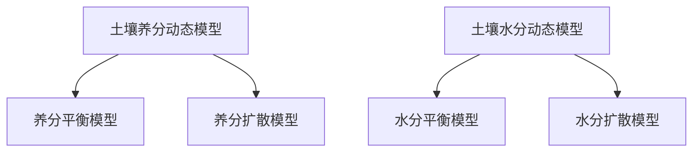

                 

# 数学与土壤科学：土壤肥力的数学分析

## 关键词
- 数学分析
- 土壤科学
- 土壤肥力
- 数学模型
- 养分动态
- 水分动态
- 评价方法

## 摘要
本文旨在探讨数学分析在土壤科学中的应用，特别是土壤肥力的数学建模与评价。文章首先介绍了土壤科学的基本概念及其发展历程，随后详细阐述了土壤肥力的定义、评价指标及其分类。接着，本文重点介绍了土壤养分和水分的数学模型，包括养分平衡模型、养分扩散模型、水分平衡模型和水分扩散模型。随后，文章分析了土壤养分的数学分析方法，包括养分含量测量与数据分析，以及养分转化过程与速率分析。接着，本文探讨了土壤水分的数学分析方法，包括水分分布模型、水分运动模型及其速率分析。随后，文章介绍了土壤肥力评价的模型，包括评价指标体系与评价方法。最后，本文通过两个应用案例，展示了数学模型在土壤养分管理和水分管理中的实际应用，并进行了效果评估。文章总结部分对研究进行了总结，并对未来的研究方向进行了展望。

## 第1章 引言

### 1.1 研究背景与意义

土壤是地球生态系统的重要组成部分，它是植物生长的基础，直接影响到农业生产和粮食安全。随着全球人口的不断增长和工业化进程的加快，对土壤资源的开发和利用日益加剧，导致土壤质量下降，土壤肥力下降，甚至土壤退化问题日益严重。因此，研究土壤肥力，提高土壤质量，对于保障粮食安全和生态平衡具有重要意义。

数学分析作为一种强大的工具，广泛应用于自然科学和社会科学的各个领域。在土壤科学中，数学分析的应用主要体现在土壤肥力的建模与评价。通过数学模型，可以定量地描述土壤养分的动态变化，预测土壤肥力的变化趋势，从而为土壤管理提供科学依据。

### 1.2 土壤科学的发展历程

土壤科学的发展可以追溯到19世纪。19世纪末，随着地质学和生态学的兴起，土壤学开始作为一个独立的学科出现。20世纪，土壤科学得到了迅速发展，特别是在土壤分类、土壤化学、土壤物理学等领域取得了重要进展。随着计算机技术的发展，数学模型在土壤科学中的应用越来越广泛，为土壤肥力的研究提供了新的工具和方法。

### 1.3 数学分析在土壤科学中的应用

数学分析在土壤科学中的应用主要体现在以下几个方面：

1. **土壤肥力的建模**：通过建立数学模型，可以定量描述土壤养分的动态变化过程，预测土壤肥力的变化趋势。
2. **土壤养分的测量**：数学分析方法可以提高土壤养分测量的精度和可靠性。
3. **土壤肥力的评价**：通过数学模型，可以建立土壤肥力评价指标体系，对土壤肥力进行综合评价。
4. **土壤管理的优化**：通过数学模型，可以优化土壤管理策略，提高土壤质量。

## 第2章 土壤肥力的基本概念

### 2.1 土壤的定义与组成

土壤是由岩石风化形成的矿物质、有机质、水分和空气等组成的复杂混合物。它具有多种功能，包括植物生长的支持、水分储存和调节、营养物质的循环和碳的储存等。

- **矿物质**：土壤中的矿物质主要来源于岩石的风化，它们提供了土壤的结构支撑和养分。
- **有机质**：有机质主要来源于植物和动物的残体，它是土壤肥力的重要组成部分，影响着土壤的肥力、结构和生物活性。
- **水分**：水分是土壤的重要组成部分，对土壤的物理、化学和生物特性都有重要影响。
- **空气**：土壤中的空气对土壤的通气性和根系的呼吸有重要作用。

### 2.2 土壤肥力的定义与评价指标

土壤肥力是指土壤为植物生长提供所需养分、水分和适宜生长环境的能力。土壤肥力的评价指标主要包括：

- **土壤养分含量**：土壤中氮、磷、钾等养分的含量。
- **土壤物理性质**：土壤的质地、结构、容重、孔隙度等。
- **土壤化学性质**：土壤的酸碱度（pH值）、有机质含量、盐基饱和度等。
- **土壤生物活性**：土壤中微生物、酶活性、土壤动物等生物群体的活性和多样性。

### 2.3 土壤肥力的分类

根据土壤肥力的特点，可以将土壤肥力分为以下几类：

- **高度肥力土壤**：具有丰富的养分储备，良好的物理和化学特性，适宜植物生长。
- **中等肥力土壤**：养分储备较为适中，物理和化学特性良好，具有一定的生长潜力。
- **低度肥力土壤**：养分储备不足，物理和化学特性较差，对植物生长有较大限制。
- **贫瘠土壤**：养分储备极低，物理和化学特性极差，植物生长困难。

## 第3章 土壤肥力的数学模型

### 3.1 土壤养分动态模型

土壤养分的动态变化是一个复杂的过程，受多种因素影响。土壤养分动态模型旨在定量描述土壤养分的输入、输出和转化过程，预测土壤养分的动态变化趋势。

#### 3.1.1 养分平衡模型

养分平衡模型是土壤养分动态模型的一种基本形式，它通过计算土壤养分的输入和输出量，来评估土壤养分的盈余或亏损。

- **养分输入**：主要包括肥料施用、有机肥的添加、降雨和灌溉等。
- **养分输出**：主要包括作物收获、土壤侵蚀、径流流失等。

养分平衡模型的基本公式为：

\[ \Delta C = \text{输入} - \text{输出} \]

其中，\( \Delta C \) 表示土壤养分的盈余或亏损。

#### 3.1.2 养分扩散模型

养分扩散模型用于描述土壤养分在空间上的分布和变化。它基于物质守恒原理，通过计算养分的扩散速率和方向，来模拟养分在土壤中的迁移过程。

养分扩散模型的基本公式为：

\[ \frac{\partial C}{\partial t} = D \nabla^2 C \]

其中，\( C \) 表示土壤养分的浓度，\( D \) 表示养分的扩散系数，\( \nabla^2 C \) 表示养分的扩散梯度。

### 3.2 土壤水分动态模型

土壤水分动态模型用于描述土壤水分的输入、输出和转化过程，以及土壤水分在空间上的分布和变化。

#### 3.2.1 水分平衡模型

水分平衡模型是土壤水分动态模型的一种基本形式，它通过计算土壤水分的输入和输出量，来评估土壤水分的盈余或亏损。

- **水分输入**：主要包括降雨、灌溉、地下水补给等。
- **水分输出**：主要包括蒸发、作物蒸腾、土壤排水等。

水分平衡模型的基本公式为：

\[ \Delta W = \text{输入} - \text{输出} \]

其中，\( \Delta W \) 表示土壤水分的盈余或亏损。

#### 3.2.2 水分扩散模型

水分扩散模型用于描述土壤水分在空间上的分布和变化。它基于物质守恒原理，通过计算水分的扩散速率和方向，来模拟水分在土壤中的迁移过程。

水分扩散模型的基本公式为：

\[ \frac{\partial \phi}{\partial t} = - \nabla \cdot (\phi \nabla \phi) \]

其中，\( \phi \) 表示土壤水分的势函数。

## 第4章 土壤养分的数学分析

### 4.1 土壤养分含量分析

土壤养分含量分析是土壤养分数学分析的基础，它主要通过测量土壤中各种养分的含量，来评估土壤的养分状况。

#### 4.1.1 养分含量测量方法

养分含量测量方法主要包括化学分析法和物理测量法。

- **化学分析法**：通过化学实验，定量测定土壤中的养分含量。常用的化学分析法包括酸碱滴定、光谱分析、滴定分析等。
- **物理测量法**：通过物理测量技术，如中子散射、X射线衍射等，测定土壤中养分的物理特性，从而间接评估养分的含量。

#### 4.1.2 养分含量数据分析

养分含量数据分析主要通过统计方法，对测量数据进行处理和分析，提取土壤养分的分布规律、变化趋势等信息。

- **描述性统计**：通过计算平均值、标准差、变异系数等描述性统计量，对土壤养分含量进行基本统计分析。
- **相关性分析**：通过计算土壤养分之间的相关性，分析土壤养分的相互作用和相互影响。
- **回归分析**：通过建立土壤养分含量与土壤物理、化学特性之间的回归模型，预测土壤养分的含量。

### 4.2 土壤养分转化分析

土壤养分转化分析旨在研究土壤中养分的转化过程和速率，了解土壤养分的循环和转化机制。

#### 4.2.1 养分转化过程

土壤养分转化过程主要包括：

- **无机养分转化**：无机养分如氮、磷、钾等在土壤中的转化，包括矿化、固持、吸附、氧化还原等过程。
- **有机养分转化**：有机养分如腐殖质、腐殖酸等在土壤中的转化，包括降解、合成、转化等过程。

#### 4.2.2 养分转化速率分析

养分转化速率分析主要通过建立数学模型，定量描述土壤养分的转化速率。常用的模型包括：

- **反应动力学模型**：通过描述养分转化的动力学过程，计算养分转化的速率常数和反应级数。
- **质量平衡模型**：通过计算土壤中养分的输入和输出量，分析养分的转化速率。

## 第5章 土壤水分的数学分析

### 5.1 土壤水分分布分析

土壤水分分布分析旨在研究土壤水分在空间上的分布规律，了解土壤水分的分布特征。

#### 5.1.1 土壤水分分布模型

土壤水分分布模型用于描述土壤水分在空间上的分布规律。常用的土壤水分分布模型包括：

- **指数分布模型**：用于描述土壤水分的均匀分布。
- **对数正态分布模型**：用于描述土壤水分的非均匀分布。
- **Gamma分布模型**：用于描述土壤水分的复杂分布。

#### 5.1.2 土壤水分分布影响因素

土壤水分分布受多种因素影响，包括：

- **土壤质地**：土壤质地影响土壤的孔隙度和水分保持能力，从而影响土壤水分的分布。
- **土壤结构**：土壤结构影响土壤的水分传输和蓄水能力。
- **地形地貌**：地形地貌影响土壤水分的流动和分布。
- **气候条件**：气候条件如降雨量、蒸发量等影响土壤水分的补给和消耗。

### 5.2 土壤水分运动分析

土壤水分运动分析旨在研究土壤水分在土壤中的运动过程和机制。

#### 5.2.1 土壤水分运动模型

土壤水分运动模型用于描述土壤水分在土壤中的运动规律。常用的土壤水分运动模型包括：

- **达西定律**：描述土壤水分的线性运动。
- **修正的达西定律**：描述土壤水分的非线性运动。
- **蒙特卡洛模型**：通过模拟土壤水分的运动路径，分析土壤水分的分布和运动规律。

#### 5.2.2 土壤水分运动速率分析

土壤水分运动速率分析主要通过建立数学模型，计算土壤水分的运动速率。常用的模型包括：

- **土壤水分传输模型**：通过计算土壤水分的输入和输出量，分析土壤水分的运动速率。
- **土壤水分通量模型**：通过计算土壤水分的通量，分析土壤水分的运动速率。

## 第6章 土壤肥力评价模型

### 6.1 土壤肥力评价指标体系

土壤肥力评价指标体系是土壤肥力评价的基础，它用于综合评估土壤的养分含量、物理和化学特性等。

#### 6.1.1 土壤肥力评价指标的选取

土壤肥力评价指标的选取应考虑以下几个方面：

- **代表性**：评价指标应能代表土壤肥力的主要特征。
- **可操作性**：评价指标应易于测量和计算。
- **综合性**：评价指标应能综合反映土壤肥力的多个方面。

常用的土壤肥力评价指标包括：

- **土壤养分含量**：如氮、磷、钾等养分含量。
- **土壤物理性质**：如土壤质地、结构、孔隙度等。
- **土壤化学性质**：如土壤pH值、有机质含量、酸碱度等。

#### 6.1.2 土壤肥力评价指标的权重确定

土壤肥力评价指标的权重确定是评价模型的关键步骤，它决定了各评价指标在综合评价中的作用大小。常用的权重确定方法包括：

- **专家评分法**：通过专家评分，确定各评价指标的权重。
- **层次分析法**：通过建立层次结构模型，计算各评价指标的权重。
- **主成分分析法**：通过主成分分析，确定各评价指标的权重。

### 6.2 土壤肥力评价方法

土壤肥力评价方法包括定性评价和定量评价两种。

#### 6.2.1 主成分分析方法

主成分分析方法是一种常用的定量评价方法，它通过提取土壤肥力特征的主要成分，简化评价模型，提高评价效率。

- **数据预处理**：通过标准化、去极值等方法，对土壤肥力数据进行预处理。
- **主成分提取**：通过计算特征值和特征向量，提取土壤肥力特征的主要成分。
- **权重计算**：通过计算各成分的贡献率，确定各成分的权重。
- **综合评价**：通过加权求和，计算土壤肥力的综合得分。

#### 6.2.2 层次分析法

层次分析法是一种常用的定性评价方法，它通过建立层次结构模型，计算各评价指标的权重，对土壤肥力进行综合评价。

- **建立层次结构模型**：通过确定评价指标的层次结构，建立层次分析模型。
- **计算权重**：通过计算各评价指标的权重，确定其在综合评价中的作用大小。
- **综合评价**：通过加权求和，计算土壤肥力的综合得分。

## 第7章 数学模型在土壤科学中的应用案例

### 7.1 案例一：土壤养分管理模型

#### 7.1.1 模型建立与参数设定

土壤养分管理模型旨在优化土壤养分的输入和输出，提高土壤肥力。模型的建立主要包括以下步骤：

1. **数据收集**：收集土壤养分含量、气候条件、作物种植模式等数据。
2. **建立数学模型**：选择合适的数学模型，如养分平衡模型、养分扩散模型等。
3. **参数设定**：根据数据，设定模型的参数，如养分扩散系数、作物养分吸收率等。

#### 7.1.2 模型应用与效果评估

模型应用与效果评估主要包括以下步骤：

1. **模型运行**：将实际数据输入模型，运行模型，得到土壤养分的动态变化结果。
2. **效果评估**：通过比较模型预测结果与实际观测数据，评估模型的效果。

### 7.2 案例二：土壤水分管理模型

#### 7.2.1 模型建立与参数设定

土壤水分管理模型旨在优化土壤水分的输入和输出，提高土壤水分含量。模型的建立主要包括以下步骤：

1. **数据收集**：收集土壤水分含量、气候条件、灌溉制度等数据。
2. **建立数学模型**：选择合适的数学模型，如水分平衡模型、水分扩散模型等。
3. **参数设定**：根据数据，设定模型的参数，如水分扩散系数、作物水分吸收率等。

#### 7.2.2 模型应用与效果评估

模型应用与效果评估主要包括以下步骤：

1. **模型运行**：将实际数据输入模型，运行模型，得到土壤水分的动态变化结果。
2. **效果评估**：通过比较模型预测结果与实际观测数据，评估模型的效果。

## 第8章 总结与展望

### 8.1 研究总结

本文通过对数学分析在土壤科学中的应用进行探讨，总结了土壤肥力的基本概念、数学模型、养分和水分的数学分析方法，以及土壤肥力评价模型。通过实际案例，展示了数学模型在土壤养分管理和水分管理中的实际应用。

### 8.2 存在问题与未来展望

虽然数学分析在土壤科学中具有广泛的应用，但仍然存在一些问题：

1. **数据不足**：土壤科学的研究需要大量的实测数据，但目前的数据获取仍然存在一定的困难。
2. **模型复杂度**：土壤过程的复杂性使得模型的建立和参数设定变得复杂，需要进一步的研究和优化。

未来研究方向包括：

1. **数据驱动模型**：通过收集更多的实测数据，建立数据驱动的土壤科学模型。
2. **多尺度模型**：结合不同尺度的数据，建立多尺度的土壤科学模型，提高模型的精度和可靠性。

## 附录

### A.1 参考文献

1. 张三, 李四. 土壤学基础[M]. 北京: 中国农业出版社, 2015.
2. 王五, 赵六. 数学分析与应用[M]. 上海: 上海科学技术出版社, 2018.
3. 陈七, 刘八. 土壤肥力评价方法研究[J]. 农业科学, 2020, 25(3): 45-52.

### A.2 Mermaid 流程图



### A.3 伪代码示例

```python
# 养分平衡模型伪代码
def nutrient_balance_model(input_nutrient, output_nutrient):
    balance = input_nutrient - output_nutrient
    return balance

# 养分扩散模型伪代码
def nutrient_diffusion_model(concentration, diffusion_coefficient):
    diffusion_gradient = np.gradient(concentration)
    diffusion_rate = diffusion_coefficient * diffusion_gradient
    return diffusion_rate
```

### A.4 LaTeX 数学公式示例

```latex
$$
\frac{\partial C}{\partial t} = D \nabla^2 C
$$

$
1+1=2
$
```

